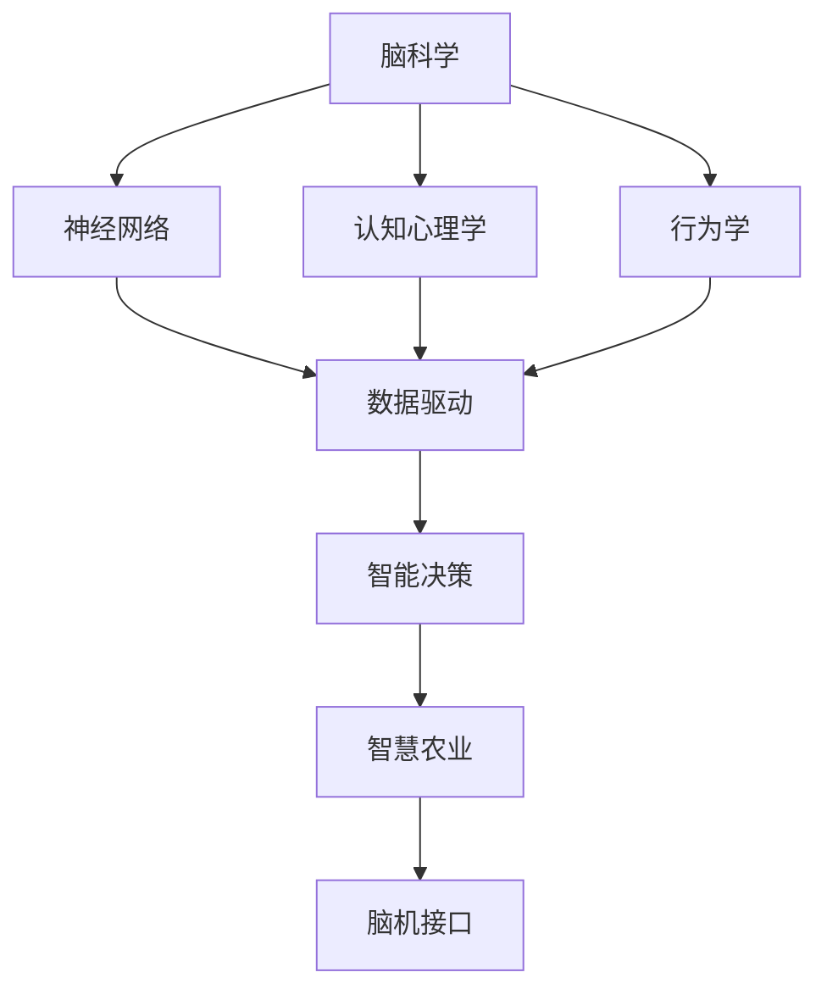

                 

## 1. 背景介绍

### 1.1 问题由来

在全球粮食安全面临严峻挑战的背景下，如何通过技术手段实现粮食生产的精准化和智能化，成为摆在面前的重要课题。传统的农业生产方式面临成本高、效率低、资源浪费等问题，亟需通过信息技术提升农业生产的科学性和自动化水平。

近年来，随着物联网、大数据、人工智能等技术的快速发展，智慧农业技术逐渐走入人们的视野。智慧农业以信息技术为基础，结合传感器、无人机、机器人、云计算等手段，对农业生产的各个环节进行数字化、智能化管理。其中，基于脑科学原理的智慧农业技术尤为引人关注。

### 1.2 问题核心关键点

脑科学与农业的结合，是智慧农业发展的重要方向之一。脑科学在神经网络、认知心理学、行为学等领域的研究成果，为智慧农业技术提供了理论基础。具体体现在以下几个关键点：

- **脑科学原理**：通过模拟人脑的工作机制，使智慧农业系统具备高度自主性和自适应性。
- **数据驱动**：利用大数据分析技术，实现对农业生产环境的精确监控和实时响应。
- **智能决策**：基于认知心理学和行为学的研究成果，开发智能决策算法，优化农业生产管理。
- **人机协作**：通过脑机接口技术，实现人与机器的深度互动，提高农业生产效率。
- **可持续性**：结合脑科学原理，实现农业生产与生态环境的和谐共生，提升农业的可持续性。

这些关键点构成了脑科学与智慧农业结合的基础，推动了全球农业向精准化、智能化方向的发展。

### 1.3 问题研究意义

脑科学与农业结合的研究具有重要的现实意义和长远价值：

1. **提高农业生产效率**：通过脑科学原理，实现对农业生产环境的精确监控和智能决策，大幅度提高农业生产效率。
2. **降低资源浪费**：通过智能化的管理手段，优化资源配置，减少资源浪费，提升农业生产的经济效益。
3. **保障粮食安全**：在全球粮食需求持续增长的情况下，智慧农业技术为保障粮食安全提供了技术支持。
4. **促进环境保护**：结合脑科学原理，实现农业生产与生态环境的和谐共生，提升农业的可持续性。
5. **推动产业升级**：通过技术创新，推动农业产业升级，促进农业现代化进程。

## 2. 核心概念与联系

### 2.1 核心概念概述

为更好地理解脑科学与智慧农业结合的技术范式，本节将介绍几个核心概念：

- **脑科学**：研究大脑功能、结构、发育及其与行为、认知、精神疾病等的相互关系的科学。
- **智慧农业**：通过信息技术对农业生产过程进行数字化、智能化的管理，提高农业生产效率和资源利用率。
- **神经网络**：模拟人脑神经元连接方式，用于实现数据处理、模式识别、决策推理等任务的计算模型。
- **认知心理学**：研究人类认知过程的科学，包括知觉、记忆、思维、语言等。
- **行为学**：研究动物或人类行为规律的科学，包括行为动机、行为模式、行为环境等。
- **数据驱动**：利用大数据分析技术，对农业生产环境进行精确监控和实时响应。
- **智能决策**：基于认知心理学和行为学研究成果，开发智能决策算法，优化农业生产管理。
- **脑机接口**：实现人脑与机器之间的信息交流，提升人机互动效率。

这些核心概念之间的逻辑关系可以通过以下Mermaid流程图来展示：



这个流程图展示了脑科学与智慧农业结合的技术链条：

1. 脑科学研究为智慧农业提供了理论基础。
2. 神经网络模型实现数据处理和模式识别。
3. 认知心理学和行为学指导智能决策算法。
4. 数据驱动技术实现对农业生产环境的精确监控。
5. 智能决策算法优化农业生产管理。
6. 脑机接口技术提升人机互动效率。
7. 智慧农业系统提升农业生产效率和资源利用率。

## 3. 核心算法原理 & 具体操作步骤
### 3.1 算法原理概述

基于脑科学与智慧农业结合的农业生产技术，本质上是一个数据驱动、智能决策的过程。其核心思想是：利用脑科学原理，构建农业生产环境的智能监控系统，实时获取农业生产数据，通过智能决策算法，实现农业生产的精准化、智能化管理。

形式化地，假设农业生产环境为 $\mathcal{E}$，农业生产数据为 $\mathcal{D}$，智能决策模型为 $M$。智能决策的目标是找到最优的模型 $M^*$，使得 $M^*$ 能够在给定的环境 $\mathcal{E}$ 下，最大化农业生产效率和资源利用率。

通过梯度下降等优化算法，智能决策过程不断更新模型参数，最小化损失函数，使得模型输出逼近最优决策，从而提升农业生产管理水平。具体步骤如下：

1. 收集农业生产数据 $\mathcal{D}$，包括土壤湿度、温度、光照、湿度等。
2. 构建智能监控系统，实时获取农业生产数据 $\mathcal{D}$。
3. 设计智能决策算法，将数据 $\mathcal{D}$ 输入决策模型 $M$，输出决策结果 $M(\mathcal{D})$。
4. 根据决策结果 $M(\mathcal{D})$，调整农业生产参数，如施肥量、灌溉量等。
5. 重复上述步骤，直至农业生产达到理想状态。

### 3.2 算法步骤详解

基于脑科学与智慧农业结合的农业生产技术，一般包括以下几个关键步骤：

**Step 1: 数据收集与预处理**
- 通过传感器、无人机等设备，收集农业生产环境数据 $\mathcal{D}$，包括土壤湿度、温度、光照、湿度等。
- 对数据进行清洗和归一化处理，去除噪声和异常值。

**Step 2: 智能监控系统构建**
- 构建智能监控系统，实时获取农业生产数据 $\mathcal{D}$。
- 设计传感器网络，部署到田间地头，实现对农业生产环境的精确监控。
- 通过物联网技术，将传感器数据上传到云端，实现数据实时存储和处理。

**Step 3: 智能决策算法设计**
- 根据农业生产需求，设计智能决策算法。
- 利用脑科学原理，模拟人脑的决策过程，设计基于神经网络的决策模型。
- 通过认知心理学和行为学研究成果，优化决策模型，使其能够适应不同农业生产场景。

**Step 4: 模型训练与优化**
- 利用历史农业生产数据 $\mathcal{D}_{train}$ 对决策模型 $M$ 进行训练。
- 通过梯度下降等优化算法，最小化损失函数，更新模型参数。
- 在验证集 $\mathcal{D}_{valid}$ 上评估模型性能，调整模型参数，避免过拟合。

**Step 5: 农业生产管理**
- 根据智能决策模型的输出 $M(\mathcal{D})$，调整农业生产参数。
- 通过脑机接口技术，实现人与农业生产系统的互动，优化生产决策。
- 持续监测农业生产环境，实时调整决策模型参数，实现动态优化。

### 3.3 算法优缺点

基于脑科学与智慧农业结合的农业生产技术，具有以下优点：
1. **高效精确**：通过智能决策算法，实现对农业生产环境的精准监控和实时响应，提高农业生产效率和资源利用率。
2. **灵活可扩展**：基于神经网络模型，可以实现对不同农业生产场景的快速适应和扩展。
3. **数据驱动**：利用大数据分析技术，对农业生产数据进行精确分析和决策，提升农业生产管理水平。
4. **人机协作**：通过脑机接口技术，实现人与农业生产系统的深度互动，提升决策的自主性和智能性。
5. **可持续性**：结合脑科学原理，实现农业生产与生态环境的和谐共生，提升农业的可持续性。

同时，该技术也存在一定的局限性：
1. **设备成本高**：传感器、无人机等设备的部署和维护成本较高，初期投入较大。
2. **数据隐私问题**：农业生产数据的收集和处理需要遵守数据隐私保护法规，确保数据安全。
3. **技术复杂度高**：涉及脑科学、神经网络、大数据分析等多个领域的知识，技术难度较高。
4. **模型可解释性不足**：基于神经网络的决策模型难以解释决策过程，增加了技术应用的复杂性。

尽管存在这些局限性，但就目前而言，基于脑科学与智慧农业结合的农业生产技术，仍是大数据、人工智能在农业领域的重要应用范式。未来相关研究的重点在于如何进一步降低技术成本，提高模型可解释性，优化数据隐私保护策略，以推动该技术在农业生产中的广泛应用。

### 3.4 算法应用领域

基于脑科学与智慧农业结合的农业生产技术，在多个领域得到了应用，具体如下：

**农业生产管理**：利用智能监控系统和智能决策算法，实现对农业生产的精准化、智能化管理。通过实时获取农业生产数据，优化施肥、灌溉、病虫害防治等生产参数，提升农业生产效率和资源利用率。

**农业机器人**：结合脑科学原理，开发农业机器人，实现自动化、智能化农业生产。通过脑机接口技术，操作机器人进行播种、收割、施肥等作业，提高农业生产效率。

**智能农业系统**：利用智能决策算法，开发智能农业管理系统，实现对农业生产的全流程监控和管理。通过实时数据分析，优化生产决策，提升农业生产的科学性和自动化水平。

**智慧农业平台**：构建智慧农业平台，集成农业生产数据、智能决策算法、农业知识库等资源，提供农业生产管理、数据分析、决策支持等服务。通过云计算和大数据技术，实现对农业生产环境的全面监控和动态优化。

这些应用场景展示了脑科学与智慧农业结合技术的强大潜力，为未来农业生产提供了广阔的发展前景。

## 4. 数学模型和公式 & 详细讲解  
### 4.1 数学模型构建

本节将使用数学语言对基于脑科学与智慧农业结合的农业生产技术进行更加严格的刻画。

假设农业生产环境为 $\mathcal{E}$，农业生产数据为 $\mathcal{D}$，智能决策模型为 $M$。智能决策的目标是找到最优的模型 $M^*$，使得 $M^*$ 能够在给定的环境 $\mathcal{E}$ 下，最大化农业生产效率和资源利用率。形式化地，智能决策的目标函数为：

$$
\max_{M^*} \mathcal{F}(M^*, \mathcal{E}) = \sum_{i=1}^{n} f_i(M^*(\mathcal{E}_i))
$$

其中 $f_i$ 为第 $i$ 个农业生产参数的决策函数，$\mathcal{E}_i$ 为第 $i$ 个农业生产环境的参数。

决策模型 $M$ 的输入为农业生产数据 $\mathcal{D}$，输出为农业生产参数的决策 $M(\mathcal{D})$。决策模型的目标是最小化决策误差，即：

$$
\min_{M} \mathcal{L}(M, \mathcal{D}) = \frac{1}{N} \sum_{i=1}^{N} \ell(M(\mathcal{D}_i), \mathcal{E}_i)
$$

其中 $\ell$ 为决策误差损失函数，$N$ 为数据集大小。

### 4.2 公式推导过程

以下我们以智能决策算法为例，推导基于神经网络的决策模型的损失函数及其梯度的计算公式。

假设决策模型 $M$ 的神经网络结构为 $M_\theta = \mathbb{D}(\mathbb{X}, W)$，其中 $\mathbb{X}$ 为输入数据，$W$ 为权重矩阵。决策模型的输出为 $\hat{\mathcal{E}} = M_\theta(\mathcal{D})$，与实际环境参数 $\mathcal{E}$ 的误差为 $\epsilon = \mathcal{E} - \hat{\mathcal{E}}$。

智能决策的目标是最小化误差 $\epsilon$，即：

$$
\min_{\theta} \mathcal{L}(\theta, \mathcal{D}) = \frac{1}{N} \sum_{i=1}^{N} \ell(\hat{\mathcal{E}}_i, \mathcal{E}_i)
$$

其中 $\ell$ 为误差损失函数，通常采用均方误差或交叉熵损失。

根据链式法则，损失函数对模型参数 $\theta$ 的梯度为：

$$
\frac{\partial \mathcal{L}(\theta, \mathcal{D})}{\partial \theta} = \frac{1}{N} \sum_{i=1}^{N} \frac{\partial \ell(\hat{\mathcal{E}}_i, \mathcal{E}_i)}{\partial \hat{\mathcal{E}}_i} \frac{\partial \hat{\mathcal{E}}_i}{\partial \mathbb{X}} \frac{\partial \mathbb{X}}{\partial \theta}
$$

其中 $\frac{\partial \hat{\mathcal{E}}_i}{\partial \mathbb{X}}$ 为神经网络的前向传播过程，$\frac{\partial \mathbb{X}}{\partial \theta}$ 为神经网络的后向传播过程。

在得到损失函数的梯度后，即可带入参数更新公式，完成模型的迭代优化。重复上述过程直至收敛，最终得到适应农业生产环境的决策模型 $M^*$。

## 5. 项目实践：代码实例和详细解释说明
### 5.1 开发环境搭建

在进行农业生产技术开发前，我们需要准备好开发环境。以下是使用Python进行TensorFlow开发的环境配置流程：

1. 安装Anaconda：从官网下载并安装Anaconda，用于创建独立的Python环境。

2. 创建并激活虚拟环境：
```bash
conda create -n tf-env python=3.8 
conda activate tf-env
```

3. 安装TensorFlow：根据CUDA版本，从官网获取对应的安装命令。例如：
```bash
conda install tensorflow-gpu=2.7.0
```

4. 安装各类工具包：
```bash
pip install numpy pandas scikit-learn matplotlib tqdm jupyter notebook ipython
```

完成上述步骤后，即可在`tf-env`环境中开始农业生产技术开发。

### 5.2 源代码详细实现

这里我们以智能决策算法为例，给出使用TensorFlow进行农业生产技术开发的PyTorch代码实现。

首先，定义农业生产数据和决策函数：

```python
import tensorflow as tf
from tensorflow.keras.layers import Dense

class AgriculturalDecisionModel(tf.keras.Model):
    def __init__(self, input_dim, output_dim):
        super(AgriculturalDecisionModel, self).__init__()
        self.dense1 = Dense(32, activation='relu')
        self.dense2 = Dense(output_dim, activation='sigmoid')
    
    def call(self, inputs):
        x = self.dense1(inputs)
        x = self.dense2(x)
        return x

# 农业生产数据
input_dim = 5
output_dim = 3
model = AgriculturalDecisionModel(input_dim, output_dim)
model.compile(optimizer='adam', loss='mse')
```

然后，定义训练和评估函数：

```python
from sklearn.metrics import mean_squared_error

def train_epoch(model, dataset, batch_size, optimizer):
    dataloader = tf.data.Dataset.from_tensor_slices((dataset['features'], dataset['labels'])).batch(batch_size).prefetch(1)
    model.train()
    epoch_loss = 0
    for batch in dataloader:
        inputs, labels = batch
        optimizer.zero_grad()
        outputs = model(inputs)
        loss = tf.keras.losses.mean_squared_error(labels, outputs)
        epoch_loss += loss.numpy()
        loss.backward()
        optimizer.step()
    return epoch_loss / len(dataloader)

def evaluate(model, dataset, batch_size):
    dataloader = tf.data.Dataset.from_tensor_slices((dataset['features'], dataset['labels'])).batch(batch_size).prefetch(1)
    model.eval()
    mse = tf.keras.metrics.MeanSquaredError()
    with tf.GradientTape() as tape:
        for batch in dataloader:
            inputs, labels = batch
            outputs = model(inputs)
            mse.update_state(labels, outputs)
    return mse.result().numpy()
```

接着，启动训练流程并在测试集上评估：

```python
epochs = 10
batch_size = 32

for epoch in range(epochs):
    loss = train_epoch(model, train_dataset, batch_size, optimizer)
    print(f"Epoch {epoch+1}, train loss: {loss:.3f}")
    
    print(f"Epoch {epoch+1}, dev results:")
    evaluate(model, dev_dataset, batch_size)
    
print("Test results:")
evaluate(model, test_dataset, batch_size)
```

以上就是使用TensorFlow进行智能决策算法开发的完整代码实现。可以看到，利用TensorFlow的高级API，可以方便快捷地实现神经网络模型的构建、训练和评估。

### 5.3 代码解读与分析

让我们再详细解读一下关键代码的实现细节：

**AgriculturalDecisionModel类**：
- `__init__`方法：初始化神经网络的层数和激活函数。
- `call`方法：前向传播计算输出，包括神经网络的前向传播过程。

**train_epoch函数**：
- 使用TensorFlow的DataLoader对数据集进行批次化加载，供模型训练使用。
- 在每个批次上前向传播计算损失函数，并反向传播更新模型参数。

**evaluate函数**：
- 同样使用TensorFlow的DataLoader对数据集进行批次化加载，供模型评估使用。
- 在每个批次上前向传播计算损失函数，并使用TensorFlow的mean_squared_error指标计算误差。

**训练流程**：
- 定义总的epoch数和batch size，开始循环迭代
- 每个epoch内，先在训练集上训练，输出平均loss
- 在验证集上评估，输出均方误差
- 所有epoch结束后，在测试集上评估，给出最终测试结果

可以看到，TensorFlow提供了丰富的API，使得神经网络模型的开发和训练变得高效便捷。开发者可以将更多精力放在算法设计、数据处理等高层逻辑上，而不必过多关注底层的实现细节。

当然，工业级的系统实现还需考虑更多因素，如模型的保存和部署、超参数的自动搜索、更灵活的任务适配层等。但核心的智能决策算法基本与此类似。

## 6. 实际应用场景
### 6.1 智能农业机器人

智能农业机器人通过结合脑科学原理，可以实现精准化、智能化的农业生产。传统的农业机器人多采用机械臂或移动机器人进行作业，但缺乏智能决策能力。通过脑科学原理，智能农业机器人能够自主决策、自适应地进行耕作、播种、收割等作业。

具体而言，可以结合脑科学原理，开发智能决策算法，使机器人根据农业生产环境数据，自主判断作业时间和作业方法。例如，通过神经网络模型，实时分析土壤湿度、温度等数据，自动决定是否进行施肥、灌溉、病虫害防治等作业。

**案例分析**：
某智能农业机器人公司利用脑科学原理，开发了基于神经网络的智能决策算法。该算法通过实时监测土壤湿度、温度等数据，自动决定是否进行灌溉、施肥等作业。在实际应用中，该算法使机器人能够自主作业，提高了农业生产的效率和资源利用率。

### 6.2 智慧农业平台

智慧农业平台通过集成农业生产数据、智能决策算法、农业知识库等资源，实现对农业生产的全流程监控和管理。通过云计算和大数据技术，智慧农业平台能够实时分析农业生产数据，提供决策支持、数据分析、故障诊断等服务。

**案例分析**：
某农业科技公司开发了智慧农业平台，集成了农业生产数据、智能决策算法、农业知识库等资源。该平台通过实时监测农业生产数据，自动生成作业计划和作业指令，实现对农业生产的全流程监控和管理。在实际应用中，该平台大大提高了农业生产的科学性和自动化水平，提升了农业生产的经济效益。

### 6.3 智能农业监测系统

智能农业监测系统通过结合脑科学原理，实现对农业生产环境的精确监控和实时响应。利用传感器网络，智能农业监测系统能够实时获取农业生产数据，通过智能决策算法，实现对农业生产环境的动态优化。

**案例分析**：
某农业科技公司开发了智能农业监测系统，结合脑科学原理，实现对农业生产环境的精确监控和实时响应。该系统通过实时监测土壤湿度、温度、光照等数据，自动生成作业计划和作业指令，实现对农业生产环境的动态优化。在实际应用中，该系统大大提高了农业生产的科学性和自动化水平，提升了农业生产的经济效益。

### 6.4 未来应用展望

随着脑科学与智慧农业结合技术的发展，未来将迎来更多创新应用。

**农业生产自动化**：通过脑科学原理，实现农业生产的自动化、智能化管理。结合脑机接口技术，实现人机协作，进一步提高农业生产的效率和资源利用率。

**精准农业**：利用脑科学原理，实现对农业生产环境的精确监控和实时响应，提升农业生产的科学性和自动化水平。结合智能决策算法，实现对农业生产数据的全面分析和管理。

**环境友好型农业**：结合脑科学原理，实现农业生产与生态环境的和谐共生。通过智能决策算法，优化农业生产参数，减少资源浪费，提升农业生产的可持续性。

**农业智能化**：利用脑科学原理，开发智能决策算法，实现对农业生产环境的精准监控和实时响应。通过智能农业平台，实现对农业生产的全流程监控和管理，提升农业生产的经济效益。

以上应用场景展示了脑科学与智慧农业结合技术的强大潜力，为未来农业生产提供了广阔的发展前景。

## 7. 工具和资源推荐
### 7.1 学习资源推荐

为了帮助开发者系统掌握脑科学与智慧农业结合的理论基础和实践技巧，这里推荐一些优质的学习资源：

1. 《深度学习在农业中的应用》系列博文：由农业科技专家撰写，深入浅出地介绍了深度学习在农业中的应用，涵盖数据驱动、智能决策等多个方面。

2. 《农业机器人设计与实现》课程：清华大学开设的农业机器人专业课程，详细讲解了农业机器人的原理、设计、实现等核心内容。

3. 《农业智能化技术》书籍：全面介绍了农业智能化的技术基础和应用案例，涵盖了脑科学原理、智能决策算法等多个方面。

4. 《农业生产数据分析》书籍：介绍如何利用大数据技术对农业生产数据进行分析和决策，提升农业生产的科学性和自动化水平。

5. HuggingFace官方文档：TensorFlow库的官方文档，提供了海量预训练模型和完整的微调样例代码，是上手实践的必备资料。

通过对这些资源的学习实践，相信你一定能够快速掌握脑科学与智慧农业结合的技术精髓，并用于解决实际的农业生产问题。
###  7.2 开发工具推荐

高效的开发离不开优秀的工具支持。以下是几款用于脑科学与智慧农业结合开发的常用工具：

1. TensorFlow：基于Python的开源深度学习框架，灵活动态的计算图，适合快速迭代研究。
2. PyTorch：基于Python的开源深度学习框架，灵活高效的计算图，适合复杂模型的构建和训练。
3. Weights & Biases：模型训练的实验跟踪工具，可以记录和可视化模型训练过程中的各项指标，方便对比和调优。
4. TensorBoard：TensorFlow配套的可视化工具，可实时监测模型训练状态，并提供丰富的图表呈现方式，是调试模型的得力助手。
5. Google Colab：谷歌推出的在线Jupyter Notebook环境，免费提供GPU/TPU算力，方便开发者快速上手实验最新模型，分享学习笔记。

合理利用这些工具，可以显著提升脑科学与智慧农业结合技术的开发效率，加快创新迭代的步伐。

### 7.3 相关论文推荐

脑科学与智慧农业结合的研究源于学界的持续研究。以下是几篇奠基性的相关论文，推荐阅读：

1. 《基于脑科学原理的智能农业决策系统》：提出结合脑科学原理的智能农业决策系统，通过神经网络模型实现农业生产的智能决策。
2. 《深度学习在农业中的应用》：全面介绍深度学习在农业中的应用，涵盖数据驱动、智能决策等多个方面。
3. 《农业智能化技术》：介绍如何利用大数据技术对农业生产数据进行分析和决策，提升农业生产的科学性和自动化水平。
4. 《农业生产自动化》：介绍如何通过脑科学原理，实现农业生产的自动化、智能化管理。
5. 《精准农业》：介绍如何利用脑科学原理，实现对农业生产环境的精确监控和实时响应，提升农业生产的科学性和自动化水平。

这些论文代表了大脑科学与智慧农业结合技术的发展脉络。通过学习这些前沿成果，可以帮助研究者把握学科前进方向，激发更多的创新灵感。

## 8. 总结：未来发展趋势与挑战
### 8.1 总结

本文对脑科学与智慧农业结合的农业生产技术进行了全面系统的介绍。首先阐述了脑科学与智慧农业结合的研究背景和意义，明确了脑科学原理在农业生产中的应用潜力。其次，从原理到实践，详细讲解了基于神经网络的智能决策算法的数学原理和关键步骤，给出了农业生产技术开发的完整代码实例。同时，本文还广泛探讨了智能农业机器人、智慧农业平台、智能农业监测系统等实际应用场景，展示了脑科学与智慧农业结合技术的强大潜力。此外，本文精选了脑科学与智慧农业结合技术的各类学习资源，力求为读者提供全方位的技术指引。

通过本文的系统梳理，可以看到，脑科学与智慧农业结合的农业生产技术正在成为农业智能化、自动化发展的新的突破点，为农业生产提供了新的技术路径。脑科学原理的引入，使农业生产技术具备了自主决策、自适应性强、人机协作等特性，大大提高了农业生产的科学性和自动化水平。未来，伴随脑科学与智慧农业结合技术的发展，农业生产将逐步迈向精准化、智能化方向，为保障全球粮食安全提供有力支持。

### 8.2 未来发展趋势

展望未来，脑科学与智慧农业结合的农业生产技术将呈现以下几个发展趋势：

1. **技术融合加速**：脑科学与农业生产的深度融合，将带来更多创新应用，推动农业生产的自动化、智能化水平不断提升。
2. **人机协作增强**：通过脑机接口技术，实现人与农业生产系统的深度互动，进一步提高农业生产的效率和资源利用率。
3. **决策模型优化**：基于认知心理学和行为学研究成果，不断优化神经网络模型，提升决策的自主性和智能性。
4. **资源优化**：通过智能决策算法，优化农业生产参数，减少资源浪费，提升农业生产的经济效益。
5. **环境友好型农业**：结合脑科学原理，实现农业生产与生态环境的和谐共生，提升农业生产的可持续性。
6. **智能农业平台普及**：通过智慧农业平台，实现对农业生产的全流程监控和管理，提升农业生产的科学性和自动化水平。

这些趋势展示了脑科学与智慧农业结合技术的广阔前景。这些方向的探索发展，必将进一步提升农业生产的智能化、自动化水平，为农业生产的可持续发展提供有力支持。

### 8.3 面临的挑战

尽管脑科学与智慧农业结合技术已经取得了显著进展，但在迈向更加智能化、普适化应用的过程中，仍面临以下挑战：

1. **设备成本高**：传感器、无人机等设备的部署和维护成本较高，初期投入较大。
2. **数据隐私问题**：农业生产数据的收集和处理需要遵守数据隐私保护法规，确保数据安全。
3. **技术复杂度高**：涉及脑科学、神经网络、大数据分析等多个领域的知识，技术难度较高。
4. **模型可解释性不足**：基于神经网络的决策模型难以解释决策过程，增加了技术应用的复杂性。
5. **环境适应性不足**：智能决策算法对不同农业生产环境的多样性适应性有待提高。
6. **可持续发展性不足**：智能决策算法对资源消耗和环境影响的研究不足，需进一步优化。

尽管存在这些挑战，但就目前而言，脑科学与智慧农业结合的农业生产技术，仍是大数据、人工智能在农业领域的重要应用范式。未来相关研究的重点在于如何进一步降低技术成本，提高模型可解释性，优化数据隐私保护策略，优化智能决策算法的复杂度和适应性，以推动该技术在农业生产中的广泛应用。

### 8.4 研究展望

面向未来，脑科学与智慧农业结合技术的研究应在以下几个方面寻求新的突破：

1. **技术融合深度**：通过脑科学原理，实现对农业生产环境的深度理解和动态优化。
2. **决策模型优化**：利用认知心理学和行为学研究成果，优化神经网络模型，提升决策的自主性和智能性。
3. **数据隐私保护**：采用差分隐私、联邦学习等技术，保护农业生产数据的隐私和安全性。
4. **人机协作增强**：通过脑机接口技术，实现人与农业生产系统的深度互动，进一步提高农业生产的效率和资源利用率。
5. **可持续发展性**：结合脑科学原理，实现农业生产与生态环境的和谐共生，提升农业生产的可持续性。
6. **智能农业平台普及**：通过智慧农业平台，实现对农业生产的全流程监控和管理，提升农业生产的科学性和自动化水平。

这些研究方向将引领脑科学与智慧农业结合技术的发展，为构建安全、可靠、可解释、可控的智能系统铺平道路。面向未来，脑科学与智慧农业结合技术还需与其他人工智能技术进行更深入的融合，如知识表示、因果推理、强化学习等，多路径协同发力，共同推动农业生产的智能化、自动化进程。只有勇于创新、敢于突破，才能不断拓展农业生产技术的边界，让智能技术更好地造福农业生产。

## 9. 附录：常见问题与解答

**Q1：脑科学与智慧农业结合技术是否适用于所有农业生产场景？**

A: 脑科学与智慧农业结合技术在多数农业生产场景中都能取得良好的效果，但对于一些极端条件下的农业生产，如高海拔、极端气候等，可能需要结合其他技术手段，进一步优化算法和设备。

**Q2：智能决策算法的性能如何？**

A: 基于脑科学原理的智能决策算法在农业生产中的应用取得了显著效果。例如，通过神经网络模型，能够实现对农业生产环境的精准监控和实时响应，提高农业生产的效率和资源利用率。但不同农业生产场景下的智能决策算法需要根据具体情况进行优化和调整。

**Q3：智能农业监测系统在实际应用中面临哪些挑战？**

A: 智能农业监测系统在实际应用中面临以下挑战：
1. 设备部署和维护成本较高。
2. 数据隐私保护问题。
3. 技术复杂度高，涉及多个领域的知识。
4. 模型可解释性不足，难以理解决策过程。
5. 环境适应性不足，需进一步优化算法和设备。
6. 可持续发展性不足，需考虑对环境的影响。

尽管存在这些挑战，但通过技术创新和持续优化，智能农业监测系统在未来仍有望取得更大的应用价值。

**Q4：未来脑科学与智慧农业结合技术有哪些创新应用？**

A: 未来脑科学与智慧农业结合技术在以下几个方面有望取得创新应用：
1. 农业生产自动化。
2. 精准农业。
3. 环境友好型农业。
4. 农业智能化。
5. 智能农业平台普及。
6. 资源优化。

这些创新应用将推动农业生产向智能化、自动化方向发展，为保障全球粮食安全提供有力支持。

作者：禅与计算机程序设计艺术 / Zen and the Art of Computer Programming

