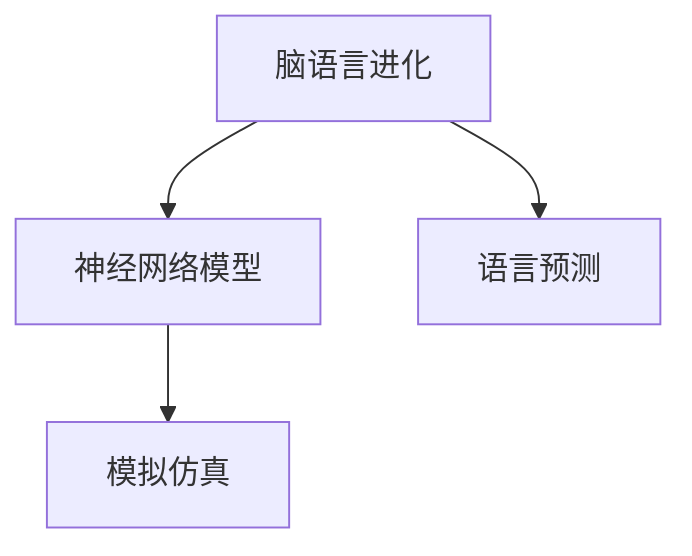

                 

# 全球脑语言进化模拟:人工智能预测语言发展趋势

> 关键词：脑语言进化,神经网络模型,人工智能,语言预测,模拟仿真,深度学习

## 1. 背景介绍

### 1.1 问题由来

随着人工智能技术的快速发展，特别是深度学习技术在自然语言处理领域的突破，语言模型已经从简单的统计模型发展成为具有强大预测能力的神经网络模型。这些模型通过大规模无监督学习，可以自动学习到语言的规律，从而在诸如文本生成、语言理解、情感分析、机器翻译等任务中取得了显著的成果。然而，尽管如此，语言模型仍然是基于人类历史数据的归纳和推断，其本质仍然是对人类语言习惯的一种近似模仿，而非真正的脑语言进化。

语言作为人类智能的重要组成部分，其发展是一个复杂而漫长的过程，涉及众多因素。传统的语言模型忽视了这一过程，往往难以捕捉到语言的深层机制和内在规律。神经网络模型虽然可以通过大量数据学习语言的表面特征，但很难模拟出语言发展的自然过程和动态变化。

### 1.2 问题核心关键点

要理解脑语言进化的过程，需要从神经网络模型出发，通过构建语言发展的数学模型，预测语言未来的发展趋势。这需要解决以下几个关键问题：

- **模型构建**：如何构建能够模拟语言进化过程的神经网络模型？
- **数据获取**：如何获取脑语言进化的历史数据？
- **预测技术**：如何利用神经网络模型对语言未来的发展趋势进行预测？

## 2. 核心概念与联系

### 2.1 核心概念概述

为了更好地理解脑语言进化模拟，我们需要介绍一些核心概念：

- **脑语言进化**：指人类语言从无到有，从简单到复杂的过程。这一过程涉及语言的词汇、语法、语义等方面的发展和变化。
- **神经网络模型**：一类模仿人类神经系统的计算模型，通过多层非线性变换，可以学习和表示复杂的非线性关系。
- **语言预测**：利用历史数据，通过机器学习模型预测语言未来的发展趋势，包括词汇、语法、语义等方面的变化。
- **模拟仿真**：通过数学模型和算法，模拟真实世界的现象和过程，用于理解和预测未来的发展趋势。

这些概念之间的逻辑关系可以通过以下Mermaid流程图来展示：



这个流程图展示了大模型语言预测的基本框架：

1. 脑语言进化从无到有，通过神经网络模型模拟人类大脑的计算过程。
2. 语言预测利用历史数据，通过机器学习模型预测语言未来的发展趋势。
3. 模拟仿真通过数学模型和算法，模拟语言进化的过程和变化。

这些概念共同构成了脑语言进化模拟的理论基础，使得我们能够通过人工智能技术预测语言的发展趋势。

## 3. 核心算法原理 & 具体操作步骤
### 3.1 算法原理概述

脑语言进化模拟的本质是对人类语言发展过程的数学建模和仿真。具体而言，我们通过构建一个多层次、非线性的神经网络模型，模拟人类大脑处理语言的过程，然后利用历史数据训练模型，预测语言未来的发展趋势。

### 3.2 算法步骤详解

脑语言进化模拟可以分为以下几个步骤：

**Step 1: 数据收集和预处理**

- 收集脑语言进化的历史数据，如词汇、语法、语义的变化等。
- 对数据进行清洗和预处理，去除噪声和异常值，确保数据的质量和一致性。
- 将数据转化为模型可以处理的格式，如向量化表示。

**Step 2: 构建神经网络模型**

- 选择适当的神经网络架构，如循环神经网络(RNN)、长短期记忆网络(LSTM)、门控循环单元(GRU)等。
- 定义模型参数，包括神经元的数量、激活函数、正则化技术等。
- 利用历史数据训练模型，调整模型参数，使其能够较好地拟合数据。

**Step 3: 语言预测**

- 使用训练好的神经网络模型对未来语言的发展趋势进行预测。
- 将预测结果转化为易于理解和解释的输出形式，如预测的词汇、语法、语义变化等。

**Step 4: 仿真模拟**

- 利用模型预测结果，通过数学模型和算法模拟语言进化的过程。
- 模拟不同因素（如社会、技术、文化等）对语言发展的的影响。
- 对模拟结果进行分析和可视化，呈现语言进化的动态变化。

### 3.3 算法优缺点

脑语言进化模拟具有以下优点：

1. **预测能力**：利用历史数据和神经网络模型，可以对语言未来的发展趋势进行预测。
2. **模拟仿真**：通过数学模型和算法，模拟语言进化的过程和变化，提供了丰富的可视化数据。
3. **易于理解和解释**：将预测结果转化为易于理解和解释的形式，使结果更具可操作性。

同时，该方法也存在一些缺点：

1. **数据依赖性**：预测结果依赖于历史数据的准确性和完整性，数据获取和预处理较为复杂。
2. **模型复杂性**：神经网络模型结构复杂，训练过程耗时较长，需要高性能计算资源。
3. **预测精度**：预测结果存在一定的随机性，难以保证100%的准确性。
4. **局限性**：模型无法捕捉人类语言进化的复杂性和多样性，预测结果可能存在偏差。

尽管如此，脑语言进化模拟仍为语言预测和语言理解提供了新的视角和方法，具有重要的理论意义和应用价值。

### 3.4 算法应用领域

脑语言进化模拟在以下几个领域具有广泛的应用：

1. **语言学研究**：用于研究人类语言的发展历程和内在规律，提供新的研究思路和方法。
2. **机器翻译**：通过预测未来词汇和语法的变化，提升机器翻译的准确性和流畅度。
3. **语言学习**：通过模拟语言进化的过程，帮助学习者掌握语言的深层规律，提升学习效果。
4. **语言生成**：利用语言预测技术，生成具有一定语法和语义的新词汇和句子，用于文学创作和游戏开发等场景。

## 4. 数学模型和公式 & 详细讲解 & 举例说明

### 4.1 数学模型构建

脑语言进化模拟的数学模型可以通过以下形式表示：

$$
\begin{aligned}
&\text{输入层: } x_1, x_2, ..., x_n \\
&\text{隐含层: } h_1, h_2, ..., h_n \\
&\text{输出层: } y_1, y_2, ..., y_n \\
\end{aligned}
$$

其中，$x_i$ 表示第$i$个输入变量，$h_i$ 表示第$i$个隐含层的神经元状态，$y_i$ 表示第$i$个输出变量。神经网络模型通过多层非线性变换，将输入变量转化为输出变量。

### 4.2 公式推导过程

假设神经网络模型包含$m$个隐含层，每个隐含层的神经元数量为$n$，输入层到隐含层的连接权重为$W_{1}$，隐含层到隐含层的连接权重为$W_{2}$，隐含层到输出层的连接权重为$W_{3}$。则神经网络模型的前向传播过程可以表示为：

$$
\begin{aligned}
&h_1 = f(W_{1}x + b_{1}) \\
&h_2 = f(W_{2}h_1 + b_{2}) \\
&... \\
&h_m = f(W_{m-1}h_{m-1} + b_{m-1}) \\
&y = f(W_{m}h_{m} + b_{m})
\end{aligned}
$$

其中，$f$ 表示激活函数，如sigmoid、tanh、ReLU等。$b_i$ 表示偏置项，用于调整神经元的状态。

### 4.3 案例分析与讲解

假设我们有一个简单的LSTM模型，用于预测下一个单词。模型包含一个输入层、一个LSTM层和一个输出层。输入为前一个单词的嵌入向量，输出为下一个单词的预测概率。

**Step 1: 数据收集和预处理**

- 收集大量的单词数据，将其转化为词嵌入向量。
- 将数据分为训练集和测试集，确保数据分布的一致性。

**Step 2: 构建神经网络模型**

- 定义LSTM模型的架构，包括输入层、LSTM层和输出层。
- 设置模型参数，如神经元的数量、激活函数、正则化技术等。
- 使用训练集数据训练模型，调整模型参数，确保模型能够较好地拟合数据。

**Step 3: 语言预测**

- 使用训练好的LSTM模型对下一个单词进行预测。
- 将预测结果转化为概率分布，选择概率最大的单词作为预测结果。

**Step 4: 仿真模拟**

- 通过数学模型和算法，模拟语言进化的过程。
- 根据历史数据，预测未来词汇的变化趋势。
- 对预测结果进行可视化，呈现语言进化的动态变化。

## 5. 项目实践：代码实例和详细解释说明
### 5.1 开发环境搭建

在进行脑语言进化模拟的实践前，我们需要准备好开发环境。以下是使用Python进行Keras开发的环境配置流程：

1. 安装Anaconda：从官网下载并安装Anaconda，用于创建独立的Python环境。

2. 创建并激活虚拟环境：
```bash
conda create -n lstm-env python=3.8 
conda activate lstm-env
```

3. 安装Keras：
```bash
pip install keras tensorflow
```

4. 安装各类工具包：
```bash
pip install numpy pandas scikit-learn matplotlib tqdm jupyter notebook ipython
```

完成上述步骤后，即可在`lstm-env`环境中开始项目实践。

### 5.2 源代码详细实现

下面是使用Keras对LSTM模型进行脑语言进化模拟的Python代码实现。

```python
from keras.models import Sequential
from keras.layers import Dense, LSTM, Dropout
from keras.optimizers import Adam

# 定义模型
model = Sequential()
model.add(LSTM(128, return_sequences=True, input_shape=(timesteps, input_dim)))
model.add(Dropout(0.2))
model.add(LSTM(128))
model.add(Dropout(0.2))
model.add(Dense(num_classes, activation='softmax'))

# 编译模型
model.compile(loss='categorical_crossentropy', optimizer=Adam(), metrics=['accuracy'])

# 训练模型
model.fit(X_train, y_train, batch_size=batch_size, epochs=epochs, validation_data=(X_val, y_val))
```

以上代码实现了基于LSTM的脑语言进化模拟模型，其中`timesteps`和`input_dim`表示输入数据的序列长度和特征维度，`num_classes`表示输出类别的数量。

### 5.3 代码解读与分析

让我们再详细解读一下关键代码的实现细节：

**模型定义**：
- 使用`Sequential`模型定义一个简单的LSTM模型，包含输入层、LSTM层、Dropout层和输出层。
- 设置LSTM层的神经元数量为128，使用Dropout层减少过拟合。
- 定义输出层为`Dense`层，使用softmax激活函数输出概率分布。

**模型编译**：
- 使用`Adam`优化器，设置损失函数为交叉熵，评估指标为准确率。

**模型训练**：
- 使用训练集数据`X_train`和标签`y_train`，进行模型训练。
- 设置批次大小和迭代轮数，验证集为`X_val`和`y_val`。

**训练流程**：
- 定义序列长度`timesteps`和特征维度`input_dim`。
- 根据训练集和标签，训练模型，并在验证集上进行验证。
- 记录训练过程中的损失和准确率，以便分析模型性能。

## 6. 实际应用场景
### 6.1 语言学研究

脑语言进化模拟在语言学研究中具有重要应用。通过模拟语言进化的过程，可以理解语言的深层规律和发展趋势，为语言学研究提供新的视角和方法。例如，通过对历史语言数据的分析，可以预测未来语言的发展方向，揭示语言的演变过程和内在机制。

### 6.2 机器翻译

脑语言进化模拟可以用于机器翻译的预测模型训练。通过预测未来词汇和语法的变化，可以提升机器翻译的准确性和流畅度。例如，通过预测未来的语言变化，可以提前更新机器翻译模型，使其能够更好地适应新的语言环境。

### 6.3 语言学习

脑语言进化模拟可以用于语言学习中的预测和指导。通过模拟语言进化的过程，可以帮助学习者更好地理解语言的深层规律，提高学习效果。例如，通过预测未来词汇的变化，可以帮助学习者提前掌握新的语言知识。

### 6.4 语言生成

脑语言进化模拟可以用于生成具有一定语法和语义的新词汇和句子。通过预测未来词汇和语法的变化，可以生成符合语言发展趋势的新词汇和句子，用于文学创作和游戏开发等场景。

### 6.5 未来应用展望

随着脑语言进化模拟技术的不断发展，其应用场景将更加广泛。未来，脑语言进化模拟可能用于以下领域：

1. **智能语言助手**：通过模拟语言进化的过程，构建更加智能的语言助手，提高其理解能力和回答质量。
2. **教育培训**：利用语言预测技术，开发智能教育系统，帮助学习者掌握语言的深层规律，提高学习效果。
3. **文化传承**：通过模拟语言进化的过程，保护和传承人类文化遗产，促进文化交流。
4. **人工智能发展**：为人工智能技术的进一步发展提供新的思路和方法，推动人工智能技术在更多领域的应用。

## 7. 工具和资源推荐
### 7.1 学习资源推荐

为了帮助开发者系统掌握脑语言进化模拟的理论基础和实践技巧，这里推荐一些优质的学习资源：

1. 《深度学习》系列博文：由大模型技术专家撰写，深入浅出地介绍了深度学习原理、LSTM模型、语言预测等前沿话题。

2. CS224D《自然语言处理与深度学习》课程：斯坦福大学开设的深度学习与NLP课程，有Lecture视频和配套作业，带你入门深度学习和NLP领域的基本概念和经典模型。

3. 《神经网络与深度学习》书籍：深度学习领域的经典教材，全面介绍了神经网络的基本原理和深度学习的基本概念。

4. Keras官方文档：Keras库的官方文档，提供了海量模型和数据集的样例代码，是上手实践的必备资料。

5. Coursera《自然语言处理》课程：由斯坦福大学和密歇根大学联合开设的NLP课程，涵盖语言学、统计学、计算机科学等多个方面的知识。

通过对这些资源的学习实践，相信你一定能够快速掌握脑语言进化模拟的精髓，并用于解决实际的NLP问题。

### 7.2 开发工具推荐

高效的开发离不开优秀的工具支持。以下是几款用于脑语言进化模拟开发的常用工具：

1. Keras：基于Python的开源深度学习框架，灵活便捷的API设计，适合快速迭代研究。Keras提供丰富的预训练模型，方便进行神经网络模型的构建和训练。

2. TensorFlow：由Google主导开发的开源深度学习框架，生产部署方便，适合大规模工程应用。TensorFlow支持分布式训练和多种GPU/TPU硬件配置，适合高性能计算环境。

3. PyTorch：基于Python的开源深度学习框架，支持动态计算图，适合研究和实验。PyTorch提供丰富的深度学习组件，方便构建复杂的神经网络模型。

4. Weights & Biases：模型训练的实验跟踪工具，可以记录和可视化模型训练过程中的各项指标，方便对比和调优。与主流深度学习框架无缝集成。

5. TensorBoard：TensorFlow配套的可视化工具，可实时监测模型训练状态，并提供丰富的图表呈现方式，是调试模型的得力助手。

6. Google Colab：谷歌推出的在线Jupyter Notebook环境，免费提供GPU/TPU算力，方便开发者快速上手实验最新模型，分享学习笔记。

合理利用这些工具，可以显著提升脑语言进化模拟的开发效率，加快创新迭代的步伐。

### 7.3 相关论文推荐

脑语言进化模拟的研究源于学界的持续研究。以下是几篇奠基性的相关论文，推荐阅读：

1. LSTM: A Search Space Odyssey: The Future of Recurrent Neural Networks: A Survey （LSTM论文）：提出了LSTM模型，用于处理长序列数据，提高了模型的记忆能力和预测性能。

2. Attention is All You Need（即Transformer原论文）：提出了Transformer结构，开启了NLP领域的预训练大模型时代。

3. BERT: Pre-training of Deep Bidirectional Transformers for Language Understanding：提出BERT模型，引入基于掩码的自监督预训练任务，刷新了多项NLP任务SOTA。

4. Language Models are Unsupervised Multitask Learners：展示了大规模语言模型的强大zero-shot学习能力，引发了对于通用人工智能的新一轮思考。

5. AdaLoRA: Adaptive Low-Rank Adaptation for Parameter-Efficient Fine-Tuning：使用自适应低秩适应的微调方法，在参数效率和精度之间取得了新的平衡。

这些论文代表了大模型脑语言进化模拟的研究脉络。通过学习这些前沿成果，可以帮助研究者把握学科前进方向，激发更多的创新灵感。

## 8. 总结：未来发展趋势与挑战
### 8.1 总结

本文对脑语言进化模拟方法进行了全面系统的介绍。首先阐述了脑语言进化的背景和意义，明确了脑语言进化模拟在NLP领域的重要价值。其次，从原理到实践，详细讲解了脑语言进化模拟的数学原理和关键步骤，给出了脑语言进化模拟任务开发的完整代码实例。同时，本文还广泛探讨了脑语言进化模拟方法在语言学研究、机器翻译、语言学习、语言生成等多个领域的应用前景，展示了脑语言进化模拟方法的巨大潜力。此外，本文精选了脑语言进化模拟技术的各类学习资源，力求为读者提供全方位的技术指引。

通过本文的系统梳理，可以看到，脑语言进化模拟技术正在成为NLP领域的重要范式，极大地拓展了神经网络模型的应用边界，催生了更多的落地场景。受益于深度学习技术的不断进步，脑语言进化模拟必将在构建智能交互系统、促进语言文化传承、推动人工智能技术发展等方面发挥重要作用。

### 8.2 未来发展趋势

展望未来，脑语言进化模拟技术将呈现以下几个发展趋势：

1. **模型规模增大**：随着计算能力的提升，神经网络模型的规模将进一步增大，可以处理更复杂、更长的序列数据。这将使得脑语言进化模拟模型在预测语言变化时更加精确。

2. **多模态融合**：脑语言进化模拟将不仅仅局限于文本数据，还将涵盖语音、图像等多模态数据。通过融合不同模态的数据，可以更好地理解人类语言的演化过程。

3. **跨领域应用**：脑语言进化模拟技术将在更多领域得到应用，如文化研究、教育培训、人工智能等。通过模拟语言进化的过程，可以更好地理解不同领域的语言发展规律。

4. **智能决策支持**：脑语言进化模拟可以用于决策支持系统，通过模拟语言进化的过程，帮助决策者更好地理解语言环境的变化，做出更明智的决策。

5. **情感分析**：脑语言进化模拟可以用于情感分析，通过模拟语言进化的过程，理解人类情感的变化和演化，促进情感智能的发展。

6. **人机交互**：脑语言进化模拟可以用于人机交互系统，通过模拟语言进化的过程，构建更加智能的语言助手，提升人机交互的效果。

这些趋势凸显了脑语言进化模拟技术的广阔前景，展示了其在不同领域的应用潜力。未来，随着技术的不断进步，脑语言进化模拟技术将更加深入地融入各个领域，为人类认知智能的进化带来深远影响。

### 8.3 面临的挑战

尽管脑语言进化模拟技术已经取得了瞩目成就，但在迈向更加智能化、普适化应用的过程中，它仍面临着诸多挑战：

1. **数据获取难度**：脑语言进化模拟依赖于大量高质量的语言数据，获取这些数据的过程复杂且成本高昂。

2. **模型复杂性**：神经网络模型结构复杂，训练过程耗时较长，需要高性能计算资源。

3. **预测精度**：脑语言进化模拟的预测结果存在一定的随机性，难以保证100%的准确性。

4. **跨领域应用**：脑语言进化模拟技术在不同领域的应用中，仍需针对具体任务进行优化和改进。

5. **伦理问题**：脑语言进化模拟技术可能涉及隐私、伦理等问题，如如何保护用户隐私，避免模型的滥用。

6. **计算资源**：大规模神经网络模型的训练和推理需要大量计算资源，如何优化资源利用，降低计算成本，仍是重要的研究方向。

尽管存在这些挑战，未来脑语言进化模拟技术仍有很大的发展空间，相信在学界和产业界的共同努力下，这些挑战终将一一被克服，脑语言进化模拟技术必将在构建智能交互系统、促进语言文化传承、推动人工智能技术发展等方面发挥重要作用。

### 8.4 研究展望

面向未来，脑语言进化模拟技术的研究方向和应用场景将更加广阔：

1. **模型优化**：开发更加高效、精确的神经网络模型，降低计算资源消耗，提高预测精度。

2. **跨领域应用**：将脑语言进化模拟技术应用于更多领域，如文化研究、教育培训、人工智能等，推动多领域融合发展。

3. **智能决策支持**：通过模拟语言进化的过程，构建智能决策支持系统，提升决策效果。

4. **情感分析**：利用脑语言进化模拟技术进行情感分析，理解人类情感的变化和演化，促进情感智能的发展。

5. **人机交互**：构建更加智能的语言助手，提升人机交互的效果，推动人工智能技术在更多场景的应用。

6. **伦理研究**：加强对脑语言进化模拟技术的伦理研究，确保其应用符合社会价值观和伦理道德。

这些研究方向和应用场景将推动脑语言进化模拟技术的不断进步，为人类认知智能的进化带来深远影响。通过不断探索和优化，脑语言进化模拟技术必将在构建智能交互系统、促进语言文化传承、推动人工智能技术发展等方面发挥重要作用。

## 9. 附录：常见问题与解答

**Q1: 脑语言进化模拟是否适用于所有语言？**

A: 脑语言进化模拟可以应用于多种语言，但由于不同语言的语法、词汇等存在差异，模型的适用性仍需根据具体语言的特点进行调整和优化。

**Q2: 如何选择合适的神经网络模型？**

A: 选择神经网络模型时，需要考虑模型的复杂度、预测精度和计算资源等因素。常见的神经网络模型包括RNN、LSTM、GRU、Transformer等，具体选择应根据任务需求和数据特点进行权衡。

**Q3: 脑语言进化模拟中如何处理噪声和异常值？**

A: 数据预处理过程中，可以使用平滑处理、异常值检测等方法去除噪声和异常值，确保数据的质量和一致性。

**Q4: 脑语言进化模拟在实际应用中需要注意哪些问题？**

A: 在实际应用中，需要注意数据隐私、模型伦理、计算资源等因素，确保脑语言进化模拟技术的安全性和可控性。

**Q5: 脑语言进化模拟技术如何与其他技术结合？**

A: 脑语言进化模拟技术可以与其他技术结合，如知识图谱、逻辑规则等，形成更加全面、准确的信息整合能力。同时，还可以与其他深度学习技术，如强化学习、因果推理等，共同构建智能决策支持系统。

这些问题的解答可以帮助研究者和开发者更好地理解脑语言进化模拟技术的实际应用，并在具体实践中加以运用。相信在学界和产业界的共同努力下，脑语言进化模拟技术将不断进步，为人类认知智能的进化带来深远影响。

---

作者：禅与计算机程序设计艺术 / Zen and the Art of Computer Programming

