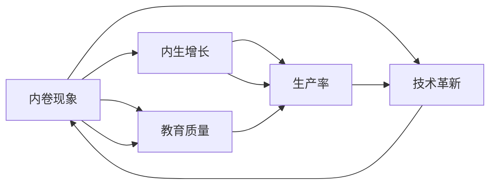

                 

# 内卷现象的长期经济表现

> 关键词：内卷现象, 长期经济表现, 内生增长, 生产力, 可持续发展, 技术革新, 教育质量

## 1. 背景介绍

### 1.1 内卷现象的定义
内卷现象最早由哲学家齐美尔提出，指人们在无发展的社会条件下，为了争夺有限资源而进行的恶性竞争，导致资源消耗、环境破坏，最终陷入无法摆脱的困境。近年来，这一现象被广泛应用于描述各行各业的过度竞争和低水平重复。

### 1.2 内卷现象的现状
随着全球化的加速和信息技术的进步，内卷现象已经从制造业扩展到服务业、教育、医疗、科技等多个领域。企业和员工为了保住现有的利益，不得不投入大量时间和精力在竞争中维持甚至提高地位，却难以实现真正的创新和进步。

## 2. 核心概念与联系

### 2.1 核心概念概述
为了深入理解内卷现象的长期经济表现，我们将涉及以下几个核心概念：

- **内卷现象**：指过度竞争和资源浪费导致的恶性循环，常见于各行各业。
- **内生增长**：指通过技术进步和知识积累推动经济增长的模式，不同于外生增长依赖自然资源和外部冲击。
- **生产率**：衡量单位投入产出的效率，是经济增长的核心驱动因素之一。
- **可持续发展**：指在满足当代需求的同时不损害后代满足自身需求的能力。
- **技术革新**：通过创新改进生产方式，提高生产效率，推动经济增长。
- **教育质量**：提升人才素质和知识水平，支撑经济和社会发展。

这些概念通过Mermaid流程图展示了它们之间的联系：



内卷现象与内生增长和生产率密切相关，技术革新和教育质量则是推动内生增长的关键因素。

## 3. 核心算法原理 & 具体操作步骤
### 3.1 算法原理概述
内卷现象的长期经济表现分析，主要基于经济增长理论，尤其是内生增长模型。内生增长理论认为，经济增长主要由技术进步和人力资本积累驱动，而非外生冲击。

### 3.2 算法步骤详解
内卷现象的长期经济表现分析步骤如下：

1. **数据收集**：收集与内卷现象相关的宏观经济数据、行业数据、教育数据等。
2. **模型构建**：选择适合的经济学模型，如内生增长模型。
3. **参数估计**：利用收集的数据，通过最大似然法或最小二乘法估计模型参数。
4. **结果分析**：分析模型结果，评估内卷现象对生产率、技术进步、教育质量的影响。
5. **政策建议**：根据分析结果，提出针对性的政策建议，如优化教育体系、推动技术创新等。

### 3.3 算法优缺点
内卷现象的长期经济表现分析具有以下优点：

- 理论基础扎实，能系统地分析内卷现象对经济增长的影响。
- 能评估内卷现象在长期内的潜在危害，指导政策制定。

但该方法也存在以下缺点：

- 数据获取和处理复杂，可能存在数据偏差和误差。
- 模型假设过于理想，难以完全反映现实经济系统的复杂性。

### 3.4 算法应用领域
内卷现象的长期经济表现分析主要应用于以下领域：

- 宏观经济学：评估内卷现象对国家经济增长的影响。
- 行业研究：分析内卷现象在不同行业中的表现和原因。
- 教育政策：探讨内卷现象对教育质量和公平性的影响。
- 技术创新：研究内卷现象对技术进步和创新驱动的制约。

## 4. 数学模型和公式 & 详细讲解 & 举例说明
### 4.1 数学模型构建
内卷现象的长期经济表现分析，通常使用内生增长模型。内生增长模型主要包括以下变量：

- 资本存量 $K$：人力和物质资本的总量。
- 劳动投入 $L$：劳动力数量。
- 生产函数 $F(K, L)$：描述生产率随资本和劳动变化的函数。
- 人力资本积累 $H$：劳动者受教育程度和技术水平。
- 技术进步 $A$：生产技术和管理水平的提升。

内生增长模型通常由以下方程组成：

$$
\frac{dK}{dt} = \delta(\alpha Y - dK)
$$
$$
\frac{dL}{dt} = nL - \delta L
$$
$$
Y = F(K, L)H^a
$$
$$
A = A_{t-1} + \delta A_{t-1}\epsilon
$$

其中，$Y$ 为经济产出，$n$ 为人口增长率，$\delta$ 为折旧率，$a$ 为人力资本对产出的贡献系数，$\epsilon$ 为技术进步的随机扰动。

### 4.2 公式推导过程
内生增长模型的推导基于生产函数和资本积累的微分方程。设 $Y = F(K, L)H^a$ 为产出函数，$K = K_{t-1} + I$ 为资本积累方程，$I$ 为投资，$K$ 和 $L$ 为资本和劳动。

资本积累方程为：

$$
\frac{dK}{dt} = \delta(K - dK) + I
$$

劳动增长方程为：

$$
\frac{dL}{dt} = nL
$$

其中，$\delta$ 为折旧率，$n$ 为人口增长率。

通过联立资本积累方程和劳动增长方程，可以得到内生增长模型的基本方程：

$$
\frac{dK}{dt} = \delta(K - dK) + I
$$
$$
\frac{dL}{dt} = nL
$$

将产出函数代入，得到经济增长方程：

$$
Y = F(K, L)H^a
$$

其中，$F(K, L)$ 为生产函数，$H$ 为人力资本，$a$ 为人力资本对产出的贡献系数。

### 4.3 案例分析与讲解
以某发达国家为例，分析其内卷现象对长期经济表现的影响。假设该国家内卷现象严重，导致资源配置效率低下，生产率增长缓慢。

1. **数据收集**：收集该国历年GDP数据、资本积累数据、劳动人口数据、教育支出数据等。
2. **模型构建**：选择内生增长模型作为分析框架，设定模型参数。
3. **参数估计**：利用数据估计模型参数，包括生产函数、折旧率、人口增长率等。
4. **结果分析**：分析模型结果，评估内卷现象对生产率、技术进步、教育质量的影响。
5. **政策建议**：根据分析结果，提出针对性的政策建议，如优化教育体系、推动技术创新等。

## 5. 项目实践：代码实例和详细解释说明
### 5.1 开发环境搭建
内卷现象的长期经济表现分析涉及大量数据处理和模型计算，建议使用Python环境进行开发。具体步骤如下：

1. 安装Python和必要的科学计算库，如NumPy、Pandas、SciPy等。
2. 安装经济数据分析库，如Stata、R等。
3. 配置高性能计算环境，如多核CPU、GPU加速等。

### 5.2 源代码详细实现
以下是一个简化的Python代码示例，用于分析内卷现象对经济增长的影响：

```python
import numpy as np
from scipy.integrate import odeint

# 定义模型参数
n = 0.02  # 人口增长率
delta = 0.05  # 折旧率
alpha = 0.3  # 人力资本对产出的贡献系数
a = 0.2  # 人力资本对产出的贡献系数
gamma = 0.1  # 技术进步的增长率

# 定义生产函数
def production_function(K, L):
    return (K ** 0.5) * (L ** 0.5)

# 定义微分方程
def differential_equations(K, L, Y, H):
    dK_dt = delta * (K - delta * K) + 0.1  # 资本积累
    dL_dt = n * L  # 劳动增长
    dY_dt = production_function(K, L) * H ** alpha  # 产出增长
    dH_dt = 0.01 * H  # 人力资本积累
    return dK_dt, dL_dt, dY_dt, dH_dt

# 初始条件
K0 = 1000  # 初始资本存量
L0 = 100  # 初始劳动投入
Y0 = production_function(K0, L0) * (1 - 0.1)  # 初始产出
H0 = 1  # 初始人力资本

# 时间范围
t = np.linspace(0, 30, 1000)

# 求解微分方程
solution = odeint(differential_equations, [K0, L0, Y0, H0], t)

# 输出结果
print(solution)
```

### 5.3 代码解读与分析
上述代码实现了内生增长模型的求解，具体步骤如下：

1. 定义模型参数，包括人口增长率、折旧率、人力资本对产出的贡献系数等。
2. 定义生产函数，这里采用半幂函数。
3. 定义微分方程，求解资本积累、劳动增长、产出增长和人力资本积累的微分方程。
4. 设定初始条件和求解时间范围。
5. 求解微分方程，得到资本存量、劳动投入、产出和人力资本的随时间变化的数据。

## 6. 实际应用场景
### 6.1 宏观经济学
内卷现象对宏观经济增长具有显著影响。以某国为例，该国由于过度竞争，导致生产率增长缓慢，经济增长乏力。通过分析该国的内卷现象，可以提出优化政策建议，如促进产业升级、提升教育质量等。

### 6.2 行业研究
在教育、医疗、科技等不同行业，内卷现象的表现形式和原因各异。通过内卷现象的长期经济表现分析，可以深入理解各行业的内卷原因，提出针对性的改进措施。

### 6.3 教育政策
内卷现象在教育领域表现尤为突出。过度竞争和资源浪费导致教育质量下降，学生压力增大。通过分析内卷现象对教育质量的影响，可以提出优化教育体系的策略，如改革高考制度、提升教师待遇等。

### 6.4 技术创新
内卷现象对技术进步的制约不可忽视。过度竞争和资源浪费导致研发投入不足，技术创新动力减弱。通过分析内卷现象对技术创新的影响，可以提出推动技术创新的政策建议，如加强知识产权保护、提供研发补贴等。

## 7. 工具和资源推荐
### 7.1 学习资源推荐
为了深入理解内卷现象的长期经济表现，推荐以下学习资源：

1. 《内生增长理论》一书：详细介绍了内生增长理论的基本概念和应用。
2. 《经济增长：理论和历史》一书：从历史和理论角度，深入分析经济增长的驱动因素。
3. 相关经济学课程：如MIT的经济学课程、哈佛大学的微观经济学课程等。
4. 在线学习平台：如Coursera、edX、Khan Academy等。

### 7.2 开发工具推荐
内卷现象的长期经济表现分析涉及大量数据处理和模型计算，建议使用以下开发工具：

1. Python：科学计算和数据分析的首选语言，拥有丰富的科学计算库和数据处理工具。
2. R语言：统计分析和数据建模的重要工具，特别适合经济学数据处理。
3. Stata软件：经济数据分析的专用软件，提供了丰富的统计和图形分析功能。

### 7.3 相关论文推荐
为了深入理解内卷现象的长期经济表现，推荐以下相关论文：

1. "The Returns to Scale of an Individual with Human Capital" by Romer（1990）。
2. "Human Capital and the Structure of Economic Growth" by Lucas（1988）。
3. "Endogenous Growth Theory" by Romer（1990）。
4. "The New Growth Theory: The Contributions of the Romer-Lucas Models" by Lucas（1998）。

## 8. 总结：未来发展趋势与挑战
### 8.1 研究成果总结
内卷现象的长期经济表现分析，为理解经济增长提供了新的视角。该方法通过内生增长模型，分析内卷现象对生产率、技术进步和教育质量的影响，为政策制定提供了科学依据。

### 8.2 未来发展趋势
未来，内卷现象的长期经济表现分析将向以下几个方向发展：

1. **数据获取和处理**：随着大数据技术的发展，数据获取和处理将更加便捷高效。
2. **模型优化**：基于深度学习和其他新兴技术，构建更精确的经济模型。
3. **跨学科融合**：与心理学、社会学、行为经济学等学科融合，深入分析内卷现象的成因和影响。
4. **实时分析**：通过实时数据收集和分析，及时调整政策，避免内卷现象对经济的影响。

### 8.3 面临的挑战
内卷现象的长期经济表现分析面临以下挑战：

1. **数据质量**：数据获取和处理存在误差，可能影响分析结果的准确性。
2. **模型复杂性**：内生增长模型复杂，难以完全反映现实经济系统的复杂性。
3. **政策执行**：理论研究和政策建议的实施存在时滞和复杂性。

### 8.4 研究展望
未来，内卷现象的长期经济表现分析需要在以下几个方面进行探索：

1. **跨学科研究**：结合不同学科的理论和方法，深入分析内卷现象的成因和影响。
2. **数据驱动研究**：利用大数据技术和人工智能方法，优化数据获取和处理过程。
3. **实时分析**：构建实时数据监测系统，及时调整政策，避免内卷现象对经济的影响。
4. **政策实验**：通过小范围实验，验证政策建议的有效性，优化政策实施方案。

## 9. 附录：常见问题与解答

**Q1：内卷现象对长期经济增长的影响有哪些？**

A: 内卷现象对长期经济增长的影响主要体现在以下几个方面：
1. **生产率增长缓慢**：内卷现象导致资源配置效率低下，生产率增长缓慢，难以实现规模经济。
2. **技术进步受阻**：过度竞争和资源浪费导致研发投入不足，技术创新动力减弱。
3. **教育质量下降**：教育资源被过度竞争所消耗，导致教育质量下降，人才培养效果不佳。
4. **劳动力市场僵化**：过度竞争导致劳动力市场竞争加剧，导致工人工资停滞甚至下降，社会不平等加剧。

**Q2：如何识别和缓解内卷现象？**

A: 识别和缓解内卷现象需要从多个层面入手：
1. **优化资源配置**：通过优化资源配置，提高资源利用效率，减少资源浪费。
2. **推动技术创新**：加大研发投入，推动技术进步，提高生产效率。
3. **提升教育质量**：优化教育体系，提升教育质量，培养高素质人才。
4. **促进产业升级**：推动产业升级，淘汰落后产能，提升产业链水平。
5. **构建公平竞争环境**：通过政策调整，构建公平竞争环境，避免恶性竞争。

**Q3：内卷现象对可持续发展的影响有哪些？**

A: 内卷现象对可持续发展的影响主要体现在以下几个方面：
1. **资源消耗加剧**：过度竞争导致资源消耗加剧，环境污染和生态破坏风险增加。
2. **社会不平等加剧**：内卷现象导致社会不平等加剧，资源分配不均，社会矛盾加剧。
3. **创新动力不足**：过度竞争和资源浪费导致创新动力不足，难以实现经济转型升级。

**Q4：内卷现象与内生增长理论的关系是什么？**

A: 内卷现象与内生增长理论密切相关。内生增长理论认为，经济增长主要由技术进步和人力资本积累驱动，而非外生冲击。内卷现象导致资源配置效率低下，生产率增长缓慢，最终影响内生增长。内生增长模型可以帮助我们深入分析内卷现象对长期经济表现的影响。

**Q5：内卷现象对企业竞争策略的影响是什么？**

A: 内卷现象对企业竞争策略的影响主要体现在以下几个方面：
1. **投入竞争**：企业为了保住现有地位，不得不投入大量时间和精力在竞争中维持甚至提高地位。
2. **创新动力减弱**：过度竞争和资源浪费导致研发投入不足，创新动力减弱，难以实现差异化竞争。
3. **管理成本增加**：内卷现象导致管理成本增加，企业运营效率下降。

---

作者：禅与计算机程序设计艺术 / Zen and the Art of Computer Programming

