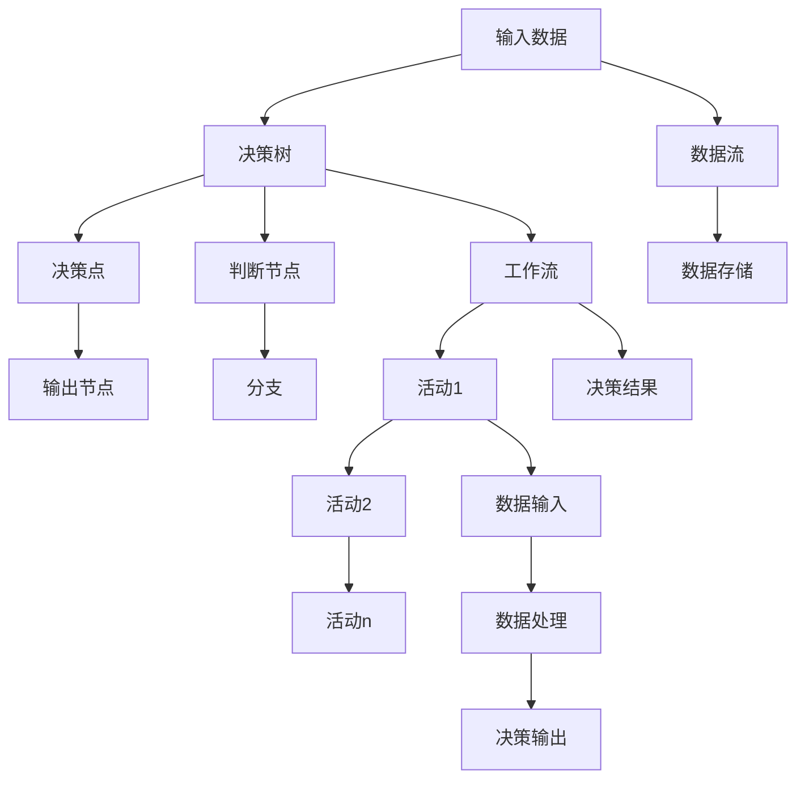

                 

# 决策树和工作流：AI代理如何进行决策分析

> 关键词：决策树，工作流，AI代理，决策分析，机器学习，数据流，规则引擎，应用场景

## 1. 背景介绍

在人工智能（AI）飞速发展的今天，AI代理已经广泛应用于各个领域，如金融、医疗、零售、物流等。这些AI代理系统不仅能够自动化地处理复杂任务，还能够帮助人类做出更智能、更高效的决策。然而，在实际应用中，AI代理系统的决策过程仍面临诸多挑战。例如，决策树（Decision Tree）作为一种经典的机器学习算法，如何在AI代理中合理应用，如何结合工作流（Workflow），进行高效、可解释的决策分析，成为了亟待解决的问题。

## 2. 核心概念与联系

### 2.1 核心概念概述

为了深入理解AI代理如何进行决策分析，我们将首先介绍两个核心概念：决策树和工作流。

- **决策树（Decision Tree）**：决策树是一种基于树形结构的机器学习算法，用于分类和回归问题。通过一系列的判断节点（决策点）和输出节点（结果），决策树能够帮助AI代理系统从输入数据中逐步推导出最终的决策结果。决策树简单易懂，可解释性强，常被用于解决结构化数据和非结构化数据分类问题。

- **工作流（Workflow）**：工作流是一种用于自动化业务过程的方法。它将复杂的业务过程划分为多个步骤（活动），并通过数据流将它们连接起来。工作流能够确保业务过程按预定顺序进行，从而提高工作效率和数据可靠性。

这两者看似独立，但实际上可以通过合理结合，构建出高效、智能的AI代理系统。决策树用于分析和推理，而工作流用于管理数据流和执行决策。结合二者，AI代理可以更加智能地进行决策分析，提升系统的执行效率和决策准确性。

### 2.2 核心概念原理和架构的 Mermaid 流程图



这个流程图展示了决策树和工作流的结合过程。输入数据首先进入决策树进行分析和推理，然后根据决策结果进入工作流。在工作流中，通过多个活动处理数据，最终输出决策结果。这种结合方式，使得AI代理系统能够高效地处理复杂任务，并进行可解释的决策分析。

## 3. 核心算法原理 & 具体操作步骤

### 3.1 算法原理概述

AI代理的决策分析过程可以概括为以下几个步骤：

1. **输入数据准备**：将业务数据输入AI代理系统。
2. **数据预处理**：对输入数据进行清洗、转换和归一化处理。
3. **决策树分析**：通过决策树对数据进行分析，生成决策路径和决策结果。
4. **工作流执行**：根据决策结果，执行相应的工作流活动。
5. **决策输出**：最终输出AI代理的决策结果。

这个过程中，决策树和工作流紧密结合，通过数据流将二者连接起来。决策树的输出成为工作流的输入，工作流的执行结果又反馈到决策树中进行进一步分析。

### 3.2 算法步骤详解

以下是一个完整的决策树和工作流结合的决策分析流程：

**Step 1: 数据准备**

将业务数据输入AI代理系统，进行清洗和转换，确保数据的质量和格式正确。这一步是后续分析的基础。

**Step 2: 数据预处理**

对清洗后的数据进行归一化、编码等预处理操作。这一步的目的是提高决策树的准确性，避免数据偏差和噪声干扰。

**Step 3: 决策树分析**

通过决策树对预处理后的数据进行分析，生成决策路径和决策结果。决策树的具体实现步骤如下：

1. 选择决策树模型（如CART、ID3、C4.5等）。
2. 对数据集进行划分，生成若干子集。
3. 对每个子集进行决策点选择，生成决策路径。
4. 根据决策路径和子集输出决策结果。

**Step 4: 工作流执行**

根据决策树分析的决策结果，执行相应的工作流活动。工作流活动的执行步骤如下：

1. 定义工作流图，包括多个活动（Activity）。
2. 将决策结果作为输入，进入相应的活动。
3. 对输入数据进行处理，生成中间结果。
4. 将中间结果作为输出，进入下一个活动。
5. 最终输出工作流的结果。

**Step 5: 决策输出**

将工作流的最终输出结果作为AI代理的决策结果。这一步是决策分析的最终输出。

### 3.3 算法优缺点

**决策树分析的优点：**
- 决策树简单易懂，可解释性强。
- 决策树能够处理各种类型的数据（数值型、分类型）。
- 决策树能够处理缺失值和异常值。

**决策树分析的缺点：**
- 决策树容易过拟合，尤其是当数据集较小时。
- 决策树对噪声和异常值敏感。

**工作流执行的优点：**
- 工作流能够自动化地处理复杂任务。
- 工作流能够确保数据流的有序性，减少错误。
- 工作流可以灵活地添加和修改活动，适应不同的业务需求。

**工作流执行的缺点：**
- 工作流的灵活性可能导致执行效率低下。
- 工作流需要精心设计和维护，以确保其稳定性和可扩展性。

### 3.4 算法应用领域

决策树和工作流的结合，已经在多个领域得到了广泛应用，例如：

- **金融风险评估**：通过决策树分析客户的信用评分，结合工作流执行信用评估过程，提高风险评估的准确性。
- **医疗诊断**：通过决策树分析患者的病历数据，结合工作流执行诊断过程，快速准确地诊断疾病。
- **零售推荐系统**：通过决策树分析用户行为数据，结合工作流执行推荐过程，提高推荐的个性化和精准度。
- **物流配送**：通过决策树分析订单数据，结合工作流执行配送过程，优化物流配送路径和效率。

这些应用场景展示了决策树和工作流结合的强大潜力，能够帮助AI代理系统更加智能地进行决策分析，提升系统的执行效率和决策准确性。

## 4. 数学模型和公式 & 详细讲解 & 举例说明

### 4.1 数学模型构建

决策树的工作原理可以用决策树模型来描述。决策树模型可以表示为一个树形结构，其中每个节点代表一个决策点，每个分支代表一个可能的决策结果，每个叶子节点代表一个最终决策结果。

决策树模型可以用以下公式表示：

$$
\mathcal{T} = \{t_1, t_2, \ldots, t_n\}
$$

其中，$t_i$ 表示第 $i$ 个决策树，$n$ 表示决策树的总数。

每个决策树 $t_i$ 可以表示为一个有向无环图（DAG），其中节点和边分别表示决策点和分支。节点 $v_j$ 和节点 $v_k$ 之间的边表示从节点 $v_j$ 到节点 $v_k$ 的决策路径。

### 4.2 公式推导过程

决策树的构建过程可以概括为以下几个步骤：

1. 选择决策树模型（如CART、ID3、C4.5等）。
2. 对数据集进行划分，生成若干子集。
3. 对每个子集进行决策点选择，生成决策路径。
4. 根据决策路径和子集输出决策结果。

决策树构建的具体公式如下：

$$
\begin{aligned}
& t_i = (V_i, E_i) \\
& V_i = \{v_1, v_2, \ldots, v_n\} \\
& E_i = \{(v_j, v_k) | j, k \in V_i, j \neq k\} \\
& \text{其中}, v_j \text{表示节点}, (v_j, v_k) \text{表示边}
\end{aligned}
$$

### 4.3 案例分析与讲解

以一个简单的金融风险评估为例，说明决策树和工作流的结合过程：

1. **数据准备**：收集客户的信用评分、收入、负债等信息。
2. **数据预处理**：对数据进行清洗和归一化处理。
3. **决策树分析**：通过决策树对客户信息进行分析，生成决策路径和决策结果。假设决策树模型为CART，生成以下决策树：

   ```
   决策点：收入 > 5000
   - 是 -> 低风险
   - 否 -> 决策点：负债 < 30000
     - 是 -> 中风险
     - 否 -> 高风险
   ```

4. **工作流执行**：根据决策树分析的决策结果，执行相应的工作流活动。假设工作流图如下：

   ```
   活动1：输入信用评分、收入、负债等数据
   活动2：归一化处理
   活动3：信用评分分析
   活动4：收入分析
   活动5：负债分析
   活动6：最终决策输出
   ```

   数据流如下图所示：

   ```mermaid
   graph TB
       A[客户信息] --> B[归一化处理] --> C[信用评分分析] --> D[收入分析] --> E[负债分析] --> F[最终决策输出]
   ```

   假设归一化处理后的信用评分为3.5，收入为5000，负债为40000，根据决策树，进入“收入 > 5000”的分支，再进入“负债 < 30000”的分支，最终输出“中风险”。

5. **决策输出**：将工作流的最终输出结果作为AI代理的决策结果，即“中风险”。

## 5. 项目实践：代码实例和详细解释说明

### 5.1 开发环境搭建

在进行决策树和工作流结合的决策分析实践前，我们需要准备好开发环境。以下是使用Python进行决策树和工作流结合的开发环境配置流程：

1. 安装Python：从官网下载并安装Python。
2. 安装Scikit-learn：使用pip命令安装Scikit-learn库，这是进行决策树分析的基础库。
3. 安装Workflow Manager：这是一个用于管理工作流的开源工具，可以方便地构建和执行工作流。

### 5.2 源代码详细实现

以下是一个简单的决策树和工作流结合的决策分析的Python代码实现：

```python
# 导入必要的库
import pandas as pd
from sklearn.tree import DecisionTreeClassifier
from workflow import WorkflowManager

# 构建数据集
data = pd.DataFrame({
    '收入': [3000, 5000, 7000, 9000],
    '负债': [20000, 30000, 40000, 50000],
    '信用评分': [3, 4, 5, 6]
})

# 定义决策树模型
model = DecisionTreeClassifier()

# 训练决策树模型
model.fit(data[['收入', '负债']], data['信用评分'])

# 定义工作流图
workflow = WorkflowManager()
workflow.add_activity('输入数据', '输入信用评分、收入、负债等数据')
workflow.add_activity('归一化处理', '归一化处理')
workflow.add_activity('信用评分分析', '信用评分分析')
workflow.add_activity('收入分析', '收入分析')
workflow.add_activity('负债分析', '负债分析')
workflow.add_activity('最终决策输出', '最终决策输出')

# 设置数据流
workflow.set_data_flow({
    '输入数据': {'input': 'input', 'output': '归一化处理'},
    '归一化处理': {'input': '归一化处理', 'output': '信用评分分析'},
    '信用评分分析': {'input': '信用评分分析', 'output': '收入分析'},
    '收入分析': {'input': '收入分析', 'output': '负债分析'},
    '负债分析': {'input': '负债分析', 'output': '最终决策输出'}
})

# 定义决策路径
def decision_path(data):
    if data['收入'] > 5000:
        if data['负债'] < 30000:
            return '中风险'
        else:
            return '高风险'
    else:
        return '低风险'

# 执行工作流
result = workflow.run('输入数据', data)

# 输出决策结果
print(result)
```

### 5.3 代码解读与分析

这个Python代码示例展示了如何使用Scikit-learn库进行决策树分析，并结合Workflow Manager进行工作流管理。具体步骤如下：

1. **数据准备**：定义一个包含收入、负债、信用评分的Pandas数据集。
2. **决策树分析**：使用Scikit-learn库的DecisionTreeClassifier进行决策树训练。
3. **工作流执行**：定义工作流图和数据流，设置输入、输出和活动。
4. **决策路径定义**：定义一个决策路径函数，根据收入和负债信息判断客户的风险等级。
5. **工作流执行**：运行工作流，输出决策结果。

这个示例展示了如何通过决策树和工作流结合，自动化地进行金融风险评估。通过Scikit-learn库和Workflow Manager，代码实现相对简洁，易于理解和扩展。

## 6. 实际应用场景

### 6.1 智能客服系统

在智能客服系统中，决策树和工作流的结合可以用于自动化处理客户咨询和问题解答。客户输入的问题通过决策树分析，生成决策路径，进入相应的工作流活动进行问题解答。这种结合方式，可以提高客服系统的响应速度和准确性，提升客户满意度。

### 6.2 金融风险评估

金融风险评估是一个典型的决策树和工作流结合应用场景。通过决策树分析客户的信用评分、收入、负债等数据，生成决策路径，进入相应的工作流活动进行风险评估和决策。这种结合方式，可以提高风险评估的准确性，降低业务风险。

### 6.3 零售推荐系统

在零售推荐系统中，决策树和工作流的结合可以用于自动化生成推荐结果。用户的历史行为数据通过决策树分析，生成决策路径，进入相应的工作流活动进行推荐计算和排序。这种结合方式，可以提高推荐的个性化和精准度，提升用户体验。

### 6.4 未来应用展望

随着技术的不断进步，决策树和工作流的结合将有更广泛的应用前景：

- **智能制造**：在制造行业中，决策树分析生产数据，生成决策路径，进入相应的工作流活动进行生产调度和管理。这种结合方式，可以提高生产效率和质量，降低成本。
- **智慧城市**：在智慧城市中，决策树分析交通数据，生成决策路径，进入相应的工作流活动进行交通管理和调度。这种结合方式，可以提高城市交通的智能化水平，缓解交通拥堵。
- **医疗诊断**：在医疗诊断中，决策树分析病历数据，生成决策路径，进入相应的工作流活动进行诊断和处理。这种结合方式，可以提高诊断的准确性和效率，改善患者体验。

这些应用场景展示了决策树和工作流结合的强大潜力，能够帮助AI代理系统更加智能地进行决策分析，提升系统的执行效率和决策准确性。

## 7. 工具和资源推荐

### 7.1 学习资源推荐

为了帮助开发者系统掌握决策树和工作流结合的决策分析理论基础和实践技巧，这里推荐一些优质的学习资源：

1. **《机器学习》课程**：由斯坦福大学Andrew Ng教授开设的机器学习课程，涵盖决策树、工作流等经典概念，适合初学者入门。
2. **《Python数据科学手册》书籍**：Python数据科学领域的重要参考书，涵盖决策树、工作流等实用技术，适合实战应用。
3. **Scikit-learn官方文档**：Scikit-learn库的官方文档，提供了丰富的决策树算法和案例，适合深入学习和实践。
4. **Workflow Manager官方文档**：Workflow Manager工具的官方文档，提供了详细的管理工作流的方法和案例，适合学习和使用。

通过对这些资源的学习实践，相信你一定能够快速掌握决策树和工作流结合的决策分析精髓，并用于解决实际的NLP问题。

### 7.2 开发工具推荐

高效的开发离不开优秀的工具支持。以下是几款用于决策树和工作流结合的决策分析开发的常用工具：

1. **Scikit-learn**：Python中的机器学习库，提供了丰富的决策树算法和工具，适合进行决策树分析。
2. **Workflow Manager**：用于管理工作流的开源工具，可以方便地构建和执行工作流，适合进行工作流管理。
3. **Jupyter Notebook**：Python的交互式开发环境，可以方便地进行代码编写和调试，适合进行决策树和工作流的结合开发。
4. **TensorFlow**：Google开发的深度学习框架，支持分布式计算和并行处理，适合进行大规模决策树分析。

合理利用这些工具，可以显著提升决策树和工作流结合的决策分析的开发效率，加快创新迭代的步伐。

### 7.3 相关论文推荐

决策树和工作流结合的决策分析技术，已经在学界得到了广泛的研究。以下是几篇奠基性的相关论文，推荐阅读：

1. **《决策树学习理论与应用》书籍**：详细介绍了决策树算法的工作原理和应用场景，适合进一步深入学习。
2. **《工作流建模与分析》论文**：探讨了工作流的建模方法和分析技术，适合理解工作流的基本原理。
3. **《基于决策树的工作流系统设计》论文**：研究了决策树和工作流结合的决策分析方法，适合参考和借鉴。

这些论文代表了决策树和工作流结合的研究进展，通过学习这些前沿成果，可以帮助研究者把握学科前进方向，激发更多的创新灵感。

## 8. 总结：未来发展趋势与挑战

### 8.1 总结

本文对决策树和工作流结合的决策分析方法进行了全面系统的介绍。首先阐述了决策树和工作流的背景和意义，明确了这两种方法结合的潜力。其次，从原理到实践，详细讲解了决策树分析的工作流结合过程，给出了决策分析任务的完整代码实例。同时，本文还探讨了决策树和工作流结合在智能客服、金融风险评估、零售推荐系统等多个领域的应用前景，展示了决策树和工作流结合的强大潜力。

通过本文的系统梳理，可以看到，决策树和工作流结合的决策分析方法已经在多个领域得到了广泛应用，能够帮助AI代理系统更加智能地进行决策分析，提升系统的执行效率和决策准确性。

### 8.2 未来发展趋势

展望未来，决策树和工作流结合的决策分析技术将呈现以下几个发展趋势：

1. **决策树模型的优化**：随着数据量的增加，决策树模型将会进一步优化，以提高决策的准确性和鲁棒性。
2. **工作流模型的优化**：随着业务场景的复杂化，工作流模型将会进一步优化，以提高系统的可扩展性和灵活性。
3. **决策树的可视化**：决策树的可视化将帮助用户更好地理解决策过程，提高系统的可解释性。
4. **工作流的自动化**：工作流的自动化将进一步提升系统的执行效率，降低人为错误。
5. **决策树的集成**：决策树可以与其他机器学习算法结合使用，如集成学习、神经网络等，提高系统的综合性能。

以上趋势展示了决策树和工作流结合的未来发展方向，将进一步提升决策分析的智能化水平，推动AI代理系统的发展。

### 8.3 面临的挑战

尽管决策树和工作流结合的决策分析技术已经取得了一定的成果，但在实际应用中，仍面临诸多挑战：

1. **数据质量问题**：决策树模型对数据质量要求较高，数据的偏差和噪声会影响决策结果的准确性。
2. **工作流复杂性**：工作流的复杂性可能导致执行效率低下，甚至出现错误。
3. **决策树的可解释性**：决策树的可解释性较弱，难以理解和调试。
4. **工作流的稳定性**：工作流的稳定性较弱，可能受到外部环境的影响。
5. **系统的安全性**：决策树和工作流结合的系统需要考虑数据安全、模型安全等问题，确保系统的安全性。

这些挑战需要进一步研究和解决，以提高决策树和工作流结合的决策分析技术的稳定性和可靠性。

### 8.4 研究展望

为了解决上述挑战，未来的研究需要从以下几个方面进行探索：

1. **数据预处理技术**：研究更加高效、鲁棒的数据预处理技术，提高数据质量。
2. **工作流自动化技术**：研究自动化工作流执行技术，提高系统的执行效率和稳定性。
3. **决策树的可解释性技术**：研究提高决策树的可解释性的方法，增强系统的可解释性和可调试性。
4. **系统安全性技术**：研究数据安全、模型安全等技术，确保系统的安全性。
5. **决策树的集成技术**：研究决策树与其他机器学习算法的集成方法，提高系统的综合性能。

这些研究方向的探索，将进一步推动决策树和工作流结合的决策分析技术的发展，为构建智能、可靠、高效的AI代理系统提供有力的技术支撑。总之，决策树和工作流结合的决策分析技术在未来的AI代理系统中将发挥更加重要的作用，推动AI技术的普及和应用。

## 9. 附录：常见问题与解答

**Q1: 决策树分析的过程是怎样的？**

A: 决策树分析的过程可以分为以下几个步骤：

1. **数据准备**：将业务数据输入AI代理系统，进行清洗和转换，确保数据的质量和格式正确。
2. **数据预处理**：对清洗后的数据进行归一化、编码等预处理操作，以提高决策树的准确性。
3. **决策树分析**：通过决策树对预处理后的数据进行分析，生成决策路径和决策结果。具体步骤如下：
   - 选择决策树模型（如CART、ID3、C4.5等）。
   - 对数据集进行划分，生成若干子集。
   - 对每个子集进行决策点选择，生成决策路径。
   - 根据决策路径和子集输出决策结果。

**Q2: 工作流执行的过程是怎样的？**

A: 工作流执行的过程可以分为以下几个步骤：

1. **定义工作流图**：将复杂的业务过程划分为多个步骤（活动），并通过数据流将它们连接起来。
2. **设置数据流**：定义数据流，将决策树分析的输出作为工作流的输入，工作流的输出作为决策树的输入。
3. **执行工作流**：根据输入数据，依次执行工作流中的各个活动，生成中间结果。
4. **最终决策输出**：将工作流的最终输出作为AI代理的决策结果。

**Q3: 如何提高决策树的可解释性？**

A: 提高决策树的可解释性可以从以下几个方面进行：

1. **可视化决策树**：通过可视化工具，将决策树绘制成图表，方便理解和调试。
2. **解释决策路径**：解释决策路径中的每个决策点，说明其背后的逻辑和原因。
3. **集成多种解释方法**：集成多种解释方法，如LIME、SHAP等，提高解释的准确性和可靠性。

**Q4: 如何在实际应用中优化决策树的执行效率？**

A: 优化决策树的执行效率可以从以下几个方面进行：

1. **剪枝优化**：通过剪枝技术，减少决策树的复杂度，提高执行效率。
2. **特征选择**：选择重要的特征进行决策，减少特征数量，提高执行效率。
3. **并行计算**：使用并行计算技术，加速决策树的执行过程。

**Q5: 如何在实际应用中优化工作流的执行效率？**

A: 优化工作流的执行效率可以从以下几个方面进行：

1. **任务并行化**：通过并行化技术，同时执行多个任务，提高执行效率。
2. **活动缓存**：将中间结果缓存起来，减少重复计算，提高执行效率。
3. **工作流调度**：合理调度工作流活动，优化数据流和任务执行顺序，提高执行效率。

**Q6: 如何在实际应用中提高系统的安全性？**

A: 提高系统的安全性可以从以下几个方面进行：

1. **数据加密**：对数据进行加密处理，防止数据泄露。
2. **访问控制**：设置严格的访问控制机制，防止未经授权的访问。
3. **异常检测**：实时监控系统状态，检测异常行为，及时预警和处理。

通过这些优化和改进，可以有效提高决策树和工作流结合的决策分析技术的执行效率和安全性，确保系统的稳定性和可靠性。

---

作者：禅与计算机程序设计艺术 / Zen and the Art of Computer Programming

