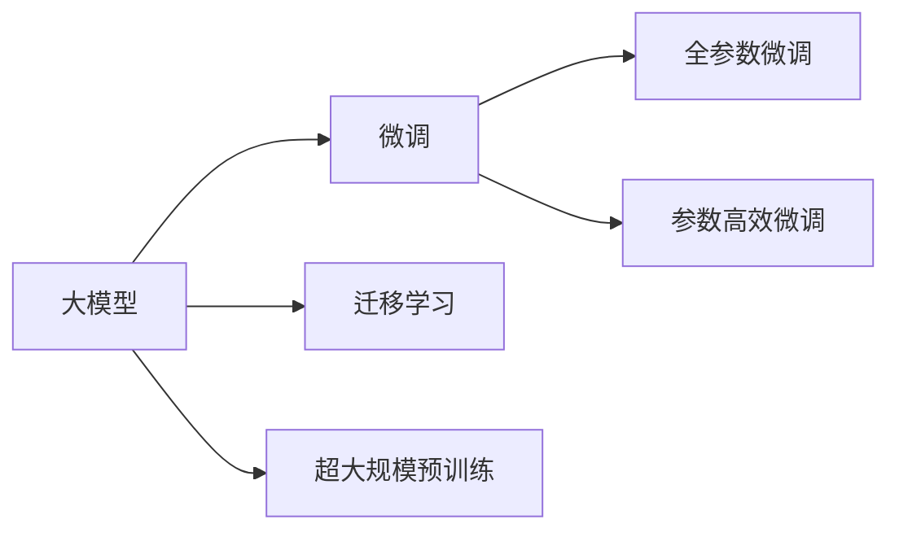

                 

## 1. 背景介绍

在人工智能时代，大模型正成为推动科技创新和产业变革的重要引擎。随着GPT-3、BERT等大模型的横空出世，大模型在自然语言处理（NLP）、计算机视觉（CV）等领域展现出前所未有的强大能力，掀起了商业化应用的热潮。创业者纷纷乘风破浪，在巨头和资本的注视下，追逐大模型的商业化机遇。

## 2. 核心概念与联系

### 2.1 核心概念概述

**大模型（Large Model）**：是指在特定领域中训练得到的参数规模较大的模型，通常包含数十亿甚至数百亿的参数。大模型通过在大量数据上进行自监督或监督学习，学习到泛化能力较强的语言表示，适用于各种复杂、高精度的NLP任务。

**微调（Fine-tuning）**：是指在大模型的基础上，使用特定任务的数据集对模型进行进一步训练，使模型能够更好地适应新的任务。微调可以大幅提升模型在特定任务上的性能。

**迁移学习（Transfer Learning）**：是指将在大规模数据集上预训练得到的模型知识迁移到小规模数据集上，以提高模型在小数据集上的性能。

**参数高效微调（Parameter-Efficient Fine-Tuning, PEFT）**：是指在微调过程中只更新少量的模型参数，以减少计算资源消耗，同时保证微调效果的提升。

**超大规模预训练（Massive Pre-training）**：是指使用大规模无标签数据进行预训练，使模型学习到通用的语言表示，提高其在下游任务上的泛化能力。

### 2.2 核心概念原理和架构的 Mermaid 流程图



## 3. 核心算法原理 & 具体操作步骤

### 3.1 算法原理概述

大模型的商业化应用主要依托于其强大的泛化能力和高效的微调能力。微调过程可以通过以下步骤实现：

1. 在大规模无标签数据集上，使用自监督学习对大模型进行预训练。
2. 收集特定任务的数据集，将其作为微调数据。
3. 在大模型顶层添加任务适配层，如线性分类器或解码器。
4. 设置合适的损失函数，如交叉熵损失或均方误差损失。
5. 使用小批量随机梯度下降（SGD）等优化算法对模型进行训练，最小化损失函数。

### 3.2 算法步骤详解

**Step 1: 准备预训练模型和数据集**

- **预训练模型选择**：选择合适的预训练模型，如BERT、GPT等，作为微调的初始化参数。
- **数据集准备**：准备特定任务的数据集，将其划分为训练集、验证集和测试集，确保标注数据的质量和多样性。

**Step 2: 添加任务适配层**

- **适配层设计**：根据任务类型，在预训练模型顶层设计合适的输出层和损失函数。例如，对于分类任务，通常会在顶层添加一个线性分类器。

**Step 3: 设置微调超参数**

- **学习率设置**：根据微调任务的特点，选择合适的学习率。一般微调学习率比预训练时要小。
- **正则化技术**：应用L2正则化、Dropout等技术，避免过拟合。
- **参数冻结**：可以选择仅微调顶层参数，或全部参数都参与微调。

**Step 4: 执行梯度训练**

- **前向传播**：将训练集数据分批次输入模型，计算损失函数。
- **反向传播**：计算梯度，更新模型参数。
- **模型评估**：周期性在验证集上评估模型性能，确定是否停止训练。

**Step 5: 测试和部署**

- **测试集评估**：在测试集上评估微调后模型的性能，对比微调前后的精度提升。
- **模型部署**：将微调后的模型集成到实际应用系统中，如智能客服、金融舆情监测等。

### 3.3 算法优缺点

**优点**：
- **高效性**：微调可以利用预训练模型中的知识，在少量标注数据下迅速提升模型性能。
- **通用性**：大模型适用于多种NLP任务，微调方法可以跨任务迁移。
- **参数效率**：PEFT方法可以减少微调过程中的计算资源消耗。

**缺点**：
- **数据依赖**：微调依赖标注数据，标注数据获取成本高。
- **泛化能力**：当任务与预训练数据分布差异较大时，微调效果可能不佳。
- **模型偏见**：预训练模型可能带有数据偏见，微调过程中可能无法完全消除。

### 3.4 算法应用领域

大模型的微调方法在多个领域得到广泛应用：

- **自然语言处理**：如问答、对话系统、摘要、翻译等任务。
- **计算机视觉**：如图像分类、目标检测、语义分割等任务。
- **推荐系统**：如用户兴趣建模、物品推荐等任务。
- **金融风控**：如信用评估、欺诈检测等任务。
- **智能客服**：如对话生成、情感分析等任务。

## 4. 数学模型和公式 & 详细讲解 & 举例说明

### 4.1 数学模型构建

假设预训练模型为 $M_{\theta}$，其中 $\theta$ 为模型参数。收集特定任务的标注数据集 $D=\{(x_i, y_i)\}_{i=1}^N$，其中 $x_i$ 为输入样本，$y_i$ 为标签。微调的目标是最小化损失函数 $\mathcal{L}$，其中 $\mathcal{L}$ 为针对特定任务的损失函数。

### 4.2 公式推导过程

以分类任务为例，假设模型的输出为 $\hat{y}=M_{\theta}(x)$，损失函数为交叉熵损失 $\ell(\hat{y}, y)= -y\log \hat{y} - (1-y)\log (1-\hat{y})$。

微调的优化目标为：

$$
\hat{\theta} = \mathop{\arg\min}_{\theta} \mathcal{L}(M_{\theta},D)
$$

具体推导过程如下：

$$
\mathcal{L}(M_{\theta},D) = -\frac{1}{N}\sum_{i=1}^N \ell(M_{\theta}(x_i),y_i)
$$

对 $\mathcal{L}$ 求导，得到梯度：

$$
\nabla_{\theta}\mathcal{L}(\theta) = -\frac{1}{N}\sum_{i=1}^N \nabla_{\theta}\ell(M_{\theta}(x_i),y_i)
$$

其中，$\nabla_{\theta}\ell(M_{\theta}(x_i),y_i) = -y_i\frac{\nabla_{\theta}\hat{y}}{\hat{y}(1-\hat{y})} + (1-y_i)\frac{\nabla_{\theta}(1-\hat{y})}{(1-\hat{y})\hat{y}}$。

### 4.3 案例分析与讲解

以情感分类任务为例，假设使用BERT模型，将文本输入BERT模型得到隐向量 $h$，通过线性分类器得到情感分类结果 $\hat{y}$。

假设损失函数为交叉熵损失：

$$
\mathcal{L}(M_{\theta},D) = -\frac{1}{N}\sum_{i=1}^N \ell(\hat{y},y_i)
$$

其中 $\ell(\hat{y},y_i) = -y_i\log \hat{y} - (1-y_i)\log (1-\hat{y})$。

假设模型采用AdamW优化器，学习率为 $2e-5$，参数冻结策略为仅微调顶层。

## 5. 项目实践：代码实例和详细解释说明

### 5.1 开发环境搭建

```bash
pip install transformers torch
```

### 5.2 源代码详细实现

```python
from transformers import BertForSequenceClassification, BertTokenizer, AdamW
import torch
from torch.utils.data import DataLoader, Dataset
from sklearn.metrics import accuracy_score

class TextDataset(Dataset):
    def __init__(self, texts, labels):
        self.texts = texts
        self.labels = labels
        self.tokenizer = BertTokenizer.from_pretrained('bert-base-cased')
        
    def __len__(self):
        return len(self.texts)
    
    def __getitem__(self, item):
        text = self.texts[item]
        label = self.labels[item]
        encoding = self.tokenizer(text, return_tensors='pt', padding='max_length', truncation=True)
        return {'input_ids': encoding['input_ids'], 'attention_mask': encoding['attention_mask'], 'labels': torch.tensor(label, dtype=torch.long)}

# 准备数据集
texts = ['I love you', 'I hate you', 'I do not know how to love you']
labels = [1, 0, 0]

# 创建数据集
dataset = TextDataset(texts, labels)

# 定义模型和优化器
model = BertForSequenceClassification.from_pretrained('bert-base-cased', num_labels=2)
optimizer = AdamW(model.parameters(), lr=2e-5)
model.to('cuda')

# 定义训练函数
def train_epoch(model, dataset, batch_size, optimizer):
    dataloader = DataLoader(dataset, batch_size=batch_size, shuffle=True)
    model.train()
    epoch_loss = 0
    for batch in dataloader:
        input_ids = batch['input_ids'].to('cuda')
        attention_mask = batch['attention_mask'].to('cuda')
        labels = batch['labels'].to('cuda')
        model.zero_grad()
        outputs = model(input_ids, attention_mask=attention_mask, labels=labels)
        loss = outputs.loss
        epoch_loss += loss.item()
        loss.backward()
        optimizer.step()
    return epoch_loss / len(dataloader)

# 训练模型
epochs = 5
batch_size = 2
for epoch in range(epochs):
    loss = train_epoch(model, dataset, batch_size, optimizer)
    print(f"Epoch {epoch+1}, train loss: {loss:.3f}")
    
# 评估模型
def evaluate(model, dataset, batch_size):
    dataloader = DataLoader(dataset, batch_size=batch_size)
    model.eval()
    preds, labels = [], []
    with torch.no_grad():
        for batch in dataloader:
            input_ids = batch['input_ids'].to('cuda')
            attention_mask = batch['attention_mask'].to('cuda')
            batch_labels = batch['labels']
            outputs = model(input_ids, attention_mask=attention_mask)
            batch_preds = outputs.logits.argmax(dim=1).to('cpu').tolist()
            batch_labels = batch_labels.to('cpu').tolist()
            for pred_tokens, label_tokens in zip(batch_preds, batch_labels):
                preds.append(pred_tokens)
                labels.append(label_tokens)
    
    print(f"Accuracy: {accuracy_score(labels, preds)}")

# 评估模型
evaluate(model, dataset, batch_size)
```

### 5.3 代码解读与分析

该代码实现了对BERT模型进行情感分类任务的微调过程。首先，通过PyTorch和Transformers库搭建模型和优化器，然后使用自定义的TextDataset类处理数据，定义训练函数和评估函数，最后训练模型并评估其性能。

**代码详细解读**：
1. TextDataset类：自定义数据集类，用于加载和处理文本数据，并将其转换为模型可接受的格式。
2. train_epoch函数：定义训练函数，包括前向传播、损失计算、反向传播和参数更新。
3. evaluate函数：定义评估函数，用于计算模型的准确率。
4. 训练模型：通过训练函数不断更新模型参数，直至收敛。
5. 评估模型：通过评估函数计算模型在测试集上的准确率。

## 6. 实际应用场景

### 6.1 智能客服系统

智能客服系统利用大模型的微调技术，能够实现对用户问题的快速响应和准确解答。通过对历史客服对话记录的微调，模型能够自动理解用户意图，匹配最合适的回答，提高客户咨询体验和问题解决效率。

### 6.2 金融舆情监测

金融舆情监测利用大模型的微调技术，能够实时监测市场舆论动向，识别舆情变化趋势，及时预警潜在风险。通过对金融领域相关文本数据的微调，模型能够自动识别金融事件、情感倾向，为金融机构提供决策依据。

### 6.3 个性化推荐系统

个性化推荐系统利用大模型的微调技术，能够根据用户历史行为数据，生成个性化的推荐内容。通过对文本数据的微调，模型能够从用户浏览、点击、评论等行为中挖掘出兴趣点，生成符合用户偏好的推荐结果，提高推荐准确性和满意度。

### 6.4 未来应用展望

未来，大模型的微调技术将进一步拓展其在更多领域的应用。例如，在智慧医疗领域，微调技术可用于医疗问答、病历分析、药物研发等，辅助医生诊疗，加速新药开发进程。在智慧城市治理中，微调技术可用于城市事件监测、舆情分析、应急指挥等，提高城市管理的自动化和智能化水平。

## 7. 工具和资源推荐

### 7.1 学习资源推荐

1. **《Transformer从原理到实践》系列博文**：介绍Transformer原理、BERT模型、微调技术等前沿话题。
2. **CS224N《深度学习自然语言处理》课程**：斯坦福大学开设的NLP明星课程，涵盖NLP基础和经典模型。
3. **《Natural Language Processing with Transformers》书籍**：介绍如何使用Transformers库进行NLP任务开发。
4. **HuggingFace官方文档**：提供海量预训练模型和微调样例代码。
5. **CLUE开源项目**：包含中文NLP数据集和微调baseline模型，助力中文NLP技术发展。

### 7.2 开发工具推荐

1. **PyTorch**：基于Python的开源深度学习框架，适合快速迭代研究。
2. **TensorFlow**：由Google主导开发的深度学习框架，适合大规模工程应用。
3. **Transformers库**：HuggingFace开发的NLP工具库，提供丰富的预训练语言模型。
4. **Weights & Biases**：模型训练的实验跟踪工具，实时监测模型训练状态。
5. **TensorBoard**：TensorFlow配套的可视化工具，实时监测模型训练状态。
6. **Google Colab**：谷歌推出的在线Jupyter Notebook环境，免费提供GPU/TPU算力。

### 7.3 相关论文推荐

1. **Attention is All You Need**：提出Transformer结构，开启NLP领域的预训练大模型时代。
2. **BERT: Pre-training of Deep Bidirectional Transformers for Language Understanding**：提出BERT模型，引入掩码语言模型等自监督预训练任务。
3. **Language Models are Unsupervised Multitask Learners**：展示大模型强大的zero-shot学习能力。
4. **Parameter-Efficient Transfer Learning for NLP**：提出Adapter等参数高效微调方法。
5. **Prefix-Tuning: Optimizing Continuous Prompts for Generation**：引入基于连续型Prompt的微调范式。
6. **AdaLoRA: Adaptive Low-Rank Adaptation for Parameter-Efficient Fine-Tuning**：使用自适应低秩适应的微调方法，提升微调精度。

## 8. 总结：未来发展趋势与挑战

### 8.1 研究成果总结

大模型的微调技术在NLP领域取得了显著成效，推动了众多应用场景的发展。未来，随着模型的规模扩大和技术的不断进步，微调方法将面临新的挑战和机遇。

### 8.2 未来发展趋势

1. **模型规模持续增大**：预训练模型参数量将进一步增长，提升模型的泛化能力和性能。
2. **微调方法多样化**：出现更多参数高效和计算高效的微调方法，如Prefix-Tuning、LoRA等。
3. **持续学习成为常态**：微调模型需要持续学习新知识，保持性能。
4. **少样本学习和跨领域迁移能力提升**：减少对标注数据的依赖，提高模型的迁移能力。
5. **多模态微调崛起**：融合视觉、语音等多模态数据，提升模型的理解和生成能力。

### 8.3 面临的挑战

1. **标注成本瓶颈**：获取高质量标注数据成本高。
2. **模型鲁棒性不足**：面对域外数据泛化性能差。
3. **推理效率有待提高**：大规模模型推理速度慢，内存占用大。
4. **可解释性亟需加强**：模型输出缺乏可解释性。
5. **安全性有待保障**：模型可能学习有害信息，输出不安全。
6. **知识整合能力不足**：无法灵活吸收和运用先验知识。

### 8.4 研究展望

未来，需要在以下几个方面进行深入研究：

1. **探索无监督和半监督微调方法**：降低对标注数据的依赖。
2. **研究参数高效和计算高效的微调范式**：减少计算资源消耗。
3. **引入因果和对比学习范式**：增强模型的泛化能力和鲁棒性。
4. **融合因果分析和博弈论工具**：提高模型决策的因果性和稳定性。
5. **纳入伦理道德约束**：确保模型输出的伦理性和安全性。

## 9. 附录：常见问题与解答

**Q1: 大模型微调是否适用于所有NLP任务？**

A: 大模型微调适用于大多数NLP任务，但特定领域任务可能需要先进行领域特定预训练。

**Q2: 微调过程中如何选择合适的学习率？**

A: 微调学习率通常比预训练时小，建议从1e-5开始调参，逐步减小学习率，直至收敛。

**Q3: 采用大模型微调时会面临哪些资源瓶颈？**

A: 大模型计算资源消耗大，需要考虑算力、内存、存储的优化。

**Q4: 如何缓解微调过程中的过拟合问题？**

A: 数据增强、正则化、对抗训练、参数高效微调等方法可以有效缓解过拟合。

**Q5: 微调模型在落地部署时需要注意哪些问题？**

A: 模型裁剪、量化加速、服务化封装、弹性伸缩、监控告警、安全防护等是部署中需要注意的问题。

---

作者：禅与计算机程序设计艺术 / Zen and the Art of Computer Programming

