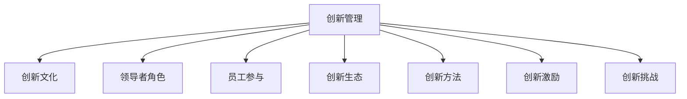

                 

# 创新管理：培养组织的创新文化

> 关键词：创新管理, 创新文化, 组织, 领导者, 创新生态, 创新方法, 创新激励, 创新挑战

## 1. 背景介绍

### 1.1 问题由来
在当今快速变化的商业环境中，企业面对着前所未有的竞争压力。如何保持竞争力，成为企业面临的最大挑战之一。传统的管理模式已经无法适应新的环境，组织需要不断地寻找新的方式来激发员工的创造力和创新能力，以应对市场的变化。创新管理正是应对这一挑战的重要手段。

### 1.2 问题核心关键点
创新管理旨在通过建立一种支持创新的文化氛围，鼓励员工探索新的想法，并将这些想法转化为实际成果。其核心关键点在于：

1. 领导者支持：企业领导者的态度和行为对创新文化的形成有着至关重要的影响。
2. 员工参与：员工是创新的主体，组织的创新文化需要激发他们的创造力。
3. 资源支持：创新需要相应的资源支持，如时间、资金、工具等。
4. 环境建设：良好的工作环境和文化氛围是创新成功的关键。
5. 激励机制：有效的激励机制能够激发员工对创新的热情。
6. 知识共享：鼓励员工之间的知识共享和协作，推动创新的扩散。
7. 风险容忍：创新过程中常常伴随着失败，组织需要容忍一定的失败，以支持创新尝试。

### 1.3 问题研究意义
创新管理对组织的长期发展具有重要意义：

1. 提升竞争力：创新是企业获取竞争优势的关键。
2. 增加收入：创新带来新产品、新服务和新技术，能显著提高企业的收入。
3. 提高效率：通过创新优化流程、改进产品，可以提高组织的效率。
4. 增强员工满意度：创新活动往往伴随着新的挑战和机遇，能增强员工的工作满意度。
5. 促进知识积累：创新过程中积累的知识和经验是组织宝贵的资产。
6. 推动社会进步：创新驱动的社会进步，带来更美好的未来。

## 2. 核心概念与联系

### 2.1 核心概念概述

为了更好地理解创新管理的概念，本节将介绍几个密切相关的核心概念：

- **创新管理**：通过建立支持创新的文化和机制，激发员工创造力，并将创新转化为实际成果的管理过程。
- **创新文化**：企业内支持创新、容忍失败、鼓励实验和创新的文化氛围。
- **领导者角色**：企业领导者通过示范和支持，对创新文化的形成和维护起着关键作用。
- **员工参与**：员工是创新的主体，他们的参与是创新成功的重要因素。
- **创新生态**：创新生态包括创新资源、创新网络和创新机会等，是创新管理的重要组成部分。
- **创新方法**：包括设计思维、敏捷开发、六西格玛等，是创新管理的具体实施手段。
- **创新激励**：通过物质和精神奖励，激发员工对创新的热情。
- **创新挑战**：包括市场变化、技术更新、资源限制等，是创新过程中需要应对的挑战。

这些概念之间的逻辑关系可以通过以下Mermaid流程图来展示：



这个流程图展示了几大核心概念及其之间的关系：

1. 创新管理通过建立和维护创新文化，激发员工参与创新。
2. 创新文化是创新管理的土壤，领导者行为、员工参与和创新方法等都会影响其形成。
3. 创新生态提供必要的资源和机会，为创新提供了外部环境支持。
4. 创新方法具体指导了创新过程，如设计思维、敏捷开发等。
5. 创新激励为员工提供动力，提高他们对创新的热情。
6. 创新挑战需要在创新管理中应对，以推动创新成功。

## 3. 核心算法原理 & 具体操作步骤
### 3.1 算法原理概述

创新管理是一种多层次、多维度的管理过程，其核心原理基于以下几个方面：

- **动态系统**：将组织视为一个动态系统，持续地进行创新过程，以适应外部环境的变化。
- **反馈机制**：建立有效的反馈机制，及时调整创新策略和方向。
- **自组织系统**：通过自组织原则，激发员工的自驱力和创造力。
- **协同学**：利用协同学理论，协调各方力量，形成创新合力。

创新管理的核心流程通常包括以下几个步骤：

1. **需求识别**：识别组织内部的需求和机会，寻找创新的方向。
2. **创意生成**：鼓励员工生成和分享创意。
3. **筛选评估**：评估创意的可行性和潜力，选择最有潜力的创意。
4. **实施验证**：将创意转化为具体项目，并进行实施和验证。
5. **持续改进**：根据反馈和评估结果，持续改进创新过程和结果。

### 3.2 算法步骤详解

创新管理的详细步骤包括：

1. **需求识别**：
   - **市场调研**：分析市场趋势和客户需求，识别潜在机会。
   - **内部反馈**：收集内部员工的反馈，了解组织内部的问题和需求。
   - **外部合作**：与外部机构和行业专家合作，获取新的灵感和资源。

2. **创意生成**：
   - **头脑风暴**：组织头脑风暴会议，鼓励员工提出各种创意。
   - **众包平台**：利用众包平台，收集外部专家的创意和建议。
   - **创新工坊**：通过工作坊、沙盘模拟等方式，激发员工的创造力。

3. **筛选评估**：
   - **可行性分析**：评估创意的可行性，包括技术、市场、资源等方面。
   - **潜力评估**：评估创意的潜力，确定优先级。
   - **团队讨论**：组织跨部门团队讨论，确定最终的创意方案。

4. **实施验证**：
   - **项目规划**：制定详细的项目计划，明确目标、时间、资源等。
   - **小规模试点**：选择部分项目进行小规模试点，验证创意的可行性和效果。
   - **大规模推广**：根据试点结果，进行大规模推广和实施。

5. **持续改进**：
   - **反馈收集**：定期收集内部和外部的反馈，评估项目效果。
   - **数据分析**：通过数据分析，优化创新过程和结果。
   - **学习分享**：组织内部学习和分享，提升整个组织的创新能力。

### 3.3 算法优缺点

创新管理作为一种管理方法，具有以下优点：

- **灵活性**：创新管理能够根据市场需求和环境变化，灵活调整方向。
- **激励作用**：通过建立创新文化，激励员工积极参与创新。
- **系统性**：创新管理具有系统性，能够全面考虑各个环节，提高创新成功率。
- **持续性**：创新管理强调持续改进，能够不断提升组织的能力。

同时，创新管理也存在一定的局限性：

- **资源投入**：创新管理需要投入大量的时间和资源，成本较高。
- **风险不确定性**：创新过程伴随着一定的风险和不确定性，可能失败。
- **文化挑战**：改变组织文化需要时间和耐心，可能面临文化和技术的挑战。
- **领导依赖**：创新管理的成功高度依赖于领导者的支持和参与。

### 3.4 算法应用领域

创新管理广泛应用于各个行业和领域，具体包括：

- **高科技企业**：如Google、Microsoft等，通过创新驱动，持续推出新产品和服务。
- **金融行业**：如JP Morgan Chase、Goldman Sachs等，通过技术创新提高金融服务的效率和质量。
- **制造业**：如丰田、通用电气等，通过创新提升产品设计和生产效率。
- **医疗行业**：如Mayo Clinic、Kaiser Permanente等，通过创新提高医疗服务的质量和效率。
- **教育行业**：如Coursera、Udacity等，通过创新提供优质的在线教育资源。
- **公共事业**：如纽约市、伦敦市等，通过创新提升城市管理和服务水平。

## 4. 数学模型和公式 & 详细讲解  
### 4.1 数学模型构建

本节将使用数学语言对创新管理的核心流程进行更加严格的刻画。

设企业面临的创新机会数为 $N$，每个创意的创新潜力为 $P_i$，评估后的可行性为 $C_i$，实施后的效果为 $R_i$。创新管理的目标是最大化总创新效果 $R$，即：

$$
R = \sum_{i=1}^{N} P_iC_iR_i
$$

其中，$P_i$ 为创意的创新潜力，$C_i$ 为创意的可行性，$R_i$ 为创意的实施效果。

### 4.2 公式推导过程

根据创新管理的目标，我们可以推导出如下公式：

1. **需求识别阶段**：
   - **市场调研公式**：$M = f(D, T)$，其中 $D$ 为市场需求，$T$ 为技术趋势。
   - **内部反馈公式**：$I = g(F, E)$，其中 $F$ 为员工反馈，$E$ 为环境分析。
   - **外部合作公式**：$O = h(C, B)$，其中 $C$ 为外部专家，$B$ 为合作资源。

2. **创意生成阶段**：
   - **头脑风暴公式**：$C = k(G, P)$，其中 $G$ 为头脑风暴会议，$P$ 为创意生成平台。
   - **众包平台公式**：$D = m(Q, S)$，其中 $Q$ 为众包平台，$S$ 为专家建议。
   - **创新工坊公式**：$W = n(H, K)$，其中 $H$ 为工作坊形式，$K$ 为模拟工具。

3. **筛选评估阶段**：
   - **可行性分析公式**：$F = j(C, R)$，其中 $C$ 为创意团队，$R$ 为资源需求。
   - **潜力评估公式**：$L = h(V, Q)$，其中 $V$ 为创新潜力，$Q$ 为评估团队。
   - **团队讨论公式**：$T = o(F, S)$，其中 $F$ 为跨部门团队，$S$ 为讨论策略。

4. **实施验证阶段**：
   - **项目规划公式**：$P = p(M, N)$，其中 $M$ 为项目目标，$N$ 为资源预算。
   - **小规模试点公式**：$T = q(R, S)$，其中 $R$ 为试点项目，$S$ 为试点规模。
   - **大规模推广公式**：$B = r(T, R)$，其中 $T$ 为试点结果，$R$ 为推广策略。

5. **持续改进阶段**：
   - **反馈收集公式**：$F = s(O, I)$，其中 $O$ 为外部意见，$I$ 为内部反馈。
   - **数据分析公式**：$A = u(F, D)$，其中 $F$ 为反馈数据，$D$ 为数据分析工具。
   - **学习分享公式**：$S = v(A, T)$，其中 $A$ 为分析结果，$T$ 为分享渠道。

### 4.3 案例分析与讲解

下面以一家科技公司为例，分析其创新管理流程和效果。

**案例背景**：
某科技公司是一家全球领先的互联网企业，产品涵盖搜索引擎、社交媒体、云计算等多个领域。公司致力于通过创新驱动，不断推出新的产品和服务，保持市场竞争力。

**创新管理流程**：

1. **需求识别**：
   - **市场调研**：公司定期进行市场调研，分析全球技术趋势和市场需求。
   - **内部反馈**：公司建立内部反馈机制，定期收集员工的意见和建议。
   - **外部合作**：公司与多家知名大学和研究机构合作，获取最新的科研成果和技术支持。

2. **创意生成**：
   - **头脑风暴**：公司每月组织一次头脑风暴会议，鼓励员工提出各种创意。
   - **众包平台**：公司利用众包平台，收集外部专家的创意和建议。
   - **创新工坊**：公司通过工作坊和模拟工具，激发员工的创造力。

3. **筛选评估**：
   - **可行性分析**：公司成立专门的评估团队，评估每个创意的可行性和潜力。
   - **潜力评估**：公司进行多轮专家评审，确定最有潜力的创意。
   - **团队讨论**：公司组织跨部门团队讨论，最终确定创意方案。

4. **实施验证**：
   - **项目规划**：公司制定详细的项目计划，明确目标、时间、资源等。
   - **小规模试点**：公司选择部分项目进行小规模试点，验证创意的可行性和效果。
   - **大规模推广**：公司根据试点结果，进行大规模推广和实施。

5. **持续改进**：
   - **反馈收集**：公司定期收集内部和外部的反馈，评估项目效果。
   - **数据分析**：公司通过数据分析，优化创新过程和结果。
   - **学习分享**：公司组织内部学习和分享，提升整个组织的创新能力。

**创新管理效果**：
公司通过创新管理，成功推出了多个新产品和服务，包括云计算、人工智能助手、智能家居等。这些新产品和服务在全球范围内取得了巨大的成功，提升了公司的市场份额和品牌影响力。

## 5. 项目实践：代码实例和详细解释说明
### 5.1 开发环境搭建

在进行创新管理实践前，我们需要准备好开发环境。以下是使用Python进行开发的环境配置流程：

1. 安装Anaconda：从官网下载并安装Anaconda，用于创建独立的Python环境。

2. 创建并激活虚拟环境：
```bash
conda create -n innovation-env python=3.8 
conda activate innovation-env
```

3. 安装PyTorch：根据CUDA版本，从官网获取对应的安装命令。例如：
```bash
conda install pytorch torchvision torchaudio cudatoolkit=11.1 -c pytorch -c conda-forge
```

4. 安装Transformers库：
```bash
pip install transformers
```

5. 安装各类工具包：
```bash
pip install numpy pandas scikit-learn matplotlib tqdm jupyter notebook ipython
```

完成上述步骤后，即可在`innovation-env`环境中开始创新管理实践。

### 5.2 源代码详细实现

下面我们以创新管理流程为例，给出使用Python进行创新管理的样例代码实现。

首先，定义创新管理模型类：

```python
class InnovationManagement:
    def __init__(self, innovation_potential, feasibility, implementation_outcome):
        self.innovation_potential = innovation_potential
        self.feasibility = feasibility
        self.implementation_outcome = implementation_outcome
        
    def calculate_total_outcome(self):
        return sum([potential * feasibility * outcome for potential, feasibility, outcome in zip(self.innovation_potential, self.feasibility, self.implementation_outcome)])
```

然后，定义创新管理流程：

```python
def innovation_management_process():
    # 需求识别
    market_research = perform_market_research()
    internal_feedback = collect_internal_feedback()
    external_cooperation = establish_external_cooperation()
    
    # 创意生成
    brainstorming = conduct_brainstorming()
    crowdsourcing = utilize_crowdsourcing()
    innovation_workshops = organize_innovation_workshops()
    
    # 筛选评估
    feasibility_analysis = perform_feasibility_analysis()
    potential_assessment = evaluate_potential()
    team_discussion = conduct_team_discussion()
    
    # 实施验证
    project_planning = plan_project()
    pilot_testing = conduct_pilot_testing()
    full_scale_implementation = scale_implementation()
    
    # 持续改进
    feedback_collection = collect_feedback()
    data_analysis = perform_data_analysis()
    knowledge_sharing = facilitate_knowledge_sharing()
    
    return innovation_management_model(calculate_potential(), calculate_feasibility(), calculate_outcome())
```

最后，启动创新管理流程：

```python
result = innovation_management_process()
print("Total innovation outcome:", result.calculate_total_outcome())
```

以上就是使用Python进行创新管理流程开发的完整代码实现。可以看到，通过Python编程，我们可以方便地对创新管理的各个环节进行建模和实现。

### 5.3 代码解读与分析

让我们再详细解读一下关键代码的实现细节：

**InnovationManagement类**：
- `__init__`方法：初始化创意的潜力、可行性、实施效果等关键参数。
- `calculate_total_outcome`方法：根据公式计算总创新效果。

**innovation_management_process函数**：
- 各个步骤的函数调用，如市场调研、创意生成、筛选评估等。
- 最终调用创新管理模型，计算总创新效果。

**各个步骤的函数**：
- `perform_market_research`：进行市场调研。
- `collect_internal_feedback`：收集内部反馈。
- `establish_external_cooperation`：建立外部合作。
- `conduct_brainstorming`：组织头脑风暴会议。
- `utilize_crowdsourcing`：利用众包平台。
- `organize_innovation_workshops`：组织创新工坊。
- `perform_feasibility_analysis`：进行可行性分析。
- `evaluate_potential`：评估创意潜力。
- `conduct_team_discussion`：组织团队讨论。
- `plan_project`：制定项目计划。
- `conduct_pilot_testing`：进行小规模试点。
- `scale_implementation`：大规模推广。
- `collect_feedback`：收集反馈。
- `perform_data_analysis`：进行数据分析。
- `facilitate_knowledge_sharing`：促进知识共享。

**启动创新管理流程**：
- 通过调用各个步骤的函数，进行创新管理流程的实现。
- 最终调用创新管理模型，输出总创新效果。

可以看到，通过Python编程，我们可以将创新管理流程细化为各个具体的步骤，并通过函数调用的方式，实现对每个步骤的管理和控制。这样可以更清晰地理解创新管理的各个环节，提高其实施的可行性和有效性。

当然，工业级的系统实现还需考虑更多因素，如各步骤的自动化、实时监控、反馈机制的优化等。但核心的创新管理流程基本与此类似。

## 6. 实际应用场景
### 6.1 智能制造

创新管理在智能制造领域有着广泛的应用。智能制造企业通过持续的创新，能够快速响应市场变化，提升产品竞争力。

在技术实现上，可以建立智能制造创新中心，设立专门的创新管理团队，负责收集市场和技术信息，组织员工生成创意，筛选和评估创意，实施和推广创新项目。通过创新管理，智能制造企业能够不断推出新的生产工艺、智能设备和新材料，保持领先地位。

### 6.2 金融科技

金融科技公司通过创新管理，能够快速响应金融市场的需求变化，提升金融服务效率和质量。

在技术实现上，可以设立金融创新实验室，引入市场和客户反馈，组织员工生成创意，进行创意评估和试点。通过创新管理，金融科技公司能够推出新的金融产品、智能投顾和区块链解决方案，提升客户体验和公司盈利能力。

### 6.3 医疗健康

医疗健康企业通过创新管理，能够开发新的医疗技术和设备，提升医疗服务质量。

在技术实现上，可以设立医疗创新中心，引入临床医生和患者反馈，组织员工生成创意，进行创意评估和试点。通过创新管理，医疗健康企业能够推出新的诊断工具、个性化治疗方案和远程医疗服务，提升患者体验和医疗效果。

### 6.4 未来应用展望

随着创新管理理论和方法的不断发展，未来创新管理将呈现以下几个发展趋势：

1. **数据驱动**：通过大数据分析，实时监测市场和环境变化，及时调整创新策略。
2. **跨学科融合**：创新管理将跨学科融合，结合心理学、社会学、经济学等学科知识，提升创新效果。
3. **生态系统建设**：构建创新生态系统，促进企业、大学、研究机构和客户之间的协作和资源共享。
4. **文化变革**：通过变革企业文化，形成更加开放和包容的创新环境。
5. **国际化拓展**：在全球范围内推广创新管理，促进国际合作和创新网络建设。
6. **社会责任**：将社会责任纳入创新管理，提升企业的社会影响力和可持续性。

以上趋势凸显了创新管理的发展方向，展示了其在未来创新活动中的重要地位。未来，创新管理将成为企业获取竞争优势、应对市场变化、推动社会进步的关键手段。

## 7. 工具和资源推荐
### 7.1 学习资源推荐

为了帮助开发者系统掌握创新管理的理论基础和实践技巧，这里推荐一些优质的学习资源：

1. 《创新管理：理论与实践》系列博文：由创新管理专家撰写，深入浅出地介绍了创新管理的原理、流程和方法。

2. 《创新型企业如何创新》书籍：详细介绍了成功企业创新管理的案例和经验，具有很强的实用性和可操作性。

3. 《蓝海战略》书籍：提出了蓝海战略，强调通过创新进入无人竞争的市场，创造新的需求和市场空间。

4. 《开放式创新：如何将技术转化为财富》书籍：介绍了开放式创新的方法，如何通过外部合作和知识共享提升创新能力。

5. 《创新者的窘境》书籍：分析了创新失败的原因，提出了应对创新困境的策略。

6. 《创新者的机器》书籍：深入探讨了创新过程中的机器学习和数据分析应用，提供了创新管理的新思路。

通过对这些资源的学习实践，相信你一定能够快速掌握创新管理的精髓，并用于解决实际的创新问题。

### 7.2 开发工具推荐

高效的开发离不开优秀的工具支持。以下是几款用于创新管理开发的常用工具：

1. JIRA：用于项目管理和任务跟踪，支持创新管理流程的自动化。
2. Trello：用于团队协作和任务管理，支持实时监控和反馈。
3. Microsoft Project：用于项目管理，支持资源分配和进度跟踪。
4. Smartsheet：用于创新项目的管理和优化，支持数据驱动的决策。
5. Slack：用于团队沟通和协作，支持创新管理流程的即时通讯。
6. Zoom：用于远程协作和会议，支持实时互动和反馈。

合理利用这些工具，可以显著提升创新管理的效率和效果，加速创新活动的实施和推广。

### 7.3 相关论文推荐

创新管理的研究得到了学界的持续关注，以下是几篇奠基性的相关论文，推荐阅读：

1. "Innovation Management: A Survey" 论文：对创新管理的研究进行了全面的综述，涵盖了多个关键领域和方法。
2. "The Effect of Leadership Style on Organizational Innovation" 论文：分析了领导风格对组织创新的影响，提供了实际的管理建议。
3. "The Role of Knowledge Sharing in Organizational Innovation" 论文：探讨了知识共享对组织创新的作用，提供了实际的管理策略。
4. "Open Innovation: Managing Technological Innovation in Open Systems" 论文：介绍了开放式创新的方法和案例，提供了实际的管理工具。
5. "Blue Ocean Strategy: How to Create Unexpected Profit and Growth" 论文：提出了蓝海战略，提供了创新的新思路和方法。

这些论文代表了大创新管理的研究进展，帮助研究者把握学科前进方向，激发更多的创新灵感。

## 8. 总结：未来发展趋势与挑战

### 8.1 总结

本文对创新管理进行了全面系统的介绍。首先阐述了创新管理的背景和意义，明确了创新管理在组织中的重要地位。其次，从原理到实践，详细讲解了创新管理的核心流程和方法，给出了创新管理流程的代码实现。同时，本文还广泛探讨了创新管理在智能制造、金融科技、医疗健康等多个领域的应用前景，展示了创新管理范式的广泛适用性。此外，本文精选了创新管理的各类学习资源，力求为读者提供全方位的技术指引。

通过本文的系统梳理，可以看到，创新管理通过建立和维护创新文化，激发员工创造力，能够显著提升组织的创新能力和竞争优势。未来，随着创新管理理论和方法的不断发展，创新管理必将在更多行业和领域得到应用，为社会进步和技术发展提供重要支撑。

### 8.2 未来发展趋势

展望未来，创新管理将呈现以下几个发展趋势：

1. **数字化转型**：随着数字化技术的普及，创新管理将更加数字化和智能化，提升管理效率和效果。
2. **全球化拓展**：创新管理将在全球范围内推广和应用，促进国际合作和知识共享。
3. **社会化参与**：创新管理将更加注重社会责任，推动社会进步和可持续发展。
4. **生态系统建设**：创新管理将构建更加完善的创新生态系统，促进各方协同创新。
5. **数据驱动**：通过大数据分析，实时监测市场和环境变化，及时调整创新策略。
6. **跨学科融合**：创新管理将跨学科融合，结合心理学、社会学、经济学等学科知识，提升创新效果。

这些趋势展示了创新管理的发展方向，预示着其在未来创新活动中的重要地位。未来，创新管理将成为企业获取竞争优势、应对市场变化、推动社会进步的关键手段。

### 8.3 面临的挑战

尽管创新管理已经取得了显著成效，但在迈向更加智能化、普适化应用的过程中，它仍面临着诸多挑战：

1. **资源投入**：创新管理需要大量的时间和资源，成本较高。
2. **文化变革**：改变企业文化需要时间和耐心，可能面临文化和技术的挑战。
3. **领导依赖**：创新管理高度依赖于领导者的支持和参与。
4. **风险不确定性**：创新过程中常常伴随着失败，需要容忍一定的失败。
5. **知识整合**：需要将知识共享和协作融入创新管理，推动创新的扩散。
6. **文化差异**：不同文化背景的企业可能面临创新管理的差异。

这些挑战需要在未来的研究和实践中进一步克服，以更好地推动创新管理的实施和推广。

### 8.4 研究展望

面对创新管理所面临的挑战，未来的研究需要在以下几个方面寻求新的突破：

1. **数据驱动**：开发更加智能化的数据处理和分析工具，支持创新管理的实时监测和决策。
2. **跨学科融合**：结合心理学、社会学、经济学等学科知识，提供更加全面的创新管理方法。
3. **生态系统建设**：构建更加完善的创新生态系统，促进企业、大学、研究机构和客户之间的协作和资源共享。
4. **领导培养**：培养具备创新意识和领导力的管理者，推动创新管理的实施。
5. **风险管理**：建立风险管理体系，通过预设机制和实时监控，降低创新过程中的失败风险。
6. **文化变革**：通过变革企业文化，形成更加开放和包容的创新环境。

这些研究方向的探索，必将引领创新管理技术迈向更高的台阶，为构建创新驱动的社会提供重要支撑。面向未来，创新管理需要与其他人工智能技术进行更深入的融合，如知识图谱、协同计算等，多路径协同发力，共同推动创新活动的成功实施。只有勇于创新、敢于突破，才能不断拓展创新管理的边界，让创新驱动的社会进步目标成为现实。

## 9. 附录：常见问题与解答

**Q1：创新管理是否适用于所有企业？**

A: 创新管理适用于各类企业，特别是需要应对快速变化的市场和技术环境的企业。但对于一些高度稳定、缺乏变化的企业，创新管理的价值可能有限。

**Q2：创新管理需要投入大量的资源吗？**

A: 创新管理确实需要一定的资源投入，但通过高效的管理流程和工具，可以显著降低成本。同时，创新管理带来的收益远大于投入，是值得企业投入的。

**Q3：创新管理是否适用于所有行业？**

A: 创新管理适用于大多数行业，包括制造业、金融、医疗、教育、科技等。每个行业的创新管理具体方法和重点可能有所不同，但基本原则是一致的。

**Q4：创新管理是否需要领导者的支持？**

A: 创新管理高度依赖于领导者的支持和参与，领导者的态度和行为对创新文化的形成有着至关重要的影响。

**Q5：创新管理是否需要跨学科融合？**

A: 创新管理需要结合心理学、社会学、经济学等学科知识，提供更加全面的创新管理方法。跨学科融合能够提升创新效果，推动创新活动的成功实施。

这些问答有助于读者更深入地理解创新管理的核心概念和应用方法，帮助他们在实际工作中更好地实施创新管理，推动企业的持续创新和发展。

---

作者：禅与计算机程序设计艺术 / Zen and the Art of Computer Programming

