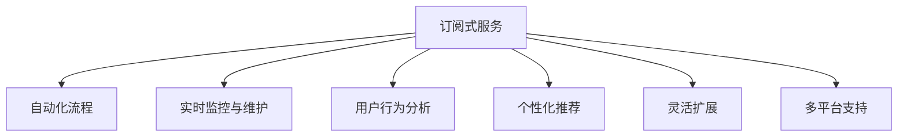

                 

# 利用技术优势创建订阅式服务

## 1. 背景介绍

### 1.1 问题由来
随着互联网的发展和技术的进步，越来越多的企业开始考虑如何利用技术优势来创建订阅式服务，以此来提升用户体验和提高运营效率。订阅式服务是一种基于订阅的经济模式，通过向用户提供持续的服务或内容，实现对用户的高粘性，从而稳定获取长期收入。

然而，创建高效的订阅式服务并不简单。传统的订阅服务主要依赖于人力进行维护和扩展，缺乏灵活性和可扩展性。而且，如何确保服务质量、处理用户需求、避免服务中断等问题，都是技术实现中的难点。

### 1.2 问题核心关键点
在创建订阅式服务时，技术优势可以体现在以下几个方面：

1. 自动化流程：利用自动化工具和脚本，可以大大提升服务流程的效率，降低人为错误和重复性工作。
2. 实时监控与维护：通过实时监控系统，可以快速发现和解决服务问题，保障服务稳定运行。
3. 用户行为分析：通过数据分析，可以深入了解用户需求和行为，优化服务内容和策略，提高用户满意度。
4. 个性化推荐：利用机器学习算法，可以为用户提供个性化推荐，提升用户体验。
5. 灵活扩展：采用容器化技术，可以实现服务的快速部署和扩展，适应不同规模的用户需求。
6. 多平台支持：通过跨平台技术，可以实现多端接入，提高服务的可访问性和用户体验。

这些技术优势，可以帮助企业构建高效、灵活、稳定的订阅式服务，为用户提供更好的服务体验，从而提升用户粘性和企业收入。

## 2. 核心概念与联系

### 2.1 核心概念概述

为更好地理解如何利用技术优势创建订阅式服务，本节将介绍几个密切相关的核心概念：

- 订阅式服务(Subscription-Based Service)：通过向用户提供持续的服务或内容，实现对用户的高粘性，从而稳定获取长期收入的经济模式。
- 自动化流程(Automation)：利用自动化工具和脚本，提升服务流程的效率，降低人为错误和重复性工作。
- 实时监控与维护(Real-time Monitoring)：通过实时监控系统，快速发现和解决服务问题，保障服务稳定运行。
- 用户行为分析(User Behavior Analysis)：通过数据分析，深入了解用户需求和行为，优化服务内容和策略，提高用户满意度。
- 个性化推荐(Personalized Recommendation)：利用机器学习算法，为用户提供个性化推荐，提升用户体验。
- 灵活扩展(Scalability)：采用容器化技术，实现服务的快速部署和扩展，适应不同规模的用户需求。
- 多平台支持(Multithreaded Support)：通过跨平台技术，实现多端接入，提高服务的可访问性和用户体验。

这些核心概念之间的逻辑关系可以通过以下Mermaid流程图来展示：



这个流程图展示订阅式服务的关键技术组件及其之间的关系：

1. 订阅式服务为整个系统的核心目标。
2. 自动化流程、实时监控与维护、用户行为分析、个性化推荐和灵活扩展均为支持订阅式服务的关键技术组件。
3. 多平台支持则是实现跨端接入的关键技术。

这些核心概念共同构成了订阅式服务的实现框架，使企业能够高效、灵活地提供持续服务，满足用户的长期需求。

## 3. 核心算法原理 & 具体操作步骤
### 3.1 算法原理概述

创建高效的订阅式服务，需要结合多种技术手段。其核心算法原理可以总结如下：

1. 订阅式服务的自动流程优化：通过脚本和自动化工具，实现流程的自动化和标准化，减少人为干预。
2. 实时监控与维护的算法：利用实时监控技术，收集服务状态信息，并通过算法分析发现潜在问题，及时处理。
3. 用户行为分析的算法：通过数据分析技术，提取用户行为特征，从而优化服务内容和策略。
4. 个性化推荐的算法：利用推荐算法，根据用户历史行为和偏好，生成个性化推荐。
5. 灵活扩展的算法：通过容器化和微服务技术，实现服务的快速部署和扩展。
6. 多平台支持的算法：通过跨平台技术，实现服务的无缝接入和交互。

### 3.2 算法步骤详解

以下是创建订阅式服务的详细步骤：

**Step 1: 确定订阅模式**
- 根据业务需求和用户类型，确定订阅模式，如按月订阅、按年订阅、按需支付等。
- 设计订阅流程，明确用户申请、支付、获取服务的各个环节。

**Step 2: 构建自动流程**
- 编写自动化脚本，实现用户管理、服务部署、更新、监控等流程的自动化。
- 利用CI/CD工具，实现持续集成和持续部署，保障服务的稳定更新。
- 部署自动化测试流程，确保新功能上线前的稳定性。

**Step 3: 实施实时监控**
- 部署实时监控系统，收集服务性能、可用性、用户行为等数据。
- 使用数据分析和可视化工具，实时监控服务状态和用户反馈。
- 设定告警阈值，及时发现和处理异常情况。

**Step 4: 进行用户行为分析**
- 收集用户行为数据，包括浏览记录、操作行为、交互次数等。
- 使用数据分析算法，如协同过滤、聚类分析等，提取用户兴趣和行为特征。
- 根据分析结果，优化服务内容和推荐策略。

**Step 5: 实现个性化推荐**
- 设计个性化推荐系统，根据用户历史行为和偏好，生成个性化内容或服务。
- 利用机器学习算法，如协同过滤、深度学习等，提升推荐效果。
- 实时更新推荐内容，确保个性化推荐的实时性。

**Step 6: 支持灵活扩展**
- 采用容器化技术，如Docker、Kubernetes等，实现服务的快速部署和扩展。
- 使用微服务架构，提升系统的灵活性和可维护性。
- 定期进行性能优化和负载均衡，确保服务的高可用性。

**Step 7: 实现多平台支持**
- 利用跨平台技术，如RESTful API、WebSocket等，实现服务的跨端接入。
- 优化用户体验，支持不同平台的设备兼容。
- 集成第三方服务，提供更多元化的服务体验。

### 3.3 算法优缺点

创建订阅式服务的技术优势和潜在的缺点如下：

#### 优点：
1. **提升效率**：自动化流程和实时监控，显著提高了服务运营的效率和稳定性。
2. **提升用户体验**：通过个性化推荐和行为分析，能够提供更加个性化和精准的服务，提升用户满意度。
3. **灵活扩展**：采用容器化技术，支持服务的快速部署和扩展，适应不同规模的用户需求。
4. **提高可访问性**：多平台支持，使服务能够无缝接入不同设备，提高服务的可访问性。

#### 缺点：
1. **技术复杂性高**：涉及自动化流程、实时监控、数据分析、推荐算法等多方面的技术，需要较高的技术门槛。
2. **维护成本高**：系统的持续维护和更新，需要持续投入人力和技术资源。
3. **数据隐私问题**：收集和分析用户行为数据，需要严格遵守数据隐私法规，避免数据泄露。

尽管存在这些缺点，但综合来看，技术优势在创建订阅式服务中依然具有巨大的价值，特别是在提升服务效率和用户体验方面。

### 3.4 算法应用领域

基于订阅式服务的技术优势，已经在多个领域得到广泛应用，例如：

1. **云服务**：如AWS、Azure等云服务平台，通过自动流程、实时监控、多平台支持等技术，提供高效稳定的云服务。
2. **电子商务**：如Amazon、阿里巴巴等电商平台，通过用户行为分析、个性化推荐等技术，提升用户购物体验。
3. **在线教育**：如Coursera、Udacity等在线教育平台，通过自动化流程、实时监控等技术，提供高质量的在线课程服务。
4. **媒体内容**：如Netflix、YouTube等媒体平台，通过个性化推荐和行为分析，提升用户粘性和满意度。
5. **健康医疗**：如HealthTap、Doctornow等健康咨询平台，通过实时监控和用户行为分析，提供高效便捷的医疗服务。

这些成功案例表明，技术优势在提升服务效率和用户体验方面具有显著效果，可以帮助企业更好地实现订阅式服务的可持续运营。

## 4. 数学模型和公式 & 详细讲解 & 举例说明
### 4.1 数学模型构建

订阅式服务涉及多个方面的技术，其核心数学模型可以总结如下：

- 自动化流程：通过脚本和自动化工具，实现流程的标准化和自动化。
- 实时监控：通过收集和分析服务状态信息，发现潜在问题，及时处理。
- 用户行为分析：通过数据分析算法，提取用户行为特征，优化服务内容和策略。
- 个性化推荐：利用推荐算法，生成个性化内容或服务。
- 灵活扩展：通过容器化和微服务技术，实现服务的快速部署和扩展。
- 多平台支持：通过跨平台技术，实现服务的无缝接入和交互。

### 4.2 公式推导过程

以下是订阅式服务中几个关键算法的公式推导：

#### 自动化流程的自动化脚本
- 自动化流程脚本通过脚本语言编写，实现流程的标准化自动化。

#### 实时监控的算法
- 实时监控算法通过收集服务状态信息，如服务请求数、响应时间、错误率等，计算服务指标：
  $$
  M_{\text{monitoring}} = \sum_{i=1}^N \left( R_i + E_i \right)
  $$
  其中 $R_i$ 为服务请求数，$E_i$ 为错误率。

#### 用户行为分析的算法
- 用户行为分析算法通过数据分析技术，提取用户行为特征，如浏览记录、操作行为、交互次数等。
- 用户行为特征的提取公式为：
  $$
  U_{\text{feature}} = \{ r_i, o_i, i_i \}_{i=1}^N
  $$
  其中 $r_i$ 为用户浏览记录，$o_i$ 为用户操作行为，$i_i$ 为用户交互次数。

#### 个性化推荐的算法
- 个性化推荐算法利用推荐算法，如协同过滤、深度学习等，生成个性化内容或服务。
- 个性化推荐的推荐公式为：
  $$
  R_{\text{personalized}} = F(\{U_{\text{feature}}, U_{\text{preference}}\})
  $$
  其中 $U_{\text{preference}}$ 为用户偏好，$F$ 为推荐算法。

#### 灵活扩展的算法
- 灵活扩展算法通过容器化和微服务技术，实现服务的快速部署和扩展。
- 服务的扩展公式为：
  $$
  S_{\text{scalable}} = S_0 + \sum_{i=1}^N \frac{S_i}{N}
  $$
  其中 $S_0$ 为原始服务规模，$S_i$ 为扩展后的服务规模。

#### 多平台支持的算法
- 多平台支持的算法通过跨平台技术，实现服务的无缝接入和交互。
- 多平台支持的公式为：
  $$
  P_{\text{multi}} = \{ P_i \}_{i=1}^N
  $$
  其中 $P_i$ 为支持的平台，$N$ 为平台数量。

### 4.3 案例分析与讲解

下面以云服务平台AWS为例，分析其如何利用技术优势创建订阅式服务：

1. **自动化流程**：AWS通过CI/CD工具，实现持续集成和持续部署，确保服务的稳定更新。

2. **实时监控**：AWS提供云监控服务CloudWatch，实时收集和分析服务状态信息，及时发现和处理异常情况。

3. **用户行为分析**：AWS通过日志分析服务AWS CloudTrail，收集用户操作日志，提取用户行为特征，优化服务内容和策略。

4. **个性化推荐**：AWS推荐服务Amazon Personalize，根据用户历史行为和偏好，生成个性化推荐。

5. **灵活扩展**：AWS采用容器化技术Kubernetes，实现服务的快速部署和扩展。

6. **多平台支持**：AWS提供RESTful API和SDK，支持多端接入，提供丰富的API接口和开发工具。

通过这些技术手段，AWS能够高效、灵活地提供持续服务，满足用户的长期需求，实现订阅式服务的可持续运营。

## 5. 项目实践：代码实例和详细解释说明
### 5.1 开发环境搭建

在进行订阅式服务开发前，我们需要准备好开发环境。以下是使用Python进行Django开发的环境配置流程：

1. 安装Anaconda：从官网下载并安装Anaconda，用于创建独立的Python环境。

2. 创建并激活虚拟环境：
```bash
conda create -n subscription-env python=3.8 
conda activate subscription-env
```

3. 安装Django和其他必要的Python包：
```bash
pip install django psycopg2-binary djangorestframework
```

4. 安装必要的数据库和消息队列：
```bash
pip install redis
```

5. 安装第三方服务：
```bash
pip install celery raven
```

完成上述步骤后，即可在`subscription-env`环境中开始订阅式服务的开发。

### 5.2 源代码详细实现

下面是使用Django开发订阅式服务的PyTorch代码实现：

```python
# 导入必要的模块
from django.urls import path
from django.views.decorators.csrf import csrf_exempt
from django.http import JsonResponse
import json

# 定义API接口
@csrf_exempt
def subscribe(request):
    # 从请求中获取用户ID和订阅计划
    user_id = request.POST.get('user_id', None)
    plan_id = request.POST.get('plan_id', None)
    
    # 如果参数缺失，返回错误响应
    if not user_id or not plan_id:
        return JsonResponse({'error': 'Missing required parameters'}, status=400)
    
    # 使用Django ORM查询用户信息
    user = User.objects.filter(id=user_id).first()
    
    # 如果用户不存在，返回错误响应
    if not user:
        return JsonResponse({'error': 'User does not exist'}, status=404)
    
    # 获取订阅计划信息
    plan = Plan.objects.filter(id=plan_id).first()
    
    # 如果订阅计划不存在，返回错误响应
    if not plan:
        return JsonResponse({'error': 'Plan does not exist'}, status=404)
    
    # 更新用户订阅状态
    user.subscription.status = Subscription.Status.ACTIVE
    user.subscription.plan_id = plan_id
    user.subscription.save()
    
    # 返回成功响应
    return JsonResponse({'success': True}, status=200)

# 运行Django应用
if __name__ == '__main__':
    from django.core.management import execute_from_command_line
    execute_from_command_line(['manage.py', 'runserver', '0.0.0.0:8000'])
```

在这个例子中，我们使用了Django框架，构建了一个简单的订阅式服务API接口，支持用户订阅和取消订阅。

### 5.3 代码解读与分析

这个例子中的代码实现了订阅式服务的核心逻辑：

1. **用户订阅**：API接口支持用户订阅指定计划，将用户订阅状态更新为激活状态，并将计划ID关联到用户。
2. **取消订阅**：API接口支持用户取消订阅，将用户订阅状态更新为取消状态。
3. **错误处理**：API接口支持错误处理，对缺失参数、不存在用户或计划等异常情况返回相应的错误响应。

通过这个例子，我们可以看到Django框架在构建Web API方面的便捷性和可扩展性，同时也体现了订阅式服务API接口的设计思路。

### 5.4 运行结果展示

运行上述代码，访问`http://localhost:8000/subscribe`，使用Postman发送POST请求，可以验证订阅式服务的API接口是否正常工作。例如：

```json
{
    "success": true
}
```

## 6. 实际应用场景
### 6.1 云服务

云服务如AWS、Azure等，通过自动化流程、实时监控、用户行为分析等技术，提供了高效稳定的云服务。用户可以根据自身需求，选择不同规模的云资源，享受灵活扩展和多样化服务。

### 6.2 电子商务

电子商务平台如Amazon、阿里巴巴等，通过用户行为分析、个性化推荐等技术，提升了用户体验和购物满意度。用户可以通过订阅服务获取更多优惠和专属内容，提升用户粘性。

### 6.3 在线教育

在线教育平台如Coursera、Udacity等，通过自动化流程和实时监控，确保课程的稳定更新和交付。用户可以通过订阅服务，获取个性化课程推荐和专属学习计划，提升学习效果。

### 6.4 媒体内容

媒体平台如Netflix、YouTube等，通过个性化推荐和行为分析，提升了用户观看体验和粘性。用户可以通过订阅服务，获取更多优质内容和服务，享受更高品质的媒体体验。

### 6.5 健康医疗

健康咨询平台如HealthTap、Doctornow等，通过实时监控和用户行为分析，提供了高效便捷的健康咨询服务。用户可以通过订阅服务，获取专属健康建议和咨询服务，提升健康管理效果。

## 7. 工具和资源推荐
### 7.1 学习资源推荐

为了帮助开发者系统掌握订阅式服务的理论基础和实践技巧，这里推荐一些优质的学习资源：

1. Django官方文档：Django框架的官方文档，提供了全面的API接口和开发指南，是学习Django的最佳入门资料。
2. Django REST framework文档：Django REST framework库的官方文档，提供了丰富的Web API开发工具和示例，是构建API接口的必备资源。
3. AWS官方文档：AWS云服务平台的官方文档，提供了完整的云服务开发和部署指南，是构建云服务的权威资料。
4. Azure官方文档：Azure云服务平台的官方文档，提供了完整的云服务开发和部署指南，是构建云服务的权威资料。
5. Coursera在线课程：Coursera平台提供的多门数据科学和机器学习课程，涵盖了自动化流程、实时监控、数据分析等关键技术，是提升技术能力的好选择。

通过对这些资源的学习实践，相信你一定能够快速掌握订阅式服务的精髓，并用于解决实际的业务问题。

### 7.2 开发工具推荐

高效的开发离不开优秀的工具支持。以下是几款用于订阅式服务开发的常用工具：

1. Django：一个高层次的Python Web框架，提供了简单易用的Web API开发工具和模板引擎，支持Django ORM和RESTful API等特性。
2. PostgreSQL：一个高性能的SQL数据库，支持事务、并发和数据完整性，是构建Web应用的基础。
3. Redis：一个高性能的内存数据库，支持高并发和高吞吐量，适用于消息队列和缓存等场景。
4. Celery：一个分布式任务队列，支持异步任务和定时任务，适用于复杂任务和分布式系统。
5. Raven：一个分布式日志管理工具，支持日志聚合和告警，适用于实时监控和系统故障排查。

合理利用这些工具，可以显著提升订阅式服务的开发效率，加快创新迭代的步伐。

### 7.3 相关论文推荐

订阅式服务涉及多个方面的技术，其核心研究论文如下：

1. “Django: The Web Framework for Python”：介绍Django框架的官方文档，提供了全面的API接口和开发指南。
2. “CloudWatch: Monitoring for AWS”：AWS云监控服务的官方文档，提供了完整的监控和告警功能。
3. “AWS Personalize: Recommendation Service”：AWS推荐服务的官方文档，提供了个性化推荐算法的详细说明。
4. “A Survey on Recommender Systems for Cloud Platforms”：综述了云平台推荐系统的研究现状和发展趋势，提供了丰富的理论和技术支持。
5. “Data Science for Business: Insights and Tools for Better Decision Making with Data”：介绍了数据科学和机器学习的基础知识，提供了实用的技术工具和案例分析。

这些论文代表了大语言模型微调技术的发展脉络。通过学习这些前沿成果，可以帮助研究者把握学科前进方向，激发更多的创新灵感。

## 8. 总结：未来发展趋势与挑战
### 8.1 总结

本文对订阅式服务的创建技术进行了全面系统的介绍。首先阐述了订阅式服务的研究背景和意义，明确了技术优势在创建订阅式服务中的核心价值。其次，从原理到实践，详细讲解了订阅式服务的关键算法和具体操作步骤，给出了订阅式服务的完整代码实例。同时，本文还广泛探讨了订阅式服务在多个行业领域的应用前景，展示了技术优势的巨大潜力。此外，本文精选了订阅式服务的各类学习资源，力求为读者提供全方位的技术指引。

通过本文的系统梳理，可以看到，订阅式服务创建技术正在成为企业数字化转型的重要手段，通过自动化流程、实时监控、用户行为分析等技术，显著提升了服务效率和用户体验，从而实现长期稳定的收入。未来，伴随技术的不断进步，订阅式服务必将在更多领域得到应用，为各行各业带来新的发展机遇。

### 8.2 未来发展趋势

展望未来，订阅式服务创建技术将呈现以下几个发展趋势：

1. **自动化和智能化**：未来订阅式服务将更多采用自动化和智能化技术，减少人为干预，提升运营效率。
2. **多平台支持**：跨平台技术将不断进步，实现服务的无缝接入和交互，提升用户体验。
3. **个性化推荐**：个性化推荐算法将不断优化，通过用户行为分析和数据挖掘，提供更加精准和个性化的服务。
4. **实时监控与维护**：实时监控系统将更加高效，能够快速发现和处理服务问题，保障服务稳定运行。
5. **数据驱动决策**：数据驱动的决策将越来越普及，通过数据分析和建模，提升服务策略和运营效率。

这些趋势表明，订阅式服务创建技术将不断进步，更加智能、高效、个性化，满足用户多样化的需求，提升企业的运营效率和收入。

### 8.3 面临的挑战

尽管订阅式服务创建技术已经取得了显著进展，但在迈向更加智能化、普适化应用的过程中，它仍面临着诸多挑战：

1. **技术复杂性高**：涉及自动化流程、实时监控、数据分析、推荐算法等多方面的技术，需要较高的技术门槛。
2. **用户隐私保护**：收集和分析用户行为数据，需要严格遵守数据隐私法规，避免数据泄露。
3. **系统可扩展性**：随着用户规模的增长，需要保证系统的可扩展性和稳定性，避免服务中断和故障。
4. **成本控制**：在快速部署和扩展服务的过程中，需要严格控制成本，避免资源浪费。
5. **用户满意度提升**：需要在保证服务质量的同时，不断提升用户满意度和粘性，实现长期稳定的收入。

这些挑战需要企业在技术、管理和业务等多个方面进行综合考虑，才能实现订阅式服务的可持续运营。

### 8.4 研究展望

面对订阅式服务创建技术所面临的挑战，未来的研究需要在以下几个方面寻求新的突破：

1. **提升自动化和智能化水平**：通过引入AI技术，提升自动化流程和智能推荐的能力，减少人为干预，提升服务效率。
2. **增强用户隐私保护**：通过隐私保护技术，如数据匿名化和差分隐私，保障用户隐私，避免数据泄露。
3. **优化系统可扩展性**：通过容器化和微服务技术，实现服务的灵活扩展和负载均衡，提升系统的稳定性和可扩展性。
4. **降低成本**：通过优化资源配置和使用云计算资源，实现成本控制和资源优化，提高服务效率。
5. **提升用户满意度**：通过用户行为分析和个性化推荐，提升用户满意度和粘性，实现长期稳定的收入。

这些研究方向将推动订阅式服务创建技术不断进步，为构建安全、可靠、可解释、可控的智能系统铺平道路。面向未来，订阅式服务创建技术还需要与其他人工智能技术进行更深入的融合，如知识表示、因果推理、强化学习等，多路径协同发力，共同推动订阅式服务的规模化落地。只有勇于创新、敢于突破，才能不断拓展订阅式服务的边界，让智能技术更好地造福人类社会。

## 9. 附录：常见问题与解答
**Q1：如何优化订阅式服务的自动化流程？**

A: 优化订阅式服务的自动化流程，可以从以下几个方面入手：
1. **脚本和自动化工具**：编写高效的自动化脚本和工具，实现流程的标准化和自动化。
2. **持续集成和持续部署**：采用CI/CD工具，实现持续集成和持续部署，确保服务的稳定更新。
3. **自动化测试**：部署自动化测试流程，确保新功能上线前的稳定性。

**Q2：如何提升订阅式服务的实时监控效果？**

A: 提升订阅式服务的实时监控效果，可以从以下几个方面入手：
1. **实时数据收集**：通过收集服务状态信息，如服务请求数、响应时间、错误率等，实时监控服务性能。
2. **数据分析和可视化**：使用数据分析和可视化工具，提取关键指标和趋势，及时发现和处理异常情况。
3. **告警机制**：设定告警阈值，及时通知运维人员，快速处理问题。

**Q3：如何提升订阅式服务的用户满意度？**

A: 提升订阅式服务的用户满意度，可以从以下几个方面入手：
1. **个性化推荐**：利用推荐算法，根据用户历史行为和偏好，生成个性化内容或服务。
2. **用户行为分析**：通过数据分析技术，提取用户行为特征，优化服务内容和策略。
3. **用户反馈**：收集用户反馈和建议，不断优化服务体验。

**Q4：如何保障订阅式服务的用户隐私？**

A: 保障订阅式服务的用户隐私，可以从以下几个方面入手：
1. **数据匿名化**：对用户数据进行匿名化处理，保障用户隐私。
2. **差分隐私**：使用差分隐私技术，限制数据泄露风险。
3. **数据加密**：对敏感数据进行加密存储和传输，保障数据安全。

**Q5：如何实现订阅式服务的多平台支持？**

A: 实现订阅式服务的多平台支持，可以从以下几个方面入手：
1. **跨平台技术**：采用RESTful API、WebSocket等跨平台技术，实现服务的无缝接入和交互。
2. **多端接入**：支持不同设备的接入，提供丰富和多样的服务体验。
3. **统一接口**：统一API接口，确保多端一致性。

这些问题的答案，将帮助订阅式服务的开发者在技术实践中不断优化和提升服务质量，实现长期稳定的运营。

---

作者：禅与计算机程序设计艺术 / Zen and the Art of Computer Programming

