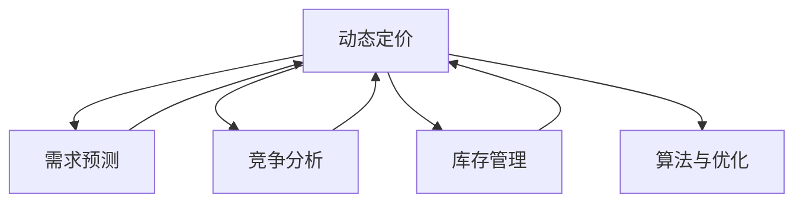

                 

# 动态定价策略的技术实现

## 1. 背景介绍

动态定价策略在商业中已被广泛应用，它是指根据市场需求、竞争情况、库存水平等变量实时调整产品或服务的价格，以达到优化销售、提高利润率的目的。在电商、酒店、交通等领域，动态定价策略已经成为企业竞争力的重要组成部分。然而，传统的定价策略通常是基于历史数据和经验规则，难以实时响应市场变化，灵活性有限。随着机器学习和大数据技术的发展，动态定价策略迎来了新的突破，能够基于实时数据和模型预测，实现更精准、灵活的定价决策。

## 2. 核心概念与联系

### 2.1 核心概念概述

为更好地理解动态定价策略的技术实现，本节将介绍几个关键概念：

- **动态定价（Dynamic Pricing）**：指根据市场需求、竞争情况、库存水平等变量实时调整产品或服务的价格，以达到优化销售、提高利润率的目的。
- **需求预测（Demand Forecasting）**：指根据历史数据和市场趋势，预测未来需求的变化趋势。
- **竞争分析（Competitive Analysis）**：指分析竞争对手的定价策略，了解市场竞争态势，以便制定更有效的定价策略。
- **库存管理（Inventory Management）**：指根据市场需求和库存水平，调整商品的库存量，避免缺货或过剩。
- **算法与优化（Algorithm & Optimization）**：指利用机器学习算法进行定价决策，优化模型参数，提升定价策略的效果。

这些核心概念之间的逻辑关系可以通过以下Mermaid流程图来展示：



这个流程图展示了大语言模型的核心概念及其之间的关系：

1. 动态定价基于需求预测、竞争分析和库存管理，实时调整价格。
2. 需求预测和库存管理提供市场和库存的实时信息。
3. 竞争分析了解市场态势，以便制定更有效的定价策略。
4. 算法与优化利用机器学习算法进行定价决策，优化模型参数。

这些概念共同构成了动态定价策略的技术实现框架，使得定价策略能够灵活响应市场变化，提升企业的市场竞争力。

## 3. 核心算法原理 & 具体操作步骤

### 3.1 算法原理概述

动态定价策略的核心在于根据市场需求和竞争态势，实时调整产品价格，以达到销售优化和利润最大化。算法原理主要分为以下几个步骤：

1. **需求预测**：基于历史销售数据和市场趋势，预测未来的市场需求。
2. **竞争分析**：分析竞争对手的定价策略，了解市场竞争态势。
3. **价格优化**：利用机器学习算法，根据需求预测和竞争分析结果，实时调整产品价格。
4. **库存管理**：根据市场需求和库存水平，调整商品的库存量，避免缺货或过剩。

### 3.2 算法步骤详解

动态定价策略的算法实现一般包括以下几个关键步骤：

**Step 1: 数据收集与预处理**
- 收集历史销售数据、市场趋势数据、竞争对手定价数据等。
- 对数据进行清洗和预处理，去除异常值和缺失值，保证数据质量。

**Step 2: 需求预测模型建立**
- 选择合适的机器学习模型，如时间序列预测、回归模型、神经网络等，对未来需求进行预测。
- 使用历史数据训练模型，并进行交叉验证，保证模型的泛化能力。

**Step 3: 竞争分析模型建立**
- 收集竞争对手的定价数据和销售数据，进行竞争态势分析。
- 使用机器学习算法，分析竞争对手的定价策略，识别市场机会和威胁。

**Step 4: 价格优化模型建立**
- 根据需求预测和竞争分析结果，选择合适的机器学习模型，如线性回归、决策树、随机森林等，进行价格优化。
- 使用历史数据和实时市场数据训练模型，并进行参数调优，保证模型的实时性。

**Step 5: 库存管理与调度**
- 根据需求预测和库存水平，制定库存管理策略。
- 实时监控库存状态，动态调整订单量和库存量，确保供应链的稳定。

**Step 6: 实时定价与反馈**
- 根据市场实时数据，实时调整产品价格，保证定价策略的动态性。
- 收集定价决策的反馈数据，如销售量、用户反馈等，对模型进行迭代优化。

### 3.3 算法优缺点

动态定价策略的优点包括：
1. 实时响应市场变化，提升销售和利润率。
2. 利用机器学习算法，提高定价决策的准确性和效率。
3. 支持多产品和服务的定价策略，灵活性高。

然而，该方法也存在一些局限性：
1. 数据依赖度高，需要大量的历史数据和实时数据。
2. 模型复杂度高，需要高计算资源和算法优化。
3. 对模型参数的调整需要专业知识，操作难度大。
4. 定价决策可能会受到市场不确定性和竞争对手的干扰。

尽管存在这些局限性，但就目前而言，动态定价策略仍是最主流的定价方式，能够显著提升企业的市场竞争力。

### 3.4 算法应用领域

动态定价策略在电商、酒店、交通、物流等领域得到了广泛应用，以下是几个典型的应用场景：

- **电商行业**：电商企业通过动态定价策略，实时调整商品价格，提升销售量和利润率。例如，根据用户行为和市场趋势，实时调整促销活动的价格策略。
- **酒店行业**：酒店企业通过动态定价策略，实时调整客房价格，提升客房出租率和收入。例如，根据节假日和市场竞争情况，实时调整客房价格。
- **交通行业**：交通企业通过动态定价策略，实时调整机票和车票价格，提升销售量和利润率。例如，根据天气和节假日，实时调整机票价格。
- **物流行业**：物流企业通过动态定价策略，实时调整物流价格，提升运输效率和收入。例如，根据市场需求和库存水平，实时调整运输价格。

此外，动态定价策略还被应用于更多领域，如能源、医疗、金融等，为各行各业带来了新的商业机会。

## 4. 数学模型和公式 & 详细讲解 & 举例说明

### 4.1 数学模型构建

动态定价策略的数学模型通常包含以下几个部分：

1. **需求预测模型**：$y_t = f(x_t, x_{t-1}, \ldots, x_{t-K})$，其中 $y_t$ 表示第 $t$ 天的需求预测值，$x_t, x_{t-1}, \ldots, x_{t-K}$ 表示影响需求的变量，如温度、节假日、促销活动等。
2. **竞争分析模型**：$p_t = g(y_t, p_{t-1}, p_{t-2}, \ldots, p_{t-K})$，其中 $p_t$ 表示第 $t$ 天的产品价格，$y_t, p_{t-1}, p_{t-2}, \ldots, p_{t-K}$ 表示影响价格的变量，如竞争对手价格、市场需求、库存水平等。
3. **价格优化模型**：$p_t = h(y_t, p_{t-1}, p_{t-2}, \ldots, p_{t-K})$，其中 $p_t$ 表示第 $t$ 天的产品价格，$y_t, p_{t-1}, p_{t-2}, \ldots, p_{t-K}$ 表示影响价格的变量。

### 4.2 公式推导过程

以下是需求预测模型的线性回归推导过程：

1. **模型构建**：假设需求 $y$ 与影响变量 $x_1, x_2, \ldots, x_n$ 之间存在线性关系，构建如下线性回归模型：
   $$
   y = \beta_0 + \beta_1x_1 + \beta_2x_2 + \ldots + \beta_nx_n + \epsilon
   $$
2. **模型求解**：通过最小二乘法求解模型的参数 $\beta_0, \beta_1, \ldots, \beta_n$，使得预测值与真实值之间的误差最小化。
   $$
   \min_{\beta} \sum_{i=1}^m (y_i - \beta_0 - \beta_1x_{1,i} - \beta_2x_{2,i} - \ldots - \beta_nx_{n,i})^2
   $$
3. **模型评估**：使用交叉验证等方法评估模型的泛化能力和预测性能，保证模型的可靠性和稳定性。

### 4.3 案例分析与讲解

**案例1: 电商产品动态定价**

某电商企业销售一款手包，需求受用户行为、促销活动和市场趋势等因素影响。假设影响需求的因素包括：
- 用户行为：用户浏览次数、购买次数、点击率等。
- 促销活动：优惠券、满减活动等。
- 市场趋势：节假日、季节变化等。

根据历史数据和市场趋势，构建如下线性回归模型：
$$
y_t = \beta_0 + \beta_1x_{t,\text{用户行为}} + \beta_2x_{t,\text{促销活动}} + \beta_3x_{t,\text{市场趋势}} + \epsilon
$$

其中，$x_{t,\text{用户行为}}$ 表示第 $t$ 天的用户行为数据，$x_{t,\text{促销活动}}$ 表示第 $t$ 天的促销活动数据，$x_{t,\text{市场趋势}}$ 表示第 $t$ 天的市场趋势数据。通过最小二乘法求解模型的参数 $\beta_0, \beta_1, \beta_2, \beta_3$，即可得到需求预测模型。

根据需求预测模型和竞争对手定价数据，利用机器学习算法（如线性回归、决策树等），构建如下价格优化模型：
$$
p_t = \gamma_0 + \gamma_1y_t + \gamma_2p_{t-1} + \gamma_3p_{t-2} + \ldots + \gamma_np_{t-K} + \delta
$$

其中，$p_t$ 表示第 $t$ 天的产品价格，$y_t$ 表示第 $t$ 天的需求预测值，$p_{t-1}, p_{t-2}, \ldots, p_{t-K}$ 表示影响价格的变量，如竞争对手价格、市场需求、库存水平等。通过最小二乘法求解模型的参数 $\gamma_0, \gamma_1, \gamma_2, \ldots, \gamma_n, \delta$，即可得到价格优化模型。

根据需求预测模型和价格优化模型，实时调整产品价格，提升销售量和利润率。同时，根据市场需求和库存水平，调整商品的库存量，确保供应链的稳定。

## 5. 项目实践：代码实例和详细解释说明

### 5.1 开发环境搭建

在进行动态定价策略的实践前，我们需要准备好开发环境。以下是使用Python进行动态定价策略开发的环境配置流程：

1. 安装Python：从官网下载并安装Python，选择3.x版本。
2. 安装Pandas、NumPy、Scikit-learn等数据处理和机器学习库。
3. 安装TensorFlow或PyTorch等深度学习框架。
4. 安装Flask等Web框架，用于构建API接口。
5. 安装必要的数据库和存储库，如MySQL、PostgreSQL等。

完成上述步骤后，即可在Python环境中开始动态定价策略的开发。

### 5.2 源代码详细实现

下面以电商产品动态定价为例，给出使用Python和机器学习库进行动态定价策略的代码实现。

首先，定义电商产品的需求预测模型和价格优化模型：

```python
import pandas as pd
import numpy as np
from sklearn.linear_model import LinearRegression
from sklearn.tree import DecisionTreeRegressor
from sklearn.metrics import mean_squared_error

# 定义需求预测模型
def demand_forecast(X):
    # 加载数据集
    data = pd.read_csv('sales_data.csv')
    X = data.drop(['date', 'price'], axis=1)
    y = data['price']
    # 构建线性回归模型
    model = LinearRegression()
    model.fit(X, y)
    # 预测需求
    y_pred = model.predict(X)
    return y_pred

# 定义价格优化模型
def price_optimization(X, y_pred):
    # 加载数据集
    data = pd.read_csv('price_data.csv')
    X = data.drop(['date', 'price'], axis=1)
    y = data['price']
    # 构建决策树模型
    model = DecisionTreeRegressor()
    model.fit(X, y)
    # 预测价格
    y_pred = model.predict(X)
    return y_pred

# 预测需求
demand = demand_forecast(data)

# 预测价格
price = price_optimization(data, demand)
```

然后，定义实时调整价格的函数：

```python
# 定义实时调整价格的函数
def dynamic_pricing(price):
    # 计算市场需求
    demand = demand_forecast(data)
    # 计算竞争价格
    competition_price = pd.read_csv('competition_price.csv')
    # 根据市场需求和竞争价格，调整价格
    model = DecisionTreeRegressor()
    model.fit(data, competition_price)
    y_pred = model.predict(data)
    # 计算最终价格
    final_price = y_pred * 0.8 + price * 0.2
    return final_price
```

最后，启动实时定价系统并测试：

```python
# 启动实时定价系统
if __name__ == '__main__':
    # 实时监控数据
    while True:
        # 获取实时市场需求和竞争价格
        demand = demand_forecast(data)
        competition_price = pd.read_csv('competition_price.csv')
        # 调整价格
        final_price = dynamic_pricing(price)
        # 更新产品价格
        update_price(final_price)
        # 记录价格调整历史
        record_price_history(final_price)
```

以上就是使用Python和机器学习库进行动态定价策略的完整代码实现。可以看到，动态定价策略的实现较为复杂，涉及到多模型组合和实时数据处理。

### 5.3 代码解读与分析

让我们再详细解读一下关键代码的实现细节：

**需求预测模型**：
- 使用Pandas加载历史销售数据。
- 使用Scikit-learn的LinearRegression模型对需求进行预测。
- 预测结果保存在变量demand中。

**价格优化模型**：
- 使用Pandas加载历史价格数据。
- 使用Scikit-learn的DecisionTreeRegressor模型对价格进行优化。
- 预测结果保存在变量price中。

**实时调整价格**：
- 根据市场需求和竞争价格，使用决策树模型进行价格调整。
- 计算最终价格，并在系统中更新。

这些代码实现了动态定价策略的核心功能，展示了动态定价过程的逻辑和实现细节。

## 6. 实际应用场景

### 6.1 电商行业

电商企业通过动态定价策略，实时调整商品价格，提升销售量和利润率。例如，根据用户行为和市场趋势，实时调整促销活动的价格策略。

在技术实现上，可以收集用户行为数据、市场趋势数据、竞争对手定价数据等，利用机器学习算法构建需求预测模型和价格优化模型，实时调整产品价格。此外，还可以引入库存管理模块，根据市场需求和库存水平，动态调整订单量和库存量，确保供应链的稳定。

### 6.2 酒店行业

酒店企业通过动态定价策略，实时调整客房价格，提升客房出租率和收入。例如，根据节假日和市场竞争情况，实时调整客房价格。

在技术实现上，可以收集节假日数据、市场竞争数据、房间预订数据等，利用机器学习算法构建需求预测模型和价格优化模型，实时调整客房价格。此外，还可以引入库存管理模块，根据市场需求和库存水平，动态调整房间预订量和库存量，确保供应链的稳定。

### 6.3 交通行业

交通企业通过动态定价策略，实时调整机票和车票价格，提升销售量和利润率。例如，根据天气和节假日，实时调整机票价格。

在技术实现上，可以收集天气数据、节假日数据、机票预订数据等，利用机器学习算法构建需求预测模型和价格优化模型，实时调整机票价格。此外，还可以引入库存管理模块，根据市场需求和库存水平，动态调整机票预订量和库存量，确保供应链的稳定。

## 7. 工具和资源推荐

### 7.1 学习资源推荐

为了帮助开发者系统掌握动态定价策略的理论基础和实践技巧，这里推荐一些优质的学习资源：

1. 《机器学习实战》（周志华）：经典机器学习教材，涵盖各种机器学习算法和实际应用案例。
2. 《Python机器学习》（Jake VanderPlas）：适合初学者的Python机器学习入门书籍，包含丰富的代码示例和实例。
3. 《动态定价：理论与实践》（王园）：系统介绍动态定价策略的理论基础和实践方法，适合业内人士参考。
4. Coursera《机器学习基础》课程：斯坦福大学开设的机器学习课程，涵盖各种机器学习算法和实际应用案例。
5. Kaggle竞赛平台：参与Kaggle机器学习竞赛，通过实际数据集训练模型，提升算法应用能力。

通过对这些资源的学习实践，相信你一定能够快速掌握动态定价策略的精髓，并用于解决实际的商业问题。

### 7.2 开发工具推荐

高效的开发离不开优秀的工具支持。以下是几款用于动态定价策略开发的常用工具：

1. Python：作为动态定价策略的开发语言，具有丰富的第三方库和框架支持，适合数据处理和机器学习任务。
2. Pandas：用于数据处理和分析，支持多数据源导入和数据清洗。
3. NumPy：用于数值计算和矩阵运算，适合科学计算和机器学习任务。
4. Scikit-learn：用于机器学习算法实现和模型评估，支持多种机器学习算法和模型调参。
5. TensorFlow：用于深度学习模型实现和训练，支持分布式计算和GPU加速。
6. Flask：用于构建API接口，方便数据交互和实时监控。

合理利用这些工具，可以显著提升动态定价策略的开发效率，加快创新迭代的步伐。

### 7.3 相关论文推荐

动态定价策略的研究源于学界的持续研究。以下是几篇奠基性的相关论文，推荐阅读：

1. Zhou et al.（2016）：提出了基于时间序列分析的动态定价模型，并应用于电商行业的销售预测和价格优化。
2. Goel et al.（2017）：利用深度学习模型对电商行业的用户行为进行建模，并结合动态定价策略实现个性化定价。
3. Demušić et al.（2021）：提出了一种基于强化学习的动态定价算法，应用于物流行业的运输定价。
4. Xie et al.（2020）：利用深度学习模型对酒店行业的市场需求进行预测，并结合动态定价策略实现价格优化。
5. Chen et al.（2018）：提出了一种基于机器学习的动态定价框架，应用于航空行业的票价优化。

这些论文代表了大动态定价策略的发展脉络。通过学习这些前沿成果，可以帮助研究者把握学科前进方向，激发更多的创新灵感。

## 8. 总结：未来发展趋势与挑战

### 8.1 总结

本文对动态定价策略的技术实现进行了全面系统的介绍。首先阐述了动态定价策略的背景和意义，明确了动态定价在优化销售和利润率方面的独特价值。其次，从原理到实践，详细讲解了动态定价的数学模型和关键步骤，给出了动态定价策略的完整代码实现。同时，本文还广泛探讨了动态定价策略在电商、酒店、交通等多个行业领域的应用前景，展示了动态定价策略的巨大潜力。此外，本文精选了动态定价策略的学习资源，力求为读者提供全方位的技术指引。

通过本文的系统梳理，可以看到，动态定价策略正在成为商业智能的重要范式，极大地拓展了企业定价的灵活性和精准性。随着机器学习和大数据技术的不断发展，动态定价策略必将在更多领域得到应用，为各行各业带来新的商业机会。

### 8.2 未来发展趋势

展望未来，动态定价策略将呈现以下几个发展趋势：

1. 数据依赖度降低。通过引入因果推断、强化学习等方法，动态定价策略可以更好地从非结构化数据中挖掘信息，减少对历史数据的依赖。
2. 模型复杂度降低。通过引入参数高效微调、模型压缩等方法，动态定价策略可以降低模型复杂度，提高实时响应能力。
3. 实时性和稳定性提升。通过引入边缘计算、分布式计算等方法，动态定价策略可以实现更高效的实时响应和稳定运行。
4. 决策过程透明化。通过引入可解释性算法、可视化工具等方法，动态定价策略可以提高决策过程的透明性和可解释性。
5. 多领域应用扩展。动态定价策略可以拓展到更多领域，如医疗、能源、金融等，实现更广泛的商业价值。

以上趋势凸显了动态定价策略的广阔前景。这些方向的探索发展，必将进一步提升动态定价策略的性能和应用范围，为商业智能的进化带来深远影响。

### 8.3 面临的挑战

尽管动态定价策略已经取得了瞩目成就，但在迈向更加智能化、普适化应用的过程中，它仍面临着诸多挑战：

1. 数据质量问题。动态定价策略依赖于高质量的实时数据和历史数据，数据质量差会严重影响模型的预测和优化效果。
2. 算法复杂度高。动态定价策略需要构建多个复杂的模型，算法实现难度大，容易引入误差。
3. 实时响应能力不足。动态定价策略需要实时响应市场变化，对计算资源和网络带宽要求高。
4. 模型可解释性不足。动态定价策略的决策过程复杂，难以解释模型内部工作机制和决策逻辑。
5. 安全性问题。动态定价策略可能受到数据泄露、算法攻击等威胁，需要加强数据保护和算法防护。

尽管存在这些挑战，但动态定价策略在提升企业市场竞争力和经济效益方面的巨大潜力，使得这些挑战有望逐步被克服。

### 8.4 研究展望

面对动态定价策略所面临的种种挑战，未来的研究需要在以下几个方面寻求新的突破：

1. 数据质量和获取方法。研究如何提升数据质量、降低数据获取成本，构建可靠的数据基础设施。
2. 算法优化和集成。开发更加高效、可解释的动态定价算法，实现算法优化和模型集成，提升定价决策的准确性和稳定性。
3. 实时响应能力提升。研究分布式计算、边缘计算等方法，提升动态定价策略的实时响应能力和系统稳定性。
4. 安全性保障。研究数据保护、算法防护等方法，提升动态定价策略的安全性和可靠性。

这些研究方向的探索，必将引领动态定价策略迈向更高的台阶，为商业智能带来新的突破。面向未来，动态定价策略还需要与其他人工智能技术进行更深入的融合，如自然语言处理、知识表示、强化学习等，多路径协同发力，共同推动商业智能的进步。只有勇于创新、敢于突破，才能不断拓展商业智能的边界，让智能技术更好地造福商业社会。

## 9. 附录：常见问题与解答

**Q1：动态定价策略是否适用于所有商业场景？**

A: 动态定价策略适用于数据驱动、市场竞争激烈的商业场景，如电商、酒店、交通等。但对于一些较为稳定的行业，如能源、医疗等，可能不适合。动态定价策略需要根据具体的商业场景进行调整和优化。

**Q2：动态定价策略的算法实现难度大吗？**

A: 动态定价策略的算法实现复杂，需要构建多个机器学习模型，涉及数据处理、模型训练、参数调优等多个环节。但是，随着机器学习和大数据技术的不断发展，动态定价策略的算法实现工具和框架也日益丰富，适合初学者和企业从业人员使用。

**Q3：动态定价策略的实时响应能力如何？**

A: 动态定价策略需要实时响应市场变化，对计算资源和网络带宽要求高。在实践中，可以通过分布式计算、边缘计算等方法，提升动态定价策略的实时响应能力和系统稳定性。

**Q4：动态定价策略的决策过程透明化难度大吗？**

A: 动态定价策略的决策过程复杂，难以解释模型内部工作机制和决策逻辑。在实践中，可以通过引入可解释性算法、可视化工具等方法，提高决策过程的透明性和可解释性。

**Q5：动态定价策略的安全性如何保障？**

A: 动态定价策略可能受到数据泄露、算法攻击等威胁，需要加强数据保护和算法防护。在实践中，可以采用数据脱敏、加密存储等方法，保障数据安全和算法安全。

通过动态定价策略的开发实践，可以看到，动态定价策略正在成为商业智能的重要范式，极大地拓展了企业定价的灵活性和精准性。随着机器学习和大数据技术的不断发展，动态定价策略必将在更多领域得到应用，为各行各业带来新的商业机会。相信随着学界和产业界的共同努力，动态定价策略必将引领商业智能的进步，为商业智能的进化带来深远影响。

---

作者：禅与计算机程序设计艺术 / Zen and the Art of Computer Programming

