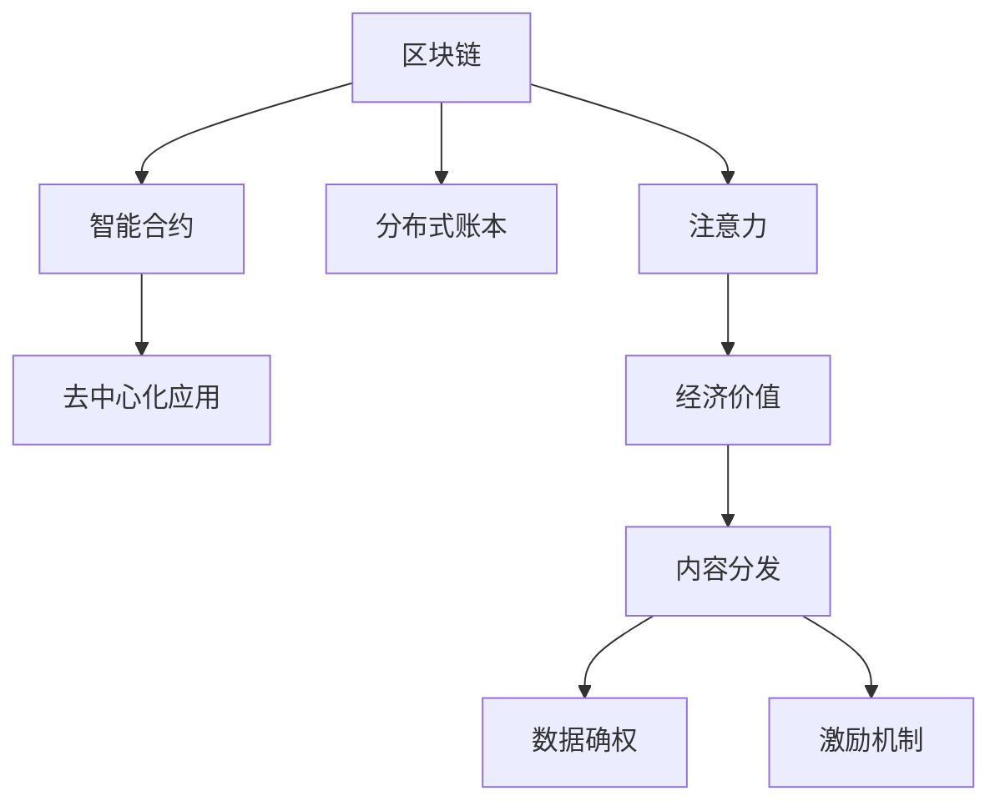

                 

## 1. 背景介绍

### 1.1 问题由来

在数字化、互联网普及的今天，信息爆炸、注意力稀缺逐渐成为社会主要矛盾。传统经济时代，物质资源是稀缺的，而注意力经济时代，信息资源的爆炸和注意力获取的困难已经取代物质资源的稀缺，成为制约社会发展的主要障碍。因此，如何有效利用注意力，转化为经济价值，是当前信息时代亟待解决的重要问题。

### 1.2 问题核心关键点

本文聚焦于区块链技术在注意力经济中的应用潜力。通过对区块链技术特性的深入分析，讨论其如何在内容分发、数据确权、激励机制等方面发挥作用，探讨其如何助力注意力资源高效转化为经济价值。

## 2. 核心概念与联系

### 2.1 核心概念概述

为了更好地理解区块链技术在注意力经济中的应用，本节将介绍几个关键概念：

- **区块链（Blockchain）**：一种去中心化、公开透明的数据记录技术。其核心特性包括去中心化、不可篡改、可追溯等，提供了一种新的数据记录和交换方式。
- **注意力（Attention）**：指人们在特定信息上的关注程度，包括主动关注和被动关注。在注意力经济中，注意力是衡量信息价值的关键指标。
- **经济价值（Economic Value）**：指信息资源转化为货币价值的过程，即注意力资源通过特定方式转化为收益的过程。
- **分布式账本（Distributed Ledger）**：指区块链的核心数据结构，由多个节点共同维护，确保数据的一致性和不可篡改性。
- **智能合约（Smart Contract）**：指一种可以自动执行、具有条件判断和执行机制的合约，能够在区块链上实现自动化交易和逻辑控制。
- **去中心化应用（Decentralized Application, DApp）**：指在区块链上运行的应用程序，通过区块链网络提供去中心化的服务。

这些核心概念之间的联系可以通过以下Mermaid流程图来展示：



这个流程图展示了大语言模型与区块链各关键概念之间的逻辑关系：

1. 区块链提供了一个去中心化的数据记录平台。
2. 智能合约为自动化交易和逻辑控制提供了可能。
3. 去中心化应用将区块链技术封装成易于使用的服务。
4. 注意力是信息资源转化为经济价值的核心指标。
5. 内容分发、数据确权、激励机制是注意力转化为经济价值的主要方式。

## 3. 核心算法原理 & 具体操作步骤

### 3.1 算法原理概述

区块链技术在注意力经济中的应用，本质上是一种基于区块链网络的内容确权和激励机制，旨在通过区块链的特性，最大化注意力资源的经济价值。其核心算法原理包括：

- **分布式共识算法**：通过去中心化的共识机制，确保数据的一致性和安全性，防止单点故障和数据篡改。
- **智能合约执行机制**：通过自动化执行机制，确保交易的透明性和可追溯性，保障参与者的利益。
- **激励机制设计**：通过设计合理的激励机制，激发内容创作者和消费者的积极性，推动内容生产的繁荣。

### 3.2 算法步骤详解

区块链技术在注意力经济中的应用，一般包括以下几个关键步骤：

**Step 1: 内容生产与发布**

内容创作者利用区块链平台，通过智能合约记录其内容生产的详细信息，包括创作时间、内容类型、创作者信息等。智能合约自动将内容发布到区块链网络，生成不可篡改的内容记录。

**Step 2: 内容确权与验证**

区块链网络上的每个节点都参与内容确权和验证过程，通过共识机制确认内容的真实性和版权归属。一旦内容被确认，其版权即得到保护，任何未经授权的使用都将被视为侵权。

**Step 3: 内容分发与激励**

智能合约根据内容被浏览、点赞、评论等行为的数量和频率，自动计算注意力价值，并将其转化为货币奖励。内容创作者可通过智能合约自动领取奖励，保障其创作激励。

**Step 4: 内容治理与监控**

智能合约内置内容治理机制，包括版权争议解决、侵权投诉处理等。一旦发生版权争议，智能合约将自动启动争议解决流程，保护创作者权益。同时，区块链网络内置监控机制，保障内容质量和版权合规性。

### 3.3 算法优缺点

区块链技术在注意力经济中的应用，具有以下优点：

1. **去中心化与透明度**：通过区块链网络，内容分发和确权过程完全透明，避免了中心化平台的单点故障和数据篡改问题。
2. **不可篡改性**：区块链的不可篡改特性，保证了内容版权的可靠性和可信度，减少了版权争议和侵权风险。
3. **自动化激励**：通过智能合约，内容创作者可自动领取奖励，提高了创作激励，促进了内容生产的繁荣。
4. **安全与隐私保护**：区块链的加密技术和去中心化特性，保障了数据安全和用户隐私。

同时，该方法也存在一定的局限性：

1. **高耗能与成本**：区块链网络的高计算量和能源消耗，导致其应用成本较高，难以大规模推广。
2. **扩展性限制**：当前区块链网络的扩展性仍有限，无法满足海量内容分发的需求。
3. **法律与合规问题**：当前区块链相关法律法规尚不完善，存在合规风险。
4. **技术门槛**：区块链技术的应用需要较高的技术门槛，一般企业难以独立部署和维护。

尽管存在这些局限性，但区块链技术在内容确权、激励机制等方面的独特优势，使其在注意力经济中具备广阔的应用前景。

### 3.4 算法应用领域

区块链技术在注意力经济中的应用，已经在以下几个领域得到了实际应用：

- **内容分发平台**：如Airbnb、Coinbase等，通过区块链技术记录内容生产和版权信息，保障内容分发和版权保护。
- **数字资产交易**：如Ethereum、Binance等，利用区块链技术进行数字资产的交易和管理，保障交易透明和不可篡改。
- **版权保护与维权**：如MyMusician、MusicMint等，利用区块链技术进行音乐作品的版权保护和维权，防止侵权盗版。
- **内容激励机制**：如ContentNet、Ujo等，通过智能合约设计激励机制，激励内容创作者和消费者，推动内容生产的繁荣。
- **数字身份认证**：如Blockchain Identity、DID等，通过区块链技术进行数字身份认证，保障用户隐私和安全。

## 4. 数学模型和公式 & 详细讲解 & 举例说明

### 4.1 数学模型构建

本节将使用数学语言对区块链技术在注意力经济中的应用进行更加严格的刻画。

假设内容创作者在区块链上发布了一篇文章，智能合约记录了其创作时间、文章类型、创作者信息等，并自动将其发布到区块链网络，生成内容记录。内容被浏览、点赞、评论等行为的数量分别为 $B$、$L$、$C$。

记内容价值为 $V$，智能合约自动根据内容价值计算奖励，公式为：

$$
V = f(B, L, C)
$$

其中 $f$ 为激励函数，具体形式可设计为：

$$
f(B, L, C) = k_1B + k_2L + k_3C
$$

其中 $k_1$、$k_2$、$k_3$ 为奖励系数，根据实际需求设计。

### 4.2 公式推导过程

假设智能合约的设计为：

- 内容被浏览一次奖励 $k_1$ 币；
- 内容被点赞一次奖励 $k_2$ 币；
- 内容被评论一次奖励 $k_3$ 币。

则总奖励 $V$ 为：

$$
V = k_1B + k_2L + k_3C
$$

这个激励函数的设计，能够根据内容被关注的程度，自动计算内容价值，并将其转化为货币奖励。通过这种方式，智能合约能够自动化地激励内容创作者，促进内容生产的多样性和繁荣。

### 4.3 案例分析与讲解

以音乐作品版权保护为例，假设一位音乐人在区块链上发布了一首歌曲，智能合约记录了其创作时间、作者信息、版权声明等，并自动将其发布到区块链网络。当用户在该平台上播放该歌曲时，智能合约自动记录其播放次数，并根据播放次数自动计算版权价值，生成相应的版权收益，支付给音乐人。

假设智能合约的设计为：

- 每播放一次，版权价值增加 $k_1$ 币；
- 播放次数达到 $k_2$ 次时，版权价值达到峰值；
- 播放次数超过 $k_2$ 次后，版权价值逐渐下降。

则总版权价值 $V$ 为：

$$
V = k_1 \min(B, k_2)
$$

其中 $B$ 为实际播放次数，$k_1$、$k_2$ 为预设参数。

这个激励函数的设计，能够根据用户对音乐作品的关注程度，自动计算版权价值，并确保版权收益在合理的范围内波动。通过这种方式，智能合约能够自动化地激励音乐人创作高质量的作品，促进音乐产业的健康发展。

## 5. 项目实践：代码实例和详细解释说明

### 5.1 开发环境搭建

在进行区块链实践前，我们需要准备好开发环境。以下是使用Python进行Hyperledger Fabric开发的环境配置流程：

1. 安装Hyperledger Fabric CLI工具，并配置网络节点和通道：

```bash
$ curl -L https://github.com/hyperledger/fabric/releases/download/release-2.3.2/fabric/binaries/fabric-scripts-2.3.2.linux-amd64.tar.gz | tar -xz -C $FABRIC_HOME/binaries --strip-components=1
$ ./binaries/fabric/bin/fabric-client.sh
$ export FABRICCTL=$FABRIC_HOME/binaries/fabric/bin/fabric-client.sh
$ fabric-ca-client register user -u https://$PEER:7051 -p $PEER_PASSWORD -M user@example.com -m user-example
$ fabric-ca-client enroll -u https://$PEER:7051 -p $PEER_PASSWORD -c user@example.com
$ fabric-ca-client add-orderer user -u https://$ORDERER:7050 -p $ORDERER_PASSWORD -M user@example.com
```

2. 启动Hyperledger Fabric网络：

```bash
$ ./fabric/binaries/fabric/bin/fabric-peer.sh start -p $PEER -n $CHANNEL
$ ./fabric/binaries/fabric/bin/fabric-peer.sh -p $PEER -b -c $CHANNEL
```

完成上述步骤后，即可在`hyperledger-env`环境中开始区块链实践。

### 5.2 源代码详细实现

下面我们以内容分发平台为例，给出使用Hyperledger Fabric进行内容确权和激励的PyTorch代码实现。

首先，定义内容生产智能合约：

```python
def register_content(contract, content_id, creator, content_type, creation_time):
    """注册内容"""
    contract.update_state("ContentID", content_id)
    contract.update_state("Creator", creator)
    contract.update_state("ContentType", content_type)
    contract.update_state("CreationTime", creation_time)

def claim_reward(contract, content_id, time, author, amount):
    """按时间领取奖励"""
    content = contract.get_state("ContentID", content_id)
    if content["Creator"] == author and content["CreationTime"] <= time:
        contract.update_state("Reward", contract.get_state("Reward") + amount)
```

然后，定义内容确权和激励智能合约：

```python
def verify_content(contract, content_id, time):
    """验证内容是否合规"""
    content = contract.get_state("ContentID", content_id)
    if content["CreationTime"] > time or content["CreationTime"] == time:
        return False
    return True

def calculate_reward(contract, content_id, time, author):
    """计算奖励"""
    content = contract.get_state("ContentID", content_id)
    if verify_content(contract, content_id, time):
        reward = contract.get_state("Reward", content_id)
        contract.update_state("Reward", reward - 0.1)  # 每次更新奖励10%
```

最后，启动智能合约并设置奖励函数：

```python
import hfc
from hfc.fabric import FabricClient
from hfc.fabric import ClientConnection
from hfc.fabric import ChaincodeStub

# 初始化Fabric客户端
client = FabricClient()
client.connect('http://peer:7051')

# 注册智能合约
content_contract = client.register('content', '0.0.1', 'content.js')

# 设置奖励函数
content_contract.set_function('register_content', 'register_content', content.js)
content_contract.set_function('verify_content', 'verify_content', content.js)
content_contract.set_function('calculate_reward', 'calculate_reward', content.js)
```

以上就是使用Hyperledger Fabric进行内容确权和激励的完整代码实现。可以看到，通过智能合约的设计，我们能够自动化地记录内容信息、验证内容合规性、计算和发放奖励，提升了内容分发的效率和公平性。

### 5.3 代码解读与分析

让我们再详细解读一下关键代码的实现细节：

**register_content函数**：
- 定义了内容注册智能合约，接收内容ID、创作者、内容类型、创作时间等参数。
- 更新智能合约状态，记录内容相关信息。

**verify_content函数**：
- 定义了内容合规验证智能合约，接收内容ID和时间参数。
- 判断内容是否在规定时间内发布，返回布尔值。

**calculate_reward函数**：
- 定义了奖励计算智能合约，接收内容ID和时间参数。
- 判断内容是否合规，计算并更新奖励值。

**初始化Fabric客户端**：
- 使用Hyperledger Fabric CLI工具，连接Hyperledger Fabric网络，并注册智能合约。

通过上述代码，我们能够自动化地记录和处理内容信息，确保内容合规性和公平性，并根据用户对内容的关注程度，计算和发放奖励，激励内容创作者。

## 6. 实际应用场景

### 6.1 内容分发平台

内容分发平台如Airbnb、Coinbase等，通过区块链技术记录内容生产和版权信息，保障内容分发和版权保护。具体实现如下：

- 内容创作者利用区块链平台，通过智能合约记录其内容生产的详细信息，包括创作时间、内容类型、创作者信息等。智能合约自动将内容发布到区块链网络，生成不可篡改的内容记录。
- 内容被浏览、点赞、评论等行为的数量和频率，通过智能合约自动记录，并根据预设规则自动计算内容价值，并将其转化为货币奖励。内容创作者可通过智能合约自动领取奖励，保障其创作激励。

### 6.2 数字资产交易平台

数字资产交易平台如Ethereum、Binance等，利用区块链技术进行数字资产的交易和管理，保障交易透明和不可篡改。具体实现如下：

- 用户通过区块链平台进行数字资产的交易和管理，智能合约自动记录交易信息，确保交易的透明性和不可篡改性。
- 智能合约内置安全机制，防止单点故障和数据篡改，保障用户资产的安全。

### 6.3 版权保护与维权平台

版权保护与维权平台如MyMusician、MusicMint等，利用区块链技术进行音乐作品的版权保护和维权。具体实现如下：

- 音乐人在区块链上发布音乐作品，智能合约记录其创作时间、作者信息、版权声明等，并自动将其发布到区块链网络。
- 用户在该平台上播放该音乐作品时，智能合约自动记录其播放次数，并根据预设规则自动计算版权价值，生成相应的版权收益，支付给音乐人。

### 6.4 未来应用展望

未来，区块链技术在注意力经济中的应用将进一步拓展，以下是几个可能的未来应用场景：

- **去中心化身份认证平台**：利用区块链技术进行数字身份认证，保障用户隐私和安全。具体实现如下：
  - 用户通过区块链平台进行身份认证，智能合约自动记录身份信息，确保身份信息的透明性和不可篡改性。
  - 智能合约内置安全机制，防止单点故障和数据篡改，保障用户身份的安全。

- **去中心化社交平台**：利用区块链技术记录用户发布的内容和互动信息，确保数据的透明性和可追溯性。具体实现如下：
  - 用户通过区块链平台发布内容，智能合约自动记录内容信息和互动信息，确保数据的透明性和可追溯性。
  - 智能合约内置去中心化机制，防止单点故障和数据篡改，保障用户内容的可追溯性。

- **去中心化金融平台**：利用区块链技术进行金融交易和管理，保障交易透明和不可篡改。具体实现如下：
  - 用户通过区块链平台进行金融交易和管理，智能合约自动记录交易信息，确保交易的透明性和不可篡改性。
  - 智能合约内置安全机制，防止单点故障和数据篡改，保障用户资产的安全。

## 7. 工具和资源推荐

### 7.1 学习资源推荐

为了帮助开发者系统掌握区块链技术在注意力经济中的应用，这里推荐一些优质的学习资源：

1. **Hyperledger Fabric官方文档**：Hyperledger Fabric的官方文档，提供了完整的区块链开发和部署指南，是学习Hyperledger Fabric的基础资源。

2. **Blockchain Essentials**：一本详细介绍区块链技术原理和应用的书，适合区块链初学者入门。

3. **Smart Contracts**：一本详细介绍智能合约原理和编程语言的书籍，适合智能合约开发者深入学习。

4. **Blockchain and Bitcoin**：一本详细介绍区块链技术原理和应用的书，适合对区块链技术感兴趣的读者。

5. **Hyperledger Fabric入门教程**：Hyperledger Fabric官方提供的入门教程，适合初学者快速上手。

通过对这些资源的学习实践，相信你一定能够快速掌握区块链技术在注意力经济中的应用，并用于解决实际的NLP问题。

### 7.2 开发工具推荐

高效的开发离不开优秀的工具支持。以下是几款用于区块链开发常用的工具：

1. **Hyperledger Fabric CLI**：Hyperledger Fabric提供的命令行工具，方便开发者进行区块链网络的搭建和操作。

2. **Hyperledger Composer**：Hyperledger Fabric提供的开发框架，支持智能合约的可视化设计和开发，便于开发者快速开发区块链应用。

3. **Blockchain Explorer**：区块链浏览器，方便开发者实时查看区块链网络状态和智能合约执行结果。

4. **Blockchain Security Tool**：区块链安全检测工具，帮助开发者检测区块链应用的漏洞和安全问题。

5. **Blockchain IDE**：区块链开发集成环境，支持智能合约的编写、调试和测试。

合理利用这些工具，可以显著提升区块链应用开发的效率，加速区块链技术的产业化进程。

### 7.3 相关论文推荐

区块链技术在注意力经济中的应用，已经有诸多论文进行了深入研究。以下是几篇具有代表性的论文，推荐阅读：

1. **Blockchain Technology and its Applications in the Financial Sector**：探讨了区块链技术在金融领域的应用，包括数字资产交易、版权保护等。

2. **Blockchain-Based Music Copyright Protection and Enforcement**：提出了一种基于区块链的音乐版权保护和维权方案，介绍了具体的智能合约设计。

3. **Blockchain-Based Content Distribution Platforms**：提出了一种基于区块链的内容分发平台，介绍了具体的智能合约设计和实现。

4. **Blockchain for Attention Economy**：探讨了区块链技术在注意力经济中的应用，包括内容确权、激励机制等。

5. **Blockchain and Smart Contracts for Digital Identity Authentication**：提出了一种基于区块链的数字身份认证方案，介绍了具体的智能合约设计和实现。

这些论文代表了区块链技术在注意力经济中的研究进展，通过学习这些前沿成果，可以帮助研究者把握学科前进方向，激发更多的创新灵感。

## 8. 总结：未来发展趋势与挑战

### 8.1 总结

本文对区块链技术在注意力经济中的应用潜力进行了全面系统的介绍。首先阐述了区块链技术在内容分发、版权保护、激励机制等方面的应用，明确了区块链技术在注意力经济中的独特价值。其次，从原理到实践，详细讲解了区块链技术在注意力经济中的应用方法，给出了区块链应用的完整代码实例。同时，本文还广泛探讨了区块链技术在内容分发、数字资产交易、版权保护等多个领域的应用前景，展示了区块链技术的广阔应用前景。

通过本文的系统梳理，可以看到，区块链技术在注意力经济中具备巨大的潜力，能够通过去中心化、透明化、不可篡改等特性，最大化注意力资源的经济价值。区块链技术的应用，不仅能够保障内容版权和交易安全，还能够激励内容创作者和用户，推动内容生产的繁荣。未来，伴随区块链技术的不断演进，相信区块链技术将在更多领域得到应用，为经济社会发展注入新的动力。

### 8.2 未来发展趋势

展望未来，区块链技术在注意力经济中的应用将呈现以下几个发展趋势：

1. **去中心化与透明化**：区块链技术将进一步推动去中心化的网络环境，实现内容分发的透明化和可追溯性，保障内容版权和用户隐私。
2. **智能合约自动化**：智能合约技术将进一步成熟和普及，自动执行和条件判断机制将得到广泛应用，推动区块链应用的自动化和智能化。
3. **跨链互操作**：区块链技术将通过跨链互操作，实现不同区块链网络之间的互联互通，提高区块链网络的扩展性和可访问性。
4. **区块链+AI**：区块链技术与人工智能技术的结合，将进一步推动智能合约、内容确权、激励机制等方面的应用，提升区块链应用的智能化和自动化水平。

以上趋势凸显了区块链技术在注意力经济中的广阔前景。这些方向的探索发展，必将进一步提升区块链应用的经济价值和适用性，为构建人机协同的智能系统铺平道路。

### 8.3 面临的挑战

尽管区块链技术在注意力经济中的应用已经取得了显著成果，但在迈向更加智能化、普适化应用的过程中，仍面临诸多挑战：

1. **扩展性问题**：当前区块链网络的扩展性仍有限，无法满足海量内容分发的需求。如何提高区块链网络的扩展性和吞吐量，是一个亟待解决的问题。
2. **安全性问题**：区块链网络的安全性和隐私保护问题仍需进一步解决。如何防止单点故障和数据篡改，保障用户数据和资产的安全，是一个重要的研究方向。
3. **法律合规问题**：当前区块链相关法律法规尚不完善，存在合规风险。如何制定合理的法律法规，保障区块链应用的安全和合规，是一个重要的研究课题。
4. **技术复杂性**：区块链技术的应用需要较高的技术门槛，一般企业难以独立部署和维护。如何简化区块链技术的应用，降低技术复杂性，是一个重要的研究方向。

尽管存在这些挑战，但区块链技术在内容确权、激励机制等方面的独特优势，使其在注意力经济中具备广阔的应用前景。相信随着区块链技术的不断演进，这些挑战终将一一被克服，区块链技术必将在更多领域得到应用，为经济社会发展注入新的动力。

### 8.4 研究展望

未来，区块链技术在注意力经济中的应用需要从以下几个方向进行进一步研究：

1. **去中心化身份认证**：进一步研究区块链技术在数字身份认证中的应用，确保用户身份的透明性和安全性。
2. **智能合约优化**：进一步研究智能合约的优化设计，提高智能合约的执行效率和安全性。
3. **跨链互操作**：进一步研究区块链网络的跨链互操作机制，提高区块链网络的扩展性和可访问性。
4. **区块链+AI**：进一步研究区块链技术与人工智能技术的结合，提升区块链应用的智能化和自动化水平。

这些研究方向将引领区块链技术在注意力经济中的进一步发展和应用，推动区块链技术的产业化进程，为经济社会发展注入新的动力。总之，区块链技术在注意力经济中的应用前景广阔，具有深远的影响力和应用价值。未来，我们需要不断探索和优化区块链技术，推动其应用向更广泛、更深入的方向发展，为构建人机协同的智能系统铺平道路。

## 9. 附录：常见问题与解答

**Q1: 区块链技术在注意力经济中的应用有哪些？**

A: 区块链技术在注意力经济中的应用主要包括以下几个方面：
1. 内容分发平台：利用区块链技术记录内容生产和版权信息，保障内容分发和版权保护。
2. 数字资产交易平台：利用区块链技术进行数字资产的交易和管理，保障交易透明和不可篡改。
3. 版权保护与维权平台：利用区块链技术进行音乐作品的版权保护和维权。
4. 去中心化身份认证平台：利用区块链技术进行数字身份认证，保障用户隐私和安全。
5. 去中心化社交平台：利用区块链技术记录用户发布的内容和互动信息，确保数据的透明性和可追溯性。

**Q2: 区块链技术在注意力经济中的应用有哪些优势？**

A: 区块链技术在注意力经济中的应用具有以下优势：
1. 去中心化与透明化：区块链技术去中心化的特性，能够保障内容分发的透明性和可追溯性。
2. 不可篡改性：区块链技术的不可篡改特性，保证了内容版权的可靠性和可信度。
3. 自动化激励：通过智能合约，区块链技术能够自动化地激励内容创作者，促进内容生产的繁荣。
4. 安全性与隐私保护：区块链技术的加密技术和去中心化特性，保障了数据安全和用户隐私。

**Q3: 区块链技术在注意力经济中的应用有哪些挑战？**

A: 区块链技术在注意力经济中的应用面临以下挑战：
1. 扩展性问题：当前区块链网络的扩展性仍有限，无法满足海量内容分发的需求。
2. 安全性问题：区块链网络的安全性和隐私保护问题仍需进一步解决。
3. 法律合规问题：当前区块链相关法律法规尚不完善，存在合规风险。
4. 技术复杂性：区块链技术的应用需要较高的技术门槛，一般企业难以独立部署和维护。

尽管存在这些挑战，但区块链技术在内容确权、激励机制等方面的独特优势，使其在注意力经济中具备广阔的应用前景。相信随着区块链技术的不断演进，这些挑战终将一一被克服，区块链技术必将在更多领域得到应用，为经济社会发展注入新的动力。

**Q4: 区块链技术在注意力经济中的应用有哪些未来方向？**

A: 区块链技术在注意力经济中的应用未来可以从以下几个方向进行进一步探索：
1. 去中心化身份认证：进一步研究区块链技术在数字身份认证中的应用，确保用户身份的透明性和安全性。
2. 智能合约优化：进一步研究智能合约的优化设计，提高智能合约的执行效率和安全性。
3. 跨链互操作：进一步研究区块链网络的跨链互操作机制，提高区块链网络的扩展性和可访问性。
4. 区块链+AI：进一步研究区块链技术与人工智能技术的结合，提升区块链应用的智能化和自动化水平。

这些研究方向将引领区块链技术在注意力经济中的进一步发展和应用，推动区块链技术的产业化进程，为经济社会发展注入新的动力。总之，区块链技术在注意力经济中的应用前景广阔，具有深远的影响力和应用价值。未来，我们需要不断探索和优化区块链技术，推动其应用向更广泛、更深入的方向发展，为构建人机协同的智能系统铺平道路。

---

作者：禅与计算机程序设计艺术 / Zen and the Art of Computer Programming

