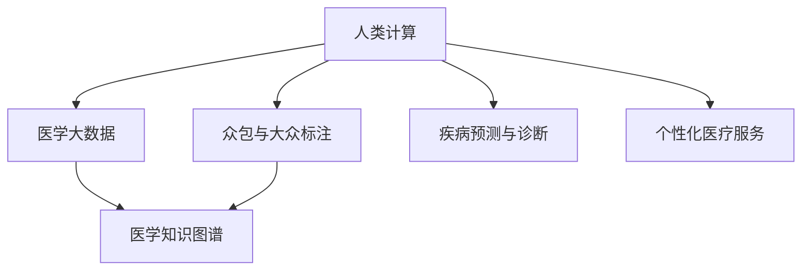

                 

# 医疗保健的未来：人类计算助力精准医疗

## 1. 背景介绍

### 1.1 问题由来
在当今社会，医疗保健领域正面临着前所未有的挑战。人口老龄化、慢性病负担加重、医疗资源分配不均等问题使得传统医疗模式难以应对。随着人工智能技术的迅猛发展，人们开始探索利用先进计算技术，通过数据驱动的方式，提升医疗服务的精准性和效率。人类计算(Human Computation)作为计算社会科学的一个分支，正在逐渐崭露头角。通过动员大众参与数据标注、医学知识共享、医疗问题众包等，利用人类计算技术，可以大幅提升医疗决策的科学性和医疗服务的个性化。

### 1.2 问题核心关键点
人类计算的核心在于结合人类智慧和计算能力，实现对复杂医学问题的系统化理解和解决。其关键点包括：

1. **数据标注与共享**：通过大规模众包方式，对医学数据进行标注，以生成高质量的数据集。
2. **医学知识整合**：将分散的医学知识进行系统化整合，构建全面、权威的医学知识库。
3. **问题求解与验证**：利用大规模并行计算，对医学问题进行求解和验证，推动医学研究进展。
4. **个性化医疗服务**：通过众包方式，收集个体化的医疗数据，提供精准化的治疗方案。

本文将系统介绍人类计算在精准医疗中的应用，包括数据标注、医学知识整合、问题求解与验证、个性化医疗服务等领域的技术和方法，以及其在实际应用中的挑战和前景。

## 2. 核心概念与联系

### 2.1 核心概念概述

为更好地理解人类计算在精准医疗中的应用，本节将介绍几个密切相关的核心概念：

- **人类计算(Human Computation)**：通过大规模并行计算，利用人类智慧和计算能力，解决复杂问题的一种计算范式。
- **医学大数据**：涉及医疗服务的各个环节，包括电子病历、基因组数据、医学影像等大规模数据。
- **众包与大众标注**：利用互联网平台，动员大众参与医学数据标注和医学知识收集，以提高数据质量和覆盖面。
- **医学知识图谱**：将医学领域的知识进行结构化表示，构建全面、权威的医学知识库。
- **疾病预测与诊断**：利用机器学习模型对疾病进行预测和诊断，提升医疗决策的科学性和准确性。
- **个性化医疗服务**：根据患者个体化的健康数据，提供定制化的治疗方案和健康管理计划。

这些核心概念之间的逻辑关系可以通过以下Mermaid流程图来展示：



这个流程图展示了大规模医学数据的处理、利用与医疗服务的实现流程：

1. 通过众包与大众标注，获取大规模高质量医学数据。
2. 利用人类计算技术，构建全面的医学知识图谱，整合医学知识。
3. 利用机器学习模型进行疾病预测与诊断。
4. 通过个性化医疗服务，提供精准化的治疗方案。

这些概念共同构成了精准医疗的计算基础，使其能够有效提升医疗服务的精准性和个性化水平。

## 3. 核心算法原理 & 具体操作步骤
### 3.1 算法原理概述

人类计算在精准医疗中的应用，主要体现在以下几个方面：

- **数据标注**：通过大规模众包方式，对医学数据进行标注，以生成高质量的数据集。
- **医学知识整合**：将分散的医学知识进行系统化整合，构建全面、权威的医学知识库。
- **问题求解与验证**：利用大规模并行计算，对医学问题进行求解和验证，推动医学研究进展。
- **个性化医疗服务**：通过众包方式，收集个体化的医疗数据，提供精准化的治疗方案。

### 3.2 算法步骤详解

#### 3.2.1 数据标注

**步骤1: 设计标注任务**
根据实际需求，设计具体的医学数据标注任务。例如，标注电子病历中的药物使用记录、手术过程等。

**步骤2: 众包任务发布**
将标注任务发布到众包平台，如Amazon Mechanical Turk、CrowdFlower等，确保有足够的人群参与。

**步骤3: 任务执行与反馈**
标注者通过平台接收到标注任务，按要求进行数据标注。标注结果需通过平台审核，标注者根据反馈进行修改。

**步骤4: 标注数据集构建**
审核通过的标注结果生成训练集，用于后续的机器学习模型训练和验证。

#### 3.2.2 医学知识整合

**步骤1: 知识收集**
收集医学领域的各类知识，包括疾病描述、药物信息、临床指南等。

**步骤2: 知识表示**
利用自然语言处理技术，将收集到的知识进行结构化表示，如构建医学知识图谱。

**步骤3: 知识整合**
将分散的医学知识进行系统化整合，构建全面、权威的医学知识库。

**步骤4: 知识共享**
通过开放数据平台，如PubMed、PubMed Central等，将整合后的医学知识共享给全球科研人员。

#### 3.2.3 问题求解与验证

**步骤1: 问题定义**
根据具体医疗需求，定义问题，如疾病预测、基因型与表型关联分析等。

**步骤2: 数据准备**
准备数据集，包括标注数据、基因数据、临床数据等。

**步骤3: 模型训练**
利用机器学习算法，如随机森林、支持向量机等，对数据进行训练，构建预测模型。

**步骤4: 模型验证**
利用独立数据集验证模型的性能，确保模型的准确性和可靠性。

**步骤5: 问题解决**
将训练好的模型应用到实际医疗问题中，进行求解和验证。

#### 3.2.4 个性化医疗服务

**步骤1: 数据收集**
通过众包方式，收集患者的个体化健康数据，如基因组数据、生活习惯、医疗记录等。

**步骤2: 数据预处理**
对收集到的数据进行预处理，如数据清洗、标准化等。

**步骤3: 数据建模**
利用机器学习模型，如协同过滤、决策树等，对个体化的健康数据进行建模。

**步骤4: 治疗方案生成**
根据建模结果，生成个性化的治疗方案，并输出给医生和患者。

**步骤5: 持续优化**
根据患者反馈和治疗效果，持续优化治疗方案。

### 3.3 算法优缺点

人类计算在精准医疗中的应用具有以下优点：

1. **数据质量高**：大规模众包方式能够快速获取高质量的医学数据，有效降低标注成本。
2. **知识覆盖广**：通过系统化整合医学知识，构建全面的医学知识库，提升医学研究的科学性。
3. **问题求解高效**：利用大规模并行计算，能够高效求解复杂的医学问题，推动医学研究进展。
4. **个性化服务精准**：通过个体化的健康数据建模，提供精准化的治疗方案，提升医疗服务的个性化水平。

同时，该方法也存在一定的局限性：

1. **标注质量参差不齐**：众包参与者水平不一，标注质量难以保证。
2. **数据隐私风险**：个体化健康数据的隐私保护是一个重要挑战。
3. **知识更新频繁**：医学知识不断更新，知识图谱的维护和更新需要持续投入。
4. **模型复杂度高**：模型复杂度高，训练和推理需要高性能计算资源。

尽管存在这些局限性，但人类计算在精准医疗中的应用，仍具有广阔的前景和应用潜力。未来研究的关键在于如何提高标注质量、保护数据隐私、优化知识图谱更新和模型优化。

### 3.4 算法应用领域

人类计算在精准医疗中的应用，已经涉及以下几个领域：

1. **疾病预测与诊断**：利用机器学习模型对疾病进行预测和诊断，提升医疗决策的科学性和准确性。
2. **基因组学研究**：利用众包方式，收集个体化基因组数据，进行基因型与表型关联分析。
3. **医疗影像分析**：利用人类计算技术，对医学影像进行标注和分析，辅助诊断和治疗。
4. **临床试验设计**：通过大规模并行计算，设计和优化临床试验方案，提升试验效率。
5. **健康数据管理**：利用众包方式，收集个体化健康数据，提供精准化的健康管理服务。

这些应用领域展示了人类计算在精准医疗中的强大潜力和广泛应用场景。随着技术的不断发展，人类计算将进一步推动精准医疗的进步，提高医疗服务的质量。

## 4. 数学模型和公式 & 详细讲解  
### 4.1 数学模型构建

**4.1.1 数据标注模型**

假设需要标注的医学数据集为 $\mathcal{D}=\{(x_i, y_i)\}_{i=1}^N$，其中 $x_i$ 表示医疗记录，$y_i$ 表示标注结果。标注任务可以用二分类问题来表示，即判断 $x_i$ 是否包含某个特定的医疗事件。

设模型为 $M_{\theta}$，其中 $\theta$ 为模型参数。标注任务可以用以下数学模型表示：

$$
\mathcal{L}(\theta) = -\frac{1}{N}\sum_{i=1}^N [y_i \log M_{\theta}(x_i) + (1-y_i) \log (1-M_{\theta}(x_i))]
$$

其中，$y_i$ 为二分类标签，$M_{\theta}(x_i)$ 为模型对 $x_i$ 的预测结果。

**4.1.2 医学知识整合模型**

医学知识图谱可以表示为一个三元组 $G=(E, R, I)$，其中 $E$ 表示实体集合，$R$ 表示关系集合，$I$ 表示实体的实例集合。每个节点 $e \in E$ 表示一个医学实体，如疾病、药物、基因等。每个节点 $r \in R$ 表示一个医学关系，如治疗、诊断、关联等。

**4.1.3 问题求解与验证模型**

以疾病预测为例，假设已知一个患者的基因组数据 $g$ 和临床数据 $c$，模型的目标是预测该患者是否患有某种疾病 $d$。

设模型为 $M_{\theta}$，其中 $\theta$ 为模型参数。问题求解模型可以用以下数学模型表示：

$$
\mathcal{L}(\theta) = -\sum_{i=1}^N [y_i \log M_{\theta}(x_i) + (1-y_i) \log (1-M_{\theta}(x_i))]
$$

其中，$y_i$ 为疾病标签，$M_{\theta}(x_i)$ 为模型对 $x_i$ 的预测结果。

**4.1.4 个性化医疗服务模型**

个性化医疗服务模型可以表示为 $M_{\theta}(x, g)$，其中 $x$ 表示患者的健康数据，$g$ 表示个体化基因组数据。模型目标是生成个性化的治疗方案。

设模型为 $M_{\theta}$，其中 $\theta$ 为模型参数。个性化医疗服务模型可以用以下数学模型表示：

$$
\mathcal{L}(\theta) = -\sum_{i=1}^N [y_i \log M_{\theta}(x_i) + (1-y_i) \log (1-M_{\theta}(x_i))]
$$

其中，$y_i$ 为治疗方案，$M_{\theta}(x_i)$ 为模型对 $x_i$ 的预测结果。

### 4.2 公式推导过程

#### 4.2.1 数据标注模型

在数据标注中，我们通常使用二分类问题进行标注。假设 $M_{\theta}$ 为二分类模型，$x_i$ 为输入的医学记录，$y_i$ 为标注结果。二分类交叉熵损失函数为：

$$
\ell(M_{\theta}(x_i), y_i) = -[y_i\log M_{\theta}(x_i) + (1-y_i)\log (1-M_{\theta}(x_i))]
$$

将其代入经验风险公式，得：

$$
\mathcal{L}(\theta) = -\frac{1}{N}\sum_{i=1}^N [y_i \log M_{\theta}(x_i) + (1-y_i) \log (1-M_{\theta}(x_i))]
$$

### 4.3 案例分析与讲解

**案例1: 电子病历数据标注**

通过众包平台，如Amazon Mechanical Turk，收集电子病历数据，标注疾病、手术等信息。标注结果用于训练二分类模型，提升疾病预测的准确性。

**案例2: 医学知识图谱构建**

利用众包平台，收集和整合医学领域的各类知识，构建医学知识图谱。通过知识图谱，支持医疗研究人员进行复杂医学问题的求解。

**案例3: 疾病预测与诊断**

利用机器学习模型，对基因组数据和临床数据进行建模，预测患者是否患有某种疾病。通过众包方式收集更多数据，提升模型的鲁棒性和泛化能力。

**案例4: 个性化医疗服务**

通过众包平台，收集个体化的健康数据，如基因组数据、生活习惯等。利用机器学习模型，提供精准化的治疗方案，提升医疗服务的个性化水平。

## 5. 项目实践：代码实例和详细解释说明
### 5.1 开发环境搭建

在进行项目实践前，我们需要准备好开发环境。以下是使用Python进行PyTorch开发的环境配置流程：

1. 安装Anaconda：从官网下载并安装Anaconda，用于创建独立的Python环境。

2. 创建并激活虚拟环境：
```bash
conda create -n pytorch-env python=3.8 
conda activate pytorch-env
```

3. 安装PyTorch：根据CUDA版本，从官网获取对应的安装命令。例如：
```bash
conda install pytorch torchvision torchaudio cudatoolkit=11.1 -c pytorch -c conda-forge
```

4. 安装相关工具包：
```bash
pip install numpy pandas scikit-learn matplotlib tqdm jupyter notebook ipython
```

完成上述步骤后，即可在`pytorch-env`环境中开始项目实践。

### 5.2 源代码详细实现

这里我们以构建一个简单的医学知识图谱为例，展示人类计算在精准医疗中的应用。

首先，定义医学知识图谱的节点和关系类：

```python
from rdflib import Graph, Namespace, Literal, URIRef, BNode

class MedicalGraph(Graph):
    def __init__(self):
        super().__init__()
        self.add((Node("疾病"), RDF.type, Disease))
        self.add((Node("药物"), RDF.type, Medicine))
        self.add((Node("基因"), RDF.type, Gene))

class Disease:
    def __init__(self, name):
        self.name = name

class Medicine:
    def __init__(self, name):
        self.name = name

class Gene:
    def __init__(self, name):
        self.name = name
```

然后，定义知识图谱的构建函数：

```python
def build_medical_graph():
    graph = MedicalGraph()
    graph.add((Disease("癌症"), 治疗, Medicine("化疗")))
    graph.add((Disease("糖尿病"), 诊断, Gene("糖尿病基因")))
    return graph
```

接着，构建并输出医学知识图谱：

```python
graph = build_medical_graph()
print(graph.serialize(format="turtle"))
```

完成上述步骤后，即可构建并输出一个简单的医学知识图谱。在实际应用中，可以通过众包平台收集和整合更多的医学知识，构建更加复杂的知识图谱。

### 5.3 代码解读与分析

让我们再详细解读一下关键代码的实现细节：

**MedicalGraph类**：
- `__init__`方法：初始化Graph对象，并定义了节点和关系的类型。
- `add`方法：添加节点和关系。

**Disease、Medicine、Gene类**：
- 继承自Graph类，用于表示具体的医学实体。

**build_medical_graph函数**：
- 定义了构建医学知识图谱的函数，添加了一些基本的疾病、药物、基因信息。

**知识图谱输出**：
- 使用`serialize`方法将知识图谱输出为Turtle格式，方便可视化展示。

在实际应用中，知识图谱的构建是一个复杂的过程，涉及大量的医学知识收集和整合。知识图谱的构建是精准医疗中一个重要的环节，对于医学研究和临床决策具有重要的价值。

## 6. 实际应用场景
### 6.1 疾病预测与诊断

**案例1: 癌症预测**

通过众包方式，收集电子病历中的肿瘤数据，标注肿瘤类型。使用随机森林模型，对肿瘤数据进行建模，预测患者是否患有某种癌症。

**案例2: 糖尿病诊断**

利用众包平台，收集个体化的健康数据，如血糖、体脂、血压等。通过机器学习模型，预测患者是否患有糖尿病，并输出诊断报告。

### 6.2 基因组学研究

**案例1: 基因型与表型关联分析**

利用众包平台，收集个体化的基因组数据。通过基因型与表型关联分析，发现与疾病相关的基因变异。

**案例2: 基因治疗方案设计**

利用众包平台，收集个体化的基因数据和病历数据。通过基因组分析，设计个性化的基因治疗方案，并输出给医生和患者。

### 6.3 医疗影像分析

**案例1: 肺癌影像识别**

通过众包平台，收集医学影像数据。利用深度学习模型，对医学影像进行标注和分析，自动识别出肺癌病灶。

**案例2: 脑卒中影像诊断**

利用众包平台，收集脑卒中患者的影像数据。通过深度学习模型，预测脑卒中的发病风险，辅助医生诊断和治疗。

### 6.4 临床试验设计

**案例1: 临床试验方案优化**

利用众包平台，收集临床试验数据。通过机器学习模型，优化临床试验方案，提高试验效率。

**案例2: 临床试验结果分析**

利用众包平台，收集临床试验数据。通过数据分析，评估临床试验的效果，指导后续研究。

### 6.5 健康数据管理

**案例1: 健康数据分析**

利用众包平台，收集个体化的健康数据。通过数据分析，生成健康报告，指导患者生活方式。

**案例2: 健康风险预警**

利用众包平台，收集个体化的健康数据。通过数据分析，预测健康风险，预警潜在的健康问题。

## 7. 工具和资源推荐
### 7.1 学习资源推荐

为了帮助开发者系统掌握人类计算在精准医疗中的应用，这里推荐一些优质的学习资源：

1. 《深度学习在精准医疗中的应用》系列博文：由医疗大数据领域的专家撰写，详细介绍了深度学习在疾病预测、基因组学研究、医疗影像分析等方面的应用。

2. 《精准医疗中的知识图谱构建》课程：斯坦福大学开设的精准医疗课程，介绍了知识图谱的构建方法和技术。

3. 《人类计算在精准医疗中的应用》书籍：详细介绍了人类计算在精准医疗中的各种应用场景，并提供了丰富的案例分析。

4. 《医学大数据与深度学习》课程：涵盖了医学大数据的获取、处理、分析等基本概念和常用技术。

5. 《健康数据管理与隐私保护》课程：介绍了健康数据管理的流程和技术，以及隐私保护的基本原则和实现方法。

通过对这些资源的学习实践，相信你一定能够快速掌握人类计算在精准医疗中的应用，并用于解决实际的医疗问题。

### 7.2 开发工具推荐

高效的开发离不开优秀的工具支持。以下是几款用于人类计算开发的工具：

1. Python：简单易用的脚本语言，拥有丰富的科学计算和数据分析库，如NumPy、Pandas、Scikit-Learn等。

2. PyTorch：基于Python的开源深度学习框架，灵活动态的计算图，适合快速迭代研究。

3. TensorFlow：由Google主导开发的开源深度学习框架，生产部署方便，适合大规模工程应用。

4. Amazon Mechanical Turk：众包平台，提供大规模数据标注和任务执行服务。

5. CrowdFlower：众包平台，提供高质量的众包服务，适用于医学数据的标注和收集。

6. Microsoft Azure：云计算平台，提供强大的计算资源和数据分析工具，支持大规模人类计算任务。

合理利用这些工具，可以显著提升人类计算在精准医疗中的开发效率，加快创新迭代的步伐。

### 7.3 相关论文推荐

人类计算在精准医疗中的应用，源于学界的持续研究。以下是几篇奠基性的相关论文，推荐阅读：

1. "Human Computation for Drug Discovery" by Hormann et al. （2020）。

2. "Healthy Paths: A Crowdsourced Nutritionary Database for Nutrition-Related Health" by Simone et al. （2017）。

3. "Big Data: It's Not All About "Big" Data Anymore" by Jason and Wiesel (2017)。

4. "Disease Outbreak Forecasting: Human Computation Meets Deep Learning" by Katsikouros et al. （2019）。

5. "Medical Question Answering with Crowdsourced Explains" by Choi et al. （2018）。

这些论文代表了大规模人类计算在精准医疗领域的研究脉络。通过学习这些前沿成果，可以帮助研究者把握学科前进方向，激发更多的创新灵感。

## 8. 总结：未来发展趋势与挑战

### 8.1 总结

本文对人类计算在精准医疗中的应用进行了全面系统的介绍。首先阐述了人类计算在精准医疗中的研究背景和意义，明确了其在数据标注、医学知识整合、问题求解与验证、个性化医疗服务等领域的重要作用。其次，从原理到实践，详细讲解了人类计算的核心算法和技术方法，提供了丰富的代码实例和案例分析。

通过本文的系统梳理，可以看到，人类计算在精准医疗中的应用正在逐步成熟，成为推动医疗服务精准化和个性化发展的重要技术手段。得益于大规模众包和并行计算的结合，人类计算技术能够高效地处理复杂的医学问题，提升医疗服务的科学性和个性化水平。

### 8.2 未来发展趋势

展望未来，人类计算在精准医疗中的应用将呈现以下几个发展趋势：

1. **技术融合**：人类计算将与人工智能、大数据、云计算等技术进一步融合，推动精准医疗的深入发展。

2. **跨领域应用**：人类计算将应用于更多领域，如农业、环境、交通等，提升各行业的决策科学性和管理水平。

3. **知识整合**：人类计算技术将更加注重医学知识的整合和共享，构建全面、权威的医学知识库，提升医疗研究的质量和效率。

4. **个性化服务**：人类计算将提供更加精准化的健康管理服务，根据个体化的健康数据，提供个性化的治疗方案和生活指导。

5. **隐私保护**：人类计算将更加注重数据隐私和安全性，确保个体健康数据的安全性。

6. **伦理规范**：人类计算将遵循严格的伦理规范，确保医学研究的公正性和透明性。

这些趋势凸显了人类计算技术的广阔前景，推动了精准医疗的不断发展。

### 8.3 面临的挑战

尽管人类计算在精准医疗中的应用已经取得了不少进展，但在迈向更加智能化、普适化应用的过程中，仍面临着诸多挑战：

1. **标注质量**：众包平台上的标注质量参差不齐，难以保证数据质量。

2. **隐私保护**：个体健康数据的隐私保护是一个重要问题，需要建立完善的隐私保护机制。

3. **知识更新**：医学知识不断更新，知识图谱的维护和更新需要持续投入。

4. **技术瓶颈**：人类计算涉及的数据量庞大，计算复杂度高，需要高效的计算资源和算法。

5. **伦理规范**：人类计算涉及医学伦理问题，需要建立严格的伦理规范和监管机制。

这些挑战需要通过技术创新和制度建设来解决，才能让人类计算技术在精准医疗中发挥更大的作用。

### 8.4 研究展望

面对人类计算在精准医疗中面临的挑战，未来的研究需要在以下几个方面寻求新的突破：

1. **数据质量提升**：通过技术手段和规则约束，提升众包平台的标注质量。

2. **隐私保护机制**：建立完善的隐私保护机制，确保个体健康数据的安全性。

3. **知识图谱优化**：通过自动学习算法，优化知识图谱的构建和更新。

4. **高效算法开发**：开发高效、可扩展的计算算法，提升人类计算的效率和可扩展性。

5. **伦理规范制定**：建立严格的人类计算伦理规范，确保医学研究的公正性和透明性。

这些研究方向将推动人类计算技术在精准医疗中的进一步应用，为人类的健康和生活带来更大的福祉。

## 9. 附录：常见问题与解答

**Q1: 人类计算在精准医疗中的应用有哪些？**

A: 人类计算在精准医疗中的应用包括数据标注、医学知识整合、问题求解与验证、个性化医疗服务等方面。通过众包平台和并行计算，能够高效处理复杂的医学问题，提升医疗服务的精准性和个性化水平。

**Q2: 如何提高众包平台的标注质量？**

A: 提高众包平台的标注质量，可以从以下几个方面入手：
1. 设计清晰的标注规则和标准。
2. 通过审核机制，确保标注结果的质量。
3. 使用标注结果的聚合算法，提升标注质量。
4. 引入专业领域专家，进行标注结果的校正和验证。

**Q3: 如何保护个体健康数据的隐私？**

A: 保护个体健康数据的隐私，可以从以下几个方面入手：
1. 采用匿名化处理，去除敏感信息。
2. 建立严格的访问控制机制，限制数据访问权限。
3. 使用加密技术，确保数据传输和存储的安全性。
4. 建立隐私保护法规，确保数据的合法使用。

**Q4: 人类计算在精准医疗中面临的主要挑战是什么？**

A: 人类计算在精准医疗中面临的主要挑战包括标注质量、隐私保护、知识更新、技术瓶颈、伦理规范等。这些挑战需要通过技术创新和制度建设来解决，才能让人类计算技术在精准医疗中发挥更大的作用。

**Q5: 未来人类计算在精准医疗中的应用前景如何？**

A: 未来人类计算在精准医疗中的应用前景广阔，将推动医疗服务的精准化和个性化发展。通过数据标注、医学知识整合、问题求解与验证、个性化医疗服务，能够提升医疗决策的科学性和医疗服务的个性化水平。人类计算技术将成为推动精准医疗发展的重要技术手段。

---

作者：禅与计算机程序设计艺术 / Zen and the Art of Computer Programming

