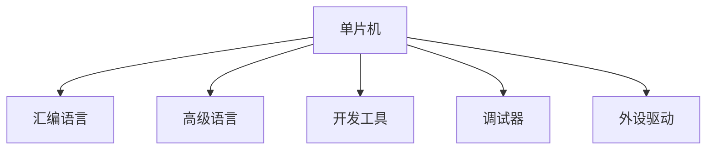

                 

## 1. 背景介绍

单片机(又称微控制器MCU)，是嵌入式系统的核心组件之一，广泛应用于物联网(IoT)、工业控制、汽车电子、消费电子等多个领域。其具有高性能、低成本、低功耗、集成度高、应用广泛等特点，为各类智能设备提供了强大的计算和控制能力。本文将系统介绍单片机编程的基本原理、关键技术及应用场景，帮助读者深入理解嵌入式系统开发的核心。

## 2. 核心概念与联系

### 2.1 核心概念概述

单片机编程，是指在单片机内嵌入的软件实现过程，涉及硬件设计、程序编写、调试优化等多个环节。核心概念包括：

- 单片机：集成了CPU、存储器、外设接口等组件，能够独立运行处理器的芯片。
- 汇编语言：一种低级别的编程语言，直接操作计算机硬件，编写效率低但执行速度快。
- 高级语言：如C语言、Python等，面向抽象数据类型，执行效率较低，但易于理解和维护。
- 开发工具：如Keil uVision、IAR Embedded Workbench等，提供集成开发环境(IDE)，支持代码编写、调试、仿真等功能。
- 调试器：如J-Link、ST-LINK等，用于单片机程序的在线调试。
- 外设驱动：如UART、SPI、I2C等，实现单片机与外设的通信。

### 2.2 核心概念原理和架构的 Mermaid 流程图



该图展示了单片机编程的关键组件及其之间的联系。单片机通过汇编语言和高级语言进行编程，借助开发工具调试器进行编译调试，并依靠外设驱动与外设进行通信。

## 3. 核心算法原理 & 具体操作步骤

### 3.1 算法原理概述

单片机编程的算法原理主要包括：

1. **机器指令执行**：单片机通过执行汇编指令或高级语言编译后的机器码，完成各种计算和控制任务。
2. **内存管理**：单片机内部存储空间包括代码存储区和数据存储区，程序员需要合理分配内存空间，避免内存冲突。
3. **中断处理**：单片机具有多种中断源，程序员需编写中断处理程序，以响应外部事件。
4. **串口通信**：通过UART、SPI等协议，实现单片机与外设或PC的通信。
5. **定时器计数**：单片机内置定时器，用于实现精确的时间控制和延时功能。
6. **ADC与DAC**：单片机支持模拟到数字和数字到模拟的转换，方便进行传感器信号处理和模拟信号输出。

### 3.2 算法步骤详解

单片机编程的基本步骤如下：

1. **硬件设计**：选择合适的单片机芯片，设计外围电路，确保系统功能需求。
2. **软件开发**：编写汇编或高级语言程序，实现系统功能。
3. **交叉编译**：使用相应的开发工具将源码编译为二进制代码。
4. **烧录程序**：将编译好的二进制代码烧录到单片机芯片中。
5. **调试优化**：通过仿真器或实际电路测试程序，调整优化程序逻辑。

### 3.3 算法优缺点

**优点**：

1. **硬件可控性**：单片机具有灵活的可编程性，可根据需求进行硬件设计。
2. **低成本**：单片机集成度高，应用广泛，具有较低的开发成本。
3. **实时响应**：单片机具有较快的响应速度，适合实时控制任务。

**缺点**：

1. **编程难度高**：单片机编程涉及底层硬件知识，编程难度较大。
2. **调试复杂**：单片机程序调试需要仿真器，调试过程较为复杂。
3. **资源有限**：单片机资源有限，适用于小型嵌入式系统。

### 3.4 算法应用领域

单片机编程广泛应用于以下领域：

- **物联网**：智能家居、可穿戴设备、传感器网络等。
- **工业控制**：自动化生产线、机器人控制、工业监控等。
- **消费电子**：遥控器、家电控制、手机芯片等。
- **汽车电子**：车载控制、仪表盘、安全系统等。
- **医疗设备**：生命监测、设备控制、通信模块等。

## 4. 数学模型和公式 & 详细讲解 & 举例说明

### 4.1 数学模型构建

单片机编程涉及的数学模型主要包括：

- **二进制转换**：将十进制数转换为二进制数，表示计算机硬件信息。
- **逻辑门电路**：用逻辑表达式表示单片机内部逻辑，如AND、OR、NOT等。
- **时钟计数**：利用时钟信号进行精确时间计数，实现延时功能。
- **ADC与DAC转换**：实现模拟信号到数字信号和数字信号到模拟信号的转换，公式为：
  $$
  \text{DAC} = \text{ADC} \times \text{scale}
  $$
  其中，ADC为模拟信号电压，DAC为数字信号电压，scale为转换系数。

### 4.2 公式推导过程

以延时函数为例，单片机内常见的延时函数公式为：

$$
\text{delay\_us}(\text{us}) = \frac{1000000}{\text{clock\_rate}} \times \text{us}
$$

其中，clock\_rate为单片机的时钟频率，单位为kHz。

### 4.3 案例分析与讲解

以STM32单片机为例，编写一个基于C语言的时钟延时函数：

```c
uint32_t delay_us(uint32_t us)
{
    uint32_t start = micros();
    while (us--)
    {
        while (micros() - start < us);
    }
    return 0;
}
```

该函数通过读取单片机的系统时钟，进行精确的时间延时，适用于对延时要求较高的场合。

## 5. 项目实践：代码实例和详细解释说明

### 5.1 开发环境搭建

开发环境搭建主要包括：

1. **硬件平台**：选择STM32F103C8T6单片机开发板，并连接PC。
2. **软件工具**：安装Keil uVision IDE，并连接J-Link调试器。

### 5.2 源代码详细实现

以实现单片机的PWM输出为例，代码如下：

```c
#include "stm32f10x.h"
#include "delay.h"

int main(void)
{
    RCC_AHBPeriphClockCmd(RCC_AHBPeriph_GPIOA, ENABLE);
    RCC_APB1PeriphClockCmd(RCC_APB1Periph_TIM2, ENABLE);
    RCC_APB1PeriphClockCmd(RCC_APB1Periph_TIM2, ENABLE);

    GPIO_InitTypeDef GPIO_InitStructure;
    GPIO_InitStructure.GPIO_Mode = GPIO_Mode_Out_PP;
    GPIO_InitStructure.GPIO_Pin = GPIO_Pin_7;
    GPIO_InitStructure.GPIO_Speed = GPIO_Speed_50MHz;
    GPIO_Init(GPIOA, &GPIO_InitStructure);

    TIM_TimeBaseInitTypeDef TIM_TimeBaseStructure;
    TIM_TimeBaseStructure.TIM_Prescaler = 99;
    TIM_TimeBaseStructure.TIM_CounterMode = TIM_CounterMode_Up;
    TIM_TimeBaseStructure.TIM_Period = 99;
    TIM_TimeBaseInit(TIM2, &TIM_TimeBaseStructure);
		```c
    TIM_OCInitTypeDef TIM_OCInitStructure;
    TIM_OCInitStructure.TIM_OCMode = TIM_OCMode_PWM1;
    TIM_OCInitStructure.TIM_OutputState = TIM_OutputState_Enable;
    TIM_OCInitStructure.TIM_Pulse = 50;
    TIM_OCInitStructure.TIM_OCPolarity = TIM_OCPolarity_High;
    TIM_OC1Init(TIM2, &TIM_OCInitStructure);
    TIM_OC1PreloadConfig(TIM2, TIM_OCPreload_Enable);

    TIM_Cmd(TIM2, ENABLE);

    while (1)
    {
        delay_ms(100);
        TIM2->CCR1 = TIM2->CCR1 + 10;
        if (TIM2->CCR1 > 100)
        {
            TIM2->CCR1 = 0;
        }
    }
}
```

### 5.3 代码解读与分析

该代码实现了STM32F103C8T6单片机的PWM输出功能，主要步骤如下：

1. **初始化时钟**：配置系统时钟和定时器时钟。
2. **初始化GPIO**：配置GPIOA的7号引脚为推挽输出模式。
3. **初始化定时器**：配置定时器2为向上计数模式，预分频系数为99，计数周期为99。
4. **初始化PWM输出通道**：配置定时器2的通道1为PWM输出模式，输出脉冲宽度为50。
5. **开启定时器**：使能定时器2。
6. **循环调节PWM占空比**：通过循环调节定时器2的CCR1寄存器值，实现PWM输出占空比的调节。

### 5.4 运行结果展示

将程序烧录到单片机中，连接示波器观察GPIOA的7号引脚输出波形，可以看到PWM波形输出，频率为1kHz，占空比从0%到100%循环变化。

## 6. 实际应用场景

单片机编程在实际应用中具有广泛的应用场景，例如：

### 6.1 智能家居

- **智能照明**：通过单片机控制LED灯的亮度和颜色，实现智能照明效果。
- **智能温控**：利用单片机采集温度传感器数据，控制空调或暖气，实现室内温度自动调节。
- **智能安防**：通过单片机控制门禁系统、红外传感器等，实现家庭安全防护。

### 6.2 工业控制

- **电机控制**：利用单片机控制电机的转速和方向，实现自动化生产。
- **过程控制**：通过单片机采集传感器数据，控制生产过程中的温度、压力等参数，保证产品质量。
- **数据采集**：利用单片机采集各种传感器数据，并通过网络传输到上位机，实现远程监控。

### 6.3 汽车电子

- **发动机控制**：利用单片机控制发动机的喷油量和点火时间，提高燃油效率和动力性能。
- **车身控制**：通过单片机控制车窗、车灯、雨刷等，提高驾驶舒适性和安全性。
- **娱乐系统**：利用单片机控制车载音响、导航系统等，提供丰富的娱乐功能。

### 6.4 未来应用展望

随着物联网、人工智能等技术的快速发展，单片机编程将迎来更广阔的应用前景，例如：

- **边缘计算**：将部分计算任务放到边缘设备上进行处理，减轻云端服务器的负担，提高系统响应速度。
- **人工智能应用**：将人工智能算法移植到单片机上，实现智能化的控制和决策。
- **低功耗设计**：开发低功耗的单片机芯片和软件算法，延长电池续航时间，推动可穿戴设备和物联网的发展。

## 7. 工具和资源推荐

### 7.1 学习资源推荐

- **书籍**：《单片机原理及应用》、《C语言程序设计》、《嵌入式系统设计与实践》
- **网站**：电子工程世界、CSDN、开源中国
- **视频教程**：中国大学MOOC、网易云课堂

### 7.2 开发工具推荐

- **Keil uVision**：常用的单片机集成开发环境，支持多种单片机芯片。
- **IAR Embedded Workbench**：功能强大的单片机集成开发环境，支持多种编译器和调试器。
- **STM32CubeMX**：ST公司推出的图形化配置工具，可以方便地生成STM32单片机工程代码。

### 7.3 相关论文推荐

- **A Survey on Microcontroller Architectures and Programming Models**
- **Low-Power Design Techniques for Microcontrollers**
- **Embedded Systems Design and Applications**

## 8. 总结：未来发展趋势与挑战

### 8.1 研究成果总结

本文系统介绍了单片机编程的基本原理、关键技术及应用场景。单片机作为嵌入式系统的核心组件，具有高性能、低成本、低功耗等特点，广泛应用于物联网、工业控制、汽车电子等领域。

### 8.2 未来发展趋势

未来，单片机编程将朝着以下方向发展：

- **更高性能**：随着芯片制程的不断缩小，单片机的处理速度和存储容量将不断提升。
- **更低功耗**：低功耗设计将成为单片机发展的重要方向，以满足物联网和可穿戴设备的需求。
- **更智能化**：人工智能算法将逐步应用于单片机，实现更智能化的控制和决策。

### 8.3 面临的挑战

单片机编程也面临着一些挑战：

- **人才短缺**：单片机编程需要掌握硬件和软件知识，人才培养周期较长。
- **开发难度**：单片机编程涉及底层硬件操作，开发难度较大，调试也比较复杂。
- **安全问题**：随着物联网的普及，单片机安全问题日益突出，需要加强安全防护措施。

### 8.4 研究展望

未来，单片机编程将继续朝着高性能、低功耗、智能化的方向发展，并与物联网、人工智能等技术深度融合，为各行各业带来更智能、更高效的解决方案。

## 9. 附录：常见问题与解答

### 9.1 单片机和CPU有什么区别？

单片机是一种集成电路芯片，将CPU、存储器、外设接口等组件集成在一个芯片上，可以独立运行程序。而CPU只是中央处理器，需要与其他芯片配合才能工作。

### 9.2 学习单片机编程需要哪些基础知识？

学习单片机编程需要掌握C语言、数字电路、模拟电路等基础知识。

### 9.3 如何选择合适的单片机？

选择单片机需要考虑以下因素：处理速度、存储容量、外设接口、功耗、价格等。

### 9.4 单片机程序如何调试？

单片机程序调试可以使用仿真器或在线调试器进行。

### 9.5 单片机编程有哪些注意事项？

单片机编程需要注意内存管理、中断处理、时序控制等问题。

## 作者：禅与计算机程序设计艺术 / Zen and the Art of Computer Programming 


