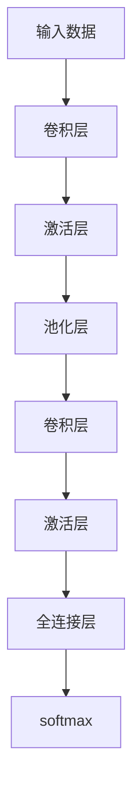

                 

# 卷积神经网络CNN原理与代码实例讲解

> 关键词：卷积神经网络, CNN, 卷积操作, 池化操作, 过拟合, 神经网络, 反向传播

## 1. 背景介绍

卷积神经网络（Convolutional Neural Network, CNN）是深度学习中的重要模型之一，广泛应用于计算机视觉、自然语言处理、语音识别等领域。CNN通过卷积和池化等操作，能够自动提取输入数据的高层次特征，并高效降低模型复杂度，从而在许多任务上取得了最先进的效果。本节将介绍CNN的原理，以及CNN在图像分类、目标检测、人脸识别等任务中的应用。

## 2. 核心概念与联系

### 2.1 核心概念概述

卷积神经网络由卷积层、池化层、激活层、全连接层等组成。其中卷积层和池化层是其核心，通过多次堆叠可以构建出非常深的神经网络。

- 卷积层：利用卷积操作提取输入数据的局部特征。卷积核（filter）在输入数据上滑动，产生卷积特征图，用于捕捉不同尺度和方向上的特征。
- 池化层：通过池化操作对卷积特征图进行降维，减小模型复杂度，降低过拟合风险。常见的池化操作包括最大池化和平均池化。
- 激活层：引入非线性函数，增强模型表达能力。常用的激活函数包括ReLU、Sigmoid、Tanh等。
- 全连接层：将前面的卷积特征图进行扁平化处理，输入到一个或多个全连接层进行分类或回归等任务。

### 2.2 核心概念原理和架构的 Mermaid 流程图



此图展示了CNN的基本架构，输入数据经过卷积层、激活层、池化层的多层堆叠，最后进入全连接层进行分类任务。

## 3. 核心算法原理 & 具体操作步骤

### 3.1 算法原理概述

卷积神经网络的训练过程是通过反向传播算法实现的。具体来说，CNN的训练过程包括以下几个步骤：

1. 前向传播：将输入数据输入CNN中，通过卷积层、激活层、池化层等组件，计算输出特征图。
2. 计算损失：将输出特征图与真实标签进行比较，计算损失函数。
3. 反向传播：利用链式法则计算损失函数对各参数的梯度，更新模型参数。
4. 重复迭代：不断重复前向传播和反向传播过程，直至损失函数收敛。

### 3.2 算法步骤详解

以下以图像分类任务为例，介绍CNN的训练过程：

**Step 1: 准备数据集**

首先，需要准备一个包含训练集、验证集和测试集的数据集。将图像数据转换成张量格式，并进行归一化处理。例如，使用Keras中的`ImageDataGenerator`类，可以将图像数据增强，生成更多训练样本。

```python
from keras.preprocessing.image import ImageDataGenerator

train_datagen = ImageDataGenerator(rescale=1./255, rotation_range=10, width_shift_range=0.1, height_shift_range=0.1, shear_range=0.1, zoom_range=0.1, horizontal_flip=True)
test_datagen = ImageDataGenerator(rescale=1./255)

train_generator = train_datagen.flow_from_directory(
        'train/',
        target_size=(224, 224),
        batch_size=32,
        class_mode='categorical')
test_generator = test_datagen.flow_from_directory(
        'test/',
        target_size=(224, 224),
        batch_size=32,
        class_mode='categorical')
```

**Step 2: 定义CNN模型**

使用Keras构建CNN模型，包含卷积层、激活层、池化层和全连接层。以VGG16模型为例，定义如下：

```python
from keras.applications import VGG16
from keras.models import Model
from keras.layers import Dense, Flatten

base_model = VGG16(weights='imagenet', include_top=False, input_shape=(224, 224, 3))
x = base_model.output
x = Flatten()(x)
x = Dense(256, activation='relu')(x)
predictions = Dense(10, activation='softmax')(x)
model = Model(inputs=base_model.input, outputs=predictions)
```

**Step 3: 添加任务适配层**

在全连接层后，添加一个Softmax层，用于分类任务：

```python
model.add(Dense(10, activation='softmax'))
```

**Step 4: 设置模型参数**

设置模型的优化器、损失函数、评价指标和训练参数。例如：

```python
model.compile(optimizer='adam', loss='categorical_crossentropy', metrics=['accuracy'])
model.fit_generator(train_generator, steps_per_epoch=100, epochs=30, validation_data=test_generator, validation_steps=50)
```

**Step 5: 评估模型**

在测试集上评估模型的性能：

```python
score = model.evaluate_generator(test_generator, steps=50)
print('Test loss:', score[0])
print('Test accuracy:', score[1])
```

### 3.3 算法优缺点

CNN的优点：

- 局部连接、权值共享：减少了模型参数量，降低了计算复杂度。
- 平移不变性：通过卷积操作，保持了局部特征的平移不变性，提高了模型的泛化能力。
- 池化操作：减小了特征图的大小，降低了过拟合风险。

CNN的缺点：

- 需要大量数据：卷积神经网络的参数量很大，训练时需要大量数据进行预训练。
- 局部性：卷积操作只考虑局部特征，无法捕捉全局特征，因此需要堆叠多层卷积层。
- 模型复杂：卷积神经网络的层次较深，训练和推理速度较慢。

### 3.4 算法应用领域

CNN主要应用于图像处理领域，但也能够应用于语音识别、自然语言处理等任务。以下是一些实际应用：

- 图像分类：如MNIST手写数字识别、CIFAR-10图像分类、ImageNet大规模图像识别等。
- 目标检测：如PASCAL VOC、COCO目标检测等。
- 人脸识别：如LFW人脸识别等。
- 文本分类：如情感分类、垃圾邮件分类等。

## 4. 数学模型和公式 & 详细讲解 & 举例说明

### 4.1 数学模型构建

CNN的数学模型可以表示为：

$$y = f(x; \theta)$$

其中 $x$ 表示输入特征，$\theta$ 表示模型参数，$f$ 表示模型映射关系。

### 4.2 公式推导过程

以卷积操作为例，其数学推导过程如下：

设输入数据 $X$ 的大小为 $(n_1, n_2, n_3)$，卷积核 $W$ 的大小为 $(m_1, m_2, m_3)$。卷积操作可以表示为：

$$Y_{i,j,k} = \sum_{s=0}^{m_1-1} \sum_{t=0}^{m_2-1} \sum_{u=0}^{m_3-1} X_{i+s, j+t, u} \times W_{s,t,u}$$

其中 $Y$ 表示卷积特征图的大小，$X$ 表示输入数据，$W$ 表示卷积核，$i, j, k$ 表示卷积特征图的索引。

### 4.3 案例分析与讲解

以LeNet模型为例，分析卷积神经网络的结构：

```python
from keras.models import Sequential
from keras.layers import Conv2D, MaxPooling2D, Flatten, Dense

model = Sequential()
model.add(Conv2D(6, (5, 5), input_shape=(28, 28, 1), activation='relu'))
model.add(MaxPooling2D((2, 2)))
model.add(Conv2D(16, (5, 5), activation='relu'))
model.add(MaxPooling2D((2, 2)))
model.add(Flatten())
model.add(Dense(120, activation='relu'))
model.add(Dense(84, activation='relu'))
model.add(Dense(10, activation='softmax'))
```

LeNet模型包含两个卷积层、两个池化层、三个全连接层。通过多次卷积和池化操作，逐步提取出输入数据的特征，最后通过全连接层进行分类。

## 5. 项目实践：代码实例和详细解释说明

### 5.1 开发环境搭建

在Python环境下搭建Keras开发环境，可以使用Anaconda或Miniconda。安装Keras、TensorFlow、CUDA等依赖包。

```bash
conda create --name myenv python=3.7
conda activate myenv
pip install keras tensorflow
```

### 5.2 源代码详细实现

以图像分类为例，使用Keras实现CNN模型：

```python
from keras.models import Sequential
from keras.layers import Conv2D, MaxPooling2D, Flatten, Dense

model = Sequential()
model.add(Conv2D(32, (3, 3), activation='relu', input_shape=(28, 28, 1)))
model.add(MaxPooling2D((2, 2)))
model.add(Conv2D(64, (3, 3), activation='relu'))
model.add(MaxPooling2D((2, 2)))
model.add(Flatten())
model.add(Dense(64, activation='relu'))
model.add(Dense(10, activation='softmax'))
model.compile(optimizer='adam', loss='categorical_crossentropy', metrics=['accuracy'])
model.fit(X_train, y_train, epochs=10, batch_size=32, validation_data=(X_test, y_test))
```

**代码解释**：

1. `Conv2D` 表示卷积层，参数包括卷积核数量、卷积核大小、激活函数等。
2. `MaxPooling2D` 表示池化层，参数包括池化大小。
3. `Dense` 表示全连接层，参数包括节点数、激活函数等。
4. `compile` 方法设置优化器、损失函数和评价指标。
5. `fit` 方法进行模型训练，参数包括训练数据、标签、迭代次数、批量大小和验证数据。

### 5.3 代码解读与分析

**代码解读**：

1. `Sequential` 表示顺序模型，按顺序添加各层。
2. `Conv2D` 添加卷积层，`MaxPooling2D` 添加池化层，`Flatten` 将卷积特征图扁平化。
3. `Dense` 添加全连接层，设置激活函数。
4. `compile` 方法设置优化器、损失函数和评价指标，`fit` 方法进行模型训练。

**分析**：

- 卷积层参数数量较多，输入和输出大小需要根据具体任务进行调整。
- 池化层用于减小特征图大小，减少模型复杂度。
- 全连接层用于进行分类或回归等任务，节点数需要根据任务复杂度进行调整。
- 模型训练需要进行参数调整，如优化器、学习率、批量大小等。

### 5.4 运行结果展示

在训练过程中，可以使用TensorBoard等工具进行可视化。例如，使用TensorBoard查看训练过程中模型的损失和准确率变化：

```bash
tensorboard --logdir=logs
```

打开浏览器，输入 `http://localhost:6006` 访问TensorBoard界面，可以查看模型训练过程中的详细情况。

## 6. 实际应用场景

### 6.1 图像分类

卷积神经网络在图像分类任务中取得了显著效果。例如，使用LeNet、AlexNet、VGG、ResNet等模型对图像进行分类。

### 6.2 目标检测

卷积神经网络可以通过多任务学习等方式实现目标检测。例如，Faster R-CNN、YOLO、SSD等模型。

### 6.3 人脸识别

卷积神经网络可以用于人脸识别任务，如LFW人脸识别。

### 6.4 文本分类

卷积神经网络可以用于文本分类任务，如情感分类、垃圾邮件分类等。

## 7. 工具和资源推荐

### 7.1 学习资源推荐

- TensorFlow官方文档：https://www.tensorflow.org/
- Keras官方文档：https://keras.io/
- PyTorch官方文档：https://pytorch.org/
- Deep Learning Specialization课程：https://www.coursera.org/specializations/deep-learning

### 7.2 开发工具推荐

- TensorFlow：https://www.tensorflow.org/
- Keras：https://keras.io/
- PyTorch：https://pytorch.org/
- OpenCV：https://opencv.org/

### 7.3 相关论文推荐

- LeNet：R. Hecht-Nielsen, Y. Chu, C. Hauser, and L. Neff. "Learning to recognize hand-written digitals." in IEEE Trans. on Systems, Man and Cybernetics, vol. 19, pp. 620-630, 1989.
- AlexNet：A. Krizhevsky, I. Sutskever, and G. Hinton. "ImageNet classification with deep convolutional neural networks." in Proceedings of the 2012 International Conference on Neural Information Processing Systems (NIPS), vol. 25, pp. 1106-1114, 2012.
- VGG：K. Simonyan and A. Zisserman. "Very Deep Convolutional Networks for Large-Scale Image Recognition." arXiv preprint arXiv:1409.1556, 2014.
- ResNet：K. He, X. Zhang, S. Ren, and J. Sun. "Deep Residual Learning for Image Recognition." arXiv preprint arXiv:1512.03385, 2015.
- Faster R-CNN：S. Ren, K. He, R. Girshick, and J. Sun. "Faster R-CNN: Towards Real-Time Object Detection with Region Proposal Networks." arXiv preprint arXiv:1506.01497, 2015.

## 8. 总结：未来发展趋势与挑战

### 8.1 研究成果总结

卷积神经网络作为深度学习中的重要模型，已经在计算机视觉、自然语言处理等领域取得了广泛应用。其主要优点包括局部连接、权值共享、平移不变性等。然而，CNN也存在一些缺点，如需要大量数据、局部性较强等。未来，CNN将继续朝着更加高效、轻量、鲁棒的方向发展，以应对更加复杂和多样化的任务。

### 8.2 未来发展趋势

- 更深更宽的网络结构：通过增加卷积层和全连接层，提高模型的表达能力。
- 轻量级网络结构：通过网络剪枝、知识蒸馏等方法，减少模型参数量，降低计算复杂度。
- 可解释性：通过可视化等手段，提高模型的可解释性，增强用户信任。
- 鲁棒性：通过对抗训练、数据增强等方法，提高模型的鲁棒性，降低过拟合风险。
- 多任务学习：通过多任务学习，提高模型的泛化能力，减少训练样本的需求。

### 8.3 面临的挑战

- 模型复杂度：深层网络的训练和推理复杂度较高，需要高效的优化器和硬件支持。
- 数据需求：深层网络的训练需要大量的标注数据，对于小样本任务，数据获取难度较大。
- 过拟合：深层网络的过拟合风险较高，需要通过正则化、数据增强等方法进行缓解。
- 计算资源：深层网络需要大量计算资源，对于资源有限的场景，部署难度较大。

### 8.4 研究展望

未来，卷积神经网络将继续朝着更加高效、鲁棒、可解释的方向发展。通过网络结构优化、多任务学习、对抗训练等方法，提高模型的性能和可解释性，降低计算资源需求。同时，也将结合其他AI技术，如自然语言处理、知识图谱等，构建更加智能的AI系统。

## 9. 附录：常见问题与解答

### Q1：卷积神经网络有哪些优点和缺点？

**A1:** 卷积神经网络的优点包括局部连接、权值共享、平移不变性等，可以处理局部特征，降低模型复杂度，提高泛化能力。缺点包括需要大量数据、局部性较强、模型复杂度高等。

### Q2：卷积神经网络的训练过程中如何进行正则化？

**A2:** 卷积神经网络的训练过程中，可以使用L2正则、Dropout等方法进行正则化，避免过拟合。L2正则通过添加L2范数约束，防止参数过大。Dropout通过随机丢弃部分神经元，降低模型的复杂度。

### Q3：卷积神经网络如何进行迁移学习？

**A3:** 卷积神经网络可以通过迁移学习，利用预训练的模型参数，在小数据集上进行微调。可以使用迁移学习框架，如TensorFlow Hub、PyTorch Hub等，快速加载预训练模型，并进行微调。

### Q4：卷积神经网络在图像分类任务中如何提高准确率？

**A4:** 在图像分类任务中，提高卷积神经网络的准确率可以从以下几个方面进行：

- 数据增强：使用旋转、翻转、缩放等方法，扩充训练集。
- 网络结构优化：增加卷积层和全连接层，提高模型的表达能力。
- 参数优化：选择合适的优化器、学习率等，优化模型的训练过程。
- 正则化：使用L2正则、Dropout等方法，避免过拟合。

### Q5：卷积神经网络在目标检测任务中如何提高性能？

**A5:** 在目标检测任务中，提高卷积神经网络的性能可以从以下几个方面进行：

- 多任务学习：通过目标检测、图像分类等任务联合训练，提高模型的泛化能力。
- 区域池化：使用区域池化技术，提取目标区域的特征。
- 数据增强：使用旋转、翻转、缩放等方法，扩充训练集。
- 多尺度训练：使用不同尺度的图像进行训练，提高模型的鲁棒性。

总之，卷积神经网络作为深度学习中的重要模型，具有广泛的应用前景。通过不断优化模型结构、提高训练数据质量、选择合适的正则化方法等手段，可以进一步提高卷积神经网络的性能和可解释性，推动其在更多领域中的应用。

