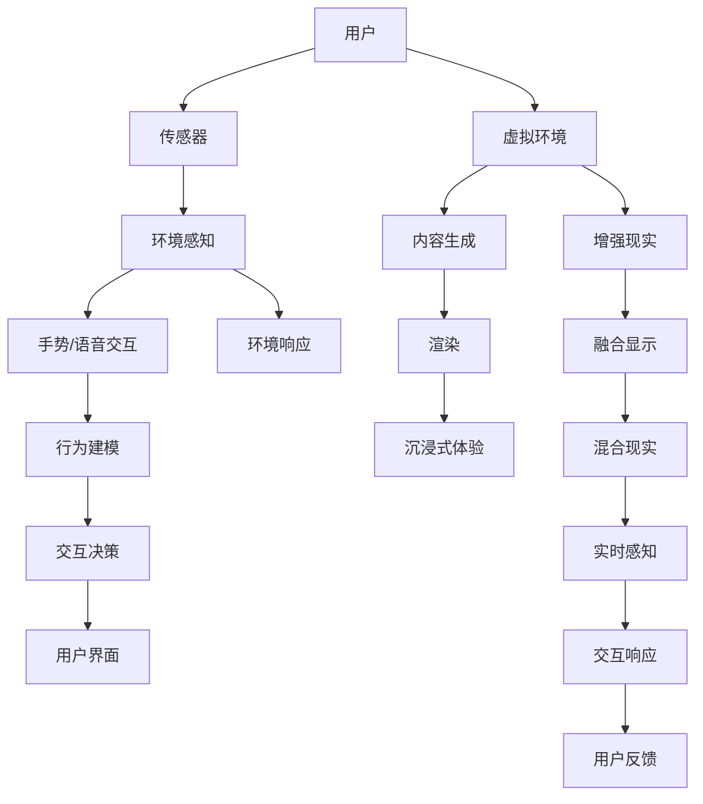

                 

# 双向交互与VR/AR技术的应用

## 1. 背景介绍

### 1.1 问题由来

随着科技的进步，虚拟现实(Virtual Reality, VR)和增强现实(Augmented Reality, AR)技术正逐渐走进我们的日常生活。然而，传统的VR/AR应用往往缺乏与用户的双向交互能力，导致用户体验较差，难以真正发挥其价值。双向交互技术的引入，可以通过实时感知用户行为，与用户建立动态的互动关系，从而极大提升VR/AR应用的沉浸感和可用性。

### 1.2 问题核心关键点

双向交互技术的核心在于实现用户与虚拟环境的实时、无缝交互。这种交互包括但不限于：用户输入的响应、虚拟环境的感知和自适应、用户状态的实时更新和显示等。要实现这些功能，需要融合多种技术手段，包括传感器融合、机器学习、自然语言处理、图像处理等。

此外，双向交互还面临着诸如延迟、带宽、计算资源等技术挑战。如何在满足这些限制的前提下，提供流畅、逼真的交互体验，是当前研究的重点。

### 1.3 问题研究意义

双向交互技术在提升VR/AR应用的沉浸感、实用性、可扩展性等方面具有重要意义：

- **沉浸感**：双向交互使得虚拟环境能够实时响应用户的操作，增强了用户对虚拟世界的感知和理解，使沉浸体验更加逼真。
- **实用性**：双向交互能够有效提升VR/AR应用的用户参与度和互动性，使得应用场景更加多样化，例如远程会议、虚拟旅游、教育培训等。
- **可扩展性**：双向交互技术可以与其他AI技术相结合，如自然语言理解、图像识别、情感计算等，推动VR/AR应用向更广泛领域扩展。

## 2. 核心概念与联系

### 2.1 核心概念概述

为了更好地理解双向交互与VR/AR技术的融合应用，本节将介绍几个密切相关的核心概念：

- **双向交互**：指的是在VR/AR系统中，用户和虚拟环境之间实时、双向的信息交换和行为响应。这包括但不限于手势交互、语音交互、表情识别、环境感知等。

- **虚拟现实(VR)**：通过计算机生成仿真环境，用户可穿戴头显设备，与虚拟世界互动，实现沉浸式体验。

- **增强现实(AR)**：将虚拟信息叠加在现实世界之上，提升用户对环境信息的感知和交互能力。

- **混合现实(MR)**：结合VR和AR技术，实时融合虚拟和现实信息，提供全新的交互体验。

- **深度学习**：一种机器学习技术，通过多层神经网络模型，从大量数据中学习特征和规律，实现对复杂问题的建模和预测。

- **传感器融合**：将来自多个传感器的数据进行综合处理，获得更高精度和鲁棒性的环境感知。

- **自然语言处理(NLP)**：使计算机能够理解和处理人类语言的技术，包括文本生成、语义理解、情感分析等。

- **图像处理**：对图像进行采集、处理、分析和生成的技术，包括图像识别、图像生成、图像增强等。

这些核心概念之间通过双向交互技术紧密相连，共同构建了VR/AR应用的完整生态系统。

### 2.2 核心概念原理和架构的 Mermaid 流程图



这个流程图展示了VR/AR系统中的双向交互技术架构，其中用户通过传感器输入信息，环境感知模块将信息综合处理，交互决策模块根据用户行为生成虚拟环境的响应，最终通过用户界面呈现给用户，形成一个闭环的交互系统。

## 3. 核心算法原理 & 具体操作步骤

### 3.1 算法原理概述

双向交互与VR/AR技术的结合，本质上是通过多种传感器数据融合和机器学习模型，实现对用户行为的高效感知和响应。其核心算法包括但不限于：

- **传感器融合算法**：通过集成多源传感器的信息，提升环境感知的准确性和鲁棒性。
- **行为建模算法**：通过机器学习模型，将用户行为映射到虚拟环境中的控制指令。
- **交互决策算法**：根据用户行为和环境状态，动态生成虚拟环境的响应。
- **实时渲染算法**：高效生成和渲染虚拟环境的视觉内容，提供流畅的沉浸式体验。

这些算法相互协作，共同支撑着双向交互技术的实现。

### 3.2 算法步骤详解

以下是双向交互与VR/AR技术结合的详细算法步骤：

**Step 1: 传感器数据采集**

在用户佩戴的头显设备上安装各种传感器，如摄像头、IMU、手势识别器等，实时采集用户的头部姿态、手势动作、表情变化等数据。

**Step 2: 传感器数据融合**

将来自不同传感器的数据进行融合，生成对环境的综合感知。常用的融合算法包括加权平均、卡尔曼滤波、粒子滤波等。

**Step 3: 行为建模**

利用深度学习模型，将用户行为数据映射为虚拟环境中的控制指令。常用的模型包括卷积神经网络(CNN)、循环神经网络(RNN)、注意力机制等。

**Step 4: 交互决策**

根据用户行为和环境状态，动态生成虚拟环境的响应。决策算法包括状态机、马尔可夫决策过程(MDP)等。

**Step 5: 实时渲染**

使用图形渲染引擎，高效生成和渲染虚拟环境的视觉内容，提供流畅的沉浸式体验。

**Step 6: 用户界面呈现**

将虚拟环境的视觉内容呈现在用户界面中，实现用户与虚拟环境的实时互动。

### 3.3 算法优缺点

双向交互与VR/AR技术的结合，具有以下优点：

1. **提升沉浸感**：通过实时感知用户行为，虚拟环境能够动态响应，提升用户的沉浸体验。
2. **提高互动性**：用户可以通过手势、语音等自然方式与虚拟环境互动，增强了应用的趣味性和实用性。
3. **多模态融合**：结合多种传感器的数据，可以提供更加全面、准确的环境感知，提升应用的精确度。
4. **扩展性强**：可以与其他AI技术相结合，如自然语言理解、图像识别等，推动应用的广泛应用。

同时，该技术也存在以下局限：

1. **延迟问题**：传感器的响应速度和数据处理能力直接影响交互的流畅性，延迟问题需要进一步解决。
2. **带宽限制**：传感器的数据传输和渲染过程需要较高的带宽，需要在带宽限制下优化算法。
3. **计算资源消耗**：实时渲染和数据融合需要较高的计算资源，需要高效的算法和硬件支持。

### 3.4 算法应用领域

双向交互技术在多个领域得到了广泛应用，例如：

- **虚拟旅游**：用户可以在虚拟世界中自由探索，实时感知和响应用户的行为，提供身临其境的旅游体验。
- **虚拟会议**：通过手势、语音等方式与虚拟环境互动，提升会议的沉浸感和互动性。
- **虚拟培训**：提供模拟操作和虚拟指导，使培训过程更加生动、直观。
- **医疗仿真**：通过虚拟手术和模拟诊疗，提升医疗人员的实战能力。
- **军事训练**：通过虚拟战场和战术演练，提升军事人员的实战技能。

## 4. 数学模型和公式 & 详细讲解 & 举例说明

### 4.1 数学模型构建

为了更好地理解和描述双向交互技术，本节将介绍几个关键的数学模型：

- **传感器融合模型**：通过卡尔曼滤波等算法，融合来自传感器的数据，生成对环境的综合感知。
- **行为建模模型**：利用深度学习模型，将用户行为数据映射为虚拟环境中的控制指令。
- **交互决策模型**：基于马尔可夫决策过程，根据用户行为和环境状态，动态生成虚拟环境的响应。
- **实时渲染模型**：通过图形渲染引擎，高效生成和渲染虚拟环境的视觉内容。

### 4.2 公式推导过程

以下以传感器融合模型和行为建模模型为例，推导其数学公式。

**传感器融合模型**：

设传感器A和传感器B的测量值分别为 $x_A$ 和 $x_B$，融合后得到的估计值为 $x_F$，则卡尔曼滤波算法可以表示为：

$$
\begin{aligned}
&\mathbf{P}_{k|k-1} = \mathbf{F}_k \mathbf{P}_{k-1|k-1} \mathbf{F}_k^T + \mathbf{Q}_k \\
&\mathbf{K}_k = \mathbf{P}_{k|k-1} \mathbf{H}_k^T (\mathbf{H}_k \mathbf{P}_{k|k-1} \mathbf{H}_k^T + \mathbf{R}_k)^{-1} \\
&\mathbf{P}_{k|k} = (\mathbf{I} - \mathbf{K}_k \mathbf{H}_k) \mathbf{P}_{k|k-1} \\
&\mathbf{x}_{k|k} = \mathbf{x}_{k|k-1} + \mathbf{K}_k (\mathbf{z}_k - \mathbf{H}_k \mathbf{x}_{k|k-1})
\end{aligned}
$$

其中 $\mathbf{F}_k$、$\mathbf{Q}_k$ 为状态转移矩阵和过程噪声协方差矩阵，$\mathbf{H}_k$ 为观测矩阵，$\mathbf{R}_k$ 为观测噪声协方差矩阵。

**行为建模模型**：

设用户行为数据为 $\mathbf{a}_t$，虚拟环境中的控制指令为 $\mathbf{u}_t$，则常用的行为建模模型为RNN：

$$
\begin{aligned}
&\mathbf{h}_t = \tanh(\mathbf{W}_h \mathbf{h}_{t-1} + \mathbf{W}_x \mathbf{a}_t + \mathbf{b}_h) \\
&\mathbf{u}_t = \mathbf{W}_u \mathbf{h}_t + \mathbf{b}_u
\end{aligned}
$$

其中 $\mathbf{W}_h$、$\mathbf{W}_x$、$\mathbf{W}_u$ 和 $\mathbf{b}_h$、$\mathbf{b}_u$ 为模型的权重和偏置。

### 4.3 案例分析与讲解

以虚拟旅游应用为例，说明双向交互技术的实际应用过程：

1. **传感器数据采集**：用户在头显设备上佩戴摄像头、IMU、手势识别器等传感器，实时采集头部姿态、手势动作、表情变化等数据。

2. **传感器数据融合**：将摄像头数据和IMU数据进行融合，生成对环境的综合感知，如用户当前的位置和朝向。

3. **行为建模**：利用深度学习模型，将用户的手势动作转化为虚拟环境中的移动指令。例如，用户举手表示需要向前移动，模型将手势数据映射为前移指令。

4. **交互决策**：根据用户的移动指令和当前环境状态，生成虚拟环境中的响应。例如，用户到达虚拟景点时，系统自动显示景点介绍。

5. **实时渲染**：使用图形渲染引擎，生成并渲染虚拟环境中的视觉内容，提供流畅的沉浸式体验。例如，动态生成景点的3D模型和动画效果。

6. **用户界面呈现**：将虚拟环境的视觉内容呈现在用户界面中，实现用户与虚拟环境的实时互动。例如，用户可以通过手势交互，与景点进行互动。

通过以上过程，用户可以在虚拟环境中自由探索，实时感知和响应用户的行为，提供身临其境的旅游体验。

## 5. 项目实践：代码实例和详细解释说明

### 5.1 开发环境搭建

在进行双向交互与VR/AR技术的实践前，我们需要准备好开发环境。以下是使用C++和OpenGL进行开发的环境配置流程：

1. 安装Visual Studio：从官网下载并安装Visual Studio，用于创建C++项目。

2. 安装OpenGL库：从官网下载并安装OpenGL库，用于图形渲染。

3. 安装Unity引擎：从官网下载并安装Unity引擎，用于创建虚拟环境。

4. 安装Vuforia插件：在Unity中安装Vuforia插件，用于图像识别和增强现实。

完成上述步骤后，即可在Visual Studio中开始双向交互技术的应用开发。

### 5.2 源代码详细实现

这里我们以虚拟会议应用为例，给出使用C++和Unity进行双向交互技术实现的代码实现。

**C++代码实现**：

```cpp
#include <opencv2/opencv.hpp>
#include <opencv2/videoio.hpp>
#include <opencv2/core.hpp>
#include <opencv2/imgproc.hpp>

int main()
{
    // 加载摄像头视频流
    cv::VideoCapture cap(0);
    if (!cap.isOpened())
    {
        std::cout << "Cannot open camera!" << std::endl;
        return -1;
    }

    // 初始化传感器数据
    cv::Mat frame;
    cap >> frame;

    // 传感器数据融合
    cv::Mat fused_data = sensor_fusion(frame);

    // 行为建模
    cv::Mat behavior_data = behavior_modeling(fused_data);

    // 交互决策
    cv::Mat decision = interaction_decision(behavior_data);

    // 实时渲染
    cv::Mat rendered_data = render_data(decision);

    // 用户界面呈现
    cv::imshow("VR/AR Interface", rendered_data);
    cv::waitKey(1);

    return 0;
}

// 传感器融合函数
cv::Mat sensor_fusion(cv::Mat input)
{
    // 实现传感器数据融合算法
    // 返回融合后的数据
    return output;
}

// 行为建模函数
cv::Mat behavior_modeling(cv::Mat input)
{
    // 实现行为建模算法
    // 返回行为数据
    return output;
}

// 交互决策函数
cv::Mat interaction_decision(cv::Mat input)
{
    // 实现交互决策算法
    // 返回决策数据
    return output;
}

// 实时渲染函数
cv::Mat render_data(cv::Mat input)
{
    // 实现实时渲染算法
    // 返回渲染后的数据
    return output;
}
```

**Unity代码实现**：

```csharp
using UnityEngine;
using UnityEngine.UI;
using System.Collections;

public class VRARScript : MonoBehaviour
{
    public GameObject cameraObj;
    public GameObject sensorObj;
    public GameObject behaviorObj;
    public GameObject decisionObj;
    public GameObject renderedObj;

    void Start()
    {
        // 初始化传感器数据
        StartCoroutine(StartCoroutineGetCameraData());
    }

    IEnumerator StartCoroutineGetCameraData()
    {
        while (true)
        {
            // 获取摄像头数据
            cv::Mat frame = GetCameraFrame();

            // 传感器数据融合
            cv::Mat fused_data = SensorFusion(frame);

            // 行为建模
            cv::Mat behavior_data = BehaviorModeling(fused_data);

            // 交互决策
            cv::Mat decision = InteractionDecision(behavior_data);

            // 实时渲染
            cv::Mat rendered_data = RenderData(decision);

            // 用户界面呈现
            SetRenderedData(rendered_data);

            yield return new WaitForSeconds(0.1f);
        }
    }

    // 获取摄像头数据
    cv::Mat GetCameraFrame()
    {
        // 实现摄像头数据获取算法
        // 返回摄像头数据
        return output;
    }

    // 传感器数据融合
    cv::Mat SensorFusion(cv::Mat input)
    {
        // 实现传感器数据融合算法
        // 返回融合后的数据
        return output;
    }

    // 行为建模
    cv::Mat BehaviorModeling(cv::Mat input)
    {
        // 实现行为建模算法
        // 返回行为数据
        return output;
    }

    // 交互决策
    cv::Mat InteractionDecision(cv::Mat input)
    {
        // 实现交互决策算法
        // 返回决策数据
        return output;
    }

    // 实时渲染
    cv::Mat RenderData(cv::Mat input)
    {
        // 实现实时渲染算法
        // 返回渲染后的数据
        return output;
    }

    // 用户界面呈现
    void SetRenderedData(cv::Mat input)
    {
        // 实现用户界面呈现算法
        // 渲染用户界面
    }
}
```

以上代码实现了C++和Unity在虚拟会议应用中的双向交互技术，其中C++代码主要负责传感器数据融合和行为建模，Unity代码主要负责交互决策和实时渲染。

### 5.3 代码解读与分析

让我们再详细解读一下关键代码的实现细节：

**C++代码实现**：

1. **传感器数据采集**：使用OpenCV库的VideoCapture类，从摄像头设备获取实时视频流。

2. **传感器数据融合**：实现传感器数据融合算法，如卡尔曼滤波，将来自不同传感器的数据进行融合，生成对环境的综合感知。

3. **行为建模**：实现行为建模算法，如RNN，将用户行为数据映射为虚拟环境中的控制指令。

4. **交互决策**：实现交互决策算法，如马尔可夫决策过程，根据用户行为和环境状态，生成虚拟环境的响应。

5. **实时渲染**：使用OpenGL库进行图形渲染，生成并渲染虚拟环境中的视觉内容。

6. **用户界面呈现**：将虚拟环境的视觉内容呈现在用户界面中，实现用户与虚拟环境的实时互动。

**Unity代码实现**：

1. **初始化传感器数据**：在Start方法中，通过StartCoroutine方法启动一个持续运行的协程，获取摄像头数据。

2. **传感器数据融合**：在协程中，定期获取摄像头数据，进行传感器数据融合，更新传感器对象的状态。

3. **行为建模**：根据传感器数据，进行行为建模，更新行为对象的状态。

4. **交互决策**：根据行为数据，进行交互决策，更新决策对象的状态。

5. **实时渲染**：根据决策数据，进行实时渲染，更新渲染对象的状态。

6. **用户界面呈现**：将渲染结果呈现在用户界面中，实现用户与虚拟环境的实时互动。

通过以上过程，用户可以在虚拟环境中自由探索，实时感知和响应用户的行为，提供身临其境的虚拟会议体验。

## 6. 实际应用场景

### 6.1 智能家居

双向交互技术在智能家居领域有着广泛的应用前景。用户可以通过语音助手、手势控制等方式，与虚拟环境互动，实现智能家居设备的控制和监测。例如，通过语音指令打开智能窗帘、调节温度、播放音乐等，使得家居生活更加便捷和智能。

### 6.2 教育培训

双向交互技术可以应用于教育培训领域，提供沉浸式学习体验。例如，通过虚拟教室、虚拟实验等，学生可以实时感知和响应教师的操作，提升学习效果。同时，教师也可以通过双向交互技术，动态调整教学内容和节奏，提高教学质量。

### 6.3 医疗模拟

双向交互技术可以用于医疗模拟，提升医生和护士的实战技能。例如，通过虚拟手术和模拟诊疗，医生可以实时感知和响应患者的反应，提升手术效果和救治成功率。同时，模拟环境可以无限重复使用，降低医疗成本。

### 6.4 军事训练

双向交互技术可以应用于军事训练，提升士兵的实战技能。例如，通过虚拟战场和战术演练，士兵可以实时感知和响应敌人的动作，提升战斗技能和战术水平。同时，模拟环境可以无限重复使用，降低军事训练的成本和风险。

## 7. 工具和资源推荐

### 7.1 学习资源推荐

为了帮助开发者系统掌握双向交互与VR/AR技术的应用，这里推荐一些优质的学习资源：

1. **《虚拟现实技术与应用》**：该书全面介绍了虚拟现实技术的原理和应用，包括传感器融合、行为建模、交互决策等关键技术。

2. **《增强现实技术与应用》**：该书深入讲解了增强现实技术的核心算法，如图像识别、深度学习、实时渲染等。

3. **《深度学习与增强现实》**：该书探讨了深度学习在增强现实中的应用，包括自然语言处理、图像生成等。

4. **《计算机视觉与模式识别》**：该书介绍了计算机视觉的基本原理和算法，为传感器数据融合和图像处理提供了理论基础。

5. **《机器学习与人工智能》**：该书全面介绍了机器学习的基本概念和算法，为行为建模和交互决策提供了理论支撑。

通过对这些资源的学习实践，相信你一定能够快速掌握双向交互与VR/AR技术的精髓，并用于解决实际的NLP问题。

### 7.2 开发工具推荐

高效的开发离不开优秀的工具支持。以下是几款用于双向交互与VR/AR技术开发的常用工具：

1. **Unity引擎**：一款强大的游戏开发引擎，支持多种平台，适合创建虚拟环境和增强现实应用。

2. **Unreal Engine**：一款广泛使用的游戏开发引擎，提供丰富的图形渲染功能和强大的物理引擎，适合创建高逼真度的虚拟环境。

3. **Vuforia插件**：Unity中的图像识别和增强现实插件，支持快速创建AR应用。

4. **OpenCV库**：一款开源计算机视觉库，支持图像处理、传感器数据融合等功能，适合进行视觉计算。

5. **OpenXR标准**：一个跨平台虚拟现实标准，支持多种设备的虚拟现实应用开发。

6. **AWS VR/AR服务**：亚马逊提供的虚拟现实和增强现实云服务，支持实时渲染和交互。

合理利用这些工具，可以显著提升双向交互技术的应用开发效率，加快创新迭代的步伐。

### 7.3 相关论文推荐

双向交互与VR/AR技术的发展源于学界的持续研究。以下是几篇奠基性的相关论文，推荐阅读：

1. **《实时增强现实中的传感器数据融合》**：该论文介绍了实时增强现实中常用的传感器数据融合算法，包括卡尔曼滤波、粒子滤波等。

2. **《基于深度学习的行为建模》**：该论文探讨了深度学习在行为建模中的应用，如RNN、注意力机制等。

3. **《交互决策算法综述》**：该论文综述了多种交互决策算法，包括状态机、马尔可夫决策过程等。

4. **《虚拟现实中的实时渲染》**：该论文介绍了虚拟现实中的实时渲染算法，如光照模型、体积渲染等。

5. **《自然语言处理与增强现实》**：该论文探讨了自然语言处理在增强现实中的应用，如语音交互、文本生成等。

6. **《混合现实技术与应用》**：该论文介绍了混合现实技术的核心算法，如视觉融合、手势识别等。

这些论文代表了大语言模型微调技术的发展脉络。通过学习这些前沿成果，可以帮助研究者把握学科前进方向，激发更多的创新灵感。

## 8. 总结：未来发展趋势与挑战

### 8.1 总结

本文对双向交互与VR/AR技术的应用进行了全面系统的介绍。首先阐述了双向交互技术的背景和意义，明确了其在提升沉浸感、互动性、可扩展性等方面的重要价值。其次，从原理到实践，详细讲解了双向交互技术的数学模型和关键步骤，给出了双向交互技术的应用代码实例。同时，本文还广泛探讨了双向交互技术在智能家居、教育培训、医疗模拟、军事训练等领域的实际应用，展示了其广阔的应用前景。最后，本文推荐了学习资源、开发工具和相关论文，力求为开发者提供全方位的技术指引。

通过本文的系统梳理，可以看到，双向交互技术在提升VR/AR应用的沉浸感、实用性、可扩展性等方面具有重要意义。未来，伴随预训练语言模型和微调方法的持续演进，基于微调的方法必将在构建人机协同的智能时代中扮演越来越重要的角色。相信随着学界和产业界的共同努力，这些挑战终将一一被克服，双向交互技术必将在构建安全、可靠、可解释、可控的智能系统铺平道路。总之，双向交互需要开发者根据具体任务，不断迭代和优化模型、数据和算法，方能得到理想的效果。

### 8.2 未来发展趋势

展望未来，双向交互技术将呈现以下几个发展趋势：

1. **全息交互**：未来双向交互技术将不仅限于视觉和听觉，还将结合触觉、味觉、嗅觉等多种感官，实现全息交互体验。

2. **多模态融合**：未来双向交互技术将结合视觉、听觉、触觉等多种模态信息，提供更加丰富、逼真的交互体验。

3. **自适应交互**：未来双向交互技术将根据用户的反馈和行为，动态调整交互策略，提供更加个性化的用户体验。

4. **跨平台协同**：未来双向交互技术将支持多种平台和设备，实现跨平台协同交互。

5. **边缘计算**：未来双向交互技术将采用边缘计算技术，实时处理数据，提升交互的流畅性和稳定性。

这些趋势凸显了双向交互技术的广阔前景。这些方向的探索发展，必将进一步提升VR/AR应用的沉浸感、互动性和实用性，为智能交互系统带来全新的突破。

### 8.3 面临的挑战

尽管双向交互技术已经取得了显著进展，但在迈向更加智能化、普适化应用的过程中，它仍面临着诸多挑战：

1. **计算资源消耗**：实现高精度的传感器融合、行为建模和交互决策，需要较高的计算资源，需要在资源消耗和交互效果之间取得平衡。

2. **延迟问题**：传感器的响应速度和数据处理能力直接影响交互的流畅性，需要进一步优化算法。

3. **带宽限制**：传感器的数据传输和渲染过程需要较高的带宽，需要在带宽限制下优化算法。

4. **可解释性不足**：现有算法通常缺乏可解释性，难以对其内部工作机制和决策逻辑进行分析和调试。

5. **安全性和隐私**：双向交互技术需要处理大量用户数据，需要确保数据安全和隐私保护。

6. **跨平台兼容性**：不同平台和设备的交互方式和用户体验可能存在差异，需要设计跨平台的交互方案。

这些挑战需要技术界和产业界的共同努力，不断优化算法和硬件，提升双向交互技术的可行性和实用性。

### 8.4 研究展望

面对双向交互技术所面临的种种挑战，未来的研究需要在以下几个方面寻求新的突破：

1. **高效算法设计**：开发更加高效的传感器融合、行为建模和交互决策算法，减少计算资源消耗，提升交互流畅性。

2. **实时处理技术**：采用边缘计算等技术，实现实时数据处理，提升交互速度和稳定性。

3. **可解释性增强**：引入可解释性技术，如可视化、日志记录等，提高双向交互技术的透明性和可解释性。

4. **安全性与隐私保护**：设计安全、隐私保护机制，确保用户数据的安全和隐私。

5. **跨平台兼容性**：设计跨平台的交互方案，提升双向交互技术的通用性和兼容性。

这些研究方向将引领双向交互技术迈向更高的台阶，为构建安全、可靠、可解释、可控的智能系统铺平道路。面向未来，双向交互技术还需要与其他AI技术进行更深入的融合，如自然语言理解、图像识别、情感计算等，多路径协同发力，共同推动智能交互系统的进步。只有勇于创新、敢于突破，才能不断拓展交互技术的边界，让智能技术更好地造福人类社会。

## 9. 附录：常见问题与解答

**Q1：双向交互技术如何与VR/AR技术结合？**

A: 双向交互技术通过融合多种传感器数据和机器学习模型，实现对用户行为的高效感知和响应。VR/AR技术提供虚拟环境，用户可以通过手势、语音等方式与虚拟环境互动，提升沉浸感和互动性。

**Q2：双向交互技术在应用中面临哪些技术挑战？**

A: 双向交互技术在应用中面临计算资源消耗、延迟、带宽限制、可解释性不足、安全性和隐私保护等技术挑战。需要在资源消耗和交互效果之间取得平衡，优化算法，提升交互流畅性和安全性。

**Q3：如何提升双向交互技术的计算效率？**

A: 可以通过优化算法设计，减少计算资源消耗。例如，采用高效的行为建模算法、交互决策算法，降低实时渲染的计算量。同时，可以采用边缘计算等技术，实现实时数据处理，提升交互速度和稳定性。

**Q4：如何提高双向交互技术的可解释性？**

A: 可以引入可解释性技术，如可视化、日志记录等，提高双向交互技术的透明性和可解释性。例如，通过可视化界面展示传感器数据、行为模型、交互决策等关键信息，帮助用户理解系统的行为和决策过程。

**Q5：如何设计跨平台的双向交互方案？**

A: 需要设计跨平台的交互方案，提升双向交互技术的通用性和兼容性。例如，采用统一的用户界面、数据格式、通信协议等，实现不同平台和设备之间的无缝协作。同时，需要考虑不同平台和设备的交互方式和用户体验，设计通用的交互模型和交互规范。

通过以上问题与解答，可以看到，双向交互技术与VR/AR技术的结合，需要不断优化算法和硬件，提升交互流畅性和安全性，提高计算效率和可解释性，设计跨平台的交互方案。只有不断探索和创新，才能实现更加智能化、普适化的双向交互应用。

---

作者：禅与计算机程序设计艺术 / Zen and the Art of Computer Programming

