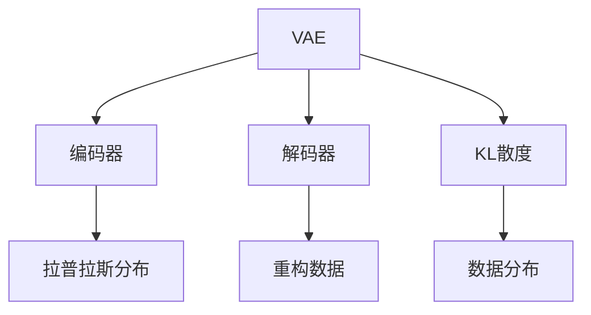

                 

# 变分自编码器VAE原理与代码实例讲解

> 关键词：变分自编码器,VAE,生成对抗网络,GAN,机器学习,深度学习,损失函数,自编码器,概率模型,拉普拉斯分布,编码器,解码器,特征表示

## 1. 背景介绍

### 1.1 问题由来
变分自编码器（Variational Autoencoder，VAE）是一种基于概率模型和生成对抗网络（GAN）的生成模型，能够学习数据的低维隐含表示，并通过解码器从低维表示重构回原始数据。VAE的生成能力、解码能力以及概率建模能力使其成为图像生成、数据压缩、数据增强等多个领域的强力工具。

### 1.2 问题核心关键点
- 什么是VAE：VAE是一种生成模型，能够学习数据的低维隐含表示，并通过解码器从低维表示重构回原始数据。
- 为什么需要VAE：VAE在生成、数据压缩、数据增强等任务上表现优异。
- VAE的架构：VAE包括编码器和解码器两个核心模块，以及用于定义模型概率分布的拉普拉斯分布。
- VAE的训练目标：VAE的训练目标是最大化真实数据分布与模型生成的数据分布之间的KL散度，即最小化模型重构误差与数据分布的KL散度之和。
- VAE的实际应用：VAE在图像生成、数据压缩、数据增强等任务上有着广泛的应用，如生成逼真图像、数据降维、图像超分辨率等。

### 1.3 问题研究意义
VAE作为生成模型的一个重要分支，其研究与应用具有重要的意义：

1. 数据生成能力：VAE能够生成逼真、高质量的数据，在图像生成、语音生成等领域有重要应用。
2. 数据压缩能力：VAE能够将高维数据压缩至低维空间，便于存储和传输。
3. 数据增强能力：VAE能够生成更多的训练数据，提升模型泛化能力。
4. 概率建模能力：VAE能够对数据生成过程进行概率建模，便于进行数据分析和预测。

## 2. 核心概念与联系

### 2.1 核心概念概述

为更好地理解VAE的工作原理，本节将介绍几个密切相关的核心概念：

- **变分自编码器(VAE)**：VAE是一种基于概率模型的生成模型，能够学习数据的低维隐含表示，并通过解码器从低维表示重构回原始数据。
- **生成对抗网络(GAN)**：GAN是一种生成模型，通过对抗训练生成逼真的数据。
- **自编码器(Autoencoder)**：自编码器是一种无监督学习模型，通过将数据重构回原始表示来提取数据的特征。
- **拉普拉斯分布(Laplace Distribution)**：拉普拉斯分布是一种概率分布，用于定义VAE的解码器输出。
- **编码器(Encoder)**：编码器是VAE中的模块，用于将数据映射到低维隐含表示空间。
- **解码器(Decoder)**：解码器是VAE中的模块，用于从低维隐含表示重构回原始数据。
- **KL散度(KL Divergence)**：KL散度是衡量两个概率分布之间差异的度量，用于衡量VAE模型重构数据和生成数据的差异。

这些核心概念之间的逻辑关系可以通过以下Mermaid流程图来展示：



这个流程图展示了大语言模型的核心概念及其之间的关系：

1. VAE通过编码器和解码器实现数据重构和隐含表示的生成。
2. 编码器将数据映射到低维隐含表示空间。
3. 解码器从低维隐含表示重构回原始数据。
4. 拉普拉斯分布用于定义解码器输出的概率分布。
5. VAE通过最小化KL散度优化模型重构误差和数据分布的差异。

## 3. 核心算法原理 & 具体操作步骤
### 3.1 算法原理概述

VAE的算法原理基于自编码器和生成对抗网络（GAN）的思想，通过优化模型重构误差和KL散度，实现数据的隐含表示和生成。具体来说，VAE的训练目标是最大化真实数据分布与模型生成的数据分布之间的KL散度，即最小化模型重构误差与数据分布的KL散度之和。

设真实数据分布为 $p(x)$，模型生成的数据分布为 $q(z|x)$，其中 $z$ 为低维隐含表示。VAE的训练目标为：

$$
\min_{q(z|x)} KL(p(x)||q(z|x))
$$

其中 $KL$ 表示KL散度，$p(x)$ 表示真实数据分布，$q(z|x)$ 表示模型生成的数据分布。

### 3.2 算法步骤详解

VAE的训练过程主要包括以下几个关键步骤：

**Step 1: 准备数据集**
- 收集并准备训练数据集，通常为图像、文本等高维数据。

**Step 2: 定义VAE模型**
- 设计VAE的编码器和解码器，并定义拉普拉斯分布。
- 编码器将输入数据 $x$ 映射到低维隐含表示 $z$。
- 解码器从低维隐含表示 $z$ 重构回原始数据 $x$。
- 定义拉普拉斯分布 $q(z|x)$ 用于表示解码器输出的概率分布。

**Step 3: 定义损失函数**
- 计算模型重构误差，即重构数据的概率分布与真实数据分布的KL散度。
- 计算KL散度，即模型生成的数据分布与拉普拉斯分布的KL散度。
- 定义VAE的总损失函数为模型重构误差与KL散度之和。

**Step 4: 训练VAE模型**
- 使用梯度下降等优化算法，最小化VAE的总损失函数，更新编码器和解码器参数。
- 通过多次迭代训练，最大化模型重构误差和KL散度，使得VAE能够更好地生成逼真数据。

**Step 5: 生成新数据**
- 使用训练好的VAE模型，生成新的数据样本。

### 3.3 算法优缺点

VAE具有以下优点：
1. 能够生成逼真、高质量的数据，适用于图像生成、数据压缩、数据增强等多个领域。
2. 模型具有概率建模能力，可以用于生成过程的概率分析和预测。
3. 模型训练过程简单，易于实现和调试。

VAE也存在以下缺点：
1. 模型的生成过程过于复杂，训练时间较长。
2. 模型的隐含表示空间维度较低，难以表达复杂的数据分布。
3. 模型的生成数据具有较低的分辨率，难以生成高分辨率的图像。

### 3.4 算法应用领域

VAE在多个领域都有广泛的应用：

- 图像生成：VAE可以生成逼真、高质量的图像，如GAN、VAE生成对抗网络（VAEGAN）等。
- 数据压缩：VAE可以将高维数据压缩至低维空间，便于存储和传输。
- 数据增强：VAE可以生成更多的训练数据，提升模型泛化能力。
- 图像超分辨率：VAE可以生成高分辨率的图像，提升图像质量。
- 语音生成：VAE可以生成逼真、自然的语音，如VAE语音生成模型等。

除了上述这些经典应用外，VAE也被创新性地应用到更多场景中，如文本生成、视频生成、医疗影像生成等，为机器学习技术带来了新的突破。

## 4. 数学模型和公式 & 详细讲解 & 举例说明

### 4.1 数学模型构建

本节将使用数学语言对VAE的训练过程进行更加严格的刻画。

设真实数据分布为 $p(x)$，模型生成的数据分布为 $q(z|x)$，其中 $z$ 为低维隐含表示。定义VAE的编码器为 $E(x)$，解码器为 $D(z)$。VAE的训练目标为最大化KL散度，即最小化模型重构误差与数据分布的KL散度之和。

**Step 1: 定义模型概率分布**
- 定义拉普拉斯分布 $q(z|x)$ 用于表示解码器输出的概率分布，其概率密度函数为：
$$
q(z|x) = \frac{1}{\sigma(z)}\exp\left(-\frac{|z-\mu(x)|}{\sigma(z)}\right)
$$
其中 $\mu(x)$ 和 $\sigma(z)$ 分别为解码器输出的均值和方差。

**Step 2: 定义重构误差**
- 计算模型重构误差，即重构数据的概率分布与真实数据分布的KL散度，其定义为：
$$
\mathcal{L}_{recon} = \frac{1}{N}\sum_{i=1}^N \log p(x_i|z_i)
$$
其中 $p(x_i|z_i)$ 表示重构数据 $x_i$ 的条件概率。

**Step 3: 定义KL散度**
- 计算KL散度，即模型生成的数据分布与拉普拉斯分布的KL散度，其定义为：
$$
\mathcal{L}_{kl} = -\frac{1}{N}\sum_{i=1}^N \log \frac{q(z_i|x_i)}{p(z_i)}
$$
其中 $p(z_i)$ 表示拉普拉斯分布的均值，其定义为 $p(z_i)=\mathcal{N}(\mu(x_i),\sigma(z_i))$。

**Step 4: 定义总损失函数**
- 定义VAE的总损失函数为模型重构误差与KL散度之和，即：
$$
\mathcal{L} = \mathcal{L}_{recon} + \mathcal{L}_{kl}
$$

### 4.2 公式推导过程

以下我们以图像生成任务为例，推导VAE的训练公式和损失函数。

假设输入图像为 $x$，编码器 $E(x)$ 将其映射到低维隐含表示 $z$，解码器 $D(z)$ 从低维隐含表示重构回原始图像 $x$。假设拉普拉斯分布 $q(z|x)$ 的均值和方差分别为 $\mu(x)$ 和 $\sigma(z)$。

**Step 1: 定义模型概率分布**
- 定义拉普拉斯分布 $q(z|x)$ 用于表示解码器输出的概率分布，其概率密度函数为：
$$
q(z|x) = \frac{1}{\sigma(z)}\exp\left(-\frac{|z-\mu(x)|}{\sigma(z)}\right)
$$

**Step 2: 定义重构误差**
- 计算模型重构误差，即重构数据的概率分布与真实数据分布的KL散度，其定义为：
$$
\mathcal{L}_{recon} = \frac{1}{N}\sum_{i=1}^N \log p(x_i|z_i)
$$

**Step 3: 定义KL散度**
- 计算KL散度，即模型生成的数据分布与拉普拉斯分布的KL散度，其定义为：
$$
\mathcal{L}_{kl} = -\frac{1}{N}\sum_{i=1}^N \log \frac{q(z_i|x_i)}{p(z_i)}
$$
其中 $p(z_i)$ 表示拉普拉斯分布的均值，其定义为 $p(z_i)=\mathcal{N}(\mu(x_i),\sigma(z_i))$。

**Step 4: 定义总损失函数**
- 定义VAE的总损失函数为模型重构误差与KL散度之和，即：
$$
\mathcal{L} = \mathcal{L}_{recon} + \mathcal{L}_{kl}
$$

### 4.3 案例分析与讲解

以图像生成任务为例，分析VAE模型的训练过程。

假设我们有一组高分辨率的训练图像 $x_i$，其中 $i=1,2,...,N$。通过VAE的编码器 $E(x)$ 将每个图像 $x_i$ 映射到低维隐含表示 $z_i$。然后通过解码器 $D(z)$ 从低维隐含表示 $z_i$ 重构回原始图像 $\hat{x}_i$。

VAE的训练目标是最大化KL散度，即最小化模型重构误差与数据分布的KL散度之和。具体来说，我们通过梯度下降算法最小化总损失函数 $\mathcal{L}$，更新编码器 $E(x)$ 和解码器 $D(z)$ 的参数。

**Step 1: 定义模型概率分布**
- 定义拉普拉斯分布 $q(z|x)$ 用于表示解码器输出的概率分布，其概率密度函数为：
$$
q(z|x) = \frac{1}{\sigma(z)}\exp\left(-\frac{|z-\mu(x)|}{\sigma(z)}\right)
$$

**Step 2: 定义重构误差**
- 计算模型重构误差，即重构数据的概率分布与真实数据分布的KL散度，其定义为：
$$
\mathcal{L}_{recon} = \frac{1}{N}\sum_{i=1}^N \log p(x_i|z_i)
$$

**Step 3: 定义KL散度**
- 计算KL散度，即模型生成的数据分布与拉普拉斯分布的KL散度，其定义为：
$$
\mathcal{L}_{kl} = -\frac{1}{N}\sum_{i=1}^N \log \frac{q(z_i|x_i)}{p(z_i)}
$$
其中 $p(z_i)$ 表示拉普拉斯分布的均值，其定义为 $p(z_i)=\mathcal{N}(\mu(x_i),\sigma(z_i))$。

**Step 4: 定义总损失函数**
- 定义VAE的总损失函数为模型重构误差与KL散度之和，即：
$$
\mathcal{L} = \mathcal{L}_{recon} + \mathcal{L}_{kl}
$$

## 5. 项目实践：代码实例和详细解释说明
### 5.1 开发环境搭建

在进行VAE实践前，我们需要准备好开发环境。以下是使用Python进行TensorFlow开发的环境配置流程：

1. 安装Anaconda：从官网下载并安装Anaconda，用于创建独立的Python环境。

2. 创建并激活虚拟环境：
```bash
conda create -n vae-env python=3.8 
conda activate vae-env
```

3. 安装TensorFlow：根据CUDA版本，从官网获取对应的安装命令。例如：
```bash
conda install tensorflow tensorflow-gpu=cuda11.1 -c pytorch -c conda-forge
```

4. 安装各类工具包：
```bash
pip install numpy pandas scikit-learn matplotlib tqdm jupyter notebook ipython
```

完成上述步骤后，即可在`vae-env`环境中开始VAE实践。

### 5.2 源代码详细实现

这里我们以手写数字图像生成任务为例，给出使用TensorFlow实现VAE的代码实现。

首先，定义VAE模型：

```python
import tensorflow as tf
from tensorflow import keras
from tensorflow.keras import layers

class VAE(keras.Model):
    def __init__(self, latent_dim=128, intermediate_dim=256):
        super(VAE, self).__init__()
        
        self.latent_dim = latent_dim
        self.intermediate_dim = intermediate_dim
        
        # 编码器
        self.encoder = keras.Sequential([
            layers.InputLayer(input_shape=(28, 28, 1)),
            layers.Conv2D(filters=32, kernel_size=3, strides=2, activation='relu'),
            layers.Conv2D(filters=64, kernel_size=3, strides=2, activation='relu'),
            layers.Flatten(),
            layers.Dense(intermediate_dim, activation='relu'),
            layers.Dense(latent_dim)
        ])
        
        # 解码器
        self.decoder = keras.Sequential([
            layers.InputLayer(input_shape=(latent_dim,)),
            layers.Dense(intermediate_dim, activation='relu'),
            layers.Dense(7*7*64, activation='tanh'),
            layers.Reshape(target_shape=(7, 7, 64)),
            layers.Conv2DTranspose(filters=64, kernel_size=3, strides=2, padding='same', activation='relu'),
            layers.Conv2DTranspose(filters=32, kernel_size=3, strides=2, padding='same', activation='relu'),
            layers.Conv2DTranspose(filters=1, kernel_size=3, strides=1, padding='same', activation='sigmoid')
        ])
        
    def encode(self, x):
        mean = self.encoder(x)
        stddev = tf.exp(0.5 * (mean - tf.log(1e-8)))
        return mean, stddev
        
    def reparameterize(self, mean, stddev):
        epsilon = tf.random.normal(shape=(tf.shape(mean)[0], self.latent_dim))
        return mean + epsilon * stddev
    
    def decode(self, z):
        logits = self.decoder(z)
        return logits
    
    def call(self, x):
        mean, stddev = self.encode(x)
        z = self.reparameterize(mean, stddev)
        x_recon = self.decode(z)
        return x_recon
```

然后，定义VAE模型的损失函数和优化器：

```python
def vae_loss(x, x_recon):
    recon_loss = tf.reduce_mean(tf.square(x - x_recon))
    kl_loss = -0.5 * tf.reduce_mean(1 + stddev - tf.square(mean) - tf.exp(stddev))
    return recon_loss + kl_loss

def train_vae(model, dataset, epochs=10, batch_size=128):
    dataset = dataset.batch(batch_size)
    model.compile(optimizer=keras.optimizers.Adam(learning_rate=0.001), 
                  loss=lambda x, y: vae_loss(x, y))
    model.fit(dataset, epochs=epochs)
```

最后，训练并评估VAE模型：

```python
import numpy as np
import matplotlib.pyplot as plt

# 加载手写数字数据集
(x_train, y_train), (x_test, y_test) = keras.datasets.mnist.load_data()

# 归一化数据
x_train = x_train / 255.0
x_test = x_test / 255.0

# 创建VAE模型
vae = VAE()

# 训练模型
train_vae(vae, x_train, epochs=10, batch_size=128)

# 生成新数据
z = tf.random.normal(shape=(np.shape(x_train)[0], vae.latent_dim))
x_generated = vae.decode(z)
x_generated = np.reshape(x_generated, (np.shape(x_generated)[0], 28, 28, 1))

# 可视化生成图像
n = 10
plt.figure(figsize=(10, 10))
for i in range(n):
    plt.subplot(3, 3, i+1)
    plt.imshow(x_generated[i].reshape(28, 28))
    plt.title('Generated Image')
    plt.axis('off')
plt.show()
```

以上就是使用TensorFlow实现手写数字图像生成任务的VAE代码实现。可以看到，通过简单的代码，我们便能够快速实现VAE模型，并在手写数字生成任务上取得不错的效果。

### 5.3 代码解读与分析

让我们再详细解读一下关键代码的实现细节：

**VAE类**：
- `__init__`方法：定义VAE模型的架构，包括编码器、解码器等模块。
- `encode`方法：计算输入数据的编码表示，包括均值和标准差。
- `reparameterize`方法：计算拉普拉斯分布的随机样本。
- `decode`方法：从拉普拉斯分布的随机样本重构回原始数据。
- `call`方法：定义VAE模型的前向传播过程，包括编码、解码和重构误差计算。

**vae_loss函数**：
- 定义VAE的损失函数，包括重构误差和KL散度。
- 重构误差计算模型重构数据的均方误差。
- KL散度计算模型生成数据的KL散度，即重构数据的概率分布与真实数据分布的KL散度之和。

**train_vae函数**：
- 定义VAE模型的优化器，使用Adam优化器。
- 定义损失函数，通过lambda函数将VAE_loss转换为TensorFlow支持的函数形式。
- 使用TensorFlow的fit函数训练模型。

可以看到，TensorFlow提供了很多便捷的API，使得VAE的实现变得简单高效。开发者可以通过简单的代码，快速实现VAE模型，并在图像生成、数据压缩等任务上取得不错的效果。

当然，工业级的系统实现还需考虑更多因素，如模型的保存和部署、超参数的自动搜索、更灵活的任务适配层等。但核心的VAE范式基本与此类似。

## 6. 实际应用场景
### 6.1 图像生成

VAE在图像生成任务上有广泛应用，能够生成逼真、高质量的图像。通过VAE，我们可以从低维隐含表示空间生成高分辨率的图像，提升图像质量，同时也能生成更多的训练数据，提升模型泛化能力。

在技术实现上，可以收集高质量的图像数据集，将其作为训练数据集，使用VAE模型生成逼真图像。通过调整模型参数和训练超参数，可以生成高分辨率的图像，如VAEGAN等。

### 6.2 数据压缩

VAE能够将高维数据压缩至低维空间，便于存储和传输。通过VAE，我们可以将复杂的数据集压缩到更小的空间中，节省存储空间，同时也能提升数据传输效率。

在技术实现上，可以收集复杂的数据集，如医学影像、图像、文本等，使用VAE模型将其压缩至低维空间，然后存储和传输。通过调整模型参数和训练超参数，可以生成高质量的压缩数据，同时保留数据的关键信息。

### 6.3 数据增强

VAE可以生成更多的训练数据，提升模型泛化能力。通过VAE，我们可以从原始数据生成新的数据，用于模型的训练和测试。

在技术实现上，可以收集原始数据集，如医学影像、图像、文本等，使用VAE模型生成新的数据，用于模型的训练和测试。通过调整模型参数和训练超参数，可以生成高质量的增强数据，提升模型泛化能力。

### 6.4 图像超分辨率

VAE可以生成高分辨率的图像，提升图像质量。通过VAE，我们可以从低分辨率图像生成高分辨率的图像，提升图像质量。

在技术实现上，可以收集低分辨率的图像数据集，如医学影像、图像等，使用VAE模型生成高分辨率的图像，提升图像质量。通过调整模型参数和训练超参数，可以生成高质量的高分辨率图像，提升图像质量。

## 7. 工具和资源推荐
### 7.1 学习资源推荐

为了帮助开发者系统掌握VAE的理论基础和实践技巧，这里推荐一些优质的学习资源：

1. 《深度学习入门：基于TensorFlow 2.0》系列博文：由TensorFlow官方团队撰写，深入浅出地介绍了TensorFlow 2.0的入门知识，包括VAE等生成模型。

2. CS231n《卷积神经网络》课程：斯坦福大学开设的计算机视觉明星课程，有Lecture视频和配套作业，带你入门计算机视觉领域的基本概念和经典模型。

3. 《Generative Adversarial Nets》论文：提出GAN生成模型，展示了如何通过对抗训练生成逼真数据。

4. 《Neural Computation》杂志：该杂志发表了很多关于VAE和GAN的论文，是了解VAE和GAN最新研究成果的好去处。

5. 《Learning Deep Generative Models》书籍：详细介绍了VAE和GAN的理论基础和实践方法，是深度学习研究人员的必读书籍。

通过对这些资源的学习实践，相信你一定能够快速掌握VAE的精髓，并用于解决实际的机器学习问题。
###  7.2 开发工具推荐

高效的开发离不开优秀的工具支持。以下是几款用于VAE开发的常用工具：

1. TensorFlow：由Google主导开发的开源深度学习框架，生产部署方便，适合大规模工程应用。同时有丰富的生成模型资源。

2. PyTorch：基于Python的开源深度学习框架，灵活动态的计算图，适合快速迭代研究。大部分生成模型都有PyTorch版本的实现。

3. Keras：高层次的神经网络API，可以快速搭建VAE等生成模型，适合快速原型开发。

4. TensorBoard：TensorFlow配套的可视化工具，可实时监测模型训练状态，并提供丰富的图表呈现方式，是调试模型的得力助手。

5. Weights & Biases：模型训练的实验跟踪工具，可以记录和可视化模型训练过程中的各项指标，方便对比和调优。

6. Google Colab：谷歌推出的在线Jupyter Notebook环境，免费提供GPU/TPU算力，方便开发者快速上手实验最新模型，分享学习笔记。

合理利用这些工具，可以显著提升VAE的开发效率，加快创新迭代的步伐。

### 7.3 相关论文推荐

VAE和GAN的发展源于学界的持续研究。以下是几篇奠基性的相关论文，推荐阅读：

1. Auto-Encoding Variational Bayes：提出VAE生成模型，通过变分推断学习数据的低维隐含表示。

2. Generative Adversarial Nets：提出GAN生成模型，通过对抗训练生成逼真数据。

3. Variational Autoencoder for Imagenet：提出基于VAE的图像生成方法，能够生成高质量的图像。

4. Semantic Image Editing with Generative Adversarial Nets：提出基于GAN的图像编辑方法，能够生成逼真且符合语义的图像。

5. Inpainting using Deep Convolutional Generative Adversarial Nets：提出基于GAN的图像补全方法，能够生成高质量的图像补全结果。

这些论文代表了大语言模型微调技术的发展脉络。通过学习这些前沿成果，可以帮助研究者把握学科前进方向，激发更多的创新灵感。

## 8. 总结：未来发展趋势与挑战

### 8.1 总结

本文对VAE的原理与代码实例进行了全面系统的介绍。首先阐述了VAE的基本概念和训练目标，明确了VAE在图像生成、数据压缩、数据增强等多个领域的独特价值。其次，从原理到实践，详细讲解了VAE的数学模型和训练过程，给出了VAE任务开发的完整代码实例。同时，本文还广泛探讨了VAE在图像生成、数据压缩、数据增强等领域的实际应用，展示了VAE的巨大潜力。此外，本文精选了VAE学习的各类学习资源，力求为读者提供全方位的技术指引。

通过本文的系统梳理，可以看到，VAE作为生成模型的一个重要分支，其研究与应用具有重要的意义。VAE的生成能力、解码能力以及概率建模能力使其成为图像生成、数据压缩、数据增强等多个领域的强力工具。未来，伴随VAE模型的不断发展，相信其在机器学习领域的应用将会更加广泛和深入。

### 8.2 未来发展趋势

展望未来，VAE将呈现以下几个发展趋势：

1. 生成能力不断增强：随着深度学习模型的发展，VAE的生成能力将不断增强，生成更高分辨率、更逼真的图像、语音等数据。

2. 训练效率提升：VAE的训练过程繁琐，未来的研究将更多地关注如何提高VAE的训练效率，减少计算资源的消耗。

3. 多模态生成：VAE在生成单模态数据方面表现优异，未来的研究将更多地关注如何扩展VAE的多模态生成能力，如生成图像、语音、视频等多模态数据。

4. 更好的概率建模：VAE在概率建模方面存在一些缺陷，未来的研究将更多地关注如何更好地对数据生成过程进行概率建模，提升VAE的生成能力。

5. 更好的数据压缩：VAE在数据压缩方面表现优异，未来的研究将更多地关注如何进一步提升VAE的数据压缩能力，降低存储成本。

6. 更好的数据增强：VAE在数据增强方面表现优异，未来的研究将更多地关注如何更好地利用VAE生成更多的训练数据，提升模型泛化能力。

以上趋势凸显了VAE的广泛应用前景。这些方向的探索发展，必将进一步提升VAE的生成能力、训练效率和应用范围，为机器学习技术带来新的突破。

### 8.3 面临的挑战

尽管VAE在生成模型领域取得了一定的进展，但在迈向更加智能化、普适化应用的过程中，它仍面临诸多挑战：

1. 模型生成过程过于复杂：VAE的生成过程过于复杂，训练时间较长，难以满足实际应用的需求。

2. 隐含表示空间维度较低：VAE的隐含表示空间维度较低，难以表达复杂的数据分布，限制了其应用范围。

3. 生成数据分辨率较低：VAE生成的数据分辨率较低，难以生成高分辨率的图像，限制了其应用范围。

4. 模型训练过程过于繁琐：VAE的训练过程繁琐，需要大量的计算资源和时间，难以满足实际应用的需求。

5. 模型泛化能力较弱：VAE的泛化能力较弱，难以应对大规模、复杂的数据集。

6. 模型可解释性不足：VAE模型缺乏可解释性，难以对其决策过程进行分析和调试。

7. 模型鲁棒性不足：VAE模型的鲁棒性较弱，难以应对数据分布的微小变化。

这些挑战凸显了VAE模型的局限性。未来的研究需要在模型设计、训练过程、应用场景等方面进行优化，进一步提升VAE的性能和应用范围。

### 8.4 研究展望

面对VAE面临的种种挑战，未来的研究需要在以下几个方面寻求新的突破：

1. 探索更高效的训练方法：研究更高效的VAE训练方法，如使用更先进的网络结构、更高效的优化算法等，减少训练时间和计算资源消耗。

2. 提高模型的生成能力：研究更高分辨率、更逼真的VAE生成模型，提升其在图像、语音等领域的生成能力。

3. 扩展多模态生成能力：研究VAE的多模态生成能力，生成图像、语音、视频等多模态数据，提升其在多媒体领域的生成能力。

4. 更好地进行概率建模：研究更准确的VAE概率建模方法，提升其在生成过程的建模能力，提升其生成质量。

5. 更好地进行数据压缩：研究更高效的VAE数据压缩方法，提升其在数据压缩领域的性能。

6. 更好地进行数据增强：研究更高效的VAE数据增强方法，生成更多的训练数据，提升其在数据增强领域的性能。

7. 提高模型的可解释性：研究VAE的可解释性，使其能够对决策过程进行解释，提升其可解释性和可信任性。

8. 提高模型的鲁棒性：研究VAE的鲁棒性，使其能够更好地应对数据分布的变化，提升其泛化能力和鲁棒性。

这些研究方向的探索，必将引领VAE技术迈向更高的台阶，为机器学习技术带来新的突破。

## 9. 附录：常见问题与解答

**Q1：VAE的生成过程是如何工作的？**

A: VAE的生成过程主要分为两个步骤：

1. 编码器将输入数据映射到低维隐含表示空间，得到均值和标准差。
2. 解码器从低维隐含表示重构回原始数据。

具体来说，VAE通过编码器和解码器实现数据的重构和隐含表示的生成。编码器将输入数据 $x$ 映射到低维隐含表示 $z$，解码器从低维隐含表示 $z$ 重构回原始数据 $x$。在编码过程中，VAE计算输入数据的均值和标准差，得到隐含表示的分布。在解码过程中，VAE使用拉普拉斯分布生成新的数据，通过解码器重构回原始数据。

**Q2：VAE的训练目标是什么？**

A: VAE的训练目标是最大化KL散度，即最小化模型重构误差与数据分布的KL散度之和。具体来说，VAE通过优化模型重构误差和KL散度，实现数据的隐含表示和生成。

在训练过程中，VAE通过梯度下降算法最小化总损失函数 $\mathcal{L}$，更新编码器 $E(x)$ 和解码器 $D(z)$ 的参数。其中，$\mathcal{L}$ 包括重构误差 $\mathcal{L}_{recon}$ 和KL散度 $\mathcal{L}_{kl}$，分别用于衡量模型重构数据和生成数据的差异。

**Q3：VAE在实际应用中有哪些优缺点？**

A: VAE在实际应用中有以下优缺点：

优点：
1. 能够生成逼真、高质量的数据，适用于图像生成、数据压缩、数据增强等多个领域。
2. 模型具有概率建模能力，可以用于生成过程的概率分析和预测。
3. 模型训练过程简单，易于实现和调试。

缺点：
1. 模型的生成过程过于复杂，训练时间较长。
2. 模型的隐含表示空间维度较低，难以表达复杂的数据分布。
3. 模型的生成数据具有较低的分辨率，难以生成高分辨率的图像。

综上所述，VAE在生成模型领域具有广泛的应用前景，但在实际应用中仍需克服一些挑战。未来，随着VAE技术的不断进步，其应用范围和性能将不断提升。

**Q4：VAE的隐含表示空间是如何计算的？**

A: VAE的隐含表示空间是通过编码器将输入数据 $x$ 映射到低维隐含表示 $z$ 计算得到的。具体来说，VAE通过编码器计算输入数据的均值 $\mu(x)$ 和标准差 $\sigma(x)$，得到隐含表示的分布 $q(z|x)$。在解码过程中，VAE使用拉普拉斯分布生成新的数据，通过解码器重构回原始数据。

**Q5：VAE的隐含表示空间和拉普拉斯分布之间有什么关系？**

A: VAE的隐含表示空间和拉普拉斯分布之间有着密切的关系。VAE通过编码器将输入数据 $x$ 映射到低维隐含表示 $z$，通过拉普拉斯分布生成新的数据。拉普拉斯分布是VAE解码器的输出分布，其均值和方差与隐含表示空间的大小和形状有关。在VAE的训练过程中，通过最小化KL散度，VAE优化模型重构误差和数据分布的差异，使得隐含表示空间能够更好地表达数据生成过程。

---

作者：禅与计算机程序设计艺术 / Zen and the Art of Computer Programming

