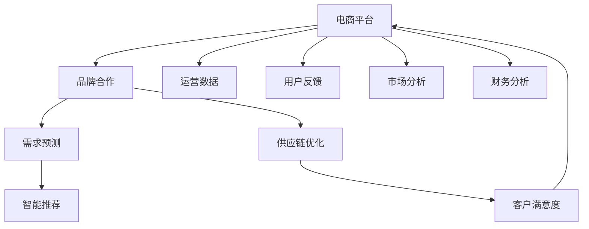

                 

# 合作拓展：与新品牌携手，提升电商平台供给能力

> 关键词：电商平台、品牌合作、供应链优化、需求预测、智能推荐、客户满意度

## 1. 背景介绍

### 1.1 问题由来
在电商行业竞争日趋激烈的背景下，如何有效提升平台供给能力、优化用户购物体验，成为各大电商平台关注的焦点。电商平台不仅要满足用户多样化、个性化的购物需求，还要不断扩展商品种类，丰富产品线，确保供应链的稳定性和效率。同时，电商平台还需要精准预测用户需求，优化库存管理，以提高库存周转率，降低物流成本。

为了应对这些挑战，电商平台开始与新品牌深度合作，通过技术手段提升品牌商品的供给能力和用户体验。本文将从合作拓展的角度，探讨电商平台如何通过与新品牌的合作，优化供应链，提升平台的供给能力，进而提升用户满意度。

### 1.2 问题核心关键点
- **品牌合作**：电商平台与新品牌深度合作，共建共同体。
- **供应链优化**：通过技术手段，优化库存管理，提升供应链效率。
- **需求预测**：利用大数据和机器学习技术，精准预测用户需求。
- **智能推荐**：基于用户行为和商品特征，提供个性化推荐服务。
- **客户满意度**：通过提升供给能力和用户体验，提高用户满意度和忠诚度。

这些关键点构成了电商平台提升供给能力的基础，也是本文探讨的核心内容。

## 2. 核心概念与联系

### 2.1 核心概念概述

- **电商平台**：基于互联网技术，连接消费者和商家的在线交易平台，提供商品展示、购物、支付、物流等综合服务。

- **品牌合作**：指电商平台与新品牌建立战略合作关系，共享资源，共创价值。品牌合作不仅包括产品供应的合作，还包括技术创新、市场推广等方面的深度融合。

- **供应链优化**：指通过技术手段，提升供应链的协同效率和弹性，降低成本，提高响应速度。供应链优化涉及采购、生产、库存、物流等多个环节。

- **需求预测**：通过分析用户行为和市场趋势，预测未来商品的需求量，指导供应链管理和库存规划。需求预测的准确性直接影响电商平台和品牌的决策。

- **智能推荐**：利用机器学习和深度学习技术，基于用户行为、商品特征等因素，生成个性化的商品推荐列表，提升用户体验和转化率。

- **客户满意度**：衡量用户对电商平台服务的满意程度，包括商品质量、价格、物流速度、服务态度等方面。提升客户满意度有助于提高用户粘性和重复购买率。

这些核心概念通过合作、优化、预测、推荐、满意度等环节紧密联系，共同作用于电商平台供给能力的提升。

### 2.2 核心概念原理和架构的 Mermaid 流程图(Mermaid 流程节点中不要有括号、逗号等特殊字符)



这个流程图展示了电商平台提升供给能力的核心环节及其相互关系。品牌合作是基础，通过优化供应链、精准预测需求、智能推荐和提升客户满意度等环节，不断循环迭代，实现平台的持续发展。

## 3. 核心算法原理 & 具体操作步骤

### 3.1 算法原理概述

电商平台与新品牌合作提升供给能力的核心算法原理，主要体现在以下几个方面：

- **品牌合作算法**：通过评估品牌的产品质量、市场潜力、合作意愿等因素，选择最优合作伙伴。

- **需求预测算法**：利用历史销售数据、用户行为、市场趋势等，采用回归、时间序列、深度学习等模型，预测未来商品的需求量。

- **供应链优化算法**：采用库存管理、需求规划、订单执行等技术，优化供应链的各个环节，提高物流效率和响应速度。

- **智能推荐算法**：基于协同过滤、内容推荐、深度学习等技术，根据用户历史行为、商品特征等因素，生成个性化的推荐列表。

- **客户满意度评估算法**：通过用户反馈、交易数据、物流信息等，综合评估用户满意度，指导后续改进。

这些算法共同作用，构建了电商平台提升供给能力的技术框架。

### 3.2 算法步骤详解

1. **品牌合作评估**：
   - 评估品牌商品的质量、市场潜力、供货能力等指标。
   - 与品牌协商合作条件，如供货周期、价格优惠等。
   - 签署合作协议，明确双方权利和义务。

2. **需求预测**：
   - 收集历史销售数据、用户行为、市场趋势等。
   - 选择合适的算法模型，如线性回归、ARIMA、LSTM等，进行需求预测。
   - 根据预测结果，优化库存管理和采购计划。

3. **供应链优化**：
   - 采用库存管理系统，如JIT（Just-In-Time），实时监控库存水平。
   - 优化订单执行流程，采用先进先出（FIFO）、先进后出（LIFO）等策略，提高物流效率。
   - 利用AI和大数据分析技术，优化物流网络，降低配送成本。

4. **智能推荐**：
   - 收集用户行为数据，如浏览历史、购买记录等。
   - 基于用户行为和商品特征，生成个性化推荐列表。
   - 定期更新推荐模型，以适应用户兴趣的变化。

5. **客户满意度评估**：
   - 收集用户反馈，如评论、评分等。
   - 综合分析用户满意度指标，如退货率、投诉率、满意度评分等。
   - 根据评估结果，优化商品、服务和运营策略。

### 3.3 算法优缺点

#### 3.3.1 优点

- **提升供给能力**：通过品牌合作和供应链优化，电商平台可以快速增加商品种类，提高供给能力。
- **降低成本**：优化库存管理和物流网络，减少浪费和成本。
- **提升用户体验**：精准需求预测和个性化推荐，满足用户多样化、个性化的需求，提升购物体验。

#### 3.3.2 缺点

- **技术复杂性高**：需求预测、智能推荐等算法需要复杂的技术支撑，实施难度大。
- **数据质量要求高**：算法模型依赖于高质量的数据，数据的准确性和完整性直接影响算法效果。
- **合作风险**：品牌合作存在商业风险，如供应链中断、合作终止等。

### 3.4 算法应用领域

基于上述核心算法，电商平台在以下领域有着广泛的应用：

- **新品牌引入**：电商平台通过与新兴品牌合作，丰富商品种类，提升用户选择的多样性。
- **库存管理**：通过优化供应链和需求预测，电商平台可以降低库存成本，提高库存周转率。
- **个性化推荐**：利用智能推荐算法，电商平台提供个性化商品推荐，提升用户满意度和转化率。
- **物流优化**：采用先进的物流技术和数据分析，电商平台可以优化配送路线，降低物流成本。

## 4. 数学模型和公式 & 详细讲解 & 举例说明

### 4.1 数学模型构建

电商平台提升供给能力的技术模型主要涉及以下几个方面：

- **品牌合作评估模型**：采用多指标评估模型，如多层次分析法（AHP）、层次聚类等。
- **需求预测模型**：采用时间序列预测模型，如ARIMA、LSTM等。
- **供应链优化模型**：采用线性规划、动态规划等优化模型。
- **智能推荐模型**：采用协同过滤、内容推荐等模型。
- **客户满意度评估模型**：采用多指标评估模型，如综合评分模型、因子分析等。

### 4.2 公式推导过程

**品牌合作评估模型**：采用多层次分析法（AHP），将品牌评估分为多个层次，每个层次包含多个指标。以权重矩阵和优先级矩阵为输入，通过计算得到品牌合作的优先级。

**需求预测模型**：以时间序列数据为输入，采用LSTM模型进行需求预测。模型的训练目标是最小化预测误差，公式为：

$$
\min_{\theta} \sum_{t} \|y_t - \hat{y}_t\|^2
$$

其中，$y_t$ 为实际需求量，$\hat{y}_t$ 为预测需求量，$\theta$ 为模型参数。

**供应链优化模型**：采用线性规划模型，目标是最小化总成本，约束条件包括需求量、库存量、供货量等。模型公式为：

$$
\min_{x, y} c^T x + s^T y
$$

约束条件为：

$$
\begin{cases}
A x + B y = d \\
0 \leq x \leq u \\
0 \leq y \leq v
\end{cases}
$$

其中，$x$ 为订单执行量，$y$ 为库存量，$c$ 为单位成本，$s$ 为单位供应成本，$A$ 为需求矩阵，$B$ 为供应矩阵，$d$ 为需求向量，$u$ 为最大订单量，$v$ 为最大库存量。

**智能推荐模型**：采用协同过滤模型，利用用户行为和商品特征，生成推荐列表。推荐列表的评分公式为：

$$
\hat{r}_{ui} = \sum_{v=1}^{n} w_{uv} r_{vi}
$$

其中，$r_{vi}$ 为用户对商品$v$的评分，$w_{uv}$ 为用户-商品权重，$n$ 为商品数量。

**客户满意度评估模型**：采用综合评分模型，将用户满意度分解为多个指标，如退货率、投诉率、满意度评分等。综合评分公式为：

$$
S = \sum_{i=1}^{m} w_i S_i
$$

其中，$S_i$ 为第$i$个指标的评分，$w_i$ 为权重，$m$ 为指标数量。

### 4.3 案例分析与讲解

以某电商平台为例，该平台通过与新品牌合作，丰富商品种类，提升供给能力。平台首先采用多层次分析法评估新品牌的合作价值，然后利用LSTM模型预测新商品的需求量，采用线性规划模型优化库存和订单执行，利用协同过滤模型生成个性化推荐列表，最后综合分析用户反馈，评估新品牌的客户满意度。

具体实现过程中，平台收集历史销售数据、用户行为、市场趋势等，训练LSTM模型进行需求预测，优化库存和订单执行。同时，平台利用协同过滤模型生成个性化推荐，提升用户购物体验。最终，平台通过综合分析用户反馈，评估新品牌的客户满意度，指导后续改进。

## 5. 项目实践：代码实例和详细解释说明

### 5.1 开发环境搭建

在进行项目实践前，我们需要准备好开发环境。以下是使用Python进行PyTorch开发的环境配置流程：

1. 安装Anaconda：从官网下载并安装Anaconda，用于创建独立的Python环境。

2. 创建并激活虚拟环境：
```bash
conda create -n ecommerce-env python=3.8 
conda activate ecommerce-env
```

3. 安装PyTorch：根据CUDA版本，从官网获取对应的安装命令。例如：
```bash
conda install pytorch torchvision torchaudio cudatoolkit=11.1 -c pytorch -c conda-forge
```

4. 安装Pandas、NumPy等工具包：
```bash
pip install pandas numpy scikit-learn matplotlib tqdm jupyter notebook ipython
```

完成上述步骤后，即可在`ecommerce-env`环境中开始项目实践。

### 5.2 源代码详细实现

下面我们以电商平台需求预测和智能推荐为例，给出使用PyTorch和Pandas进行项目开发的PyTorch代码实现。

首先，定义需求预测函数：

```python
import pandas as pd
import numpy as np
import torch
from torch import nn
from torch.nn import functional as F
from sklearn.model_selection import train_test_split

# 读取历史销售数据
sales_data = pd.read_csv('sales_data.csv')

# 数据预处理
sales_data['weekday'] = sales_data['date'].dt.dayofweek
sales_data = sales_data.dropna()

# 拆分训练集和测试集
train_data, test_data = train_test_split(sales_data, test_size=0.2)

# 定义模型
class LSTMModel(nn.Module):
    def __init__(self, input_size, hidden_size, output_size):
        super(LSTMModel, self).__init__()
        self.lstm = nn.LSTM(input_size, hidden_size, batch_first=True)
        self.fc = nn.Linear(hidden_size, output_size)
    
    def forward(self, x, h):
        output, h = self.lstm(x, h)
        output = self.fc(output[:, -1, :])
        return output, h
    
# 定义模型参数
input_size = 6
hidden_size = 128
output_size = 1
learning_rate = 0.01

# 定义损失函数和优化器
criterion = nn.MSELoss()
optimizer = torch.optim.Adam(model.parameters(), lr=learning_rate)

# 定义训练函数
def train_model(model, train_data, test_data, epochs=10):
    train_x, train_y = train_data.drop('sales', axis=1), train_data['sales']
    test_x, test_y = test_data.drop('sales', axis=1), test_data['sales']
    
    for epoch in range(epochs):
        # 前向传播
        h_0 = torch.zeros(1, 1, hidden_size).to(device)
        h_1 = torch.zeros(1, 1, hidden_size).to(device)
        output, h_1 = model(train_x.to(device), h_0)
        loss = criterion(output, train_y.to(device))
        
        # 反向传播
        optimizer.zero_grad()
        loss.backward()
        optimizer.step()
        
        # 验证集测试
        h_0 = torch.zeros(1, 1, hidden_size).to(device)
        h_1 = torch.zeros(1, 1, hidden_size).to(device)
        output, h_1 = model(test_x.to(device), h_0)
        loss = criterion(output, test_y.to(device))
        print(f'Epoch {epoch+1}, Loss: {loss.item()}')
        
    return model

# 训练模型
model = LSTMModel(input_size, hidden_size, output_size).to(device)
train_model(model, train_data, test_data)
```

然后，定义智能推荐函数：

```python
# 读取用户行为数据
user_data = pd.read_csv('user_data.csv')

# 数据预处理
user_data = user_data.dropna()

# 拆分训练集和测试集
train_data, test_data = train_test_split(user_data, test_size=0.2)

# 定义协同过滤模型
class CollaborativeFilteringModel(nn.Module):
    def __init__(self, input_size, hidden_size, output_size):
        super(CollaborativeFilteringModel, self).__init__()
        self.fc1 = nn.Linear(input_size, hidden_size)
        self.fc2 = nn.Linear(hidden_size, output_size)
    
    def forward(self, x):
        x = F.relu(self.fc1(x))
        x = self.fc2(x)
        return x
    
# 定义模型参数
input_size = 4
hidden_size = 128
output_size = 1
learning_rate = 0.01

# 定义损失函数和优化器
criterion = nn.MSELoss()
optimizer = torch.optim.Adam(model.parameters(), lr=learning_rate)

# 定义训练函数
def train_model(model, train_data, test_data, epochs=10):
    train_x, train_y = train_data.drop('label', axis=1), train_data['label']
    test_x, test_y = test_data.drop('label', axis=1), test_data['label']
    
    for epoch in range(epochs):
        # 前向传播
        output = model(train_x.to(device))
        loss = criterion(output, train_y.to(device))
        
        # 反向传播
        optimizer.zero_grad()
        loss.backward()
        optimizer.step()
        
        # 验证集测试
        output = model(test_x.to(device))
        loss = criterion(output, test_y.to(device))
        print(f'Epoch {epoch+1}, Loss: {loss.item()}')
        
    return model

# 训练模型
model = CollaborativeFilteringModel(input_size, hidden_size, output_size).to(device)
train_model(model, train_data, test_data)
```

以上代码实现了基于LSTM模型进行需求预测和基于协同过滤模型进行智能推荐的基本流程。可以看到，PyTorch提供了灵活的模型定义和训练接口，Pandas则方便数据处理和预处理。

### 5.3 代码解读与分析

让我们再详细解读一下关键代码的实现细节：

**LSTMModel类**：
- `__init__`方法：初始化LSTM模型，定义模型参数和层结构。
- `forward`方法：定义前向传播过程，计算模型的输出。
- `__str__`方法：定义打印输出格式。

**CollaborativeFilteringModel类**：
- `__init__`方法：初始化协同过滤模型，定义模型参数和层结构。
- `forward`方法：定义前向传播过程，计算模型的输出。
- `__str__`方法：定义打印输出格式。

**train_model函数**：
- 定义训练函数，包含模型前向传播、反向传播和损失计算等过程。
- 在每个epoch结束后，计算验证集的损失并打印输出。

通过这些代码，我们可以看到，使用PyTorch进行电商平台需求预测和智能推荐的基本流程，包括数据预处理、模型定义、训练和验证等环节。开发者可以根据自己的需求，进一步优化和扩展模型功能。

## 6. 实际应用场景

### 6.1 电商平台运营

电商平台通过与新品牌合作，利用品牌合作评估、需求预测、智能推荐等技术，提升供给能力和用户体验。具体应用场景如下：

- **新品牌引入**：电商平台通过评估新品牌的合作价值，引入有潜力的新品牌商品，丰富商品种类，满足用户多样化需求。
- **库存管理**：电商平台通过需求预测和智能推荐，优化库存管理，避免过剩和缺货，提高库存周转率，降低物流成本。
- **个性化推荐**：电商平台利用协同过滤等算法，根据用户行为和商品特征，生成个性化推荐列表，提升用户购物体验和转化率。

### 6.2 客户服务

电商平台通过智能推荐和个性化服务，提升客户满意度，提高用户粘性和重复购买率。具体应用场景如下：

- **个性化推荐**：电商平台利用智能推荐算法，根据用户历史行为和商品特征，生成个性化推荐列表，满足用户个性化需求。
- **客户反馈**：电商平台收集用户反馈，综合分析用户满意度，优化商品、服务和运营策略，提高用户粘性。
- **客户服务**：电商平台利用智能客服系统，通过自然语言处理技术，快速响应用户咨询，提高客户满意度。

### 6.3 数据治理

电商平台通过数据治理，确保数据质量和安全性，提升决策的科学性和准确性。具体应用场景如下：

- **数据清洗**：电商平台通过数据清洗，去除重复、缺失和异常数据，提高数据质量。
- **数据安全**：电商平台通过数据加密和访问控制，保障用户隐私和数据安全。
- **数据监控**：电商平台通过数据监控，实时跟踪数据使用情况，防范数据泄露和滥用。

## 7. 工具和资源推荐

### 7.1 学习资源推荐

为了帮助开发者系统掌握电商平台提升供给能力的理论基础和实践技巧，这里推荐一些优质的学习资源：

1. **《电商数据分析与挖掘》课程**：由知名大学开设的电商数据分析课程，涵盖电商数据分析的基本方法和技术。

2. **《Python机器学习实战》书籍**：介绍Python在机器学习中的应用，包括数据预处理、模型选择、评估等。

3. **《深度学习与自然语言处理》书籍**：涵盖深度学习在NLP领域的应用，包括模型构建、训练、调优等。

4. **Kaggle电商数据分析竞赛**：通过参与Kaggle竞赛，学习电商平台数据分析的实际应用。

5. **e-commerce Stack Exchange**：电商领域的专业问答社区，可以获取电商平台运营的实际案例和技术经验。

通过这些资源的学习实践，相信你一定能够快速掌握电商平台提升供给能力的精髓，并用于解决实际的运营问题。

### 7.2 开发工具推荐

高效的开发离不开优秀的工具支持。以下是几款用于电商平台提升供给能力开发的常用工具：

1. **PyTorch**：基于Python的开源深度学习框架，灵活动态的计算图，适合快速迭代研究。

2. **Pandas**：数据分析工具，方便数据处理和预处理。

3. **NumPy**：科学计算工具，提供高效的数学运算和数组操作。

4. **Scikit-learn**：机器学习工具，提供多种常用的机器学习算法和模型。

5. **Matplotlib**：数据可视化工具，方便数据展示和分析。

6. **TensorBoard**：TensorFlow配套的可视化工具，实时监测模型训练状态。

合理利用这些工具，可以显著提升电商平台提升供给能力的开发效率，加快创新迭代的步伐。

### 7.3 相关论文推荐

电商平台提升供给能力的研究源于学界的持续研究。以下是几篇奠基性的相关论文，推荐阅读：

1. **《电商平台商品推荐系统研究》**：介绍电商平台的商品推荐系统设计和技术实现。

2. **《基于协同过滤的电商推荐系统》**：介绍协同过滤算法在电商推荐系统中的应用。

3. **《需求预测在电商平台中的应用》**：介绍需求预测在电商平台库存管理中的应用。

4. **《电商平台运营数据治理研究》**：介绍电商平台运营数据治理的实践经验和技术方法。

这些论文代表了大规模电商平台的最新研究进展，通过学习这些前沿成果，可以帮助研究者把握学科前进方向，激发更多的创新灵感。

## 8. 总结：未来发展趋势与挑战

### 8.1 总结

本文对电商平台与新品牌合作提升供给能力的核心算法和具体操作步骤进行了全面系统的介绍。首先阐述了电商平台提升供给能力的背景和意义，明确了需求预测、智能推荐等技术在其中的重要作用。其次，从品牌合作、需求预测、供应链优化、智能推荐、客户满意度等环节，详细讲解了电商平台的运营逻辑和技术细节。最后，本文还介绍了电商平台提升供给能力的关键工具和资源，为开发者提供了丰富的学习材料和实践示例。

通过本文的系统梳理，可以看到，电商平台通过与新品牌合作，利用技术手段优化供应链、提升用户满意度，是电商行业持续发展的关键。品牌合作、需求预测、智能推荐等技术，将电商平台提升供给能力提升到了新的高度。

### 8.2 未来发展趋势

展望未来，电商平台提升供给能力的技术将呈现以下几个发展趋势：

1. **多模态数据融合**：电商平台将利用语音、图像、视频等多种数据源，进行更全面的需求预测和个性化推荐。

2. **实时化运营**：电商平台将采用实时数据流处理技术，实现商品推荐和库存管理的实时化。

3. **模型集成与融合**：电商平台将采用多种算法模型进行集成和融合，提高预测和推荐的准确性。

4. **数据治理与隐私保护**：电商平台将加强数据治理，保障数据安全和用户隐私。

5. **跨平台协同**：电商平台将利用云平台和分布式计算技术，实现跨平台协同运营，提高运营效率。

### 8.3 面临的挑战

尽管电商平台提升供给能力的技术已经取得了显著成果，但在实际应用中也面临诸多挑战：

1. **数据质量与安全性**：电商平台需要处理海量、复杂的数据，数据质量和安全性的保障是一个重要挑战。

2. **模型可解释性**：电商平台的推荐系统需要解释其推荐逻辑，提高系统的透明性和可信度。

3. **计算资源需求高**：电商平台的大规模数据处理和模型训练需要强大的计算资源，硬件成本较高。

4. **用户隐私保护**：电商平台需要保护用户隐私，防止数据滥用和泄露。

### 8.4 研究展望

面对电商平台提升供给能力所面临的挑战，未来的研究需要在以下几个方面寻求新的突破：

1. **高效算法与模型**：研究高效算法和模型，提高电商平台的运营效率。

2. **多模态数据融合**：研究多模态数据的融合技术，提高电商平台的全面性和准确性。

3. **实时化运营**：研究实时化运营技术，提高电商平台的响应速度和用户体验。

4. **数据治理与隐私保护**：研究数据治理和隐私保护技术，保障电商平台的合规性和用户信任。

这些研究方向将推动电商平台提升供给能力的持续进步，为电商行业的健康发展提供坚实的技术保障。

## 9. 附录：常见问题与解答

**Q1：电商平台如何评估新品牌的合作价值？**

A: 电商平台可以通过多层次分析法（AHP）评估新品牌的合作价值。具体步骤如下：

1. 确定评价指标：包括品牌知名度、市场潜力、产品创新性、供货能力、客户满意度等。

2. 建立评价模型：采用多层次分析法，将指标分为多个层次，每个层次包含多个子指标。

3. 计算权重：根据专家打分或层次分析法，计算各指标的权重。

4. 综合评估：将各层次的评分和权重进行综合计算，得到新品牌的合作价值。

**Q2：电商平台如何提高智能推荐算法的准确性？**

A: 电商平台可以通过以下方法提高智能推荐算法的准确性：

1. 数据清洗：去除重复、缺失和异常数据，提高数据质量。

2. 特征工程：提取更有意义的特征，提高模型的预测能力。

3. 模型优化：优化算法模型，选择更合适的损失函数和优化器。

4. 在线学习：利用用户实时反馈，不断更新推荐模型，提高推荐效果。

5. 多模型集成：采用多种推荐模型进行集成，综合不同模型的预测结果，提高推荐准确性。

**Q3：电商平台如何加强数据治理与隐私保护？**

A: 电商平台可以通过以下方法加强数据治理与隐私保护：

1. 数据清洗：去除重复、缺失和异常数据，提高数据质量。

2. 数据加密：对敏感数据进行加密，防止数据泄露。

3. 访问控制：限制对敏感数据的访问权限，确保数据安全。

4. 数据脱敏：对用户数据进行脱敏处理，保护用户隐私。

5. 合规审查：定期进行合规审查，确保数据处理符合法律法规。

**Q4：电商平台如何提高实时化运营的效率？**

A: 电商平台可以通过以下方法提高实时化运营的效率：

1. 实时数据流处理：利用流处理技术，实时处理海量数据。

2. 分布式计算：采用分布式计算框架，提高计算效率。

3. 缓存优化：利用缓存技术，减少数据访问延迟。

4. 负载均衡：采用负载均衡技术，提高系统性能和稳定性。

5. 系统监控：实时监控系统性能，及时发现和解决故障。

通过这些方法，电商平台可以显著提升实时化运营的效率，满足用户需求，提高用户体验。

---

作者：禅与计算机程序设计艺术 / Zen and the Art of Computer Programming

