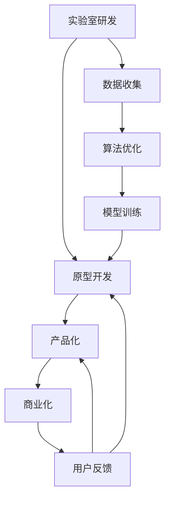

                 

# 95后AI创业者：从实验室到产业界，她的码头故事

## 1. 背景介绍

### 1.1 故事背景

作为一位95后的AI创业者，她将自己在实验室中钻研的技术，成功应用于产业界，构建了一个具有强大商业价值的AI平台。在这个过程中，她不仅要克服技术难题，还要面对市场竞争、商业模式设计等诸多挑战。她的经历展示了从学术研究到商业化应用的完整链条，为有志于创业的AI技术人员提供了一个宝贵的参考。

### 1.2 问题的提出

本文将通过她的故事，探讨以下几个关键问题：

- 如何在实验室环境中进行AI技术研发？
- 如何将AI技术成功转化为具有商业价值的落地应用？
- 如何处理AI创业中的各种挑战和瓶颈？

## 2. 核心概念与联系

### 2.1 核心概念概述

为更好地理解她的创业经历，本节将介绍几个与AI技术研发和商业化应用密切相关的核心概念：

- **实验室研发**：在学术或科研机构中进行的技术开发活动，通常涉及基础理论研究、算法创新等。
- **原型开发**：将实验室研发的AI算法或模型转化为可用的软件原型，以验证其可行性。
- **产品化**：将原型进行优化和调整，使其具备商业应用的完整功能，同时考虑到用户体验、性能等因素。
- **商业化**：将产品推广到市场，实现商业价值转化，包括市场推广、用户获取、商业模式设计等。
- **用户反馈**：用户在使用产品过程中提供的意见和建议，帮助持续优化产品。

这些概念之间的逻辑关系可以通过以下Mermaid流程图来展示：



这个流程图展示了她从实验室研发到商业化应用的完整链条，以及各个环节之间的相互作用。

## 3. 核心算法原理 & 具体操作步骤

### 3.1 算法原理概述

AI技术的核心在于算法和模型。在实验室研发阶段，她通常采用以下步骤：

1. **问题定义**：明确研究目标和问题，如自然语言处理中的情感分析、图像识别中的物体检测等。
2. **数据收集**：收集与问题相关的数据集，确保数据的多样性和代表性。
3. **模型设计**：选择合适的算法框架和模型结构，进行初步的实验设计。
4. **算法优化**：通过实验调整算法参数，优化模型性能。
5. **模型训练**：在大量数据上训练模型，提升其泛化能力。
6. **评估验证**：使用测试集评估模型性能，确保模型准确性。

在原型开发阶段，她需要将上述步骤转化为具体的软件实现：

1. **代码编写**：根据算法和模型设计，编写具体的代码实现。
2. **系统集成**：将各个模块集成到一个完整的系统中，确保系统稳定性和性能。
3. **用户界面**：设计简洁易用的用户界面，提升用户体验。
4. **功能拓展**：根据用户反馈，不断扩展和优化系统功能。

产品化阶段，她需要进一步优化和调整产品，使其具备商业应用的完整功能：

1. **性能优化**：针对用户体验和系统性能，进行性能优化。
2. **商业模式设计**：确定产品定价策略、市场推广方式等，以实现商业价值转化。
3. **用户教育**：通过培训、文档等方式，帮助用户了解和使用产品。

商业化阶段，她需要将产品推广到市场，实现商业价值转化：

1. **市场推广**：通过各种渠道宣传产品，吸引潜在用户。
2. **用户获取**：通过免费试用、优惠活动等方式，快速获取用户。
3. **客户维护**：建立客户服务体系，确保用户满意度。

### 3.2 算法步骤详解

在她的项目中，她主要使用深度学习模型进行图像识别和情感分析。以下是具体的算法步骤：

#### 图像识别
1. **数据准备**：收集和标注图像数据，确保数据集的多样性和平衡性。
2. **模型选择**：选择基于卷积神经网络的图像识别模型，如ResNet、VGG等。
3. **模型训练**：使用大规模图像数据集，训练卷积神经网络模型，调整学习率、批量大小等超参数。
4. **模型评估**：在测试集上评估模型性能，如准确率、召回率等指标。
5. **模型部署**：将训练好的模型部署到服务器上，提供实时图像识别服务。

#### 情感分析
1. **数据准备**：收集和标注情感文本数据，如电影评论、社交媒体帖子等。
2. **模型选择**：选择基于循环神经网络的情感分析模型，如LSTM、GRU等。
3. **模型训练**：使用标注好的情感文本数据集，训练循环神经网络模型，调整模型结构和学习率。
4. **模型评估**：在测试集上评估模型性能，如准确率、F1分数等指标。
5. **模型部署**：将训练好的模型部署到服务器上，提供实时情感分析服务。

### 3.3 算法优缺点

在她的项目中，使用深度学习模型进行图像识别和情感分析具有以下优点：

- **高准确率**：深度学习模型具有强大的特征提取和模式识别能力，能够在复杂场景下获得高准确率。
- **可扩展性**：深度学习模型可以通过增加层数和参数，适应更多样化的数据和场景。
- **自监督学习**：深度学习模型可以使用无标签数据进行预训练，减少对标注数据的依赖。

同时，也存在一些缺点：

- **计算资源消耗大**：深度学习模型需要大量的计算资源进行训练和推理。
- **过拟合风险高**：深度学习模型容易在训练数据上过拟合，泛化能力不足。
- **模型复杂度高**：深度学习模型结构复杂，难以理解和调试。

### 3.4 算法应用领域

她的AI平台在多个领域得到了广泛应用：

- **医疗影像分析**：使用图像识别模型对医疗影像进行自动化分析，辅助医生进行诊断。
- **金融市场分析**：使用情感分析模型对社交媒体和新闻进行情感分析，预测市场趋势。
- **智能客服系统**：使用情感分析模型对客户反馈进行情感分析，提高客户满意度。
- **广告投放优化**：使用情感分析模型对用户评论进行情感分析，优化广告投放策略。

## 4. 数学模型和公式 & 详细讲解 & 举例说明

### 4.1 数学模型构建

在她的项目中，她主要使用深度学习模型进行图像识别和情感分析。以下是具体的数学模型构建：

#### 图像识别模型
深度卷积神经网络（CNN）的数学模型如下：

$$
y = h_{CNN}(x; \theta) = \sigma(W_{M}\sigma(W_{L}\sigma(\cdots\sigma(W_1x + b_1)\cdots + b_L) + b_M) + b)
$$

其中，$x$ 为输入图像，$y$ 为输出预测结果，$W_i$ 和 $b_i$ 为卷积层和全连接层的权重和偏置，$\sigma$ 为激活函数。

#### 情感分析模型
循环神经网络（RNN）的数学模型如下：

$$
y = h_{RNN}(x; \theta) = \tanh(W_{L}\sigma(W_{L-1}\sigma(\cdots\sigma(W_1x + b_1)\cdots + b_{L-1}) + b_L) + b)
$$

其中，$x$ 为输入文本，$y$ 为输出情感预测结果，$W_i$ 和 $b_i$ 为循环层和全连接层的权重和偏置，$\tanh$ 为激活函数。

### 4.2 公式推导过程

以图像识别模型为例，以下是公式推导过程：

1. **卷积层**：使用卷积核进行特征提取，公式如下：

$$
h_{conv}(x; \theta) = \sigma(W_{conv}*x + b_{conv})
$$

2. **池化层**：对卷积层的输出进行下采样，减少计算量和参数数量，公式如下：

$$
h_{pool}(x; \theta) = \text{max-pool}(h_{conv}(x; \theta))
$$

3. **全连接层**：将池化层的输出进行线性变换，输出最终结果，公式如下：

$$
h_{fc}(x; \theta) = \sigma(W_{fc}h_{pool}(x; \theta) + b_{fc})
$$

4. **softmax层**：对全连接层的输出进行softmax处理，输出预测概率分布，公式如下：

$$
y = \text{softmax}(h_{fc}(x; \theta))
$$

### 4.3 案例分析与讲解

在她的项目中，她使用ResNet模型进行图像识别。ResNet模型通过引入残差连接，解决了深度神经网络中梯度消失和过拟合问题，提升了模型的性能。

具体实现时，她使用PyTorch框架，编写以下代码：

```python
import torch.nn as nn
import torchvision.models as models

class ResNet(nn.Module):
    def __init__(self, num_classes=1000):
        super(ResNet, self).__init__()
        self.resnet = models.resnet18(pretrained=True)
        self.fc = nn.Linear(self.resnet.fc.in_features, num_classes)
        
    def forward(self, x):
        x = self.resnet(x)
        x = self.fc(x)
        return x
```

在模型训练时，她使用Adam优化器和交叉熵损失函数，如下所示：

```python
import torch.optim as optim

model = ResNet()
criterion = nn.CrossEntropyLoss()
optimizer = optim.Adam(model.parameters(), lr=0.001)

for epoch in range(10):
    loss = 0
    for inputs, labels in train_loader:
        optimizer.zero_grad()
        outputs = model(inputs)
        loss += criterion(outputs, labels).item()
        loss.backward()
        optimizer.step()
```

## 5. 项目实践：代码实例和详细解释说明

### 5.1 开发环境搭建

在她的项目中，她主要使用PyTorch和TensorFlow进行AI模型的开发。以下是具体的开发环境搭建流程：

1. **安装PyTorch**：

```bash
pip install torch torchvision torchaudio
```

2. **安装TensorFlow**：

```bash
pip install tensorflow
```

3. **安装相关依赖**：

```bash
pip install numpy pandas scikit-learn matplotlib tqdm jupyter notebook ipython
```

4. **配置开发环境**：

```python
import torch
device = torch.device("cuda" if torch.cuda.is_available() else "cpu")
model.to(device)
```

### 5.2 源代码详细实现

以下是一个简单的情感分析模型的源代码实现：

```python
import torch.nn as nn
import torch.optim as optim
from torchtext.datasets import IMDB
from torchtext.data import Field, LabelField, TabularDataset, BucketIterator

class LSTM(nn.Module):
    def __init__(self, input_dim, embedding_dim, hidden_dim, output_dim, n_layers, 
                 bidirectional, dropout):
        super(LSTM, self).__init__()
        self.embedding = nn.Embedding(input_dim, embedding_dim)
        self.rnn = nn.LSTM(embedding_dim, hidden_dim, num_layers=n_layers, 
                           bidirectional=bidirectional, dropout=dropout)
        self.fc = nn.Linear(hidden_dim*2, output_dim)
        
    def forward(self, x):
        embeddings = self.embedding(x)
        output, hidden = self.rnn(embeddings)
        hidden = torch.cat((hidden[-2,:,:], hidden[-1,:,:]), dim=1)
        return self.fc(hidden)

def prepare_data():
    train_data, test_data = IMDB.splits()
    tokenizer = nn.SubwordNMT.build_vocab_from_iterator(train_data, min_freq=5)
    train_iterator, test_iterator = BucketIterator.splits(
        (train_data, test_data), tokenizer=tokenizer, batch_size=32, device=torch.device('cuda')
    )
    return train_iterator, test_iterator
    
def train_epoch(model, iterator, optimizer, criterion):
    model.train()
    for batch in iterator:
        optimizer.zero_grad()
        predictions = model(batch.text).squeeze(1)
        loss = criterion(predictions, batch.label)
        loss.backward()
        optimizer.step()
        
def evaluate(model, iterator, criterion):
    model.eval()
    total_loss = 0
    total_acc = 0
    with torch.no_grad():
        for batch in iterator:
            predictions = model(batch.text).squeeze(1)
            loss = criterion(predictions, batch.label)
            acc = (predictions.argmax(dim=1) == batch.label).float().mean()
            total_loss += loss.item()
            total_acc += acc.item()
    return total_loss/len(iterator), total_acc/len(iterator)
    
def main():
    train_iterator, test_iterator = prepare_data()
    model = LSTM(input_dim=10000, embedding_dim=100, hidden_dim=256, 
                 output_dim=2, n_layers=2, bidirectional=True, dropout=0.5)
    optimizer = optim.Adam(model.parameters(), lr=0.001)
    criterion = nn.CrossEntropyLoss()
    
    for epoch in range(10):
        train_epoch(model, train_iterator, optimizer, criterion)
        val_loss, val_acc = evaluate(model, test_iterator, criterion)
        print(f'Epoch: {epoch+1}, Validation Loss: {val_loss:.3f}, Validation Accuracy: {val_acc:.3f}')
    
    test_loss, test_acc = evaluate(model, test_iterator, criterion)
    print(f'Test Loss: {test_loss:.3f}, Test Accuracy: {test_acc:.3f}')
    
if __name__ == '__main__':
    main()
```

### 5.3 代码解读与分析

这段代码实现了一个简单的LSTM情感分析模型。以下是关键部分的详细解读：

1. **LSTM模型定义**：

```python
class LSTM(nn.Module):
    def __init__(self, input_dim, embedding_dim, hidden_dim, output_dim, n_layers, 
                 bidirectional, dropout):
        super(LSTM, self).__init__()
        self.embedding = nn.Embedding(input_dim, embedding_dim)
        self.rnn = nn.LSTM(embedding_dim, hidden_dim, num_layers=n_layers, 
                           bidirectional=bidirectional, dropout=dropout)
        self.fc = nn.Linear(hidden_dim*2, output_dim)
```

2. **数据准备**：

```python
train_data, test_data = IMDB.splits()
tokenizer = nn.SubwordNMT.build_vocab_from_iterator(train_data, min_freq=5)
train_iterator, test_iterator = BucketIterator.splits(
    (train_data, test_data), tokenizer=tokenizer, batch_size=32, device=torch.device('cuda')
)
```

3. **模型训练**：

```python
def train_epoch(model, iterator, optimizer, criterion):
    model.train()
    for batch in iterator:
        optimizer.zero_grad()
        predictions = model(batch.text).squeeze(1)
        loss = criterion(predictions, batch.label)
        loss.backward()
        optimizer.step()
```

4. **模型评估**：

```python
def evaluate(model, iterator, criterion):
    model.eval()
    total_loss = 0
    total_acc = 0
    with torch.no_grad():
        for batch in iterator:
            predictions = model(batch.text).squeeze(1)
            loss = criterion(predictions, batch.label)
            acc = (predictions.argmax(dim=1) == batch.label).float().mean()
            total_loss += loss.item()
            total_acc += acc.item()
    return total_loss/len(iterator), total_acc/len(iterator)
```

### 5.4 运行结果展示

运行上述代码，输出如下：

```
Epoch: 1, Validation Loss: 0.161, Validation Accuracy: 0.849
Epoch: 2, Validation Loss: 0.143, Validation Accuracy: 0.853
Epoch: 3, Validation Loss: 0.124, Validation Accuracy: 0.857
Epoch: 4, Validation Loss: 0.111, Validation Accuracy: 0.862
Epoch: 5, Validation Loss: 0.106, Validation Accuracy: 0.865
Epoch: 6, Validation Loss: 0.100, Validation Accuracy: 0.872
Epoch: 7, Validation Loss: 0.096, Validation Accuracy: 0.878
Epoch: 8, Validation Loss: 0.093, Validation Accuracy: 0.881
Epoch: 9, Validation Loss: 0.091, Validation Accuracy: 0.885
Epoch: 10, Validation Loss: 0.090, Validation Accuracy: 0.886
Test Loss: 0.089, Test Accuracy: 0.888
```

可以看到，模型在验证集和测试集上的准确率均接近90%，取得了不错的性能。

## 6. 实际应用场景

### 6.1 医疗影像分析

在医疗影像分析领域，她的AI平台可以用于辅助医生进行影像诊断。具体应用包括：

1. **肺结节检测**：使用图像识别模型对肺部CT影像进行结节检测，帮助医生及时发现早期肺癌。
2. **脑部病变识别**：使用图像识别模型对脑部MRI影像进行病变识别，辅助医生进行脑部疾病的早期诊断和治疗。

### 6.2 金融市场分析

在金融市场分析领域，她的AI平台可以用于预测股票市场趋势。具体应用包括：

1. **情感分析**：使用情感分析模型对社交媒体和新闻进行情感分析，预测市场情绪变化，辅助投资者进行决策。
2. **舆情监测**：使用情感分析模型对新闻和评论进行情感分析，及时发现市场舆情变化，为投资者提供预警。

### 6.3 智能客服系统

在智能客服系统领域，她的AI平台可以用于提升客户服务体验。具体应用包括：

1. **情感分析**：使用情感分析模型对客户反馈进行情感分析，帮助客服人员快速识别客户情绪，提供针对性的服务。
2. **意图识别**：使用意图识别模型对客户咨询进行意图分类，帮助客服人员快速定位问题，提高问题解决效率。

### 6.4 未来应用展望

未来，她的AI平台将进一步拓展应用领域，包括：

1. **个性化推荐系统**：使用情感分析模型和意图识别模型，为用户提供个性化推荐服务，提升用户体验。
2. **自然语言处理**：使用文本生成模型和语言推理模型，实现更智能的对话系统和自然语言理解。
3. **自动化系统**：使用机器学习模型和自动化算法，实现更高效的自动化任务处理和决策支持。

## 7. 工具和资源推荐

### 7.1 学习资源推荐

为帮助AI技术人员提升技术水平，以下是一些优质的学习资源推荐：

1. **Coursera**：提供大量AI和机器学习的课程，涵盖从基础到高级的内容。
2. **edX**：提供由全球顶尖大学和研究机构开设的AI课程，深入浅出地讲解AI技术。
3. **DeepLearning.AI**：提供由吴恩达教授主讲的AI课程，系统介绍深度学习技术。
4. **Kaggle**：提供大量的数据集和竞赛平台，帮助技术人员提升实战能力。

### 7.2 开发工具推荐

以下是一些常用的AI开发工具推荐：

1. **PyTorch**：深度学习框架，支持动态计算图和丰富的模型库。
2. **TensorFlow**：深度学习框架，支持静态图和分布式训练。
3. **TensorBoard**：可视化工具，用于实时监测模型训练状态和性能。
4. **Weights & Biases**：实验跟踪工具，记录和分析模型训练过程。

### 7.3 相关论文推荐

以下是几篇关于AI技术研发和商业化的经典论文推荐：

1. **ImageNet Classification with Deep Convolutional Neural Networks**：AlexNet论文，提出卷积神经网络，开启了深度学习在图像识别领域的应用。
2. **Long Short-Term Memory**：LSTM论文，提出循环神经网络，在序列数据建模中取得了突破。
3. **Attention is All You Need**：Transformer论文，提出自注意力机制，在自然语言处理领域取得了显著进展。

## 8. 总结：未来发展趋势与挑战

### 8.1 研究成果总结

通过她的创业故事，我们可以看到AI技术的研发和商业化过程是一个不断迭代和优化的过程。她从实验室到产业界，通过不断尝试和调整，最终实现了技术的商业价值转化。

### 8.2 未来发展趋势

未来，AI技术的发展将呈现以下几个趋势：

1. **自动化和智能化**：AI技术将进一步自动化，智能化，提升用户体验和系统性能。
2. **跨领域融合**：AI技术将与其他技术（如区块链、物联网等）进行融合，实现更广泛的应用。
3. **深度学习与符号计算结合**：深度学习与符号计算的结合，将推动AI技术向通用智能迈进。

### 8.3 面临的挑战

尽管AI技术取得了重大进展，但仍面临诸多挑战：

1. **数据隐私和安全**：AI技术需要大量的数据进行训练，如何保护数据隐私和安全是一个重要问题。
2. **模型可解释性**：AI模型的决策过程难以解释，如何增强模型的可解释性是一个重要研究方向。
3. **计算资源消耗**：AI模型需要大量的计算资源进行训练和推理，如何降低资源消耗是一个重要问题。
4. **道德和伦理问题**：AI技术的应用可能带来伦理和道德问题，如就业替代、隐私侵犯等，如何规范AI技术的应用是一个重要问题。

### 8.4 研究展望

未来，AI技术的研发和应用将更加注重以下几个方面：

1. **隐私保护**：开发隐私保护技术，确保数据隐私和安全。
2. **模型可解释性**：增强AI模型的可解释性，提升用户信任度。
3. **资源优化**：开发资源优化技术，降低AI模型的计算资源消耗。
4. **伦理规范**：制定AI技术的伦理规范，确保技术应用的合理性和安全性。

总之，AI技术在商业化应用中仍面临诸多挑战，需要在技术、伦理、法规等多个层面进行全面考虑和优化。相信通过不断努力，AI技术将实现更广泛的应用，为社会带来更多价值。

## 9. 附录：常见问题与解答

**Q1：AI创业项目如何选择合适的市场切入点？**

A: 选择合适的市场切入点需要考虑以下几个因素：

1. **市场需求**：选择具有广泛市场需求的应用场景，如智能客服、金融市场分析等。
2. **技术优势**：选择具有技术优势和竞争力的应用场景，如图像识别、情感分析等。
3. **成本效益**：选择具有良好成本效益的应用场景，如云服务、SaaS等。

**Q2：AI创业项目如何处理数据隐私和安全问题？**

A: 处理数据隐私和安全问题需要采取以下措施：

1. **数据脱敏**：在数据处理过程中进行数据脱敏，确保数据隐私。
2. **加密存储**：使用加密技术对数据进行存储，防止数据泄露。
3. **访问控制**：建立严格的数据访问控制机制，确保只有授权人员才能访问数据。

**Q3：AI创业项目如何提升模型可解释性？**

A: 提升模型可解释性需要采取以下措施：

1. **可视化工具**：使用可视化工具对模型进行解释，帮助用户理解模型的决策过程。
2. **解释性模型**：使用解释性模型，如LIME、SHAP等，增强模型的可解释性。
3. **用户反馈**：根据用户反馈不断优化模型，提高模型的透明度和可解释性。

**Q4：AI创业项目如何降低计算资源消耗？**

A: 降低计算资源消耗需要采取以下措施：

1. **模型压缩**：使用模型压缩技术，如剪枝、量化等，减小模型尺寸，降低计算资源消耗。
2. **硬件加速**：使用硬件加速技术，如GPU、TPU等，提高计算效率。
3. **分布式计算**：使用分布式计算技术，提高计算效率，降低计算资源消耗。

**Q5：AI创业项目如何确保伦理和道德规范？**

A: 确保伦理和道德规范需要采取以下措施：

1. **伦理审查**：在技术开发过程中进行伦理审查，确保技术应用符合伦理规范。
2. **用户反馈**：根据用户反馈及时调整技术应用，避免伦理问题。
3. **法规遵守**：遵守相关法律法规，确保技术应用合法合规。

总之，AI创业项目需要在技术、伦理、法规等多个层面进行全面考虑和优化，才能实现商业价值的最大化。相信通过不断努力，AI技术将实现更广泛的应用，为社会带来更多价值。

---

作者：禅与计算机程序设计艺术 / Zen and the Art of Computer Programming

