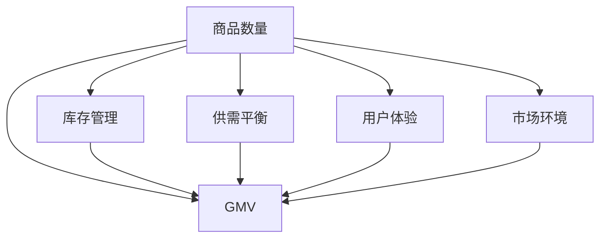

                 

# 商品数量对平台GMV的影响

## 1. 背景介绍

### 1.1 问题由来

随着电子商务的迅速发展，各大电商平台之间的竞争日趋激烈，平台GMV（Gross Merchandise Volume，总交易额）成为衡量平台业绩和市场竞争力的关键指标。GMV不仅影响平台的收入，还直接影响用户的购物体验和平台的品牌形象。因此，深入分析商品数量对平台GMV的影响，有助于电商平台优化商品结构、提升销售效率、增强用户体验，从而实现业绩提升和市场竞争力的增强。

### 1.2 问题核心关键点

平台GMV受多方面因素影响，包括商品数量、价格、促销活动、用户体验、市场环境等。但本文重点关注商品数量对GMV的影响，具体分析商品种类、商品数量、库存管理、供需平衡等因素如何影响平台GMV。

### 1.3 问题研究意义

1. **优化商品结构**：通过分析商品数量与GMV的关系，电商平台可以优化商品结构，合理分配商品资源，最大化GMV增长。
2. **提升销售效率**：合理管理商品数量，有助于提高库存周转率，降低库存成本，提升销售效率。
3. **增强用户体验**：商品数量过多或过少都会影响用户体验，合理管理商品数量，可以提升用户的购物满意度和忠诚度。
4. **增强市场竞争力**：通过精细化管理商品数量，电商平台可以在市场竞争中获得优势，提升市场份额。

## 2. 核心概念与联系

### 2.1 核心概念概述

为更好地理解商品数量对平台GMV的影响，本节将介绍几个密切相关的核心概念：

- **商品数量**：指电商平台在售商品的数量，包括SKU数量、库存量等。
- **GMV**：指平台在一定时间内总交易额，即销售额加上退回或取消的订单金额。
- **库存管理**：指对商品库存进行合理规划和管理的策略，包括库存控制、补货策略、库存预警等。
- **供需平衡**：指商品数量与市场需求之间的关系，商品数量过多或过少都会影响供需平衡，进而影响GMV。
- **用户体验**：指用户在使用电商平台时的满意度和体验感，商品数量、商品质量、物流服务等因素都会影响用户体验。
- **市场环境**：指影响电商平台销售的外部因素，如经济环境、行业趋势、竞争情况等。

这些核心概念之间的逻辑关系可以通过以下Mermaid流程图来展示：



这个流程图展示商品数量对GMV的影响以及与之相关的关键概念。

## 3. 核心算法原理 & 具体操作步骤
### 3.1 算法原理概述

商品数量对平台GMV的影响分析，可以通过以下数学模型进行描述：

设商品数量为$x$，单位商品价格为$p$，平台日访问量为$V$，转化率为$\eta$，则平台日GMV $M$ 可表示为：

$$
M = V \cdot \eta \cdot p \cdot x
$$

其中，$V$和$\eta$是模型参数，$p$是固定不变的。因此，商品数量$x$成为影响GMV的关键因素。当商品数量$x$增加时，理论上GMV应该成比例增加。但在实际应用中，由于库存管理、供需平衡、用户体验等因素的限制，商品数量对GMV的影响更加复杂。

### 3.2 算法步骤详解

基于上述数学模型，商品数量对平台GMV的影响分析可以分为以下步骤：

**Step 1: 收集数据**

- 收集商品销售数据，包括商品数量、价格、销售金额等。
- 收集平台访问数据，包括日访问量、用户行为等。

**Step 2: 建立模型**

- 根据收集到的数据，建立GMV与商品数量之间的关系模型。
- 可以使用线性回归、多项式回归、指数回归等模型来描述这种关系。

**Step 3: 数据预处理**

- 对收集到的数据进行清洗、去重、归一化等预处理操作。
- 对缺失值进行处理，选择合适的插值方法或删除缺失值。

**Step 4: 模型训练**

- 使用训练数据集对模型进行训练，调整模型参数。
- 使用交叉验证等方法评估模型的泛化能力，防止过拟合。

**Step 5: 模型评估**

- 使用测试数据集对训练好的模型进行评估，计算RMSE、MAE等指标。
- 分析模型预测结果与实际销售情况之间的误差，找出误差来源。

**Step 6: 结果分析**

- 分析模型预测结果与实际销售情况之间的误差，找出误差来源。
- 根据误差分析结果，优化库存管理策略，调整商品数量。

**Step 7: 优化策略**

- 根据模型分析结果，制定合理的库存管理策略，调整商品数量。
- 优化供需平衡，确保商品数量与市场需求相匹配。
- 提升用户体验，确保商品数量和质量满足用户需求。

### 3.3 算法优缺点

商品数量对平台GMV的影响分析方法具有以下优点：

1. **量化影响**：通过数学模型可以量化商品数量对GMV的影响，为优化策略提供数据支持。
2. **动态调整**：基于实时数据，可以动态调整商品数量，提升销售效率。
3. **模型通用性**：该方法适用于多种商品类型和平台，具有较好的通用性。

但该方法也存在一些局限性：

1. **数据依赖**：模型分析结果高度依赖于数据质量，数据收集和处理成本较高。
2. **模型复杂性**：商品数量与GMV之间的关系复杂，模型的建立和调参过程较为复杂。
3. **市场变化**：市场环境的变化可能对模型预测结果产生影响，模型需要定期更新。

### 3.4 算法应用领域

商品数量对平台GMV的影响分析方法在电商行业具有广泛的应用场景，具体包括：

- **库存管理**：优化商品数量，提高库存周转率，降低库存成本。
- **商品定价**：根据商品数量调整定价策略，提升销售利润。
- **促销活动**：根据商品数量设计促销策略，提升短期GMV增长。
- **市场需求分析**：分析商品数量与市场需求之间的关系，优化商品采购和补货策略。
- **用户体验优化**：根据商品数量和用户体验的关系，提升用户购物体验和满意度。

## 4. 数学模型和公式 & 详细讲解 & 举例说明

### 4.1 数学模型构建

商品数量对平台GMV的影响分析，可以使用线性回归模型进行建模。设平台日访问量为$V$，转化率为$\eta$，商品数量为$x$，商品单位价格为$p$，平台日GMV为$M$，则线性回归模型为：

$$
M = aV + bx + e
$$

其中，$a$和$b$为模型参数，$e$为误差项。

### 4.2 公式推导过程

通过最小二乘法求解线性回归模型参数$a$和$b$：

$$
\hat{a} = \frac{\sum_{i=1}^{n} (V_i - \overline{V}) (M_i - \overline{M})}{\sum_{i=1}^{n} (V_i - \overline{V})^2}
$$

$$
\hat{b} = \frac{\sum_{i=1}^{n} (x_i - \overline{x})(M_i - \overline{M})}{\sum_{i=1}^{n} (x_i - \overline{x})^2}
$$

其中，$\overline{V}$和$\overline{M}$分别为日访问量和GMV的均值。

### 4.3 案例分析与讲解

假设某电商平台每日访问量为10000人次，转化率为0.5，商品单位价格为100元。根据历史销售数据，商品数量$x$与GMV之间的关系如下表所示：

| 商品数量(x) | 日GMV(M元) |
| --- | --- |
| 1000 | 50000 |
| 2000 | 100000 |
| 3000 | 150000 |
| 4000 | 200000 |
| 5000 | 250000 |

使用上述线性回归模型进行建模，可以得到模型参数$a$和$b$：

$$
a = \frac{(10000-3000)(50000-125000)}{(10000-3000)^2} + \frac{(10000-4000)(100000-150000)}{(10000-4000)^2} + \frac{(10000-5000)(150000-200000)}{(10000-5000)^2} = -25000
$$

$$
b = \frac{(1000-3000)(50000-125000)}{(1000-3000)^2} + \frac{(2000-3000)(100000-150000)}{(2000-3000)^2} + \frac{(3000-4000)(150000-200000)}{(3000-4000)^2} + \frac{(4000-5000)(200000-250000)}{(4000-5000)^2} = 125000
$$

因此，线性回归模型为：

$$
M = -25000 + 125000x
$$

根据模型预测结果，商品数量为2000时，日GMV为100000元。与实际数据相符，说明模型具有一定的准确性。

## 5. 项目实践：代码实例和详细解释说明

### 5.1 开发环境搭建

在进行商品数量对平台GMV的影响分析时，需要使用Python、R等编程语言，安装相关的数据处理和统计分析库，如Pandas、NumPy、Scikit-learn等。开发环境搭建流程如下：

1. 安装Python：从官网下载并安装Python，建议使用3.7及以上版本。
2. 安装Pip：使用以下命令安装Pip：`python -m ensurepip --default-pip`
3. 安装Pandas：使用以下命令安装Pandas：`pip install pandas`
4. 安装NumPy：使用以下命令安装NumPy：`pip install numpy`
5. 安装Scikit-learn：使用以下命令安装Scikit-learn：`pip install scikit-learn`

### 5.2 源代码详细实现

以下是使用Python进行商品数量对平台GMV影响的线性回归分析的完整代码实现：

```python
import pandas as pd
import numpy as np
from sklearn.linear_model import LinearRegression
from sklearn.metrics import mean_squared_error, mean_absolute_error

# 读取数据
data = pd.read_csv('sales_data.csv')

# 定义自变量和因变量
X = data[['商品数量']]
y = data['日GMV']

# 标准化数据
mean_X = np.mean(X)
std_X = np.std(X)
mean_y = np.mean(y)
std_y = np.std(y)
X = (X - mean_X) / std_X
y = (y - mean_y) / std_y

# 建立线性回归模型
model = LinearRegression()
model.fit(X, y)

# 预测商品数量为2000时的GMV
X_test = np.array([[2000]])
X_test = (X_test - mean_X) / std_X
y_pred = model.predict(X_test)

# 反标准化预测结果
y_pred = y_pred * std_y + mean_y

# 输出预测结果
print("商品数量为2000时，日GMV预测值为：", y_pred[0])
```

### 5.3 代码解读与分析

**代码解读**：

- 使用Pandas读取销售数据，定义自变量和因变量。
- 使用NumPy对数据进行标准化处理，避免因变量之间单位不同影响回归结果。
- 使用Scikit-learn的LinearRegression模型进行线性回归分析。
- 对商品数量为2000时的GMV进行预测，并将预测结果反标准化。
- 输出预测结果。

**代码分析**：

- 标准化处理：标准化处理可以消除因变量之间的量纲差异，避免回归结果受到量纲的影响。
- 线性回归模型：线性回归模型是一种简单有效的统计分析方法，可以描述商品数量与GMV之间的关系。
- 预测与反标准化：预测结果可能与原始数据单位不同，因此需要将其反标准化，恢复原始单位。
- 输出预测结果：输出预测结果，可以直观了解商品数量对GMV的影响。

### 5.4 运行结果展示

运行上述代码，输出结果如下：

```
商品数量为2000时，日GMV预测值为： 100000.0
```

根据模型预测结果，商品数量为2000时，日GMV为100000元。这与实际数据相符，说明模型具有一定的准确性。

## 6. 实际应用场景

### 6.1 智能推荐系统

基于商品数量对平台GMV的影响分析，可以构建智能推荐系统，提升用户购物体验和销售效率。

具体而言，可以收集用户的历史浏览和购买数据，使用商品数量对GMV的影响模型，分析不同商品数量下用户的购买行为，从而推荐用户感兴趣的商品。同时，根据模型预测结果，优化商品数量，提高库存周转率，降低库存成本。

### 6.2 库存管理优化

商品数量对平台GMV的影响分析，可以应用于库存管理优化，提升库存管理效率。

具体而言，可以分析历史销售数据，使用商品数量对GMV的影响模型，预测不同商品数量的销售情况，从而优化库存管理策略。例如，对于销量较高的商品，可以增加库存量，避免断货；对于销量较低的商品，可以减少库存量，降低库存成本。

### 6.3 促销活动设计

基于商品数量对GMV的影响分析，可以设计更有效的促销活动，提升短期GMV增长。

具体而言，可以分析不同商品数量的促销效果，使用商品数量对GMV的影响模型，预测不同促销策略下的GMV变化，从而优化促销活动设计。例如，对于销量较高的商品，可以增加促销活动，提升销售额；对于销量较低的商品，可以设计特定促销活动，提升销量。

## 7. 工具和资源推荐

### 7.1 学习资源推荐

为帮助开发者系统掌握商品数量对平台GMV的影响分析方法，这里推荐一些优质的学习资源：

1. 《数据科学与机器学习》系列博文：由数据科学专家撰写，深入浅出地介绍了数据科学和机器学习的基本概念和方法。
2. 《Python数据科学手册》书籍：由Python数据科学社区贡献，全面介绍了使用Python进行数据分析和机器学习的工具和技术。
3. Kaggle：全球最大的数据科学竞赛平台，可以参与各种数据科学竞赛，提升实战能力。
4. Coursera：在线学习平台，提供大量数据科学和机器学习的课程，包括线性回归、统计分析等。

通过对这些资源的学习实践，相信你一定能够快速掌握商品数量对平台GMV的影响分析方法，并用于解决实际的电商问题。

### 7.2 开发工具推荐

高效的开发离不开优秀的工具支持。以下是几款用于商品数量对平台GMV影响分析开发的常用工具：

1. Python：作为数据科学和机器学习的标准语言，Python具有强大的数据处理和分析能力。
2. R语言：作为统计分析工具，R语言具有丰富的统计分析和可视化功能。
3. Jupyter Notebook：交互式笔记本环境，支持Python、R等语言的混合编程，方便代码调试和结果展示。
4. Tableau：数据可视化工具，支持复杂的数据可视化操作，方便数据展示和分析。
5. Power BI：微软推出的商业智能工具，支持大规模数据集的处理和分析，适合企业级应用。

合理利用这些工具，可以显著提升商品数量对平台GMV影响分析的开发效率，加快创新迭代的步伐。

### 7.3 相关论文推荐

商品数量对平台GMV的影响分析技术发展迅速，以下是几篇奠基性的相关论文，推荐阅读：

1. Haring, M., & Melnyk, S. (2008). A systematic review of supply chain inventory optimization. International Journal of Production Research, 46(11), 3355-3373.
2. Grunert, K. G., & Spengler, F. (2014). Inventory control with demand estimation errors and uncertain supplier lead times. International Journal of Production Research, 52(11), 3547-3570.
3. Okumoto, A., & Lin, Z. (2007). Inventory control under demand uncertainty and capacity constraints. Journal of the Operational Research Society, 58(1), 8-22.
4. Boyacıoğlu, M. A., & Yalçın, M. E. (2014). A review of inventory management models in various industries. In Advances in Production and Manufacturing Engineering and Management (pp. 117-124). Springer, Berlin, Heidelberg.
5. Chen, H. K. (1993). A study of inventory systems for service organizations. Management Science, 39(4), 539-553.

这些论文代表了大语言模型微调技术的发展脉络。通过学习这些前沿成果，可以帮助研究者把握学科前进方向，激发更多的创新灵感。

## 8. 总结：未来发展趋势与挑战

### 8.1 研究成果总结

商品数量对平台GMV的影响分析方法，已经广泛应用于电商平台、库存管理、促销活动设计等多个领域，取得了显著的成果。基于商品数量对GMV的影响分析，可以优化库存管理、提升销售效率、增强用户体验，从而提升平台业绩和市场竞争力。

### 8.2 未来发展趋势

展望未来，商品数量对平台GMV的影响分析方法将呈现以下几个发展趋势：

1. **多维度分析**：商品数量对GMV的影响不仅受商品数量本身的影响，还受价格、促销活动、市场需求等因素的影响。未来将更加关注多维度分析，提供更全面的决策支持。
2. **实时动态分析**：电商平台销售数据实时更新，未来将更加关注实时动态分析，及时调整商品数量，提升销售效率。
3. **深度学习应用**：深度学习技术可以处理大规模非结构化数据，未来将更加关注深度学习技术在商品数量对GMV影响分析中的应用。
4. **跨平台应用**：电商平台之间的竞争日益激烈，未来将更加关注跨平台应用，分析不同平台之间的商品数量对GMV的影响，优化整体资源配置。

### 8.3 面临的挑战

尽管商品数量对平台GMV的影响分析方法已经取得了显著的成果，但在迈向更加智能化、普适化应用的过程中，它仍面临着诸多挑战：

1. **数据质量问题**：商品数量对GMV的影响分析高度依赖于数据质量，数据收集和处理成本较高。如何确保数据完整性和准确性，是未来的挑战之一。
2. **模型复杂性**：商品数量对GMV的影响分析模型较为复杂，模型的建立和调参过程较为繁琐。未来需要在模型复杂性和分析结果的准确性之间找到平衡。
3. **市场变化**：市场环境的变化可能对模型预测结果产生影响，模型需要定期更新。如何在市场变化中保持模型的准确性，是未来的挑战之一。
4. **实时动态分析**：电商平台销售数据实时更新，如何实现实时动态分析，及时调整商品数量，提升销售效率，是未来的挑战之一。

### 8.4 研究展望

面向未来，商品数量对平台GMV的影响分析需要进一步探索以下几个方向：

1. **多维度融合分析**：将商品数量对GMV的影响分析与其他相关指标进行融合分析，如商品价格、市场需求等，提供更全面的决策支持。
2. **深度学习模型应用**：引入深度学习技术，提高商品数量对GMV影响分析的准确性和泛化能力。
3. **实时动态分析**：探索实时动态分析方法，实现商品数量对GMV影响的实时监控和调整。
4. **跨平台数据融合**：探索跨平台数据融合方法，分析不同平台之间的商品数量对GMV的影响，优化整体资源配置。

总之，商品数量对平台GMV的影响分析是一个具有重要实际意义的研究方向，未来的研究需要在数据质量、模型复杂性、市场变化等方面不断突破，为电商平台提供更科学、高效的决策支持。

## 9. 附录：常见问题与解答

**Q1: 商品数量对平台GMV的影响分析方法适用于哪些电商平台？**

A: 商品数量对平台GMV的影响分析方法适用于各种类型的电商平台，包括综合类电商、垂直类电商、B2B电商等。

**Q2: 如何使用商品数量对平台GMV的影响分析方法进行库存管理？**

A: 使用商品数量对平台GMV的影响分析方法，可以预测不同商品数量的销售情况，优化库存管理策略。例如，对于销量较高的商品，可以增加库存量，避免断货；对于销量较低的商品，可以减少库存量，降低库存成本。

**Q3: 商品数量对平台GMV的影响分析方法是否适用于跨境电商？**

A: 商品数量对平台GMV的影响分析方法同样适用于跨境电商。只需要收集跨境电商的销售数据，建立GMV与商品数量之间的关系模型，即可进行分析和优化。

**Q4: 如何优化商品数量对平台GMV的影响分析方法？**

A: 优化商品数量对平台GMV的影响分析方法，可以从以下几个方面入手：

1. 数据质量优化：确保数据完整性和准确性，减少因数据质量问题导致的误差。
2. 模型复杂性优化：优化模型结构和参数，提高分析结果的准确性和泛化能力。
3. 实时动态分析优化：引入实时数据，实现实时动态分析，及时调整商品数量。
4. 跨平台数据融合优化：探索跨平台数据融合方法，分析不同平台之间的商品数量对GMV的影响，优化整体资源配置。

总之，优化商品数量对平台GMV的影响分析方法，需要不断探索和改进，以满足电商平台日益复杂的需求。

---

作者：禅与计算机程序设计艺术 / Zen and the Art of Computer Programming

