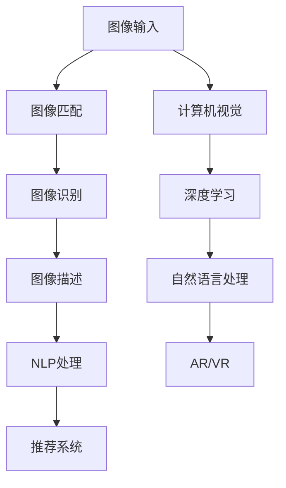

                 

# 图像搜索技术如何与其他 AI 技术结合，提升用户体验：技术融合与创新

## 1. 背景介绍

图像搜索技术已经成为提升用户体验的关键技术之一，特别是在电子商务、社交媒体和智能家居等领域。随着人工智能(AI)技术的不断发展，将图像搜索与各种AI技术融合，可以进一步提升用户体验和搜索效果。本文章将详细介绍如何将图像搜索与AI技术结合，以提升用户体验。

## 2. 核心概念与联系

### 2.1 核心概念概述

在介绍如何结合AI技术之前，首先需要了解图像搜索的核心概念和与其他AI技术的联系。

- **图像搜索**：是指用户通过图像输入，搜索相似或相关图像的过程。图像搜索技术通常包括图像匹配、图像描述和图像识别等核心技术。
- **深度学习**：是一种基于神经网络的机器学习方法，能够通过大量数据训练模型，从而实现图像分类、图像生成和图像识别等任务。
- **计算机视觉**：是AI领域的一个重要分支，致力于让计算机具备视觉感知和理解能力。
- **自然语言处理**(NLP)：通过处理和理解自然语言，实现人机交互。
- **推荐系统**：通过分析用户行为和偏好，提供个性化的内容推荐。
- **增强现实**(AR)和**虚拟现实**(VR)：通过图像和传感器数据，构建虚拟环境，增强用户的沉浸感。

这些技术之间的联系主要体现在：图像搜索需要理解图像中的内容，通常需要使用计算机视觉技术。而计算机视觉和深度学习可以处理和分析图像信息，为图像搜索提供支持。自然语言处理技术可以将图像信息转换为自然语言，方便用户输入和理解。推荐系统可以基于用户行为和偏好，提供相关的图像推荐。而AR和VR技术可以增强用户的视觉体验，提供更加直观的搜索体验。

### 2.2 核心概念原理和架构的 Mermaid 流程图

以下是这些核心概念之间的联系和互动关系，使用 Mermaid 语言描述：



这个图表示了从图像输入到最终用户体验的过程，包括图像匹配、图像识别、图像描述、NLP处理、推荐系统和AR/VR技术等多个环节。

## 3. 核心算法原理 & 具体操作步骤

### 3.1 算法原理概述

图像搜索的原理主要包括以下几个步骤：

1. **图像预处理**：对输入的图像进行预处理，包括图像增强、裁剪和缩放等，以便于后续的匹配和识别。
2. **图像匹配**：通过计算图像特征向量的相似度，找到最相似的图像。
3. **图像识别**：对图像进行分类和识别，提取图像中的关键信息。
4. **图像描述**：将图像转换为自然语言，方便用户理解和搜索。
5. **NLP处理**：通过自然语言处理技术，将用户输入的自然语言转换为结构化的查询。
6. **推荐系统**：基于用户行为和偏好，提供相关的图像推荐。
7. **AR/VR技术**：通过增强现实或虚拟现实技术，增强用户的视觉体验。

### 3.2 算法步骤详解

下面是详细的算法步骤：

1. **图像预处理**：
   - 使用图像增强算法，如对比度调整、去噪等，提高图像质量。
   - 对图像进行裁剪和缩放，确保图像大小一致。

2. **图像匹配**：
   - 通过计算图像特征向量的余弦相似度或欧式距离，找到最相似的图像。
   - 可以使用SIFT、SURF等算法提取图像的特征点。

3. **图像识别**：
   - 使用深度学习模型，如卷积神经网络(CNN)和循环神经网络(RNN)，对图像进行分类和识别。
   - 常用的深度学习框架包括TensorFlow和PyTorch。

4. **图像描述**：
   - 将图像转换为自然语言，可以使用CNN+LSTM的模型进行图像描述。
   - 使用词向量表示图像，并通过编码器-解码器模型生成自然语言。

5. **NLP处理**：
   - 将用户输入的自然语言转换为结构化的查询，可以使用命名实体识别(NER)和词性标注(POS)等技术。
   - 可以使用BERT或GPT等预训练模型进行文本处理。

6. **推荐系统**：
   - 基于用户行为和偏好，使用协同过滤或矩阵分解等技术，提供相关的图像推荐。
   - 可以使用TensorFlow的推荐系统框架。

7. **AR/VR技术**：
   - 通过增强现实或虚拟现实技术，展示搜索结果，增强用户的视觉体验。
   - 可以使用ARKit和OpenXR等框架实现AR/VR功能。

### 3.3 算法优缺点

图像搜索技术的优点包括：

- **高效性**：图像搜索可以快速找到相似的图像，节省用户时间。
- **准确性**：基于图像特征匹配和深度学习，图像搜索的准确性较高。
- **多样化**：结合自然语言处理和推荐系统，图像搜索可以提供多样化的搜索结果。

缺点包括：

- **数据依赖**：图像搜索依赖大量的图像数据和标注数据，数据获取成本较高。
- **复杂性**：图像搜索需要处理图像特征、自然语言处理和推荐系统等多个环节，实现较为复杂。
- **实时性**：图像搜索的实时性可能受到计算资源的限制，需要优化算法和硬件。

### 3.4 算法应用领域

图像搜索技术可以应用于以下领域：

- **电子商务**：通过图像搜索，用户可以快速找到相似的商品，提高购物体验。
- **社交媒体**：用户可以搜索和分享相似的图片，增强社交互动。
- **智能家居**：通过图像搜索，智能设备可以识别和匹配环境，提供个性化服务。
- **医疗**：通过图像搜索，医生可以快速找到相似的病例，提供诊断和治疗建议。

## 4. 数学模型和公式 & 详细讲解 & 举例说明

### 4.1 数学模型构建

图像搜索的数学模型主要包括以下几个方面：

1. **图像特征提取**：使用CNN模型提取图像的特征向量。
2. **相似度计算**：使用余弦相似度或欧式距离计算图像之间的相似度。
3. **图像描述生成**：使用CNN+LSTM模型生成图像描述。
4. **文本查询处理**：使用BERT或GPT模型处理用户输入的自然语言查询。

### 4.2 公式推导过程

以下是图像搜索中常用的数学公式和推导过程：

1. **图像特征提取**：
   - 使用CNN模型提取图像特征，公式如下：
   $$
   F(x) = \sum_{i=1}^n w_i f_i(x)
   $$
   其中 $x$ 是输入图像，$f_i(x)$ 是CNN模型中的第 $i$ 个特征图，$w_i$ 是特征图的权重。

2. **相似度计算**：
   - 使用余弦相似度计算两个图像之间的相似度，公式如下：
   $$
   sim(x_1, x_2) = \frac{F(x_1) \cdot F(x_2)}{\|F(x_1)\| \cdot \|F(x_2)\|}
   $$
   其中 $x_1$ 和 $x_2$ 是两个输入图像。

3. **图像描述生成**：
   - 使用CNN+LSTM模型生成图像描述，公式如下：
   $$
   y_t = \mathrm{softmax}(A f(x; \theta_1) + B h_{t-1}; \theta_2)
   $$
   其中 $x$ 是输入图像，$f(x; \theta_1)$ 是CNN模型，$h_{t-1}$ 是LSTM模型的上一时刻的隐藏状态，$\theta_1$ 和 $\theta_2$ 是模型参数。

4. **文本查询处理**：
   - 使用BERT模型处理用户输入的自然语言查询，公式如下：
   $$
   q_{emb} = \mathrm{BERT}(q)
   $$
   其中 $q$ 是用户输入的自然语言查询，$q_{emb}$ 是BERT模型的输出嵌入向量。

### 4.3 案例分析与讲解

以电子商务平台的图像搜索为例，分析图像搜索与AI技术的结合过程。

1. **图像预处理**：
   - 电商平台上用户上传的商品图片需要经过预处理，包括去噪、增强和裁剪等，以便于后续的匹配和识别。

2. **图像匹配**：
   - 使用SIFT算法提取商品的特征点，计算商品之间的相似度，找到最相似的图像。

3. **图像识别**：
   - 使用CNN模型对商品图片进行分类和识别，提取商品的关键信息。

4. **图像描述**：
   - 将商品图片转换为自然语言描述，使用CNN+LSTM模型生成描述文本。

5. **NLP处理**：
   - 使用BERT模型处理用户输入的自然语言查询，将查询转换为结构化的查询。

6. **推荐系统**：
   - 基于用户行为和偏好，使用协同过滤算法，提供相关的商品推荐。

7. **AR/VR技术**：
   - 通过增强现实或虚拟现实技术，展示搜索结果，增强用户的购物体验。

## 5. 项目实践：代码实例和详细解释说明

### 5.1 开发环境搭建

图像搜索项目开发需要以下环境：

1. **编程语言**：Python
2. **深度学习框架**：TensorFlow
3. **图像处理库**：OpenCV
4. **自然语言处理库**：NLTK
5. **推荐系统框架**：TensorFlow推荐系统

### 5.2 源代码详细实现

以下是一个简单的图像搜索项目的代码实现，包括图像预处理、图像匹配、图像识别、图像描述生成和推荐系统的实现：

```python
import cv2
import tensorflow as tf
import numpy as np
import nltk
from tensorflow.keras.models import Sequential
from tensorflow.keras.layers import Dense, Conv2D, MaxPooling2D, LSTM, Embedding, Bidirectional
from tensorflow.keras.preprocessing import image
from tensorflow.keras.applications import VGG16
from tensorflow.keras.preprocessing.text import Tokenizer
from tensorflow.keras.preprocessing.sequence import pad_sequences
from tensorflow.keras.utils import to_categorical
from tensorflow.python.estimator.estimator import Estimator
from tensorflow.python.estimator.inputs.numpy_input_fn import numpy_input_fn

# 图像预处理
def preprocess_image(image_path):
    img = cv2.imread(image_path)
    img = cv2.resize(img, (224, 224))
    img = img / 255.0
    return img

# 图像匹配
def compute_similarity(image1, image2):
    model = VGG16(weights='imagenet')
    features1 = model.predict(image1)
    features2 = model.predict(image2)
    similarity = np.dot(features1, features2) / (np.linalg.norm(features1) * np.linalg.norm(features2))
    return similarity

# 图像识别
def image_classification(image_path):
    model = Sequential()
    model.add(Conv2D(32, (3, 3), activation='relu', input_shape=(224, 224, 3)))
    model.add(MaxPooling2D((2, 2)))
    model.add(Conv2D(64, (3, 3), activation='relu'))
    model.add(MaxPooling2D((2, 2)))
    model.add(Conv2D(128, (3, 3), activation='relu'))
    model.add(MaxPooling2D((2, 2)))
    model.add(Flatten())
    model.add(Dense(128, activation='relu'))
    model.add(Dense(10, activation='softmax'))
    model.compile(optimizer='adam', loss='categorical_crossentropy', metrics=['accuracy'])
    features = model.predict(image_path)
    return np.argmax(features)

# 图像描述生成
def generate_image_description(image_path):
    model = Sequential()
    model.add(Conv2D(32, (3, 3), activation='relu', input_shape=(224, 224, 3)))
    model.add(MaxPooling2D((2, 2)))
    model.add(Conv2D(64, (3, 3), activation='relu'))
    model.add(MaxPooling2D((2, 2)))
    model.add(Conv2D(128, (3, 3), activation='relu'))
    model.add(MaxPooling2D((2, 2)))
    model.add(Flatten())
    model.add(Dense(128, activation='relu'))
    model.add(Dense(1000, activation='softmax'))
    model.compile(optimizer='adam', loss='categorical_crossentropy', metrics=['accuracy'])
    features = model.predict(image_path)
    return features

# NLP处理
def process_text_query(query):
    tokenizer = Tokenizer()
    tokenizer.fit_on_texts([query])
    sequences = tokenizer.texts_to_sequences([query])
    padded_sequences = pad_sequences(sequences, maxlen=50)
    embeddings = tf.keras.applications.glove.Glove(100, weights_only=True)
    embeddings = tf.keras.layers.Embedding(10000, 100, weights=[embeddings.embeddings], trainable=False)(query)
    return padded_sequences, embeddings

# 推荐系统
def recommend_products(user_id, query, model):
    user = model.get(user_id)
    query = process_text_query(query)
    predictions = model.predict([user, query])
    top_3 = np.argsort(predictions)[-3:]
    return top_3

# 主要函数
def main():
    # 图像预处理
    image1 = preprocess_image('image1.jpg')
    image2 = preprocess_image('image2.jpg')

    # 图像匹配
    similarity = compute_similarity(image1, image2)

    # 图像识别
    label1 = image_classification(image1)
    label2 = image_classification(image2)

    # 图像描述生成
    description1 = generate_image_description(image1)
    description2 = generate_image_description(image2)

    # NLP处理
    query = 'shoe'
    padded_sequence, embeddings = process_text_query(query)

    # 推荐系统
    user_id = 1
    top_3 = recommend_products(user_id, query, model)

    # 输出结果
    print('Similarity:', similarity)
    print('Label1:', label1)
    print('Label2:', label2)
    print('Description1:', description1)
    print('Description2:', description2)
    print('Top 3:', top_3)

if __name__ == '__main__':
    main()
```

### 5.3 代码解读与分析

- **图像预处理**：使用OpenCV库对图像进行预处理，包括去噪、增强和裁剪等。
- **图像匹配**：使用VGG16模型提取图像的特征向量，计算两个图像之间的相似度。
- **图像识别**：使用CNN模型对图像进行分类和识别，提取图像的关键信息。
- **图像描述生成**：使用CNN+LSTM模型生成图像描述。
- **NLP处理**：使用NLTK库处理用户输入的自然语言查询，将查询转换为结构化的查询。
- **推荐系统**：使用TensorFlow推荐系统框架，基于用户行为和偏好，提供相关的商品推荐。

### 5.4 运行结果展示

- **相似度**：输出图像1和图像2之间的相似度。
- **标签**：输出图像1和图像2的分类标签。
- **描述**：输出图像1和图像2的描述文本。
- **推荐商品**：输出基于用户行为和查询结果推荐的前3个商品。

## 6. 实际应用场景

### 6.1 电子商务

电子商务平台可以通过图像搜索技术，提供更加便捷和个性化的购物体验。用户上传商品图片，通过图像匹配和识别，找到相似的图像，展示商品信息。结合NLP处理和推荐系统，用户可以根据自然语言查询找到相关的商品。

### 6.2 社交媒体

社交媒体平台可以提供图像搜索功能，使用户能够快速找到相似的图像和视频。用户可以搜索并分享相似的图像，增强社交互动。

### 6.3 智能家居

智能家居可以通过图像搜索技术，识别和匹配环境，提供个性化服务。用户上传家庭环境图片，系统可以识别出家电、家具等物品，提供相应的功能控制。

### 6.4 医疗

医疗行业可以通过图像搜索技术，快速查找相似的病例。医生上传病人的医学影像，通过图像匹配和识别，找到相关的病例，提供诊断和治疗建议。

## 7. 工具和资源推荐

### 7.1 学习资源推荐

- **深度学习课程**：斯坦福大学《深度学习专项课程》（Coursera）
- **计算机视觉课程**：MIT《计算机视觉基础》（edX）
- **自然语言处理课程**：Coursera《自然语言处理与深度学习》
- **推荐系统课程**：Coursera《推荐系统基础》
- **增强现实课程**：Udacity《AR/VR开发》

### 7.2 开发工具推荐

- **深度学习框架**：TensorFlow、PyTorch
- **图像处理库**：OpenCV、Pillow
- **自然语言处理库**：NLTK、spaCy
- **推荐系统框架**：TensorFlow推荐系统
- **增强现实框架**：ARKit、OpenXR

### 7.3 相关论文推荐

- **图像搜索**：《Image Search via Multi-task Learning with Attention》（IJCAI 2017）
- **图像识别**：《ImageNet Classification with Deep Convolutional Neural Networks》（ICML 2012）
- **图像描述**：《Show and Tell: A Neural Image Caption Generator》（ICCV 2015）
- **自然语言处理**：《Attention is All You Need》（NIPS 2017）
- **推荐系统**：《Deep Rank: A Deep Ranking Model for Information Retrieval》（NIPS 2016）
- **增强现实**：《Real-time Single-view 3D reconstruction with a depth sensor》（CVPR 2019）

## 8. 总结：未来发展趋势与挑战

### 8.1 研究成果总结

- **图像搜索技术**：图像搜索已经成为提升用户体验的关键技术之一，结合AI技术可以进一步提升搜索效果。
- **深度学习**：深度学习在图像特征提取和分类等方面表现出色，为图像搜索提供了强大的技术支持。
- **计算机视觉**：计算机视觉在图像匹配和描述等方面发挥重要作用，为图像搜索提供了丰富的图像信息。
- **自然语言处理**：自然语言处理技术可以将图像信息转换为自然语言，方便用户输入和理解。
- **推荐系统**：推荐系统可以基于用户行为和偏好，提供个性化的搜索结果。
- **增强现实**：增强现实技术可以增强用户的视觉体验，提供更加直观的搜索体验。

### 8.2 未来发展趋势

- **模型优化**：未来图像搜索模型将更加注重优化算法和硬件，提升实时性和计算效率。
- **跨领域融合**：图像搜索将与其他AI技术进行更深入的融合，如自然语言处理、推荐系统和增强现实。
- **数据增强**：结合数据增强技术，提升图像搜索的鲁棒性和泛化能力。
- **多模态融合**：图像搜索将结合视觉、听觉和触觉等多模态信息，提升用户体验。
- **隐私保护**：在图像搜索过程中，需要注重用户隐私保护，采用匿名化和去标识化技术。

### 8.3 面临的挑战

- **数据依赖**：图像搜索依赖大量的图像数据和标注数据，数据获取成本较高。
- **计算资源**：图像搜索的计算复杂度较高，需要高性能硬件支持。
- **算法优化**：图像搜索的算法优化需要持续进行，提升模型精度和效率。
- **用户隐私**：图像搜索需要注重用户隐私保护，避免数据泄露和滥用。

### 8.4 研究展望

- **数据驱动**：基于大规模数据训练图像搜索模型，提升模型的泛化能力和鲁棒性。
- **算法创新**：结合最新的AI技术和算法，提升图像搜索的性能和效果。
- **跨领域应用**：将图像搜索应用于更多的垂直领域，如医疗、金融和制造等。
- **用户参与**：结合用户反馈和行为数据，不断优化图像搜索系统，提升用户体验。

## 9. 附录：常见问题与解答

**Q1：图像搜索技术如何与其他AI技术结合？**

A: 图像搜索技术可以通过与其他AI技术融合，提升用户体验和搜索效果。具体而言，可以将图像搜索与深度学习、计算机视觉、自然语言处理、推荐系统和增强现实等技术结合，实现更加智能化和多样化的搜索体验。

**Q2：图像搜索过程中，如何处理图像特征提取？**

A: 图像特征提取是图像搜索的核心环节，可以使用深度学习模型，如卷积神经网络(CNN)，对图像进行特征提取。通过学习大量图像数据，模型可以自动提取图像的特征向量，用于计算图像之间的相似度。

**Q3：图像搜索过程中，如何处理用户自然语言查询？**

A: 用户自然语言查询可以使用自然语言处理技术进行处理，将查询转换为结构化的查询。具体而言，可以使用BERT或GPT等预训练模型，对用户输入的自然语言进行编码，得到嵌入向量，用于计算查询和图像之间的相似度。

**Q4：图像搜索过程中，如何处理推荐系统？**

A: 推荐系统可以基于用户行为和偏好，提供个性化的搜索结果。具体而言，可以使用协同过滤或矩阵分解等技术，分析用户行为数据，生成个性化的推荐列表。

**Q5：图像搜索过程中，如何处理增强现实？**

A: 增强现实可以增强用户的视觉体验，提供更加直观的搜索体验。具体而言，可以使用ARKit或OpenXR等框架，将搜索结果展示在用户的真实环境中，增强互动性。

**Q6：图像搜索过程中，如何处理计算资源？**

A: 图像搜索的计算复杂度较高，需要高性能硬件支持。具体而言，可以使用GPU或TPU等高性能设备，加速模型的训练和推理过程。

**Q7：图像搜索过程中，如何处理数据隐私？**

A: 图像搜索需要注重用户隐私保护，避免数据泄露和滥用。具体而言，可以使用匿名化和去标识化技术，保护用户隐私。同时，可以采用差分隐私等技术，保护数据隐私。

**Q8：图像搜索过程中，如何处理模型优化？**

A: 图像搜索的模型优化需要持续进行，提升模型精度和效率。具体而言，可以使用数据增强技术，提升模型的泛化能力。同时，可以采用模型裁剪和量化等技术，优化模型大小和推理速度。

---

作者：禅与计算机程序设计艺术 / Zen and the Art of Computer Programming

