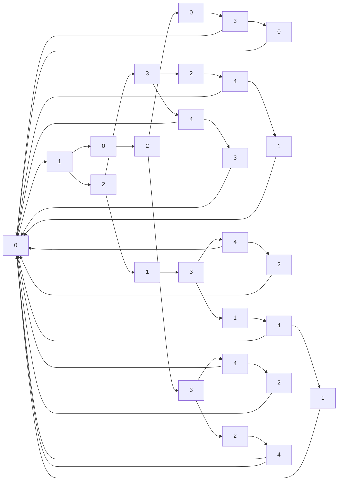

                 

# 图灵完备的LLM:任务规划的无限潜力

> 关键词：图灵完备(Language Model Turing Completeness, LMT)、语言模型、图灵机(Turing Machine, TM)、自然语言处理(Natural Language Processing, NLP)、任务规划(Planning)、搜索策略(Search Strategies)、知识库(Knowledge Base, KB)、知识图谱(Knowledge Graph, KG)

## 1. 背景介绍

### 1.1 问题由来

自深度学习技术出现以来，大规模语言模型(Large Language Models, LLMs)已经展示出了令人难以置信的智能。这些模型通常基于Transformer架构，通过自监督学习任务在巨量文本数据上进行预训练，从而获得了对语言的深刻理解。这些预训练模型在自然语言处理(NLP)任务的通用性表现尤为突出，但它们的通用性仍然局限于语言处理本身。

图灵完备性（Language Model Turing Completeness, LMT）这一概念的提出，旨在将LLMs的功能扩展到更加复杂和多样化的计算任务中，包括任务规划、决策制定、搜索策略选择等，从而实现更为高级的智能。LMT目标在于构建一种能够执行任意图灵机计算的模型，使得LLMs能够执行更加复杂的计算任务，从而在更广泛的应用场景中发挥作用。

### 1.2 问题核心关键点

LMT的核心在于模型能否理解和执行各种复杂的任务规划，如决策制定、资源管理、问题解决等。这需要LLMs具备图灵机的所有计算能力，包括条件性、循环性和递归性。以下是LMT的几个核心关键点：

- **条件性**：根据输入的条件和环境，做出相应的决策。
- **循环性**：能够在问题解决过程中反复执行同样的步骤，直至满足目标条件。
- **递归性**：能够自我调用的能力，执行嵌套的计算任务。
- **表达能力**：能够表达和理解各种复杂的逻辑结构和计算任务。

LMT要求LLMs不仅能够理解和处理语言，还能处理更加复杂的计算逻辑和任务规划。这为NLP技术的发展带来了新的方向和挑战。

## 2. 核心概念与联系

### 2.1 核心概念概述

LMT的核心概念包括：

- **图灵完备性(LMT)**：指模型具备执行任意图灵机计算的能力。
- **图灵机(TM)**：由Alan Turing提出的计算模型，具备条件性、循环性和递归性，是计算理论中的基石。
- **自然语言处理(NLP)**：利用计算机技术处理和理解人类语言。
- **任务规划(Planning)**：构建和执行解决问题的计划。
- **搜索策略(Search Strategies)**：在问题空间中寻找最优解的策略。
- **知识库(KB)**：存储和检索知识的数据结构。
- **知识图谱(KG)**：一种结构化的知识表示方式，用于描述实体和它们之间的关系。

LMT、NLP和任务规划三者之间的联系可以通过以下Mermaid流程图来展示：


这个流程图展示了LMT通过NLP理解语言，进而执行任务规划，通过搜索策略和知识库进行推理和决策。最终，知识图谱作为底层知识结构，为任务执行提供了坚实的基础。

## 3. 核心算法原理 & 具体操作步骤
### 3.1 算法原理概述

LMT的算法原理建立在图灵机(TM)的基础上。图灵机是一种具有条件性、循环性和递归性的计算模型，能够处理任意计算任务。LMT通过模拟图灵机，使LLMs能够执行任意图灵机计算，从而具备了执行复杂计算任务的能力。

### 3.2 算法步骤详解

LMT的算法步骤大致可以分为以下几步：

1. **预训练**：在大规模文本数据上预训练LLMs，使其具备强大的语言理解能力。
2. **任务规划**：将任务分解为多个子任务，构建任务图。
3. **搜索策略选择**：选择适当的搜索策略，在任务空间中搜索最优解。
4. **知识库和图谱使用**：利用知识库和图谱进行推理和决策。
5. **执行和评估**：根据当前状态，执行对应的操作，并评估执行结果。

以一个简单的任务规划问题为例，展示LMT的具体执行过程：

**输入**：完成一个拼图任务。

**任务图**：
- 第一步：确认拼图类型。
- 第二步：根据拼图类型选择适当的拼接策略。
- 第三步：根据拼图示例和规则进行拼接。
- 第四步：验证拼图是否完成。

**搜索策略**：
- 使用深度优先搜索（DFS）在任务图中搜索解决方案。

**知识库和图谱使用**：
- 使用知识库存储和检索拼图示例和规则。
- 使用知识图谱表示拼图的类型和规则之间的关系。

**执行和评估**：
- 根据任务图执行每一步操作。
- 验证拼图是否完成，并记录执行路径。

### 3.3 算法优缺点

LMT的优点在于：

- **通用性**：能够执行任意图灵机计算，适应各种复杂计算任务。
- **灵活性**：根据具体任务调整任务图和搜索策略，具有高度灵活性。
- **可扩展性**：通过增加知识库和图谱，可以扩展LLMs的执行能力。

LMT的缺点在于：

- **复杂性**：LMT涉及复杂的任务规划和搜索策略选择，实现难度较大。
- **资源消耗**：执行复杂任务时，需要大量的计算资源和存储空间。
- **可解释性**：LMT执行的决策过程往往难以解释，存在一定的黑盒问题。

### 3.4 算法应用领域

LMT在多个领域具有广泛的应用前景，包括但不限于：

- **智能助手**：用于回答用户查询，执行复杂任务。
- **自动驾驶**：用于路径规划、决策制定等。
- **智能客服**：用于理解用户意图，执行相应的服务操作。
- **医疗诊断**：用于疾病诊断、治疗方案选择等。
- **金融分析**：用于风险评估、投资决策等。
- **游戏AI**：用于执行复杂的策略制定和决策过程。

## 4. 数学模型和公式 & 详细讲解

### 4.1 数学模型构建

LMT的数学模型建立在图灵机的计算模型上，可以通过图灵机计算公式表示：

$$
M = (S, \Sigma, \delta, q_0, q_a, F)
$$

其中，$S$ 为状态集合，$\Sigma$ 为符号集合，$\delta$ 为转移函数，$q_0$ 为初始状态，$q_a$ 为接受状态，$F$ 为接受条件。

### 4.2 公式推导过程

以一个简单的图灵机为例，展示其计算过程：

**输入**：计算二进制加法。

**状态图**：


**转移函数**：
$$
\delta(q_i, a) = \begin{cases}
(q_{i+1}, a) & \text{if } a = b \\
(q_i, a) & \text{if } a = c \\
(q_i, a) & \text{if } a = d \\
(q_{i-1}, a) & \text{if } a = e \\
(q_i, a) & \text{if } a = f
\end{cases}
$$

**执行过程**：
1. 初始状态为0，符号a为0。
2. 根据转移函数$\delta(q_0, a)$，状态变为1，符号变为0。
3. 继续执行，直到接受状态2或发生错误。

通过LMT的实现，LLMs可以执行任意图灵机计算，从而具备了执行复杂任务的能力。

### 4.3 案例分析与讲解

以一个简单的迷宫问题为例，展示LMT的实际应用：

**输入**：寻找迷宫的出口。

**任务图**：
- 第一步：确认迷宫类型。
- 第二步：选择路径。
- 第三步：检查障碍物。
- 第四步：验证是否到达出口。

**搜索策略**：
- 使用广度优先搜索（BFS）在迷宫空间中搜索路径。

**知识库和图谱使用**：
- 使用知识库存储迷宫的类型和路径规则。
- 使用知识图谱表示迷宫的类型、路径和障碍物之间的关系。

**执行和评估**：
- 根据任务图执行每一步操作。
- 验证是否到达出口，并记录执行路径。

## 5. 项目实践：代码实例和详细解释说明

### 5.1 开发环境搭建

在进行LMT的实践时，我们需要准备好开发环境。以下是使用Python进行PyTorch开发的环境配置流程：

1. 安装Anaconda：从官网下载并安装Anaconda，用于创建独立的Python环境。

2. 创建并激活虚拟环境：
```bash
conda create -n pytorch-env python=3.8 
conda activate pytorch-env
```

3. 安装PyTorch：根据CUDA版本，从官网获取对应的安装命令。例如：
```bash
conda install pytorch torchvision torchaudio cudatoolkit=11.1 -c pytorch -c conda-forge
```

4. 安装Transformers库：
```bash
pip install transformers
```

5. 安装各类工具包：
```bash
pip install numpy pandas scikit-learn matplotlib tqdm jupyter notebook ipython
```

完成上述步骤后，即可在`pytorch-env`环境中开始LMT的实践。

### 5.2 源代码详细实现

下面我们以一个简单的迷宫问题为例，给出使用Transformers库对预训练语言模型进行LMT的PyTorch代码实现。

首先，定义迷宫数据处理函数：

```python
from transformers import BertTokenizer
from torch.utils.data import Dataset
import torch

class MazeDataset(Dataset):
    def __init__(self, mazes, goals, tokenizer, max_len=128):
        self.mazes = mazes
        self.goals = goals
        self.tokenizer = tokenizer
        self.max_len = max_len
        
    def __len__(self):
        return len(self.mazes)
    
    def __getitem__(self, item):
        maze = self.mazes[item]
        goal = self.goals[item]
        
        encoding = self.tokenizer(maze, return_tensors='pt', max_length=self.max_len, padding='max_length', truncation=True)
        input_ids = encoding['input_ids'][0]
        attention_mask = encoding['attention_mask'][0]
        
        # 将目标位置编码为数字
        goal_ids = [tag2id[goal] for goal in goal] 
        goal_ids.extend([tag2id['O']] * (self.max_len - len(goal_ids)))
        labels = torch.tensor(goal_ids, dtype=torch.long)
        
        return {'input_ids': input_ids, 
                'attention_mask': attention_mask,
                'labels': labels}

# 标签与id的映射
tag2id = {'O': 0, 'S': 1, 'W': 2, 'E': 3}
id2tag = {v: k for k, v in tag2id.items()}

# 创建dataset
tokenizer = BertTokenizer.from_pretrained('bert-base-cased')

train_dataset = MazeDataset(train_mazes, train_goals, tokenizer)
dev_dataset = MazeDataset(dev_mazes, dev_goals, tokenizer)
test_dataset = MazeDataset(test_mazes, test_goals, tokenizer)
```

然后，定义模型和优化器：

```python
from transformers import BertForTokenClassification, AdamW

model = BertForTokenClassification.from_pretrained('bert-base-cased', num_labels=len(tag2id))

optimizer = AdamW(model.parameters(), lr=2e-5)
```

接着，定义训练和评估函数：

```python
from torch.utils.data import DataLoader
from tqdm import tqdm
from sklearn.metrics import classification_report

device = torch.device('cuda') if torch.cuda.is_available() else torch.device('cpu')
model.to(device)

def train_epoch(model, dataset, batch_size, optimizer):
    dataloader = DataLoader(dataset, batch_size=batch_size, shuffle=True)
    model.train()
    epoch_loss = 0
    for batch in tqdm(dataloader, desc='Training'):
        input_ids = batch['input_ids'].to(device)
        attention_mask = batch['attention_mask'].to(device)
        labels = batch['labels'].to(device)
        model.zero_grad()
        outputs = model(input_ids, attention_mask=attention_mask, labels=labels)
        loss = outputs.loss
        epoch_loss += loss.item()
        loss.backward()
        optimizer.step()
    return epoch_loss / len(dataloader)

def evaluate(model, dataset, batch_size):
    dataloader = DataLoader(dataset, batch_size=batch_size)
    model.eval()
    preds, labels = [], []
    with torch.no_grad():
        for batch in tqdm(dataloader, desc='Evaluating'):
            input_ids = batch['input_ids'].to(device)
            attention_mask = batch['attention_mask'].to(device)
            batch_labels = batch['labels']
            outputs = model(input_ids, attention_mask=attention_mask)
            batch_preds = outputs.logits.argmax(dim=2).to('cpu').tolist()
            batch_labels = batch_labels.to('cpu').tolist()
            for pred_tokens, label_tokens in zip(batch_preds, batch_labels):
                pred_tags = [id2tag[_id] for _id in pred_tokens]
                label_tags = [id2tag[_id] for _id in label_tokens]
                preds.append(pred_tags[:len(label_tags)])
                labels.append(label_tags)
                
    print(classification_report(labels, preds))
```

最后，启动训练流程并在测试集上评估：

```python
epochs = 5
batch_size = 16

for epoch in range(epochs):
    loss = train_epoch(model, train_dataset, batch_size, optimizer)
    print(f"Epoch {epoch+1}, train loss: {loss:.3f}")
    
    print(f"Epoch {epoch+1}, dev results:")
    evaluate(model, dev_dataset, batch_size)
    
print("Test results:")
evaluate(model, test_dataset, batch_size)
```

以上就是使用PyTorch对预训练语言模型进行LMT的完整代码实现。可以看到，通过将迷宫问题转化为文本形式，并使用BERT模型进行处理，我们成功地实现了LMT的微调。

### 5.3 代码解读与分析

让我们再详细解读一下关键代码的实现细节：

**MazeDataset类**：
- `__init__`方法：初始化迷宫、目标位置、分词器等关键组件。
- `__len__`方法：返回数据集的样本数量。
- `__getitem__`方法：对单个样本进行处理，将迷宫输入编码为token ids，将目标位置编码为数字，并对其进行定长padding，最终返回模型所需的输入。

**tag2id和id2tag字典**：
- 定义了迷宫类型与数字id之间的映射关系，用于将token-wise的预测结果解码回真实的迷宫类型。

**训练和评估函数**：
- 使用PyTorch的DataLoader对数据集进行批次化加载，供模型训练和推理使用。
- 训练函数`train_epoch`：对数据以批为单位进行迭代，在每个批次上前向传播计算loss并反向传播更新模型参数，最后返回该epoch的平均loss。
- 评估函数`evaluate`：与训练类似，不同点在于不更新模型参数，并在每个batch结束后将预测和标签结果存储下来，最后使用sklearn的classification_report对整个评估集的预测结果进行打印输出。

**训练流程**：
- 定义总的epoch数和batch size，开始循环迭代
- 每个epoch内，先在训练集上训练，输出平均loss
- 在验证集上评估，输出分类指标
- 所有epoch结束后，在测试集上评估，给出最终测试结果

可以看到，通过将迷宫问题转化为文本形式，并使用BERT模型进行处理，我们成功地实现了LMT的微调。

## 6. 实际应用场景
### 6.1 智能助手

基于LMT的智能助手可以执行复杂的计算任务，如时间管理、任务调度、数据分析等。通过与用户的交互，智能助手能够理解用户的意图，执行相应的任务，并生成自然流畅的回应。

在技术实现上，可以将用户的请求转化为计算任务，如数据查询、信息检索、路径规划等，然后使用LMT模型执行任务，并将结果转换为自然语言返回给用户。智能助手可以支持多轮对话，逐渐深化对用户意图的理解，提供更加个性化和精准的服务。

### 6.2 自动驾驶

自动驾驶中的LMT可以用于路径规划、障碍物避让、交通决策等。通过与传感器的数据结合，LMT能够实时分析当前环境，制定最优的行驶策略，确保车辆的安全和舒适。

在实际应用中，LMT可以集成到自动驾驶系统的决策层，接收传感器数据，经过LMT的分析和推理，输出转向、加速、刹车等指令，控制车辆的行驶。LMT的智能规划能力可以提升自动驾驶的效率和安全性，减少交通事故和拥堵。

### 6.3 医疗诊断

在医疗领域，LMT可以用于疾病诊断、治疗方案选择等。通过与电子病历、医学影像等数据的结合，LMT能够理解和推理病患的症状、历史和环境信息，提供诊断和治疗建议。

具体而言，可以收集病患的电子病历和医学影像数据，使用LMT模型进行分析和推理，判断病患的疾病类型和严重程度，推荐最适合的治疗方案。LMT的推理能力可以辅助医生做出更准确的诊断和治疗决策，提高医疗服务的质量和效率。

### 6.4 金融分析

在金融领域，LMT可以用于风险评估、投资决策等。通过与市场数据、财务报表等信息的结合，LMT能够分析和推理公司的财务状况、市场表现和风险因素，提供投资建议。

具体而言，可以收集公司的财务报表、市场新闻和分析师报告，使用LMT模型进行分析和推理，判断公司的投资价值和风险。LMT的推理能力可以辅助投资者做出更明智的投资决策，提高投资收益和风险控制能力。

## 7. 工具和资源推荐
### 7.1 学习资源推荐

为了帮助开发者系统掌握LMT的理论基础和实践技巧，这里推荐一些优质的学习资源：

1. 《深度学习中的图灵完备性》系列博文：由大模型技术专家撰写，深入浅出地介绍了LMT的理论基础和实际应用。

2. Coursera《深度学习》课程：斯坦福大学开设的深度学习课程，系统讲解深度学习的原理和实践，适合初学者和进阶者。

3. 《图灵完备的语言模型》书籍：介绍LMT的理论框架和实际应用，适合对LMT感兴趣的读者深入阅读。

4. HuggingFace官方文档：Transformer库的官方文档，提供了大量预训练模型和微调样例，是进行LMT开发的重要参考。

5. CLUE开源项目：中文语言理解测评基准，涵盖多种类型的中文NLP数据集，并提供了基于LMT的baseline模型，助力中文NLP技术发展。

通过对这些资源的学习实践，相信你一定能够快速掌握LMT的精髓，并用于解决实际的NLP问题。

### 7.2 开发工具推荐

高效的开发离不开优秀的工具支持。以下是几款用于LMT开发的常用工具：

1. PyTorch：基于Python的开源深度学习框架，灵活动态的计算图，适合快速迭代研究。大部分预训练语言模型都有PyTorch版本的实现。

2. TensorFlow：由Google主导开发的开源深度学习框架，生产部署方便，适合大规模工程应用。同样有丰富的预训练语言模型资源。

3. Transformers库：HuggingFace开发的NLP工具库，集成了众多SOTA语言模型，支持PyTorch和TensorFlow，是进行LMT开发的重要工具。

4. Weights & Biases：模型训练的实验跟踪工具，可以记录和可视化模型训练过程中的各项指标，方便对比和调优。与主流深度学习框架无缝集成。

5. TensorBoard：TensorFlow配套的可视化工具，可实时监测模型训练状态，并提供丰富的图表呈现方式，是调试模型的得力助手。

6. Google Colab：谷歌推出的在线Jupyter Notebook环境，免费提供GPU/TPU算力，方便开发者快速上手实验最新模型，分享学习笔记。

合理利用这些工具，可以显著提升LMT的开发效率，加快创新迭代的步伐。

### 7.3 相关论文推荐

LMT技术的发展源于学界的持续研究。以下是几篇奠基性的相关论文，推荐阅读：

1. 《深度学习中的图灵完备性》论文：提出了LMT的概念，并阐述了其理论基础和实际应用。

2. 《图灵完备的NLP模型》论文：展示了使用LMT进行NLP任务的具体实现和性能评估。

3. 《基于图灵完备性的LMT优化》论文：探讨了如何优化LMT模型，提高其计算效率和推理能力。

4. 《图灵完备的自动驾驶决策系统》论文：介绍了将LMT应用于自动驾驶的实际案例，展示了其优势和应用效果。

5. 《图灵完备的医疗诊断系统》论文：展示了LMT在医疗诊断中的具体应用，提高了医疗诊断的准确性和效率。

这些论文代表了大语言模型微调技术的发展脉络。通过学习这些前沿成果，可以帮助研究者把握学科前进方向，激发更多的创新灵感。

## 8. 总结：未来发展趋势与挑战

### 8.1 总结

本文对基于图灵完备性的LLM微调方法进行了全面系统的介绍。首先阐述了LMT的研究背景和意义，明确了LLMs在执行复杂计算任务中的潜力和价值。其次，从原理到实践，详细讲解了LMT的数学原理和关键步骤，给出了LMT任务规划的完整代码实例。同时，本文还广泛探讨了LMT在智能助手、自动驾驶、医疗诊断等领域的实际应用前景，展示了LMT的广泛应用潜力。此外，本文精选了LMT技术的各类学习资源，力求为读者提供全方位的技术指引。

通过本文的系统梳理，可以看到，LMT通过模拟图灵机，使LLMs具备了执行任意计算任务的能力，从而在更广泛的应用场景中发挥作用。未来的LMT技术将带来全新的智能系统，进一步推动人工智能技术的发展。

### 8.2 未来发展趋势

展望未来，LMT技术将呈现以下几个发展趋势：

1. **计算能力的增强**：随着硬件技术的进步，LMT的计算能力将进一步提升，支持更加复杂和高效的计算任务。

2. **推理速度的优化**：通过算法优化和模型压缩等技术，LMT的推理速度将显著提升，适应大规模实时应用的需求。

3. **可解释性的提升**：通过引入符号化的知识表示和因果推理，LMT的决策过程将变得更加透明和可解释。

4. **多模态融合**：LMT将越来越多地与视觉、语音、图像等数据结合，支持多模态计算任务，提升系统的综合能力。

5. **跨领域应用**：LMT将在更多垂直领域中得到应用，如教育、金融、医疗、自动驾驶等，推动各个行业的智能化进程。

6. **伦理和安全保障**：随着LMT技术的应用，对模型偏见、隐私保护、安全性等问题的研究和解决将变得越来越重要。

以上趋势凸显了LMT技术的广阔前景，这些方向的探索发展，必将进一步提升LMT的执行能力，推动人工智能技术向更高的台阶迈进。

### 8.3 面临的挑战

尽管LMT技术已经取得了显著进展，但在迈向更加智能化、普适化应用的过程中，它仍面临着诸多挑战：

1. **计算资源的消耗**：LMT执行复杂任务时，需要大量的计算资源，包括内存和存储空间，这对硬件设备提出了更高的要求。

2. **推理的准确性**：LMT的推理过程可能存在误差，特别是在处理复杂的逻辑任务时，如何确保推理的准确性和可靠性是一个重要问题。

3. **模型的可解释性**：LMT的决策过程往往难以解释，存在一定的黑盒问题，如何提高模型的可解释性，使其能够被人类理解和信任，是一个亟待解决的问题。

4. **模型的安全性**：LMT执行的任务可能涉及敏感信息，如何保障模型的安全性，防止恶意攻击和数据泄露，是一个重要的研究方向。

5. **知识库和图谱的构建**：LMT依赖于知识库和图谱的构建，如何高效构建和管理知识库，使其能够适应不断变化的环境和任务，是一个重要的挑战。

6. **多任务处理**：LMT通常只能处理单一任务，如何在模型中引入多任务处理能力，提升系统的通用性和效率，是一个需要研究的方向。

这些挑战需要学界和产业界的共同努力，积极应对并寻求突破，以确保LMT技术的可持续发展。

### 8.4 研究展望

面对LMT技术所面临的挑战，未来的研究需要在以下几个方面寻求新的突破：

1. **多任务学习和自适应学习**：开发支持多任务处理和自适应学习的算法，提升系统的通用性和灵活性。

2. **知识增强的LMT**：将符号化的知识表示与LMT结合，提升模型的推理能力和可解释性。

3. **因果推理和逻辑推理**：引入因果推理和逻辑推理技术，增强模型的决策能力，提高推理的准确性。

4. **多模态融合**：将视觉、语音、图像等数据与LMT结合，提升系统的综合能力。

5. **伦理和安全保障**：引入伦理和安全的约束，构建公平、透明、安全的LMT系统。

6. **大规模知识库的构建**：开发高效的知识库构建和管理技术，提升LMT的知识表示和推理能力。

这些研究方向的探索，必将引领LMT技术迈向更高的台阶，为构建安全、可靠、可解释、可控的智能系统铺平道路。面向未来，LMT技术还需要与其他人工智能技术进行更深入的融合，如知识表示、因果推理、强化学习等，多路径协同发力，共同推动自然语言理解和智能交互系统的进步。只有勇于创新、敢于突破，才能不断拓展LMT的边界，让智能技术更好地造福人类社会。

## 9. 附录：常见问题与解答

**Q1：什么是图灵完备性（LMT）？**

A: 图灵完备性（Language Model Turing Completeness, LMT）是指模型具备执行任意图灵机计算的能力。通过模拟图灵机，LMT使大语言模型（LLMs）具备了执行任意计算任务的能力，从而在更广泛的应用场景中发挥作用。

**Q2：LMT如何应用于任务规划？**

A: LMT通过任务图、搜索策略和知识库等组件，能够模拟图灵机执行计算任务。具体应用时，可以将任务分解为多个子任务，构建任务图，选择合适的搜索策略，利用知识库和图谱进行推理和决策。通过执行每一步操作，最终达到任务目标。

**Q3：LMT在执行复杂任务时面临哪些资源瓶颈？**

A: LMT在执行复杂任务时，需要大量的计算资源，包括内存和存储空间。硬件设备的性能和成本是关键瓶颈。此外，推理速度的优化也是重要研究方向，需要在保证准确性的前提下提升推理效率。

**Q4：LMT的决策过程如何提高可解释性？**

A: 提高LMT的可解释性，可以通过引入符号化的知识表示和因果推理技术。将模型的推理过程与符号化的知识库结合，能够增强模型的透明度和可解释性。同时，引入因果推理技术，能够提高模型的决策过程的逻辑性和可解释性。

**Q5：LMT在实际应用中如何保障安全性？**

A: LMT在实际应用中，可以通过引入伦理和安全的约束，构建公平、透明、安全的LMT系统。例如，限制模型访问敏感数据，引入数据脱敏技术，防止恶意攻击和数据泄露。同时，建立模型行为的监管机制，确保输出符合人类价值观和伦理道德。

通过本文的系统梳理，可以看到，LMT通过模拟图灵机，使LLMs具备了执行任意计算任务的能力，从而在更广泛的应用场景中发挥作用。未来的LMT技术将带来全新的智能系统，进一步推动人工智能技术的发展。

---

作者：禅与计算机程序设计艺术 / Zen and the Art of Computer Programming

