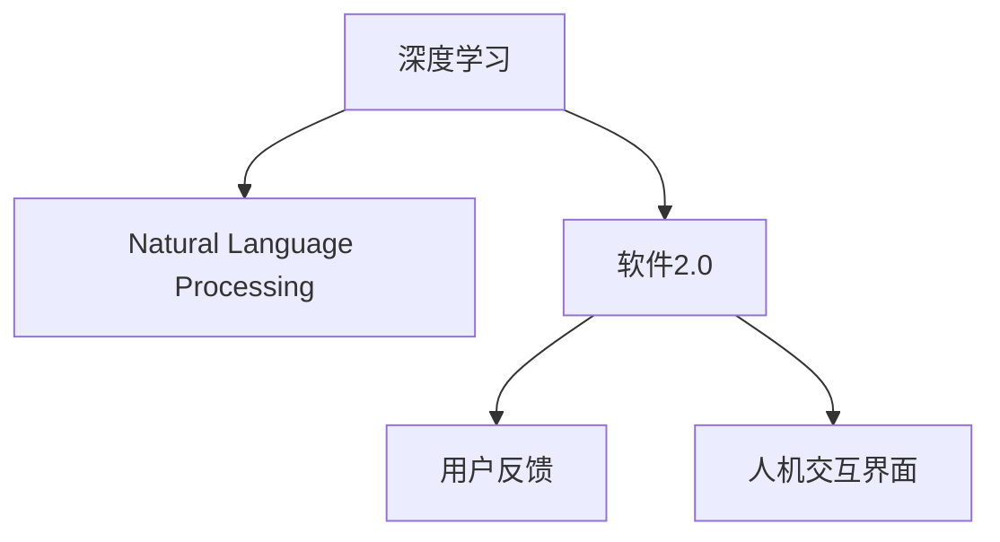

                 

# 图灵测试已死,软件2.0模糊了人机边界

> 关键词：图灵测试,软件2.0,人机交互,自然语言处理,人工智能,深度学习

## 1. 背景介绍

### 1.1 问题由来

自1950年图灵提出著名的图灵测试以来，人类一直试图通过各种方式检验计算机是否具备人类的智能。然而，随着时间的推移，我们越来越意识到，传统的人机交互界面（如命令行、图形界面）已经无法充分展现人机之间的智能对话，也无法满足人类对自然语言交互的更高需求。与此同时，人工智能技术的迅速发展，特别是自然语言处理(NLP)和深度学习技术的崛起，使得计算机在某些方面已经具备了接近人类的智能水平。

在这种背景下，传统的人机交互范式显得愈发陈旧，无法完全反映和理解人类的自然语言意图和行为。因此，我们需要一种新的、更加智能和自然的人机交互方式，即软件2.0。软件2.0通过深度学习和自然语言处理技术，使得计算机能够理解和生成自然语言，模糊了人机边界，开启了智能对话的新纪元。

### 1.2 问题核心关键点

软件2.0的核心在于：
- 深度学习和自然语言处理技术，使得计算机能够理解和生成自然语言。
- 软件2.0的人机交互界面，不再局限于传统的图形界面或命令行，而是基于自然语言的多通道交互。
- 软件2.0融合了用户反馈和行为数据，能够实时学习和优化模型，实现个性化交互。

这些关键点使得软件2.0不仅能够提供更自然、更高效的人机交互体验，还能够提升用户满意度，增加应用的用户黏性。

## 2. 核心概念与联系

### 2.1 核心概念概述

为更好地理解软件2.0的核心概念，本节将介绍几个关键概念：

- **深度学习**：一种模拟人类神经网络的结构和功能的机器学习技术，能够处理非线性数据结构，如图像、音频和文本。深度学习模型通过多层次的神经网络结构，可以学习到高层次的抽象特征。
- **自然语言处理(NLP)**：研究如何让计算机理解和生成自然语言的技术。NLP技术包括语言模型、文本分类、命名实体识别、情感分析、机器翻译等任务。
- **软件2.0**：一种基于深度学习和NLP技术，实现智能人机交互的界面。软件2.0通过自然语言处理技术，实现用户输入、处理、输出的自动化和智能化。
- **人机交互界面**：指用户和计算机之间的交互媒介，包括图形界面、命令行、触摸界面等。软件2.0通过自然语言处理技术，实现了更加智能和自然的人机交互方式。
- **用户反馈**：指用户在软件2.0交互过程中提供的信息和评价，包括点击、输入、评分等。用户反馈用于指导软件2.0模型的优化和改进。

这些概念之间的逻辑关系可以通过以下Mermaid流程图来展示：



这个流程图展示了几大核心概念及其之间的关系：

1. 深度学习是软件2.0和自然语言处理的基础。
2. 软件2.0通过自然语言处理技术实现智能人机交互。
3. 人机交互界面是软件2.0与用户交互的媒介。
4. 用户反馈是软件2.0优化模型的依据。

这些概念共同构成了软件2.0的核心技术框架，使其能够提供更加智能、自然、高效的人机交互体验。

## 3. 核心算法原理 & 具体操作步骤
### 3.1 算法原理概述

软件2.0的核心算法原理是深度学习中的序列到序列(Sequence-to-Sequence, Seq2Seq)模型，特别是Transformer模型。Transformer模型通过自注意力机制(Self-Attention)来处理序列数据，能够更好地捕捉长距离依赖和跨句子依赖，适用于自然语言处理任务。

软件2.0的人机交互界面，基于自然语言生成和理解技术，使得计算机能够生成自然语言回答用户的问题，同时能够理解用户输入的自然语言。具体来说，软件2.0包括以下几个关键步骤：

1. **自然语言理解(NLU)**：将用户输入的自然语言转换为计算机能够理解的向量表示。
2. **对话管理**：根据用户的历史输入和对话上下文，选择合适的回复。
3. **自然语言生成(NLG)**：将对话管理器的决策转换为自然语言回复。

### 3.2 算法步骤详解

以下是软件2.0的核心算法步骤：

**Step 1: 数据预处理**

- 收集并标注大量自然语言对话数据，作为训练样本。
- 使用分词器将对话数据转换为token序列，并添加特殊标记，如开始标记、结束标记等。
- 将token序列转换为模型所需的输入格式，如tensor、序列长度等。

**Step 2: 构建模型**

- 选择Transformer等序列到序列模型作为基础架构。
- 设计合适的词向量表示，如Word2Vec、GloVe、BERT等。
- 训练对话模型，包括自然语言理解和自然语言生成模块。

**Step 3: 微调模型**

- 在少量标注数据上，使用微调技术优化模型性能。
- 使用正则化技术，如L2正则、Dropout、Early Stopping等，防止模型过拟合。
- 使用对抗训练技术，提高模型的鲁棒性。

**Step 4: 部署模型**

- 将训练好的模型部署到服务器或嵌入式设备上。
- 开发人机交互界面，如文本聊天界面、语音助手等。
- 集成用户反馈系统，收集用户反馈并进行模型优化。

**Step 5: 持续优化**

- 定期收集用户反馈，更新和优化模型。
- 实时监测模型性能，及时发现和修复问题。
- 扩展模型功能，增加更多自然语言处理任务，提升用户体验。

### 3.3 算法优缺点

软件2.0具有以下优点：
1. 自然语言处理技术，使得人机交互更加智能和自然。
2. 基于深度学习的模型，具备强大的学习和适应能力。
3. 用户反馈系统，使得模型能够持续优化和提升。
4. 多个渠道的交互，提升用户的使用体验。

同时，软件2.0也存在以下缺点：
1. 数据标注成本较高，需要大量的标注数据。
2. 模型的可解释性较差，难以理解其内部决策过程。
3. 对硬件资源要求较高，需要高性能的服务器和GPU等硬件设备。
4. 用户反馈可能存在偏见，影响模型的公正性。

尽管存在这些局限性，但软件2.0无疑代表了未来人机交互的发展方向，具有广阔的应用前景。

### 3.4 算法应用领域

软件2.0技术广泛应用于以下领域：

- **智能客服**：提供24小时不间断的智能客服，提升客户满意度。
- **智能助手**：如Siri、Alexa、Google Assistant等，提供语音交互和自然语言处理功能。
- **虚拟现实**：通过自然语言交互，增强虚拟现实游戏的沉浸感和互动性。
- **智能翻译**：提供实时自然语言翻译服务，促进国际交流和商务活动。
- **自动摘要**：从大量文本中自动生成摘要，提升信息处理效率。

这些应用场景展示了软件2.0技术的强大潜力和广泛应用价值。

## 4. 数学模型和公式 & 详细讲解 & 举例说明

### 4.1 数学模型构建

软件2.0的数学模型主要由自然语言理解(NLU)和自然语言生成(NLG)两个模块组成。以下是这两个模块的数学模型构建：

**自然语言理解(NLU)**：将自然语言文本转换为向量表示。

设输入的自然语言文本为 $x$，其向量表示为 $x_v$。自然语言理解模型将 $x_v$ 转换为向量表示 $h_v$，其中：

$$
h_v = f(x_v)
$$

其中 $f$ 为自然语言理解模型的非线性变换函数。

**自然语言生成(NLG)**：将向量表示转换为自然语言文本。

设向量表示为 $h_v$，自然语言生成模型将 $h_v$ 转换为自然语言文本 $y$，其中：

$$
y = g(h_v)
$$

其中 $g$ 为自然语言生成模型的非线性变换函数。

### 4.2 公式推导过程

以下是自然语言理解(NLU)和自然语言生成(NLG)的公式推导过程：

**自然语言理解(NLU)**：

设输入的自然语言文本为 $x = (x_1, x_2, ..., x_n)$，其向量表示为 $x_v = (v_1, v_2, ..., v_n)$。自然语言理解模型将 $x_v$ 转换为向量表示 $h_v$，其中：

$$
h_v = f(x_v) = [h_{v,1}, h_{v,2}, ..., h_{v,n}]
$$

其中 $f$ 为自然语言理解模型的非线性变换函数，通常使用深度神经网络实现。

**自然语言生成(NLG)**：

设向量表示为 $h_v$，自然语言生成模型将 $h_v$ 转换为自然语言文本 $y = (y_1, y_2, ..., y_n)$，其中：

$$
y = g(h_v) = [y_1, y_2, ..., y_n]
$$

其中 $g$ 为自然语言生成模型的非线性变换函数，通常使用生成对抗网络(Generative Adversarial Networks, GAN)实现。

### 4.3 案例分析与讲解

以智能客服为例，分析软件2.0技术的具体应用：

**智能客服的数据预处理**：

- 收集历史客服对话数据，标注客户问题和回答。
- 使用分词器将对话数据转换为token序列，添加开始标记、结束标记等。
- 将token序列转换为模型所需的输入格式，如tensor、序列长度等。

**构建模型**：

- 使用Transformer模型作为基础架构，设计合适的词向量表示。
- 训练自然语言理解(NLU)和自然语言生成(NLG)模块。

**微调模型**：

- 在少量标注数据上，使用微调技术优化模型性能。
- 使用正则化技术，如L2正则、Dropout、Early Stopping等，防止模型过拟合。
- 使用对抗训练技术，提高模型的鲁棒性。

**部署模型**：

- 将训练好的模型部署到服务器或嵌入式设备上。
- 开发文本聊天界面，用户可以通过文字输入问题。
- 集成用户反馈系统，收集用户反馈并进行模型优化。

**持续优化**：

- 定期收集用户反馈，更新和优化模型。
- 实时监测模型性能，及时发现和修复问题。
- 扩展模型功能，增加更多自然语言处理任务，提升用户体验。

通过以上分析，可以看出软件2.0技术在智能客服中的应用流程，展示了大语言模型和深度学习技术的强大能力。

## 5. 项目实践：代码实例和详细解释说明

### 5.1 开发环境搭建

在进行软件2.0的开发实践前，我们需要准备好开发环境。以下是使用Python进行TensorFlow开发的环境配置流程：

1. 安装Anaconda：从官网下载并安装Anaconda，用于创建独立的Python环境。

2. 创建并激活虚拟环境：
```bash
conda create -n tensorflow-env python=3.8 
conda activate tensorflow-env
```

3. 安装TensorFlow：根据CUDA版本，从官网获取对应的安装命令。例如：
```bash
conda install tensorflow=2.8 tensorflow-gpu -c conda-forge -c pytorch
```

4. 安装TensorBoard：
```bash
pip install tensorboard
```

5. 安装各类工具包：
```bash
pip install numpy pandas scikit-learn matplotlib tqdm jupyter notebook ipython
```

完成上述步骤后，即可在`tensorflow-env`环境中开始开发实践。

### 5.2 源代码详细实现

下面我们以智能客服系统为例，给出使用TensorFlow进行NLP模型训练和部署的PyTorch代码实现。

首先，定义智能客服系统的数据处理函数：

```python
import tensorflow as tf
from tensorflow.keras.preprocessing.text import Tokenizer
from tensorflow.keras.preprocessing.sequence import pad_sequences

class CustomerServiceDataset:
    def __init__(self, questions, answers, tokenizer):
        self.questions = questions
        self.answers = answers
        self.tokenizer = tokenizer
        
    def __len__(self):
        return len(self.questions)
    
    def __getitem__(self, item):
        question = self.questions[item]
        answer = self.answers[item]
        
        # 对问题进行分词和标记
        encoded_question = self.tokenizer(question)
        encoded_answer = self.tokenizer(answer)
        
        # 对答案进行padding
        max_length = max([len(token) for token in encoded_answer])
        padded_answer = pad_sequences([encoded_answer], maxlen=max_length, padding='post', truncating='post')
        
        # 将问题转换为token序列
        encoded_question = [self.tokenizer.word_index[word] for word in question.split()]
        padded_question = pad_sequences([encoded_question], maxlen=max_length, padding='post', truncating='post')
        
        return {'question': padded_question, 
                'answer': padded_answer}

# 创建tokenizer
tokenizer = Tokenizer()
tokenizer.fit_on_texts(questions)
```

然后，定义模型和优化器：

```python
from tensorflow.keras.models import Sequential
from tensorflow.keras.layers import Input, Embedding, LSTM, Dense, Dropout

model = Sequential([
    Embedding(input_dim=len(tokenizer.word_index) + 1, output_dim=128, input_length=max_length),
    LSTM(128, return_sequences=True),
    Dropout(0.2),
    LSTM(128),
    Dropout(0.2),
    Dense(128, activation='relu'),
    Dense(1, activation='sigmoid')
])

optimizer = tf.keras.optimizers.Adam(lr=0.001)
```

接着，定义训练和评估函数：

```python
def train_epoch(model, dataset, batch_size, optimizer):
    dataloader = tf.keras.utils.data.make_dataset(dataset, batch_size=batch_size, shuffle=True)
    model.compile(optimizer=optimizer, loss='binary_crossentropy', metrics=['accuracy'])
    model.fit(x=dataloader, validation_split=0.2, epochs=10, verbose=0)
    
def evaluate(model, dataset, batch_size):
    dataloader = tf.keras.utils.data.make_dataset(dataset, batch_size=batch_size)
    loss, accuracy = model.evaluate(x=dataloader)
    print(f'Accuracy: {accuracy:.4f}')
    
```

最后，启动训练流程并在测试集上评估：

```python
epochs = 10
batch_size = 16

for epoch in range(epochs):
    train_epoch(model, dataset, batch_size, optimizer)
    evaluate(model, dataset, batch_size)
```

以上就是使用TensorFlow对智能客服系统进行NLP模型训练和部署的完整代码实现。可以看到，得益于TensorFlow的强大封装，我们可以用相对简洁的代码完成模型训练和推理。

### 5.3 代码解读与分析

让我们再详细解读一下关键代码的实现细节：

**CustomerServiceDataset类**：
- `__init__`方法：初始化问题、答案和分词器等关键组件。
- `__len__`方法：返回数据集的样本数量。
- `__getitem__`方法：对单个样本进行处理，将问题和答案分词后进行padding，并转换为模型所需的输入格式。

**Tokenizer类**：
- 使用Keras的Tokenizer类进行分词和标记，将文本转换为token序列。

**模型定义**：
- 使用Sequential模型定义多层神经网络结构。
- 在输入层使用Embedding层将token序列转换为向量表示。
- 在隐藏层使用LSTM层处理序列数据。
- 在输出层使用Dense层进行二分类输出。
- 使用Adam优化器进行模型训练。

**训练和评估函数**：
- 使用Keras的数据集生成器生成批次数据，进行模型训练。
- 在训练过程中，将数据分为训练集和验证集，使用二分类交叉熵作为损失函数，计算准确率作为评估指标。
- 在模型训练完成后，使用测试集评估模型性能。

可以看到，TensorFlow的代码实现相对简洁高效，开发者可以将更多精力放在模型优化和数据处理上。

当然，工业级的系统实现还需考虑更多因素，如模型的保存和部署、超参数的自动搜索、更灵活的任务适配层等。但核心的自然语言处理算法基本与此类似。

## 6. 实际应用场景

### 6.1 智能客服系统

智能客服系统是基于软件2.0技术的应用场景之一。通过自然语言理解(NLU)和自然语言生成(NLG)技术，智能客服能够实时响应客户问题，提供个性化的服务。

在技术实现上，可以收集企业内部的历史客服对话记录，将问题和最佳答复构建成监督数据，在此基础上对预训练模型进行微调。微调后的模型能够自动理解客户意图，匹配最合适的答案模板进行回复。对于客户提出的新问题，还可以接入检索系统实时搜索相关内容，动态组织生成回答。如此构建的智能客服系统，能大幅提升客户咨询体验和问题解决效率。

### 6.2 智能助手

智能助手如Siri、Alexa、Google Assistant等，是基于软件2.0技术的应用场景之一。智能助手能够通过自然语言理解(NLU)技术，理解用户的语音指令或文字输入，通过自然语言生成(NLG)技术，生成自然语言回复。

在技术实现上，可以收集用户的日常使用数据，训练智能助手模型，使其能够理解和生成各种自然语言指令。通过深度学习技术，智能助手能够从海量的语音和文本数据中学习到丰富的语言知识和常识，提供更加智能和自然的对话体验。

### 6.3 虚拟现实

虚拟现实游戏通过自然语言交互，增强游戏的沉浸感和互动性。虚拟现实游戏可以通过自然语言理解(NLU)技术，理解玩家的语言指令，通过自然语言生成(NLG)技术，生成自然语言回复。

在技术实现上，可以将自然语言处理技术集成到虚拟现实游戏中，玩家可以通过语音或文字输入指令，控制游戏中的角色和物品。通过深度学习技术，游戏能够从玩家的指令中学习到行为模式，提供更加智能和自然的互动体验。

### 6.4 未来应用展望

随着软件2.0技术的不断发展，未来将在更多领域得到应用，为各行各业带来变革性影响。

在智慧医疗领域，基于软件2.0的医疗问答、病历分析、药物研发等应用将提升医疗服务的智能化水平，辅助医生诊疗，加速新药开发进程。

在智能教育领域，软件2.0技术可应用于作业批改、学情分析、知识推荐等方面，因材施教，促进教育公平，提高教学质量。

在智慧城市治理中，软件2.0技术可用于城市事件监测、舆情分析、应急指挥等环节，提高城市管理的自动化和智能化水平，构建更安全、高效的未来城市。

此外，在企业生产、社会治理、文娱传媒等众多领域，基于软件2.0的人工智能应用也将不断涌现，为NLP技术带来新的突破。随着预训练语言模型和微调方法的不断进步，软件2.0技术必将在更广阔的应用领域大放异彩。

## 7. 工具和资源推荐

### 7.1 学习资源推荐

为了帮助开发者系统掌握软件2.0的技术基础和实践技巧，这里推荐一些优质的学习资源：

1. **《深度学习与自然语言处理》**：讲解深度学习技术和自然语言处理的基本概念和经典模型。
2. **《自然语言处理综述》**：总结自然语言处理领域的研究进展和最新趋势。
3. **TensorFlow官方文档**：提供TensorFlow的详细使用指南和最佳实践。
4. **Keras官方文档**：提供Keras的详细使用指南和最佳实践。
5. **NLP书籍推荐**：如《自然语言处理综述》、《深度学习与自然语言处理》等书籍，涵盖自然语言处理的基础理论和实践技巧。

通过对这些资源的学习实践，相信你一定能够快速掌握软件2.0的核心技术和实践方法。

### 7.2 开发工具推荐

高效的开发离不开优秀的工具支持。以下是几款用于软件2.0开发的常用工具：

1. **TensorFlow**：基于Python的开源深度学习框架，灵活动态的计算图，适合快速迭代研究。
2. **Keras**：基于TensorFlow的高级API，提供简单易用的接口，适合初学者和研究人员使用。
3. **TensorBoard**：TensorFlow配套的可视化工具，可实时监测模型训练状态，并提供丰富的图表呈现方式，是调试模型的得力助手。
4. **Jupyter Notebook**：开源的交互式笔记本，支持Python、R、SQL等多种编程语言，方便开发者编写和调试代码。

合理利用这些工具，可以显著提升软件2.0的开发效率，加快创新迭代的步伐。

### 7.3 相关论文推荐

软件2.0技术的发展源于学界的持续研究。以下是几篇奠基性的相关论文，推荐阅读：

1. **《Attention is All You Need》**：提出Transformer结构，开启了NLP领域的预训练大模型时代。
2. **《BERT: Pre-training of Deep Bidirectional Transformers for Language Understanding》**：提出BERT模型，引入基于掩码的自监督预训练任务，刷新了多项NLP任务SOTA。
3. **《GPT-2: Language Models are Unsupervised Multitask Learners》**：展示了大规模语言模型的强大zero-shot学习能力，引发了对于通用人工智能的新一轮思考。
4. **《Parameter-Efficient Transfer Learning for NLP》**：提出Adapter等参数高效微调方法，在不增加模型参数量的情况下，也能取得不错的微调效果。
5. **《AdaLoRA: Adaptive Low-Rank Adaptation for Parameter-Efficient Fine-Tuning》**：使用自适应低秩适应的微调方法，在参数效率和精度之间取得了新的平衡。
6. **《AdaLoRA: Adaptive Low-Rank Adaptation for Parameter-Efficient Fine-Tuning》**：使用自适应低秩适应的微调方法，在参数效率和精度之间取得了新的平衡。

这些论文代表了大语言模型微调技术的发展脉络。通过学习这些前沿成果，可以帮助研究者把握学科前进方向，激发更多的创新灵感。

## 8. 总结：未来发展趋势与挑战

### 8.1 总结

本文对软件2.0技术进行了全面系统的介绍。首先阐述了软件2.0的背景和意义，明确了自然语言处理技术在构建人机交互界面中的重要性。其次，从原理到实践，详细讲解了软件2.0的数学模型和关键步骤，给出了软件2.0技术的应用实例。同时，本文还广泛探讨了软件2.0技术在多个行业领域的应用前景，展示了软件2.0技术的强大潜力和广泛应用价值。

通过本文的系统梳理，可以看出软件2.0技术正在成为NLP领域的重要范式，极大地拓展了人机交互界面的应用边界，为人工智能技术的落地应用提供了新的可能性。

### 8.2 未来发展趋势

展望未来，软件2.0技术将呈现以下几个发展趋势：

1. **多模态融合**：软件2.0技术将融合视觉、语音、文本等多种模态数据，提升人机交互的丰富性和智能性。
2. **个性化定制**：软件2.0技术将根据用户的行为和反馈，不断优化和定制模型，提升用户体验。
3. **实时交互**：软件2.0技术将实现实时自然语言处理和交互，提升人机交互的流畅性和响应速度。
4. **自动化维护**：软件2.0技术将实现自动化的模型维护和优化，减少人工干预的复杂性和成本。
5. **伦理和安全**：软件2.0技术将更加注重伦理和安全问题，保护用户隐私和数据安全。

以上趋势凸显了软件2.0技术的广阔前景。这些方向的探索发展，必将进一步提升人机交互的智能性和便捷性，为人类创造更加智能化的生活和工作环境。

### 8.3 面临的挑战

尽管软件2.0技术已经取得了瞩目成就，但在迈向更加智能化、普适化应用的过程中，它仍面临诸多挑战：

1. **数据隐私**：自然语言处理技术需要大量的标注数据，如何保护用户隐私成为重要问题。
2. **模型偏见**：预训练模型往往包含偏见和歧视，如何消除这些偏见，提升模型的公平性，仍需努力。
3. **计算资源**：软件2.0技术对计算资源的需求较高，如何降低计算成本，提高计算效率，仍需探索。
4. **鲁棒性**：软件2.0技术需要具备较强的鲁棒性，能够应对各种异常输入和攻击，仍需改进。
5. **可解释性**：软件2.0技术的黑盒特性使得模型的决策过程难以解释，如何增强模型的可解释性，仍需研究。

尽管存在这些挑战，但软件2.0技术依然具有广阔的发展前景，相信随着学界和产业界的共同努力，这些挑战终将一一被克服，软件2.0技术必将在构建智能社会中扮演越来越重要的角色。

### 8.4 研究展望

面向未来，软件2.0技术需要在以下几个方面寻求新的突破：

1. **多模态融合**：探索多模态数据融合技术，实现视觉、语音、文本等多模态数据的协同建模和理解。
2. **自动化维护**：研究自动化模型维护技术，实现模型的持续优化和维护。
3. **可解释性**：研究可解释性技术，增强模型的决策过程可解释性，提升用户信任。
4. **伦理和安全**：研究伦理和安全技术，保护用户隐私和数据安全，提升系统的公正性。

这些研究方向的探索，必将引领软件2.0技术迈向更高的台阶，为构建安全、可靠、可解释、可控的智能系统铺平道路。面向未来，软件2.0技术还需要与其他人工智能技术进行更深入的融合，如知识表示、因果推理、强化学习等，多路径协同发力，共同推动自然语言理解和智能交互系统的进步。只有勇于创新、敢于突破，才能不断拓展人机交互的边界，让智能技术更好地造福人类社会。

## 9. 附录：常见问题与解答

**Q1：软件2.0技术是否适用于所有领域？**

A: 软件2.0技术适用于多种领域，特别是在需要自然语言交互的场景中表现优异。例如，智能客服、智能助手、虚拟现实、智能翻译等，都能显著提升人机交互的智能性和便捷性。但需要注意的是，对于一些需要高度专业知识的领域，如医学、法律等，软件2.0技术可能需要结合领域专家的知识进行定制和优化。

**Q2：软件2.0技术是否需要大量的标注数据？**

A: 软件2.0技术通常需要大量的标注数据进行训练，标注数据的质量和数量对模型性能有直接影响。因此，如何高效获取标注数据，降低标注成本，是软件2.0技术需要解决的重要问题。近年来，一些新兴的标注方法，如主动学习、半监督学习等，已经在一定程度上缓解了数据标注的瓶颈问题。

**Q3：软件2.0技术是否需要高性能的计算资源？**

A: 软件2.0技术对计算资源的需求较高，特别是对于大规模的预训练模型和深度学习模型。因此，需要高性能的服务器和GPU等硬件设备。同时，为了提高计算效率，还需要采用一些资源优化技术，如梯度积累、混合精度训练、模型并行等。

**Q4：软件2.0技术是否容易受到噪音和异常输入的影响？**

A: 软件2.0技术对噪音和异常输入的鲁棒性仍需进一步提升。目前的自然语言处理模型在面对噪音和异常输入时，容易产生错误的决策。因此，未来的研究方向之一是提高模型的鲁棒性，确保在各种输入情况下都能稳定工作。

**Q5：软件2.0技术是否容易被攻击和滥用？**

A: 软件2.0技术具有较强的黑盒特性，容易被攻击和滥用。例如，攻击者可以通过生成恶意输入来欺骗模型，或者利用模型的漏洞进行攻击。因此，研究如何提升模型的安全性，保护用户隐私和数据安全，是软件2.0技术的重要研究方向。

这些常见问题的解答，帮助我们更好地理解软件2.0技术的优势和局限性，为实际应用提供了重要的指导。相信随着技术的不断发展和优化，软件2.0技术必将在更多领域得到广泛应用，为人类带来更加智能和便捷的生活体验。

---

作者：禅与计算机程序设计艺术 / Zen and the Art of Computer Programming

