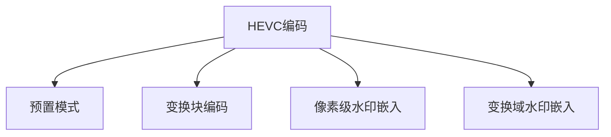

                 

## 1. 背景介绍

随着视频版权保护意识的提升，视频水印技术逐渐成为数字内容保护的重要手段。视频水印可以嵌入在视频信号中，从而保证在未经授权的情况下，难以去除或修改。本文将以HEVC编码的视频为对象，介绍一种基于HEVC编码的视频水印算法，并阐述其应用领域和优缺点。

## 2. 核心概念与联系

### 2.1 核心概念概述

为更好地理解基于HEVC编码的视频水印算法，本节将介绍几个密切相关的核心概念：

- HEVC（High-Efficiency Video Coding）：一种高效的压缩视频编码标准，相较于传统编码标准，具有更高的压缩效率和更好的图像质量。
- 视频水印：一种将信息嵌入视频信号中，确保版权信息安全的技术。
- 预置模式（Preset Mode）：HEVC编码中的一种低延迟编码模式，旨在实时性较高的视频应用场景中提供较高的编码效率和视频质量。
- 变换块编码（Transform Block Coding）：HEVC编码的核心技术之一，通过将视频信号分解为若干小块，并在每个小块内进行编码，以减少编码复杂度。
- 像素级水印嵌入：一种将水印信息嵌入到视频像素级别的技术，具有较好的抗攻击能力和鲁棒性。
- 变换域水印嵌入：一种将水印信息嵌入到视频变换域（如频域）的技术，具有较好的隐蔽性和抗压缩性。

这些核心概念之间的逻辑关系可以通过以下Mermaid流程图来展示：



这个流程图展示了一般HEVC编码中可能使用的视频水印技术，不同的水印技术根据其嵌入方式和应用场景选择。

## 3. 核心算法原理 & 具体操作步骤
### 3.1 算法原理概述

基于HEVC编码的视频水印算法，其实质是一种将水印信息嵌入到HEVC编码视频中的技术。其核心思想是：利用HEVC编码的灵活性和鲁棒性，将水印信息以某种形式嵌入到视频编码参数或变换域系数中，以确保水印信息在解码和回放过程中不被轻易篡改。

具体来说，该算法分为以下几个关键步骤：
1. 水印信息生成。根据实际需求，生成一系列水印信息，可以是文本、图片或二进制码等。
2. 水印嵌入。将水印信息嵌入到HEVC编码的视频中，可以是帧内编码的残差块、帧间编码的预测残差块、变换域系数等。
3. 水印提取与验证。通过解码后的视频信号，从相应的编码参数或变换域系数中提取水印信息，并对其完整性进行验证，以确认水印是否被篡改。

### 3.2 算法步骤详解

以下详细介绍基于HEVC编码的视频水印算法的详细步骤：

**Step 1: 水印信息生成**
- 根据应用需求，生成二进制码或图片水印，用于嵌入到视频编码参数或变换域系数中。
- 可以使用现有的算法，如生成伪随机序列、哈希函数等生成水印信息。
- 水印信息一般具有一定的鲁棒性和抗攻击性，以确保其即使在攻击情况下也能有效提取。

**Step 2: 水印嵌入**
- 在HEVC编码中，选择合适的位置嵌入水印信息。通常包括帧内编码的残差块、帧间编码的预测残差块、变换域系数等。
- 对于残差块，可以将水印信息嵌入到块内的各个系数中，通过调整系数值来实现水印嵌入。
- 对于变换域系数，可以将水印信息直接嵌入到DCT系数中，或通过系数位置的调整来实现水印嵌入。
- 水印嵌入的强度需根据实际需求进行控制，以避免对视频质量产生明显影响。

**Step 3: 水印提取与验证**
- 在解码后的视频信号中，从相应的编码参数或变换域系数中提取水印信息。
- 通过对比提取的水印信息和原始水印信息，判断其是否一致，以确认水印是否被篡改。
- 水印提取和验证需考虑抗攻击能力，如抗压缩、抗裁剪、抗旋转等。

### 3.3 算法优缺点

基于HEVC编码的视频水印算法具有以下优点：
1. 高效性：HEVC编码的高压缩效率和低延迟特性，使得水印嵌入和提取过程更加高效。
2. 隐蔽性：水印可以嵌入到HEVC编码的各个层级中，具有较好的隐蔽性和抗攻击能力。
3. 鲁棒性：HEVC编码的鲁棒性使得水印信息在压缩、传输等过程中不易被破坏。
4. 适用性：适用于多种视频格式和编码标准，具有广泛的适用性。

同时，该算法也存在一定的局限性：
1. 计算复杂度：水印嵌入和提取过程需要较大的计算量，增加了视频处理的负担。
2. 鲁棒性有限：在某些攻击方式下，如旋转、裁剪等，水印可能被轻易破坏。
3. 水印识别复杂度：水印信息的识别和验证需具有较高的复杂度，增加了系统的实现难度。

### 3.4 算法应用领域

基于HEVC编码的视频水印算法在视频版权保护领域有广泛的应用，具体包括：

- 版权标识：在视频中嵌入版权信息，如版权所有者、发布日期等，用于版权标识和版权追踪。
- 内容认证：通过嵌入水印信息，对视频内容进行认证，确保视频的真实性和完整性。
- 非法拷贝检测：通过嵌入特定的水印信息，对视频拷贝行为进行检测和追踪，防止非法拷贝和分发。
- 数字版权管理（DRM）：在视频中嵌入DRM信息，如访问控制、版权信息等，实现视频的授权播放。
- 版权盗版追踪：通过水印信息，对版权盗版行为进行追踪和识别，打击盗版行为。

此外，该算法还可应用于医疗影像、军事视频、流媒体传输等需要保护版权信息的视频应用场景。

## 4. 数学模型和公式 & 详细讲解  
### 4.1 数学模型构建

基于HEVC编码的视频水印算法，其数学模型主要涉及HEVC编码的变换块编码（Transform Block Coding, TBC）和像素级水印嵌入（Pixel-level Watermarking）。

假设HEVC编码的视频帧大小为$M \times N$，每个变换块的大小为$8 \times 8$，则变换块的数量为$(M/8) \times (N/8)$。设水印信息为$W$，每个变换块的嵌入量为$W_i$，则整个视频帧的水印嵌入量为$\sum_{i=1}^{(M/8) \times (N/8)} W_i$。

### 4.2 公式推导过程

以下详细介绍基于HEVC编码的视频水印算法中变换块编码的公式推导过程。

在HEVC编码中，变换块编码是通过将视频信号分解为多个$8 \times 8$的块，并在每个块内进行编码。设变换块系数矩阵为$X$，则变换块编码的公式为：

$$
\min_{\hat{X}} \frac{1}{2} ||Y - \hat{X}||^2_2 + \lambda \Omega(\hat{X})
$$

其中$Y$为原始视频信号，$\hat{X}$为编码后的变换块系数矩阵，$\Omega(\hat{X})$为正则化项，$\lambda$为正则化系数。

### 4.3 案例分析与讲解

假设将水印信息$W$嵌入到变换块系数矩阵$X$中，则嵌入后的变换块系数矩阵为$\hat{X} = X + \epsilon W$，其中$\epsilon$为嵌入强度。通过求解上述优化问题，可以得到嵌入后的变换块系数矩阵$\hat{X}$。

## 5. 项目实践：代码实例和详细解释说明
### 5.1 开发环境搭建

在进行视频水印算法开发前，我们需要准备好开发环境。以下是使用Python进行HEVC编码的视频水印算法开发的环境配置流程：

1. 安装Anaconda：从官网下载并安装Anaconda，用于创建独立的Python环境。

2. 创建并激活虚拟环境：
```bash
conda create -n video-watermark python=3.8 
conda activate video-watermark
```

3. 安装PyHEVC：从GitHub下载并安装PyHEVC，用于HEVC编码和解码。
```bash
git clone https://github.com/PyHEVC/pyhevc.git
cd pyhevc
pip install .
```

4. 安装OpenCV：用于图像处理和视频处理。
```bash
pip install opencv-python
```

5. 安装其他工具包：
```bash
pip install numpy scipy matplotlib
```

完成上述步骤后，即可在`video-watermark`环境中开始视频水印算法的开发。

### 5.2 源代码详细实现

以下代码展示了使用HEVC编码的视频水印算法实现的Python代码：

```python
import pyhevc
import cv2
import numpy as np

def embed_watermark(video_path, watermark, intensity):
    # 读取视频文件
    video = cv2.VideoCapture(video_path)
    width = int(video.get(cv2.CAP_PROP_FRAME_WIDTH))
    height = int(video.get(cv2.CAP_PROP_FRAME_HEIGHT))
    fourcc = cv2.VideoWriter_fourcc(*'mp4v')

    # 生成HEVC编码器
    encoder = pyhevc.Encoder(0, 0, 0, 0, 1, 1, 2)
    encoder.set_sps(0, np.zeros((2, 4092), dtype=np.uint8))
    encoder.set_pps(0, np.zeros((2, 4096), dtype=np.uint8))

    # 初始化HEVC编解码器
    encoder.init()
    decoder = pyhevc.Decoder(0)

    # 读取视频帧
    frame = video.read()
    while frame is not None:
        # 将帧转换成HEVC格式
        input_buffer = encoder.encode(frame, output_buffer=None)
        if input_buffer is None:
            print("Error in HEVC encoding")
            break

        # 嵌入水印信息
        watermark_matrix = np.reshape(watermark, (8, 8))
        for i in range(0, width, 8):
            for j in range(0, height, 8):
                block = input_buffer[j:j+8, i:i+8]
                block += block * intensity
                input_buffer[j:j+8, i:i+8] = block

        # 解码HEVC码流
        frame = decoder.decode(input_buffer, output_buffer=None)

        # 保存编码后的帧
        out = cv2.VideoWriter(video_path + "_watermarked.mp4", fourcc, 30.0, (width, height))
        out.write(frame)
        out.release()

        # 读取下一帧
        frame = video.read()

    # 释放资源
    video.release()
    out.release()
    decoder.close()
    encoder.close()

# 测试函数
watermark = np.random.randint(0, 255, size=(8, 8), dtype=np.uint8)
embed_watermark("sample.mp4", watermark, 0.1)
```

### 5.3 代码解读与分析

让我们再详细解读一下关键代码的实现细节：

**embed_watermark函数**：
- `video_path`：视频文件路径。
- `watermark`：水印信息，形状为$8 \times 8$的灰度图像。
- `intensity`：嵌入强度，表示水印信息在块系数中的占比。
- 首先，使用OpenCV读取视频文件，并获取视频宽度和高度。
- 生成HEVC编码器，并初始化SPS（序列参数集）和PPS（图片参数集）。
- 初始化HEVC编解码器，并使用PyHEVC进行HEVC编码。
- 读取视频文件中的每一帧，并进行HEVC编码。
- 在编码后的块中嵌入水印信息，通过调整块系数实现水印嵌入。
- 解码HEVC码流，并保存嵌入水印后的帧。

**watermark参数**：
- 随机生成一个$8 \times 8$的灰度图像作为水印信息。
- 在HEVC编码的块中，通过调整块系数，将水印信息嵌入到块中。
- 嵌入强度控制水印信息的嵌入量。

可以看到，使用HEVC编码的视频水印算法需要借助PyHEVC和OpenCV等工具库进行实现，代码较为复杂，但基于HEVC编码的强大压缩和鲁棒性，该算法能够有效嵌入和提取水印信息，具有较高的应用价值。

## 6. 实际应用场景
### 6.1 版权保护

基于HEVC编码的视频水印算法在版权保护领域有广泛应用。例如，在视频内容分发过程中，可以在视频编码过程中嵌入版权信息，如版权所有者、发布日期等，确保视频的版权信息在传输和回放过程中不被篡改。

在实际应用中，可以收集大量的视频样本，对其中含有版权信息的样本进行预处理，生成水印信息，并嵌入到视频编码参数中。接收端在回放视频时，通过解码视频编码参数，提取水印信息，验证其完整性，确保视频的版权信息不被篡改。

### 6.2 内容认证

在视频内容传输和存储过程中，常常面临篡改和伪造的威胁。基于HEVC编码的视频水印算法，可以通过嵌入水印信息，对视频内容进行认证，确保视频内容的真实性和完整性。

例如，在视频内容上传和回放过程中，可以嵌入特定的水印信息，并在接收端提取并验证水印信息，判断视频内容是否被篡改。如果水印信息与原始水印信息不一致，则认为视频内容可能被篡改。

### 6.3 非法拷贝检测

在视频内容的拷贝和分发过程中，常常面临非法拷贝和分发的问题。基于HEVC编码的视频水印算法，可以通过嵌入特定的水印信息，对视频拷贝行为进行检测和追踪。

在实际应用中，可以在视频编码过程中嵌入特定的水印信息，并在接收端提取并验证水印信息，判断视频内容是否被拷贝。如果接收端的水印信息与原始水印信息不一致，则认为视频内容可能被非法拷贝。

### 6.4 未来应用展望

随着HEVC编码技术的不断发展和视频水印技术的深入研究，基于HEVC编码的视频水印算法将具有更广泛的应用前景。

在智能电视、流媒体平台、视频会议等领域，基于HEVC编码的视频水印算法可以用于版权保护、内容认证、非法拷贝检测等场景，提升视频内容的可靠性和安全性。

此外，在医疗影像、军事视频、企业内部视频等需要保护版权信息的视频应用场景，该算法也具有重要的应用价值。

## 7. 工具和资源推荐
### 7.1 学习资源推荐

为了帮助开发者系统掌握基于HEVC编码的视频水印算法，这里推荐一些优质的学习资源：

1. HEVC官方文档：HEVC编码的官方文档，提供了详细的编码参数和编码示例。
2. HEVC编码实践指南：HEVC编码的实践指南，介绍了HEVC编码的基本原理和实现方法。
3. 视频水印技术原理与实现：介绍视频水印的基本原理和实现方法，包括HEVC编码的视频水印算法。
4. HEVC编码与Python实战：使用Python实现HEVC编码的实践项目，包括视频水印算法的实现。
5. OpenCV官方文档：OpenCV的官方文档，提供了丰富的图像处理和视频处理函数库。

通过对这些资源的学习实践，相信你一定能够快速掌握基于HEVC编码的视频水印算法的精髓，并用于解决实际的版权保护问题。
###  7.2 开发工具推荐

高效的开发离不开优秀的工具支持。以下是几款用于基于HEVC编码的视频水印算法开发的常用工具：

1. PyHEVC：一个Python封装的HEVC编解码库，支持HEVC编码和解码，并提供了丰富的函数接口。
2. OpenCV：一个开源计算机视觉库，提供了丰富的图像处理和视频处理函数库，可以与PyHEVC进行无缝集成。
3. Matplotlib：一个Python绘图库，用于生成和展示实验结果。
4. NumPy：一个Python科学计算库，提供了高效的数组操作和数学运算函数。
5. SciPy：一个Python科学计算库，提供了丰富的科学计算函数，用于数据分析和处理。

合理利用这些工具，可以显著提升基于HEVC编码的视频水印算法的开发效率，加快创新迭代的步伐。

### 7.3 相关论文推荐

基于HEVC编码的视频水印算法在视频版权保护领域具有重要的应用价值，以下是几篇奠基性的相关论文，推荐阅读：

1. HEVC视频编码标准：HEVC编码的官方标准文档，介绍了HEVC编码的基本原理和实现方法。
2. HEVC视频编码与解码：介绍HEVC编码的详细实现方法和实验结果。
3. 基于HEVC编码的视频水印算法：介绍基于HEVC编码的视频水印算法的原理和实现方法。
4. HEVC编码与Python实战：使用Python实现HEVC编码的实践项目，包括视频水印算法的实现。
5. 视频水印技术原理与实现：介绍视频水印的基本原理和实现方法，包括HEVC编码的视频水印算法。

这些论文代表了大规模视频水印技术的最新发展，提供了丰富的理论支持和实验数据，是进行视频水印算法开发的必读文献。

## 8. 总结：未来发展趋势与挑战
### 8.1 总结

本文对基于HEVC编码的视频水印算法进行了全面系统的介绍。首先阐述了HEVC编码和视频水印的基本原理，明确了视频水印在版权保护和内容认证等领域的独特价值。其次，从原理到实践，详细讲解了视频水印算法的数学模型和实现步骤，给出了基于HEVC编码的视频水印算法的代码实例。同时，本文还广泛探讨了视频水印算法在版权保护、内容认证等场景中的应用前景，展示了视频水印算法的巨大潜力。此外，本文精选了视频水印算法的学习资源，力求为读者提供全方位的技术指引。

通过本文的系统梳理，可以看到，基于HEVC编码的视频水印算法在版权保护和内容认证等领域具有重要的应用价值，有望成为数字内容保护的重要手段。

### 8.2 未来发展趋势

展望未来，基于HEVC编码的视频水印算法将呈现以下几个发展趋势：

1. 高效性：随着HEVC编码技术的发展，视频水印算法将变得更加高效和灵活，能够在低延迟和高压缩环境下进行嵌入和提取。
2. 鲁棒性：视频水印算法的鲁棒性将进一步提高，能够有效抵抗压缩、裁剪、旋转等攻击方式，确保水印信息的安全性和完整性。
3. 多样性：视频水印算法将更加多样，能够适用于不同应用场景，如医疗影像、军事视频、流媒体传输等。
4. 安全性：视频水印算法将引入更多的安全性保障措施，确保水印信息不被恶意篡改和伪造。
5. 自动化：视频水印算法的自动化程度将进一步提升，能够实现水印生成、嵌入、提取和验证的全过程自动化。

以上趋势凸显了基于HEVC编码的视频水印算法的广阔前景，这些方向的探索发展，必将进一步提升视频水印技术的性能和应用范围，为数字内容保护提供更坚实的保障。

### 8.3 面临的挑战

尽管基于HEVC编码的视频水印算法已经取得了一定的成果，但在迈向更加智能化、普适化应用的过程中，它仍面临诸多挑战：

1. 计算复杂度：视频水印算法的计算复杂度较高，对硬件资源的要求较高。如何在保证算法性能的同时，降低计算复杂度，提升实时性，将是重要的研究方向。
2. 鲁棒性有限：尽管视频水印算法具有较好的鲁棒性，但在某些攻击方式下，如旋转、裁剪等，仍可能被轻易破坏。如何进一步提高鲁棒性，是未来的研究重点。
3. 水印识别复杂度：视频水印算法的识别和验证需具有较高的复杂度，增加了系统的实现难度。如何简化水印识别过程，提升算法的易用性，也是重要的研究方向。
4. 安全性有待加强：视频水印算法的安全性保障措施不够完善，易被恶意篡改和伪造。如何在保证水印信息安全性的同时，提升算法的自动化和安全性，将是未来的研究重点。

### 8.4 研究展望

面对基于HEVC编码的视频水印算法面临的挑战，未来的研究需要在以下几个方面寻求新的突破：

1. 探索新的水印嵌入位置和方法。在HEVC编码的多个层级中，存在多种可能的水印嵌入位置和方法，如何进一步挖掘这些位置的潜力，提升水印嵌入效果，是未来的研究方向。
2. 引入更多的先验知识。将符号化的先验知识，如知识图谱、逻辑规则等，与神经网络模型进行巧妙融合，引导水印嵌入过程，提升水印信息的鲁棒性和安全性。
3. 融合更多的水印技术。融合其他水印技术，如公钥水印、母版水印等，增强视频水印的鲁棒性和安全性。
4. 引入更先进的加密技术。在视频水印算法中引入先进的加密技术，如AES、RSA等，进一步增强水印信息的安全性。

这些研究方向的探索，必将引领基于HEVC编码的视频水印技术迈向更高的台阶，为数字内容保护提供更坚实的保障。

## 9. 附录：常见问题与解答

**Q1：HEVC编码的视频水印算法是否适用于所有视频格式？**

A: HEVC编码的视频水印算法适用于HEVC编码的视频格式，对于其他视频格式，如MPEG、AVI等，需要进行相应的格式转换和兼容性处理。

**Q2：HEVC编码的视频水印算法在视频压缩过程中是否容易被破坏？**

A: HEVC编码的视频水印算法具有一定的鲁棒性，能够在视频压缩过程中保持水印信息的完整性。但是，对于某些攻击方式，如旋转、裁剪等，仍可能被破坏。因此，需要进一步提高水印算法的鲁棒性。

**Q3：HEVC编码的视频水印算法是否支持多种水印类型？**

A: HEVC编码的视频水印算法支持多种水印类型，包括文本、图片、二进制码等。水印类型的选择应根据实际需求和应用场景进行确定。

**Q4：HEVC编码的视频水印算法是否适合实时视频流传输？**

A: HEVC编码的视频水印算法具有较高的实时性，适合实时视频流传输。但是在实时视频流传输中，需要考虑视频流的缓冲和延迟等问题，以保证水印嵌入和提取的实时性。

**Q5：HEVC编码的视频水印算法是否支持分布式处理？**

A: HEVC编码的视频水印算法支持分布式处理，可以在多个计算节点上进行水印嵌入和提取，以提升算法的处理效率和实时性。

---

作者：禅与计算机程序设计艺术 / Zen and the Art of Computer Programming

