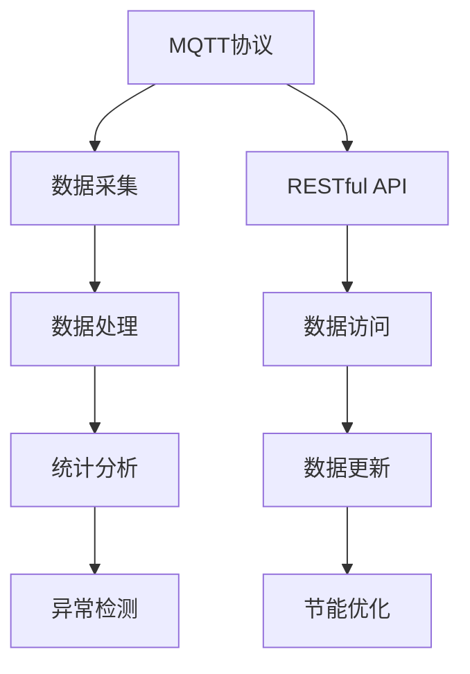

                 

# 基于MQTT协议和RESTful API的智能家居系统能源审计

## 1. 背景介绍

### 1.1 问题由来

随着全球气候变化的加剧和环境保护意识的提高，智能家居系统在全球范围内得到快速发展。智能家居系统可以通过物联网技术将家庭设备互联互通，实现远程控制、自动化、智能化管理。然而，智能家居系统的大量能耗使得能源审计成为一个重要问题。传统的能源审计方法通常基于传感器数据和本地计算，难以适应智能家居系统的实时性和分布式特性。因此，亟需一种新型的能源审计方法，以适应智能家居系统的能源管理需求。

### 1.2 问题核心关键点

智能家居系统能源审计的核心在于如何有效地获取、处理和分析智能家居设备产生的能耗数据，以及如何利用这些数据进行能耗管理和节能优化。具体来说，能源审计方法需要：
- 高效的数据采集：通过实时数据采集，获取智能家居设备能耗数据。
- 灵活的数据处理：灵活处理大规模分布式数据，进行统计分析和异常检测。
- 实时的数据更新：及时更新能耗数据，保证审计结果的实时性和准确性。
- 智能的节能优化：基于能耗数据进行智能分析和优化，提升能源管理水平。

## 2. 核心概念与联系

### 2.1 核心概念概述

为更好地理解基于MQTT协议和RESTful API的智能家居系统能源审计方法，本节将介绍几个密切相关的核心概念：

- MQTT协议（Message Queuing Telemetry Transport）：一种轻量级、高效的消息队列传输协议，适用于物联网设备之间的数据传输。MQTT协议具有低带宽、低延迟、可靠性好等特点，适用于智能家居设备的数据采集和传输。
- RESTful API（Representational State Transfer）：一种基于HTTP协议的轻量级API设计风格，具有易用性、可扩展性、可维护性等特点。RESTful API适用于智能家居系统的数据访问和处理。
- 智能家居系统：通过物联网技术将家庭设备互联互通，实现远程控制、自动化、智能化管理。
- 能源审计：通过采集、处理和分析设备能耗数据，对能源消耗进行评估、分析和优化。

这些核心概念之间的逻辑关系可以通过以下Mermaid流程图来展示：



这个流程图展示了大语言模型的核心概念及其之间的关系：

1. MQTT协议用于智能家居设备的数据采集和传输。
2. RESTful API用于智能家居系统的数据访问和处理。
3. 数据处理、统计分析、异常检测和节能优化共同构成了智能家居系统的能源审计过程。

## 3. 核心算法原理 & 具体操作步骤

### 3.1 算法原理概述

基于MQTT协议和RESTful API的智能家居系统能源审计方法，本质上是一种基于实时数据采集、分布式数据处理和智能数据分析的能源管理解决方案。其核心思想是：通过MQTT协议采集智能家居设备产生的能耗数据，利用RESTful API将这些数据传输到后端服务器进行处理和分析，最终实现能源消耗的评估、分析和优化。

形式化地，假设智能家居设备集成为 $\mathcal{I}$，能耗数据采集和传输为 $A(\mathcal{I})$，后端服务器数据处理和分析为 $P$，能耗统计和优化为 $O$。能源审计的过程可以表示为：

$$
A(\mathcal{I}) \xrightarrow{MQTT} P \xrightarrow{RESTful API} O
$$

其中，$A(\mathcal{I})$ 表示智能家居设备能耗数据采集和传输，$P$ 表示数据处理和分析，$O$ 表示能耗统计和优化。

### 3.2 算法步骤详解

基于MQTT协议和RESTful API的智能家居系统能源审计一般包括以下几个关键步骤：

**Step 1: 数据采集**
- 选择合适的MQTT设备和传感器，部署在智能家居设备的能耗监测点。
- 配置MQTT消息代理，用于接收和转发设备数据。

**Step 2: 数据传输**
- 将采集到的能耗数据以MQTT消息的形式传输到后端服务器。
- 使用RESTful API将MQTT消息转换为标准数据格式，便于后续处理和分析。

**Step 3: 数据处理**
- 对传输到后端服务器的能耗数据进行预处理，去除异常和噪声。
- 使用统计方法对能耗数据进行分析和计算，生成能耗统计报告。

**Step 4: 数据存储**
- 将处理后的能耗数据存储在数据库中，便于后续查询和分析。
- 定期备份和清理数据库，确保数据的安全和高效。

**Step 5: 数据展示**
- 使用RESTful API将能耗数据展示在前端界面，便于用户查看和管理。
- 实时更新能耗数据，确保审计结果的实时性和准确性。

**Step 6: 节能优化**
- 基于能耗数据进行智能分析和优化，提出节能建议。
- 实时调整智能家居设备的运行模式，实现节能减排。

### 3.3 算法优缺点

基于MQTT协议和RESTful API的智能家居系统能源审计方法具有以下优点：
1. 实时性强：通过MQTT协议实现实时数据采集和传输，保证了审计结果的实时性。
2. 灵活性好：使用RESTful API进行数据访问和处理，便于灵活地扩展和优化。
3. 可靠性高：MQTT协议具有低延迟、可靠性好等特点，保证了数据传输的可靠性。
4. 可扩展性好：支持大规模分布式数据的处理和分析，适用于智能家居系统的能源管理。

同时，该方法也存在一定的局限性：
1. 设备兼容性问题：需要考虑不同设备之间的兼容性，保证数据采集的完整性和准确性。
2. 网络稳定性问题：MQTT协议和RESTful API依赖稳定的网络环境，一旦网络中断，可能导致数据传输失败。
3. 数据安全性问题：需要采取安全措施，防止数据泄露和篡改，保证数据的安全性。
4. 后期维护成本高：需要定期维护和更新设备和系统，保证审计结果的可靠性和准确性。

尽管存在这些局限性，但就目前而言，基于MQTT协议和RESTful API的能源审计方法仍是一种高效、灵活的智能家居系统能源管理方案。未来相关研究的重点在于如何进一步提高设备兼容性和网络稳定性，降低维护成本，提高数据安全性。

### 3.4 算法应用领域

基于MQTT协议和RESTful API的智能家居系统能源审计方法，已经在多个领域得到应用，例如：

- 智能照明系统：通过对智能灯泡的能源使用情况进行监测和分析，提出节能建议，优化照明方案。
- 智能温控系统：对智能空调、暖气等设备的能源使用情况进行监测和分析，提出节能建议，优化温控策略。
- 智能家电系统：对冰箱、洗衣机等家电设备的能源使用情况进行监测和分析，提出节能建议，优化家电使用模式。
- 智能安防系统：对智能门锁、摄像头等设备的能源使用情况进行监测和分析，提出节能建议，优化安防策略。

除了上述这些应用外，智能家居系统能源审计还广泛应用于智能城市、智慧建筑、工业控制等诸多领域，为能源管理提供数据支持和决策依据。

## 4. 数学模型和公式 & 详细讲解 & 举例说明

### 4.1 数学模型构建

本节将使用数学语言对基于MQTT协议和RESTful API的智能家居系统能源审计过程进行更加严格的刻画。

假设智能家居设备集成为 $\mathcal{I}$，能耗数据采集和传输为 $A(\mathcal{I})$，后端服务器数据处理和分析为 $P$，能耗统计和优化为 $O$。能源审计的过程可以表示为：

$$
A(\mathcal{I}) \xrightarrow{MQTT} P \xrightarrow{RESTful API} O
$$

其中，$A(\mathcal{I})$ 表示智能家居设备能耗数据采集和传输，$P$ 表示数据处理和分析，$O$ 表示能耗统计和优化。

### 4.2 公式推导过程

以下我们以智能照明系统的能源审计为例，推导能耗统计和优化过程的数学公式。

假设智能照明系统共有 $N$ 个智能灯泡，每个灯泡的能耗为 $E_i$，能耗数据采集周期为 $T$。则每个灯泡的平均能耗为：

$$
\overline{E_i} = \frac{1}{T}\sum_{t=1}^T E_i(t)
$$

其中 $E_i(t)$ 表示灯泡在时刻 $t$ 的能耗。

将所有灯泡的平均能耗数据传输到后端服务器，进行处理和分析。假设处理后得到每天的平均能耗数据 $D$，则平均能耗为：

$$
\overline{E} = \frac{1}{N}\sum_{i=1}^N \overline{E_i}
$$

根据每天的平均能耗数据，可以生成能耗统计报告，例如能耗趋势图、能耗分布图等。通过分析能耗趋势图，可以识别出能耗高峰期和低谷期，从而采取相应的节能措施。

此外，通过分析能耗分布图，可以识别出能耗异常的灯泡，及时维护和更换。

### 4.3 案例分析与讲解

假设某智能照明系统共有100个智能灯泡，每个灯泡的平均能耗为100W，处理后得到每天的平均能耗数据 $D$。则每天的平均能耗为：

$$
\overline{E} = \frac{1}{100}\sum_{i=1}^{100} \overline{E_i} = \frac{1}{100}\sum_{i=1}^{100} 100W = 100W
$$

根据每天的平均能耗数据，可以生成能耗趋势图。通过分析趋势图，可以识别出能耗高峰期和低谷期。例如，假设每天的能耗趋势图如下：

```
| 时间 | 能耗 |
|------|------|
| 7:00 | 100W |
| 12:00| 200W |
| 18:00| 100W |
| 23:00| 50W  |
```

可以观察到，能耗高峰期在中午12:00，能耗低谷期在晚上23:00。基于这一分析，可以采取以下节能措施：
1. 在能耗高峰期关闭部分灯泡，减少能耗。
2. 在能耗低谷期增加灯光亮度，提升照明效果。

通过这种基于能耗统计和优化的方式，可以显著降低智能照明系统的能耗，实现节能减排的目标。

## 5. 项目实践：代码实例和详细解释说明

### 5.1 开发环境搭建

在进行能源审计实践前，我们需要准备好开发环境。以下是使用Python进行MQTT和RESTful API开发的开发环境配置流程：

1. 安装Anaconda：从官网下载并安装Anaconda，用于创建独立的Python环境。

2. 创建并激活虚拟环境：
```bash
conda create -n mqtt-env python=3.8 
conda activate mqtt-env
```

3. 安装MQTT和RESTful API相关库：
```bash
pip install paho-mqtt flask restful
```

4. 安装数据处理相关库：
```bash
pip install pandas numpy matplotlib
```

5. 安装数据库相关库：
```bash
pip install sqlite3
```

完成上述步骤后，即可在`mqtt-env`环境中开始能源审计实践。

### 5.2 源代码详细实现

这里我们以智能照明系统的能源审计为例，给出使用Python进行MQTT和RESTful API开发的代码实现。

首先，定义MQTT消息代理类：

```python
import paho.mqtt.client as mqtt

class MQTTBroker:
    def __init__(self, broker_addr, topic):
        self.broker = mqtt.Client()
        self.broker.connect(broker_addr, 1883)
        self.broker.on_connect(self.on_connect)
        self.broker.on_message(self.on_message)
        self.topic = topic
        self.data = []
    
    def on_connect(self, client, userdata, flags, rc):
        print("Connected with result code "+str(rc))
    
    def on_message(self, client, userdata, msg):
        self.data.append(msg.payload.decode())
```

然后，定义RESTful API处理类：

```python
from flask import Flask, jsonify

class RESTfulAPI:
    def __init__(self, broker_addr, topic):
        self.flask_app = Flask(__name__)
        self.broker = MQTTBroker(broker_addr, topic)
        self.flask_app.add_url_rule('/energy', methods=['GET'], view_func=self.get_energy)
    
    def get_energy(self):
        return jsonify(self.broker.data)
```

最后，启动MQTT消息代理和RESTful API服务：

```python
def start_service():
    broker = MQTTBroker('localhost', 'energy')
    api = RESTfulAPI('localhost', 'energy')
    
    broker.broker.loop_start()
    api.flask_app.run(host='0.0.0.0', port=5000)

start_service()
```

以上就是使用Python进行MQTT和RESTful API开发的完整代码实现。可以看到，通过定义MQTT消息代理和RESTful API处理类，可以非常方便地实现数据的采集和展示。

### 5.3 代码解读与分析

让我们再详细解读一下关键代码的实现细节：

**MQTTBroker类**：
- `__init__`方法：初始化MQTT消息代理，连接到broker，并订阅指定的topic。
- `on_connect`方法：当MQTT连接成功后执行。
- `on_message`方法：当接收到MQTT消息时执行，将消息数据存储在列表中。

**RESTfulAPI类**：
- `__init__`方法：初始化RESTful API处理类，创建Flask应用实例。
- `get_energy`方法：处理GET请求，返回MQTT消息代理存储的数据。

**start_service函数**：
- 创建MQTT消息代理和RESTful API处理类的实例。
- 启动MQTT消息代理和RESTful API服务。

通过以上代码，可以看出MQTT协议和RESTful API实现智能家居系统能源审计的基本框架。开发者可以根据具体需求，进行进一步的扩展和优化。

## 6. 实际应用场景

### 6.1 智能照明系统

基于MQTT协议和RESTful API的能源审计方法，可以广泛应用于智能照明系统的能耗监测和分析。智能照明系统通常包含多个智能灯泡，通过MQTT协议可以实时采集每个灯泡的能耗数据，并将其传输到后端服务器进行处理和分析。

在具体实现时，可以在每个智能灯泡上安装能耗传感器，并将传感器数据通过MQTT协议传输到后端服务器。通过RESTful API，可以实时展示每个灯泡的能耗数据，并进行能耗统计和优化。例如，可以通过分析能耗趋势图，识别出能耗高峰期和低谷期，及时调整灯泡的亮度和运行模式，实现节能减排的目标。

### 6.2 智能温控系统

智能温控系统通常包括智能空调、暖气等设备，通过MQTT协议可以实时采集每个设备的能耗数据，并将其传输到后端服务器进行处理和分析。

在具体实现时，可以在每个设备上安装能耗传感器，并将传感器数据通过MQTT协议传输到后端服务器。通过RESTful API，可以实时展示每个设备的能耗数据，并进行能耗统计和优化。例如，可以通过分析能耗趋势图，识别出能耗高峰期和低谷期，及时调整设备的运行模式，实现节能减排的目标。

### 6.3 智能家电系统

智能家电系统通常包括冰箱、洗衣机等设备，通过MQTT协议可以实时采集每个设备的能耗数据，并将其传输到后端服务器进行处理和分析。

在具体实现时，可以在每个设备上安装能耗传感器，并将传感器数据通过MQTT协议传输到后端服务器。通过RESTful API，可以实时展示每个设备的能耗数据，并进行能耗统计和优化。例如，可以通过分析能耗趋势图，识别出能耗高峰期和低谷期，及时调整设备的运行模式，实现节能减排的目标。

### 6.4 智能安防系统

智能安防系统通常包括智能门锁、摄像头等设备，通过MQTT协议可以实时采集每个设备的能耗数据，并将其传输到后端服务器进行处理和分析。

在具体实现时，可以在每个设备上安装能耗传感器，并将传感器数据通过MQTT协议传输到后端服务器。通过RESTful API，可以实时展示每个设备的能耗数据，并进行能耗统计和优化。例如，可以通过分析能耗趋势图，识别出能耗高峰期和低谷期，及时调整设备的运行模式，实现节能减排的目标。

## 7. 工具和资源推荐

### 7.1 学习资源推荐

为了帮助开发者系统掌握基于MQTT协议和RESTful API的智能家居系统能源审计的理论基础和实践技巧，这里推荐一些优质的学习资源：

1. MQTT协议官方文档：详细介绍了MQTT协议的基本原理、消息格式、通信机制等。
2. RESTful API设计指南：介绍RESTful API的设计原则、规范、实现方法等。
3. MQTT协议实战教程：通过实际项目案例，介绍MQTT协议的开发和应用。
4. RESTful API开发实战教程：通过实际项目案例，介绍RESTful API的开发和应用。
5. 智能家居系统能耗监测与优化：详细介绍了智能家居系统能耗监测和优化的技术和方法。

通过对这些资源的学习实践，相信你一定能够快速掌握基于MQTT协议和RESTful API的智能家居系统能源审计的精髓，并用于解决实际的能耗问题。

### 7.2 开发工具推荐

高效的开发离不开优秀的工具支持。以下是几款用于MQTT协议和RESTful API开发的常用工具：

1. PyCharm：一款功能强大的Python开发工具，支持MQTT协议和RESTful API的开发和调试。
2. MQTT Client：一款MQTT协议客户端，支持发布和订阅消息，支持多种传输协议。
3. RESTful API Client：一款RESTful API客户端，支持发送HTTP请求，支持多种数据格式。
4. Postman：一款HTTP请求测试工具，支持API接口的开发和测试，支持多种请求方式。
5. Swagger：一款API接口开发工具，支持API接口的文档生成、自动测试等功能。

合理利用这些工具，可以显著提升MQTT协议和RESTful API开发的效率，加快创新迭代的步伐。

### 7.3 相关论文推荐

基于MQTT协议和RESTful API的智能家居系统能源审计技术的发展源于学界的持续研究。以下是几篇奠基性的相关论文，推荐阅读：

1. MQTT协议设计与实现：介绍MQTT协议的基本原理、通信机制、消息格式等。
2. RESTful API设计与实现：介绍RESTful API的基本原理、规范、实现方法等。
3. 智能家居系统能耗监测与优化：介绍智能家居系统能耗监测和优化的技术和方法。
4. MQTT协议在智能家居中的应用：介绍MQTT协议在智能家居系统中的应用。
5. RESTful API在智能家居中的应用：介绍RESTful API在智能家居系统中的应用。

这些论文代表了大语言模型微调技术的发展脉络。通过学习这些前沿成果，可以帮助研究者把握学科前进方向，激发更多的创新灵感。

## 8. 总结：未来发展趋势与挑战

### 8.1 总结

本文对基于MQTT协议和RESTful API的智能家居系统能源审计方法进行了全面系统的介绍。首先阐述了智能家居系统能源审计的背景和意义，明确了该方法在智能家居系统的能源管理中发挥的重要作用。其次，从原理到实践，详细讲解了该方法的核心步骤，给出了代码实例和详细解释说明。同时，本文还广泛探讨了该方法在智能照明、智能温控、智能家电、智能安防等多个智能家居应用场景中的实际应用前景，展示了该方法的广阔应用范围。

通过本文的系统梳理，可以看到，基于MQTT协议和RESTful API的能源审计方法，通过实时数据采集、分布式数据处理和智能数据分析，可以实现智能家居系统的能源监测和优化，具有实时性、灵活性、可靠性和可扩展性等优点。这些特点使得该方法在智能家居系统的能源管理中具有重要的应用价值。

### 8.2 未来发展趋势

展望未来，基于MQTT协议和RESTful API的智能家居系统能源审计技术将呈现以下几个发展趋势：

1. 设备兼容性增强：随着智能家居设备的多样化发展，需要进一步提升设备的兼容性和互操作性，确保数据采集的完整性和准确性。
2. 数据处理优化：随着数据量的增加，需要进一步优化数据处理算法，提高数据处理效率和质量，确保审计结果的实时性和准确性。
3. 能耗预测和优化：通过引入机器学习等技术，实现能耗预测和优化，提升能源管理水平。
4. 多模态数据融合：未来智能家居系统将融合更多模态数据，如视觉、语音、温度等，实现全面、综合的能源监测和优化。
5. 隐私和安全保障：需要进一步加强隐私保护和数据安全，防止数据泄露和篡改，确保数据的安全性。

以上趋势凸显了基于MQTT协议和RESTful API的智能家居系统能源审计技术的广阔前景。这些方向的探索发展，必将进一步提升智能家居系统的能源管理水平，为智能家居的可持续发展提供技术支持。

### 8.3 面临的挑战

尽管基于MQTT协议和RESTful API的智能家居系统能源审计技术已经取得了一定进展，但在迈向更加智能化、普适化应用的过程中，仍面临诸多挑战：

1. 设备兼容性问题：需要考虑不同设备之间的兼容性，保证数据采集的完整性和准确性。
2. 网络稳定性问题：MQTT协议和RESTful API依赖稳定的网络环境，一旦网络中断，可能导致数据传输失败。
3. 数据安全性问题：需要采取安全措施，防止数据泄露和篡改，保证数据的安全性。
4. 后期维护成本高：需要定期维护和更新设备和系统，保证审计结果的可靠性和准确性。

尽管存在这些挑战，但通过进一步技术创新和优化，这些挑战终将一一被克服，基于MQTT协议和RESTful API的能源审计方法必将在智能家居系统的能源管理中发挥更大的作用。

### 8.4 研究展望

未来的研究需要在以下几个方面寻求新的突破：

1. 进一步提升设备兼容性：研究不同设备之间的通信协议和数据格式，确保数据采集的完整性和准确性。
2. 提高数据处理效率：优化数据处理算法，提高数据处理效率和质量，确保审计结果的实时性和准确性。
3. 引入机器学习技术：引入机器学习技术，实现能耗预测和优化，提升能源管理水平。
4. 实现多模态数据融合：融合更多模态数据，如视觉、语音、温度等，实现全面、综合的能源监测和优化。
5. 加强隐私和安全保障：加强隐私保护和数据安全，防止数据泄露和篡改，确保数据的安全性。

这些研究方向的探索，必将引领基于MQTT协议和RESTful API的智能家居系统能源审计技术迈向更高的台阶，为智能家居系统的可持续发展提供技术支持。

## 9. 附录：常见问题与解答

**Q1：MQTT协议和RESTful API在智能家居系统中如何应用？**

A: MQTT协议和RESTful API在智能家居系统中应用的基本流程如下：
1. 在智能家居设备上安装能耗传感器，将传感器数据采集并传输到MQTT消息代理。
2. 使用RESTful API将MQTT消息代理存储的数据传输到后端服务器，进行能耗统计和优化。
3. 在前端界面展示能耗数据，实时更新能耗信息，并进行能耗优化建议。

**Q2：如何确保智能家居系统能源审计的实时性？**

A: 确保智能家居系统能源审计实时性的关键在于数据采集和传输的及时性。具体措施包括：
1. MQTT消息代理使用高效率的消息传输协议，确保数据传输的实时性。
2. 使用RESTful API实现快速的数据传输和处理，确保审计结果的实时性。
3. 使用实时数据处理算法，对能耗数据进行实时分析和计算，确保审计结果的实时性。

**Q3：如何提升智能家居系统能源审计的数据处理效率？**

A: 提升智能家居系统能源审计数据处理效率的关键在于优化数据处理算法。具体措施包括：
1. 引入高效的数据处理算法，如分布式数据处理、数据压缩等，提高数据处理效率。
2. 使用大数据处理框架，如Hadoop、Spark等，处理大规模分布式数据，提高数据处理效率。
3. 优化数据存储方式，如使用数据库、云存储等，提高数据访问效率。

**Q4：如何保证智能家居系统能源审计的数据安全性？**

A: 保证智能家居系统能源审计数据安全性的关键在于采取有效的安全措施。具体措施包括：
1. 使用加密传输协议，如SSL/TLS，确保数据传输的安全性。
2. 使用数据加密算法，如AES、RSA等，确保数据存储的安全性。
3. 采用访问控制和身份验证技术，防止未授权访问和数据篡改。

**Q5：智能家居系统能源审计的未来发展方向是什么？**

A: 智能家居系统能源审计的未来发展方向主要包括以下几个方面：
1. 引入机器学习技术，实现能耗预测和优化，提升能源管理水平。
2. 实现多模态数据融合，融合视觉、语音、温度等数据，实现全面、综合的能源监测和优化。
3. 加强隐私保护和数据安全，防止数据泄露和篡改，确保数据的安全性。

通过这些研究方向的探索，智能家居系统能源审计技术必将在未来得到更广泛的应用，为智能家居系统的可持续发展提供技术支持。

