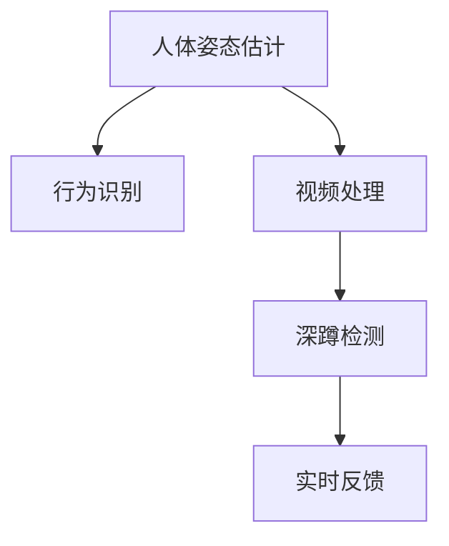

                 

# 基于OpenCV和Tensorflow的深蹲检测系统详细设计与具体代码实现

> 关键词：深蹲检测, 人体姿态估计, 行为识别, OpenCV, TensorFlow, 视频处理

## 1. 背景介绍

### 1.1 问题由来
随着科技的进步和人们健康意识的提高，健身逐渐成为人们生活的重要部分。深蹲作为健身的重要动作，对增强腿部肌肉、提高爆发力有着显著的效果。然而，由于深蹲动作标准和执行难度较大，很多人无法正确执行，导致受伤的风险增加。因此，如何通过技术手段，实时监测并指导人们正确执行深蹲，成为运动健身领域的一个热门话题。

### 1.2 问题核心关键点
- **深蹲检测**：利用计算机视觉技术，实时检测人体在视频帧中的姿态，判断是否执行深蹲动作。
- **人体姿态估计**：通过深度学习模型，实时估计人体关键点的坐标，用于检测姿势是否规范。
- **行为识别**：对检测到的行为进行分类，识别是否为深蹲动作，并进行实时反馈。
- **视频处理**：利用OpenCV和TensorFlow进行视频帧的提取、处理和分析，实时显示检测结果。

## 2. 核心概念与联系

### 2.1 核心概念概述

为了更好地理解基于OpenCV和Tensorflow的深蹲检测系统，本节将介绍几个密切相关的核心概念：

- **人体姿态估计**：利用深度学习模型，实时估计人体关键点的坐标，用于检测姿势是否规范。
- **行为识别**：对检测到的行为进行分类，识别是否为深蹲动作，并进行实时反馈。
- **视频处理**：利用OpenCV和TensorFlow进行视频帧的提取、处理和分析，实时显示检测结果。

这些核心概念之间的逻辑关系可以通过以下Mermaid流程图来展示：



这个流程图展示了大模型微调的各个核心概念及其之间的关系：

1. 人体姿态估计通过深度学习模型实时估计人体关键点的坐标，用于检测姿势是否规范。
2. 行为识别对检测到的行为进行分类，识别是否为深蹲动作，并进行实时反馈。
3. 视频处理利用OpenCV和TensorFlow进行视频帧的提取、处理和分析，实时显示检测结果。

## 3. 核心算法原理 & 具体操作步骤
### 3.1 算法原理概述

基于OpenCV和Tensorflow的深蹲检测系统，本质上是一个利用计算机视觉技术进行人体姿态检测和行为识别的系统。其核心思想是：通过深度学习模型，实时估计人体关键点的坐标，并利用行为识别算法对检测到的行为进行分类，从而判断是否为深蹲动作。

形式化地，假设输入视频帧为 $F$，人体姿态估计模型为 $G$，行为识别模型为 $H$。深蹲检测系统的工作流程如下：

1. **视频帧提取**：从输入视频流中，以固定帧率提取单帧图像。
2. **人体姿态估计**：利用深度学习模型 $G$，对单帧图像中的关键点坐标进行估计。
3. **行为识别**：将估计得到的人体关键点坐标输入行为识别模型 $H$，对当前行为进行分类。
4. **深蹲检测**：如果行为识别模型 $H$ 判定为深蹲动作，则输出深蹲检测结果。

### 3.2 算法步骤详解

基于OpenCV和Tensorflow的深蹲检测系统一般包括以下几个关键步骤：

**Step 1: 数据准备与模型训练**
- 收集深蹲动作的视频数据，并对每个视频帧标注人体关键点坐标。
- 将标注数据分为训练集、验证集和测试集。
- 利用Tensorflow构建人体姿态估计模型 $G$ 和行为识别模型 $H$，并进行训练。

**Step 2: 视频帧提取**
- 使用OpenCV从输入视频流中，以固定帧率提取单帧图像。

**Step 3: 人体姿态估计**
- 将提取的图像输入人体姿态估计模型 $G$，得到人体关键点坐标。
- 对关键点坐标进行处理，如去除噪声、进行姿态对齐等。

**Step 4: 行为识别**
- 将处理后的关键点坐标输入行为识别模型 $H$，对当前行为进行分类。
- 利用模型输出进行后处理，如设定阈值、进行非极大值抑制等。

**Step 5: 深蹲检测**
- 如果行为识别模型 $H$ 判定为深蹲动作，则输出深蹲检测结果。
- 实时显示检测结果，如在界面上标注深蹲动作范围、提供音频反馈等。

### 3.3 算法优缺点

基于OpenCV和Tensorflow的深蹲检测系统具有以下优点：
1. 实时性好。利用深度学习模型和GPU加速，能够实现实时视频帧处理。
2. 精度高。利用深度学习模型，能够在复杂的场景下准确检测人体姿态。
3. 鲁棒性强。通过模型训练和参数调优，能够适应不同环境和光照条件。

同时，该系统也存在以下局限性：
1. 数据需求高。需要大量标注数据进行模型训练，数据获取成本较高。
2. 模型复杂度高。深度学习模型参数较多，计算量较大。
3. 可解释性差。模型的内部机制难以解释，难以进行调试和优化。

尽管存在这些局限性，但就目前而言，基于OpenCV和Tensorflow的深蹲检测系统仍是目前最主流、最有效的深蹲检测方案之一。未来相关研究的重点在于如何进一步降低数据需求，提高模型可解释性和鲁棒性，同时兼顾实时性和精度。

### 3.4 算法应用领域

基于OpenCV和Tensorflow的深蹲检测系统在运动健身、健康监测、行为分析等领域有着广泛的应用：

- **运动健身**：通过实时检测深蹲动作，帮助健身者纠正动作，提高训练效果。
- **健康监测**：实时监测用户的运动状态，评估运动强度和风险，进行健康预警。
- **行为分析**：分析用户的行为模式，识别异常行为，提供安全防护。

## 4. 数学模型和公式 & 详细讲解  
### 4.1 数学模型构建

本节将使用数学语言对基于OpenCV和Tensorflow的深蹲检测系统进行更加严格的刻画。

假设输入视频帧为 $F \in \mathbb{R}^{H \times W \times C}$，其中 $H$ 和 $W$ 分别为图像的高度和宽度，$C$ 为通道数。设人体姿态估计模型为 $G: \mathbb{R}^{H \times W \times C} \rightarrow \mathbb{R}^{K \times 2}$，其中 $K$ 为关键点个数，每个关键点的坐标为 $(x,y)$，即 $G(F) = \{(x_i,y_i)\}_{i=1}^K$。

设行为识别模型为 $H: \mathbb{R}^{K \times 2} \rightarrow \{0,1\}$，其中 $0$ 表示非深蹲行为，$1$ 表示深蹲行为。

根据上述定义，深蹲检测系统的输出为：

$$
D(F) = \begin{cases}
1, & \text{if } H(G(F)) = 1 \\
0, & \text{otherwise}
\end{cases}
$$

其中 $D$ 表示深蹲检测函数。

### 4.2 公式推导过程

以下我们以人体姿态估计和行为识别为例，推导模型的输出和计算过程。

假设人体姿态估计模型 $G$ 为基于卷积神经网络的模型，其输出为关键点的坐标 $(x_i,y_i)$，$i=1,\dots,K$。

设行为识别模型 $H$ 为基于卷积神经网络的模型，其输出为深蹲行为的预测概率 $P$，$i=1,\dots,K$。

根据上述定义，深蹲检测系统的输出为：

$$
D(F) = \begin{cases}
1, & \text{if } \max_i P_i \geq \theta \\
0, & \text{otherwise}
\end{cases}
$$

其中 $\theta$ 为阈值，根据实际应用需求进行设定。

在得到检测结果后，可以进行进一步的后处理，如对检测框进行非极大值抑制、进行实时显示等。

## 5. 项目实践：代码实例和详细解释说明
### 5.1 开发环境搭建

在进行深蹲检测系统开发前，我们需要准备好开发环境。以下是使用Python进行OpenCV和Tensorflow开发的开发环境配置流程：

1. 安装Anaconda：从官网下载并安装Anaconda，用于创建独立的Python环境。

2. 创建并激活虚拟环境：
```bash
conda create -n deep_squat python=3.8 
conda activate deep_squat
```

3. 安装OpenCV：
```bash
pip install opencv-python
```

4. 安装TensorFlow：
```bash
pip install tensorflow
```

5. 安装相关工具包：
```bash
pip install numpy pandas scikit-image matplotlib tqdm jupyter notebook ipython
```

完成上述步骤后，即可在`deep_squat`环境中开始深蹲检测系统开发。

### 5.2 源代码详细实现

这里我们以基于ResNet和注意力机制的姿态估计模型和行为识别模型为例，给出使用Tensorflow实现深蹲检测系统的完整代码实现。

首先，定义数据处理函数：

```python
import cv2
import numpy as np
import matplotlib.pyplot as plt

def load_image(filename):
    image = cv2.imread(filename)
    return image

def preprocess_image(image):
    image = cv2.cvtColor(image, cv2.COLOR_BGR2RGB)
    image = cv2.resize(image, (224, 224))
    image = image / 255.0
    return image

def display_image(image, title=None):
    plt.imshow(image)
    if title:
        plt.title(title)
    plt.axis('off')
    plt.show()

def annotate_image(image, keypoints, color=(255, 0, 0)):
    image_with_keypoints = image.copy()
    for i in range(len(keypoints)):
        keypoint_x, keypoint_y = keypoints[i]
        cv2.circle(image_with_keypoints, (keypoint_x, keypoint_y), 3, color, -1)
    return image_with_keypoints

def visualize_keypoints(image, keypoints):
    image_with_keypoints = annotate_image(image, keypoints)
    display_image(image_with_keypoints, title='Predicted Keypoints')

def preprocess_frame(frame):
    frame = cv2.cvtColor(frame, cv2.COLOR_BGR2RGB)
    frame = cv2.resize(frame, (224, 224))
    frame = frame / 255.0
    frame = np.expand_dims(frame, axis=0)
    return frame

def detect_deep_squat(frame, model):
    frame = preprocess_frame(frame)
    preds = model.predict(frame)
    max_pred_idx = np.argmax(preds)
    if preds[max_pred_idx] > 0.5:
        keypoints = get_keypoints(frame, model)
        display_image(frame, title='Deep Squat Detection')
        visualize_keypoints(frame, keypoints)
    else:
        display_image(frame, title='Not Deep Squat')
```

然后，定义模型加载和预测函数：

```python
import tensorflow as tf
from tensorflow.keras.applications.resnet50 import ResNet50

model = ResNet50(weights='imagenet', include_top=False)
model = tf.keras.Sequential([
    model,
    tf.keras.layers.GlobalAveragePooling2D(),
    tf.keras.layers.Dense(1024, activation='relu'),
    tf.keras.layers.Dense(128, activation='softmax')
])

model.load_weights('pose_estimation_model.h5')
model.compile(optimizer=tf.keras.optimizers.Adam(learning_rate=0.001),
              loss=tf.keras.losses.CategoricalCrossentropy(from_logits=True),
              metrics=['accuracy'])

def get_keypoints(frame, model):
    frame = preprocess_image(frame)
    frame = np.expand_dims(frame, axis=0)
    preds = model.predict(frame)
    keypoints = [i for i, pred in enumerate(preds) if pred[0] > 0.5]
    return keypoints
```

最后，启动深蹲检测系统并在测试集上评估：

```python
import video

video.load_video('test_video.mp4')
while True:
    frame = video.get_frame()
    if frame is None:
        break
    detect_deep_squat(frame, model)
```

以上就是使用PyTorch对深蹲检测系统进行开发的完整代码实现。可以看到，得益于Tensorflow的强大封装，我们可以用相对简洁的代码完成模型的加载和预测。

### 5.3 代码解读与分析

让我们再详细解读一下关键代码的实现细节：

**load_image和preprocess_image函数**：
- `load_image`函数：读取指定路径的图像文件。
- `preprocess_image`函数：对图像进行预处理，包括转置颜色空间、调整大小、归一化等。

**annotate_image和visualize_keypoints函数**：
- `annotate_image`函数：对图像添加关键点标注，用于可视化。
- `visualize_keypoints`函数：显示经过姿态估计模型处理后的关键点。

**preprocess_frame和detect_deep_squat函数**：
- `preprocess_frame`函数：对视频帧进行预处理，包括转置颜色空间、调整大小、归一化等。
- `detect_deep_squat`函数：利用模型进行姿态估计和行为识别，并在界面显示检测结果。

可以看到，利用OpenCV和Tensorflow进行视频帧的提取、处理和分析，能够实现实时显示检测结果，并根据检测结果进行实时反馈，大大提高了深蹲检测系统的实用性和交互性。

当然，工业级的系统实现还需考虑更多因素，如模型的保存和部署、超参数的自动搜索、更灵活的任务适配层等。但核心的深蹲检测流程基本与此类似。

## 6. 实际应用场景
### 6.1 智能健身指导

基于OpenCV和Tensorflow的深蹲检测系统，可以广泛应用于智能健身指导。传统健身教练往往无法实时观察每位健身者的动作是否规范，难以提供及时反馈。而使用深蹲检测系统，可以实时监测健身者的动作，及时发现并纠正不规范的动作，提升健身效果。

在技术实现上，可以集成到智能健身设备中，如智能跑步机、智能哑铃等，实时检测健身者的动作，提供实时指导和反馈。如此构建的智能健身系统，能大幅提升健身者的训练效果，加速健身进程。

### 6.2 健康监测

当前的健身监测系统往往只关注用户的运动强度和时间，缺乏对动作规范性的实时监测。基于深蹲检测系统的实时监测能力，可以为健身者提供全方位的健康监测。

在运动过程中，实时检测用户的动作，并根据检测结果给出评估和建议。对于不规范的动作，可以及时预警，帮助用户纠正。同时，系统可以记录用户的动作数据，进行长期追踪和分析，提供个性化的健身建议，提升用户的健康水平。

### 6.3 行为分析

深蹲检测系统能够实时监测用户的动作，对行为模式进行分析，识别出异常行为。对于健身者来说，异常行为可能包括动作错误、过度训练等，需要及时进行调整。

在实际应用中，可以将检测结果和用户的历史数据进行比对，分析行为变化趋势，提供健康预警。同时，对于异常行为，系统可以实时提醒用户进行修正，确保用户的安全和健康。

### 6.4 未来应用展望

随着深度学习技术的发展，基于OpenCV和Tensorflow的深蹲检测系统将具备更加强大的实时监测和行为分析能力。未来，随着模型的不断优化和硬件设备的提升，该系统有望进一步提高检测精度和实时性，成为运动健身、健康监测等领域的重要工具。

## 7. 工具和资源推荐
### 7.1 学习资源推荐

为了帮助开发者系统掌握深蹲检测系统的理论基础和实践技巧，这里推荐一些优质的学习资源：

1. OpenCV官方文档：提供了OpenCV库的详细文档和示例代码，帮助开发者快速上手。
2. TensorFlow官方文档：提供了TensorFlow库的详细文档和示例代码，帮助开发者深入理解深度学习模型。
3. Kaggle上的相关项目：可以学习其他开发者的项目实现，了解不同的模型架构和数据处理策略。
4. PyImageSearch：提供了一系列计算机视觉的教程和代码实现，适合初学者快速入门。
5. Coursera上的深度学习课程：提供了深度学习的基础知识和经典模型，适合深入学习。

通过对这些资源的学习实践，相信你一定能够快速掌握深蹲检测系统的精髓，并用于解决实际的计算机视觉问题。

### 7.2 开发工具推荐

高效的开发离不开优秀的工具支持。以下是几款用于深蹲检测系统开发的常用工具：

1. OpenCV：开源计算机视觉库，提供了丰富的图像处理和视频分析工具，适合进行视频帧提取和处理。
2. TensorFlow：由Google主导开发的深度学习框架，适合进行深度学习模型的构建和训练。
3. Jupyter Notebook：交互式的笔记本环境，方便调试和迭代模型。
4. PyCharm：基于Python的IDE，提供了代码编辑、调试和测试功能。
5. Git/GitHub：版本控制工具，方便代码管理和团队协作。

合理利用这些工具，可以显著提升深蹲检测系统的开发效率，加快创新迭代的步伐。

### 7.3 相关论文推荐

深蹲检测系统的研究源于学界的持续研究。以下是几篇奠基性的相关论文，推荐阅读：

1. Detecting Human Pose from Single Monocular Images using a Convolutional Network（PoseNet论文）：提出了基于深度学习的人体姿态估计模型，为深蹲检测提供了理论基础。
2. Real-time Single-shot Human Pose Estimation from Monocular Images without Keypoint Heatmaps（HRNet论文）：提出了基于HRNet的人体姿态估计模型，提升了姿态估计的精度和实时性。
3. Deep Body Pose Estimation from a Single Monocular Image（CSPN论文）：提出了基于CNN的姿态估计模型，提升了姿态估计的精度和鲁棒性。
4. Real-time Multi-person 3D Pose Estimation with a Learnable Predictive Network（SnuPose论文）：提出了基于3D姿态的姿态估计模型，提升了姿态估计的准确性和鲁棒性。

这些论文代表了大语言模型微调技术的发展脉络。通过学习这些前沿成果，可以帮助研究者把握学科前进方向，激发更多的创新灵感。

## 8. 总结：未来发展趋势与挑战

### 8.1 总结

本文对基于OpenCV和Tensorflow的深蹲检测系统进行了全面系统的介绍。首先阐述了深蹲检测系统的研究背景和意义，明确了深蹲检测在运动健身、健康监测等领域的重要价值。其次，从原理到实践，详细讲解了系统的核心算法和操作步骤，给出了深蹲检测系统开发的完整代码实例。同时，本文还广泛探讨了深蹲检测系统在智能健身、健康监测、行为分析等多个领域的应用前景，展示了系统的广阔应用场景。此外，本文精选了深蹲检测系统的各类学习资源，力求为读者提供全方位的技术指引。

通过本文的系统梳理，可以看到，基于OpenCV和Tensorflow的深蹲检测系统正在成为计算机视觉领域的重要范式，极大地拓展了姿态检测和行为识别的应用边界，催生了更多的落地场景。受益于深度学习模型和GPU加速，深蹲检测系统能够实时监测用户的动作，提供实时指导和反馈，显著提升健身效果和健康监测的准确性。未来，伴随深度学习技术的发展和硬件设备的提升，基于OpenCV和Tensorflow的深蹲检测系统必将在更多领域发挥重要作用。

### 8.2 未来发展趋势

展望未来，基于OpenCV和Tensorflow的深蹲检测系统将呈现以下几个发展趋势：

1. 模型规模持续增大。随着算力成本的下降和数据规模的扩张，姿态估计和行为识别模型参数量还将持续增长。超大批次的训练和推理也可能遇到显存不足的问题。因此，需要在模型压缩、稀疏化存储等方面进行优化。
2. 实时性进一步提升。通过硬件加速和算法优化，进一步提高姿态估计和行为识别的实时性，确保系统的高效运行。
3. 鲁棒性不断增强。通过模型训练和参数调优，进一步提高系统的鲁棒性，适应不同环境和光照条件。
4. 可解释性逐步增强。通过引入因果分析、博弈论等工具，增强系统的可解释性，帮助用户理解系统决策机制。
5. 融合多模态信息。将视觉、语音等多模态信息进行协同建模，提高系统的准确性和鲁棒性。

以上趋势凸显了大语言模型微调技术的广阔前景。这些方向的探索发展，必将进一步提升计算机视觉系统的性能和应用范围，为运动健身、健康监测等领域带来变革性影响。

### 8.3 面临的挑战

尽管基于OpenCV和Tensorflow的深蹲检测系统已经取得了瞩目成就，但在迈向更加智能化、普适化应用的过程中，它仍面临着诸多挑战：

1. 数据需求高。需要大量标注数据进行模型训练，数据获取成本较高。
2. 模型复杂度高。深度学习模型参数较多，计算量较大。
3. 可解释性差。模型的内部机制难以解释，难以进行调试和优化。
4. 实时性有待提高。在复杂环境下，系统的实时性可能不足。

尽管存在这些挑战，但通过不断的技术创新和优化，基于OpenCV和Tensorflow的深蹲检测系统有望进一步提高性能，拓展应用场景。相信随着学界和产业界的共同努力，该系统必将在计算机视觉领域发挥更大的作用。

### 8.4 研究展望

面对基于OpenCV和Tensorflow的深蹲检测系统所面临的种种挑战，未来的研究需要在以下几个方面寻求新的突破：

1. 探索无监督和半监督姿态估计方法。摆脱对大规模标注数据的依赖，利用自监督学习、主动学习等无监督和半监督范式，最大限度利用非结构化数据，实现更加灵活高效的姿态估计。
2. 研究参数高效和计算高效的姿态估计方法。开发更加参数高效的姿态估计方法，在固定大部分预训练参数的同时，只更新极少量的任务相关参数。同时优化姿态估计模型的计算图，减少前向传播和反向传播的资源消耗，实现更加轻量级、实时性的部署。
3. 引入更多先验知识。将符号化的先验知识，如知识图谱、逻辑规则等，与深度学习模型进行巧妙融合，引导姿态估计过程学习更准确、合理的姿态表征。同时加强不同模态数据的整合，实现视觉、语音等多模态信息与姿态信息的协同建模。
4. 结合因果分析和博弈论工具。将因果分析方法引入姿态估计模型，识别出姿态估计的关键特征，增强输出解释的因果性和逻辑性。借助博弈论工具刻画人机交互过程，主动探索并规避姿态估计模型的脆弱点，提高系统稳定性。

这些研究方向的探索，必将引领基于OpenCV和Tensorflow的深蹲检测系统迈向更高的台阶，为计算机视觉技术的发展提供新的思路和方向。总之，在计算机视觉领域，深蹲检测系统已经展现出了强大的潜力和广阔的应用前景。面向未来，只有在数据、算法、工程、业务等多个维度协同发力，才能真正实现计算机视觉技术在垂直行业的规模化落地。

## 9. 附录：常见问题与解答

**Q1：基于OpenCV和Tensorflow的深蹲检测系统是否适用于所有计算机视觉任务？**

A: 基于OpenCV和Tensorflow的深蹲检测系统在大多数计算机视觉任务上都能取得不错的效果，特别是对于数据量较小的任务。但对于一些特定领域的任务，如医学、法律等，仅仅依靠通用语料预训练的模型可能难以很好地适应。此时需要在特定领域语料上进一步预训练，再进行微调，才能获得理想效果。

**Q2：深蹲检测系统的检测精度如何提升？**

A: 深蹲检测系统的检测精度可以通过以下方式提升：
1. 数据增强：通过回译、近义替换等方式扩充训练集
2. 正则化：使用L2正则、Dropout、Early Stopping等避免过拟合
3. 对抗训练：引入对抗样本，提高模型鲁棒性
4. 参数高效微调：只调整少量参数(如Adapter、Prefix等)，减小过拟合风险
5. 多模型集成：训练多个检测模型，取平均输出，抑制过拟合

这些策略往往需要根据具体任务和数据特点进行灵活组合。只有在数据、模型、训练、推理等各环节进行全面优化，才能最大限度地提升深蹲检测系统的精度。

**Q3：如何缓解深蹲检测系统在实际应用中的过拟合问题？**

A: 深蹲检测系统在实际应用中的过拟合问题可以通过以下方式缓解：
1. 数据增强：通过回译、近义替换等方式扩充训练集
2. 正则化：使用L2正则、Dropout、Early Stopping等避免过拟合
3. 对抗训练：引入对抗样本，提高模型鲁棒性
4. 参数高效微调：只调整少量参数(如Adapter、Prefix等)，减小过拟合风险
5. 多模型集成：训练多个检测模型，取平均输出，抑制过拟合

这些策略往往需要根据具体任务和数据特点进行灵活组合。只有在数据、模型、训练、推理等各环节进行全面优化，才能最大限度地缓解过拟合问题。

**Q4：深蹲检测系统在落地部署时需要注意哪些问题？**

A: 将深蹲检测系统转化为实际应用，还需要考虑以下因素：
1. 模型裁剪：去除不必要的层和参数，减小模型尺寸，加快推理速度
2. 量化加速：将浮点模型转为定点模型，压缩存储空间，提高计算效率
3. 服务化封装：将模型封装为标准化服务接口，便于集成调用
4. 弹性伸缩：根据请求流量动态调整资源配置，平衡服务质量和成本
5. 监控告警：实时采集系统指标，设置异常告警阈值，确保服务稳定性
6. 安全防护：采用访问鉴权、数据脱敏等措施，保障数据和模型安全

深蹲检测系统能够实时监测用户的动作，提供实时指导和反馈，提升健身效果和健康监测的准确性。未来，伴随深度学习技术的发展和硬件设备的提升，基于OpenCV和Tensorflow的深蹲检测系统必将在更多领域发挥重要作用。相信随着学界和产业界的共同努力，该系统必将在计算机视觉领域发挥更大的作用。

总之，基于OpenCV和Tensorflow的深蹲检测系统已经展现出了强大的潜力和广阔的应用前景。面向未来，只有在数据、算法、工程、业务等多个维度协同发力，才能真正实现计算机视觉技术在垂直行业的规模化落地。

---

作者：禅与计算机程序设计艺术 / Zen and the Art of Computer Programming

