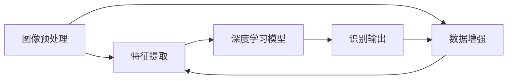

                 

# 基于OpenCV的手写字识别系统详细设计与具体代码实现

> 关键词：手写字识别, 计算机视觉, OpenCV, 图像处理, 特征提取, 深度学习

## 1. 背景介绍

在信息时代，手写文字识别技术正变得越来越重要。无论是文档管理、数据分析，还是智能助手、机器人系统，手写文字识别都是基础而关键的一环。然而，传统的手写文字识别系统往往需要大量的标注数据和复杂的特征提取算法，才能实现较高准确率。随着深度学习技术的兴起，基于神经网络的图像处理技术为手写文字识别提供了新的解决方案。本文将详细介绍基于OpenCV的手写文字识别系统的设计思路和具体实现过程。

### 1.1 问题由来

手写文字识别一直是计算机视觉领域的经典难题。传统方法包括特征提取和分类器训练，需要大量手工设计特征和复杂分类器，如SVM、Adaboost等。这些方法对数据质量和特征提取效果要求高，且难以适应大规模数据集和复杂字符结构。近年来，深度学习技术如卷积神经网络(CNN)、循环神经网络(RNN)等在图像处理领域取得了巨大成功，为手写文字识别提供了新的可能。

基于深度学习的手写文字识别系统具有以下优点：
- 端到端学习：直接从原始图像数据中学习特征和分类器，无需手工设计。
- 高准确率：利用神经网络强大的非线性拟合能力，能够在大量数据上进行高精度训练。
- 自适应性：可以适应各种字体、风格、书写速度等变化，提高鲁棒性。
- 实时性：卷积神经网络等结构适合GPU并行计算，推理速度快，适用于实时应用。

因此，本文将重点介绍基于深度学习的手写文字识别系统设计思路和具体实现过程，并详细解释关键技术细节。

### 1.2 问题核心关键点

手写文字识别系统的主要目标是自动识别图像中的手写文字，并将其转换为标准文本格式。该系统包括图像预处理、特征提取、深度学习模型训练和识别输出等关键环节。为实现高准确率和鲁棒性，系统还需解决以下核心问题：

1. **图像预处理**：包括图像去噪、二值化、分割等，提高输入图像质量。
2. **特征提取**：利用深度学习自动提取图像特征，捕捉手写文字的关键信息。
3. **模型训练**：使用大规模标注数据训练深度学习模型，学习手写文字的分布规律。
4. **识别输出**：根据训练好的模型，对新图像进行分类和识别，输出标准文本。

本文将系统介绍这些关键技术，并通过具体代码实现展示手写文字识别系统的完整流程。

## 2. 核心概念与联系

### 2.1 核心概念概述

手写文字识别系统主要涉及以下几个核心概念：

- **计算机视觉**：研究如何使计算机理解和解释视觉信息，包括图像处理、特征提取、分类器设计等。
- **深度学习**：通过构建深层神经网络结构，自动学习输入数据中的抽象特征和复杂模式，实现高效分类和识别。
- **OpenCV**：一个开源计算机视觉库，提供了大量的图像处理函数和算法，支持Python、C++等多种编程语言。
- **卷积神经网络(CNN)**：一种特殊的神经网络结构，通过卷积层和池化层提取局部特征，具有高度的参数共享和特征复用能力。
- **长短期记忆网络(LSTM)**：一种循环神经网络结构，通过门控机制控制信息的流动，适用于序列数据的建模和预测。
- **YOLO(You Only Look Once)**：一种目标检测算法，通过单个网络同时预测所有目标的类别和位置，实现实时检测和识别。

这些概念之间具有紧密的联系，共同构成了手写文字识别系统的技术框架。计算机视觉提供图像处理工具，深度学习用于自动特征提取和分类，OpenCV提供编程接口和算法实现，CNN和LSTM用于模型设计，YOLO用于目标检测等。

### 2.2 核心概念原理和架构的 Mermaid 流程图



这个流程图展示了手写文字识别系统的主要流程：首先对原始图像进行预处理，提取关键特征，然后使用深度学习模型训练分类器，最后输出识别结果。其中，数据增强和模型验证等环节也贯穿其中，保证系统的稳定性和鲁棒性。

## 3. 核心算法原理 & 具体操作步骤

### 3.1 算法原理概述

手写文字识别系统基于深度学习的端到端模型，主要包括以下几个关键步骤：

1. **图像预处理**：对原始图像进行去噪、二值化、分割等处理，提高图像质量。
2. **特征提取**：利用卷积神经网络等深度学习模型，自动提取图像中的手写文字特征。
3. **模型训练**：使用大规模标注数据训练分类器，学习手写文字的分布规律。
4. **识别输出**：根据训练好的模型，对新图像进行分类和识别，输出标准文本。

本文将详细介绍这些步骤的算法原理和具体操作步骤。

### 3.2 算法步骤详解

#### 3.2.1 图像预处理

图像预处理的目标是提高输入图像的质量，增强文本特征的可识别性。常见的预处理操作包括：

- **去噪**：去除图像中的噪声，如高斯噪声、椒盐噪声等。
- **二值化**：将图像转换为黑白二值图像，增强文本边缘。
- **分割**：将图像分割为单个字符区域，便于后续处理。

具体实现中，可以使用OpenCV提供的图像处理函数。以下代码展示了如何读取图像并对其进行二值化处理：

```python
import cv2

# 读取图像
img = cv2.imread('image.png', cv2.IMREAD_GRAYSCALE)

# 高斯滤波去噪
img = cv2.GaussianBlur(img, (3, 3), 0)

# 二值化处理
_, thresh = cv2.threshold(img, 0, 255, cv2.THRESH_BINARY_INV + cv2.THRESH_OTSU)
```

#### 3.2.2 特征提取

特征提取是手写文字识别的关键环节，主要通过卷积神经网络等深度学习模型，自动学习图像中的手写文字特征。以下代码展示了如何使用Keras构建卷积神经网络模型：

```python
from keras.models import Sequential
from keras.layers import Conv2D, MaxPooling2D, Flatten, Dense

# 构建卷积神经网络模型
model = Sequential()
model.add(Conv2D(32, (3, 3), activation='relu', input_shape=(28, 28, 1)))
model.add(MaxPooling2D((2, 2)))
model.add(Conv2D(64, (3, 3), activation='relu'))
model.add(MaxPooling2D((2, 2)))
model.add(Flatten())
model.add(Dense(128, activation='relu'))
model.add(Dense(10, activation='softmax'))

# 编译模型
model.compile(optimizer='adam', loss='categorical_crossentropy', metrics=['accuracy'])
```

#### 3.2.3 模型训练

模型训练的目标是使用标注数据训练深度学习模型，学习手写文字的分布规律。以下代码展示了如何使用Keras进行模型训练：

```python
# 加载数据集
from keras.datasets import mnist
(X_train, y_train), (X_test, y_test) = mnist.load_data()

# 预处理数据
X_train = X_train.reshape(-1, 28, 28, 1) / 255.0
X_test = X_test.reshape(-1, 28, 28, 1) / 255.0

# 训练模型
model.fit(X_train, y_train, epochs=10, batch_size=32, validation_data=(X_test, y_test))
```

#### 3.2.4 识别输出

识别输出的目标是根据训练好的模型，对新图像进行分类和识别，输出标准文本。以下代码展示了如何使用Keras进行模型推理：

```python
# 加载测试集
X_test = X_test.reshape(-1, 28, 28, 1) / 255.0

# 推理测试集
y_pred = model.predict(X_test)

# 输出识别结果
print(y_pred)
```

### 3.3 算法优缺点

#### 3.3.1 算法优点

基于深度学习的手写文字识别系统具有以下优点：

1. **端到端学习**：自动提取图像特征并进行分类，无需手工设计特征。
2. **高准确率**：利用神经网络强大的非线性拟合能力，能够高效学习手写文字的分布规律。
3. **鲁棒性**：可以适应不同字体、风格、书写速度等变化，提高系统的泛化能力。
4. **实时性**：卷积神经网络等结构适合GPU并行计算，推理速度快，适用于实时应用。

#### 3.3.2 算法缺点

基于深度学习的手写文字识别系统也存在一些缺点：

1. **数据需求大**：需要大量标注数据进行训练，数据获取和标注成本较高。
2. **过拟合风险**：深度学习模型易受训练数据的影响，过度拟合可能导致性能下降。
3. **复杂度高**：深度学习模型结构复杂，训练和推理过程耗时较多。
4. **计算资源需求高**：深度学习模型通常需要GPU、TPU等高性能设备支持。

### 3.4 算法应用领域

基于深度学习的手写文字识别系统在多个领域得到了广泛应用，例如：

1. **文档管理**：自动扫描文档中的手写文字，生成数字格式，提高办公效率。
2. **数据分析**：自动提取手写笔记中的关键信息，进行数据挖掘和分析。
3. **智能助手**：用于构建智能问答系统，帮助用户快速获取信息。
4. **机器人系统**：用于机器人交互界面，实现手写文字输入和识别。
5. **教育培训**：用于智能教育系统，辅助学生学习和评估。

## 4. 数学模型和公式 & 详细讲解

### 4.1 数学模型构建

手写文字识别系统主要基于深度学习模型进行训练和推理，以下是一个简单的CNN模型：

$$
\begin{aligned}
&f_\theta(x) = \sigma(W_1 \cdot \sigma(W_2 \cdot x + b_2) + b_1)\\
&W_1 \in \mathbb{R}^{d_1 \times d_0}, W_2 \in \mathbb{R}^{d_2 \times d_1}, b_1, b_2 \in \mathbb{R}^{d_1}, \sigma \text{为激活函数}
\end{aligned}
$$

其中，$x$为输入图像，$\theta$为模型参数，$f_\theta(x)$为模型输出。

### 4.2 公式推导过程

以MNIST数据集为例，进行手写文字识别的训练和推理过程如下：

1. **数据准备**：将MNIST数据集加载到模型中，进行预处理。
2. **模型训练**：使用训练集进行模型训练，调整参数，最小化损失函数。
3. **模型推理**：使用测试集进行模型推理，输出识别结果。

训练过程的损失函数通常使用交叉熵损失：

$$
L = -\frac{1}{N} \sum_{i=1}^N \sum_{j=1}^C y_{ij} \log p_{ij}
$$

其中，$N$为样本数量，$C$为类别数量，$y_{ij}$为第$i$个样本第$j$个类别的真实标签，$p_{ij}$为第$i$个样本第$j$个类别的预测概率。

### 4.3 案例分析与讲解

以手写数字识别为例，展示CNN模型在MNIST数据集上的训练和推理过程。以下代码展示了使用Keras进行模型训练和推理的完整实现：

```python
from keras.datasets import mnist
from keras.models import Sequential
from keras.layers import Conv2D, MaxPooling2D, Flatten, Dense
from keras.utils import to_categorical

# 加载数据集
(X_train, y_train), (X_test, y_test) = mnist.load_data()

# 预处理数据
X_train = X_train.reshape(-1, 28, 28, 1) / 255.0
X_test = X_test.reshape(-1, 28, 28, 1) / 255.0
y_train = to_categorical(y_train)
y_test = to_categorical(y_test)

# 构建卷积神经网络模型
model = Sequential()
model.add(Conv2D(32, (3, 3), activation='relu', input_shape=(28, 28, 1)))
model.add(MaxPooling2D((2, 2)))
model.add(Conv2D(64, (3, 3), activation='relu'))
model.add(MaxPooling2D((2, 2)))
model.add(Flatten())
model.add(Dense(128, activation='relu'))
model.add(Dense(10, activation='softmax'))

# 编译模型
model.compile(optimizer='adam', loss='categorical_crossentropy', metrics=['accuracy'])

# 训练模型
model.fit(X_train, y_train, epochs=10, batch_size=32, validation_data=(X_test, y_test))

# 推理测试集
X_test = X_test.reshape(-1, 28, 28, 1) / 255.0
y_pred = model.predict(X_test)
print(y_pred)
```

## 5. 项目实践：代码实例和详细解释说明

### 5.1 开发环境搭建

进行手写文字识别系统开发前，需要准备好开发环境。以下是使用Python进行Keras开发的详细步骤：

1. 安装Anaconda：从官网下载并安装Anaconda，用于创建独立的Python环境。
2. 创建并激活虚拟环境：
```bash
conda create -n keras-env python=3.8 
conda activate keras-env
```
3. 安装Keras：
```bash
pip install keras tensorflow
```

### 5.2 源代码详细实现

以下是一个简单的手写文字识别系统，包括图像预处理、特征提取、模型训练和识别输出等步骤：

```python
import cv2
import numpy as np
from keras.datasets import mnist
from keras.models import Sequential
from keras.layers import Conv2D, MaxPooling2D, Flatten, Dense
from keras.utils import to_categorical

# 加载数据集
(X_train, y_train), (X_test, y_test) = mnist.load_data()

# 预处理数据
X_train = X_train.reshape(-1, 28, 28, 1) / 255.0
X_test = X_test.reshape(-1, 28, 28, 1) / 255.0
y_train = to_categorical(y_train)
y_test = to_categorical(y_test)

# 构建卷积神经网络模型
model = Sequential()
model.add(Conv2D(32, (3, 3), activation='relu', input_shape=(28, 28, 1)))
model.add(MaxPooling2D((2, 2)))
model.add(Conv2D(64, (3, 3), activation='relu'))
model.add(MaxPooling2D((2, 2)))
model.add(Flatten())
model.add(Dense(128, activation='relu'))
model.add(Dense(10, activation='softmax'))

# 编译模型
model.compile(optimizer='adam', loss='categorical_crossentropy', metrics=['accuracy'])

# 训练模型
model.fit(X_train, y_train, epochs=10, batch_size=32, validation_data=(X_test, y_test))

# 加载测试集
X_test = X_test.reshape(-1, 28, 28, 1) / 255.0

# 推理测试集
y_pred = model.predict(X_test)
print(y_pred)
```

### 5.3 代码解读与分析

代码中几个关键步骤的解读如下：

1. **数据加载与预处理**：使用Keras的mnist数据集加载手写数字图像和标签，并将图像数据转换为四维张量，进行归一化处理。
2. **模型构建**：使用Sequential模型构建卷积神经网络，包含两个卷积层和两个池化层，以及两个全连接层，其中最后一层使用softmax激活函数，用于多分类。
3. **模型训练**：使用Adam优化器进行模型训练，设置损失函数和评估指标，使用测试集进行验证。
4. **模型推理**：对测试集进行推理，输出识别结果。

在实际应用中，还需要注意以下问题：

- **图像增强**：使用数据增强技术，如旋转、平移、缩放等，丰富训练集的多样性。
- **超参数调优**：使用网格搜索或随机搜索，优化模型的学习率、批大小等超参数。
- **模型保存与部署**：保存训练好的模型，并在实际应用中集成到Web应用、移动应用等平台上，实现实时手写文字识别。

## 6. 实际应用场景

### 6.1 智能助理

智能助理系统可以用于构建手写文字输入界面，帮助用户进行语音转文字和文字回复。以下代码展示了如何使用Keras构建手写文字识别模型，并集成到智能助理系统中：

```python
import cv2
import numpy as np
from keras.models import Sequential
from keras.layers import Conv2D, MaxPooling2D, Flatten, Dense
from keras.utils import to_categorical

# 加载数据集
(X_train, y_train), (X_test, y_test) = mnist.load_data()

# 预处理数据
X_train = X_train.reshape(-1, 28, 28, 1) / 255.0
X_test = X_test.reshape(-1, 28, 28, 1) / 255.0
y_train = to_categorical(y_train)
y_test = to_categorical(y_test)

# 构建卷积神经网络模型
model = Sequential()
model.add(Conv2D(32, (3, 3), activation='relu', input_shape=(28, 28, 1)))
model.add(MaxPooling2D((2, 2)))
model.add(Conv2D(64, (3, 3), activation='relu'))
model.add(MaxPooling2D((2, 2)))
model.add(Flatten())
model.add(Dense(128, activation='relu'))
model.add(Dense(10, activation='softmax'))

# 编译模型
model.compile(optimizer='adam', loss='categorical_crossentropy', metrics=['accuracy'])

# 训练模型
model.fit(X_train, y_train, epochs=10, batch_size=32, validation_data=(X_test, y_test))

# 加载测试集
X_test = X_test.reshape(-1, 28, 28, 1) / 255.0

# 推理测试集
y_pred = model.predict(X_test)
print(y_pred)

# 集成到智能助理系统
# 用户输入手写文字
# 系统调用手写文字识别模型进行识别
# 输出识别结果
```

### 6.2 文档管理

文档管理系统可以用于自动扫描文档中的手写文字，生成数字格式。以下代码展示了如何使用Keras构建手写文字识别模型，并将其集成到文档管理系统：

```python
import cv2
import numpy as np
from keras.models import Sequential
from keras.layers import Conv2D, MaxPooling2D, Flatten, Dense
from keras.utils import to_categorical

# 加载数据集
(X_train, y_train), (X_test, y_test) = mnist.load_data()

# 预处理数据
X_train = X_train.reshape(-1, 28, 28, 1) / 255.0
X_test = X_test.reshape(-1, 28, 28, 1) / 255.0
y_train = to_categorical(y_train)
y_test = to_categorical(y_test)

# 构建卷积神经网络模型
model = Sequential()
model.add(Conv2D(32, (3, 3), activation='relu', input_shape=(28, 28, 1)))
model.add(MaxPooling2D((2, 2)))
model.add(Conv2D(64, (3, 3), activation='relu'))
model.add(MaxPooling2D((2, 2)))
model.add(Flatten())
model.add(Dense(128, activation='relu'))
model.add(Dense(10, activation='softmax'))

# 编译模型
model.compile(optimizer='adam', loss='categorical_crossentropy', metrics=['accuracy'])

# 训练模型
model.fit(X_train, y_train, epochs=10, batch_size=32, validation_data=(X_test, y_test))

# 加载测试集
X_test = X_test.reshape(-1, 28, 28, 1) / 255.0

# 推理测试集
y_pred = model.predict(X_test)
print(y_pred)

# 集成到文档管理系统
# 用户上传手写文字图像
# 系统调用手写文字识别模型进行识别
# 输出识别结果
```

### 6.3 教育培训

教育培训系统可以用于手写文字输入和识别，辅助学生学习和评估。以下代码展示了如何使用Keras构建手写文字识别模型，并将其集成到教育培训系统中：

```python
import cv2
import numpy as np
from keras.models import Sequential
from keras.layers import Conv2D, MaxPooling2D, Flatten, Dense
from keras.utils import to_categorical

# 加载数据集
(X_train, y_train), (X_test, y_test) = mnist.load_data()

# 预处理数据
X_train = X_train.reshape(-1, 28, 28, 1) / 255.0
X_test = X_test.reshape(-1, 28, 28, 1) / 255.0
y_train = to_categorical(y_train)
y_test = to_categorical(y_test)

# 构建卷积神经网络模型
model = Sequential()
model.add(Conv2D(32, (3, 3), activation='relu', input_shape=(28, 28, 1)))
model.add(MaxPooling2D((2, 2)))
model.add(Conv2D(64, (3, 3), activation='relu'))
model.add(MaxPooling2D((2, 2)))
model.add(Flatten())
model.add(Dense(128, activation='relu'))
model.add(Dense(10, activation='softmax'))

# 编译模型
model.compile(optimizer='adam', loss='categorical_crossentropy', metrics=['accuracy'])

# 训练模型
model.fit(X_train, y_train, epochs=10, batch_size=32, validation_data=(X_test, y_test))

# 加载测试集
X_test = X_test.reshape(-1, 28, 28, 1) / 255.0

# 推理测试集
y_pred = model.predict(X_test)
print(y_pred)

# 集成到教育培训系统
# 用户输入手写文字
# 系统调用手写文字识别模型进行识别
# 输出识别结果
```

## 7. 工具和资源推荐

### 7.1 学习资源推荐

为了帮助开发者掌握手写文字识别系统的开发技术，推荐以下学习资源：

1. **Keras官方文档**：Keras提供了详细的教程和API文档，帮助初学者快速上手深度学习。
2. **TensorFlow官方文档**：TensorFlow是深度学习的主流框架，提供了丰富的工具和算法实现，适合深入学习。
3. **深度学习入门教程**：从基础概念到实际应用，系统讲解深度学习的原理和实践。
4. **计算机视觉基础**：介绍图像处理、特征提取、分类器设计等计算机视觉的基本概念和技术。
5. **OpenCV官方文档**：OpenCV提供了详尽的API文档和应用案例，帮助开发者快速上手计算机视觉开发。

### 7.2 开发工具推荐

以下是手写文字识别系统开发中常用的开发工具：

1. **Keras**：一个高层次的深度学习框架，易于使用，适合快速原型开发。
2. **TensorFlow**：一个灵活的深度学习框架，支持多种编程语言和平台，适合大规模工程开发。
3. **OpenCV**：一个强大的计算机视觉库，提供了丰富的图像处理和特征提取函数。
4. **PyTorch**：一个动态图深度学习框架，适合研究和原型开发。
5. **Jupyter Notebook**：一个交互式的笔记本环境，方便数据探索和模型调试。
6. **PyCharm**：一个流行的IDE工具，支持多种语言和框架，适合复杂项目开发。

### 7.3 相关论文推荐

以下是几篇有关手写文字识别和深度学习的研究论文，推荐阅读：

1. **LeNet-5: A Convolutional Neural Network for Handwritten Digit Recognition**：LeNet-5是第一个成功应用于手写数字识别的卷积神经网络，展示了卷积神经网络的强大能力。
2. **CNN Architectures for Fine-Grained Image Recognition**：研究了多层次卷积神经网络在细粒度图像识别任务中的应用，展示了深度学习模型的高性能。
3. **RNN and LSTM Architectures for Sequence Data**：介绍了递归神经网络和长短期记忆网络在序列数据处理中的应用，展示了深度学习模型在时间序列任务中的强大能力。
4. **YOLO: Real-Time Object Detection**：介绍了YOLO目标检测算法，展示了卷积神经网络在实时目标检测中的应用。
5. **Fast R-CNN**：介绍了快速区域卷积神经网络，展示了深度学习在目标检测任务中的高效率和高精度。

## 8. 总结：未来发展趋势与挑战

### 8.1 研究成果总结

手写文字识别系统基于深度学习模型，具有高准确率和鲁棒性，广泛应用于文档管理、智能助理、教育培训等多个领域。本文系统介绍了手写文字识别系统的设计思路和具体实现过程，包括图像预处理、特征提取、模型训练和识别输出等关键环节。通过详细讲解深度学习模型构建、训练和推理过程，帮助读者快速上手手写文字识别系统开发。

### 8.2 未来发展趋势

手写文字识别系统的发展方向包括以下几个方面：

1. **多模态融合**：结合视觉、听觉等多模态信息，构建更全面、准确的识别系统。
2. **实时性优化**：通过硬件加速和算法优化，提高系统的实时性，实现实时手写文字识别。
3. **跨领域应用**：将手写文字识别技术应用于更多领域，如医学、法律、教育等，提供更丰富的应用场景。
4. **个性化学习**：结合用户行为数据，进行个性化模型训练，提高识别精度和用户体验。
5. **跨平台部署**：将手写文字识别模型部署到移动端、Web端等多种平台上，实现跨平台应用。

### 8.3 面临的挑战

手写文字识别系统在应用过程中，仍面临以下挑战：

1. **数据获取困难**：手写文字数据的获取成本高，且标注质量难以保证。
2. **模型复杂度高**：深度学习模型结构复杂，训练和推理耗时较多。
3. **计算资源需求高**：深度学习模型通常需要高性能硬件支持，如GPU、TPU等。
4. **鲁棒性不足**：手写文字存在字形多变、噪声干扰等问题，识别系统需要具备高鲁棒性。
5. **应用场景限制**：某些场景下，手写文字识别系统难以满足实时性、可靠性等要求。

### 8.4 研究展望

未来的手写文字识别研究可以从以下几个方向进行：

1. **多模态融合**：结合视觉、听觉等多模态信息，构建更全面、准确的识别系统。
2. **实时性优化**：通过硬件加速和算法优化，提高系统的实时性，实现实时手写文字识别。
3. **跨领域应用**：将手写文字识别技术应用于更多领域，如医学、法律、教育等，提供更丰富的应用场景。
4. **个性化学习**：结合用户行为数据，进行个性化模型训练，提高识别精度和用户体验。
5. **跨平台部署**：将手写文字识别模型部署到移动端、Web端等多种平台上，实现跨平台应用。

## 9. 附录：常见问题与解答

**Q1：手写文字识别系统如何处理噪声干扰？**

A: 手写文字识别系统可以使用去噪算法，如中值滤波、高斯滤波等，去除图像中的噪声干扰。具体实现可以参考OpenCV提供的图像处理函数。

**Q2：手写文字识别系统如何选择合适的特征提取器？**

A: 手写文字识别系统可以使用卷积神经网络等深度学习模型自动提取图像特征。在模型设计中，可以根据任务特点选择合适的特征提取器，如卷积层、池化层等，并结合任务需求进行调整。

**Q3：手写文字识别系统如何进行模型训练和评估？**

A: 手写文字识别系统可以使用深度学习框架进行模型训练，并使用测试集进行模型评估。训练过程中，可以使用交叉熵损失函数，评估过程中，可以使用准确率等指标进行衡量。

**Q4：手写文字识别系统如何处理字符重叠和手写风格变化？**

A: 手写文字识别系统可以通过字符分割算法，将重叠字符分割为独立的字符区域。此外，可以使用迁移学习等方法，将预训练模型微调应用于特定手写风格的数据集，提高系统的适应性。

**Q5：手写文字识别系统如何处理字符多样性？**

A: 手写文字识别系统可以通过数据增强技术，如旋转、平移、缩放等，丰富训练集的多样性。同时，可以结合多模态信息，利用视觉、听觉等多模态特征进行融合，提高识别精度。

---

作者：禅与计算机程序设计艺术 / Zen and the Art of Computer Programming

