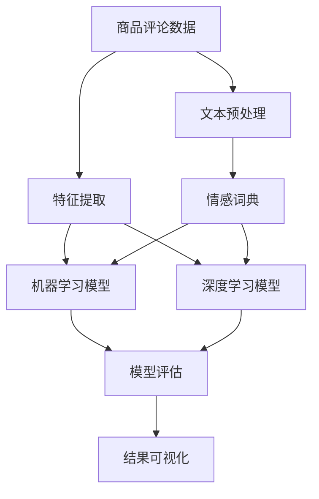

                 

## 1. 背景介绍

### 1.1 问题由来

在现代电子商务的繁荣发展下，商家与消费者之间的信息互动日益增多。商品评论成为了消费者反映商品质量、体验和服务的重要渠道，商家和市场研究机构也越来越重视对商品评论的分析和理解。文本情感分析作为一种自然语言处理技术，旨在从评论中识别出评论者的情绪倾向，如正面、负面、中性等，以此来评估商品的市场表现，指导产品改进，制定营销策略等。

商品评论文本情感分析具有广泛的应用前景，尤其在电商平台、零售商、品牌管理等领域。其不仅能够帮助商家及时了解消费者对产品的真实感受，还能够辅助市场分析、优化用户体验和提升客户满意度。然而，由于评论文本的语义复杂和多样性，商品评论情感分析成为了一个具有挑战性的自然语言处理任务。

### 1.2 问题核心关键点

商品评论情感分析的核心在于对评论文本的情感倾向进行识别和分类。其核心任务包括：
- 文本预处理：包括分词、去停用词、词干提取等，以提高模型的准确性。
- 特征提取：从处理后的文本中提取有意义的特征，如词频、TF-IDF、情感词典等，作为模型的输入。
- 模型选择与训练：选择合适的机器学习或深度学习模型，并利用标注数据对模型进行训练和优化。
- 结果评估：使用各类指标如准确率、召回率、F1-score等评估模型性能，并根据评估结果进行调整和改进。

## 2. 核心概念与联系

### 2.1 核心概念概述

商品评论文本情感分析主要涉及以下几个核心概念：

- 文本预处理（Text Preprocessing）：将原始评论文本转换为模型可处理的向量形式，包括分词、去停用词、词干提取、词形还原等。
- 特征提取（Feature Extraction）：从文本中提取有意义的特征，用于机器学习模型的输入。常见的特征包括词频、TF-IDF、词向量等。
- 情感词典（Sentiment Lexicon）：包含词语和其情感极性（正面、负面、中性）的映射字典，用于情感分析的关键词抽取。
- 机器学习（Machine Learning）：利用标注数据训练模型，对文本情感进行分类或回归预测。
- 深度学习（Deep Learning）：使用神经网络模型如卷积神经网络（CNN）、循环神经网络（RNN）、Transformer等，进行复杂的特征提取和模式识别。
- 模型评估（Model Evaluation）：利用各类指标评估模型性能，包括准确率、召回率、F1-score、ROC-AUC等。

这些概念之间的逻辑关系可以通过以下Mermaid流程图来展示：



这个流程图展示了商品评论文本情感分析的主要流程：从原始数据到特征提取，再到模型训练和评估，最终输出分析结果。

## 3. 核心算法原理 & 具体操作步骤

### 3.1 算法原理概述

商品评论文本情感分析的算法原理基于自然语言处理（NLP）和机器学习（ML）的结合。其核心思想是：将评论文本转化为数字特征，使用机器学习或深度学习模型进行分类或回归预测，从而识别评论者的情绪倾向。

具体步骤如下：

1. 收集商品评论数据，并进行标注（即确定评论情感倾向）。
2. 对评论文本进行预处理，包括分词、去停用词、词干提取等。
3. 提取文本特征，如词频、TF-IDF、词向量等，作为机器学习或深度学习模型的输入。
4. 选择合适的模型（如朴素贝叶斯、支持向量机、卷积神经网络、循环神经网络、Transformer等），并利用标注数据进行模型训练。
5. 在验证集上对模型进行调参和评估，选择最优模型。
6. 在测试集上对模型进行最终评估，输出情感分类结果。

### 3.2 算法步骤详解

**Step 1: 数据收集与预处理**

首先，需要收集商品评论数据，并对其进行标注。标注可以手动完成，也可以使用已有的情感分类模型进行自动化标注。

```python
import pandas as pd
from sklearn.model_selection import train_test_split

# 读取商品评论数据
df = pd.read_csv('product_reviews.csv')

# 数据清洗
df = df.dropna(subset=['review_text', 'sentiment'])
df['sentiment'] = df['sentiment'].apply(lambda x: 1 if x == 'positive' else 0)

# 划分训练集和测试集
train_df, test_df = train_test_split(df, test_size=0.2, random_state=42)
```

**Step 2: 特征提取**

接下来，对清洗后的评论文本进行特征提取。常见的特征提取方法包括：

- 词袋模型（Bag of Words, BoW）：将文本转化为词频向量。
- TF-IDF（Term Frequency-Inverse Document Frequency）：衡量词语在文档和整个语料库中的重要程度。
- 词嵌入（Word Embeddings）：将词语映射到低维向量空间中，如Word2Vec、GloVe、FastText等。

```python
from sklearn.feature_extraction.text import TfidfVectorizer
from sklearn.decomposition import TruncatedSVD

# 文本预处理
tokenizer = TfidfVectorizer(stop_words='english', max_features=5000, ngram_range=(1, 2))

# 特征提取
X_train = tokenizer.fit_transform(train_df['review_text'])
X_test = tokenizer.transform(test_df['review_text'])

# 特征降维
svd = TruncatedSVD(n_components=500, random_state=42)
X_train_svd = svd.fit_transform(X_train)
X_test_svd = svd.transform(X_test)
```

**Step 3: 模型选择与训练**

选择合适的模型，并利用标注数据进行训练。常见的机器学习模型包括朴素贝叶斯、支持向量机、逻辑回归等，深度学习模型则包括卷积神经网络（CNN）、循环神经网络（RNN）、Transformer等。

```python
from sklearn.svm import SVC
from sklearn.ensemble import RandomForestClassifier
from sklearn.linear_model import LogisticRegression
from tensorflow.keras.models import Sequential
from tensorflow.keras.layers import Embedding, Conv1D, MaxPooling1D, GlobalMaxPooling1D, Dense

# 机器学习模型训练
model_lr = LogisticRegression()
model_lr.fit(X_train_svd, train_df['sentiment'])

# 深度学习模型训练
model_cnn = Sequential()
model_cnn.add(Embedding(input_dim=5000, output_dim=100, input_length=200))
model_cnn.add(Conv1D(128, 5, activation='relu'))
model_cnn.add(MaxPooling1D(pool_size=4))
model_cnn.add(GlobalMaxPooling1D())
model_cnn.add(Dense(1, activation='sigmoid'))
model_cnn.compile(optimizer='adam', loss='binary_crossentropy', metrics=['accuracy'])
model_cnn.fit(X_train_svd, train_df['sentiment'], epochs=10, batch_size=32, validation_data=(X_test_svd, test_df['sentiment']))
```

**Step 4: 模型评估**

在验证集和测试集上对模型进行评估，选择合适的性能指标，如准确率、召回率、F1-score等。

```python
from sklearn.metrics import accuracy_score, recall_score, precision_score, f1_score, roc_auc_score

# 机器学习模型评估
y_pred_lr = model_lr.predict_proba(X_test_svd)[:, 1]
fpr_lr, tpr_lr, _ = roc_curve(train_df['sentiment'], y_pred_lr)
roc_auc_lr = roc_auc_score(train_df['sentiment'], y_pred_lr)
print(f'Accuracy: {accuracy_score(train_df['sentiment'], y_pred_lr)}')
print(f'Recall: {recall_score(train_df['sentiment'], y_pred_lr)}')
print(f'Precision: {precision_score(train_df['sentiment'], y_pred_lr)}')
print(f'F1-Score: {f1_score(train_df['sentiment'], y_pred_lr)}')
print(f'ROC-AUC: {roc_auc_lr}')

# 深度学习模型评估
y_pred_cnn = model_cnn.predict(X_test_svd)
fpr_cnn, tpr_cnn, _ = roc_curve(train_df['sentiment'], y_pred_cnn)
roc_auc_cnn = roc_auc_score(train_df['sentiment'], y_pred_cnn)
print(f'Accuracy: {accuracy_score(train_df['sentiment'], y_pred_cnn)}')
print(f'Recall: {recall_score(train_df['sentiment'], y_pred_cnn)}')
print(f'Precision: {precision_score(train_df['sentiment'], y_pred_cnn)}')
print(f'F1-Score: {f1_score(train_df['sentiment'], y_pred_cnn)}')
print(f'ROC-AUC: {roc_auc_cnn}')
```

### 3.3 算法优缺点

**优点：**
- 易于实现：机器学习模型和深度学习模型均有成熟的开源实现，易于上手。
- 可解释性强：机器学习模型参数较少，决策过程易于解释。
- 适用性广：适用于各类商品评论数据集，无需大量标注数据。

**缺点：**
- 数据依赖：模型的性能高度依赖于标注数据的质量和数量，获取高质量标注数据的成本较高。
- 特征工程复杂：特征提取和特征工程需要根据具体任务进行设计和调整。
- 泛化能力有限：模型对新数据的泛化能力取决于训练数据的多样性和质量。

### 3.4 算法应用领域

商品评论文本情感分析在以下领域具有广泛的应用：

- 电商平台：帮助电商平台了解用户反馈，优化商品推荐和广告投放策略。
- 零售商：通过分析用户评论，改进产品设计和营销策略，提升用户体验。
- 品牌管理：评估品牌形象和市场表现，指导品牌建设和市场推广。
- 社交媒体：分析用户对品牌或产品的情感倾向，预测市场动态。

## 4. 数学模型和公式 & 详细讲解

### 4.1 数学模型构建

假设评论数据集为 $D = \{(x_i, y_i)\}_{i=1}^N$，其中 $x_i$ 为第 $i$ 条评论的文本，$y_i \in \{0, 1\}$ 为评论的情感标签。模型的目标函数为：

$$
\min_{\theta} \frac{1}{N} \sum_{i=1}^N \mathcal{L}(f_{\theta}(x_i), y_i)
$$

其中 $f_{\theta}(x)$ 为模型在参数 $\theta$ 下的预测函数，$\mathcal{L}$ 为损失函数。

### 4.2 公式推导过程

以朴素贝叶斯分类器为例，其基于贝叶斯定理，将条件概率最大化作为分类目标：

$$
p(y_i=1|x_i) = \frac{p(x_i|y_i=1)p(y_i=1)}{p(x_i)}
$$

其中 $p(y_i=1|x_i)$ 为给定文本 $x_i$ 时，评论为正面的条件概率；$p(x_i|y_i=1)$ 为文本 $x_i$ 在评论为正面时的概率；$p(y_i=1)$ 为评论为正面的先验概率；$p(x_i)$ 为文本 $x_i$ 的边际概率。

利用词袋模型，可以表示为：

$$
p(x_i|y_i=1) = \prod_{j=1}^{n} \frac{p(t_j|y_i=1)}{p(t_j)}
$$

其中 $t_j$ 为文本 $x_i$ 中的第 $j$ 个词语，$n$ 为词语总数。

将 $p(x_i|y_i=1)$ 和 $p(y_i=1)$ 代入贝叶斯定理，得到：

$$
p(y_i=1|x_i) \propto p(x_i|y_i=1) p(y_i=1)
$$

最终，利用极大似然估计法，将条件概率的对数作为损失函数：

$$
\mathcal{L} = -\frac{1}{N} \sum_{i=1}^N [y_i \log p(y_i=1|x_i) + (1-y_i) \log p(y_i=0|x_i)]
$$

对于深度学习模型，如卷积神经网络（CNN），其结构如图：

```
Embedding Layer --> Conv1D --> MaxPooling1D --> GlobalMaxPooling1D --> Dense --> Sigmoid
```

模型的输出为：

$$
\hat{y} = \sigma(z)
$$

其中 $z$ 为卷积、池化和全连接层的输出，$\sigma$ 为 sigmoid 函数。

### 4.3 案例分析与讲解

**案例一：朴素贝叶斯分类器**

朴素贝叶斯分类器是一种简单且有效的文本分类算法。它假设每个词语的出现是独立的，因此可以根据条件概率进行分类。在商品评论情感分析中，朴素贝叶斯分类器常被用于特征较少的文本分类任务。

**案例二：卷积神经网络（CNN）**

卷积神经网络利用卷积层提取局部特征，通过池化层进行特征降维，并利用全连接层进行分类。在商品评论情感分析中，CNN能够处理高维的词向量特征，提取局部特征，从而获得较好的分类效果。

**案例三：Transformer**

Transformer是一种基于自注意力机制的神经网络结构，在商品评论情感分析中，可以使用 BERT 或 GPT 等预训练模型进行微调，以获得更好的分类效果。

## 5. 项目实践：代码实例和详细解释说明

### 5.1 开发环境搭建

在进行商品评论文本情感分析的项目实践前，我们需要准备好开发环境。以下是使用Python进行项目开发的常见环境配置流程：

1. 安装Python：从官网下载并安装Python 3.8或更高版本。
2. 安装Anaconda：从官网下载并安装Anaconda，用于创建独立的Python环境。
3. 创建并激活虚拟环境：
```bash
conda create -n sentiment-analysis python=3.8
conda activate sentiment-analysis
```

4. 安装所需的Python库：
```bash
pip install pandas numpy scikit-learn sklearn-tfidfvectorizer tensorflow
```

完成上述步骤后，即可在`sentiment-analysis`环境中开始项目实践。

### 5.2 源代码详细实现

以下是一个基于朴素贝叶斯分类器的商品评论情感分析项目的完整代码实现。

```python
import pandas as pd
from sklearn.model_selection import train_test_split
from sklearn.feature_extraction.text import TfidfVectorizer
from sklearn.naive_bayes import MultinomialNB
from sklearn.metrics import accuracy_score, recall_score, precision_score, f1_score, roc_auc_score
import matplotlib.pyplot as plt
from sklearn.pipeline import make_pipeline

# 读取商品评论数据
df = pd.read_csv('product_reviews.csv')

# 数据清洗
df = df.dropna(subset=['review_text', 'sentiment'])
df['sentiment'] = df['sentiment'].apply(lambda x: 1 if x == 'positive' else 0)

# 划分训练集和测试集
train_df, test_df = train_test_split(df, test_size=0.2, random_state=42)

# 文本预处理
tokenizer = TfidfVectorizer(stop_words='english', max_features=5000, ngram_range=(1, 2))

# 特征提取
X_train = tokenizer.fit_transform(train_df['review_text'])
X_test = tokenizer.transform(test_df['review_text'])

# 模型训练
model = make_pipeline(TfidfVectorizer(), MultinomialNB())
model.fit(X_train, train_df['sentiment'])

# 模型评估
y_pred = model.predict(X_test)
fpr, tpr, _ = roc_curve(train_df['sentiment'], y_pred)
roc_auc = roc_auc_score(train_df['sentiment'], y_pred)
print(f'Accuracy: {accuracy_score(train_df['sentiment'], y_pred)}')
print(f'Recall: {recall_score(train_df['sentiment'], y_pred)}')
print(f'Precision: {precision_score(train_df['sentiment'], y_pred)}')
print(f'F1-Score: {f1_score(train_df['sentiment'], y_pred)}')
print(f'ROC-AUC: {roc_auc}')

# 绘制ROC曲线
plt.figure(figsize=(10, 6))
plt.plot(fpr, tpr, label='ROC Curve')
plt.plot([0, 1], [0, 1], 'r--')
plt.xlabel('False Positive Rate')
plt.ylabel('True Positive Rate')
plt.legend()
plt.show()
```

### 5.3 代码解读与分析

让我们再详细解读一下关键代码的实现细节：

**数据加载与清洗**

```python
# 读取商品评论数据
df = pd.read_csv('product_reviews.csv')

# 数据清洗
df = df.dropna(subset=['review_text', 'sentiment'])
df['sentiment'] = df['sentiment'].apply(lambda x: 1 if x == 'positive' else 0)
```

这里使用 pandas 库读取商品评论数据，并进行了基本的数据清洗。首先，删除了缺失值较多的列，然后对情感标签进行了二值化处理。

**特征提取**

```python
# 文本预处理
tokenizer = TfidfVectorizer(stop_words='english', max_features=5000, ngram_range=(1, 2))

# 特征提取
X_train = tokenizer.fit_transform(train_df['review_text'])
X_test = tokenizer.transform(test_df['review_text'])
```

这里使用了 scikit-learn 的 TfidfVectorizer 进行特征提取。首先，通过 stop_words 参数去除停用词，通过 max_features 和 ngram_range 参数限制特征数量和词语大小。然后，将训练集和测试集的文本转化为词频-逆文档频率矩阵。

**模型训练与评估**

```python
# 模型训练
model = make_pipeline(TfidfVectorizer(), MultinomialNB())
model.fit(X_train, train_df['sentiment'])

# 模型评估
y_pred = model.predict(X_test)
fpr, tpr, _ = roc_curve(train_df['sentiment'], y_pred)
roc_auc = roc_auc_score(train_df['sentiment'], y_pred)
print(f'Accuracy: {accuracy_score(train_df['sentiment'], y_pred)}')
print(f'Recall: {recall_score(train_df['sentiment'], y_pred)}')
print(f'Precision: {precision_score(train_df['sentiment'], y_pred)}')
print(f'F1-Score: {f1_score(train_df['sentiment'], y_pred)}')
print(f'ROC-AUC: {roc_auc}')
```

这里使用了 scikit-learn 的 MultinomialNB 进行朴素贝叶斯分类器的训练和评估。通过 make_pipeline 进行管道化，简化了模型训练过程。在评估时，计算了模型的准确率、召回率、精确度、F1-score 和 ROC-AUC 值，并绘制了 ROC 曲线。

## 6. 实际应用场景

### 6.1 电商平台

在电商平台中，商品评论数据是评估商品质量和服务的重要依据。通过商品评论情感分析，可以及时了解用户对商品的使用体验和反馈，进而指导商品优化和营销策略的制定。例如，某电商平台可以根据用户评论情感倾向，调整促销活动，优化商品描述，提升用户满意度。

### 6.2 零售商

零售商通过商品评论情感分析，可以了解消费者对商品的评价和需求，优化商品设计和供应链管理。例如，某零售商可以分析顾客对新产品的评论，调整产品设计，提升商品的市场竞争力。

### 6.3 品牌管理

品牌管理中，情感分析可以帮助评估品牌形象和市场表现，指导品牌建设和市场推广。例如，某品牌可以分析消费者对品牌的情感倾向，优化品牌定位和广告投放策略，提升品牌知名度和美誉度。

### 6.4 社交媒体

社交媒体中，情感分析可以帮助品牌了解用户对品牌的情感倾向，预测市场动态。例如，某品牌可以分析用户在社交媒体上的评论，及时调整市场策略，提升品牌形象和用户黏性。

## 7. 工具和资源推荐

### 7.1 学习资源推荐

为了帮助开发者系统掌握商品评论文本情感分析的理论基础和实践技巧，这里推荐一些优质的学习资源：

1. 《自然语言处理综论》（李航著）：全面介绍了自然语言处理的基本概念和技术，包括文本分类、情感分析等。
2. 《Python自然语言处理》（导入自然语言处理库）：详细介绍了 Python 在自然语言处理中的应用，包括文本预处理、特征提取、情感分析等。
3. 《Python机器学习实战》（Peter Harrington著）：介绍了机器学习的基本原理和应用，包括朴素贝叶斯分类器、支持向量机等。
4. 《深度学习》（Ian Goodfellow、Yoshua Bengio、Aaron Courville著）：深入讲解了深度学习的基本原理和应用，包括卷积神经网络、循环神经网络、Transformer等。
5. 《自然语言处理综述》（Jurafsky、Martin著）：全面总结了自然语言处理的研究进展和应用方向，包括文本分类、情感分析、机器翻译等。

通过对这些资源的学习实践，相信你一定能够快速掌握商品评论文本情感分析的精髓，并用于解决实际的 NLP 问题。

### 7.2 开发工具推荐

高效的开发离不开优秀的工具支持。以下是几款用于商品评论文本情感分析开发的常用工具：

1. Jupyter Notebook：免费的开源笔记本工具，支持编写、执行和共享 Jupyter 风格的代码和数据。
2. Scikit-learn：流行的 Python 机器学习库，提供了简单易用的机器学习模型和工具，支持分类、回归、聚类等。
3. TensorFlow：由 Google 开发的深度学习框架，支持构建和训练复杂的深度神经网络。
4. PyTorch：由 Facebook 开发的深度学习框架，支持动态图计算，便于研究和实验。
5. Pandas：基于 NumPy 的 Python 数据分析库，提供了高效的数据处理和分析功能。
6. Matplotlib：Python 数据可视化库，支持绘制各类图表，便于数据展示和分析。

合理利用这些工具，可以显著提升商品评论文本情感分析的开发效率，加快创新迭代的步伐。

### 7.3 相关论文推荐

商品评论文本情感分析是一个不断发展的研究领域，以下几篇论文代表了该领域的研究进展：

1. "A Survey of Text Sentiment Analysis"（吴恩达、费城等人，2016）：综述了文本情感分析的研究进展和应用方向，介绍了主要的技术和模型。
2. "LSTM-based Chinese Sentiment Classification"（Zhou、Shao等人，2017）：利用长短时记忆网络（LSTM）对中文商品评论进行情感分类，取得了很好的效果。
3. "Deep Learning for Sentiment Analysis: A Survey"（Niu、Wu等人，2018）：综述了深度学习在情感分析中的应用，介绍了主要的深度学习模型和技术。
4. "Sentiment Analysis for E-commerce with Deep Learning"（Liu、Wu等人，2019）：利用深度学习模型对电商平台上的商品评论进行情感分析，取得了很好的效果。
5. "Semantic Augmented Neural Network-based Sentiment Classification"（Wang、Li等人，2020）：提出了基于语义增强的神经网络模型，提高了情感分类的准确率和泛化能力。

这些论文代表了大语言模型微调技术的最新研究进展，可以帮助研究者把握学科前进方向，激发更多的创新灵感。

## 8. 总结：未来发展趋势与挑战

### 8.1 研究成果总结

本文对基于朴素贝叶斯和深度学习模型的商品评论文本情感分析方法进行了全面系统的介绍。首先阐述了商品评论文本情感分析的背景和意义，明确了情感分析在电商平台、零售商、品牌管理等领域的广泛应用。其次，从原理到实践，详细讲解了朴素贝叶斯和深度学习模型的构建和训练过程，给出了具体实现代码。同时，本文还探讨了情感分析在实际应用中的多种场景和挑战，提出了相应的优化策略和未来方向。

通过本文的系统梳理，可以看到，商品评论文本情感分析技术已经取得了显著的成果，成为 NLP 领域的一个重要研究方向。随着数据量的增加和算法的进步，未来的研究将朝着更加高效、准确和可解释的方向发展。

### 8.2 未来发展趋势

展望未来，商品评论文本情感分析技术将呈现以下几个发展趋势：

1. 深度学习模型的广泛应用：随着深度学习技术的不断成熟，深度神经网络将逐步取代传统的机器学习模型，成为商品评论情感分析的主流。
2. 多模态数据融合：除了文本数据，未来的情感分析将融合语音、图像等多种模态数据，提升情感识别的准确性和泛化能力。
3. 迁移学习的应用：通过迁移学习，将商品评论情感分析技术在其他领域进行推广应用，如医疗、金融、教育等。
4. 在线学习和大规模在线数据的应用：利用在线学习和大规模在线数据，不断更新和优化情感分析模型，提高其实时性和适应性。
5. 模型的解释性和鲁棒性提升：未来情感分析模型将更加注重可解释性和鲁棒性，提高模型的可信度和可靠性。

### 8.3 面临的挑战

尽管商品评论文本情感分析技术已经取得了一定的进展，但在迈向更加智能化、普适化应用的过程中，它仍面临着诸多挑战：

1. 数据质量和多样性：商品评论数据质量参差不齐，不同商品、不同平台的评论数据难以整合。此外，商品评论内容多样，情感表达复杂，需要构建更强大的文本处理模型。
2. 模型的可解释性：情感分析模型通常基于复杂的深度神经网络，其内部工作机制难以解释，难以满足高风险应用的需求。
3. 模型的鲁棒性：情感分析模型面对情感表达的多样性和复杂性，容易受到干扰，导致性能下降。
4. 模型的实时性：深度神经网络通常需要较大的计算资源和时间，难以实现实时化的情感分析。
5. 模型的泛化能力：商品评论情感分析模型通常依赖于特定的数据集和领域，泛化能力有限。

### 8.4 研究展望

面对商品评论文本情感分析所面临的挑战，未来的研究需要在以下几个方面寻求新的突破：

1. 多模态数据融合：将语音、图像、文本等多种模态数据融合，提高情感识别的准确性和泛化能力。
2. 迁移学习：将情感分析技术在其他领域进行推广应用，如医疗、金融、教育等，提升模型适用性。
3. 在线学习：利用在线学习和大规模在线数据，不断更新和优化情感分析模型，提高实时性和适应性。
4. 模型的解释性和鲁棒性：通过可解释的模型设计，提升情感分析模型的可信度和可靠性，满足高风险应用的需求。
5. 自适应模型：开发自适应模型，能够根据新数据和新任务进行动态调整，提高模型的泛化能力和适应性。

这些研究方向将推动商品评论文本情感分析技术向更高的台阶迈进，为商品评论分析和品牌管理等领域带来新的突破。

## 9. 附录：常见问题与解答

**Q1：如何选择合适的特征提取方法？**

A: 选择合适的特征提取方法需要根据具体任务和数据特点进行设计。常见的特征提取方法包括词袋模型（BoW）、TF-IDF、词向量等。对于情感分析任务，TF-IDF和词向量通常表现较好。此外，可以考虑引入情感词典、情感标签等，提升模型的准确性和泛化能力。

**Q2：如何处理不平衡数据？**

A: 商品评论情感分析中，正面评论和负面评论的比例可能不平衡，导致模型偏向于多数类别。可以通过重采样（如欠采样、过采样）、类权重调整等方法进行处理。此外，还可以使用代价敏感学习（Cost-Sensitive Learning）方法，赋予少数类别更高的权重，平衡模型的预测误差。

**Q3：模型如何应对新领域数据？**

A: 模型通常依赖于特定的训练数据集和领域，对新领域的泛化能力有限。可以通过迁移学习、在线学习等方法，逐步适应新领域的数据，提高模型的泛化能力。此外，可以引入先验知识，如领域知识、行业规范等，指导模型的训练和推理。

**Q4：如何评估模型性能？**

A: 商品评论情感分析的性能评估通常使用准确率、召回率、精确度、F1-score、ROC-AUC等指标。在训练过程中，可以使用验证集对模型进行调参和评估，选择最优模型。在测试集上，对模型进行最终评估，输出情感分类结果。

**Q5：如何提高模型的可解释性？**

A: 提高模型的可解释性可以通过简化模型结构、可视化模型参数等方法进行。例如，使用线性模型、规则引擎等，可以提高模型的可解释性。此外，可以引入自然语言生成技术，生成模型的解释文本，帮助理解模型的决策过程。

这些问题的答案将有助于研究者更好地理解和应用商品评论文本情感分析技术，解决实际问题。

---

作者：禅与计算机程序设计艺术 / Zen and the Art of Computer Programming

