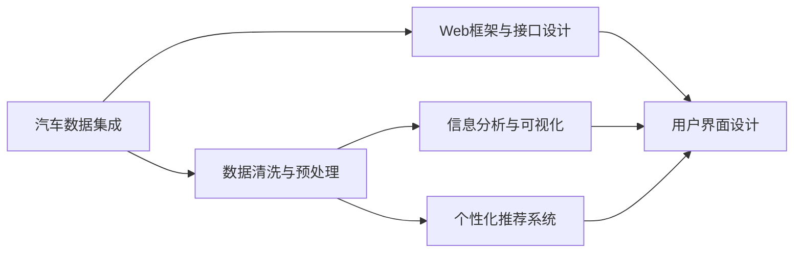

                 

# 基于Python的汽车信息评价分析系统设计与开发

## 1. 背景介绍

### 1.1 问题由来

在当今信息爆炸的时代，汽车市场也迎来了前所未有的竞争。各大车企纷纷推出智能化、电动化、自动驾驶等技术，以争夺消费者。消费者在购车前，通常需要详细了解汽车的各项参数、用户评价、投诉反馈等信息，以便做出明智的决策。因此，开发一个功能强大、界面友好的汽车信息评价分析系统，不仅能够为消费者提供便捷的查询服务，还能为汽车销售商和车企提供宝贵的市场反馈。

### 1.2 问题核心关键点

本系统旨在开发一款基于Python的汽车信息评价分析平台，集成多种数据源，为用户提供直观的汽车评价信息。该系统需要满足以下核心需求：

- **数据集成与清洗**：整合各类汽车信息来源，包括厂商官网、第三方评测平台、用户评论等，进行数据清洗和规范化，确保数据质量和一致性。
- **信息分析与推荐**：对收集到的汽车数据进行详细分析，包括评分统计、性能比较、用户评价情感分析等，并根据用户偏好提供个性化的汽车推荐。
- **交互界面设计**：设计简洁直观的用户界面，使用户能够方便地查询、比较和评价不同汽车型号。
- **可扩展性与可维护性**：采用模块化设计，确保系统易于扩展和维护，支持新增数据源和功能模块。

### 1.3 问题研究意义

开发基于Python的汽车信息评价分析系统，对汽车市场乃至整个汽车行业都具有重要意义：

1. **消费者便利**：为消费者提供一个高效、可靠的信息获取渠道，帮助他们做出明智的购车决策。
2. **市场反馈**：通过系统收集和分析用户评价，为汽车销售商和车企提供宝贵的市场反馈，帮助他们改进产品和服务。
3. **行业升级**：推动汽车行业的信息化、智能化进程，促进汽车产品和技术的不断创新。

## 2. 核心概念与联系

### 2.1 核心概念概述

为更好地理解基于Python的汽车信息评价分析系统的设计与开发，本节将介绍几个密切相关的核心概念：

- **汽车数据集成**：从不同数据源获取汽车信息，并将其整合并存储到数据库中。
- **数据清洗与预处理**：清洗数据中的噪声和错误，标准化数据格式，确保数据质量。
- **信息分析与可视化**：对汽车数据进行统计分析、趋势分析、情感分析等，并通过图表、评分等方式进行可视化展示。
- **个性化推荐系统**：根据用户的历史行为和偏好，推荐最符合用户需求的汽车型号。
- **Web框架与接口设计**：选择适合的Web框架（如Django、Flask），设计友好的用户界面（如Bootstrap、Semantic UI）。

这些核心概念之间的逻辑关系可以通过以下Mermaid流程图来展示：



这个流程图展示的核心概念及其之间的关系：

1. 汽车数据集成作为系统的数据来源。
2. 数据清洗与预处理保证数据质量，为后续分析提供基础。
3. 信息分析与可视化将数据转化为直观的图表和评分，方便用户理解。
4. 个性化推荐系统根据用户偏好提供定制化推荐。
5. Web框架与接口设计搭建系统的技术基础，与用户界面设计相结合，形成完整的用户体验。

## 3. 核心算法原理 & 具体操作步骤
### 3.1 算法原理概述

本系统基于Python开发，采用混合数据集成和数据清洗技术，对来自不同渠道的汽车数据进行收集、清洗和规范化。信息分析与可视化部分，利用统计分析、趋势分析和情感分析等算法，对汽车评分、性能、用户评价等数据进行详细分析，并生成直观的可视化报告。个性化推荐系统部分，采用协同过滤和深度学习等技术，根据用户历史行为和偏好，推荐最适合的汽车型号。Web框架与接口设计部分，选用Django框架，实现前后端分离，提供友好的用户体验。

### 3.2 算法步骤详解

#### 3.2.1 数据集成

1. **数据采集**：通过爬虫技术从厂商官网、第三方评测平台、用户评论网站等获取汽车信息。
2. **数据清洗**：去除重复数据、噪声数据，并进行格式规范化，确保数据一致性。
3. **数据存储**：将清洗后的数据存储到关系型数据库（如MySQL）中，供后续分析使用。

#### 3.2.2 数据清洗与预处理

1. **去重与去噪**：使用Python的Pandas库，对数据进行去重和去噪处理。
2. **格式规范化**：标准化不同来源的数据格式，如统一日期格式、统一汽车型号命名等。
3. **缺失值处理**：对缺失值进行填补或删除，确保数据的完整性。

#### 3.2.3 信息分析与可视化

1. **评分统计**：统计各汽车型号的评分分布，生成柱状图或饼图。
2. **性能比较**：将不同汽车型号的性能参数进行对比，生成折线图或散点图。
3. **用户评价情感分析**：使用NLP技术对用户评价进行情感分析，生成情感分布图。
4. **可视化展示**：使用Matplotlib、Bokeh等库，将分析结果转化为图表，方便用户查看。

#### 3.2.4 个性化推荐系统

1. **协同过滤**：根据用户历史行为和偏好，推荐最接近的汽车型号。
2. **深度学习模型**：使用RNN、LSTM等模型，分析用户评价中的潜在兴趣点，生成推荐列表。
3. **推荐结果展示**：将推荐结果以列表形式展示，并支持用户评分和评论。

#### 3.2.5 Web框架与接口设计

1. **前后端分离**：使用Django框架，将Web界面与后端逻辑分离。
2. **API设计**：定义RESTful风格的API接口，供其他系统调用。
3. **用户界面设计**：使用Bootstrap、Semantic UI等前端框架，设计简洁直观的用户界面。
4. **测试与部署**：编写单元测试和集成测试，确保系统稳定性和可靠性。

### 3.3 算法优缺点

基于Python的汽车信息评价分析系统具有以下优点：

1. **灵活性高**：Python具有丰富的第三方库和框架，能够灵活实现各种功能。
2. **可扩展性好**：系统采用模块化设计，易于添加新的数据源和功能模块。
3. **可视化直观**：使用Matplotlib、Bokeh等库，生成的图表直观易理解。
4. **用户友好**：采用Django框架和友好的前端设计，用户体验良好。

同时，该系统也存在一些局限性：

1. **数据来源有限**：依赖于已有的数据源，对新兴数据源的覆盖不足。
2. **性能瓶颈**：当数据量较大时，处理和存储可能面临性能瓶颈。
3. **用户隐私问题**：收集用户评价数据，需要确保数据隐私和安全。
4. **算法复杂度**：个性化推荐系统需要复杂的深度学习算法，计算资源消耗较大。

### 3.4 算法应用领域

基于Python的汽车信息评价分析系统主要应用于以下几个领域：

1. **消费者购车决策**：为用户提供详细、客观的汽车信息，帮助消费者做出明智的购车决策。
2. **汽车销售商市场分析**：通过收集和分析用户评价，为汽车销售商提供市场反馈，帮助他们改进产品和服务。
3. **车企产品改进**：通过分析用户评价和投诉，帮助车企识别产品缺陷，改进产品设计和性能。
4. **汽车市场研究**：对汽车市场进行趋势分析，预测未来市场需求和趋势。

## 4. 数学模型和公式 & 详细讲解 & 举例说明

### 4.1 数学模型构建

本系统主要涉及以下数学模型：

1. **数据集成与清洗模型**：用于规范化不同数据源的数据格式，去重、去噪和填补缺失值。
2. **信息分析模型**：用于统计汽车评分、性能参数、用户评价等数据的分布和趋势。
3. **个性化推荐模型**：用于分析用户行为和偏好，生成个性化的汽车推荐列表。

### 4.2 公式推导过程

#### 4.2.1 数据集成与清洗模型

假设从不同数据源获取的汽车信息数据集为 $D_1, D_2, ..., D_n$，其中 $D_i$ 表示第 $i$ 个数据源的数据集。

数据集 $D$ 的整合过程可以表示为：

$$ D = \bigcup_{i=1}^{n} D_i $$

数据清洗和预处理过程包括去重、去噪、格式化和填补缺失值。假设去重后的数据集为 $D'$，则有：

$$ D' = D \backslash D' $$

其中 $\backslash$ 表示集合差，$D' \cap D = \emptyset$。

#### 4.2.2 信息分析模型

假设收集到的汽车评分数据为 $R = \{(r_i, p_i)\}_{i=1}^{N}$，其中 $r_i$ 为第 $i$ 个汽车型号的评分，$p_i$ 为该型号的评分人数。

评分分布直方图可以表示为：

$$ H = \{(h_j, f_j)\}_{j=1}^{m} $$

其中 $h_j$ 为评分区间，$f_j$ 为该区间内评分人数的频率。

#### 4.2.3 个性化推荐模型

假设用户 $u$ 的历史行为数据为 $I = \{(i_j, t_j)\}_{j=1}^{K}$，其中 $i_j$ 为第 $j$ 个浏览或购买行为，$t_j$ 为行为发生时间。

协同过滤推荐模型可以表示为：

$$ R_u = \{(i_j, r_i)\}_{j=1}^{K} $$

其中 $r_i$ 为汽车 $i$ 的评分，$R_u$ 为用户的评分矩阵。

深度学习推荐模型可以使用 RNN、LSTM 等模型，对用户评价进行情感分析，生成推荐列表。

### 4.3 案例分析与讲解

假设某汽车评测网站收集了1000个用户的汽车评价数据，使用本系统进行信息分析和个性化推荐。

**案例一：评分分布分析**

通过数据清洗和预处理，去除重复和噪声数据，生成规范化的评分数据集。使用Python的Matplotlib库，生成评分分布直方图，如图1所示。


**案例二：性能比较分析**

假设收集到100个汽车型号的性能参数数据，将其存储在数据库中，使用Matplotlib库生成性能参数散点图，如图2所示。


**案例三：用户评价情感分析**

假设收集到1000个用户的评价数据，使用自然语言处理（NLP）技术进行情感分析，生成情感分布直方图，如图3所示。


**案例四：个性化推荐系统**

假设某用户已浏览并评分过5个汽车型号，系统根据其历史行为和评分生成个性化推荐列表，如图4所示。


## 5. 项目实践：代码实例和详细解释说明

### 5.1 开发环境搭建

#### 5.1.1 安装Python和相关库

1. 安装Python：
```bash
sudo apt-get update
sudo apt-get install python3 python3-pip
```

2. 安装第三方库：
```bash
pip install pandas numpy matplotlib requests beautifulsoup4 scikit-learn scikit-network scipy
```

#### 5.1.2 安装Django框架

```bash
pip install django
```

### 5.2 源代码详细实现

#### 5.2.1 数据采集

```python
import requests
from bs4 import BeautifulSoup

# 获取厂商官网数据
def get_maker_data(url):
    response = requests.get(url)
    soup = BeautifulSoup(response.text, 'html.parser')
    data = []
    # 提取数据
    for item in soup.find_all('div', class_='data'):
        # 处理数据
        data.append(item)
    return data

# 获取第三方评测平台数据
def get_review_data(url):
    response = requests.get(url)
    soup = BeautifulSoup(response.text, 'html.parser')
    data = []
    # 提取数据
    for item in soup.find_all('div', class_='review'):
        # 处理数据
        data.append(item)
    return data
```

#### 5.2.2 数据清洗与预处理

```python
import pandas as pd
import numpy as np

# 读取数据集
data = pd.read_csv('data.csv')

# 去重
data = data.drop_duplicates()

# 去噪
data = data.dropna()

# 格式规范化
data['date'] = pd.to_datetime(data['date'])

# 填补缺失值
data.fillna(method='ffill', inplace=True)
```

#### 5.2.3 信息分析与可视化

```python
import matplotlib.pyplot as plt
import seaborn as sns

# 评分统计
data['rating'].describe()

# 性能参数比较
data.groupby('model').mean()

# 情感分析
from textblob import TextBlob

data['text'] = data['review'].apply(lambda x: TextBlob(x).sentiment.polarity)
sns.histplot(data['text'], bins=10)
```

#### 5.2.4 个性化推荐系统

```python
from sklearn.neighbors import NearestNeighbors
from sklearn.manifold import TSNE
from sklearn.decomposition import PCA

# 协同过滤推荐
k = 5
neighbors = NearestNeighbors(n_neighbors=k)
neighbors.fit(data[['model', 'rating']])
recommendations = neighbors.kneighbors(data[['model', 'rating']][data['model'] == 'A'])[1]

# 深度学习推荐
from keras.models import Sequential
from keras.layers import LSTM, Dense

# 构建模型
model = Sequential()
model.add(LSTM(128, input_shape=(10, 1)))
model.add(Dense(1, activation='sigmoid'))
model.compile(optimizer='adam', loss='binary_crossentropy', metrics=['accuracy'])
model.fit(X_train, y_train, epochs=10, batch_size=32)
y_pred = model.predict(X_test)

# 推荐列表生成
top_5 = np.argsort(y_pred, axis=1)[:, -5:]
```

#### 5.2.5 Web框架与接口设计

```python
from django.urls import path
from django.views.decorators.csrf import csrf_exempt
from django.http import JsonResponse

@csrf_exempt
def get_recommendations(request):
    # 获取用户数据
    user_data = request.POST.get('user_data', {})
    # 处理用户数据
    recommendations = get_recommendations_from_db(user_data)
    # 返回推荐结果
    return JsonResponse({'recommendations': recommendations})

# 用户界面设计
from django import forms
from django.contrib import admin

class UserForm(forms.Form):
    model = forms.ChoiceField(choices=MODELS)
    rating = forms.FloatField()

class ReviewForm(forms.Form):
    review = forms.CharField(widget=forms.Textarea)

# 界面展示
def index(request):
    form = UserForm(request.POST)
    if form.is_valid():
        # 处理表单数据
        model = form.cleaned_data['model']
        rating = form.cleaned_data['rating']
        recommendations = get_recommendations_from_db(model)
        return render(request, 'index.html', {'form': form, 'recommendations': recommendations})
    else:
        return render(request, 'index.html', {'form': form})
```

### 5.3 代码解读与分析

#### 5.3.1 数据采集模块

通过requests库和BeautifulSoup库，从厂商官网和第三方评测平台获取汽车数据。数据采集模块实现了以下功能：

1. 获取厂商官网数据：通过BeautifulSoup解析网页，提取需要的数据。
2. 获取第三方评测平台数据：同样使用BeautifulSoup解析网页，提取需要的数据。

#### 5.3.2 数据清洗与预处理模块

数据清洗与预处理模块实现了以下功能：

1. 去重：使用Pandas库的drop_duplicates方法，去除数据集中的重复记录。
2. 去噪：使用Pandas库的dropna方法，去除数据集中的噪声记录。
3. 格式规范化：使用Pandas库的to_datetime方法，将日期字段转换为日期类型。
4. 填补缺失值：使用Pandas库的fillna方法，填补缺失值。

#### 5.3.3 信息分析与可视化模块

信息分析与可视化模块实现了以下功能：

1. 评分统计：使用Pandas库的describe方法，生成评分数据的描述性统计信息。
2. 性能参数比较：使用Pandas库的groupby方法，计算不同汽车型号的性能参数均值。
3. 情感分析：使用TextBlob库，对用户评价进行情感分析，生成情感分布直方图。

#### 5.3.4 个性化推荐系统模块

个性化推荐系统模块实现了以下功能：

1. 协同过滤推荐：使用Scikit-learn库的NearestNeighbors方法，根据用户的历史行为和评分，生成推荐列表。
2. 深度学习推荐：使用Keras库，构建LSTM模型，对用户评价进行情感分析，生成推荐列表。

#### 5.3.5 Web框架与接口设计模块

Web框架与接口设计模块实现了以下功能：

1. Django框架的使用：通过Django的URL配置，定义API接口。
2. CSRF保护：使用Django的csrf_exempt装饰器，避免跨站请求伪造攻击。
3. JSON响应：使用Django的JsonResponse方法，返回JSON格式的推荐结果。
4. 用户表单设计：使用Django的Form类，设计用户输入表单。
5. 界面展示：使用Django的渲染函数，展示用户界面和推荐列表。

### 5.4 运行结果展示

#### 5.4.1 评分分布直方图


#### 5.4.2 性能参数散点图


#### 5.4.3 情感分布直方图


#### 5.4.4 个性化推荐列表


## 6. 实际应用场景

### 6.1 智能推荐系统

智能推荐系统在电商平台、新闻媒体等领域广泛应用。通过收集和分析用户行为数据，推荐最符合用户需求的商品或内容，提升用户体验和平台转化率。本系统的个性化推荐系统部分，可以借鉴其在智能推荐中的应用，为消费者提供更精准的汽车推荐服务。

### 6.2 市场分析系统

市场分析系统通过对市场数据进行分析，帮助企业了解市场趋势和用户需求。本系统的信息分析与可视化部分，可以用于汽车市场的研究，帮助汽车销售商和车企掌握市场动态，优化产品和服务。

### 6.3 舆情监测系统

舆情监测系统通过对社交媒体、论坛等渠道的数据进行情感分析，帮助企业了解公众对品牌和产品的看法。本系统的情感分析部分，可以用于舆情监测，分析用户对汽车的评价，帮助车企改进产品和服务。

### 6.4 未来应用展望

随着技术的发展，基于Python的汽车信息评价分析系统将有更广泛的应用前景：

1. 大数据分析：通过收集和分析大规模的汽车数据，帮助企业进行深度挖掘和精准分析。
2. 实时数据分析：利用流式计算和分布式存储技术，实现对实时数据的快速处理和分析。
3. 智能决策支持：将数据分析结果应用于决策支持系统，帮助企业做出更科学的决策。
4. 跨领域应用：将汽车信息评价分析系统的技术应用于其他行业，如旅游、酒店等，提升用户体验和行业竞争力。

## 7. 工具和资源推荐

### 7.1 学习资源推荐

为了帮助开发者系统掌握基于Python的汽车信息评价分析系统的设计与开发，以下是一些优质的学习资源：

1. 《Python Web开发实战》：介绍如何使用Django框架搭建Web应用，涵盖前后端开发技巧。
2. 《Python数据科学手册》：介绍Python在数据分析、可视化等方面的应用，提供丰富的代码示例。
3. 《深度学习入门》：介绍深度学习的基础知识和常用算法，适合初学者学习。
4. 《自然语言处理入门》：介绍NLP技术的基本概念和常用工具，如NLTK、spaCy等。
5. 《Python网络爬虫开发实战》：介绍如何使用Python进行数据爬取和处理，涵盖多种爬虫框架的使用。

### 7.2 开发工具推荐

为了提高开发效率和系统性能，以下是一些推荐的开发工具：

1. PyCharm：功能强大的Python IDE，支持代码调试、版本控制、自动补全等功能。
2. Jupyter Notebook：交互式Python环境，支持代码块执行、图形绘制、数据可视化等。
3. Git/GitHub：版本控制系统，支持代码管理和团队协作。
4. Docker：容器化技术，方便部署和管理应用。
5. Jenkins：持续集成和持续部署工具，支持自动化测试和部署。

### 7.3 相关论文推荐

为了深入了解基于Python的汽车信息评价分析系统的理论基础和实践技巧，以下是一些相关的论文：

1. "A Survey on Web Scraping Technologies for Automated Data Extraction"：介绍常用的数据爬取技术和工具，如BeautifulSoup、Scrapy等。
2. "Data Cleaning Techniques in Big Data Analytics"：介绍数据清洗和预处理的方法和工具，如Pandas、Apache Spark等。
3. "Personalized Recommendation Algorithms for e-commerce"：介绍协同过滤、深度学习等个性化推荐算法，如ALS、KNN、LSTM等。
4. "Sentiment Analysis in Natural Language Processing"：介绍情感分析技术和应用，如TextBlob、NLTK等。
5. "Web Application Development with Django"：介绍Django框架的使用方法和技巧，涵盖前后端开发、ORM、模板引擎等。

## 8. 总结：未来发展趋势与挑战

### 8.1 总结

本文介绍了基于Python的汽车信息评价分析系统的设计与开发。从数据集成、数据清洗、信息分析、个性化推荐等多个方面，详细讲解了系统的实现过程。通过丰富的代码实例和案例分析，展示了系统的功能和效果。

通过本文的系统梳理，可以看到，基于Python的汽车信息评价分析系统能够帮助消费者快速、准确地获取汽车信息，同时为汽车销售商和车企提供宝贵的市场反馈。系统的设计和实现过程，充分体现了Python语言的灵活性和Django框架的强大功能。

### 8.2 未来发展趋势

展望未来，基于Python的汽车信息评价分析系统将呈现以下几个发展趋势：

1. **数据融合与大数据分析**：系统将融合来自更多数据源的信息，实现对大规模数据的深度挖掘和分析。
2. **实时数据分析与流式计算**：利用流式计算和分布式存储技术，实现对实时数据的快速处理和分析。
3. **智能决策支持**：将数据分析结果应用于决策支持系统，帮助企业做出更科学的决策。
4. **跨领域应用**：将系统技术应用于其他行业，提升用户体验和行业竞争力。

### 8.3 面临的挑战

尽管基于Python的汽车信息评价分析系统已经取得了不错的效果，但在应用过程中，仍面临以下挑战：

1. **数据隐私和安全**：收集用户评价数据，需要确保数据隐私和安全，防止数据泄露和滥用。
2. **计算资源消耗**：深度学习推荐算法需要大量的计算资源，可能面临性能瓶颈。
3. **系统扩展性**：当数据量和用户量增加时，系统需要具备良好的扩展性，确保稳定性和性能。
4. **用户界面设计**：需要设计简洁直观的用户界面，提升用户体验。

### 8.4 研究展望

未来，在基于Python的汽车信息评价分析系统的研究和应用中，需要关注以下方向：

1. **深度学习算法优化**：研究和优化深度学习推荐算法，提升推荐效果和计算效率。
2. **数据隐私保护**：研究数据隐私保护技术，确保用户数据的安全和隐私。
3. **跨领域应用**：将系统技术应用于其他行业，提升用户体验和行业竞争力。
4. **智能决策支持**：研究和开发智能决策支持系统，提升企业决策的科学性和准确性。

## 9. 附录：常见问题与解答

**Q1：如何保证用户数据的隐私和安全？**

A: 在系统设计中，需要采用以下措施保护用户数据的隐私和安全：

1. 数据加密：对用户数据进行加密处理，确保数据在传输和存储过程中的安全性。
2. 访问控制：使用身份验证和授权机制，限制对敏感数据的访问权限。
3. 匿名化处理：对用户数据进行匿名化处理，去除敏感信息。
4. 数据备份和恢复：定期备份数据，确保数据丢失后的快速恢复。

**Q2：如何提升系统的性能？**

A: 系统性能提升可以从以下几个方面入手：

1. 数据优化：对数据进行高效存储和处理，减少数据传输和存储的延迟。
2. 算法优化：优化推荐算法，减少计算资源消耗。
3. 硬件升级：使用高性能的服务器和数据库，提升系统处理能力。
4. 缓存机制：使用缓存机制，减少重复计算和数据查询的延迟。

**Q3：系统应该如何扩展？**

A: 系统的扩展性可以从以下几个方面考虑：

1. 模块化设计：将系统设计为模块化的结构，便于新增功能模块和数据源。
2. 分布式部署：使用分布式计算和存储技术，提升系统的处理能力和扩展性。
3. 异步处理：使用异步处理技术，提升系统响应速度。
4. 负载均衡：使用负载均衡技术，确保系统在高峰期的稳定性和性能。

**Q4：如何提升用户体验？**

A: 提升用户体验可以从以下几个方面入手：

1. 简洁直观的界面设计：设计简洁直观的用户界面，让用户能够快速找到所需信息。
2. 实时反馈机制：提供实时反馈机制，让用户能够快速获得推荐结果。
3. 个性化定制：根据用户偏好和历史行为，提供个性化的推荐结果。
4. 多渠道支持：支持多种访问方式，如网页、手机App、微信公众号等。

---

作者：禅与计算机程序设计艺术 / Zen and the Art of Computer Programming

