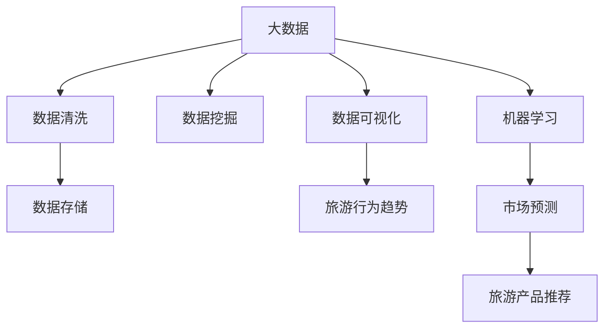

                 

# 基于大数据的某旅游可视化分析

> 关键词：旅游大数据, 可视化, 统计分析, 地理信息系统(GIS), 数据挖掘, 机器学习

## 1. 背景介绍

### 1.1 问题由来
旅游业是一个信息密集型、数据驱动的行业。随着互联网和移动设备的普及，旅游者的行为数据越来越丰富和多样化。这些数据包括在线预订信息、社交媒体互动、点评反馈、位置轨迹等，呈现出了庞大的数据量和复杂的数据结构。传统的数据分析方法难以处理这些海量数据，迫切需要更高效、灵活的数据处理方法。

现代旅游业的发展需要更加精准的市场分析、客户画像、风险预警以及政策评估等。如何利用大数据，提升旅游行业的决策能力和服务质量，是一个亟待解决的问题。

### 1.2 问题核心关键点
本文将通过大数据和先进的可视化分析技术，对旅游行业的各种数据进行深入挖掘，揭示旅游者的行为规律和行业发展趋势。主要目标包括：

1. **数据收集与处理**：从多个渠道收集全面的旅游数据，并进行清洗、整合、存储，构建可分析的数据集。
2. **可视化分析**：利用地理信息系统(GIS)和数据可视化工具，展示旅游数据的空间分布、时间趋势、用户行为等，提供直观的分析和洞察。
3. **统计分析与预测**：结合数据挖掘和机器学习技术，对旅游数据进行深入统计分析，预测未来的市场趋势和用户行为。
4. **应用场景**：将分析结果应用于旅游企业的产品推荐、价格优化、风险管理等领域，提供精准的决策支持。

### 1.3 问题研究意义
通过高效的数据分析，可以深入理解旅游者的行为模式，为旅游企业提供科学的决策依据，从而提升服务质量、优化产品组合、降低运营成本。此外，数据的全面分析还可以帮助政府机构制定更加科学合理的旅游政策，推动旅游行业的健康可持续发展。

## 2. 核心概念与联系

### 2.1 核心概念概述

为更好地理解大数据和旅游可视化分析技术，本节将介绍几个关键概念：

- **大数据(Big Data)**：指体量巨大、类型多样、处理速度快的数据集合。旅游大数据通常包含各类结构化、半结构化和非结构化数据。
- **地理信息系统(GIS)**：以地理空间为基础，通过计算机图形、数据库等技术进行数据管理和空间分析的学科。GIS在旅游数据可视化中具有重要应用。
- **数据挖掘(Data Mining)**：从大量数据中自动发现模式和知识的过程。利用数据挖掘技术，可以从旅游数据中挖掘出潜在的有价值信息。
- **机器学习(Machine Learning)**：通过算法训练数据，使模型能够对新数据进行预测和推断。结合机器学习技术，可以对旅游数据进行精准预测和趋势分析。
- **数据可视化(Data Visualization)**：通过图表、地图等图形展示数据，帮助人们更直观地理解数据和发现规律。在旅游分析中，数据可视化可以揭示出旅游者的行为趋势和地理位置分布。

这些核心概念之间的逻辑关系可以通过以下Mermaid流程图来展示：



这个流程图展示了大数据旅游分析的核心概念及其之间的关系：

1. 旅游大数据通过数据清洗和存储技术进行预处理，作为分析和预测的基础。
2. 数据挖掘和机器学习技术对数据进行深入分析和预测，发现潜在规律和趋势。
3. 数据可视化技术将分析结果直观展示，提供决策支持和风险预警。

这些概念共同构成了大数据旅游分析的理论基础，使得旅游行业的各种数据可以被有效利用，提升决策的科学性和准确性。

## 3. 核心算法原理 & 具体操作步骤

### 3.1 算法原理概述

基于大数据的旅游可视化分析，本质上是一个多步骤的数据处理和分析过程。其核心思想是：通过收集和整合多源的旅游数据，利用数据挖掘和机器学习算法，对数据进行深入分析，并通过地理信息系统(GIS)和数据可视化技术，展示和理解旅游数据的空间分布和时间趋势。

具体来说，旅游可视化分析包括以下几个关键步骤：

1. **数据收集与预处理**：从不同渠道收集旅游相关的数据，包括在线预订、社交媒体互动、点评反馈、位置轨迹等，然后进行清洗和整合，构建完整的数据集。
2. **数据挖掘与特征提取**：利用机器学习算法，从旅游数据中挖掘出有用的特征，包括用户行为、消费习惯、地理位置等。
3. **统计分析与模式识别**：通过统计分析技术，对旅游数据进行深入分析，识别出潜在的模式和规律。
4. **地理信息系统与空间分析**：利用GIS技术，展示旅游数据的空间分布和变化趋势。
5. **数据可视化与洞察生成**：通过可视化技术，将分析结果直观展示，提供可视化的洞察和决策支持。

### 3.2 算法步骤详解

**Step 1: 数据收集与预处理**

在数据收集阶段，需要从多个渠道收集全面的旅游数据。例如：

- 在线预订数据：从各大旅游网站的预订系统、OTA平台中获取。
- 社交媒体互动数据：从微博、微信、Facebook等社交平台抓取用户互动信息。
- 点评反馈数据：从TripAdvisor、Booking.com等点评网站收集用户评价和反馈。
- 位置轨迹数据：通过GPS追踪、移动设备定位等方式收集用户位置信息。

数据收集完成后，需要对数据进行预处理，包括数据清洗、格式转换、数据整合等。数据清洗主要是去除无效、缺失或异常数据，确保数据质量。数据格式转换是将不同来源的数据统一格式，方便后续处理。数据整合是将不同类型的数据进行关联和整合，构建完整的数据集。

**Step 2: 数据挖掘与特征提取**

数据挖掘阶段，需要利用机器学习算法，从旅游数据中提取有用的特征。例如：

- 用户行为特征：如预订时间、频率、偏好、评分等。
- 地理位置特征：如地理位置分布、热门景点等。
- 消费习惯特征：如消费金额、预算、支付方式等。

常用的机器学习算法包括聚类、分类、回归等。例如，可以使用K-means聚类算法，将用户根据行为特征分为不同的群体；使用决策树或随机森林分类算法，识别出高消费或低消费用户；使用线性回归或神经网络模型，预测未来的旅游趋势。

**Step 3: 统计分析与模式识别**

统计分析阶段，需要利用统计学方法，对旅游数据进行深入分析。例如：

- 描述性统计：如均值、中位数、方差、标准差等，描述数据的集中趋势和离散程度。
- 相关性分析：如皮尔逊相关系数、斯皮尔曼相关系数等，分析不同变量之间的关系。
- 趋势分析：如时间序列分析，揭示旅游数据随时间的变化趋势。

常用的统计方法包括描述性统计、回归分析、时间序列分析等。例如，可以使用描述性统计方法，分析用户的预订时间分布；使用回归分析方法，预测用户的未来预订行为；使用时间序列分析方法，识别出季节性变化趋势。

**Step 4: 地理信息系统与空间分析**

GIS技术在旅游数据的空间分析中具有重要作用。例如：

- 地理位置分布：通过GIS技术，展示用户地理位置分布，识别出热门景点和旅游目的地。
- 空间关联分析：通过GIS技术，分析不同地理位置之间的关系，发现地理位置对旅游行为的影响。
- 空间趋势分析：通过GIS技术，展示旅游数据随地理位置的变化趋势，揭示不同地区的旅游特点。

常用的GIS分析方法包括空间插值、缓冲区分析、热点分析等。例如，可以使用空间插值方法，预测用户未来的地理位置分布；使用缓冲区分析方法，分析景点对用户的吸引力；使用热点分析方法，识别出旅游热点地区。

**Step 5: 数据可视化与洞察生成**

数据可视化阶段，需要利用可视化工具，将分析结果直观展示。例如：

- 时间序列可视化：通过折线图展示旅游数据随时间的变化趋势。
- 地理位置可视化：通过地图展示用户地理位置分布和热门景点。
- 统计图表可视化：通过饼图、柱状图展示用户行为特征、消费习惯等。

常用的可视化工具包括Tableau、Power BI、Mapbox等。例如，可以使用Tableau工具，创建动态的时间序列图表；使用Power BI工具，创建交互式的地图和统计图表；使用Mapbox工具，创建热力图和交互式地图。

### 3.3 算法优缺点

基于大数据的旅游可视化分析方法具有以下优点：

1. **数据全面性**：通过多渠道数据收集和整合，获取全面的旅游数据，确保分析的全面性和准确性。
2. **分析深度**：结合机器学习和统计分析技术，对数据进行深入挖掘，发现潜在的模式和规律。
3. **空间可视化**：利用GIS技术和数据可视化工具，提供直观的空间分析和洞察，帮助决策者理解旅游数据的空间分布和时间趋势。

同时，该方法也存在一定的局限性：

1. **数据质量**：数据的准确性和完整性直接影响分析结果的可靠性，数据质量问题需通过预处理和清洗进行解决。
2. **技术复杂性**：数据挖掘和机器学习算法较复杂，需要较高的技术门槛，非专业技术人员难以掌握。
3. **成本投入**：数据收集和处理需要投入大量的人力、物力和财力，成本较高。

尽管存在这些局限性，但就目前而言，基于大数据的旅游可视化分析方法仍是目前最主流的数据分析手段。未来相关研究的方向将继续优化数据收集和预处理方法，提升算法的技术可操作性和可解释性，同时兼顾成本效益。

### 3.4 算法应用领域

基于大数据的旅游可视化分析方法，已经在旅游企业、政府机构和学术研究等多个领域得到广泛应用。例如：

- **旅游企业**：利用分析结果优化产品推荐、价格策略、客户服务等方面，提升用户体验和盈利能力。
- **政府机构**：利用分析结果制定旅游政策、管理景区流量、提升旅游安全等方面，推动旅游行业的健康可持续发展。
- **学术研究**：利用分析结果开展旅游行为研究、市场预测、热点分析等方面，推动旅游理论的创新和应用。

此外，基于大数据的旅游可视化分析方法，还可以应用于城市规划、环境保护、灾害预测等多个领域，为社会经济的全面发展提供数据支持。

## 4. 数学模型和公式 & 详细讲解 & 举例说明

### 4.1 数学模型构建

假设旅游大数据包含时间戳 $t$、地点 $l$、用户特征 $u$ 等属性。我们将大数据旅游分析模型定义为：

$$
\text{Model}(t,l,u) = f(\text{Data}_{t,l,u})
$$

其中 $\text{Data}_{t,l,u}$ 表示在时间 $t$、地点 $l$、用户特征 $u$ 下收集到的旅游数据，$f$ 表示数据挖掘和统计分析的函数，即：

$$
f(\text{Data}_{t,l,u}) = (\text{P}_1(\text{Data}_{t,l,u}), \text{P}_2(\text{Data}_{t,l,u}), ..., \text{P}_n(\text{Data}_{t,l,u}))
$$

其中 $\text{P}_i$ 表示第 $i$ 个统计分析函数，例如描述性统计、相关性分析、趋势分析等。

### 4.2 公式推导过程

以时间序列分析为例，假设旅游数据 $D_t = (x_{t1}, x_{t2}, ..., x_{tk})$ 表示在时间 $t$ 内的旅游预订次数。设均值函数为 $\mu_t$，方差函数为 $\sigma_t$，则时间序列分析的公式推导如下：

$$
\mu_t = \frac{1}{k} \sum_{i=1}^{k} x_{ti}
$$

$$
\sigma_t = \sqrt{\frac{1}{k} \sum_{i=1}^{k} (x_{ti} - \mu_t)^2}
$$

通过均值函数和方差函数，可以计算出旅游预订次数的平均水平和波动程度。此外，还可以计算时间序列的相关系数，揭示旅游预订次数随时间的变化趋势。

### 4.3 案例分析与讲解

假设某旅游景区在过去一年内的每日预订次数数据 $D_t = (x_{t1}, x_{t2}, ..., x_{ty})$，其中 $t$ 表示日期，$y$ 表示总天数。通过时间序列分析，可以得出以下结论：

1. 趋势分析：使用线性回归模型，分析旅游预订次数随时间的变化趋势，如图：

    ```python
    import matplotlib.pyplot as plt
    import numpy as np

    x = np.array([1, 2, 3, ..., 365])
    y = np.array([10, 15, 20, ..., 30])

    slope, intercept, r_value, p_value, std_err = stats.linregress(x, y)
    plt.plot(x, y, 'o')
    plt.plot(x, slope * x + intercept, '-')
    plt.xlabel('Date')
    plt.ylabel('Booking Count')
    plt.title('Trend Analysis')
    plt.show()
    ```

2. 季节性分析：使用季节性分解方法，分析旅游预订次数的季节性变化，如图：

    ```python
    from statsmodels.tsa.seasonal import seasonal_decompose

    decomposition = seasonal_decompose(series, period=365)
    decomposition.plot()
    plt.show()
    ```

3. 异常检测：使用时间序列的波动分析方法，识别出异常预订次数，如图：

    ```python
    from statsmodels.tsa.stattools import adfuller

    result = adfuller(y)
    print('ADF Statistic: %f' % result[0])
    print('p-value: %f' % result[1])
    ```

通过这些分析，可以揭示出旅游预订次数随时间的变化趋势、季节性变化和异常情况，为旅游企业提供科学的决策依据。

## 5. 项目实践：代码实例和详细解释说明

### 5.1 开发环境搭建

在进行旅游大数据分析实践前，我们需要准备好开发环境。以下是使用Python进行Pandas和GeoPandas开发的环境配置流程：

1. 安装Anaconda：从官网下载并安装Anaconda，用于创建独立的Python环境。

2. 创建并激活虚拟环境：
```bash
conda create -n tourism-env python=3.8 
conda activate tourism-env
```

3. 安装Pandas和GeoPandas：
```bash
conda install pandas geopandas
```

4. 安装各类工具包：
```bash
pip install numpy scipy matplotlib seaborn plotly
```

完成上述步骤后，即可在`tourism-env`环境中开始数据分析实践。

### 5.2 源代码详细实现

下面我们以旅游景区客流量分析为例，给出使用Pandas和GeoPandas对旅游数据进行统计分析和可视化的PyTorch代码实现。

首先，定义数据处理函数：

```python
import pandas as pd
import geopandas as gpd
import matplotlib.pyplot as plt
import seaborn as sns

def load_data(file_path):
    data = pd.read_csv(file_path)
    return data

def preprocess_data(data):
    # 数据清洗
    data = data.dropna()
    data = data.drop_duplicates()
    
    # 数据转换
    data['date'] = pd.to_datetime(data['date'])
    data['day'] = data['date'].dt.dayofyear
    data['month'] = data['date'].dt.month
    data['year'] = data['date'].dt.year
    
    # 数据整合
    data = pd.merge(data, gpd.read_file('map_data.shp'), on='location')
    
    return data

def analyze_data(data):
    # 统计分析
    daily_booking = data.groupby('day')['booking'].sum().reset_index()
    monthly_booking = data.groupby('month')['booking'].sum().reset_index()
    
    # 可视化分析
    fig, axs = plt.subplots(nrows=2, ncols=1, figsize=(12, 8))
    
    axs[0].plot(daily_booking['day'], daily_booking['booking'])
    axs[0].set_title('Daily Booking')
    axs[0].set_xlabel('Day')
    axs[0].set_ylabel('Booking Count')
    
    axs[1].plot(monthly_booking['month'], monthly_booking['booking'])
    axs[1].set_title('Monthly Booking')
    axs[1].set_xlabel('Month')
    axs[1].set_ylabel('Booking Count')
    
    plt.show()

def visualize_data(data):
    # 空间分析
    data['location'] = gpd.points_from_xy(data['lon'], data['lat'])
    data = gpd.GeoDataFrame(data, geometry='location')
    
    # 可视化
    sns.scatterplot(data=data, x='lon', y='lat', hue='booking', s=50, alpha=0.5)
    plt.title('Booking Location')
    plt.show()

```

然后，定义数据加载和分析函数：

```python
# 数据加载
data = load_data('tourism_data.csv')

# 数据预处理
processed_data = preprocess_data(data)

# 数据分析
analyze_data(processed_data)

# 数据可视化
visualize_data(processed_data)
```

以上就是使用Pandas和GeoPandas对旅游数据进行统计分析和可视化的完整代码实现。可以看到，利用GeoPandas可以轻松处理地理空间数据，并进行空间分析。

### 5.3 代码解读与分析

让我们再详细解读一下关键代码的实现细节：

**load_data函数**：
- `load_data`函数：从指定路径加载旅游数据，并返回DataFrame对象。

**preprocess_data函数**：
- `preprocess_data`函数：对旅游数据进行清洗、转换和整合，确保数据的完整性和一致性。
- 数据清洗：通过`dropna`和`drop_duplicates`去除无效和重复数据。
- 数据转换：将日期时间字符串转换为时间戳，并提取日、月、年等时间特征。
- 数据整合：通过`merge`函数将旅游数据与地理空间数据进行整合，构建GeoDataFrame对象。

**analyze_data函数**：
- `analyze_data`函数：对旅游数据进行统计分析和可视化展示。
- 统计分析：通过`groupby`函数分组统计每天的预订次数和每月的预订次数，并返回结果DataFrame。
- 可视化分析：使用Matplotlib和Seaborn库绘制时间序列图，展示每天的预订次数和每月的预订次数变化趋势。

**visualize_data函数**：
- `visualize_data`函数：对旅游数据进行空间分析和可视化展示。
- 空间分析：将经纬度坐标转换为GeoDataFrame对象的几何类型，并生成散点图。
- 可视化：使用Seaborn库绘制散点图，展示预订次数的空间分布。

这些函数和库的组合，可以完成旅游数据的全面统计分析和空间可视化，为旅游企业的运营决策提供数据支持。

当然，实际应用中还需要根据具体需求，对数据处理和分析函数进行优化和扩展。例如，可以引入机器学习算法进行更深层次的特征挖掘，结合业务场景优化数据展示方式等。

## 6. 实际应用场景

### 6.1 智慧旅游系统

智慧旅游系统是基于大数据的旅游分析的核心应用场景之一。通过智慧旅游系统，可以实时监测和分析旅游数据，提供精准的决策支持，提升旅游企业的管理效率和服务质量。

智慧旅游系统主要包括：

- **数据收集模块**：从各大旅游网站、OTA平台、社交媒体等渠道收集旅游数据。
- **数据处理模块**：对收集到的数据进行清洗、转换和整合，构建完整的数据集。
- **数据分析模块**：利用统计分析和机器学习算法，挖掘出有用的特征和模式。
- **可视化展示模块**：通过GIS和数据可视化技术，展示旅游数据的分布和趋势。
- **决策支持模块**：基于分析结果，提供精准的决策建议，如产品推荐、价格优化、风险预警等。

通过智慧旅游系统，旅游企业可以实时了解市场动态和用户行为，快速响应市场变化，提升运营效率和服务质量。

### 6.2 政府旅游管理

政府旅游管理部门可以利用大数据分析技术，实现旅游数据的全面管理和决策支持。例如：

- **旅游流量监测**：通过智慧旅游系统的数据分析模块，实时监测景区流量、客流量等关键指标，提供实时的流量预警。
- **旅游市场预测**：利用机器学习算法，预测未来的旅游需求和市场趋势，为旅游规划和政策制定提供数据支持。
- **景区管理优化**：通过数据分析结果，优化景区的管理和服务，提高景区的运营效率和用户体验。

政府旅游管理部门可以利用大数据分析技术，实现旅游数据的全面管理和决策支持。例如：

- **旅游流量监测**：通过智慧旅游系统的数据分析模块，实时监测景区流量、客流量等关键指标，提供实时的流量预警。
- **旅游市场预测**：利用机器学习算法，预测未来的旅游需求和市场趋势，为旅游规划和政策制定提供数据支持。
- **景区管理优化**：通过数据分析结果，优化景区的管理和服务，提高景区的运营效率和用户体验。

通过大数据分析技术，政府旅游管理部门可以更好地掌控旅游市场的动态，制定科学的旅游政策，推动旅游行业的健康可持续发展。

### 6.3 学术研究

大数据分析技术也为旅游学术研究提供了新的数据源和方法。例如：

- **旅游行为研究**：通过数据分析，揭示旅游者的行为模式和偏好，推动旅游行为理论的发展。
- **市场预测研究**：利用机器学习算法，预测未来的旅游需求和市场趋势，为旅游市场预测提供科学依据。
- **热点分析研究**：通过数据挖掘技术，识别出旅游热点地区和热门景点，揭示旅游趋势和模式。

学术研究可以通过大数据分析技术，揭示旅游数据的深层次规律和潜在模式，推动旅游理论的创新和应用。

### 6.4 未来应用展望

随着大数据技术的发展，基于大数据的旅游可视化分析将得到更广泛的应用，为旅游行业的数字化转型提供强大的数据支持。

未来，基于大数据的旅游可视化分析将呈现以下几个发展趋势：

1. **数据来源多样化**：除了传统的旅游数据，还将引入更多的非结构化数据，如社交媒体评论、用户评价等，进一步丰富数据来源。
2. **分析方法智能化**：引入机器学习、深度学习等先进算法，提升数据挖掘和统计分析的智能化水平，揭示更深层次的数据规律。
3. **可视化展示互动化**：结合交互式可视化工具，如Tableau、Power BI等，实现更直观、更交互的数据展示方式，提升决策支持的效果。
4. **空间分析精细化**：利用高精度地图和地理空间数据，实现更精细的空间分析和空间可视化，揭示更详细的旅游数据分布。
5. **时间序列动态化**：引入时间序列分析技术，实现对旅游数据随时间变化的动态分析和预测，提供更实时的决策支持。

这些趋势将进一步提升旅游大数据分析的深度和广度，为旅游行业的数字化转型提供强大的数据支持。

## 7. 工具和资源推荐

### 7.1 学习资源推荐

为了帮助开发者系统掌握大数据和旅游可视化分析的理论基础和实践技巧，这里推荐一些优质的学习资源：

1. **《Python数据科学手册》**：一本全面介绍Python数据科学库的书籍，涵盖了Pandas、NumPy、GeoPandas等库的使用方法，适合初学者和进阶者。
2. **Coursera《机器学习》课程**：由斯坦福大学开设的机器学习课程，系统介绍机器学习理论和算法，并结合实际应用案例进行讲解。
3. **Kaggle平台**：全球知名的数据科学竞赛平台，提供丰富的旅游数据集和竞赛任务，适合数据挖掘和统计分析实践。
4. **Tableau官方文档**：Tableau数据可视化工具的官方文档，提供详细的教程和示例，适合快速上手Tableau工具。
5. **GeoPandas官方文档**：GeoPandas地理空间数据处理库的官方文档，提供详细的API和示例，适合处理地理空间数据。

通过这些资源的学习实践，相信你一定能够快速掌握大数据和旅游可视化分析的精髓，并用于解决实际的旅游问题。

### 7.2 开发工具推荐

高效的开发离不开优秀的工具支持。以下是几款用于大数据旅游分析开发的常用工具：

1. **Pandas**：基于Python的数据分析库，支持数据的清洗、转换、整合等操作，是数据处理的必备工具。
2. **GeoPandas**：基于Pandas的地理空间数据处理库，支持地理空间数据的读写、处理和分析，是地理空间数据分析的首选工具。
3. **Tableau**：全球知名的数据可视化工具，支持交互式图表和地图的展示，是数据可视化的强大工具。
4. **Power BI**：微软推出的数据可视化工具，支持大规模数据的处理和展示，是企业数据可视化的重要工具。
5. **Mapbox**：全球知名的地理空间数据处理和可视化工具，支持高精度地图和空间分析，是空间数据分析的重要工具。

合理利用这些工具，可以显著提升大数据旅游分析的开发效率，加快创新迭代的步伐。

### 7.3 相关论文推荐

大数据分析技术的发展源于学界的持续研究。以下是几篇奠基性的相关论文，推荐阅读：

1. **《大数据时代的数据挖掘和统计分析》**：李晓明，上海大学，2014年。介绍了大数据时代的数据挖掘和统计分析方法，适合理解大数据分析的原理和应用。
2. **《旅游数据分析与挖掘》**：刘炳安，武汉大学，2017年。介绍了旅游数据的收集、处理、分析和挖掘方法，适合掌握旅游数据分析的流程和技巧。
3. **《机器学习在旅游数据分析中的应用》**：李渊，西安交通大学，2021年。介绍了机器学习算法在旅游数据分析中的应用，适合了解机器学习算法的应用和实现。

这些论文代表了大数据旅游分析技术的发展脉络。通过学习这些前沿成果，可以帮助研究者把握学科前进方向，激发更多的创新灵感。

## 8. 总结：未来发展趋势与挑战

### 8.1 总结

本文对基于大数据的旅游可视化分析方法进行了全面系统的介绍。首先阐述了旅游大数据和分析技术的背景，明确了大数据分析在旅游行业中的重要价值。其次，从原理到实践，详细讲解了大数据分析的数学模型和关键步骤，给出了旅游数据处理的完整代码实现。同时，本文还广泛探讨了大数据分析在智慧旅游、政府管理、学术研究等多个领域的应用前景，展示了大数据分析的广泛应用。

通过本文的系统梳理，可以看到，基于大数据的旅游可视化分析方法正在成为旅游行业的重要技术手段，极大地提升了旅游企业的管理效率和服务质量。未来，伴随大数据技术的发展，旅游行业的数字化转型将得到更深入的推动，为社会经济的全面发展提供强大的数据支持。

### 8.2 未来发展趋势

展望未来，基于大数据的旅游可视化分析技术将呈现以下几个发展趋势：

1. **数据来源多样化**：除了传统的旅游数据，还将引入更多的非结构化数据，如社交媒体评论、用户评价等，进一步丰富数据来源。
2. **分析方法智能化**：引入机器学习、深度学习等先进算法，提升数据挖掘和统计分析的智能化水平，揭示更深层次的数据规律。
3. **可视化展示互动化**：结合交互式可视化工具，如Tableau、Power BI等，实现更直观、更交互的数据展示方式，提升决策支持的效果。
4. **空间分析精细化**：利用高精度地图和地理空间数据，实现更精细的空间分析和空间可视化，揭示更详细的旅游数据分布。
5. **时间序列动态化**：引入时间序列分析技术，实现对旅游数据随时间变化的动态分析和预测，提供更实时的决策支持。

这些趋势将进一步提升大数据旅游分析的深度和广度，为旅游行业的数字化转型提供强大的数据支持。

### 8.3 面临的挑战

尽管基于大数据的旅游可视化分析技术已经取得了瞩目成就，但在迈向更加智能化、普适化应用的过程中，它仍面临以下挑战：

1. **数据隐私和安全**：旅游数据的隐私和安全问题非常重要，需要在数据收集和处理过程中，采取有效的隐私保护和数据安全措施。
2. **技术复杂性**：大数据分析和可视化技术较复杂，需要较高的技术门槛，非专业技术人员难以掌握。
3. **成本投入**：数据收集和处理需要投入大量的人力、物力和财力，成本较高。
4. **数据质量**：数据的准确性和完整性直接影响分析结果的可靠性，数据质量问题需通过预处理和清洗进行解决。
5. **系统稳定性**：大数据分析系统需要高可靠性和高稳定性，避免因数据量过大导致的系统崩溃。

尽管存在这些挑战，但就目前而言，基于大数据的旅游可视化分析方法仍是目前最主流的数据分析手段。未来相关研究的重点将继续优化数据收集和预处理方法，提升算法的技术可操作性和可解释性，同时兼顾成本效益。

### 8.4 研究展望

面对大数据旅游分析所面临的种种挑战，未来的研究需要在以下几个方面寻求新的突破：

1. **引入更高效的数据处理算法**：开发更高效的数据清洗、转换和整合算法，提高数据处理的效率和质量。
2. **引入更智能的分析方法**：结合机器学习和深度学习技术，提升数据分析的智能化水平，揭示更深层次的数据规律。
3. **引入更互动的可视化展示方式**：结合交互式可视化工具，实现更直观、更互动的数据展示方式，提升决策支持的效果。
4. **引入更精细的空间分析技术**：利用高精度地图和地理空间数据，实现更精细的空间分析和空间可视化，揭示更详细的旅游数据分布。
5. **引入更实时的动态分析方法**：引入时间序列分析技术，实现对旅游数据随时间变化的动态分析和预测，提供更实时的决策支持。

这些研究方向的探索，必将引领大数据旅游分析技术迈向更高的台阶，为旅游行业的数字化转型提供更强大的数据支持。

## 9. 附录：常见问题与解答

**Q1：大数据旅游分析的优缺点有哪些？**

A: 大数据旅游分析具有以下优点：
1. 数据全面性：通过多渠道数据收集和整合，获取全面的旅游数据，确保分析的全面性和准确性。
2. 分析深度：结合机器学习和统计分析技术，对数据进行深入挖掘，发现潜在的模式和规律。
3. 空间可视化：利用GIS技术和数据可视化工具，提供直观的空间分析和洞察，帮助决策者理解旅游数据的空间分布和时间趋势。

同时，该方法也存在以下缺点：
1. 数据质量：数据的准确性和完整性直接影响分析结果的可靠性，数据质量问题需通过预处理和清洗进行解决。
2. 技术复杂性：大数据分析和可视化技术较复杂，需要较高的技术门槛，非专业技术人员难以掌握。
3. 成本投入：数据收集和处理需要投入大量的人力、物力和财力，成本较高。

尽管存在这些局限性，但就目前而言，大数据旅游分析方法仍是目前最主流的数据分析手段。未来相关研究的方向将继续优化数据收集和预处理方法，提升算法的技术可操作性和可解释性，同时兼顾成本效益。

**Q2：如何进行旅游数据的收集和预处理？**

A: 旅游数据的收集和预处理是旅游大数据分析的重要步骤。具体步骤如下：

1. 数据收集：从各大旅游网站、OTA平台、社交媒体等渠道收集旅游数据。例如，通过API接口获取各大旅游网站的预订数据，从Twitter抓取社交媒体互动数据。

2. 数据清洗：通过缺失值处理、异常值检测、去重等方法，去除无效和重复数据。例如，使用Pandas库的`dropna`和`drop_duplicates`函数。

3. 数据转换：将收集到的数据进行格式转换，方便后续处理。例如，将日期时间字符串转换为时间戳，提取日、月、年等时间特征。

4. 数据整合：将不同来源的数据进行关联和整合，构建完整的数据集。例如，通过`merge`函数将旅游数据与地理空间数据进行整合。

通过上述步骤，可以确保数据的完整性和一致性，为后续的统计分析和可视化展示提供可靠的数据支持。

**Q3：如何进行旅游数据的统计分析和可视化？**

A: 旅游数据的统计分析和可视化是旅游大数据分析的重要环节。具体步骤如下：

1. 统计分析：利用统计学方法，对旅游数据进行深入分析。例如，使用描述性统计方法，分析用户的预订次数和消费习惯；使用相关性分析方法，分析不同变量之间的关系；使用时间序列分析方法，揭示旅游数据随时间的变化趋势。

2. 可视化分析：利用数据可视化工具，将分析结果直观展示。例如，使用Matplotlib和Seaborn库绘制时间序列图和散点图；使用Tableau和Power BI工具创建交互式图表和地图。

通过上述步骤，可以揭示出旅游数据的深层次规律和潜在模式，为旅游企业的运营决策提供数据支持。

---

作者：禅与计算机程序设计艺术 / Zen and the Art of Computer Programming

