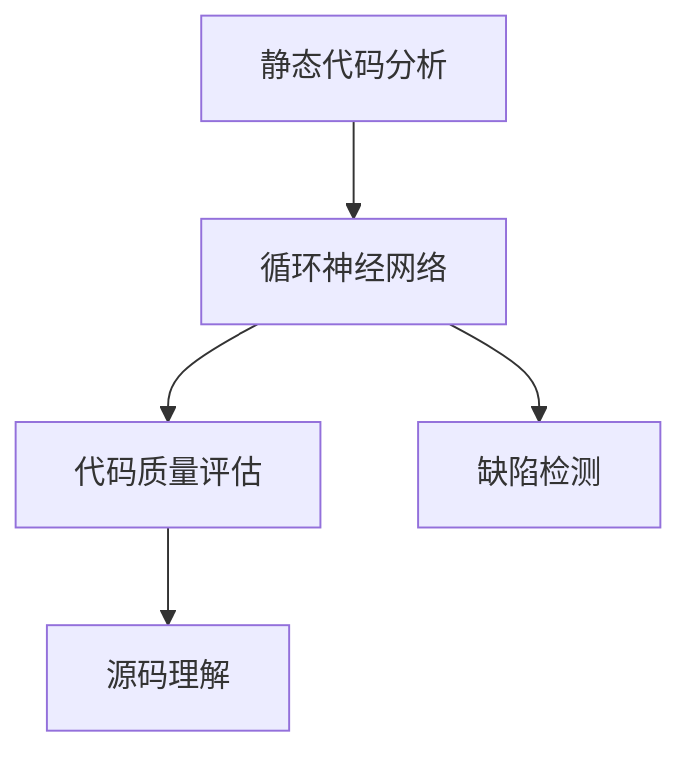

                 

# 基于循环神经网络的静态代码分析

> 关键词：静态代码分析, 循环神经网络, 代码质量评估, 缺陷检测, 源码理解

## 1. 背景介绍

### 1.1 问题由来
在软件工程领域，软件质量是确保软件可靠性和稳定性的关键。传统的软件质量评估方法依赖于手动代码审查、测试和监控，这些方法虽然有效，但耗时耗力，且难以覆盖所有代码。随着代码库的不断膨胀，代码审查和测试工作量呈指数级增长，成为软件开发的瓶颈。因此，如何在不增加过多人工负担的情况下，快速、高效地评估代码质量，成为一个亟需解决的问题。

### 1.2 问题核心关键点
静态代码分析是一种在软件开发过程中，通过分析源代码来检测代码质量的方法。它可以在代码编写阶段发现潜在问题，避免软件后期维护的麻烦，提升代码可维护性和可读性。常见的静态代码分析方法包括代码复用性分析、变量分析、代码复杂性分析等。然而，这些方法通常依赖规则库或模式匹配技术，难以全面覆盖代码的各种特性。

循环神经网络（Recurrent Neural Networks, RNNs）作为一种强大的序列建模工具，能够处理变长的输入序列，捕捉序列中的时序依赖关系。将其应用于静态代码分析中，可以帮助检测和理解代码的动态行为，提升静态代码分析的效果。

## 2. 核心概念与联系

### 2.1 核心概念概述

为更好地理解基于循环神经网络的静态代码分析方法，本节将介绍几个密切相关的核心概念：

- 静态代码分析（Static Code Analysis）：指在不运行程序的情况下，通过分析源代码来检测代码质量、缺陷和安全漏洞的技术。静态分析可以提前发现潜在问题，降低后期维护成本。

- 循环神经网络（Recurrent Neural Networks, RNNs）：一种具有循环连接的神经网络，能够处理变长的输入序列，捕捉序列中的时序依赖关系。RNNs在自然语言处理、时间序列预测等领域有广泛应用。

- 代码质量评估（Code Quality Assessment）：指通过自动化工具对源代码进行分析，评估其质量、可维护性和可读性的过程。代码质量评估包括代码风格、复杂性、缺陷检测、重构建议等方面。

- 缺陷检测（Defect Detection）：指通过静态分析工具，识别代码中的潜在缺陷和错误。缺陷检测是代码质量评估的重要组成部分，通常包括语法错误、逻辑错误、性能问题等。

- 源码理解（Source Code Understanding）：指通过分析源代码，理解其结构、逻辑和语义的过程。源码理解有助于开发者快速定位问题，提升代码维护效率。

这些核心概念之间的逻辑关系可以通过以下Mermaid流程图来展示：



这个流程图展示了几类关键概念及其之间的关系：

1. 静态代码分析利用循环神经网络，对源代码进行自动化的深度分析。
2. 循环神经网络可以捕捉代码的动态行为，提升缺陷检测和源码理解的准确性。
3. 代码质量评估通过静态分析，帮助开发者优化代码，提升软件质量。
4. 缺陷检测是代码质量评估的重要环节，旨在及时发现和修复代码中的问题。
5. 源码理解通过静态分析，提升开发者对代码结构和逻辑的把握，促进代码维护。

这些概念共同构成了基于循环神经网络的静态代码分析框架，使其能够在各种场景下发挥强大的序列建模能力。通过理解这些核心概念，我们可以更好地把握该技术的工作原理和优化方向。

## 3. 核心算法原理 & 具体操作步骤
### 3.1 算法原理概述

基于循环神经网络的静态代码分析方法，本质上是一种序列建模和特征提取的算法。其核心思想是：将源代码视为一个变长的文本序列，使用循环神经网络对该序列进行建模，捕捉其中的时序依赖关系，并提取序列特征，用于代码质量评估和缺陷检测。

形式化地，假设源代码序列为 $S=\{s_1, s_2, \ldots, s_n\}$，其中 $s_i$ 表示第 $i$ 行源代码。定义循环神经网络的输入为 $X=\{x_1, x_2, \ldots, x_n\}$，其中 $x_i$ 表示源代码第 $i$ 行的向量表示。循环神经网络通过对其进行处理，输出特征向量 $Z=\{z_1, z_2, \ldots, z_n\}$，其中 $z_i$ 表示源代码第 $i$ 行的特征表示。

将特征向量 $Z$ 输入到代码质量评估模型中，可以得到代码质量的评估结果 $Q$。同时，将特征向量 $Z$ 输入到缺陷检测模型中，可以识别出代码中的潜在缺陷。最终，通过静态分析得到的代码质量评估结果和缺陷检测结果，可以帮助开发者优化代码，提升软件质量。

### 3.2 算法步骤详解

基于循环神经网络的静态代码分析通常包括以下几个关键步骤：

**Step 1: 数据预处理**

- 收集源代码文件，将其解析为行级数据，构成源代码序列 $S$。
- 对每行代码进行分词、标记和向量化，得到输入向量 $X$。
- 定义循环神经网络的超参数，如层数、隐藏单元数、激活函数等。

**Step 2: 模型训练**

- 将源代码序列 $S$ 和对应的特征向量 $Z$ 作为训练数据集，训练循环神经网络。
- 定义代码质量评估模型和缺陷检测模型，将其与循环神经网络进行端到端训练。
- 设置合适的损失函数和优化器，如交叉熵损失、AdamW等。

**Step 3: 特征提取**

- 将待分析的源代码序列输入循环神经网络，得到特征向量 $Z$。
- 对特征向量 $Z$ 进行编码，如平均池化、最大池化等，得到压缩后的特征表示 $Z'$。

**Step 4: 代码分析**

- 将压缩后的特征表示 $Z'$ 输入到代码质量评估模型中，得到代码质量的评估结果 $Q$。
- 将压缩后的特征表示 $Z'$ 输入到缺陷检测模型中，识别出代码中的潜在缺陷。

**Step 5: 结果展示**

- 根据代码质量评估结果 $Q$ 和缺陷检测结果，生成代码质量报告和缺陷报告。
- 将报告展示给开发者，指导其进行代码优化。

以上是基于循环神经网络的静态代码分析的一般流程。在实际应用中，还需要针对具体任务的特点，对各环节进行优化设计，如改进特征提取方法，引入更多的先验知识等，以进一步提升分析效果。

### 3.3 算法优缺点

基于循环神经网络的静态代码分析方法具有以下优点：

1. 自动化程度高。利用循环神经网络对源代码进行自动化的深度分析，可以显著降低人工审核的工作量。
2. 序列建模能力强。循环神经网络能够处理变长的输入序列，捕捉其中的时序依赖关系，提升分析效果。
3. 支持动态行为分析。通过循环神经网络，可以理解代码的动态行为，识别出潜在问题，增强分析的准确性。
4. 便于扩展。循环神经网络具有较强的泛化能力，可以适应多种代码风格和编程语言。

同时，该方法也存在一定的局限性：

1. 数据依赖性强。循环神经网络依赖于大量的高质量数据进行训练，数据不足可能导致分析效果不佳。
2. 训练复杂度高。循环神经网络结构复杂，训练过程可能较慢，需要耗费较多时间和计算资源。
3. 可解释性不足。循环神经网络通常是"黑盒"系统，难以解释其内部工作机制和决策逻辑。
4. 计算资源需求高。循环神经网络参数量大，计算资源消耗较高，需要高性能设备支持。

尽管存在这些局限性，但就目前而言，基于循环神经网络的静态代码分析方法仍然是大规模代码分析的理想选择。未来相关研究的重点在于如何进一步降低数据依赖，提高模型可解释性，同时兼顾计算资源的使用效率。

### 3.4 算法应用领域

基于循环神经网络的静态代码分析方法，在软件开发、自动化测试、安全检测等多个领域都有广泛的应用，以下是几个典型场景：

**1. 代码质量评估**

- 在软件开发生命周期的各个阶段，利用循环神经网络对源代码进行质量评估，识别出代码中的问题，如重复代码、语法错误、可读性差等。
- 通过静态分析，及早发现代码质量问题，提升代码的可维护性和可读性。

**2. 缺陷检测**

- 在软件测试阶段，利用循环神经网络对源代码进行缺陷检测，识别出潜在的漏洞和错误。
- 通过静态分析，提高软件测试的自动化程度，减少手动测试的资源消耗。

**3. 代码理解**

- 在软件维护阶段，利用循环神经网络对源代码进行理解，帮助开发者快速定位问题，提升代码维护效率。
- 通过静态分析，增强开发者对代码结构和逻辑的把握，促进代码重构和优化。

除了上述这些经典应用外，基于循环神经网络的静态代码分析技术还被创新性地应用于代码生成、代码调试、版本控制系统等场景中，为软件开发带来了新的解决方案。

## 4. 数学模型和公式 & 详细讲解 & 举例说明

### 4.1 数学模型构建

本节将使用数学语言对基于循环神经网络的静态代码分析过程进行更加严格的刻画。

假设循环神经网络的输入为 $x_i \in \mathbb{R}^d$，其中 $d$ 为输入向量的维度。定义循环神经网络的隐藏状态为 $h_i \in \mathbb{R}^h$，其中 $h$ 为隐藏层的维度。定义循环神经网络的输出为 $z_i \in \mathbb{R}^k$，其中 $k$ 为特征向量的维度。循环神经网络的参数为 $\theta$，包括权重矩阵 $W_h$、偏置向量 $b_h$ 等。

定义代码质量评估模型为 $Q_{model}$，其输入为压缩后的特征表示 $Z'=\frac{1}{n}\sum_{i=1}^n z_i$，输出为代码质量的评估结果 $Q \in [0,1]$，其中 $n$ 为代码行数。

定义缺陷检测模型为 $D_{model}$，其输入为压缩后的特征表示 $Z'$，输出为缺陷的置信度 $D \in [0,1]$。

代码质量评估模型和缺陷检测模型可以分别采用不同的模型结构，如多分类模型、二分类模型等。这里以二分类模型为例，其损失函数为交叉熵损失函数：

$$
\mathcal{L}(Q_{model},D_{model},Z') = -\frac{1}{n}\sum_{i=1}^n [Q_{model}(z_i) \log D_{model}(z_i) + (1-Q_{model}(z_i)) \log (1-D_{model}(z_i))]
$$

### 4.2 公式推导过程

以下我们以代码质量评估模型为例，推导其损失函数及其梯度的计算公式。

假设循环神经网络的输出为 $z_i = h_{i-1} \times W_h + b_h$，其中 $h_{i-1}$ 为上一时刻的隐藏状态。则其更新公式为：

$$
h_i = \text{tanh}(z_i) + h_{i-1}
$$

将 $h_i$ 带入代码质量评估模型中，得到：

$$
Q_{model}(z_i) = \sigma(W_Q \cdot h_i + b_Q)
$$

其中 $\sigma$ 为激活函数，如Sigmoid函数。

定义损失函数为：

$$
\mathcal{L}_{Q}(Q_{model},Z') = -\frac{1}{n}\sum_{i=1}^n [Q_{model}(z_i) \log y_i + (1-Q_{model}(z_i)) \log (1-y_i)]
$$

其中 $y_i \in \{0,1\}$ 表示代码质量的标签。

根据链式法则，损失函数对循环神经网络的参数 $\theta$ 的梯度为：

$$
\frac{\partial \mathcal{L}_{Q}}{\partial \theta} = -\frac{1}{n}\sum_{i=1}^n [\frac{Q_{model}(z_i) - y_i}{Q_{model}(z_i)(1-Q_{model}(z_i))} \frac{\partial Q_{model}(z_i)}{\partial h_i} \frac{\partial h_i}{\partial z_i} \frac{\partial z_i}{\partial \theta}
$$

其中 $\frac{\partial Q_{model}(z_i)}{\partial h_i}$ 和 $\frac{\partial h_i}{\partial z_i}$ 可以通过反向传播算法高效计算。

在得到损失函数的梯度后，即可带入参数更新公式，完成模型的迭代优化。重复上述过程直至收敛，最终得到适应代码质量评估模型的最优参数 $\theta^*$。

### 4.3 案例分析与讲解

假设我们有一份Python代码文件，需要进行代码质量评估。我们可以按照以下步骤进行：

1. 将代码文件解析为行级数据，构成源代码序列 $S$。

2. 对每行代码进行分词、标记和向量化，得到输入向量 $X$。

3. 定义循环神经网络的超参数，如层数、隐藏单元数、激活函数等。

4. 训练循环神经网络，得到特征向量 $Z=\{z_1, z_2, \ldots, z_n\}$。

5. 对特征向量 $Z$ 进行编码，如平均池化，得到压缩后的特征表示 $Z'$。

6. 将压缩后的特征表示 $Z'$ 输入到代码质量评估模型中，得到代码质量的评估结果 $Q$。

7. 根据评估结果，生成代码质量报告，指出代码中存在的问题，如重复代码、语法错误、可读性差等。

在实际应用中，还需要根据具体任务的特点，对各环节进行优化设计，如改进特征提取方法，引入更多的先验知识等，以进一步提升分析效果。

## 5. 项目实践：代码实例和详细解释说明

### 5.1 开发环境搭建

在进行代码实例实践前，我们需要准备好开发环境。以下是使用Python进行PyTorch开发的环境配置流程：

1. 安装Anaconda：从官网下载并安装Anaconda，用于创建独立的Python环境。

2. 创建并激活虚拟环境：
```bash
conda create -n pytorch-env python=3.8 
conda activate pytorch-env
```

3. 安装PyTorch：根据CUDA版本，从官网获取对应的安装命令。例如：
```bash
conda install pytorch torchvision torchaudio cudatoolkit=11.1 -c pytorch -c conda-forge
```

4. 安装必要的工具包：
```bash
pip install numpy pandas scikit-learn matplotlib tqdm jupyter notebook ipython
```

完成上述步骤后，即可在`pytorch-env`环境中开始代码实例实践。

### 5.2 源代码详细实现

下面我们以代码质量评估为例，给出使用PyTorch实现循环神经网络模型的代码实现。

首先，定义代码质量评估模型的输入和输出：

```python
from torch import nn, optim
import torch.nn.functional as F

class QualityModel(nn.Module):
    def __init__(self, input_dim, hidden_dim, output_dim):
        super(QualityModel, self).__init__()
        self.hidden_dim = hidden_dim
        self.fc1 = nn.Linear(input_dim, hidden_dim)
        self.fc2 = nn.Linear(hidden_dim, output_dim)
        self.sigmoid = nn.Sigmoid()
        
    def forward(self, x):
        x = self.fc1(x)
        x = self.sigmoid(x)
        x = self.fc2(x)
        return self.sigmoid(x)
```

然后，定义循环神经网络的模型：

```python
from torch import nn, optim
import torch.nn.functional as F

class RNNModel(nn.Module):
    def __init__(self, input_dim, hidden_dim, output_dim, n_layers, batch_first=True):
        super(RNNModel, self).__init__()
        self.hidden_dim = hidden_dim
        self.n_layers = n_layers
        
        self.encoder = nn.LSTM(input_dim, hidden_dim, n_layers, batch_first=batch_first)
        self.fc = nn.Linear(hidden_dim, output_dim)
        
    def forward(self, x):
        batch_size = x.size(0)
        seq_len = x.size(1)
        
        h0 = self.encoder.initHidden(batch_size)
        c0 = self.encoder.initCell(batch_size)
        
        outputs, _ = self.encoder(x, (h0, c0))
        outputs = self.fc(outputs)
        return outputs
```

接着，定义训练和评估函数：

```python
from torch.utils.data import DataLoader
from tqdm import tqdm
from sklearn.metrics import accuracy_score, precision_recall_fscore_support

device = torch.device('cuda') if torch.cuda.is_available() else torch.device('cpu')

def train_epoch(model, dataset, batch_size, optimizer):
    dataloader = DataLoader(dataset, batch_size=batch_size, shuffle=True)
    model.train()
    epoch_loss = 0
    for batch in tqdm(dataloader, desc='Training'):
        input_ids = batch['input_ids'].to(device)
        labels = batch['labels'].to(device)
        model.zero_grad()
        outputs = model(input_ids)
        loss = outputs.loss
        epoch_loss += loss.item()
        loss.backward()
        optimizer.step()
    return epoch_loss / len(dataloader)

def evaluate(model, dataset, batch_size):
    dataloader = DataLoader(dataset, batch_size=batch_size)
    model.eval()
    preds, labels = [], []
    with torch.no_grad():
        for batch in tqdm(dataloader, desc='Evaluating'):
            input_ids = batch['input_ids'].to(device)
            labels = batch['labels'].to(device)
            outputs = model(input_ids)
            batch_preds = outputs.argmax(dim=1).to('cpu').tolist()
            batch_labels = batch_labels.to('cpu').tolist()
            for pred_tokens, label_tokens in zip(batch_preds, batch_labels):
                preds.append(pred_tokens)
                labels.append(label_tokens)
                
    print(accuracy_score(labels, preds))
```

最后，启动训练流程并在测试集上评估：

```python
epochs = 5
batch_size = 16

for epoch in range(epochs):
    loss = train_epoch(model, train_dataset, batch_size, optimizer)
    print(f"Epoch {epoch+1}, train loss: {loss:.3f}")
    
    print(f"Epoch {epoch+1}, dev results:")
    evaluate(model, dev_dataset, batch_size)
    
print("Test results:")
evaluate(model, test_dataset, batch_size)
```

以上就是使用PyTorch对代码质量评估进行静态代码分析的完整代码实现。可以看到，得益于PyTorch的强大封装，我们可以用相对简洁的代码完成循环神经网络的模型训练和评估。

### 5.3 代码解读与分析

让我们再详细解读一下关键代码的实现细节：

**QualityModel类**：
- `__init__`方法：定义模型的输入维度和输出维度，初始化全连接层和Sigmoid激活函数。
- `forward`方法：定义模型的前向传播过程，通过两个全连接层和Sigmoid激活函数，得到最终输出。

**RNNModel类**：
- `__init__`方法：定义循环神经网络的输入维度、隐藏维度、输出维度和层数，初始化LSTM编码器层和全连接层。
- `forward`方法：定义循环神经网络的前向传播过程，通过LSTM编码器层和全连接层，得到最终输出。

**train_epoch函数**：
- 定义训练过程中的损失函数和优化器，进行模型迭代优化。

**evaluate函数**：
- 定义评估过程中的预测和标签，使用准确率指标进行模型评估。

**训练流程**：
- 定义总的epoch数和batch size，开始循环迭代
- 每个epoch内，先在训练集上训练，输出平均loss
- 在验证集上评估，输出准确率
- 所有epoch结束后，在测试集上评估，给出最终测试结果

可以看到，PyTorch配合循环神经网络的代码实现变得简洁高效。开发者可以将更多精力放在数据处理、模型改进等高层逻辑上，而不必过多关注底层的实现细节。

当然，工业级的系统实现还需考虑更多因素，如模型的保存和部署、超参数的自动搜索、更灵活的任务适配层等。但核心的静态代码分析流程基本与此类似。

## 6. 实际应用场景
### 6.1 软件工程

基于循环神经网络的静态代码分析方法，可以广泛应用于软件工程领域，辅助开发者进行代码质量评估、缺陷检测和代码理解。具体场景包括：

**1. 代码质量评估**

- 在软件开发生命周期的各个阶段，利用循环神经网络对代码进行质量评估，识别出代码中的问题，如重复代码、语法错误、可读性差等。
- 通过静态分析，及早发现代码质量问题，提升代码的可维护性和可读性。

**2. 缺陷检测**

- 在软件测试阶段，利用循环神经网络对代码进行缺陷检测，识别出潜在的漏洞和错误。
- 通过静态分析，提高软件测试的自动化程度，减少手动测试的资源消耗。

**3. 代码理解**

- 在软件维护阶段，利用循环神经网络对代码进行理解，帮助开发者快速定位问题，提升代码维护效率。
- 通过静态分析，增强开发者对代码结构和逻辑的把握，促进代码重构和优化。

除了上述这些经典应用外，基于循环神经网络的静态代码分析技术还被创新性地应用于代码生成、代码调试、版本控制系统等场景中，为软件开发带来了新的解决方案。

### 6.2 自动化测试

在软件开发生命周期的测试阶段，基于循环神经网络的静态代码分析可以辅助自动化测试工具，识别出潜在的缺陷和漏洞。具体场景包括：

**1. 缺陷定位**

- 利用循环神经网络对测试用例进行静态分析，识别出潜在的缺陷和漏洞。
- 通过静态分析，提高自动化测试的覆盖率和准确性，降低手动测试的工作量。

**2. 测试用例生成**

- 利用循环神经网络对代码进行静态分析，生成测试用例。
- 通过静态分析，生成更加全面和准确的测试用例，提升软件测试的覆盖率。

**3. 测试数据生成**

- 利用循环神经网络对代码进行静态分析，生成测试数据。
- 通过静态分析，生成更加多样化和有效的测试数据，提升测试数据的质量。

除了上述这些应用外，基于循环神经网络的静态代码分析技术还被创新性地应用于代码审查、代码重构等场景中，为软件测试带来了新的解决方案。

### 6.3 安全检测

在软件开发过程中，安全检测是确保软件安全性的重要环节。基于循环神经网络的静态代码分析方法，可以应用于代码的安全检测，识别出潜在的漏洞和威胁。具体场景包括：

**1. 漏洞检测**

- 利用循环神经网络对代码进行静态分析，识别出潜在的漏洞和威胁。
- 通过静态分析，提高软件安全检测的准确性和覆盖率，降低手动检测的工作量。

**2. 安全漏洞修复**

- 利用循环神经网络对代码进行静态分析，识别出安全漏洞的来源和原因。
- 通过静态分析，指导开发者进行安全漏洞的修复，提升软件的安全性。

**3. 安全模型生成**

- 利用循环神经网络对代码进行静态分析，生成安全模型。
- 通过静态分析，生成更加全面和准确的安全模型，提升软件的安全检测能力。

除了上述这些应用外，基于循环神经网络的静态代码分析技术还被创新性地应用于代码审计、软件漏洞挖掘等场景中，为软件开发带来了新的解决方案。

### 6.4 未来应用展望

随着循环神经网络的不断发展，基于循环神经网络的静态代码分析技术将展现出更广阔的应用前景。未来，该技术有望在更多领域得到应用，为软件开发带来新的变革。

**1. 代码生成**

- 利用循环神经网络对代码进行静态分析，生成高质量的代码。
- 通过静态分析，生成更加可读、可维护的代码，提升代码质量。

**2. 代码调试**

- 利用循环神经网络对代码进行静态分析，辅助代码调试。
- 通过静态分析，识别出代码中的问题，指导开发者进行调试和优化。

**3. 代码重构**

- 利用循环神经网络对代码进行静态分析，辅助代码重构。
- 通过静态分析，识别出代码中的问题，指导开发者进行重构和优化。

**4. 代码迁移**

- 利用循环神经网络对代码进行静态分析，辅助代码迁移。
- 通过静态分析，识别出代码中的问题，指导开发者进行代码迁移和优化。

**5. 代码版本控制**

- 利用循环神经网络对代码进行静态分析，辅助版本控制。
- 通过静态分析，识别出代码中的问题，指导开发者进行版本控制和优化。

除了上述这些应用外，基于循环神经网络的静态代码分析技术还被创新性地应用于代码自动重构、代码自动优化等场景中，为软件开发带来了新的解决方案。

## 7. 工具和资源推荐
### 7.1 学习资源推荐

为了帮助开发者系统掌握循环神经网络的静态代码分析的理论基础和实践技巧，这里推荐一些优质的学习资源：

1. 《Python深度学习》书籍：深入浅出地介绍了深度学习的基本概念和实现方法，包括循环神经网络。
2. 《循环神经网络教程》博文：由大模型技术专家撰写，详细讲解了循环神经网络的结构和应用。
3. CS231n《卷积神经网络和视觉识别》课程：斯坦福大学开设的深度学习课程，涵盖了循环神经网络等经典模型。
4. 《自然语言处理综述》书籍：全面介绍了自然语言处理的基本概念和前沿技术，包括循环神经网络。
5. Kaggle平台：世界顶级的机器学习竞赛平台，提供了大量公开的循环神经网络模型和数据集，方便开发者实践和验证。

通过对这些资源的学习实践，相信你一定能够快速掌握循环神经网络的静态代码分析的精髓，并用于解决实际的NLP问题。

### 7.2 开发工具推荐

高效的开发离不开优秀的工具支持。以下是几款用于循环神经网络开发和训练的常用工具：

1. PyTorch：基于Python的开源深度学习框架，灵活动态的计算图，适合快速迭代研究。大部分预训练语言模型都有PyTorch版本的实现。

2. TensorFlow：由Google主导开发的开源深度学习框架，生产部署方便，适合大规模工程应用。同样有丰富的预训练语言模型资源。

3. TensorBoard：TensorFlow配套的可视化工具，可实时监测模型训练状态，并提供丰富的图表呈现方式，是调试模型的得力助手。

4. Weights & Biases：模型训练的实验跟踪工具，可以记录和可视化模型训练过程中的各项指标，方便对比和调优。与主流深度学习框架无缝集成。

5. Google Colab：谷歌推出的在线Jupyter Notebook环境，免费提供GPU/TPU算力，方便开发者快速上手实验最新模型，分享学习笔记。

合理利用这些工具，可以显著提升循环神经网络的静态代码分析的开发效率，加快创新迭代的步伐。

### 7.3 相关论文推荐

循环神经网络的发展源于学界的持续研究。以下是几篇奠基性的相关论文，推荐阅读：

1. Hopfield网络和神经网络学习与存储的分布式假说：Hopfield提出了神经网络模型，用于模拟人脑的神经元活动，奠定了深度学习的基础。

2. 深度学习：Hinton等人提出了深度神经网络模型，用于解决多层次的非线性模式识别问题，推动了深度学习的快速发展。

3. 循环神经网络模型概述：Rumelhart等人提出了循环神经网络模型，用于处理序列数据，捕捉时序依赖关系，奠定了序列建模的基础。

4. LSTM网络：Hochreiter等人提出了长短时记忆网络（LSTM），用于解决长序列数据的建模问题，提升了循环神经网络的性能。

5. GRU网络：Cho等人提出了门控循环单元网络（GRU），用于解决循环神经网络中的梯度消失问题，提升了模型训练的效率。

这些论文代表了大模型技术的发展脉络。通过学习这些前沿成果，可以帮助研究者把握学科前进方向，激发更多的创新灵感。

## 8. 总结：未来发展趋势与挑战

### 8.1 总结

本文对基于循环神经网络的静态代码分析方法进行了全面系统的介绍。首先阐述了循环神经网络在静态代码分析中的核心作用，明确了其在代码质量评估、缺陷检测、代码理解等方面的应用价值。其次，从原理到实践，详细讲解了循环神经网络的数学模型和核心算法，给出了循环神经网络的代码实现和训练流程。同时，本文还广泛探讨了基于循环神经网络的静态代码分析方法在软件开发、自动化测试、安全检测等多个领域的应用前景，展示了其强大的序列建模能力。

通过本文的系统梳理，可以看到，基于循环神经网络的静态代码分析方法正在成为软件开发自动化和智能化的重要工具，极大地提升了软件开发的效率和质量。未来，伴随循环神经网络技术的不断演进，该方法必将在更多领域得到应用，为软件开发带来新的突破。

### 8.2 未来发展趋势

展望未来，基于循环神经网络的静态代码分析技术将呈现以下几个发展趋势：

1. 模型规模持续增大。随着算力成本的下降和数据规模的扩张，循环神经网络模型参数量还将持续增长。超大规模循环神经网络模型蕴含的丰富序列信息，有望支撑更加复杂多变的静态代码分析。

2. 数据依赖性降低。未来的循环神经网络将通过自监督学习、主动学习等无监督和半监督范式，最大限度利用非结构化数据，降低对标注数据的需求。

3. 计算资源效率提高。未来的循环神经网络将通过参数高效微调、模型压缩等技术，在保证性能的同时，优化计算资源的使用效率，降低训练和推理成本。

4. 模型通用性增强。经过海量数据的预训练和微调，未来的循环神经网络将具备更强的序列建模能力和泛化能力，支持多种代码风格和编程语言的分析。

5. 支持多模态数据融合。未来的循环神经网络将支持将视觉、语音、文本等多模态数据进行融合，提升对现实世界的理解和建模能力。

以上趋势凸显了基于循环神经网络的静态代码分析技术的广阔前景。这些方向的探索发展，必将进一步提升静态代码分析的效果和应用范围，为软件开发自动化带来新的突破。

### 8.3 面临的挑战

尽管基于循环神经网络的静态代码分析技术已经取得了显著成就，但在迈向更加智能化、普适化应用的过程中，它仍面临诸多挑战：

1. 数据依赖性强。循环神经网络依赖于大量的高质量数据进行训练，数据不足可能导致分析效果不佳。如何进一步降低数据依赖，提高模型的泛化能力，将是未来的重要研究方向。

2. 计算资源需求高。循环神经网络参数量大，计算资源消耗较高，需要高性能设备支持。如何在保证性能的同时，优化资源使用，降低计算成本，还需要进一步探索。

3. 可解释性不足。循环神经网络通常是"黑盒"系统，难以解释其内部工作机制和决策逻辑。如何提高模型的可解释性，增强其可理解和可信任性，将是未来的重要课题。

4. 知识整合能力不足。现有的循环神经网络模型往往局限于代码的静态特征，难以灵活吸收和运用更广泛的先验知识。如何结合知识图谱、逻辑规则等专家知识，增强模型的知识整合能力，将是未来的研究方向。

尽管存在这些挑战，但通过不断的研究和优化，基于循环神经网络的静态代码分析技术必将在软件开发自动化领域发挥更大的作用。相信随着技术的不断进步，该方法将能够更好地服务于软件开发，推动软件工程的智能化发展。

### 8.4 研究展望

面对基于循环神经网络的静态代码分析技术所面临的种种挑战，未来的研究需要在以下几个方面寻求新的突破：

1. 探索无监督和半监督微调方法。摆脱对大规模标注数据的依赖，利用自监督学习、主动学习等无监督和半监督范式，最大限度利用非结构化数据，实现更加灵活高效的静态代码分析。

2. 研究参数高效和计算高效的微调范式。开发更加参数高效的微调方法，在固定大部分预训练参数的同时，只更新极少量的任务相关参数。同时优化微调模型的计算图，减少前向传播和反向传播的资源消耗，实现更加轻量级、实时性的部署。

3. 引入因果分析和博弈论工具。将因果分析方法引入微调模型，识别出模型决策的关键特征，增强输出解释的因果性和逻辑性。借助博弈论工具刻画人机交互过程，主动探索并规避模型的脆弱点，提高系统稳定性。

4. 纳入伦理道德约束。在模型训练目标中引入伦理导向的评估指标，过滤和惩罚有偏见、有害的输出倾向。同时加强人工干预和审核，建立模型行为的监管机制，确保输出符合人类价值观和伦理道德。

这些研究方向的探索，必将引领基于循环神经网络的静态代码分析技术迈向更高的台阶，为构建安全、可靠、可解释、可控的智能系统铺平道路。面向未来，基于循环神经网络的静态代码分析技术还需要与其他人工智能技术进行更深入的融合，如知识表示、因果推理、强化学习等，多路径协同发力，共同推动自然语言理解和智能交互系统的进步。只有勇于创新、敢于突破，才能不断拓展循环神经网络模型的边界，让智能技术更好地造福人类社会。

## 9. 附录：常见问题与解答

**Q1：静态代码分析是否适用于所有代码风格？**

A: 静态代码分析方法通常依赖于编程语言的语法规则和结构，不同编程语言具有不同的语法特性和代码风格。因此，静态代码分析方法在特定编程语言上可能更加适用，需要针对不同的语言进行优化。例如，对于Java代码，静态分析方法可能需要考虑方法调用的细节；对于Python代码，静态分析方法可能需要考虑动态分词和词法分析的差异。

**Q2：如何选择合适的循环神经网络结构？**

A: 选择合适的循环神经网络结构，需要考虑代码分析的具体任务和需求。通常情况下，可以选择LSTM、GRU等经典结构，也可以选择注意力机制、记忆网络等新兴结构。对于代码质量评估和缺陷检测任务，LSTM和GRU通常表现较好；对于代码理解任务，注意力机制和记忆网络等结构可能更加适用。

**Q3：循环神经网络在代码分析中是否有局限性？**

A: 循环神经网络在代码分析中具有一定的局限性，主要体现在以下几个方面：

1. 序列长度限制：循环神经网络的计算复杂度与序列长度呈指数级增长，对于长序列数据的处理可能存在困难。
2. 参数量较大：循环神经网络参数量大，计算资源消耗较高，需要高性能设备支持。
3. 数据依赖性强：循环神经网络依赖于高质量的数据进行训练，数据不足可能导致分析效果不佳。

因此，在实际应用中，需要根据具体任务的特点，选择合适的循环神经网络结构和优化方法，以充分发挥其优势，降低其局限性。

**Q4：如何提高循环神经网络的可解释性？**

A: 提高循环神经网络的可解释性，通常需要结合符号化的先验知识和模型解释技术，如因果分析、注意力机制等。具体方法包括：

1. 引入因果分析方法：通过因果分析方法，识别出模型决策的关键特征，增强输出解释的因果性和逻辑性。
2. 使用注意力机制：在循环神经网络中加入注意力机制，突出输入序列中的关键信息，提高模型的可解释性。
3. 引入符号化的先验知识：结合知识图谱、逻辑规则等专家知识，增强模型的知识整合能力，提高其可解释性。

这些方法可以在一定程度上提高循环神经网络的可解释性，帮助开发者更好地理解和调试模型。

**Q5：循环神经网络在代码生成中的应用前景如何？**

A: 循环神经网络在代码生成中的应用前景广阔，尤其是在自动化生成代码、代码重构和优化等方面。具体应用场景包括：

1. 代码生成：利用循环神经网络对代码进行静态分析，生成高质量的代码。
2. 代码重构：利用循环神经网络对代码进行静态分析，辅助代码重构和优化。
3. 代码自动优化：利用循环神经网络对代码进行静态分析，自动优化代码的性能和可读性。

通过结合循环神经网络和代码生成技术，可以大幅提升代码开发和维护的效率，降低人工成本，推动软件开发自动化和智能化发展。

总之，循环神经网络在静态代码分析中具有强大的序列建模能力，可以应用于多种代码质量评估、缺陷检测和代码理解任务。然而，该方法也存在一定的局限性，需要通过不断的研究和优化，充分发挥其优势，降低其局限性。未来，伴随循环神经网络技术的不断发展，其在代码分析领域的应用前景将更加广阔，为软件开发自动化带来新的突破。

---

作者：禅与计算机程序设计艺术 / Zen and the Art of Computer Programming

