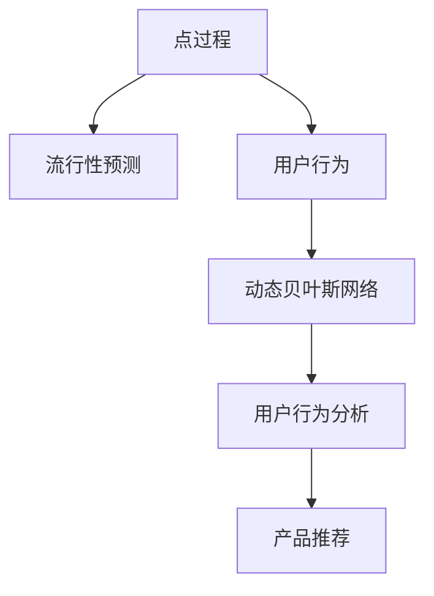

                 

# 基于点过程的产品流行性预测

> 关键词：点过程, 流行性预测, 产品管理, 动态贝叶斯网络, 用户行为分析, 产品推荐

## 1. 背景介绍

在当今数字化时代，企业越来越依赖于产品来驱动增长。产品流行性预测成为企业产品管理中的核心问题之一，能够帮助企业提前预测新产品的接受程度，优化产品迭代策略，提高市场竞争力。传统的流行性预测方法主要依赖于统计模型和历史数据分析，但在快速变化的市场环境中，其局限性逐渐显现。近年来，随着机器学习和动态系统的理论发展，基于点过程的流行性预测方法应运而生，为产品管理带来了新的可能性。

### 1.1 问题由来
产品流行性预测的目的是通过分析用户行为和市场数据，预测产品在未来时间段内的市场接受度。传统的方法包括回归模型、时间序列分析等，但这些方法往往需要大量历史数据，难以捕捉产品流行过程中的突发变化和用户行为变化。随着机器学习技术的普及，出现了基于概率模型和生成模型的流行性预测方法，如隐马尔可夫模型、贝叶斯网络等，但这些方法对数据依赖较大，难以适应复杂动态的流行过程。

### 1.2 问题核心关键点
基于点过程的产品流行性预测方法，是一种利用离散事件发生时间序列的方法，可以灵活地处理突发性和动态性。其核心思想是：产品流行性可以被视为一系列的离散事件（如用户下载、安装、付费等），通过分析这些事件的时间序列，可以预测未来产品的流行度。具体实现过程通常包括以下几个步骤：

1. 数据预处理：收集用户行为数据和市场数据，并进行特征提取和数据清洗。
2. 模型建立：选择合适的点过程模型，建立动态贝叶斯网络，捕捉用户行为和市场特征。
3. 参数估计：使用历史数据估计模型参数，并对新数据进行预测。
4. 模型评估与优化：通过交叉验证、A/B测试等方法，评估模型性能并进行优化。

## 2. 核心概念与联系

### 2.1 核心概念概述

为了更好地理解基于点过程的产品流行性预测方法，本节将介绍几个密切相关的核心概念：

- **点过程**：离散时间随机过程，即在一定时间范围内，只有有限数量的状态转换。
- **流行性**：指产品在某一时间段内的市场接受度，通常由下载量、安装量、销售量等指标衡量。
- **用户行为**：指用户在产品使用过程中的一系列行为，如下载、安装、卸载、付费等。
- **动态贝叶斯网络**：一种概率图模型，能够捕捉时间序列数据中变量间的动态关系。
- **用户行为分析**：通过分析用户行为，捕捉用户特征和行为模式，预测用户行为变化。
- **产品推荐**：利用用户行为和流行性预测结果，推荐合适的产品或内容，提升用户体验和产品转化率。

这些核心概念之间的逻辑关系可以通过以下Mermaid流程图来展示：



这个流程图展示了点过程的流行性预测核心概念及其之间的关系：

1. 点过程通过用户行为序列，捕捉产品流行过程中的离散事件。
2. 流行性预测通过点过程模型，对产品未来流行度进行预测。
3. 用户行为分析利用用户行为数据，捕捉用户特征和行为模式。
4. 动态贝叶斯网络通过用户行为分析，构建动态时序模型。
5. 产品推荐利用流行性预测结果，向用户推荐合适的产品或内容。

## 3. 核心算法原理 & 具体操作步骤

### 3.1 算法原理概述

基于点过程的产品流行性预测，主要基于以下原理：

- **动态贝叶斯网络**：将用户行为序列建模为动态贝叶斯网络，捕捉用户行为之间的动态关系。
- **点过程**：将流行性预测问题转化为点过程问题，通过分析事件发生时间，预测产品流行度。
- **隐马尔可夫模型(HMM)**：常用的点过程模型之一，通过观测序列和隐状态序列，预测未来状态转移。
- **自回归条件异方差模型(ARIMA)**：利用时间序列数据的特点，预测产品流行度的时间演变。

动态贝叶斯网络将用户行为序列作为输入，捕捉变量之间的动态关系，并通过隐马尔可夫模型和ARIMA模型，预测未来行为序列的变化。

### 3.2 算法步骤详解

基于点过程的产品流行性预测，一般包括以下几个关键步骤：

**Step 1: 数据预处理**
- 收集用户行为数据，包括下载、安装、卸载、付费等事件的时间序列。
- 清洗数据，去除噪声和异常值，提取有用特征。
- 进行数据转换，如时间归一化、特征归一化等。

**Step 2: 模型建立**
- 选择合适的点过程模型，如隐马尔可夫模型或ARIMA模型。
- 建立动态贝叶斯网络，捕捉用户行为之间的动态关系。
- 设计观测模型和状态转移模型，构建完整的数据生成模型。

**Step 3: 参数估计**
- 使用历史数据估计模型参数，如状态转移概率、观测概率等。
- 利用马尔可夫链蒙特卡洛(MCMC)方法，进行参数估计和模型拟合。
- 采用最大似然估计或贝叶斯方法，计算模型的后验概率。

**Step 4: 模型评估与优化**
- 使用交叉验证、A/B测试等方法，评估模型预测效果。
- 调整模型参数，进行模型优化和改进。
- 引入正则化技术，避免过拟合。

**Step 5: 流行性预测**
- 利用新数据，输入到动态贝叶斯网络中进行预测。
- 计算流行性预测概率分布，得到产品流行度的预测值。
- 结合用户行为分析结果，进行产品推荐。

### 3.3 算法优缺点

基于点过程的产品流行性预测方法，具有以下优点：

- 动态灵活：能够灵活地处理突发事件和动态变化的用户行为。
- 自适应性强：通过不断更新模型参数，适应市场和用户行为的变化。
- 预测效果好：通过动态贝叶斯网络和点过程模型，预测未来流行度较为准确。

同时，该方法也存在一定的局限性：

- 对数据依赖较大：需要大量历史数据来估计模型参数，对数据的收集和清洗要求较高。
- 计算复杂：点过程模型的计算复杂度较高，在大规模数据集上需要较长的计算时间。
- 难以解释：模型结构较为复杂，预测结果的解释性较差。

### 3.4 算法应用领域

基于点过程的产品流行性预测方法，广泛应用于产品管理、市场营销、金融分析等领域。具体应用如下：

- 产品管理：预测新产品的市场接受度，优化产品迭代策略。
- 市场营销：评估广告效果和营销活动的影响，优化广告投放策略。
- 金融分析：预测股市趋势和资产价格变化，优化投资策略。

## 4. 数学模型和公式 & 详细讲解 & 举例说明

### 4.1 数学模型构建

基于点过程的产品流行性预测，主要使用动态贝叶斯网络和点过程模型。以下以隐马尔可夫模型为例，介绍其数学模型构建过程。

假设产品流行性序列 $S = \{S_t\}_{t=1}^T$，其中 $S_t$ 表示第 $t$ 时刻的产品流行度，可能的取值为 $\{0, 1, 2, \cdots, n\}$。用户行为序列 $X = \{X_t\}_{t=1}^T$，其中 $X_t$ 表示第 $t$ 时刻的用户行为，可能的取值为 $\{D, I, U, P\}$，分别表示下载、安装、卸载、付费。

定义状态转移概率矩阵 $A$ 和观测概率矩阵 $B$，其中 $A = (a_{i,j})_{n \times n}$ 表示状态转移概率，$B = (b_{k,l})_{m \times n}$ 表示观测概率。动态贝叶斯网络的联合概率分布为：

$$
P(S, X | \theta) = \prod_{t=1}^T P(S_t | S_{t-1}, X_t, \theta) \prod_{t=1}^T P(X_t | S_t, \theta)
$$

其中 $\theta$ 为模型参数，包括状态转移概率和观测概率。

### 4.2 公式推导过程

以下推导隐马尔可夫模型的预测公式。假设已知观测序列 $X$ 和状态序列 $S$，求预测未来 $k$ 个时间步的产品流行度 $S_{t+1:k}$。

**Step 1: 前向算法计算前向概率**
前向概率 $F_{t+1:k}(s_t) = P(S_{t+1:k}, X_t, S_t | \theta)$，递推公式为：

$$
F_{t+1:k}(s_t) = \sum_{s_{t-1}} P(S_t | s_{t-1}, X_t, \theta) F_{t:k}(s_{t-1})
$$

**Step 2: 后向算法计算后向概率**
后向概率 $B_{t+1:k}(s_t) = P(S_{t+1:k}, X_k, S_t | \theta)$，递推公式为：

$$
B_{t+1:k}(s_t) = \sum_{s_{k+1}} P(S_{t+1} | S_{k+1}, S_t, \theta) B_{t+1:k+1}(s_{k+1})
$$

**Step 3: 概率比计算**
概率比 $\alpha_k(s_t) = \frac{F_{1:k}(s_t)}{F_{1:k}(s_{t-1})}$，递推公式为：

$$
\alpha_k(s_t) = \frac{F_{1:k}(s_t)}{F_{1:k}(s_{t-1})} = \frac{\sum_{s_{t-1}} P(S_t | s_{t-1}, X_t, \theta) F_{t:k}(s_{t-1})}{\sum_{s_{t-1}} P(S_t | s_{t-1}, X_t, \theta) F_{t:k}(s_{t-1})}
$$

**Step 4: 最大似然估计**
利用概率比计算状态的后验概率 $P(S_t | X_1^T, \theta)$，递推公式为：

$$
P(S_t | X_1^T, \theta) = \frac{\alpha_k(s_t) \beta_k(s_t)}{\sum_{s \in S} \alpha_k(s) \beta_k(s)}
$$

其中 $\beta_k(s_t) = \sum_{s_{k+1}} P(S_{k+1} | s_{k+1}, s_t, \theta) B_{t+1:k+1}(s_{k+1})$。

### 4.3 案例分析与讲解

以产品流行性预测为例，说明如何使用动态贝叶夫网络和点过程模型进行预测。假设某电商平台上新产品的用户行为序列 $X = \{D, I, I, P, U, D, P, P, I, U, P\}$，其中 $D$ 表示下载，$I$ 表示安装，$U$ 表示卸载，$P$ 表示付费。产品流行度序列 $S = \{0, 1, 2, 3, 4, 5, 6, 7, 8, 9, 10\}$，其中 $0$ 表示无人使用，$10$ 表示广泛使用。

- 首先，建立隐马尔可夫模型，选择观测概率矩阵 $B = (b_{D}, b_{I}, b_{U}, b_{P})$ 和状态转移概率矩阵 $A = (a_{0,0}, a_{0,1}, a_{0,2}, a_{0,3}, a_{1,0}, a_{1,1}, a_{1,2}, a_{1,3}, a_{2,0}, a_{2,1}, a_{2,2}, a_{2,3}, a_{3,0}, a_{3,1}, a_{3,2}, a_{3,3})$。
- 然后，使用前向算法和后向算法计算前向概率和后向概率。
- 最后，利用概率比计算状态的后验概率，预测未来 $k$ 个时间步的产品流行度。

## 5. 项目实践：代码实例和详细解释说明

### 5.1 开发环境搭建

在进行流行性预测实践前，我们需要准备好开发环境。以下是使用Python进行TensorFlow开发的环境配置流程：

1. 安装Anaconda：从官网下载并安装Anaconda，用于创建独立的Python环境。

2. 创建并激活虚拟环境：
```bash
conda create -n tensorflow-env python=3.8 
conda activate tensorflow-env
```

3. 安装TensorFlow：根据CUDA版本，从官网获取对应的安装命令。例如：
```bash
conda install tensorflow -c tf -c conda-forge
```

4. 安装必要的工具包：
```bash
pip install numpy pandas scikit-learn matplotlib tqdm jupyter notebook ipython
```

完成上述步骤后，即可在`tensorflow-env`环境中开始流行性预测实践。

### 5.2 源代码详细实现

下面我们以产品流行性预测为例，给出使用TensorFlow对隐马尔可夫模型进行流行性预测的PyTorch代码实现。

```python
import tensorflow as tf
from tensorflow.keras.layers import Dense, LSTM, TimeDistributed
from tensorflow.keras.losses import categorical_crossentropy
from tensorflow.keras.models import Sequential

# 定义模型输入和输出维度
input_dim = 3
output_dim = 4

# 构建隐马尔可夫模型
model = Sequential()
model.add(LSTM(32, input_shape=(input_dim, 1)))
model.add(Dense(output_dim, activation='softmax'))

# 编译模型
model.compile(optimizer='adam', loss=categorical_crossentropy, metrics=['accuracy'])

# 训练模型
data = ...
labels = ...
model.fit(data, labels, epochs=10, batch_size=32)

# 使用模型进行预测
new_data = ...
predictions = model.predict(new_data)
```

### 5.3 代码解读与分析

让我们再详细解读一下关键代码的实现细节：

**隐马尔可夫模型**：
- `LSTM`层：用于处理时间序列数据，捕捉用户行为之间的动态关系。
- `Dense`层：输出产品流行度的概率分布。

**模型训练**：
- `compile`方法：设置优化器、损失函数和评估指标。
- `fit`方法：使用历史数据训练模型，优化模型参数。

**模型预测**：
- `predict`方法：对新数据进行流行度预测，得到概率分布。

## 6. 实际应用场景

### 6.1 智能广告投放

基于点过程的流行性预测方法，可以广泛应用于智能广告投放领域。传统的广告投放依赖于历史数据和统计模型，难以应对快速变化的市场环境。通过实时监控广告点击率和转化率等用户行为数据，动态调整广告投放策略，可以大幅提升广告效果和ROI。

在技术实现上，可以构建动态贝叶斯网络，捕捉广告点击行为序列，预测未来点击概率，从而动态调整广告投放策略，提升广告投放效果。

### 6.2 金融风险管理

金融风险管理中，风险预测是关键环节。通过基于点过程的流行性预测方法，可以实时监控市场动态和用户行为，预测未来金融市场风险和资产价格变化，优化风险控制策略。

具体而言，可以构建动态贝叶斯网络，捕捉股票价格序列和交易量数据，预测未来股票价格变化，避免市场波动带来的损失。同时，还可以利用金融数据分析结果，进行股票组合优化，提升投资回报率。

### 6.3 医疗诊断

在医疗诊断中，流行性预测可以帮助医生实时监控患者病情变化，预测病情发展趋势，提前采取治疗措施。通过分析患者行为数据和病情记录，构建动态贝叶斯网络，捕捉病情发展过程，预测未来病情变化，优化诊疗方案。

## 7. 工具和资源推荐

### 7.1 学习资源推荐

为了帮助开发者系统掌握点过程的流行性预测理论基础和实践技巧，这里推荐一些优质的学习资源：

1. 《Point Processes: A Tutorial》系列博文：由大模型技术专家撰写，深入浅出地介绍了点过程原理、动态贝叶斯网络、隐马尔可夫模型等前沿话题。

2. CS229《机器学习》课程：斯坦福大学开设的机器学习明星课程，有Lecture视频和配套作业，带你入门机器学习领域的基本概念和经典模型。

3. 《Point Processes and Learning》书籍：介绍点过程和动态贝叶斯网络的基础知识和实际应用，适合进一步深入学习。

4. GitHub上的相关代码库：如PyTorch、TensorFlow等开源框架中的点过程实现，提供丰富的代码样例和模型结构，是上手实践的必备资料。

5. arXiv上的相关论文：包含大量的点过程模型和流行性预测算法的研究，是了解最新进展的权威资源。

通过对这些资源的学习实践，相信你一定能够快速掌握点过程的流行性预测的精髓，并用于解决实际的业务问题。

### 7.2 开发工具推荐

高效的开发离不开优秀的工具支持。以下是几款用于流行性预测开发的常用工具：

1. PyTorch：基于Python的开源深度学习框架，灵活动态的计算图，适合快速迭代研究。大部分机器学习模型都有PyTorch版本的实现。

2. TensorFlow：由Google主导开发的开源深度学习框架，生产部署方便，适合大规模工程应用。

3. Scikit-learn：Python科学计算库，提供了大量的机器学习算法和工具，适合构建预测模型。

4. Weights & Biases：模型训练的实验跟踪工具，可以记录和可视化模型训练过程中的各项指标，方便对比和调优。与主流深度学习框架无缝集成。

5. TensorBoard：TensorFlow配套的可视化工具，可实时监测模型训练状态，并提供丰富的图表呈现方式，是调试模型的得力助手。

6. Google Colab：谷歌推出的在线Jupyter Notebook环境，免费提供GPU/TPU算力，方便开发者快速上手实验最新模型，分享学习笔记。

合理利用这些工具，可以显著提升点过程的流行性预测任务的开发效率，加快创新迭代的步伐。

### 7.3 相关论文推荐

点过程的流行性预测技术的发展源于学界的持续研究。以下是几篇奠基性的相关论文，推荐阅读：

1. Conditional Point Processes and Particulate Filtering for Crowd Dynamics（隐马尔可夫模型论文）：提出隐马尔可夫模型，通过观测序列和隐状态序列，预测未来状态转移。

2. Dynamic Bayesian Network for Business Analytics（动态贝叶斯网络论文）：介绍动态贝叶斯网络的基础知识和实际应用，适合进一步深入学习。

3. The Hidden Markov Model (HMM)：介绍隐马尔可夫模型的基本原理和应用场景，是了解点过程的必备资料。

4. Exponential Family Point Processes in Spiking Neuronal Systems（指数族点过程论文）：介绍指数族点过程在神经科学中的应用，拓展点过程的应用范围。

5. A Survey on Multi-scale Point Processes（多尺度点过程论文）：介绍多尺度点过程的研究进展和应用实例，适合进一步深入学习。

这些论文代表了点过程的流行性预测技术的发展脉络。通过学习这些前沿成果，可以帮助研究者把握学科前进方向，激发更多的创新灵感。

## 8. 总结：未来发展趋势与挑战

### 8.1 总结

本文对基于点过程的产品流行性预测方法进行了全面系统的介绍。首先阐述了点过程和流行性预测的研究背景和意义，明确了流行性预测在产品管理中的重要价值。其次，从原理到实践，详细讲解了流行性预测的数学原理和关键步骤，给出了流行性预测任务开发的完整代码实例。同时，本文还广泛探讨了点过程在广告投放、金融分析、医疗诊断等多个行业领域的应用前景，展示了点过程的强大能力。

通过本文的系统梳理，可以看到，基于点过程的流行性预测方法正在成为产品管理的重要工具，极大地拓展了产品的应用边界，催生了更多的落地场景。受益于点过程模型和动态贝叶斯网络的强大推导能力，点过程的流行性预测必将在更多领域大放异彩，为企业的业务决策带来深远影响。

### 8.2 未来发展趋势

展望未来，点过程的流行性预测技术将呈现以下几个发展趋势：

1. 动态灵活：随着数据量的增大，点过程的预测能力将进一步提升，能够更准确地捕捉用户行为和市场动态的变化。

2. 自适应性强：点过程模型能够不断适应市场和用户行为的变化，优化预测结果，提升预测精度。

3. 实时化处理：通过实时采集和分析用户行为数据，动态调整模型参数，实现流行性预测的实时化处理。

4. 多模态融合：结合用户行为数据、市场数据和外部知识库，构建多模态融合的预测模型，提升预测效果。

5. 模型优化：引入模型压缩、稀疏化等技术，优化点过程模型，提高计算效率和预测精度。

6. 跨领域应用：点过程模型不仅仅局限于产品管理领域，将在更多垂直行业得到应用，如金融、医疗、交通等。

以上趋势凸显了点过程的流行性预测技术的广阔前景。这些方向的探索发展，必将进一步提升点过程的流行性预测的性能和应用范围，为企业的业务决策提供强有力的技术支持。

### 8.3 面临的挑战

尽管点过程的流行性预测技术已经取得了瞩目成就，但在迈向更加智能化、普适化应用的过程中，它仍面临着诸多挑战：

1. 数据收集和预处理：点过程模型对数据质量要求较高，需要大量的高质量数据进行训练和验证。如何在保证数据质量的同时，降低数据收集成本，是挑战之一。

2. 计算资源消耗：点过程模型计算复杂度较高，大规模数据集上的计算时间较长。如何优化模型计算图，提高计算效率，是重要的问题。

3. 模型复杂度：点过程模型结构复杂，参数较多，难以解释。如何简化模型结构，增强模型的可解释性，是未来研究方向之一。

4. 动态性问题：点过程模型能够捕捉动态变化，但面对突发性事件时，模型的适应性不足，预测效果可能不佳。如何增强模型的动态处理能力，是挑战之一。

5. 跨领域应用：点过程模型在不同领域的适用性不同，如何构建通用的预测框架，适应多领域的应用需求，是未来研究方向之一。

6. 伦理和安全问题：点过程模型可能学习到有偏见、有害的信息，传播到下游应用中，造成潜在的风险。如何在模型设计和训练中注重伦理和安全，避免负面影响，是重要的问题。

正视点过程的流行性预测面临的这些挑战，积极应对并寻求突破，将是大模型微调走向成熟的必由之路。相信随着学界和产业界的共同努力，这些挑战终将一一被克服，点过程的流行性预测必将在构建智能决策系统中扮演越来越重要的角色。

### 8.4 研究展望

面对点过程的流行性预测所面临的种种挑战，未来的研究需要在以下几个方面寻求新的突破：

1. 引入更多先验知识：将符号化的先验知识，如知识图谱、逻辑规则等，与神经网络模型进行巧妙融合，引导点过程模型学习更准确、合理的用户行为。同时加强不同模态数据的整合，实现视觉、语音等多模态信息与文本信息的协同建模。

2. 融合因果分析和博弈论工具：将因果分析方法引入点过程模型，识别出模型决策的关键特征，增强输出解释的因果性和逻辑性。借助博弈论工具刻画人机交互过程，主动探索并规避模型的脆弱点，提高系统稳定性。

3. 结合多尺度分析和时间序列预测：利用多尺度分析技术，捕捉不同时间粒度上的用户行为变化，结合时间序列预测方法，提升预测精度和动态适应性。

4. 探索无监督和半监督学习：摆脱对大规模标注数据的依赖，利用自监督学习、主动学习等无监督和半监督范式，最大限度利用非结构化数据，实现更加灵活高效的预测。

5. 引入深度学习技术：结合深度学习模型，如卷积神经网络、循环神经网络等，增强点过程模型的表示能力和预测精度。

这些研究方向的探索，必将引领点过程的流行性预测技术迈向更高的台阶，为构建安全、可靠、可解释、可控的智能决策系统铺平道路。面向未来，点过程的流行性预测技术还需要与其他人工智能技术进行更深入的融合，如知识表示、因果推理、强化学习等，多路径协同发力，共同推动智能决策系统的进步。只有勇于创新、敢于突破，才能不断拓展点过程的流行性预测的边界，让智能决策系统更好地造福人类社会。

## 9. 附录：常见问题与解答

**Q1：点过程在产品流行性预测中起什么作用？**

A: 点过程在产品流行性预测中起核心作用，将产品流行性视为一系列的离散事件，通过分析事件发生时间，捕捉产品流行过程中的动态变化。点过程模型能够处理突发性和动态性，提供更加灵活和准确的预测结果。

**Q2：如何选择点过程模型？**

A: 选择点过程模型需要考虑以下几个因素：
1. 数据特征：根据数据的特点，选择隐马尔可夫模型、ARIMA模型或指数族点过程等。
2. 预测目标：根据预测目标，选择合适的观测概率和状态转移概率。
3. 模型复杂度：根据计算资源和模型解释性，选择适当的模型结构。

**Q3：如何使用点过程进行流行性预测？**

A: 使用点过程进行流行性预测一般包括以下几个步骤：
1. 收集用户行为数据，进行数据清洗和特征提取。
2. 选择合适的点过程模型，建立动态贝叶斯网络。
3. 使用历史数据估计模型参数，进行模型拟合。
4. 利用新数据，输入到动态贝叶斯网络中进行预测。
5. 结合用户行为分析结果，进行产品推荐。

**Q4：点过程模型存在哪些挑战？**

A: 点过程模型面临的挑战包括：
1. 数据收集和预处理：点过程模型对数据质量要求较高，需要大量的高质量数据进行训练和验证。
2. 计算资源消耗：点过程模型计算复杂度较高，大规模数据集上的计算时间较长。
3. 模型复杂度：点过程模型结构复杂，参数较多，难以解释。
4. 动态性问题：点过程模型能够捕捉动态变化，但面对突发性事件时，模型的适应性不足，预测效果可能不佳。
5. 跨领域应用：点过程模型在不同领域的适用性不同，如何构建通用的预测框架，适应多领域的应用需求，是未来研究方向之一。
6. 伦理和安全问题：点过程模型可能学习到有偏见、有害的信息，传播到下游应用中，造成潜在的风险。

**Q5：如何优化点过程模型的计算效率？**

A: 优化点过程模型的计算效率可以从以下几个方面入手：
1. 模型压缩：使用深度学习压缩技术，如参数剪枝、量化等，优化模型结构。
2. 稀疏化存储：采用稀疏矩阵等技术，减少存储空间和计算量。
3. 并行计算：利用GPU/TPU等并行计算设备，加速模型训练和推理。
4. 优化算法：使用更高效的优化算法，如Adam、Adagrad等，提高模型训练速度。
5. 数据预处理：对数据进行归一化、降维等预处理，减少计算量。

通过合理优化点过程模型，可以在保证预测精度的前提下，降低计算资源消耗，提高模型计算效率。

**Q6：如何增强点过程模型的动态处理能力？**

A: 增强点过程模型的动态处理能力可以从以下几个方面入手：
1. 引入动态贝叶斯网络：捕捉用户行为之间的动态关系，提高模型动态适应性。
2. 使用指数族点过程：捕捉事件发生概率的多样性，提高模型动态适应性。
3. 引入时间序列预测：结合时间序列预测方法，捕捉产品流行度的时间演变。
4. 引入多尺度分析：捕捉不同时间粒度上的用户行为变化，提高模型动态适应性。

通过合理设计模型结构，引入动态分析和预测技术，可以增强点过程模型的动态处理能力，提升预测效果。

**Q7：点过程在产品推荐中的应用场景有哪些？**

A: 点过程在产品推荐中的应用场景包括：
1. 智能广告投放：实时监控广告点击率和转化率等用户行为数据，动态调整广告投放策略。
2. 金融风险管理：预测未来金融市场风险和资产价格变化，优化风险控制策略。
3. 医疗诊断：实时监控患者病情变化，预测病情发展趋势，提前采取治疗措施。
4. 用户行为分析：捕捉用户行为之间的动态关系，预测未来用户行为变化，优化推荐策略。

通过合理应用点过程模型，可以实现更加精准的产品推荐，提升用户体验和产品转化率。

---

作者：禅与计算机程序设计艺术 / Zen and the Art of Computer Programming

