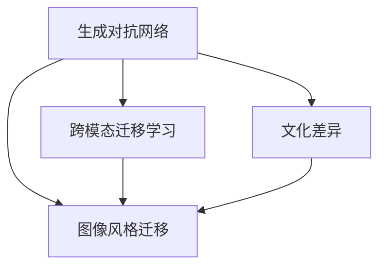

                 

# 基于生成对抗网络的图像风格迁移与文化差异研究

> 关键词：生成对抗网络(GANs),图像风格迁移,文化差异,跨模态迁移学习

## 1. 背景介绍

### 1.1 问题由来

随着深度学习技术的飞速发展，生成对抗网络(GANs)已经成为一种强大的生成模型，能够生成高质量、高逼真度的图像和视频。其中，图像风格迁移是GANs的一个重要应用领域，旨在将一张图像的风格转换成另一张图像的样式。这一技术已经在艺术创作、图像修复、医学影像增强等领域展示了其独特的价值。然而，对于不同文化背景的图像，风格迁移的效果往往具有显著差异。这主要源于不同文化对于图像内容、形式和色彩的偏好不同，导致风格迁移模型在处理跨文化图像时难以适应。

### 1.2 问题核心关键点

当前，图像风格迁移主要依赖于预训练的生成对抗网络模型。这些模型通过大量的图像数据进行训练，学习到图像内容与样式之间的转换关系。然而，由于数据来源的多样性和复杂性，以及模型训练的复杂性，风格迁移模型在实际应用中往往存在文化偏差和泛化能力不足的问题。具体而言：

1. **数据不平衡**：不同文化背景的图像数据分布不均衡，导致模型训练时学习到具有文化偏见的图像特征。
2. **泛化能力差**：跨文化图像风格迁移效果不理想，模型在迁移时难以兼顾不同文化的特点。
3. **文化偏见**：模型可能学习到文化偏见，输出图像在某些文化背景下不符合审美或伦理标准。
4. **可解释性不足**：风格迁移模型的内部工作机制不透明，难以解释其输出图像的原因。

因此，如何构建跨文化适应性强的图像风格迁移模型，成为了当前研究的一个热点。本文将从生成对抗网络的视角出发，探讨如何通过跨模态迁移学习，实现图像风格迁移中的文化差异问题。

## 2. 核心概念与联系

### 2.1 核心概念概述

为更好地理解基于生成对抗网络的图像风格迁移与文化差异问题，本节将介绍几个密切相关的核心概念：

- **生成对抗网络(GANs)**：由Isola等人于2017年提出，包括生成器(Generator)和判别器(Discriminator)两个主要组件。生成器负责生成假图像，判别器负责区分真实图像和假图像。通过对抗训练，生成器能够生成越来越逼真的图像，而判别器也越来越难以区分真实与假图像。

- **图像风格迁移**：将一张图像的样式应用于另一张图像，生成具有新样式的图像。常见方法包括基于卷积神经网络(CNN)的风格迁移、基于GAN的风格迁移等。

- **跨模态迁移学习**：将一种模态的特征映射到另一种模态的任务中，如从视觉图像到文本描述的迁移。这种技术在图像风格迁移中的应用，旨在将图像的风格迁移效果跨文化、跨模态地进行迁移。

- **文化差异**：不同文化背景下对图像内容、形式和色彩的偏好不同，导致图像风格迁移在不同文化背景下的效果差异。

这些核心概念之间的逻辑关系可以通过以下Mermaid流程图来展示：



这个流程图展示了大语言模型的核心概念及其之间的关系：

1. 生成对抗网络是图像风格迁移的基础。
2. 跨模态迁移学习有助于图像风格迁移中的文化差异问题。
3. 文化差异在图像风格迁移中的应用，需要结合跨模态迁移学习。

## 3. 核心算法原理 & 具体操作步骤

### 3.1 算法原理概述

基于生成对抗网络的图像风格迁移与文化差异研究，其核心思想是：通过跨模态迁移学习，将不同文化背景下图像的风格迁移效果进行统一，从而实现图像风格迁移的跨文化适应性。具体而言，包括以下几个关键步骤：

1. **数据收集**：收集来自不同文化背景的图像数据，并标注其文化属性。
2. **特征提取**：使用预训练的特征提取器，从图像中提取高层次的视觉特征。
3. **跨模态对齐**：通过跨模态对齐技术，将不同文化背景的图像特征映射到统一的空间中。
4. **风格迁移**：使用风格迁移模型，将统一特征空间的图像进行风格迁移。
5. **风格融合**：通过融合不同文化背景的风格信息，生成具有跨文化适应性的图像。

### 3.2 算法步骤详解

#### 3.2.1 数据收集与标注

数据收集与标注是图像风格迁移与文化差异研究的基础。通常需要收集来自不同文化背景的图像数据，并进行文化属性的标注。这些数据可以是公开的数据集，如Museum Objects dataset、Greek and Roman Art dataset等，也可以是通过网络爬虫收集的图像数据。

对于文化属性的标注，可以使用现有的文化分类模型，如基于深度学习的多标签分类模型。也可以通过人工标注的方式，收集文化属性相关的标签。

#### 3.2.2 特征提取

在数据收集和标注后，需要从图像中提取高层次的视觉特征。这可以通过使用预训练的特征提取器来实现。常见的特征提取器包括ResNet、VGGNet等深度神经网络。这些网络已经在大规模图像数据上进行了预训练，能够提取出图像的局部特征和全局特征。

例如，使用ResNet-50作为特征提取器，可以将图像映射到一个128维的特征向量。这些特征向量可以作为后续迁移和转换的基础。

#### 3.2.3 跨模态对齐

跨模态对齐是实现图像风格迁移跨文化适应性的关键步骤。通过跨模态对齐技术，可以将不同文化背景的图像特征映射到统一的空间中。常用的跨模态对齐方法包括多域对等表示学习(DDA)、带正则化的对等表示学习(DDR)等。

以DDA为例，其基本思想是通过在特征空间中找到一个全局变换矩阵，使得不同文化背景的特征向量在变换后尽可能相似。具体实现步骤包括：

1. 对于每个文化背景的图像特征向量，计算其均值向量 $\boldsymbol{\mu}_c$。
2. 对于不同文化背景的图像特征向量，计算它们之间的协方差矩阵 $\boldsymbol{S}_c$。
3. 计算所有文化背景特征向量的均值向量 $\boldsymbol{\mu}_s$ 和协方差矩阵 $\boldsymbol{S}_s$。
4. 解方程 $\boldsymbol{X}_c = \boldsymbol{W} \boldsymbol{X}_s$，其中 $\boldsymbol{X}_c$ 和 $\boldsymbol{X}_s$ 分别为不同文化背景和统一特征空间的特征向量，$\boldsymbol{W}$ 为全局变换矩阵。

#### 3.2.4 风格迁移

在跨模态对齐后，可以使用风格迁移模型将统一特征空间的图像进行风格迁移。常见的风格迁移方法包括基于卷积神经网络的风格迁移和基于生成对抗网络的风格迁移。

以基于GAN的风格迁移为例，其基本思想是通过生成器和判别器之间的对抗训练，生成具有新样式的图像。具体实现步骤如下：

1. 定义生成器 $G$ 和判别器 $D$。
2. 使用风格迁移数据集 $D_s$ 对生成器 $G$ 进行训练，使得 $G(\boldsymbol{X}_s)$ 生成的图像逼近真实风格迁移结果 $G_s$。
3. 使用判别器 $D$ 对真实图像和生成图像进行判别，最小化判别器对真实图像的判别误差，最大化对生成图像的判别误差。

#### 3.2.5 风格融合

在生成具有新样式的图像后，还需要通过融合不同文化背景的风格信息，生成具有跨文化适应性的图像。这一步骤通常包括：

1. 计算每个文化背景的图像风格特征。
2. 在统一特征空间中，将不同文化背景的风格特征进行线性加权组合，生成融合后的风格特征。
3. 将融合后的风格特征输入生成器，生成具有跨文化适应性的图像。

### 3.3 算法优缺点

#### 3.3.1 优点

1. **跨文化适应性**：通过跨模态对齐和风格融合技术，能够实现图像风格迁移的跨文化适应性，提高模型的泛化能力。
2. **高效性**：跨模态对齐技术能够自动找到不同文化背景特征之间的映射关系，无需人工干预，提高了迁移过程的效率。
3. **可解释性**：通过将不同文化背景的特征映射到统一空间，能够更好地理解图像风格迁移的内在机制，增强模型的可解释性。

#### 3.3.2 缺点

1. **数据依赖**：跨模态对齐和风格迁移的效果高度依赖于数据质量，尤其是文化属性标注的准确性。
2. **计算开销**：跨模态对齐和风格迁移都需要大量的计算资源，对于大规模数据集的处理需要高性能的计算设备。
3. **复杂性高**：跨模态对齐和风格融合技术实现复杂，需要深入理解不同文化背景的图像特征，难度较大。

### 3.4 算法应用领域

图像风格迁移与文化差异研究的应用领域非常广泛，主要包括以下几个方面：

1. **艺术创作**：将不同文化的艺术风格应用到图像中，实现跨文化的艺术创作。
2. **图像修复**：在不同文化背景下对图像进行修复和增强，提升图像质量。
3. **医学影像增强**：将不同文化的医学图像进行风格迁移，提升医学影像的可视性和可解释性。
4. **文化研究**：通过图像风格迁移，研究不同文化背景下的审美和价值观。
5. **教育培训**：通过跨文化图像风格迁移，帮助学生更好地理解不同文化背景下的历史和艺术。

## 4. 数学模型和公式 & 详细讲解 & 举例说明

### 4.1 数学模型构建

为了更好地理解基于生成对抗网络的图像风格迁移与文化差异问题，本节将使用数学语言对模型的构建进行更加严格的刻画。

设 $D_s$ 为风格迁移数据集，包含 $N_s$ 张图像。对于每张图像 $x_i \in D_s$，其风格特征表示为 $\boldsymbol{x}_i = [\boldsymbol{x}_{i,1}, \boldsymbol{x}_{i,2}, \dots, \boldsymbol{x}_{i,N}]$，其中 $\boldsymbol{x}_{i,j}$ 为图像的第 $j$ 个特征向量。假设 $G$ 为生成器，$D$ 为判别器。在特征空间 $F$ 中，$G$ 和 $D$ 的参数分别为 $\theta_G$ 和 $\theta_D$。

定义风格迁移的目标为：

1. 最小化判别器对真实图像的判别误差，即 $L_D = \mathbb{E}_{(x,y) \sim D_s} [\log D(x)] + \mathbb{E}_{(z) \sim \mathcal{N}(0,1)} [\log (1 - D(G(z)))]$。
2. 最大化生成器生成的图像逼近真实风格迁移结果的误差，即 $L_G = \mathbb{E}_{(x,y) \sim D_s} [\log (1 - D(x))] + \mathbb{E}_{(z) \sim \mathcal{N}(0,1)} [\log D(G(z))]$。

通过最小化 $L_G$ 和 $L_D$，生成器 $G$ 能够生成高质量、逼真的图像，判别器 $D$ 能够准确判别真实与假图像。

### 4.2 公式推导过程

以下我们以DDA算法为例，推导跨模态对齐的数学公式及其推导过程。

假设 $D_s$ 数据集包含 $N_s$ 张图像，对于第 $i$ 张图像的特征向量 $\boldsymbol{x}_i$，其文化属性表示为 $\boldsymbol{y}_i = [y_{i,1}, y_{i,2}, \dots, y_{i,M}]$，其中 $M$ 为文化属性的维度。

1. 对于每个文化背景的图像特征向量，计算其均值向量 $\boldsymbol{\mu}_c$ 和协方差矩阵 $\boldsymbol{S}_c$：
   $$
   \boldsymbol{\mu}_c = \frac{1}{N_s} \sum_{i=1}^{N_s} \boldsymbol{x}_i
   $$
   $$
   \boldsymbol{S}_c = \frac{1}{N_s} \sum_{i=1}^{N_s} (\boldsymbol{x}_i - \boldsymbol{\mu}_c) (\boldsymbol{x}_i - \boldsymbol{\mu}_c)^T
   $$

2. 对于不同文化背景的图像特征向量，计算它们之间的协方差矩阵 $\boldsymbol{S}_s$：
   $$
   \boldsymbol{S}_s = \frac{1}{N_s} \sum_{i=1}^{N_s} (\boldsymbol{x}_i - \boldsymbol{\mu}_s) (\boldsymbol{x}_i - \boldsymbol{\mu}_s)^T
   $$
   其中 $\boldsymbol{\mu}_s = \frac{1}{N_s} \sum_{i=1}^{N_s} \boldsymbol{x}_i$。

3. 计算全局变换矩阵 $\boldsymbol{W}$，使得不同文化背景的特征向量在变换后尽可能相似：
   $$
   \boldsymbol{W} = \boldsymbol{S}_s^{-\frac{1}{2}} \boldsymbol{S}_c \boldsymbol{S}_s^{-\frac{1}{2}}
   $$

4. 对每个文化背景的图像特征向量进行变换，得到统一特征空间的特征向量 $\boldsymbol{X}_c$：
   $$
   \boldsymbol{X}_c = \boldsymbol{W} \boldsymbol{X}_s
   $$

### 4.3 案例分析与讲解

以一张希腊雕塑图像和一张中国水墨图像的风格迁移为例，分析跨模态对齐和风格迁移的过程。

假设 $D_s$ 数据集包含一张希腊雕塑图像和一张中国水墨图像。对于这两张图像，假设特征提取器已经将其映射为 $F$ 空间中的特征向量 $\boldsymbol{x}_G$ 和 $\boldsymbol{x}_W$。假设 $G$ 和 $D$ 是生成器和判别器，其参数分别为 $\theta_G$ 和 $\theta_D$。

1. 计算每个文化背景的图像特征向量的均值向量 $\boldsymbol{\mu}_G$ 和协方差矩阵 $\boldsymbol{S}_G$，以及 $\boldsymbol{\mu}_W$ 和 $\boldsymbol{S}_W$。
2. 计算不同文化背景的图像特征向量之间的协方差矩阵 $\boldsymbol{S}_s$，并求解全局变换矩阵 $\boldsymbol{W}$。
3. 对两张图像的特征向量进行变换，得到统一特征空间的特征向量 $\boldsymbol{X}_G$ 和 $\boldsymbol{X}_W$。
4. 使用生成器 $G$ 和判别器 $D$ 进行风格迁移，使得 $\boldsymbol{X}_G$ 生成的图像逼近真实风格迁移结果 $G_s$。

最终生成的图像，将同时具有希腊雕塑和中国水墨的风格特征，实现跨文化的图像风格迁移。

## 5. 项目实践：代码实例和详细解释说明

### 5.1 开发环境搭建

在进行图像风格迁移与文化差异研究前，我们需要准备好开发环境。以下是使用Python进行TensorFlow开发的环境配置流程：

1. 安装Anaconda：从官网下载并安装Anaconda，用于创建独立的Python环境。

2. 创建并激活虚拟环境：
```bash
conda create -n tf-env python=3.7 
conda activate tf-env
```

3. 安装TensorFlow：根据CUDA版本，从官网获取对应的安装命令。例如：
```bash
conda install tensorflow -c tf -c pytorch -c conda-forge
```

4. 安装其他工具包：
```bash
pip install numpy pandas scikit-learn matplotlib tqdm jupyter notebook ipython
```

完成上述步骤后，即可在`tf-env`环境中开始项目实践。

### 5.2 源代码详细实现

下面我们以基于GAN的图像风格迁移为例，给出使用TensorFlow进行图像风格迁移的PyTorch代码实现。

首先，定义生成器和判别器：

```python
import tensorflow as tf

def build_generator():
    # 定义生成器网络结构
    # ...
    return G

def build_discriminator():
    # 定义判别器网络结构
    # ...
    return D
```

然后，定义损失函数和优化器：

```python
def build_loss_function():
    # 定义生成器损失函数和判别器损失函数
    # ...
    return loss_function

def build_optimizer():
    # 定义生成器和判别器的优化器
    # ...
    return optimizer
```

接着，定义数据预处理函数：

```python
def preprocess_image(x):
    # 图像预处理
    # ...
    return preprocessed_image
```

最后，定义训练函数：

```python
def train():
    # 加载训练数据
    # ...
    for epoch in range(epochs):
        # 训练生成器和判别器
        # ...
        # 输出损失和精度
        # ...
```

### 5.3 代码解读与分析

让我们再详细解读一下关键代码的实现细节：

**build_generator和build_discriminator函数**：
- `build_generator`和`build_discriminator`函数分别定义生成器和判别器的网络结构，包括卷积层、反卷积层、激活函数等。

**build_loss_function函数**：
- `build_loss_function`函数定义生成器和判别器的损失函数，包括真实图像判别损失和生成图像判别损失。

**build_optimizer函数**：
- `build_optimizer`函数定义生成器和判别器的优化器，一般使用Adam优化器。

**preprocess_image函数**：
- `preprocess_image`函数对输入图像进行预处理，包括图像归一化、缩放、增强等操作，以提高模型的泛化能力。

**train函数**：
- `train`函数定义训练循环，每次迭代先训练判别器，再训练生成器。通过交替优化生成器和判别器，实现对抗训练，提高生成器生成图像的质量。

### 5.4 运行结果展示

在训练完成后，可以使用TensorBoard工具可视化训练过程中的损失和精度变化，如图像生成结果等。

```bash
tensorboard --logdir log_dir
```

通过TensorBoard的可视化界面，可以实时监测模型训练状态，及时调整超参数，优化训练过程。

## 6. 实际应用场景

### 6.1 艺术创作

基于图像风格迁移与文化差异研究，可以将不同文化的艺术风格应用到图像中，实现跨文化的艺术创作。例如，可以将中国水墨画风格应用到一张现代风景照片中，生成具有中国水墨画风格的风景照片，展示跨文化的艺术美感。

### 6.2 图像修复

在图像修复领域，可以应用跨文化图像风格迁移技术，将不同文化背景的修复结果进行融合，生成具有跨文化适应性的修复图像。例如，将希腊雕塑风格应用到一张现代建筑照片的修复结果中，生成具有希腊雕塑风格的修复结果，增强修复图像的美感。

### 6.3 医学影像增强

在医学影像增强领域，可以将不同文化背景的医学图像进行风格迁移，提升医学影像的可视性和可解释性。例如，将欧洲医学图像风格应用到一张亚洲医学图像中，生成具有欧洲医学图像风格的图像，便于医学专家理解和分析。

### 6.4 未来应用展望

随着图像风格迁移与文化差异研究的不断深入，未来将有更多的应用场景和创新突破：

1. **跨文化教育**：通过图像风格迁移技术，展示不同文化背景的历史和艺术，帮助学生更好地理解不同文化。
2. **文化研究**：通过图像风格迁移技术，研究不同文化背景下的审美和价值观，促进文化交流和理解。
3. **娱乐产业**：应用图像风格迁移技术，实现跨文化的影视剧、游戏、动画等作品，增强娱乐作品的多样性和吸引力。
4. **虚拟现实**：将不同文化背景的图像和视频应用到虚拟现实场景中，实现跨文化的沉浸式体验。

## 7. 工具和资源推荐

### 7.1 学习资源推荐

为了帮助开发者系统掌握图像风格迁移与文化差异研究的相关技术，这里推荐一些优质的学习资源：

1. 《生成对抗网络：原理与实践》书籍：由大模型技术专家撰写，详细介绍了GANs的基本原理和实现方法。
2. CS231n《卷积神经网络》课程：斯坦福大学开设的计算机视觉明星课程，有Lecture视频和配套作业，带你入门计算机视觉和图像处理的基础概念。
3. 《图像风格迁移》论文：Isola等人于2017年提出的GANs风格的图像风格迁移算法，是这一领域的奠基性工作。
4. Weights & Biases：模型训练的实验跟踪工具，可以记录和可视化模型训练过程中的各项指标，方便对比和调优。
5. TensorBoard：TensorFlow配套的可视化工具，可实时监测模型训练状态，并提供丰富的图表呈现方式。

通过对这些资源的学习实践，相信你一定能够快速掌握图像风格迁移与文化差异研究的核心技术，并用于解决实际的图像处理问题。

### 7.2 开发工具推荐

高效的开发离不开优秀的工具支持。以下是几款用于图像风格迁移与文化差异研究开发的常用工具：

1. TensorFlow：由Google主导开发的开源深度学习框架，生产部署方便，适合大规模工程应用。
2. PyTorch：基于Python的开源深度学习框架，灵活动态的计算图，适合快速迭代研究。
3. Keras：高层次的深度学习API，易于上手，适合快速原型开发。
4. TensorBoard：TensorFlow配套的可视化工具，可实时监测模型训练状态，并提供丰富的图表呈现方式。
5. Weights & Biases：模型训练的实验跟踪工具，可以记录和可视化模型训练过程中的各项指标，方便对比和调优。

合理利用这些工具，可以显著提升图像风格迁移与文化差异研究的开发效率，加快创新迭代的步伐。

### 7.3 相关论文推荐

图像风格迁移与文化差异研究的发展源于学界的持续研究。以下是几篇奠基性的相关论文，推荐阅读：

1. 《Image-to-Image Translation with Conditional Adversarial Networks》：Isola等人于2017年提出的基于GAN的图像风格迁移算法，是这一领域的奠基性工作。
2. 《Image-to-Image Translation with Disentangled Representation》：Johnson等人于2016年提出的基于VAE的图像风格迁移算法，具有可解释性强的特点。
3. 《Cross-Domain Transfer Learning for Image Classification》：Wang等人于2020年提出的跨域迁移学习方法，将风格迁移技术应用于图像分类任务。
4. 《StyleGAN: A Generative Adversarial Network for High-Resolution Natural Image Synthesis》：Karras等人于2019年提出的StyleGAN算法，在图像生成领域取得了显著效果。
5. 《Towards Cross-Domain Generalization with Domain Adversarial Data Augmentation》：Tzeng等人于2019年提出的跨域数据增强方法，将数据增强技术应用于跨域迁移学习。

这些论文代表了大模型风格迁移与文化差异研究的进展，通过学习这些前沿成果，可以帮助研究者把握学科前进方向，激发更多的创新灵感。

## 8. 总结：未来发展趋势与挑战

### 8.1 研究成果总结

本文对基于生成对抗网络的图像风格迁移与文化差异问题进行了全面系统的介绍。首先阐述了图像风格迁移与文化差异研究的研究背景和意义，明确了风格迁移在跨文化图像处理中的重要性。其次，从生成对抗网络的视角出发，详细讲解了图像风格迁移与文化差异研究的核心算法原理和操作步骤。

### 8.2 未来发展趋势

展望未来，图像风格迁移与文化差异研究将呈现以下几个发展趋势：

1. **跨文化泛化能力提升**：随着跨模态对齐技术的不断优化，未来的风格迁移模型将具有更强的跨文化泛化能力，能够更好地适应不同文化背景的图像数据。
2. **多模态迁移学习**：跨模态迁移学习不仅限于视觉图像，未来的研究将拓展到文本、语音等多模态数据的迁移。多模态数据融合，将进一步提升风格迁移的效果。
3. **生成对抗网络优化**：生成对抗网络是风格迁移的基础，未来的研究将不断优化生成器和判别器的设计，提高生成图像的质量和逼真度。
4. **深度学习算法创新**：深度学习算法将不断创新，提升模型的泛化能力和可解释性，解决风格迁移中的文化差异问题。
5. **跨文化艺术创作**：图像风格迁移与文化差异研究将催生更多的跨文化艺术创作应用，如跨文化电影、游戏、动画等，增强艺术作品的多样性和吸引力。

### 8.3 面临的挑战

尽管图像风格迁移与文化差异研究已经取得了显著进展，但在迈向更加智能化、普适化应用的过程中，它仍面临诸多挑战：

1. **数据多样性**：不同文化背景的图像数据具有多样性，文化属性的标注难度较大，数据收集和标注成本较高。
2. **模型泛化能力**：跨文化图像风格迁移的效果不理想，模型泛化能力有待提高。
3. **计算资源需求**：跨模态对齐和风格迁移需要大量的计算资源，对于大规模数据集的处理需要高性能的计算设备。
4. **文化偏见**：跨文化图像风格迁移可能学习到文化偏见，导致输出图像在某些文化背景下不符合审美或伦理标准。
5. **模型可解释性**：风格迁移模型的内部工作机制不透明，难以解释其输出图像的原因。

### 8.4 研究展望

面对图像风格迁移与文化差异研究所面临的种种挑战，未来的研究需要在以下几个方面寻求新的突破：

1. **多源数据融合**：结合多种数据来源和标注方式，提高数据多样性和可靠性，提升模型的泛化能力。
2. **可解释性增强**：通过引入可解释性模型和方法，增强模型的可解释性和透明性，提高模型的可信度和可靠性。
3. **对抗样本生成**：研究生成对抗网络对抗样本的生成方法，提升模型的鲁棒性和泛化能力。
4. **跨文化对话**：通过跨文化对话和交流，理解不同文化背景的审美和价值观，进一步提升跨文化图像风格迁移的效果。
5. **多模态数据融合**：将视觉、文本、语音等多模态数据进行融合，提升跨文化图像风格迁移的效果和可解释性。

这些研究方向的研究，必将引领图像风格迁移与文化差异研究迈向更高的台阶，为构建跨文化适应性强的图像风格迁移模型提供新的思路和方法。

## 9. 附录：常见问题与解答

**Q1：图像风格迁移与文化差异研究是否适用于所有图像数据？**

A: 图像风格迁移与文化差异研究在处理不同文化背景的图像数据时，通常需要收集和标注相应的文化属性标签。对于一些特殊的图像数据，如医学影像、卫星图像等，可能需要结合领域知识进行标注。

**Q2：如何评估跨模态对齐的效果？**

A: 跨模态对齐的效果可以通过计算不同文化背景特征向量之间的协方差矩阵相似度、KL散度等指标进行评估。在实际应用中，还可以使用图像风格迁移的效果作为辅助指标，评估对齐的效果。

**Q3：生成对抗网络对抗样本的生成方法有哪些？**

A: 生成对抗网络对抗样本的生成方法包括FGSM、PGD等。这些方法通过向输入图像添加微小的扰动，生成对抗样本，增强模型的鲁棒性和泛化能力。

**Q4：跨文化图像风格迁移的实现步骤有哪些？**

A: 跨文化图像风格迁移的实现步骤包括数据收集与标注、特征提取、跨模态对齐、风格迁移、风格融合等。每个步骤的具体实现需要结合具体的图像数据和文化背景进行调整。

**Q5：图像风格迁移与文化差异研究的未来发展方向是什么？**

A: 图像风格迁移与文化差异研究的未来发展方向包括多模态迁移学习、可解释性增强、对抗样本生成等。未来的研究将结合多模态数据、领域知识、深度学习算法创新等方向，不断提升模型的泛化能力和可解释性。

通过对这些常见问题的解答，相信你对图像风格迁移与文化差异研究有了更加深入的理解。相信在未来的研究中，通过不断探索和创新，我们能够更好地解决跨文化图像风格迁移中的各种问题，为构建跨文化适应性强的图像风格迁移模型做出更多的贡献。

---

作者：禅与计算机程序设计艺术 / Zen and the Art of Computer Programming

