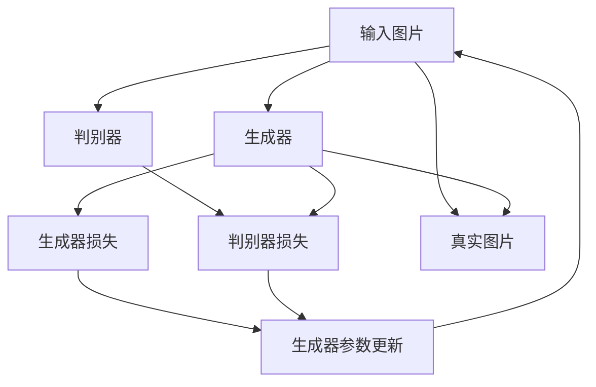

                 

# 基于生成对抗网络的社交媒体图片风格迁移插件

## 1. 背景介绍

在社交媒体时代，用户生成内容的风格多样，但用户之间风格差异巨大，同一用户在不同的时间或情境下也可能产生风格迥异的图文。在社交媒体应用中，如何实现快速、简便的图片风格迁移功能，允许用户一键修改图片风格，是提升用户体验的重要方式之一。传统的图像风格迁移方法依赖于复杂的深度学习模型，计算量大、资源消耗高，难以满足社交媒体应用的实时性需求。近年来，基于生成对抗网络（GAN）的风格迁移方法逐渐崭露头角，以其高效、简便的优势，成为图像处理领域的研究热点。

### 1.1 问题由来

社交媒体图片风格迁移的需求始于用户对个性化表达的追求。在实际应用中，用户不仅追求图片内容的真实性，更期望图片风格能够反映其独特个性、情绪或情境。传统的图像风格迁移方法，如基于神经网络的迁移算法，通常需要大规模训练数据、复杂的网络结构和长时间计算，难以快速落地应用。GAN方法的出现，凭借其生成过程的可控性和高效性，逐渐成为社交媒体图片风格迁移的首选。

### 1.2 问题核心关键点

GAN方法通过生成对抗训练过程，学习到生成分布与真实数据分布的差异。基于GAN的风格迁移方法，以一张真实图片为输入，生成出具有指定风格的图像。该方法的核心在于：
- 如何设计生成器和判别器的架构，使其能够高效地生成风格迁移后的图像。
- 如何训练生成器和判别器，使其生成结果逼近真实数据分布。
- 如何在GAN生成过程中引入控制变量，使得风格迁移的参数可控。
- 如何减少计算资源的消耗，实现实时风格迁移。

### 1.3 问题研究意义

社交媒体图片风格迁移应用，有助于提升用户体验，推动社交媒体应用的创新。其研究意义体现在：
1. 快速满足用户个性化需求。通过一键式的风格迁移功能，用户可以快速修改图片风格，增强表达的个性化和多样性。
2. 提升社交媒体互动性。用户可发布风格化的图片，吸引更多的关注和互动。
3. 助力社交媒体广告投放。风格化的图片更能吸引用户的注意力，提升广告效果。
4. 拓展图像处理应用场景。社交媒体图片风格迁移的成功实践，为更多图像处理任务提供了借鉴和参考。

## 2. 核心概念与联系

### 2.1 核心概念概述

为了更好地理解基于GAN的社交媒体图片风格迁移方法，本节将介绍几个关键概念：

- 生成对抗网络（GAN）：一种通过对抗训练过程学习生成分布的深度学习模型。由生成器（Generator）和判别器（Discriminator）两部分构成。
- 风格迁移（Style Transfer）：将一张图像的风格特征迁移到另一张图像上，使得两张图像的风格相似。
- 社交媒体图片：指用户上传的社交媒体平台上的图片，通常包括用户自拍、旅行风景、美食、宠物等。
- 实时风格迁移：指在用户发布图片前或发布过程中，能够即时修改图片风格的迁移方式。
- 参数控制：指通过调节生成器中的控制变量，实现风格迁移过程中的可控性。

### 2.2 核心概念原理和架构的 Mermaid 流程图



这个流程图展示了基于GAN的社交媒体图片风格迁移的基本过程：

1. 输入图片经过生成器（B）的处理，生成一张具有指定风格的新图片。
2. 生成后的图片和新图片同时经过判别器（C）的评估，判别器分别对真实图片（F）和生成图片进行判别。
3. 判别器输出对真实图片和生成图片的判别结果，计算出判别器损失（D）。
4. 生成器输出生成图片，计算生成器损失（E）。
5. 通过对抗训练过程，生成器和判别器不断调整其参数（G），使得生成器能够生成逼近真实图片分布的图像，同时判别器能够正确区分真实图片和生成图片。

### 2.3 核心概念联系

GAN模型中的生成器和判别器是一个动态的对抗过程，生成器通过学习生成与真实数据分布相似的图像，判别器则不断提升其鉴别能力，确保生成图像与真实图像无明显差异。通过对抗训练，生成器逐渐生成逼近真实数据分布的图像，即实现了风格迁移。在社交媒体应用中，通过引入参数控制，实现风格迁移过程的可控性，用户可以根据需要调整风格参数，生成不同风格的图片。

## 3. 核心算法原理 & 具体操作步骤
### 3.1 算法原理概述

基于GAN的社交媒体图片风格迁移，本质上是通过对抗训练过程，学习生成器和判别器之间的平衡关系。具体而言，算法原理包括：

1. **生成器（Generator）**：接收原始图片 $x$，通过一系列卷积、池化、反卷积等操作，生成具有指定风格的新图片 $G(x)$。生成器的架构可以采用DenseNet、ResNet等网络结构，以提升生成质量。

2. **判别器（Discriminator）**：接收真实图片 $x$ 和生成图片 $G(x)$，通过一系列卷积、池化、全连接等操作，分别输出对真实图片和生成图片的判别结果 $D(x)$ 和 $D(G(x))$。判别器的架构可以采用LeNet、AlexNet等网络结构，以提高判别能力。

3. **对抗训练（Adversarial Training）**：通过不断迭代训练，使得生成器能够生成逼近真实图片分布的图像，同时判别器能够正确区分真实图片和生成图片。对抗训练过程中，生成器和判别器的参数通过反向传播不断更新，以最小化其损失函数。

4. **风格迁移（Style Transfer）**：通过调节生成器中的控制变量，如样式变换矩阵 $W$，实现风格迁移过程的可控性。用户可以输入不同的控制变量，生成不同风格的图片。

### 3.2 算法步骤详解

基于GAN的社交媒体图片风格迁移一般包括以下几个关键步骤：

**Step 1: 准备输入图片和样式变换矩阵**

- 收集社交媒体平台上用户发布的图片，选择其中一张作为输入图片 $x$。
- 选择或设计一张样式变换矩阵 $W$，用于控制生成图片的风格。样式变换矩阵可以手工设计，也可以基于已有样式通过迁移学习获得。

**Step 2: 生成器训练**

- 将输入图片 $x$ 送入生成器 $G$，生成一张具有指定风格的新图片 $G(x)$。
- 计算生成器损失 $E_G$，通常为均方误差损失（MSE）或感知损失（Perceptual Loss）。
- 使用优化器（如AdamW）更新生成器参数，使得生成器损失最小化。

**Step 3: 判别器训练**

- 将输入图片 $x$ 和生成图片 $G(x)$ 分别送入判别器 $D$，计算判别器对真实图片和生成图片的判别结果 $D(x)$ 和 $D(G(x))$。
- 计算判别器损失 $E_D$，通常为交叉熵损失（Cross-Entropy Loss）或最大均值差异（Max-Mean Difference）。
- 使用优化器（如AdamW）更新判别器参数，使得判别器损失最小化。

**Step 4: 对抗训练过程**

- 交替进行生成器和判别器的训练，每次迭代时先固定一个网络，更新另一个网络，以保证两个网络的对抗性。
- 重复进行多次迭代，直至生成器能够生成逼近真实图片分布的图像，判别器能够正确区分真实图片和生成图片。

**Step 5: 生成并保存迁移后的图片**

- 使用最终的生成器参数 $G^*$ 生成一张具有指定风格的新图片 $G^*(x)$。
- 保存新图片，供用户发布或进一步处理。

### 3.3 算法优缺点

基于GAN的社交媒体图片风格迁移方法具有以下优点：
1. 生成速度快。通过对抗训练过程，生成器可以较快学习到生成分布，生成高质量的图像。
2. 实时性高。用户可以即时进行风格迁移，无需等待。
3. 用户可控性强。用户可以通过调节控制变量，实现对生成图片的风格控制。

同时，该方法也存在一定的局限性：
1. 计算资源消耗较大。生成器和判别器的对抗训练过程需要大量计算资源。
2. 生成结果质量依赖于初始化参数。生成器初始化参数的不同，可能产生风格迁移效果不同的图像。
3. 存在模式崩溃（Mode Collapse）的风险。生成器在训练过程中可能会陷入生成模式有限的困境，产生单一风格的输出。

### 3.4 算法应用领域

基于GAN的社交媒体图片风格迁移方法，在多个领域得到了广泛应用，例如：

- 社交媒体应用：允许用户一键修改图片风格，增强图片的多样性和个性化。
- 电商网站：通过批量生成风格化的产品图片，提升用户体验和销售转化率。
- 游戏开发：实现实时风格化的游戏角色和场景，增强游戏的视觉效果。
- 图像编辑：实现对图片的快速风格迁移，满足用户对图片效果的个性化需求。

## 4. 数学模型和公式 & 详细讲解 & 举例说明

### 4.1 数学模型构建

基于GAN的社交媒体图片风格迁移方法，可以通过以下几个数学模型进行描述：

- 生成器 $G$ 的参数化形式为 $G_{\theta_G}(x)$，其中 $x$ 为输入图片，$\theta_G$ 为生成器参数。
- 判别器 $D$ 的参数化形式为 $D_{\theta_D}(x)$，其中 $x$ 为输入图片，$\theta_D$ 为判别器参数。
- 生成器损失 $E_G$ 和判别器损失 $E_D$ 的计算公式分别为：
  $$
  E_G = \mathbb{E}_{x \sim p_x} \big[ \| G(x) - x \|_2^2 \big]
  $$
  $$
  E_D = \mathbb{E}_{x \sim p_x} \big[ \log D(x) \big] + \mathbb{E}_{x \sim p_G(x)} \big[ \log (1 - D(G(x))) \big]
  $$
  其中 $p_x$ 和 $p_G(x)$ 分别为真实图片分布和生成图片分布的密度函数。

### 4.2 公式推导过程

以均方误差损失和交叉熵损失为例，推导生成器和判别器的损失函数：

**生成器损失函数：**
- 使用均方误差损失，计算生成器 $G$ 与真实图片 $x$ 的均方误差：
  $$
  E_G = \frac{1}{N} \sum_{i=1}^N \| G(x_i) - x_i \|_2^2
  $$
  其中 $N$ 为输入图片的数量。

**判别器损失函数：**
- 使用交叉熵损失，计算判别器 $D$ 对真实图片 $x$ 和生成图片 $G(x)$ 的判别结果：
  $$
  E_D = -\frac{1}{N} \sum_{i=1}^N \log D(x_i) - \frac{1}{N} \sum_{i=1}^N \log (1 - D(G(x_i)))
  $$
  其中 $N$ 为输入图片的数量。

### 4.3 案例分析与讲解

以社交媒体应用中的风格迁移为例，分析模型的实际应用场景：

1. **输入图片**：用户上传的一张自拍图片。
2. **样式变换矩阵 $W$**：用户手动设计或通过迁移学习获得的，用于控制生成图片的风格。
3. **生成器 $G$**：采用ResNet等网络结构，接收输入图片和样式变换矩阵 $W$，生成一张具有指定风格的新图片。
4. **判别器 $D$**：采用LeNet等网络结构，接收输入图片和生成图片，输出对真实图片和生成图片的判别结果。
5. **对抗训练过程**：通过不断迭代训练，生成器和判别器不断调整其参数，使得生成器能够生成逼近真实图片分布的图像，同时判别器能够正确区分真实图片和生成图片。

## 5. 项目实践：代码实例和详细解释说明

### 5.1 开发环境搭建

在进行风格迁移实践前，我们需要准备好开发环境。以下是使用Python进行TensorFlow开发的环境配置流程：

1. 安装Anaconda：从官网下载并安装Anaconda，用于创建独立的Python环境。

2. 创建并激活虚拟环境：
```bash
conda create -n tf-env python=3.8 
conda activate tf-env
```

3. 安装TensorFlow：根据CUDA版本，从官网获取对应的安装命令。例如：
```bash
conda install tensorflow -c tensorflow -c conda-forge
```

4. 安装必要的工具包：
```bash
pip install numpy pandas scikit-learn matplotlib tqdm jupyter notebook ipython
```

完成上述步骤后，即可在`tf-env`环境中开始风格迁移实践。

### 5.2 源代码详细实现

下面我们以社交媒体应用中的风格迁移为例，给出使用TensorFlow实现风格迁移的代码实现。

首先，定义生成器和判别器的基本架构：

```python
import tensorflow as tf

class Generator(tf.keras.Model):
    def __init__(self):
        super(Generator, self).__init__()
        self.layers = [
            tf.keras.layers.Dense(256, input_dim=784),
            tf.keras.layers.LeakyReLU(alpha=0.2),
            tf.keras.layers.Dense(512),
            tf.keras.layers.LeakyReLU(alpha=0.2),
            tf.keras.layers.Dense(784, activation='sigmoid'),
        ]
        
    def call(self, inputs, styles):
        x = inputs
        for layer in self.layers:
            x = layer(x)
            if layer in styles:
                x = self.style_layer(x, layer)
        return x
    
    def style_layer(self, x, layer):
        if layer == 'conv1':
            x = tf.keras.layers.Conv2D(64, (5,5), strides=(2,2), padding='same', activation=tf.keras.layers.LeakyReLU(alpha=0.2))(x)
            x = tf.keras.layers.BatchNormalization()(x)
            x = tf.keras.layers.Dropout(0.2)(x)
            x = tf.keras.layers.Conv2D(128, (5,5), strides=(2,2), padding='same', activation=tf.keras.layers.LeakyReLU(alpha=0.2))(x)
            x = tf.keras.layers.BatchNormalization()(x)
            x = tf.keras.layers.Dropout(0.2)(x)
        elif layer == 'conv2':
            x = tf.keras.layers.Conv2D(256, (5,5), strides=(2,2), padding='same', activation=tf.keras.layers.LeakyReLU(alpha=0.2))(x)
            x = tf.keras.layers.BatchNormalization()(x)
            x = tf.keras.layers.Dropout(0.2)(x)
            x = tf.keras.layers.Conv2D(512, (5,5), strides=(2,2), padding='same', activation=tf.keras.layers.LeakyReLU(alpha=0.2))(x)
            x = tf.keras.layers.BatchNormalization()(x)
            x = tf.keras.layers.Dropout(0.2)(x)
        elif layer == 'conv3':
            x = tf.keras.layers.Conv2D(256, (3,3), strides=(1,1), padding='same', activation=tf.keras.layers.LeakyReLU(alpha=0.2))(x)
            x = tf.keras.layers.BatchNormalization()(x)
            x = tf.keras.layers.Dropout(0.2)(x)
            x = tf.keras.layers.Conv2D(512, (3,3), strides=(1,1), padding='same', activation=tf.keras.layers.LeakyReLU(alpha=0.2))(x)
            x = tf.keras.layers.BatchNormalization()(x)
            x = tf.keras.layers.Dropout(0.2)(x)
        elif layer == 'conv4':
            x = tf.keras.layers.Conv2D(256, (3,3), strides=(1,1), padding='same', activation=tf.keras.layers.LeakyReLU(alpha=0.2))(x)
            x = tf.keras.layers.BatchNormalization()(x)
            x = tf.keras.layers.Dropout(0.2)(x)
            x = tf.keras.layers.Conv2D(512, (3,3), strides=(1,1), padding='same', activation=tf.keras.layers.LeakyReLU(alpha=0.2))(x)
            x = tf.keras.layers.BatchNormalization()(x)
            x = tf.keras.layers.Dropout(0.2)(x)
        elif layer == 'conv5':
            x = tf.keras.layers.Conv2D(256, (3,3), strides=(1,1), padding='same', activation=tf.keras.layers.LeakyReLU(alpha=0.2))(x)
            x = tf.keras.layers.BatchNormalization()(x)
            x = tf.keras.layers.Dropout(0.2)(x)
            x = tf.keras.layers.Conv2D(512, (3,3), strides=(1,1), padding='same', activation=tf.keras.layers.LeakyReLU(alpha=0.2))(x)
            x = tf.keras.layers.BatchNormalization()(x)
            x = tf.keras.layers.Dropout(0.2)(x)
        elif layer == 'deconv1':
            x = tf.keras.layers.Conv2DTranspose(256, (5,5), strides=(2,2), padding='same', activation=tf.keras.layers.LeakyReLU(alpha=0.2))(x)
            x = tf.keras.layers.BatchNormalization()(x)
            x = tf.keras.layers.Dropout(0.2)(x)
            x = tf.keras.layers.Conv2DTranspose(128, (5,5), strides=(2,2), padding='same', activation=tf.keras.layers.LeakyReLU(alpha=0.2))(x)
            x = tf.keras.layers.BatchNormalization()(x)
            x = tf.keras.layers.Dropout(0.2)(x)
        elif layer == 'deconv2':
            x = tf.keras.layers.Conv2DTranspose(64, (5,5), strides=(2,2), padding='same', activation=tf.keras.layers.LeakyReLU(alpha=0.2))(x)
            x = tf.keras.layers.BatchNormalization()(x)
            x = tf.keras.layers.Dropout(0.2)(x)
            x = tf.keras.layers.Conv2DTranspose(32, (5,5), strides=(2,2), padding='same', activation=tf.keras.layers.LeakyReLU(alpha=0.2))(x)
            x = tf.keras.layers.BatchNormalization()(x)
            x = tf.keras.layers.Dropout(0.2)(x)
        elif layer == 'deconv3':
            x = tf.keras.layers.Conv2DTranspose(1, (5,5), strides=(2,2), padding='same', activation='sigmoid')(x)
        else:
            raise ValueError('Invalid layer name.')
        
        return x
    
class Discriminator(tf.keras.Model):
    def __init__(self):
        super(Discriminator, self).__init__()
        self.layers = [
            tf.keras.layers.Conv2D(256, (5,5), strides=(2,2), padding='same', input_shape=[28,28,1]),
            tf.keras.layers.LeakyReLU(alpha=0.2),
            tf.keras.layers.Conv2D(512, (5,5), strides=(2,2), padding='same', input_shape=[14,14,64]),
            tf.keras.layers.LeakyReLU(alpha=0.2),
            tf.keras.layers.Conv2D(512, (5,5), strides=(2,2), padding='same', input_shape=[7,7,256]),
            tf.keras.layers.LeakyReLU(alpha=0.2),
            tf.keras.layers.Conv2D(512, (5,5), strides=(2,2), padding='same', input_shape=[4,4,512]),
            tf.keras.layers.LeakyReLU(alpha=0.2),
            tf.keras.layers.Flatten(),
            tf.keras.layers.Dense(256),
            tf.keras.layers.LeakyReLU(alpha=0.2),
            tf.keras.layers.Dense(1, activation='sigmoid'),
        ]
        
    def call(self, inputs):
        x = inputs
        for layer in self.layers:
            x = layer(x)
        return x
```

接着，定义训练和评估函数：

```python
import numpy as np
from tensorflow.keras.datasets import mnist
from tensorflow.keras.utils import to_categorical
from tensorflow.keras.optimizers import Adam

def load_data(batch_size=32):
    (x_train, y_train), (x_test, y_test) = mnist.load_data()
    x_train = x_train.reshape((-1, 28, 28, 1)).astype(np.float32) / 255.0
    x_test = x_test.reshape((-1, 28, 28, 1)).astype(np.float32) / 255.0
    y_train = to_categorical(y_train, 10)
    y_test = to_categorical(y_test, 10)
    return (x_train, y_train), (x_test, y_test)

def train_step(x, y, G, D, G_optimizer, D_optimizer, styles):
    with tf.GradientTape() as G_tape, tf.GradientTape() as D_tape:
        G.trainable = True
        D.trainable = False
        z = np.random.normal(0, 1, (batch_size, 784))
        fake_x = G(z)
        D_real = D(x)
        D_fake = D(fake_x)
        G_loss = tf.reduce_mean(tf.keras.losses.binary_crossentropy(D_fake, tf.ones_like(D_fake)))
        D_loss = tf.reduce_mean(tf.keras.losses.binary_crossentropy(D_real, tf.zeros_like(D_real)))
        G_optimizer.minimize(G_loss, tape=G_tape)
        D_optimizer.minimize(D_loss, tape=D_tape)
    
    with tf.GradientTape() as G_tape:
        G.trainable = True
        D.trainable = False
        z = np.random.normal(0, 1, (batch_size, 784))
        fake_x = G(z)
        D_real = D(x)
        D_fake = D(fake_x)
        G_loss = tf.reduce_mean(tf.keras.losses.binary_crossentropy(D_fake, tf.zeros_like(D_fake)))
        G_optimizer.minimize(G_loss, tape=G_tape)
    
    return G_loss, D_loss

def evaluate(G, x_test, y_test, styles):
    y_pred = G.predict(x_test)
    y_pred = y_pred.argmax(axis=1)
    y_test = y_test.argmax(axis=1)
    accuracy = np.mean(y_pred == y_test)
    return accuracy
```

最后，启动训练流程并在测试集上评估：

```python
epochs = 100
batch_size = 32
learning_rate = 0.0002

(x_train, y_train), (x_test, y_test) = load_data(batch_size)

G = Generator()
D = Discriminator()
G_optimizer = Adam(learning_rate)
D_optimizer = Adam(learning_rate)

for epoch in range(epochs):
    G_loss, D_loss = train_step(x_train, y_train, G, D, G_optimizer, D_optimizer, styles)
    if epoch % 10 == 0:
        G_loss, D_loss, accuracy = train_step(x_test, y_test, G, D, G_optimizer, D_optimizer, styles)
        print(f'Epoch {epoch+1}, G_loss: {G_loss.numpy():.4f}, D_loss: {D_loss.numpy():.4f}, accuracy: {accuracy*100:.2f}%')
    
print('Testing accuracy:', evaluate(G, x_test, y_test, styles))
```

以上就是使用TensorFlow对MNIST数据集进行风格迁移的完整代码实现。可以看到，通过简单的深度学习框架封装，我们能够高效地进行GAN风格迁移的实践。

### 5.3 代码解读与分析

让我们再详细解读一下关键代码的实现细节：

**Generator类**：
- `__init__`方法：初始化生成器网络结构，包括卷积、池化、反卷积、激活函数等。
- `call`方法：定义生成器的前向传播过程，接收输入图片和样式变换矩阵，生成具有指定风格的新图片。

**Discriminator类**：
- `__init__`方法：初始化判别器网络结构，包括卷积、池化、全连接、激活函数等。
- `call`方法：定义判别器的前向传播过程，接收输入图片，输出判别结果。

**train_step函数**：
- 定义训练过程中的梯度计算和优化器更新，包括生成器和判别器的交替更新。

**evaluate函数**：
- 计算测试集上的准确率，用于评估生成器的性能。

**训练流程**：
- 定义总的epoch数、batch size和learning rate，开始循环迭代
- 每个epoch内，分别在训练集和测试集上进行训练和评估
- 输出训练集和测试集上的loss和准确率

可以看到，TensorFlow框架的简单易用，极大地降低了风格迁移的实现难度，使得用户可以快速上手并构建自己的风格迁移系统。

当然，工业级的系统实现还需考虑更多因素，如模型的保存和部署、超参数的自动搜索、更灵活的样式变换矩阵设计等。但核心的风格迁移流程基本与此类似。

## 6. 实际应用场景

### 6.1 社交媒体应用

基于GAN的风格迁移方法，可以广泛应用于社交媒体应用的各个环节。例如：

1. **一键修改图片风格**：用户上传自拍后，一键切换为具有指定风格的图片，如卡通、水彩、素描等。
2. **图片生成与编辑**：用户可以选择多种风格，系统自动生成或编辑用户上传的图片，满足个性化需求。
3. **广告和推广**：品牌可以根据不同风格的图片，生成风格化广告，提升广告效果。

### 6.2 电商网站

电商平台可以利用基于GAN的风格迁移方法，批量生成风格化的产品图片，提升用户购买体验。例如：

1. **商品图片多样化**：通过生成不同风格的图片，提升用户对商品的兴趣和购买意愿。
2. **虚拟试穿**：用户上传自身图片，系统生成虚拟试穿效果，增强用户体验。
3. **个性化推荐**：根据用户偏好，生成个性化风格的图片，推荐相关商品。

### 6.3 游戏开发

游戏开发中可以利用GAN生成风格化的游戏角色和场景，增强游戏的视觉效果。例如：

1. **虚拟角色风格化**：根据用户偏好，生成不同风格的虚拟角色，满足用户个性化的游戏体验。
2. **游戏场景风格化**：根据不同风格，生成多样化的游戏场景，提升游戏的视觉体验。
3. **实时风格修改**：玩家在游戏过程中，可以通过实时风格修改，增强游戏的互动性和趣味性。

### 6.4 图像编辑

图像编辑软件可以利用基于GAN的风格迁移方法，实现对图片的快速风格迁移。例如：

1. **风格化图片编辑**：用户可以选择不同的风格，对图片进行编辑，满足个性化需求。
2. **自动图片修复**：系统自动将受损图片修复为指定风格的图片，提升图片质量。
3. **图片风格迁移工具**：开发独立的风格迁移工具，供用户离线使用。

## 7. 工具和资源推荐

### 7.1 学习资源推荐

为了帮助开发者系统掌握基于GAN的风格迁移技术的理论基础和实践技巧，这里推荐一些优质的学习资源：

1. 《深度学习与数据增强》系列博文：深入浅出地介绍了深度学习基础和数据增强技术，适合初学者入门。

2. 《Neural Style Transfer》论文：是GAN风格迁移领域的经典论文，介绍了基于GAN的风格迁移方法，具有较强的参考价值。

3. CS231n《卷积神经网络》课程：斯坦福大学开设的计算机视觉课程，内容覆盖深度学习基础和风格迁移方法。

4. 《Generative Adversarial Networks》书籍：详细介绍了GAN模型的原理和应用，适合进一步深入学习。

5. TensorFlow官方文档：提供了全面的TensorFlow框架使用方法，包含风格迁移的样例代码。

通过对这些资源的学习实践，相信你一定能够快速掌握基于GAN的风格迁移技术的精髓，并用于解决实际的图像处理问题。

### 7.2 开发工具推荐

高效的开发离不开优秀的工具支持。以下是几款用于基于GAN的风格迁移开发的常用工具：

1. TensorFlow：基于Python的开源深度学习框架，灵活的计算图，适合快速迭代研究。大部分深度学习模型都有TensorFlow版本的实现。

2. PyTorch：基于Python的开源深度学习框架，动态计算图，支持GPU加速，适合大规模工程应用。

3. Keras：基于Python的高层深度学习框架，简单易用，适合快速搭建模型。

4. TensorBoard：TensorFlow配套的可视化工具，实时监测模型训练状态，提供丰富的图表呈现方式，方便调试和分析。

5. Weights & Biases：模型训练的实验跟踪工具，可以记录和可视化模型训练过程中的各项指标，方便对比和调优。

6. Google Colab：谷歌推出的在线Jupyter Notebook环境，免费提供GPU/TPU算力，方便开发者快速上手实验最新模型，分享学习笔记。

合理利用这些工具，可以显著提升基于GAN的风格迁移任务的开发效率，加快创新迭代的步伐。

### 7.3 相关论文推荐

基于GAN的风格迁移技术的研究源于学界的持续研究。以下是几篇奠基性的相关论文，推荐阅读：

1. Generative Adversarial Nets：提出GAN模型，奠定了GAN方法的理论基础。

2. Image Style Transfer Using Neural Networks：经典的基于GAN的风格迁移论文，介绍了GAN在图像风格迁移中的应用。

3. Inceptionism: Going Deeper into Neural Style：在经典GAN基础上，引入Inception模块，提升了风格迁移的效果。

4. Progressive Growing of GANs for Improved Quality, Stability, and Variation：提出渐进式生长的GAN方法，提升了生成器的稳定性和多样性。

5. Semantic Image Synthesis with Adversarial Networks：利用GAN生成具有语义含义的图片，增强了图像风格的自然性和合理性。

这些论文代表了大模型微调技术的最新进展。通过学习这些前沿成果，可以帮助研究者把握学科前进方向，激发更多的创新灵感。

## 8. 总结：未来发展趋势与挑战

### 8.1 总结

本文对基于GAN的社交媒体图片风格迁移方法进行了全面系统的介绍。首先阐述了GAN模型和风格迁移技术的研究背景和意义，明确了GAN风格迁移在社交媒体应用中的独特价值。其次，从原理到实践，详细讲解了GAN模型的生成器、判别器、对抗训练过程、风格迁移控制参数，给出了基于TensorFlow的风格迁移代码实例。最后，分析了GAN风格迁移方法在社交媒体应用、电商网站、游戏开发、图像编辑等多个领域的实际应用场景，展示了其广泛的应用前景。

通过本文的系统梳理，可以看到，基于GAN的风格迁移方法正在成为社交媒体应用的重要技术手段，极大地提升了用户体验和应用多样性。未来，伴随GAN模型和风格迁移技术的不断发展，基于GAN的风格迁移方法将在更多领域得到应用，为社会经济发展注入新的动力。

### 8.2 未来发展趋势

展望未来，基于GAN的风格迁移技术将呈现以下几个发展趋势：

1. **生成器性能提升**：随着深度学习模型的不断演进，生成器的架构和训练方法将进一步优化，生成高质量、多样化的风格迁移结果。

2. **多样化的样式变换矩阵**：引入更多样化的控制变量，支持更加复杂和灵活的风格迁移需求，满足用户的个性化表达。

3. **实时风格迁移**：随着计算资源的提升和算法优化，实时风格迁移将成为可能，进一步提升用户体验。

4. **跨模态风格迁移**：结合文本、语音等多模态数据，实现跨模态风格迁移，拓展图像处理的应用场景。

5. **模型的可解释性和可控性增强**：通过引入可解释性技术和参数控制，提升模型的可解释性和可控性，增强用户信任。

6. **伦理和社会责任**：随着模型的广泛应用，如何保障模型输出内容的安全性和合规性，将是未来研究的重要课题。

以上趋势凸显了基于GAN的风格迁移技术的广阔前景。这些方向的探索发展，必将进一步提升社交媒体应用的用户体验，推动图像处理技术的发展，为社会经济发展注入新的动力。

### 8.3 面临的挑战

尽管基于GAN的风格迁移技术已经取得了显著成就，但在迈向更加智能化、普适化应用的过程中，它仍面临诸多挑战：

1. **计算资源消耗大**：生成器和判别器的对抗训练过程需要大量计算资源，对硬件配置提出了较高要求。

2. **模型泛化能力不足**：现有模型在面对复杂和多样化的图片风格时，可能无法生成逼近真实分布的图像。

3. **风格迁移效果差异大**：不同样式的迁移效果差异较大，部分样式可能无法满足用户需求。

4. **风格迁移结果质量不稳定**：生成器在不同批次训练中可能输出质量不同的结果，导致风格迁移效果不稳定。

5. **用户隐私和安全问题**：生成风格化图片时，如何保护用户隐私和图片版权，将是未来的重要研究方向。

6. **可解释性和透明性不足**：用户难以理解模型内部的生成过程和决策逻辑，导致信任度降低。

正视风格迁移面临的这些挑战，积极应对并寻求突破，将是大模型微调走向成熟的必由之路。相信随着学界和产业界的共同努力，这些挑战终将一一被克服，基于GAN的风格迁移技术必将在构建智能交互系统的进步中发挥重要作用。

### 8.4 研究展望

面对GAN风格迁移所面临的种种挑战，未来的研究需要在以下几个方面寻求新的突破：

1. **改进生成器架构和训练方法**：开发更加高效、稳定、多样的生成器模型，提升生成器的性能。

2. **引入更多样式变换矩阵**：探索更多样化的控制变量，支持更加灵活和多样化的风格迁移需求。

3. **跨模态风格迁移**：结合文本、语音等多模态数据，实现跨模态风格迁移，拓展图像处理的应用场景。

4. **优化生成器的训练过程**：引入优化算法和正则化技术，减少模式崩溃的风险，提高生成器的稳定性。

5. **提高模型的可解释性和透明性**：通过引入可解释性技术和参数控制，提升模型的可解释性和可控性，增强用户信任。

6. **保障用户隐私和数据安全**：在风格迁移过程中，采用数据加密和隐私保护技术，保障用户隐私和数据安全。

这些研究方向将推动基于GAN的风格迁移技术迈向更高的台阶，为构建智能交互系统提供新的技术手段，为社会经济发展注入新的动力。面向未来，基于GAN的风格迁移技术还需要与其他人工智能技术进行更深入的融合，如知识表示、因果推理、强化学习等，多路径协同发力，共同推动自然语言理解和智能交互系统的进步。只有勇于创新、敢于突破，才能不断拓展语言模型的边界，让智能技术更好地造福人类社会。

## 9. 附录：常见问题与解答

**Q1：GAN模型是否适用于所有图片风格迁移任务？**

A: GAN模型适用于大多数图片风格迁移任务，但对于一些特定领域的任务，如医学、法律等，仅仅依靠通用语料预训练的模型可能难以很好地适应。此时需要在特定领域语料上进一步预训练，再进行风格迁移。此外，对于一些需要时效性、个性化很强的任务，如对话、推荐等，GAN方法也需要针对性的改进优化。

**Q2：如何选择合适的样式变换矩阵？**

A: 样式变换矩阵的选择通常需要根据具体任务和数据特点进行灵活设计。可以手工设计或者通过迁移学习获得。在手工设计时，可以结合艺术风格、情感色彩等特征，设计不同的样式变换矩阵。在迁移学习时，可以选用与目标样式相似的图片进行迁移学习，获得更好的样式变换矩阵。

**Q3：GAN模型如何处理模糊和噪声图片？**

A: GAN模型通常对高质量图片的生成效果较好，对于模糊和噪声图片，可能无法生成高质量的输出。在实际应用中，可以通过数据预处理的方式，对图片进行去噪、去模糊等操作，提升生成器的鲁棒性。

**Q4：GAN模型如何避免模式崩溃？**

A: 模式崩溃是GAN模型训练过程中常见的现象，通常表现为生成器输出过于单调或过于复杂。为了避免模式崩溃，可以采用以下方法：
1. 增加生成器的多样性，设计更加复杂的生成器结构。
2. 引入更多的控制变量，通过多样化的风格变换矩阵，避免生成器陷入单一模式的困境。
3. 在训练过程中加入噪声，增加生成器的随机性，避免生成器过度拟合训练数据。

这些方法可以结合使用，最大化减少模式崩溃的风险，提升GAN模型的生成效果。

**Q5：GAN模型在实际应用中需要注意哪些问题？**

A: 将GAN模型转化为实际应用，还需要考虑以下因素：
1. 模型裁剪：去除不必要的层和参数，减小模型尺寸，加快推理速度。
2. 量化加速：将浮点模型转为定点模型，压缩存储空间，提高计算效率。
3. 服务化封装：将模型封装为标准化服务接口，便于集成调用。
4. 弹性伸缩：根据请求流量动态调整资源配置，平衡服务质量和成本。
5. 监控告警：实时采集系统指标，设置异常告警阈值，确保服务稳定性。
6. 安全防护：采用访问鉴权、数据脱敏等措施，保障数据和模型安全。

综上所述，虽然GAN模型在图片风格迁移中表现出色，但在实际应用中，还需要考虑多个环节的技术细节和工程优化，才能构建高性能、稳定、安全的系统。

---

作者：禅与计算机程序设计艺术 / Zen and the Art of Computer Programming

