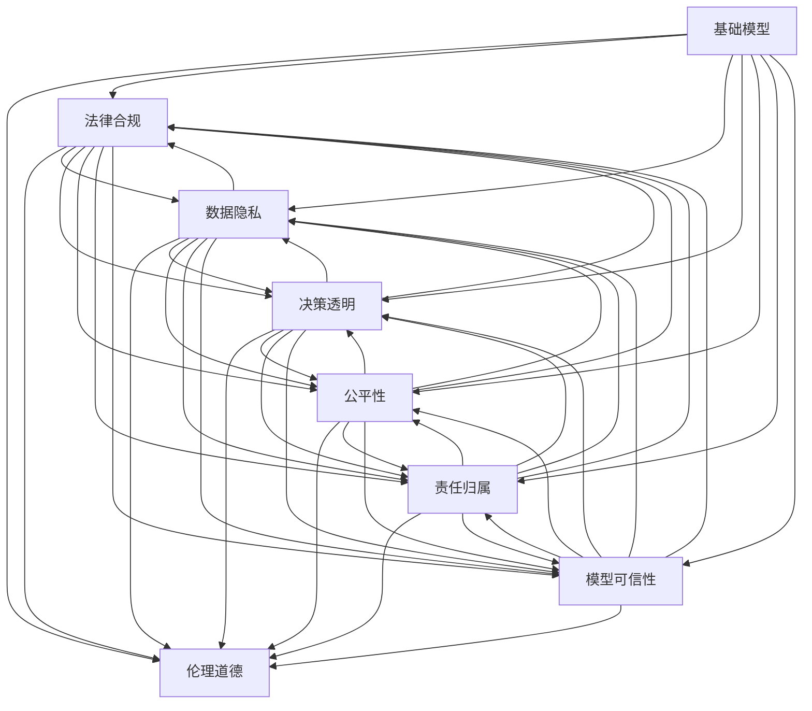

                 

# 基础模型的伦理与法律影响

> 关键词：人工智能,伦理道德,法律合规,数据隐私,决策透明,公平性,责任归属,模型可信性

## 1. 背景介绍

随着人工智能技术的迅猛发展，基础模型在各行各业的应用范围越来越广，对社会的影响也越来越深远。然而，技术的进步并不意味着道德和法律问题的同步成熟。人工智能的决策过程是否公正透明、数据使用是否合规合法、模型输出的责任归属问题、以及如何确保模型的可信性，都是亟待解决的重要议题。本文将系统地探讨基础模型在伦理和法律层面的影响，以期为人工智能技术的安全、可控和可持续应用提供借鉴。

## 2. 核心概念与联系

### 2.1 核心概念概述

为更好地理解基础模型在伦理与法律层面的影响，本节将介绍几个关键概念：

- **基础模型(Foundation Models)**：指通过大规模无监督或弱监督学习获得的通用智能模型，如GPT、BERT等。这类模型通常在大规模数据上进行训练，能够泛化到不同的任务和数据集。
- **伦理道德(Ethics)**：指处理人工智能系统时所遵循的道德准则，旨在确保技术应用不会伤害人类或社会，同时尊重个体隐私与自由。
- **法律合规(Legal Compliance)**：指在设计和应用人工智能系统时，确保遵守现行法律法规，避免违法风险。
- **数据隐私(Privacy)**：指保护个人数据不被非法收集、存储、处理和泄露，保障个人权益和信息安全。
- **决策透明(Transparency)**：指人工智能系统决策过程的可解释性和可验证性，确保用户和监管机构能够理解和信任模型的输出。
- **公平性(Fairness)**：指模型在处理不同人群或群体的数据时，不因种族、性别、年龄等特征而有偏见，保证公正对待。
- **责任归属(Responsibility)**：指在人工智能系统产生错误或有害结果时，明确责任方和责任归属，确保问责机制的有效性。
- **模型可信性(Credibility)**：指人工智能系统输出的可靠性与有效性，确保在关键应用场景下不发生严重的误判或误解。

这些概念之间的逻辑关系可以通过以下Mermaid流程图来展示：



这个流程图展示了基础模型在伦理和法律层面影响的关键领域，以及这些领域之间的相互关系。

## 3. 核心算法原理 & 具体操作步骤
### 3.1 算法原理概述

基础模型在伦理和法律层面的影响主要体现在其决策过程、数据使用和结果输出等方面。算法原理的透明性、数据的隐私保护、决策的公平性和可解释性、以及模型的责任归属等，都是设计基础模型时需要考虑的重要因素。

### 3.2 算法步骤详解

基础模型的伦理和法律影响评估可以分为以下几个关键步骤：

**Step 1: 数据预处理**
- 收集数据：确保数据来源合法、公开且具有代表性。
- 数据清洗：去除噪声数据、敏感信息，确保数据质量。
- 数据匿名化：对个人身份信息进行脱敏处理，保护隐私。

**Step 2: 模型训练与评估**
- 选择合适的模型：确保模型设计合理、算法透明、可解释性强。
- 公平性评估：对模型进行公平性测试，确保对不同群体无偏见。
- 法律合规性检查：确保模型训练和应用过程中遵守法律法规。

**Step 3: 决策过程与输出**
- 决策透明：确保模型的决策过程可解释，用户和监管机构能够理解和验证。
- 结果验证：对模型输出进行严格验证，确保准确性和可靠性。
- 责任归属：明确模型出错时的责任方，确保问责机制有效。

### 3.3 算法优缺点

基础模型的伦理和法律影响评估具有以下优点：
- 提高系统可信度：通过系统性评估，提高模型的透明度和可靠性，增强用户信任。
- 保障用户权益：确保数据隐私保护，防止滥用和泄露。
- 促进法律合规：保证模型应用符合法律法规，避免法律风险。
- 强化公平性：评估模型的公平性，确保对所有群体公正对待。

同时，该方法也存在一些局限性：
- 复杂度高：评估过程涉及多维度考量，复杂度较高。
- 依赖数据质量：数据质量直接影响评估结果，需要高质量的数据源。
- 法规动态变化：法律环境变化快，评估模型需要及时更新。

### 3.4 算法应用领域

基础模型的伦理和法律影响评估在多个领域都有广泛应用，例如：

- **医疗诊断**：确保模型输出符合伦理要求，不产生误诊或歧视性结果。
- **金融风控**：评估模型在信贷、保险等场景中的公平性和可信性。
- **司法判决**：确保模型用于辅助审判时，决策过程透明、结果可靠。
- **教育评估**：评估推荐系统对不同学生群体的公平性和透明度。
- **招聘系统**：评估模型在招聘过程中的偏见问题，保障公平就业机会。
- **公共服务**：确保公共服务系统（如智能客服、交通管理等）的伦理合规性和用户信任。

这些领域的基础模型应用，都需要对模型的伦理和法律影响进行全面评估，确保其在实际应用中的安全性和可靠性。

## 4. 数学模型和公式 & 详细讲解 & 举例说明

### 4.1 数学模型构建

基础模型的伦理和法律影响评估通常基于统计学、法律学和伦理学等多个学科的理论模型。以公平性评估为例，可以构建如下数学模型：

设有一个基础模型 $M$，处理 $N$ 个样本 $(x_i, y_i)$，其中 $x_i$ 为输入特征，$y_i$ 为真实标签，模型输出为 $\hat{y}_i = M(x_i)$。设公平性指标为 $F$，则公平性评估公式为：

$$
F(M) = \frac{1}{N} \sum_{i=1}^N f(\hat{y}_i, y_i)
$$

其中 $f(\hat{y}_i, y_i)$ 表示对第 $i$ 个样本的公平性判断，通常通过对比模型输出与真实标签的差异来衡量。

### 4.2 公式推导过程

公平性评估的推导过程如下：

- **敏感度分析**：对模型输出进行敏感度分析，识别出模型对不同特征的敏感性。
- **公平性指标计算**：计算每个样本的公平性指标，求取平均值。
- **偏差纠正**：根据公平性评估结果，调整模型参数，减小偏差。

以性别平等为例，假设模型输出性别分类结果 $y_i \in \{male, female\}$，模型输出概率为 $\hat{y}_i = M(x_i)$，则性别公平性指标计算公式为：

$$
F_{gender} = \frac{1}{N} \sum_{i=1}^N \left[ \frac{I(\hat{y}_i = male \wedge y_i = male) - I(\hat{y}_i = male \wedge y_i = female)}{I(y_i = male) + I(y_i = female)} \right]^2
$$

其中 $I$ 表示事件是否发生的指示函数。

### 4.3 案例分析与讲解

以医疗诊断为例，讨论基础模型在伦理和法律层面的影响。

假设有一个用于辅助诊断的医学图像分类模型，其训练数据集包含 $10000$ 个医学图像，其中 $8000$ 个是正常的，$2000$ 个是异常的。模型输出为每个图像属于异常的概率。若模型在训练过程中仅使用 $8000$ 个正常图像，而忽略 $2000$ 个异常图像，则模型对异常的检测能力可能会下降，导致误诊率上升。

此时，需要对模型进行伦理和法律影响的评估。首先，确保数据来源合法，符合伦理要求。其次，评估模型对不同病变的检测公平性，确保对所有类型病变无偏见。最后，在司法环境中应用模型时，确保其决策透明和责任归属明确，避免因模型误判导致的法律风险。

## 5. 项目实践：代码实例和详细解释说明
### 5.1 开发环境搭建

在进行伦理和法律影响评估前，我们需要准备好开发环境。以下是使用Python进行伦理评估的开发环境配置流程：

1. 安装Anaconda：从官网下载并安装Anaconda，用于创建独立的Python环境。

2. 创建并激活虚拟环境：
```bash
conda create -n ethics-env python=3.8 
conda activate ethics-env
```

3. 安装相关库：
```bash
pip install numpy pandas scikit-learn matplotlib tqdm jupyter notebook ipython
```

4. 安装特定库：
```bash
pip install fairlearn
```

5. 安装各类工具包：
```bash
pip install numpy pandas scikit-learn matplotlib tqdm jupyter notebook ipython
```

完成上述步骤后，即可在`ethics-env`环境中开始开发。

### 5.2 源代码详细实现

我们以公平性评估为例，给出使用Fairlearn库进行公平性评估的Python代码实现。

首先，定义模型和数据集：

```python
from fairlearn import FairnessEstimator
from sklearn.model_selection import train_test_split
from sklearn.linear_model import LogisticRegression

# 构建数据集
X = np.random.randn(10000, 10)
y = np.random.randint(0, 2, 10000)

# 划分数据集
X_train, X_test, y_train, y_test = train_test_split(X, y, test_size=0.2, random_state=42)
```

然后，训练模型并进行公平性评估：

```python
# 训练模型
model = LogisticRegression()
model.fit(X_train, y_train)

# 创建公平性评估对象
fairness_estimator = FairnessEstimator(model)

# 计算公平性指标
metrics = fairness_estimator.fit(X_train, y_train).score(X_test, y_test)
```

最后，输出评估结果：

```python
print(f"公平性指标：{metrics}")
```

以上就是使用Fairlearn库进行公平性评估的完整代码实现。可以看到，通过简单的几行代码，我们就能够对模型进行公平性评估，并得到公平性指标的数值。

### 5.3 代码解读与分析

让我们再详细解读一下关键代码的实现细节：

**FairnessEstimator类**：
- `FairnessEstimator`类提供了公平性评估的工具，可以通过实例化该类，设置不同的评估参数，对模型进行公平性测试。

**模型训练**：
- 使用`LogisticRegression`模型作为公平性评估的基础模型，训练数据集为 `X_train` 和 `y_train`。

**公平性评估**：
- 创建`FairnessEstimator`实例，将训练好的模型作为输入。
- 使用`fit`方法拟合模型，并调用`score`方法计算公平性指标。

**输出结果**：
- 通过`print`函数输出公平性指标，方便直观查看评估结果。

需要注意的是，公平性评估仅是基础模型伦理和法律影响评估的一个方面。在实际应用中，还需要考虑数据隐私保护、决策透明性、法律合规性等其他维度。只有全面评估，才能确保模型的伦理合法性和应用安全性。

## 6. 实际应用场景
### 6.1 医疗诊断

在医疗诊断中，基础模型的伦理和法律影响评估尤为重要。医疗诊断模型直接关系到患者的健康和生命安全，任何偏差或误判都可能带来严重后果。

首先，确保数据来源合法、公开，符合伦理要求。其次，评估模型对不同病变的检测公平性，确保对所有类型病变无偏见。最后，在司法环境中应用模型时，确保其决策透明和责任归属明确，避免因模型误判导致的法律风险。

### 6.2 金融风控

金融风控模型在贷款审批、信用评分等方面有广泛应用。这类模型直接影响用户的经济利益，公平性和可信性至关重要。

在金融风控模型中，需要评估模型对不同用户群体的公平性，确保对所有人群无歧视。同时，确保模型在司法环境中应用的透明性和责任归属，防止因模型误判导致的法律纠纷。

### 6.3 司法判决

司法判决模型在量刑、判决等方面有广泛应用。这类模型直接影响社会公正和法律的权威性，需要极高的公平性和可信性。

在司法判决模型中，需要评估模型对不同案件的判决公平性，确保对所有案件无偏见。同时，确保模型在司法环境中应用的透明性和责任归属，防止因模型误判导致的司法不公。

### 6.4 未来应用展望

随着基础模型的不断发展，其在伦理和法律层面的应用将更加广泛和深入。未来，基础模型将可能被应用于更多需要高公平性和透明性的领域，如教育评估、招聘系统等。

未来，基础模型的伦理和法律影响评估也将更加自动化和智能化。通过引入更多先进的算法和技术，实现对模型的全面、自动化评估，确保其在实际应用中的安全性。

## 7. 工具和资源推荐
### 7.1 学习资源推荐

为了帮助开发者系统掌握基础模型伦理和法律影响评估的理论基础和实践技巧，这里推荐一些优质的学习资源：

1. 《人工智能伦理与社会责任》系列书籍：系统介绍人工智能伦理理论，探讨人工智能技术在社会中的应用及其伦理挑战。

2. 《法律与人工智能》课程：由法律专家和AI学者共同开设的在线课程，探讨人工智能在法律中的应用及其法律挑战。

3. 《数据隐私保护》书籍：介绍数据隐私的基本概念、保护策略和技术手段，保障用户数据安全。

4. 《模型公平性评估》论文：介绍多种模型公平性评估方法，评估模型的公平性和偏见问题。

5. 《透明可解释的AI》书籍：探讨如何构建透明可解释的人工智能系统，增强用户信任和模型可信性。

通过这些资源的学习实践，相信你一定能够系统掌握基础模型伦理和法律影响评估的理论基础和实践技巧，为人工智能技术的安全、可控和可持续应用提供保障。

### 7.2 开发工具推荐

高效的开发离不开优秀的工具支持。以下是几款用于基础模型伦理和法律影响评估开发的常用工具：

1. Jupyter Notebook：开源的交互式笔记本环境，支持Python等多种编程语言，方便开发和分享学习笔记。

2. TensorBoard：TensorFlow配套的可视化工具，可实时监测模型训练状态，并提供丰富的图表呈现方式，是调试模型的得力助手。

3. Weights & Biases：模型训练的实验跟踪工具，可以记录和可视化模型训练过程中的各项指标，方便对比和调优。

4. Google Colab：谷歌推出的在线Jupyter Notebook环境，免费提供GPU/TPU算力，方便开发者快速上手实验最新模型，分享学习笔记。

合理利用这些工具，可以显著提升基础模型伦理和法律影响评估任务的开发效率，加快创新迭代的步伐。

### 7.3 相关论文推荐

基础模型伦理和法律影响评估的研究源于学界的持续研究。以下是几篇奠基性的相关论文，推荐阅读：

1. Algorithmic Fairness through Prejudice Elimination：提出通过偏见消除算法，提高模型的公平性，减少偏见影响。

2. A Theoretical Framework for Fairness Constraint in Multi-Class Classification：提出公平性约束框架，为模型公平性评估提供理论依据。

3. Fairness in Machine Learning：综述机器学习中的公平性问题，探讨公平性评估方法。

4. Explainable AI：探讨可解释AI的重要性及其技术手段，增强模型的透明度和可信性。

5. Understanding Fairness in Machine Learning and Legal Contexts：探讨机器学习中公平性问题在法律环境中的理解与应用。

这些论文代表了大模型伦理和法律影响评估的发展脉络。通过学习这些前沿成果，可以帮助研究者把握学科前进方向，激发更多的创新灵感。

## 8. 总结：未来发展趋势与挑战
### 8.1 研究成果总结

本文对基础模型在伦理和法律层面的影响进行了系统探讨。通过分析数据预处理、模型训练与评估、决策过程与输出等关键环节，明确了基础模型伦理和法律影响评估的流程和要点。同时，通过实际应用场景的讨论，展示了基础模型在医疗、金融、司法等领域的应用前景和挑战。

### 8.2 未来发展趋势

展望未来，基础模型伦理和法律影响评估将呈现以下几个发展趋势：

1. 自动化评估：引入自动化评估技术，降低评估成本，提升评估效率。
2. 多维度综合：引入更多维度的评估指标，如数据隐私、决策透明性等，全面评估基础模型。
3. 跨领域应用：基础模型在更多领域中的应用将推动伦理和法律影响评估的拓展。
4. 技术融合：与隐私保护、数据治理等技术融合，构建更加完备的模型评估体系。
5. 法规更新：根据法律法规的变化，及时更新评估模型，确保合规性。

以上趋势凸显了基础模型伦理和法律影响评估的广阔前景。这些方向的探索发展，必将进一步提升人工智能技术的安全性和可靠性，为构建人机协同的智能社会铺平道路。

### 8.3 面临的挑战

尽管基础模型伦理和法律影响评估已经取得了不少进展，但在实际应用中仍面临诸多挑战：

1. 数据隐私保护：如何确保数据在采集、存储、处理和传输过程中的隐私安全。
2. 模型公平性：如何在不同人群和群体中保证模型的无偏见性。
3. 法律合规性：如何在快速变化的法律环境中保持模型的合规性。
4. 模型可信性：如何确保模型输出的可靠性和有效性。
5. 用户信任：如何在用户中建立和维护对模型的信任。

这些挑战需要从数据、算法、法规等多个维度协同解决，才能确保基础模型的安全性和可靠性。

### 8.4 研究展望

面对基础模型伦理和法律影响评估所面临的种种挑战，未来的研究需要在以下几个方面寻求新的突破：

1. 数据隐私保护技术：开发更先进的数据隐私保护技术，如差分隐私、联邦学习等，确保数据的安全性。
2. 公平性算法：开发新的公平性算法，提升模型的无偏见性，确保对不同群体的公平对待。
3. 法律合规性：构建机器学习法律合规框架，确保模型在法律环境中的应用合规性。
4. 模型可信性：引入更多的可信性评估技术，增强模型的可靠性和鲁棒性。
5. 用户信任机制：构建用户信任机制，确保模型在用户中的信任度和接受度。

这些研究方向的探索，必将引领基础模型伦理和法律影响评估技术迈向更高的台阶，为人工智能技术的安全、可控和可持续应用提供保障。只有勇于创新、敢于突破，才能不断拓展人工智能技术的边界，让技术更好地造福人类社会。

## 9. 附录：常见问题与解答

**Q1：基础模型的伦理和法律影响评估是否适用于所有应用场景？**

A: 基础模型的伦理和法律影响评估在大多数应用场景中都具有重要意义。尤其是涉及用户隐私、安全和社会公平等敏感问题时，更需要进行全面的评估。然而，对于一些高度特定的应用场景，如加密通信、安全协议等，其核心问题不在于模型的公平性或可信性，而是算法本身的安全性，评估方式和重点可能会有所不同。

**Q2：如何确保基础模型的数据隐私保护？**

A: 确保基础模型的数据隐私保护需要从数据收集、存储、传输和使用等多个环节进行综合防护。具体措施包括：
1. 数据脱敏：对敏感信息进行脱敏处理，确保无法恢复原始数据。
2. 差分隐私：通过添加噪声，确保单个样本的信息无法被泄露。
3. 联邦学习：在分布式环境中进行模型训练，数据不集中存储。
4. 数据访问控制：严格控制数据访问权限，确保数据不被非法使用。

**Q3：如何衡量基础模型的公平性？**

A: 衡量基础模型的公平性通常需要考虑以下几个方面：
1. 统计公平：确保模型对不同群体的输出结果相似。
2. 机会公平：确保模型对所有群体的输入机会相同。
3. 过程公平：确保模型对所有输入的处理过程一致。
具体评估方法包括：
1. 统计量：如均方误差、准确率、召回率等。
2. 公平性指标：如Demographic Parity Index（DPI）、Equal Opportunity Index（EOI）等。
3. 敏感性分析：识别模型对不同特征的敏感性。

**Q4：基础模型在司法环境中应用时需要注意哪些问题？**

A: 基础模型在司法环境中应用时，需要注意以下几个问题：
1. 模型透明度：确保模型决策过程透明，便于司法审查。
2. 公平性验证：确保模型对所有案件无偏见。
3. 法律合规性：确保模型应用符合法律法规。
4. 责任归属：明确模型出错时的责任方，确保问责机制有效。

**Q5：基础模型在金融风控应用中需要注意哪些问题？**

A: 基础模型在金融风控应用中需要注意以下几个问题：
1. 数据隐私：确保用户数据隐私保护，防止数据泄露。
2. 公平性：确保模型对不同用户群体的公平对待。
3. 可信性：确保模型输出的可靠性和准确性。
4. 法律合规性：确保模型应用符合法律法规。

**Q6：基础模型在医疗诊断应用中需要注意哪些问题？**

A: 基础模型在医疗诊断应用中需要注意以下几个问题：
1. 数据隐私：确保患者数据隐私保护，防止数据泄露。
2. 公平性：确保模型对不同病变的检测公平性。
3. 可信性：确保模型输出的可靠性和准确性。
4. 法律合规性：确保模型应用符合法律法规。

总之，基础模型的伦理和法律影响评估是一个系统性工程，需要在数据、算法、法规等多个维度进行全面考虑。只有通过多方面的协同努力，才能确保基础模型在实际应用中的安全性、公正性和可信性。

