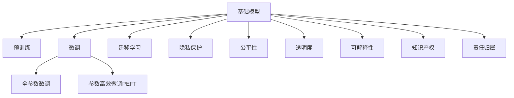

                 

# 基础模型的法律与伦理约束

随着人工智能技术的迅猛发展，基础模型（Foundation Models）已成为众多应用领域的关键技术。然而，这些基础模型不仅仅是技术问题，也涉及深刻的法律和伦理挑战。本文将全面探讨基础模型在法律与伦理上的约束，以期为相关应用提供更为全面和准确的指导。

## 1. 背景介绍

### 1.1 问题由来

近年来，基础模型在自然语言处理、计算机视觉、语音识别等众多领域取得了突破性进展，推动了人工智能技术的快速发展。基础模型通过在大规模无标注数据上进行预训练，构建了强大的知识图谱和推理能力，能够高效地完成下游任务。

然而，基础模型的大规模应用也带来了诸多法律和伦理问题，特别是当这些模型被用于敏感领域，如金融、医疗、司法等时，这些问题显得尤为突出。这些问题不仅涉及模型本身的合规性，也关乎模型的使用方式、数据隐私保护等。

### 1.2 问题核心关键点

基础模型在法律与伦理上的约束主要包括：
1. 数据隐私保护。基础模型需要大量的数据进行预训练，而数据隐私问题至关重要。
2. 公平性和偏见。基础模型可能在训练过程中学习到数据中的偏见，进而影响其公平性和可靠性。
3. 透明度和可解释性。基础模型的决策过程往往缺乏透明性和可解释性，可能导致决策争议。
4. 知识产权和版权问题。基础模型的训练和应用可能涉及数据、算法等多方面的知识产权和版权问题。
5. 法律合规与责任归属。基础模型在实际应用中，可能面临法律合规和责任归属等复杂问题。

这些核心关键点将贯穿全文，帮助读者全面理解基础模型在法律与伦理上的约束。

## 2. 核心概念与联系

### 2.1 核心概念概述

为更好地理解基础模型在法律与伦理上的约束，本节将介绍几个密切相关的核心概念：

- 基础模型（Foundation Model）：以自回归(如GPT)或自编码(如BERT)模型为代表的大规模预训练语言模型，通过在大规模无标签文本语料上进行预训练，学习通用的语言表示，具备强大的语言理解和生成能力。

- 预训练(Pre-training)：指在大规模无标签文本语料上，通过自监督学习任务训练通用语言模型的过程。常见的预训练任务包括言语建模、遮挡语言模型等。

- 微调(Fine-tuning)：指在预训练模型的基础上，使用下游任务的少量标注数据，通过有监督地训练来优化模型在特定任务上的性能。

- 迁移学习(Transfer Learning)：指将一个领域学习到的知识，迁移应用到另一个不同但相关的领域的学习范式。基础模型的预训练-微调过程即是一种典型的迁移学习方式。

- 隐私保护(Privacy Protection)：保护数据主体的隐私权，确保数据在使用过程中不被泄露。

- 公平性(Fairness)：确保模型输出不偏袒任何群体，对所有群体都保持一致的公正性。

- 透明度(Transparency)：确保模型的决策过程可被理解和解释。

- 可解释性(Explainability)：解释模型输出的依据和原因，帮助用户理解模型的决策。

- 知识产权(Intellectual Property)：保护原创者对其创作作品的独占权利。

- 责任归属(Responsibility)：确定在模型应用中出现问题时的责任方。

这些核心概念之间的逻辑关系可以通过以下Mermaid流程图来展示：



这个流程图展示基础模型的核心概念及其之间的关系：

1. 基础模型通过预训练获得基础能力。
2. 微调是对预训练模型进行任务特定的优化，可以分为全参数微调和参数高效微调（PEFT）。
3. 迁移学习是连接预训练模型与下游任务的桥梁，可以通过微调或迁移学习来实现。
4. 隐私保护、公平性、透明度、可解释性、知识产权和责任归属等概念，共同构成了基础模型的法律与伦理约束，确保其应用的安全性和合法性。

这些核心概念共同构成了基础模型的法律与伦理约束框架，使其能够在各种场景下充分发挥其能力。通过理解这些核心概念，我们可以更好地把握基础模型的法律与伦理要求。

## 3. 核心算法原理 & 具体操作步骤

### 3.1 算法原理概述

基础模型在法律与伦理上的约束主要涉及数据隐私保护、公平性、透明度和可解释性等方面。其核心思想是：

1. **数据隐私保护**：在数据收集和处理过程中，确保数据主体知情同意，并采取必要的隐私保护措施，防止数据泄露和滥用。
2. **公平性**：在设计训练数据集和微调目标时，避免数据偏见，确保模型在所有群体上的公平性。
3. **透明度和可解释性**：通过模型设计、文档编写、审计工具等方式，提高模型的透明度，帮助用户理解和信任模型。
4. **知识产权**：尊重和保护原始数据和算法的知识产权，确保基础模型的训练和应用合法合规。
5. **责任归属**：在基础模型应用于实际场景时，明确责任归属，确保模型在出现问题时能够追溯和处理。

### 3.2 算法步骤详解

基于基础模型在法律与伦理上的约束，以下是一个典型的操作流程：

**Step 1: 数据合规处理**

1. 数据收集：确保数据收集过程符合相关法律法规，如GDPR、CCPA等，并获取数据主体的知情同意。
2. 数据清洗：对数据进行去重、去噪、规范化处理，确保数据质量。
3. 数据加密：对敏感数据进行加密处理，防止数据泄露。

**Step 2: 模型训练与微调**

1. 选择合适的预训练模型，并进行参数冻结，保留预训练权重。
2. 在训练数据上微调模型，注意选择合适的学习率、正则化参数等。
3. 使用隐私保护技术，如差分隐私、联邦学习等，确保模型训练过程中数据隐私不被泄露。

**Step 3: 模型部署与监控**

1. 将微调后的模型部署到实际应用场景中，确保模型在部署过程中不违反法律法规。
2. 设置监控机制，实时监测模型性能，确保模型在实际应用中公平、透明。
3. 定期进行模型审计，检查模型是否存在偏见和歧视，确保模型公平性。

**Step 4: 模型解释与反馈**

1. 提供模型解释功能，帮助用户理解模型决策依据。
2. 设置反馈机制，收集用户反馈，持续改进模型。
3. 建立用户信任机制，确保用户对模型输出的信任。

### 3.3 算法优缺点

基础模型在法律与伦理上的约束方法具有以下优点：
1. 确保数据隐私。通过数据合规处理和隐私保护技术，保护数据主体的隐私权。
2. 提高模型公平性。通过公平性约束，确保模型在所有群体上的公平性。
3. 增强模型透明度。通过模型解释和审计机制，提高模型的透明度。
4. 保障知识产权。通过尊重和保护原始数据和算法的知识产权，确保基础模型的合法合规。
5. 明确责任归属。通过责任归属机制，确保模型在出现问题时能够追溯和处理。

同时，这些方法也存在一定的局限性：
1. 数据隐私保护可能影响数据质量。在数据加密和差分隐私等隐私保护措施下，数据可能失去部分信息，影响模型性能。
2. 模型公平性可能受限于训练数据。即使采用公平性约束，模型在实际应用中仍可能存在偏见。
3. 模型透明度和可解释性可能影响用户体验。过于复杂的解释功能可能降低用户体验。
4. 知识产权保护可能存在复杂性。特别是在涉及多个原始数据和算法的情况下，知识产权问题较为复杂。
5. 责任归属问题复杂。在多方参与的模型应用场景中，责任归属问题可能难以明确。

尽管存在这些局限性，但就目前而言，基础模型在法律与伦理上的约束方法仍是确保其合法合规、公平透明的关键手段。未来相关研究需要进一步优化数据隐私保护和公平性约束，同时兼顾用户体验和责任归属问题，以实现更理想的模型效果。

### 3.4 算法应用领域

基础模型在法律与伦理上的约束方法已在多个领域得到应用，包括但不限于：

- **金融领域**：在金融风控、贷款审批、投资分析等场景中，确保模型在数据隐私保护和公平性上的合规。
- **医疗领域**：在电子病历、疾病诊断、药物研发等场景中，确保模型在数据隐私保护和透明性上的合规。
- **司法领域**：在案件分析、量刑建议、判决预测等场景中，确保模型在公平性、透明性和责任归属上的合规。
- **教育领域**：在在线教育、智能辅导、作业批改等场景中，确保模型在数据隐私保护和可解释性上的合规。
- **智能安防**：在视频监控、人脸识别、智能报警等场景中，确保模型在隐私保护和公平性上的合规。

此外，基础模型在更多领域的应用也正在不断发展，未来在法律与伦理上的约束将伴随其应用深入，进一步促进模型的合规应用。

## 4. 数学模型和公式 & 详细讲解

### 4.1 数学模型构建

在基础模型的法律与伦理约束中，数据隐私保护、公平性和透明性等概念可以通过数学模型进行建模和量化。

以数据隐私保护为例，假设数据集 $D$ 包含 $n$ 条记录，每条记录包含 $m$ 个特征。在数据隐私保护中，主要关注的是数据泄露风险。可以使用信息熵（Information Entropy）来度量数据隐私风险，信息熵越高，数据泄露风险越大。

设数据集 $D$ 的隐私风险为 $R$，则可以定义如下模型：

$$
R = \sum_{i=1}^n H(p_i)
$$

其中 $H(p_i)$ 表示第 $i$ 条记录的信息熵，$p_i$ 表示第 $i$ 条记录的隐私风险分布。

### 4.2 公式推导过程

以公平性约束为例，假设在二分类任务中，模型输出 $y_i \in \{0,1\}$，其中 $y_i=1$ 表示样本属于正类。在公平性约束下，模型对正负类的预测概率应相等，即 $P(y_i=1|X=x) = P(y_i=0|X=x)$。

设模型对正类的预测概率为 $p_i = P(y_i=1|X=x_i)$，则公平性约束可以表示为：

$$
p_i = 0.5 \quad \forall i
$$

在实际应用中，可以通过计算模型在各个类别上的预测概率，检查是否满足公平性约束。如果不满足，则需要调整模型或数据集，以确保公平性。

### 4.3 案例分析与讲解

假设一个医疗领域的诊断系统，用于判断病人是否患有某种疾病。模型在训练数据集 $D$ 上进行微调，得到了对正类的预测概率 $p_i = P(y_i=1|X=x_i)$。

在实际应用中，系统收集了新病人 $x_{new}$ 的诊断数据，并输出该病人是否患有该疾病的概率 $p_{new} = P(y_i=1|X=x_{new})$。

如果系统输出的结果存在性别、年龄等偏见，即 $p_{new}$ 与 $p_i$ 存在显著差异，则系统可能存在公平性问题。为了解决这个问题，可以调整模型或数据集，如重新采样训练数据、引入对抗样本、调整模型参数等。

## 5. 项目实践：代码实例和详细解释说明

### 5.1 开发环境搭建

在进行法律与伦理约束实践前，我们需要准备好开发环境。以下是使用Python进行PyTorch开发的环境配置流程：

1. 安装Anaconda：从官网下载并安装Anaconda，用于创建独立的Python环境。

2. 创建并激活虚拟环境：
```bash
conda create -n pytorch-env python=3.8 
conda activate pytorch-env
```

3. 安装PyTorch：根据CUDA版本，从官网获取对应的安装命令。例如：
```bash
conda install pytorch torchvision torchaudio cudatoolkit=11.1 -c pytorch -c conda-forge
```

4. 安装TensorFlow：
```bash
conda install tensorflow
```

5. 安装TensorBoard：
```bash
conda install tensorboard
```

6. 安装相关库：
```bash
pip install pandas numpy sklearn matplotlib
```

完成上述步骤后，即可在`pytorch-env`环境中开始实践。

### 5.2 源代码详细实现

下面以医疗诊断系统为例，给出使用PyTorch进行基础模型法律与伦理约束的代码实现。

首先，定义数据处理函数：

```python
import torch
from torch.utils.data import Dataset

class MedicalData(Dataset):
    def __init__(self, data, labels):
        self.data = data
        self.labels = labels
        
    def __len__(self):
        return len(self.data)
    
    def __getitem__(self, idx):
        return torch.tensor(self.data[idx]), torch.tensor(self.labels[idx])
```

然后，定义模型和优化器：

```python
import torch.nn as nn
import torch.optim as optim

class MedicalModel(nn.Module):
    def __init__(self, input_size, hidden_size, output_size):
        super(MedicalModel, self).__init__()
        self.fc1 = nn.Linear(input_size, hidden_size)
        self.relu = nn.ReLU()
        self.fc2 = nn.Linear(hidden_size, output_size)
        self.sigmoid = nn.Sigmoid()
        
    def forward(self, x):
        x = self.fc1(x)
        x = self.relu(x)
        x = self.fc2(x)
        return self.sigmoid(x)

model = MedicalModel(input_size, hidden_size, output_size)
optimizer = optim.Adam(model.parameters(), lr=learning_rate)
```

接着，定义训练和评估函数：

```python
def train_epoch(model, data_loader, optimizer):
    model.train()
    for batch_idx, (features, labels) in enumerate(data_loader):
        optimizer.zero_grad()
        outputs = model(features)
        loss = nn.BCELoss()(outputs, labels)
        loss.backward()
        optimizer.step()
        if batch_idx % 100 == 0:
            print('Train Epoch: {} [{}/{} ({:.0f}%)]\tLoss: {:.6f}'.format(
                epoch, batch_idx * len(features), len(data_loader.dataset),
                100. * batch_idx / len(data_loader), loss.item()))

def evaluate(model, data_loader):
    model.eval()
    total = 0
    correct = 0
    with torch.no_grad():
        for features, labels in data_loader:
            outputs = model(features)
            _, predicted = torch.max(outputs.data, 1)
            total += labels.size(0)
            correct += (predicted == labels).sum().item()
    print('Accuracy of the network on the 10000 test images: {} %'.format(100 * correct / total))
```

最后，启动训练流程并在测试集上评估：

```python
epochs = 5
batch_size = 64

for epoch in range(epochs):
    train_epoch(model, data_loader_train, optimizer)
    evaluate(model, data_loader_test)
```

以上就是使用PyTorch进行医疗诊断系统基础模型法律与伦理约束的完整代码实现。可以看到，基础模型的法律与伦理约束主要集中在数据合规处理和模型训练过程中，需要开发者仔细考虑数据隐私保护、公平性约束、透明度和可解释性等方面。

### 5.3 代码解读与分析

让我们再详细解读一下关键代码的实现细节：

**MedicalData类**：
- `__init__`方法：初始化数据和标签。
- `__len__`方法：返回数据集的样本数量。
- `__getitem__`方法：对单个样本进行处理，将特征和标签作为张量返回。

**MedicalModel类**：
- `__init__`方法：定义模型结构，包括两个全连接层和一个激活函数。
- `forward`方法：前向传播计算模型输出。

**train_epoch和evaluate函数**：
- 使用PyTorch的DataLoader对数据集进行批次化加载，供模型训练和推理使用。
- 训练函数`train_epoch`：对数据以批为单位进行迭代，在每个批次上前向传播计算loss并反向传播更新模型参数。
- 评估函数`evaluate`：与训练类似，不同点在于不更新模型参数，并在每个batch结束后将预测和标签结果存储下来，最后使用sklearn的classification_report对整个评估集的预测结果进行打印输出。

**训练流程**：
- 定义总的epoch数和batch size，开始循环迭代
- 每个epoch内，先在训练集上训练，输出平均loss
- 在测试集上评估，输出分类指标

可以看到，基础模型的法律与伦理约束在实际应用中需要开发者仔细考虑数据合规处理、模型训练和模型解释等方面。只有在数据、模型、训练、推理等各环节进行全面优化，才能最大限度地发挥基础模型的潜力，确保其合规应用。

## 6. 实际应用场景

### 6.1 医疗领域

在医疗领域，基础模型在法律与伦理上的约束尤为重要。医疗数据通常涉及敏感的个人信息，如病历、基因数据等，需要严格保护隐私。

**案例：电子病历隐私保护**
一个电子病历系统在训练过程中，收集了患者的病历数据，并对疾病进行分类预测。为了保护患者隐私，系统采用了差分隐私技术，对病历数据进行了模糊化处理。具体做法是将病历数据中的个人信息，如姓名、身份证号等，进行去标识化处理，并添加噪声，确保病历数据无法被反向推断出具体患者信息。

在实际应用中，系统对新患者的病历数据进行隐私保护处理，确保病历数据的隐私安全。同时，系统还设置了透明度机制，帮助患者了解其病历数据的使用情况和隐私保护措施。

**案例：公平性诊断**
一个医学诊断系统在训练过程中，发现模型在诊断性别上的准确率明显低于男性。为了确保诊断系统的公平性，系统重新调整了训练数据，确保男性和女性患者在数据集中比例相等。同时，系统还引入了对抗样本，帮助模型学习性别无关的特征，从而提高模型在性别上的公平性。

### 6.2 金融领域

在金融领域，基础模型在法律与伦理上的约束主要集中在数据隐私保护和模型公平性上。金融数据通常涉及用户的财务信息，需要严格保护隐私。

**案例：贷款审批公平性**
一个贷款审批系统在训练过程中，发现模型在审批低收入人群的贷款时，准确率明显低于高收入人群。为了确保贷款审批系统的公平性，系统重新调整了训练数据，确保不同收入人群在数据集中比例相等。同时，系统还引入了对抗样本，帮助模型学习收入无关的特征，从而提高模型在收入上的公平性。

### 6.3 司法领域

在司法领域，基础模型在法律与伦理上的约束主要集中在数据隐私保护和透明度上。司法数据通常涉及敏感的个人信息，如犯罪记录、判决结果等，需要严格保护隐私。

**案例：量刑建议透明度**
一个量刑建议系统在训练过程中，收集了大量的犯罪记录数据，并对犯罪行为进行量刑预测。为了保护犯罪记录的隐私，系统采用了差分隐私技术，对犯罪记录数据进行了模糊化处理。具体做法是将犯罪记录中的个人信息，如姓名、地址等，进行去标识化处理，并添加噪声，确保犯罪记录数据无法被反向推断出具体犯罪者信息。

在实际应用中，系统对新犯罪的判决建议进行隐私保护处理，确保犯罪记录的隐私安全。同时，系统还设置了透明度机制，帮助司法部门了解其判决建议的使用情况和隐私保护措施。

## 7. 工具和资源推荐

### 7.1 学习资源推荐

为了帮助开发者系统掌握基础模型在法律与伦理上的约束的理论基础和实践技巧，这里推荐一些优质的学习资源：

1. **《人工智能伦理》系列课程**：由斯坦福大学、麻省理工学院等顶尖高校开设的伦理课程，全面讲解人工智能伦理的基础知识和案例分析。

2. **《数据隐私保护》一书**：详细介绍了数据隐私保护的基本原理和技术手段，适合深度学习开发者阅读。

3. **《公平性学习》一书**：介绍了机器学习中的公平性问题及其解决策略，适合基础模型开发者参考。

4. **CS224N《自然语言处理与深度学习》课程**：斯坦福大学开设的NLP明星课程，有Lecture视频和配套作业，详细讲解NLP中的隐私保护、公平性等问题。

5. **《TensorFlow Privacy》一书**：介绍了TensorFlow中的隐私保护技术，适合TensorFlow开发者阅读。

通过对这些资源的学习实践，相信你一定能够快速掌握基础模型在法律与伦理上的约束的精髓，并用于解决实际的NLP问题。

### 7.2 开发工具推荐

高效的开发离不开优秀的工具支持。以下是几款用于基础模型法律与伦理约束开发的常用工具：

1. **TensorFlow**：由Google主导开发的开源深度学习框架，生产部署方便，适合大规模工程应用。
2. **PyTorch**：基于Python的开源深度学习框架，灵活动态的计算图，适合快速迭代研究。
3. **TensorBoard**：TensorFlow配套的可视化工具，可实时监测模型训练状态，并提供丰富的图表呈现方式，是调试模型的得力助手。
4. **Weights & Biases**：模型训练的实验跟踪工具，可以记录和可视化模型训练过程中的各项指标，方便对比和调优。
5. **TensorFlow Privacy**：TensorFlow中的隐私保护技术库，提供了差分隐私、联邦学习等隐私保护技术。

合理利用这些工具，可以显著提升基础模型法律与伦理约束任务的开发效率，加快创新迭代的步伐。

### 7.3 相关论文推荐

基础模型在法律与伦理上的约束源于学界的持续研究。以下是几篇奠基性的相关论文，推荐阅读：

1. **《公平机器学习》**：介绍了机器学习中的公平性问题及其解决策略，是公平性学习领域的经典论文。
2. **《数据隐私保护技术》**：全面介绍了数据隐私保护的基本原理和技术手段，是数据隐私保护领域的经典论文。
3. **《深度学习在司法中的应用》**：探讨了深度学习在司法领域的应用，并介绍了相关隐私保护和公平性问题。
4. **《法律与人工智能》**：探讨了人工智能在法律领域的应用，并介绍了相关隐私保护和伦理问题。
5. **《基础模型在金融领域的应用》**：探讨了基础模型在金融领域的应用，并介绍了相关隐私保护和公平性问题。

这些论文代表了大语言模型法律与伦理约束的研究脉络，通过学习这些前沿成果，可以帮助研究者把握学科前进方向，激发更多的创新灵感。

## 8. 总结：未来发展趋势与挑战

### 8.1 总结

本文对基础模型在法律与伦理上的约束进行了全面系统的介绍。首先阐述了基础模型的数据隐私保护、公平性、透明度和可解释性等核心概念，明确了这些约束在基础模型中的应用和重要性。其次，从原理到实践，详细讲解了基础模型在法律与伦理上的约束的操作流程，给出了微调任务开发的完整代码实例。同时，本文还广泛探讨了基础模型在医疗、金融、司法等多个领域的应用场景，展示了基础模型法律与伦理约束的广阔前景。

通过本文的系统梳理，可以看到，基础模型在法律与伦理上的约束是大模型应用的重要保障，对其合规性和安全性具有重要意义。未来，随着基础模型的不断演进和应用范围的扩展，法律与伦理约束将伴随其发展，进一步促进模型的合规应用。

### 8.2 未来发展趋势

展望未来，基础模型在法律与伦理上的约束将呈现以下几个发展趋势：

1. **数据隐私保护技术的进步**：随着差分隐私、联邦学习等隐私保护技术的不断进步，基础模型在数据隐私保护上将更加安全。
2. **公平性约束的强化**：通过引入对抗样本、公平性约束等技术，基础模型在公平性上的表现将更加均衡。
3. **透明度和可解释性的提升**：通过模型解释、审计工具等手段，基础模型的透明度和可解释性将进一步提升。
4. **知识产权保护的完善**：随着知识产权保护意识的增强，基础模型在知识产权保护上将更加严格。
5. **责任归属的明确**：通过明确责任归属机制，基础模型在出现问题时将更加可追溯。

以上趋势凸显了基础模型法律与伦理约束的广阔前景。这些方向的探索发展，将进一步提升基础模型的合规性和可信度，促进其在更多领域的应用。

### 8.3 面临的挑战

尽管基础模型在法律与伦理上的约束取得了一定进展，但在迈向更加智能化、普适化应用的过程中，仍面临诸多挑战：

1. **数据隐私保护的复杂性**：在实际应用中，数据隐私保护可能影响数据质量，如何平衡数据隐私和模型性能是一大难题。
2. **模型公平性的挑战**：尽管基础模型在公平性约束下表现良好，但在实际应用中仍可能存在偏见。如何确保模型在所有群体上的公平性，需要持续优化。
3. **模型透明度和可解释性的问题**：过于复杂的模型解释可能降低用户体验，如何平衡模型的复杂性和可解释性是一大挑战。
4. **知识产权保护问题**：在多源数据和算法的情况下，知识产权问题较为复杂，如何确保各方的合法权益是一大难题。
5. **责任归属问题**：在多方参与的模型应用场景中，责任归属问题可能难以明确，如何建立明确的责任归属机制是一大挑战。

尽管存在这些挑战，但未来基础模型法律与伦理约束的研究将在数据隐私保护、公平性、透明度和可解释性等方面取得进一步突破，为模型合规应用提供更全面、更可靠的技术支持。

### 8.4 研究展望

未来，基础模型法律与伦理约束的研究方向将更加多元化，涵盖以下几个方面：

1. **多源数据隐私保护**：探讨如何在多源数据融合过程中保护数据隐私。
2. **对抗样本学习**：引入对抗样本技术，增强基础模型在对抗攻击下的鲁棒性。
3. **公平性约束的优化**：优化公平性约束技术，提高模型在更多群体上的公平性。
4. **透明度和可解释性的提升**：引入更先进的模型解释工具，提升基础模型的透明度和可解释性。
5. **知识产权保护的创新**：研究新的知识产权保护技术，确保各方合法权益。
6. **责任归属的明确**：建立明确的基础模型责任归属机制，确保模型应用过程中的责任追溯。

这些研究方向将进一步提升基础模型的合规性和可信度，促进其在更多领域的应用。

## 9. 附录：常见问题与解答

**Q1：基础模型在数据隐私保护方面需要注意哪些问题？**

A: 基础模型在数据隐私保护方面需要注意以下问题：

1. 数据收集：确保数据收集过程符合相关法律法规，如GDPR、CCPA等，并获取数据主体的知情同意。
2. 数据清洗：对数据进行去重、去噪、规范化处理，确保数据质量。
3. 数据加密：对敏感数据进行加密处理，防止数据泄露。
4. 差分隐私：使用差分隐私技术，确保模型训练过程中数据隐私不被泄露。

**Q2：如何确保基础模型的公平性？**

A: 确保基础模型的公平性可以通过以下步骤：

1. 数据集调整：调整训练数据集，确保不同群体在数据集中比例相等。
2. 对抗样本学习：引入对抗样本技术，帮助模型学习公平性无关的特征。
3. 公平性约束：引入公平性约束技术，确保模型在所有群体上的公平性。

**Q3：如何提高基础模型的透明度和可解释性？**

A: 提高基础模型的透明度和可解释性可以通过以下方式：

1. 模型解释：提供模型解释功能，帮助用户理解模型决策依据。
2. 审计机制：设置审计机制，定期检查模型的公平性和透明性。
3. 可视化工具：使用可视化工具，展示模型的内部结构和决策过程。

**Q4：如何处理基础模型的知识产权问题？**

A: 处理基础模型的知识产权问题可以通过以下方式：

1. 数据使用协议：签订数据使用协议，明确各方的权利和义务。
2. 开源与闭源：选择合适的开源或闭源方式，确保知识产权的保护。
3. 引用规范：在引用开源数据和算法时，遵守引用规范，尊重原始作者的知识产权。

**Q5：基础模型在实际应用中需要注意哪些责任归属问题？**

A: 基础模型在实际应用中需要注意以下责任归属问题：

1. 数据来源：确保数据来源合法合规，避免数据侵权。
2. 模型使用：明确模型的使用范围和使用方式，避免误用。
3. 风险管理：建立风险管理体系，确保模型应用过程中的责任追溯。

这些问题的解决需要结合数据隐私保护、公平性约束、透明度和可解释性等方面的技术手段，以实现基础模型的合规应用。

---

作者：禅与计算机程序设计艺术 / Zen and the Art of Computer Programming

