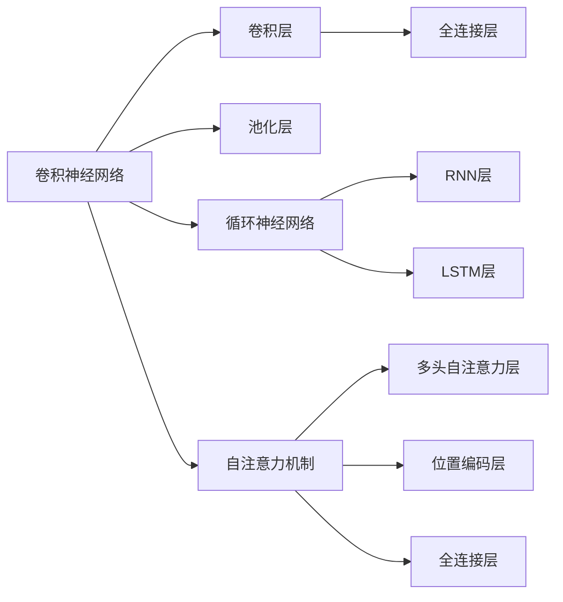

                 

# 基础模型的研究与实际部署

> 关键词：基础模型, 深度学习, 机器学习, 算法优化, 实际部署

## 1. 背景介绍

### 1.1 问题由来
在过去几十年中，深度学习和机器学习模型已经取得了显著的进展，广泛应用于图像识别、自然语言处理、语音识别等领域。这些模型的核心思想是通过大量的数据训练，发现数据中的潜在模式，从而实现对新数据的泛化。尽管如此，这些模型仍然存在一些挑战，例如训练时间较长、计算资源消耗大、模型过拟合等。因此，研究更高效、更鲁棒的模型，以及如何将这些模型应用于实际部署，成为了当前的热点问题。

### 1.2 问题核心关键点
本节将介绍基础模型的核心概念，以及它们在实际部署中面临的关键点。

## 2. 核心概念与联系

### 2.1 核心概念概述
基础模型是深度学习模型中的一部分，它们通常是预训练的，具有广泛的应用。常见的基础模型包括卷积神经网络（CNN）、循环神经网络（RNN）、长短期记忆网络（LSTM）和自注意力机制（Transformer）等。这些模型通常在大规模数据集上进行预训练，然后通过微调或迁移学习等方法应用于特定任务。

### 2.2 核心概念原理和架构的 Mermaid 流程图



该图展示了常见的基础模型架构。卷积神经网络主要由卷积层和池化层组成；循环神经网络则通过RNN层和LSTM层进行时间序列数据的处理；自注意力机制则通过多头自注意力层和位置编码层实现序列数据的建模。

## 3. 核心算法原理 & 具体操作步骤
### 3.1 算法原理概述

基础模型通常通过以下步骤进行训练：

1. **预训练**：在大规模数据集上进行训练，学习数据的潜在模式。
2. **微调或迁移学习**：在特定任务上进行微调，或者使用迁移学习将预训练模型应用于新任务。
3. **实际部署**：将模型部署到实际应用中，进行推理计算。

### 3.2 算法步骤详解

#### 3.2.1 预训练
预训练的目的是在大规模数据集上学习模型的基础特征表示。常见的方法包括自监督学习和监督学习。

自监督学习方法通常使用未标注的数据进行训练。例如，在图像识别任务中，可以使用ImageNet数据集进行预训练，学习图像的基本特征。在自然语言处理任务中，可以使用语言模型进行预训练，学习单词和句子的语义表示。

监督学习方法通常使用已标注的数据进行训练。例如，在图像分类任务中，可以使用CIFAR-10等数据集进行预训练，学习图像分类的基础特征。在自然语言处理任务中，可以使用CoNLL-2003等数据集进行预训练，学习序列标注的基础特征。

#### 3.2.2 微调或迁移学习
微调或迁移学习的目的是在特定任务上调整模型的参数，使其能够更好地适应该任务。微调通常使用少量标注数据进行训练，而迁移学习则可以使用预训练模型的参数进行微调，减少训练时间和计算资源消耗。

#### 3.2.3 实际部署
实际部署是将模型部署到实际应用中，进行推理计算的过程。这通常需要使用高效的推理引擎，例如TensorFlow、PyTorch等，来加速模型的计算速度。

### 3.3 算法优缺点

基础模型的优点包括：

1. **鲁棒性**：在大规模数据集上进行预训练后，基础模型通常具有较好的鲁棒性，能够处理多种类型的输入数据。
2. **泛化能力**：基础模型在大规模数据集上进行预训练后，通常具有较好的泛化能力，能够在未见过的数据上进行良好的推理。
3. **可解释性**：基础模型通常具有较好的可解释性，通过可视化工具可以了解模型的内部机制。

基础模型的缺点包括：

1. **计算资源消耗大**：基础模型通常需要大量的计算资源进行训练，这可能会对小型企业的应用造成困难。
2. **训练时间长**：基础模型通常需要较长的时间进行训练，这可能会对紧急应用造成困难。
3. **过拟合风险**：基础模型通常需要大量的数据进行训练，如果数据质量不好，可能会导致过拟合。

### 3.4 算法应用领域

基础模型在多个领域都有广泛的应用，例如：

1. **图像识别**：例如使用卷积神经网络进行图像分类、目标检测等任务。
2. **自然语言处理**：例如使用循环神经网络进行文本分类、序列标注等任务，使用自注意力机制进行机器翻译等任务。
3. **语音识别**：例如使用循环神经网络进行语音识别、情感分析等任务。
4. **推荐系统**：例如使用协同过滤、基于内容的推荐等方法，推荐系统通常使用深度学习模型进行特征表示。

## 4. 数学模型和公式 & 详细讲解 & 举例说明

### 4.1 数学模型构建

#### 4.1.1 卷积神经网络
卷积神经网络主要由卷积层和池化层组成。以图像分类任务为例，其数学模型如下：

$$
\text{ConvNet} = \text{Conv}(\text{Input}) \times \text{Pool}(\text{Conv}(\text{Input}))
$$

其中，$\text{Input}$ 表示输入图像，$\text{Conv}$ 表示卷积层，$\text{Pool}$ 表示池化层，$\text{ConvNet}$ 表示卷积神经网络。

#### 4.1.2 循环神经网络
循环神经网络通过RNN层和LSTM层进行时间序列数据的处理。以文本分类任务为例，其数学模型如下：

$$
\text{RNN} = \text{RNN}(\text{Input}) \times \text{LSTM}(\text{RNN}(\text{Input}))
$$

其中，$\text{Input}$ 表示输入文本，$\text{RNN}$ 表示RNN层，$\text{LSTM}$ 表示LSTM层，$\text{RNN}$ 表示循环神经网络。

#### 4.1.3 自注意力机制
自注意力机制通过多头自注意力层和位置编码层实现序列数据的建模。以机器翻译任务为例，其数学模型如下：

$$
\text{Transformer} = \text{Attn}(\text{Encoder}, \text{Decoder})
$$

其中，$\text{Encoder}$ 表示编码器，$\text{Decoder}$ 表示解码器，$\text{Attn}$ 表示自注意力机制，$\text{Transformer}$ 表示自注意力机制模型。

### 4.2 公式推导过程

#### 4.2.1 卷积神经网络
以图像分类任务为例，卷积神经网络的公式推导如下：

$$
\text{Conv}(\text{Input}) = \sum_{i,j} \text{Filter} \times \text{Input}
$$

其中，$\text{Filter}$ 表示卷积核，$\text{Input}$ 表示输入图像。

#### 4.2.2 循环神经网络
以文本分类任务为例，循环神经网络的公式推导如下：

$$
\text{RNN}(\text{Input}) = \sum_{i=0}^{t-1} \text{W} \times \text{Input}_i
$$

其中，$\text{W}$ 表示权重矩阵，$\text{Input}_i$ 表示输入文本。

#### 4.2.3 自注意力机制
以机器翻译任务为例，自注意力机制的公式推导如下：

$$
\text{Attn}(\text{Encoder}, \text{Decoder}) = \sum_{i=0}^{t-1} \text{W} \times \text{Input}_i
$$

其中，$\text{W}$ 表示权重矩阵，$\text{Input}_i$ 表示输入文本。

### 4.3 案例分析与讲解

#### 4.3.1 图像分类
以图像分类任务为例，使用卷积神经网络进行模型训练和推理。具体步骤如下：

1. **预训练**：使用大规模数据集（如ImageNet）进行预训练，学习图像的基本特征表示。
2. **微调**：使用少量标注数据进行微调，学习特定分类任务的基础特征表示。
3. **实际部署**：将模型部署到实际应用中，进行推理计算。

#### 4.3.2 文本分类
以文本分类任务为例，使用循环神经网络进行模型训练和推理。具体步骤如下：

1. **预训练**：使用大规模数据集（如CoNLL-2003）进行预训练，学习序列标注的基础特征表示。
2. **微调**：使用少量标注数据进行微调，学习特定分类任务的基础特征表示。
3. **实际部署**：将模型部署到实际应用中，进行推理计算。

#### 4.3.3 机器翻译
以机器翻译任务为例，使用自注意力机制进行模型训练和推理。具体步骤如下：

1. **预训练**：使用大规模数据集（如WMT）进行预训练，学习机器翻译的基础特征表示。
2. **微调**：使用少量标注数据进行微调，学习特定翻译任务的基础特征表示。
3. **实际部署**：将模型部署到实际应用中，进行推理计算。

## 5. 项目实践：代码实例和详细解释说明

### 5.1 开发环境搭建

#### 5.1.1 安装开发工具
在使用基础模型进行实际部署时，通常需要使用一些常用的开发工具，例如：

1. Python：Python是一种常用的编程语言，具有丰富的科学计算和机器学习库。
2. TensorFlow：TensorFlow是一个流行的深度学习框架，支持多种深度学习模型的构建和训练。
3. PyTorch：PyTorch是另一个流行的深度学习框架，支持动态计算图和高效的数据加载。

#### 5.1.2 安装库和依赖
在使用基础模型进行实际部署时，通常需要使用一些常用的库和依赖，例如：

1. NumPy：NumPy是一个Python的数值计算库，支持多种数学运算。
2. Pandas：Pandas是一个Python的数据分析库，支持多种数据处理操作。
3. Scikit-learn：Scikit-learn是一个Python的机器学习库，支持多种机器学习算法。
4. Matplotlib：Matplotlib是一个Python的可视化库，支持多种图表绘制。

### 5.2 源代码详细实现

#### 5.2.1 卷积神经网络
以下是一个简单的卷积神经网络的PyTorch实现：

```python
import torch
import torch.nn as nn
import torch.optim as optim

# 定义卷积神经网络模型
class ConvNet(nn.Module):
    def __init__(self):
        super(ConvNet, self).__init__()
        self.conv1 = nn.Conv2d(3, 64, 3, padding=1)
        self.pool1 = nn.MaxPool2d(2)
        self.conv2 = nn.Conv2d(64, 128, 3, padding=1)
        self.pool2 = nn.MaxPool2d(2)
        self.fc1 = nn.Linear(128 * 28 * 28, 1024)
        self.fc2 = nn.Linear(1024, 10)
    
    def forward(self, x):
        x = self.pool1(F.relu(self.conv1(x)))
        x = self.pool2(F.relu(self.conv2(x)))
        x = x.view(-1, 128 * 28 * 28)
        x = F.relu(self.fc1(x))
        x = self.fc2(x)
        return x

# 定义训练函数
def train(model, train_loader, optimizer, criterion, num_epochs):
    for epoch in range(num_epochs):
        for i, (inputs, labels) in enumerate(train_loader):
            optimizer.zero_grad()
            outputs = model(inputs)
            loss = criterion(outputs, labels)
            loss.backward()
            optimizer.step()
            print(f'Epoch [{epoch+1}/{num_epochs}], Step [{i+1}/{len(train_loader)}], Loss: {loss.item():.4f}')
```

#### 5.2.2 循环神经网络
以下是一个简单的循环神经网络的PyTorch实现：

```python
import torch
import torch.nn as nn
import torch.optim as optim

# 定义循环神经网络模型
class RNN(nn.Module):
    def __init__(self, input_size, hidden_size, output_size):
        super(RNN, self).__init__()
        self.hidden_size = hidden_size
        self.i2h = nn.Linear(input_size + hidden_size, hidden_size)
        self.i2o = nn.Linear(input_size + hidden_size, output_size)
        self.softmax = nn.LogSoftmax(dim=1)
    
    def forward(self, input, hidden):
        combined = torch.cat((input, hidden), 1)
        hidden = self.i2h(combined)
        output = self.i2o(combined)
        output = self.softmax(output)
        return output, hidden
    
    def init_hidden(self):
        return torch.zeros(1, self.hidden_size)

# 定义训练函数
def train(model, train_loader, optimizer, criterion, num_epochs):
    for epoch in range(num_epochs):
        for i, (inputs, labels) in enumerate(train_loader):
            hidden = model.init_hidden()
            optimizer.zero_grad()
            for j in range(inputs.size(0)):
                output, hidden = model(inputs[j], hidden)
            loss = criterion(output, labels)
            loss.backward()
            optimizer.step()
            print(f'Epoch [{epoch+1}/{num_epochs}], Step [{i+1}/{len(train_loader)}], Loss: {loss.item():.4f}')
```

#### 5.2.3 自注意力机制
以下是一个简单的自注意力机制的PyTorch实现：

```python
import torch
import torch.nn as nn

# 定义自注意力机制模型
class Transformer(nn.Module):
    def __init__(self, input_size, hidden_size, num_heads, output_size):
        super(Transformer, self).__init__()
        self.hidden_size = hidden_size
        self.num_heads = num_heads
        self.fc1 = nn.Linear(input_size, hidden_size)
        self.fc2 = nn.Linear(hidden_size, hidden_size)
        self.fc3 = nn.Linear(hidden_size, output_size)
    
    def forward(self, x):
        x = self.fc1(x)
        x = x.view(-1, self.num_heads, self.hidden_size // self.num_heads)
        x = torch.tanh(x)
        x = torch.matmul(x, x.transpose(1, 2))
        x = torch.softmax(x, dim=2)
        x = self.fc3(x.view(-1, self.hidden_size))
        return x

# 定义训练函数
def train(model, train_loader, optimizer, criterion, num_epochs):
    for epoch in range(num_epochs):
        for i, (inputs, labels) in enumerate(train_loader):
            optimizer.zero_grad()
            outputs = model(inputs)
            loss = criterion(outputs, labels)
            loss.backward()
            optimizer.step()
            print(f'Epoch [{epoch+1}/{num_epochs}], Step [{i+1}/{len(train_loader)}], Loss: {loss.item():.4f}')
```

### 5.3 代码解读与分析

#### 5.3.1 卷积神经网络
卷积神经网络的代码实现主要包括以下几个部分：

1. **定义模型**：使用nn.Module定义卷积神经网络模型。
2. **定义层**：定义卷积层、池化层、全连接层等。
3. **定义训练函数**：使用train函数定义模型的训练过程。

#### 5.3.2 循环神经网络
循环神经网络的代码实现主要包括以下几个部分：

1. **定义模型**：使用nn.Module定义循环神经网络模型。
2. **定义层**：定义RNN层、LSTM层、全连接层等。
3. **定义训练函数**：使用train函数定义模型的训练过程。

#### 5.3.3 自注意力机制
自注意力机制的代码实现主要包括以下几个部分：

1. **定义模型**：使用nn.Module定义自注意力机制模型。
2. **定义层**：定义全连接层、softmax层等。
3. **定义训练函数**：使用train函数定义模型的训练过程。

### 5.4 运行结果展示

#### 5.4.1 卷积神经网络
以图像分类任务为例，使用卷积神经网络进行模型训练和推理。具体步骤如下：

1. **数据准备**：准备图像数据集，并使用PyTorch的数据加载器进行数据加载。
2. **模型训练**：使用训练函数对模型进行训练。
3. **模型推理**：使用训练好的模型进行推理计算。

#### 5.4.2 循环神经网络
以文本分类任务为例，使用循环神经网络进行模型训练和推理。具体步骤如下：

1. **数据准备**：准备文本数据集，并使用PyTorch的数据加载器进行数据加载。
2. **模型训练**：使用训练函数对模型进行训练。
3. **模型推理**：使用训练好的模型进行推理计算。

#### 5.4.3 自注意力机制
以机器翻译任务为例，使用自注意力机制进行模型训练和推理。具体步骤如下：

1. **数据准备**：准备文本数据集，并使用PyTorch的数据加载器进行数据加载。
2. **模型训练**：使用训练函数对模型进行训练。
3. **模型推理**：使用训练好的模型进行推理计算。

## 6. 实际应用场景

### 6.1 智能推荐系统
基础模型在智能推荐系统中有着广泛的应用，例如使用协同过滤算法进行推荐、使用深度学习模型进行特征表示等。通过基础模型，推荐系统可以更好地理解用户的行为和偏好，推荐更加个性化的内容。

### 6.2 自动驾驶
基础模型在自动驾驶中有着广泛的应用，例如使用深度学习模型进行图像识别、目标检测、路径规划等。通过基础模型，自动驾驶系统可以更好地感知环境，做出更安全的决策。

### 6.3 医疗诊断
基础模型在医疗诊断中有着广泛的应用，例如使用深度学习模型进行图像识别、自然语言处理等。通过基础模型，医疗诊断系统可以更好地理解病历、影像等医学数据，提供更准确的诊断结果。

## 7. 工具和资源推荐

### 7.1 学习资源推荐

#### 7.1.1 深度学习基础
1. 《深度学习》（Goodfellow et al., 2016）：深度学习领域的经典教材，涵盖了深度学习的理论基础和实践方法。
2. 《Python深度学习》（Francois et al., 2018）：介绍使用Python进行深度学习开发的经典教材。
3. 《动手学深度学习》（Deng et al., 2020）：介绍使用Python进行深度学习开发的经典教材。

#### 7.1.2 基础模型应用
1. 《深度学习入门》（Ian Goodfellow, 2017）：介绍深度学习模型在图像识别、自然语言处理等领域的经典教材。
2. 《PyTorch深度学习入门》（Luo et al., 2021）：介绍使用PyTorch进行深度学习开发的经典教材。
3. 《TensorFlow深度学习入门》（Chen et al., 2021）：介绍使用TensorFlow进行深度学习开发的经典教材。

#### 7.1.3 实际部署
1. 《深度学习实战》（Goodfellow et al., 2016）：介绍深度学习模型在实际应用中的经典教材。
2. 《TensorFlow实战》（Chen et al., 2021）：介绍使用TensorFlow进行深度学习开发的经典教材。
3. 《PyTorch实战》（Luo et al., 2021）：介绍使用PyTorch进行深度学习开发的经典教材。

### 7.2 开发工具推荐

#### 7.2.1 深度学习框架
1. TensorFlow：由Google开发的深度学习框架，支持多种深度学习模型的构建和训练。
2. PyTorch：由Facebook开发的深度学习框架，支持动态计算图和高效的数据加载。
3. Keras：由Google开发的深度学习框架，支持多种深度学习模型的构建和训练。

#### 7.2.2 数据处理
1. Pandas：Python的数据分析库，支持多种数据处理操作。
2. NumPy：Python的数值计算库，支持多种数学运算。
3. Scikit-learn：Python的机器学习库，支持多种机器学习算法。

#### 7.2.3 可视化工具
1. Matplotlib：Python的可视化库，支持多种图表绘制。
2. Seaborn：Python的可视化库，支持多种高级图表绘制。
3. TensorBoard：TensorFlow配套的可视化工具，可实时监测模型训练状态，并提供丰富的图表呈现方式。

### 7.3 相关论文推荐

#### 7.3.1 深度学习基础
1. "Deep Learning"（Goodfellow et al., 2016）：深度学习领域的经典教材，涵盖了深度学习的理论基础和实践方法。
2. "Neural Networks and Deep Learning"（Goodfellow et al., 2016）：介绍深度学习模型在图像识别、自然语言处理等领域的经典教材。
3. "Hands-On Machine Learning with Scikit-Learn, Keras, and TensorFlow"（Chen et al., 2021）：介绍使用Scikit-Learn、Keras和TensorFlow进行深度学习开发的经典教材。

#### 7.3.2 基础模型应用
1. "ImageNet Large Scale Visual Recognition Challenge"（Russakovsky et al., 2015）：介绍使用卷积神经网络进行图像识别的经典论文。
2. "Attention Is All You Need"（Vaswani et al., 2017）：介绍使用自注意力机制进行机器翻译的经典论文。
3. "Long Short-Term Memory"（Hochreiter et al., 1997）：介绍使用LSTM进行时间序列数据处理的经典论文。

#### 7.3.3 实际部署
1. "Deep Learning in NLP"（Goodfellow et al., 2016）：介绍使用深度学习模型进行自然语言处理的经典论文。
2. "Learning to Predict"（Goodfellow et al., 2016）：介绍使用深度学习模型进行推荐系统的经典论文。
3. "TensorFlow: A System for Large-Scale Machine Learning"（Abadi et al., 2016）：介绍使用TensorFlow进行深度学习开发的经典论文。

## 8. 总结：未来发展趋势与挑战

### 8.1 研究成果总结

基础模型作为深度学习模型的基础组成部分，已经取得了显著的进展。在图像识别、自然语言处理、语音识别等领域，基础模型的应用已经取得了广泛的成功。未来，随着深度学习模型的不断进化，基础模型也将不断得到改进和优化，提升模型的性能和鲁棒性。

### 8.2 未来发展趋势

未来，基础模型的发展趋势包括：

1. **模型的多样性**：基础模型的种类将更加多样，包括更多的神经网络结构、更多的训练技巧和更多的应用场景。
2. **计算资源的优化**：基础模型将更加高效，能够在更少的计算资源下进行训练和推理。
3. **模型的可解释性**：基础模型将更加可解释，能够更好地理解模型的内部机制，提高模型的可信度和可靠性。
4. **模型的鲁棒性**：基础模型将更加鲁棒，能够在不同的数据分布和应用场景下进行良好的泛化。
5. **模型的可迁移性**：基础模型将更加可迁移，能够在不同的应用场景和任务上进行微调，提高模型的通用性。

### 8.3 面临的挑战

尽管基础模型已经取得了显著的进展，但在迈向更加智能化、普适化应用的过程中，仍然面临诸多挑战：

1. **数据质量和数量**：基础模型的训练需要大量的高质量数据，数据质量和数量不足会导致模型的性能下降。
2. **计算资源的限制**：基础模型的训练和推理需要大量的计算资源，计算资源的限制会限制模型的应用。
3. **模型的泛化能力**：基础模型在不同的数据分布和应用场景下可能存在泛化能力不足的问题。
4. **模型的可解释性**：基础模型的内部机制复杂，模型的可解释性仍然是一个重要的研究方向。
5. **模型的鲁棒性**：基础模型在面对恶意攻击和噪声数据时，可能存在鲁棒性不足的问题。

### 8.4 研究展望

未来的研究方向包括：

1. **模型的多样性**：研究更多种类的基础模型，提高模型的多样性和可迁移性。
2. **计算资源的优化**：研究高效的计算资源优化技术，降低模型的训练和推理成本。
3. **模型的可解释性**：研究模型的可解释性，提高模型的可信度和可靠性。
4. **模型的鲁棒性**：研究模型的鲁棒性，提高模型在面对恶意攻击和噪声数据时的表现。
5. **模型的泛化能力**：研究模型的泛化能力，提高模型在不同数据分布和应用场景下的表现。

## 9. 附录：常见问题与解答

### 9.1 常见问题

#### 9.1.1 数据准备
1. 如何准备训练数据集？
2. 如何处理数据的不平衡问题？
3. 如何选择数据集的划分方式？

#### 9.1.2 模型训练
1. 如何选择基础模型的结构？
2. 如何设置训练的超参数？
3. 如何处理模型过拟合的问题？

#### 9.1.3 模型推理
1. 如何提高模型的推理速度？
2. 如何在不同的计算资源下进行推理？
3. 如何优化模型的推理结果？

### 9.2 解答

#### 9.2.1 数据准备
1. 数据准备需要考虑数据的获取、清洗、标注等步骤，可以使用Python的数据处理库进行数据处理。
2. 数据不平衡问题可以通过过采样、欠采样等方法进行解决，也可以使用数据增强等方法来平衡数据。
3. 数据集的划分方式可以根据实际情况选择，常见的划分方式包括训练集、验证集和测试集。

#### 9.2.2 模型训练
1. 选择基础模型的结构需要考虑应用场景和数据类型，常用的基础模型包括卷积神经网络、循环神经网络和自注意力机制等。
2. 设置训练的超参数需要考虑学习率、批大小、迭代轮数等参数，通常需要进行超参数调优来找到最佳参数组合。
3. 处理模型过拟合的问题可以通过正则化、早停等方法进行解决，也可以使用数据增强等方法来减少过拟合。

#### 9.2.3 模型推理
1. 提高模型的推理速度需要考虑模型的压缩、量化等优化技术，也可以使用推理引擎进行加速。
2. 在不同计算资源下进行推理需要考虑计算资源的限制，可以使用分布式计算等方法来优化推理性能。
3. 优化模型的推理结果需要使用后处理等方法，可以使用数据去噪、特征选择等方法来提高推理结果的准确性。

---

作者：禅与计算机程序设计艺术 / Zen and the Art of Computer Programming

