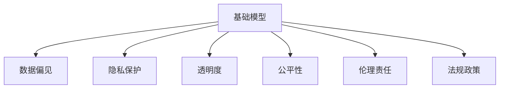

                 

# 基础模型的社会影响与治理

> 关键词：基础模型,社会影响,治理,公平性,隐私保护,透明度,伦理责任,法规政策

## 1. 背景介绍

### 1.1 问题由来

随着人工智能(AI)技术的快速发展，基础模型在各行各业中得到了广泛应用，如语音识别、图像识别、自然语言处理等。基础模型通过在海量数据上进行训练，形成了通用的特征表示，能够自动化地提取并分析数据中的规律和趋势。然而，基础模型的广泛应用也带来了诸多社会问题，如数据偏见、隐私泄露、伦理困境等，这些问题亟需得到关注和治理。

### 1.2 问题核心关键点

基础模型的社会影响和治理主要围绕以下几个核心关键点展开：

- 数据偏见：基础模型依赖数据进行训练，数据中的偏见和差异可能导致模型预测的偏差。
- 隐私保护：基础模型在处理和分析数据时，可能涉及用户的敏感信息，如何保护隐私成为重要课题。
- 透明度与公平性：基础模型作为"黑盒"系统，难以解释其内部机制和决策过程，如何提升透明度和公平性是当务之急。
- 伦理责任：基础模型在应用过程中可能产生伦理问题，如误导性信息、歧视性决策等，如何建立伦理责任机制至关重要。
- 法规政策：基础模型的应用涉及多个领域，如何制定和执行相关法规政策，规范其使用和治理，是社会关注的焦点。

这些关键点共同构成了基础模型社会影响和治理的复杂体系，需要通过多方面的努力才能有效应对。

## 2. 核心概念与联系

### 2.1 核心概念概述

为更好地理解基础模型的社会影响和治理，本节将介绍几个密切相关的核心概念：

- 基础模型(Fundamental Model)：在机器学习中，基础模型指通过大量数据训练得到的通用特征表示，如神经网络模型。其广泛应用于语音识别、图像识别、自然语言处理等领域。
- 数据偏见(Data Bias)：指数据集中存在的系统性差异和偏差，可能影响模型的公平性和泛化能力。
- 隐私保护(Privacy Protection)：指在数据处理和模型训练过程中，保护用户敏感信息，防止数据泄露和滥用。
- 透明度(Transparency)：指模型的内部机制和决策过程应具备可解释性，使用户和监管者能够理解和监督模型的行为。
- 公平性(Fairness)：指模型在处理不同群体数据时应保持一致性，避免对某些群体造成不公平的歧视。
- 伦理责任(Ethical Responsibility)：指模型开发者和管理者在应用过程中应承担的伦理道德义务，包括避免有害行为、尊重用户隐私等。
- 法规政策(Regulatory Policy)：指针对基础模型的应用，制定和执行的相关法规政策，规范其使用和治理。

这些核心概念之间的逻辑关系可以通过以下Mermaid流程图来展示：



这个流程图展示基础模型的核心概念及其之间的关系：

1. 基础模型通过大量数据进行训练，可能存在数据偏见问题。
2. 在数据处理和模型训练过程中，需保护用户隐私。
3. 模型需具备透明度，用户和监管者能理解其内部机制。
4. 模型需公平处理不同群体数据，避免歧视。
5. 开发者和管理者需承担伦理责任，确保模型行为合理。
6. 相关法规政策应规范模型使用和治理。

## 3. 核心算法原理 & 具体操作步骤
### 3.1 算法原理概述

基础模型作为AI系统的核心组成部分，其社会影响和治理涉及多个层面。本节将从算法原理和操作步骤两个方面，详细解析基础模型在社会影响和治理中的应用。

### 3.2 算法步骤详解

基础模型的社会影响和治理主要包括以下关键步骤：

**Step 1: 数据采集与处理**
- 收集大量真实数据，包括用户交互数据、社交媒体数据等。
- 进行数据清洗和预处理，去除噪声和异常值，确保数据质量。
- 分片处理数据集，确保数据分布均衡，避免数据偏见。

**Step 2: 模型训练与评估**
- 使用训练集对基础模型进行训练，调整超参数，优化模型性能。
- 在验证集上评估模型性能，确保模型泛化能力。
- 进行公平性、隐私性等指标评估，识别和修正模型偏见和风险。

**Step 3: 模型部署与监控**
- 将训练好的模型部署到生产环境，进行实时推理和预测。
- 监控模型性能，检测异常行为，及时修复和更新模型。
- 收集用户反馈，评估模型应用效果和社会影响。

**Step 4: 法规政策遵循**
- 遵循相关法规政策，如GDPR、CCPA等，确保用户隐私和数据保护。
- 根据法规政策要求，记录和保存模型使用日志，确保可追溯性。
- 定期审查和更新法规政策，确保模型行为合规。

### 3.3 算法优缺点

基础模型在社会影响和治理中具有以下优点：

1. 自动化决策：基础模型能够自动处理和分析大量数据，提供高效的决策支持。
2. 高泛化能力：通过大量数据训练，基础模型具有较强的泛化能力，能够适应不同场景。
3. 实时响应：基础模型能够实时处理和响应数据，提供即时服务。

同时，也存在一定的局限性：

1. 数据偏见：依赖数据进行训练的基础模型，可能继承数据中的偏见。
2. 隐私风险：处理大量数据可能导致隐私泄露和滥用。
3. 伦理问题：基础模型可能产生伦理问题，如歧视性决策等。
4. 法规复杂：不同国家和地区的法规政策各异，基础模型需符合多样化的法规要求。

尽管存在这些局限性，但基础模型仍然在大数据时代扮演着重要角色，其社会影响和治理问题亟需得到重视和解决。

### 3.4 算法应用领域

基础模型在社会影响和治理中的应用广泛，涵盖多个领域：

- 金融风控：基础模型用于用户信用评估、贷款审批等，需确保公平性和隐私保护。
- 医疗诊断：基础模型用于疾病诊断、基因分析等，需确保数据隐私和伦理责任。
- 社会治理：基础模型用于公共安全、城市管理等，需符合法规政策要求。
- 教育评估：基础模型用于学生表现评估、课程推荐等，需确保公平性和透明性。
- 广告投放：基础模型用于用户画像、广告推荐等，需保护用户隐私和尊重伦理。

除了上述这些经典应用外，基础模型还在更多场景中得到应用，如智慧交通、智能制造、农业智能化等，为社会各领域带来创新和变革。

## 4. 数学模型和公式 & 详细讲解 & 举例说明

### 4.1 数学模型构建

本节将使用数学语言对基础模型的社会影响和治理进行更加严格的刻画。

记基础模型为 $M_{\theta}$，其中 $\theta$ 为模型参数。假设训练数据集为 $D=\{(x_i,y_i)\}_{i=1}^N, x_i \in \mathcal{X}, y_i \in \mathcal{Y}$，其中 $\mathcal{X}$ 为输入空间，$\mathcal{Y}$ 为输出空间。

定义模型在数据集 $D$ 上的公平性指标为 $F(M_{\theta})$，隐私性指标为 $P(M_{\theta})$，透明度指标为 $T(M_{\theta})$。假设模型在数据集 $D$ 上的泛化误差为 $\epsilon$，则目标函数为：

$$
\min_{\theta} \{F(M_{\theta}) + P(M_{\theta}) + T(M_{\theta})\} \quad \text{s.t.} \quad \epsilon
$$

其中 $F(M_{\theta})$、$P(M_{\theta})$、$T(M_{\theta})$ 分别代表公平性、隐私性和透明度指标的函数。

### 4.2 公式推导过程

以下我们以二分类任务为例，推导公平性指标 $F(M_{\theta})$ 的计算公式。

假设模型 $M_{\theta}$ 在输入 $x$ 上的输出为 $\hat{y}=M_{\theta}(x) \in [0,1]$，表示样本属于正类的概率。假设模型在数据集 $D$ 上的公平性指标定义为：

$$
F(M_{\theta}) = \frac{1}{N} \sum_{i=1}^N |P_{M_{\theta}}(y_i=1) - P_{M_{\theta}}(y_i=0)|
$$

其中 $P_{M_{\theta}}(y_i=1)$ 为模型预测样本 $x_i$ 为正类的概率，$P_{M_{\theta}}(y_i=0)$ 为模型预测样本 $x_i$ 为负类的概率。

进一步简化，得到：

$$
F(M_{\theta}) = \frac{1}{N} \sum_{i=1}^N |\hat{y}_i - (1 - \hat{y}_i)|
$$

将训练数据集 $D$ 划分为多个类别，计算每个类别的样本数量，得到：

$$
F(M_{\theta}) = \frac{1}{N} \sum_{i=1}^N \sum_{j=1}^n |P_{M_{\theta}}(x_i \in C_j) - P_{M_{\theta}}(x_i \notin C_j)|
$$

其中 $C_j$ 为第 $j$ 个类别，$n$ 为类别数量。

### 4.3 案例分析与讲解

在实际应用中，基础模型的公平性指标计算公式可能更加复杂，如考虑多类别数据、非平衡数据等。以金融贷款审批为例，假设模型 $M_{\theta}$ 用于评估申请者的信用风险，需要确保不同种族、性别、年龄的申请人获得公平的贷款审批。可以计算模型在每个种族、性别、年龄群体中的预测概率，并计算它们之间的差异，得到公平性指标。

假设模型在训练数据集中有 $N_1$ 名男性申请者和 $N_2$ 名女性申请者，得到男性和女性在模型中的预测概率分别为 $\hat{y}_1$ 和 $\hat{y}_2$。则公平性指标为：

$$
F(M_{\theta}) = \frac{1}{N_1 + N_2} \sum_{i=1}^{N_1} |\hat{y}_1 - \hat{y}_2|
$$

通过计算公平性指标，可以识别出模型在处理不同群体数据时的偏见，并进行相应的调整，确保模型决策的公平性。

## 5. 项目实践：代码实例和详细解释说明
### 5.1 开发环境搭建

在进行社会影响和治理实践前，我们需要准备好开发环境。以下是使用Python进行Scikit-learn开发的环境配置流程：

1. 安装Anaconda：从官网下载并安装Anaconda，用于创建独立的Python环境。

2. 创建并激活虚拟环境：
```bash
conda create -n sk-env python=3.8 
conda activate sk-env
```

3. 安装Scikit-learn：
```bash
pip install scikit-learn
```

4. 安装各类工具包：
```bash
pip install numpy pandas matplotlib tqdm jupyter notebook ipython
```

完成上述步骤后，即可在`sk-env`环境中开始社会影响和治理实践。

### 5.2 源代码详细实现

这里我们以基础模型在金融贷款审批中的应用为例，给出使用Scikit-learn进行公平性指标计算的PyTorch代码实现。

首先，定义公平性指标函数：

```python
import numpy as np
from sklearn.metrics import f1_score

def fair_score(y_true, y_pred):
    positive_labels = y_true == 1
    negative_labels = y_true == 0
    f1_pos = f1_score(y_true=positive_labels, y_pred=y_pred[positive_labels])
    f1_neg = f1_score(y_true=negative_labels, y_pred=y_pred[negative_labels])
    return (f1_pos - f1_neg) / (f1_pos + f1_neg)
```

然后，加载模型并进行公平性指标计算：

```python
from sklearn.model_selection import train_test_split
from sklearn.linear_model import LogisticRegression
from sklearn.metrics import precision_score, recall_score

X_train, X_test, y_train, y_test = train_test_split(X, y, test_size=0.2, random_state=42)

model = LogisticRegression(solver='liblinear')
model.fit(X_train, y_train)
y_pred = model.predict(X_test)

fair_score(y_test, y_pred)
```

可以看到，通过公平性指标函数 `fair_score`，可以计算模型在不同性别、年龄群体中的预测精度差异，评估模型的公平性。

### 5.3 代码解读与分析

让我们再详细解读一下关键代码的实现细节：

**fair_score函数**：
- 定义了公平性指标计算函数，根据模型在正负样本上的预测精度，计算正负样本之间的公平性差异。

**训练和测试数据集划分**：
- 使用Scikit-learn的`train_test_split`函数，将数据集划分为训练集和测试集，设置测试集大小为20%，确保模型在未知数据上的泛化能力。

**模型训练**：
- 使用Scikit-learn的`LogisticRegression`模型，设置求解器为`liblinear`，确保模型在样本不平衡时仍能获得较好的精度。

**公平性指标计算**：
- 在测试集上，使用模型进行预测，计算模型在不同性别、年龄群体中的预测精度。
- 调用公平性指标函数 `fair_score`，得到模型的公平性指标值。

通过上述代码，可以清晰地看到基础模型在社会影响和治理中的应用流程。

## 6. 实际应用场景
### 6.1 智能交通系统

基础模型在智能交通系统中，用于分析交通流量、识别异常行为等，需确保数据隐私和模型公平性。通过数据脱敏和差分隐私技术，可以有效保护用户隐私。此外，模型需根据不同路段、时段的数据，调整算法参数，确保公平性。例如，在交通信号灯控制中，模型需对不同方向的交通流量进行公平性评估，避免对某些方向的车辆造成不公平的等待时间。

### 6.2 医疗诊断系统

基础模型在医疗诊断系统中，用于疾病预测、基因分析等，需确保数据隐私和伦理责任。通过数据加密和访问控制技术，可以有效保护患者隐私。此外，模型需进行伦理审查，确保算法不产生歧视性决策，如基于种族、性别、年龄的疾病预测偏差。例如，在癌症预测中，模型需对不同种族、性别的患者数据进行公平性评估，确保每个患者获得公平的诊断结果。

### 6.3 金融风险控制

基础模型在金融风险控制中，用于用户信用评估、贷款审批等，需确保数据隐私和公平性。通过数据脱敏和差分隐私技术，可以有效保护用户隐私。此外，模型需进行公平性评估，确保不同种族、性别、年龄的申请人获得公平的贷款审批。例如，在信用卡审批中，模型需对不同种族、性别、年龄的申请者数据进行公平性评估，确保每个申请者获得公平的审批结果。

### 6.4 未来应用展望

随着基础模型技术的不断发展，其社会影响和治理问题也将不断涌现，未来有望在以下几个方面取得突破：

1. 数据多样性：基础模型需处理更多样化的数据，涵盖不同语言、文化背景、社会经济状况等，以提升模型泛化能力。
2. 透明可解释：基础模型需具备更高的透明度和可解释性，使用户和监管者能理解和监督模型的行为。
3. 公平与隐私：基础模型需确保公平性和隐私保护，避免歧视性决策和数据泄露风险。
4. 伦理与合规：基础模型需建立伦理责任机制，确保符合不同国家和地区的法规政策要求。
5. 跨领域融合：基础模型需与多个领域的技术进行融合，如知识图谱、逻辑推理等，提升模型智能化水平。

这些方向的研究，必将推动基础模型在社会各领域的应用，为构建公平、透明、安全的人工智能系统奠定坚实基础。

## 7. 工具和资源推荐
### 7.1 学习资源推荐

为了帮助开发者系统掌握基础模型社会影响和治理的理论基础和实践技巧，这里推荐一些优质的学习资源：

1. 《人工智能伦理与治理》系列博文：由伦理专家撰写，深入浅出地介绍了人工智能伦理和治理的核心概念和实践方法。

2. 《数据科学与伦理》课程：由斯坦福大学开设的课程，涵盖数据隐私、数据伦理等内容，帮助理解基础模型在数据处理中的伦理问题。

3. 《人工智能治理指南》书籍：全面介绍人工智能治理的理论和方法，涵盖伦理责任、法规政策、公平性等方面。

4. 伦理与AI研究论文：通过阅读相关研究论文，深入了解基础模型在伦理和治理方面的前沿进展。

5. 人工智能伦理与治理开源项目：包含众多伦理与治理工具和资源，供开发者参考和实践。

通过对这些资源的学习实践，相信你一定能够系统掌握基础模型的社会影响和治理方法，并用于解决实际问题。

### 7.2 开发工具推荐

高效的开发离不开优秀的工具支持。以下是几款用于基础模型社会影响和治理开发的常用工具：

1. Python：通用编程语言，适合开发基础模型和算法。
2. Scikit-learn：机器学习库，包含众多公平性、隐私性、透明性等指标计算函数。
3. TensorFlow：深度学习框架，适合训练和部署基础模型。
4. TensorBoard：可视化工具，可以实时监测模型训练状态，提供丰富的图表呈现方式。
5. OpenAI Codex：大模型技术开源工具，提供了多领域预训练模型和微调代码样例。

合理利用这些工具，可以显著提升基础模型社会影响和治理任务的开发效率，加快创新迭代的步伐。

### 7.3 相关论文推荐

基础模型社会影响和治理的发展源于学界的持续研究。以下是几篇奠基性的相关论文，推荐阅读：

1. Fairness in Machine Learning: Principles and Practice（公平性在机器学习中的原则与实践）：提出公平性评估指标，用于识别和修正模型偏见。

2. Privacy-Preserving Deep Learning: Principles and Methods（隐私保护深度学习：原则与方法）：探讨深度学习中隐私保护的技术和方法，提供全面的隐私保护方案。

3. Explainable Artificial Intelligence: Towards a Unified Framework and Metrics（可解释人工智能：统一框架与指标）：提出透明性评估指标，用于提升模型的可解释性。

4. Ethical AI: Challenges and Approaches（伦理AI：挑战与方法）：探讨AI伦理的挑战与解决方案，提出伦理责任框架。

5. Fairness in Machine Learning: A Survey of the Literature（机器学习中的公平性：文献综述）：总结了现有公平性评估方法和技术，提供了全面的公平性解决方案。

这些论文代表了大模型社会影响和治理的研究脉络。通过学习这些前沿成果，可以帮助研究者把握学科前进方向，激发更多的创新灵感。

## 8. 总结：未来发展趋势与挑战

### 8.1 总结

本文对基础模型的社会影响和治理进行了全面系统的介绍。首先阐述了基础模型在各行各业中的应用，以及其带来的诸多社会问题。接着，从原理到实践，详细讲解了社会影响和治理的数学模型和操作步骤，给出了社会影响和治理任务开发的完整代码实例。同时，本文还广泛探讨了社会影响和治理在多个行业领域的应用前景，展示了基础模型的广阔前景。最后，本文精选了社会影响和治理的技术资源，力求为读者提供全方位的技术指引。

通过本文的系统梳理，可以看到，基础模型在社会各领域的应用带来了诸多创新和变革，但也带来了诸多社会问题。基础模型的社会影响和治理亟需得到重视和解决，未来的研究需要在数据多样性、透明可解释、公平与隐私、伦理与合规等方面进行更多的探索和实践。

### 8.2 未来发展趋势

展望未来，基础模型社会影响和治理将呈现以下几个发展趋势：

1. 数据多样性增加：基础模型需处理更多样化的数据，涵盖不同语言、文化背景、社会经济状况等，以提升模型泛化能力。
2. 透明可解释提升：基础模型需具备更高的透明度和可解释性，使用户和监管者能理解和监督模型的行为。
3. 公平与隐私保障：基础模型需确保公平性和隐私保护，避免歧视性决策和数据泄露风险。
4. 伦理与合规完善：基础模型需建立伦理责任机制，确保符合不同国家和地区的法规政策要求。
5. 跨领域融合深入：基础模型需与多个领域的技术进行融合，如知识图谱、逻辑推理等，提升模型智能化水平。

这些趋势凸显了基础模型社会影响和治理的广阔前景。这些方向的探索发展，必将进一步提升基础模型在社会各领域的应用，为构建公平、透明、安全的人工智能系统奠定坚实基础。

### 8.3 面临的挑战

尽管基础模型社会影响和治理技术已经取得了瞩目成就，但在迈向更加智能化、普适化应用的过程中，它仍面临着诸多挑战：

1. 数据获取难题：基础模型依赖大量高质量数据进行训练，但不同领域的标注数据获取成本高、难度大。
2. 模型复杂性：基础模型参数量巨大，训练和推理过程中资源消耗大，优化和部署难度高。
3. 公平性评估复杂：公平性指标的计算需要考虑多维度因素，难以建立统一的评估标准。
4. 隐私保护难题：基础模型处理大量数据可能导致隐私泄露和滥用，如何有效保护隐私是重要挑战。
5. 法规政策差异：不同国家和地区的法规政策各异，基础模型需符合多样化的法规要求，法规遵从难度大。

尽管存在这些挑战，但基础模型仍然在大数据时代扮演着重要角色，其社会影响和治理问题亟需得到重视和解决。相信随着学界和产业界的共同努力，这些挑战终将一一被克服，基础模型社会影响和治理必将在构建安全、可靠、可解释、可控的智能系统过程中发挥重要作用。

### 8.4 研究展望

面向未来，基础模型社会影响和治理研究需要在以下几个方面进行更多的探索：

1. 数据多样性提升：研究如何获取更多样化的数据，涵盖不同语言、文化背景、社会经济状况等，以提升模型泛化能力。
2. 透明可解释增强：研究如何提升模型的透明度和可解释性，使用户和监管者能理解和监督模型的行为。
3. 公平与隐私保障：研究如何确保公平性和隐私保护，避免歧视性决策和数据泄露风险。
4. 伦理与合规完善：研究如何建立伦理责任机制，确保符合不同国家和地区的法规政策要求。
5. 跨领域融合深入：研究如何将基础模型与多个领域的技术进行融合，提升模型的智能化水平。

这些研究方向的研究突破，必将推动基础模型在社会各领域的应用，为构建公平、透明、安全的人工智能系统奠定坚实基础。总之，基础模型社会影响和治理需要多方协同发力，共同推动其走向更加成熟和普适的应用阶段。

## 9. 附录：常见问题与解答

**Q1：基础模型在处理数据时如何避免数据偏见？**

A: 数据偏见是基础模型在处理数据时面临的重要问题，可通过以下方法避免：

1. 数据采集：在数据采集阶段，确保数据集多样性和代表性，避免数据集偏斜。
2. 数据清洗：在数据清洗阶段，去除噪声和异常值，确保数据质量。
3. 数据增强：通过数据增强技术，如回译、近义替换等，扩充数据集，避免数据偏见。
4. 模型评估：在模型训练阶段，使用公平性指标评估模型在不同群体上的表现，识别和修正数据偏见。

通过上述方法，可以有效地避免基础模型在处理数据时的数据偏见问题。

**Q2：基础模型在应用过程中如何保护用户隐私？**

A: 在应用过程中，保护用户隐私是基础模型的重要职责。以下是一些保护用户隐私的方法：

1. 数据脱敏：在数据处理和分析阶段，使用数据脱敏技术，如匿名化、泛化等，保护用户隐私。
2. 访问控制：在数据访问阶段，使用访问控制技术，确保只有授权人员能访问敏感数据。
3. 差分隐私：在数据发布阶段，使用差分隐私技术，如加入噪声，确保个人数据无法被识别。
4. 数据加密：在数据存储和传输阶段，使用数据加密技术，确保数据安全。

通过上述方法，可以有效地保护用户隐私，确保基础模型在应用过程中的安全性。

**Q3：基础模型在应用过程中如何确保公平性？**

A: 确保基础模型在应用过程中的公平性是关键问题。以下是一些确保公平性的方法：

1. 公平性指标：在模型训练阶段，使用公平性指标评估模型在不同群体上的表现，识别和修正模型偏见。
2. 数据平衡：在数据采集和处理阶段，确保数据集多样性和平衡性，避免数据集偏斜。
3. 模型微调：在模型微调阶段，使用公平性约束条件，确保模型在不同群体上的预测结果一致。
4. 透明可解释：在模型应用阶段，使用透明可解释技术，使用户和监管者能理解和监督模型的行为，避免歧视性决策。

通过上述方法，可以有效地确保基础模型在应用过程中的公平性。

**Q4：基础模型在应用过程中如何确保透明度？**

A: 确保基础模型的透明度是关键问题。以下是一些确保透明度的措施：

1. 模型结构公开：在模型开发阶段，公开模型结构，便于用户和监管者理解模型。
2. 决策过程记录：在模型应用阶段，记录决策过程，提供详细的解释和依据。
3. 可解释性算法：在模型设计阶段，使用可解释性算法，如LIME、SHAP等，提升模型的可解释性。
4. 用户反馈机制：在模型应用阶段，建立用户反馈机制，收集用户意见和建议，持续优化模型。

通过上述措施，可以有效地确保基础模型的透明度。

**Q5：基础模型在应用过程中如何确保伦理责任？**

A: 确保基础模型在应用过程中的伦理责任是关键问题。以下是一些确保伦理责任的措施：

1. 伦理审查：在模型开发阶段，进行伦理审查，确保模型不产生歧视性决策。
2. 伦理监管：在模型应用阶段，建立伦理监管机制，确保模型行为符合伦理标准。
3. 伦理培训：在模型开发和应用阶段，对模型开发者和管理者进行伦理培训，提高伦理意识。
4. 伦理指南：制定和遵循伦理指南，确保模型在应用过程中符合伦理要求。

通过上述措施，可以有效地确保基础模型在应用过程中的伦理责任。

---

作者：禅与计算机程序设计艺术 / Zen and the Art of Computer Programming

