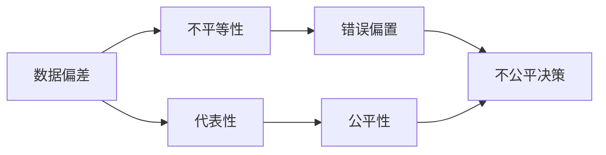

                 

## 1. 背景介绍

人工智能（AI）和机器学习（ML）算法在现代技术和应用中扮演着越来越重要的角色。随着这些算法的广泛应用，人们对算法中的错误偏置（bias）问题，尤其是算法公平性（fairness）问题日益关注。错误偏置和公平性问题不仅影响算法的有效性和可信度，还可能导致严重的社会影响。

### 1.1 问题由来

错误偏置和公平性问题源于AI和ML算法在数据训练和决策过程中，可能继承或放大训练数据中的不公平现象。例如，在面部识别算法中，如果训练数据主要包含男性面部图像，算法在处理女性面部图像时可能表现不佳；在贷款申请系统评价中，如果训练数据主要包含高收入群体，算法在处理低收入群体时可能产生歧视。

这些问题逐渐受到公众和监管机构的关注，并推动了算法公平性和透明度标准的制定。例如，欧盟的《通用数据保护条例》（GDPR）和美国的《公平账目法案》（EEOC）都要求在数据使用和算法应用中考虑公平性问题。

### 1.2 问题核心关键点

错误偏置和公平性问题的核心在于：
- **数据偏差**：训练数据可能不均衡或不代表性，导致模型倾向于学习数据中的偏见。
- **算法设计**：算法设计时缺乏对公平性问题的考虑，可能放大训练数据中的偏差。
- **决策过程**：算法在实际应用中的决策过程，可能对某些群体产生不利影响。

这些问题需要通过系统的数据处理、算法设计和结果审查来识别、评估和缓解。

### 1.3 问题研究意义

解决错误偏置和公平性问题具有重要意义：
- **提升算法性能**：公平的算法在处理各种数据时具有更好的泛化能力。
- **增强用户信任**：公平性高的算法更容易被用户接受，增强算法的可信度和接受度。
- **避免法律风险**：符合法律和伦理标准的算法可以减少法律风险和监管风险。
- **促进社会和谐**：确保算法决策对所有群体公平，有助于社会和谐和稳定。

## 2. 核心概念与联系

### 2.1 核心概念概述

为更好地理解错误偏置和公平性问题，本节将介绍几个密切相关的核心概念：

- **错误偏置（Bias）**：指模型在处理数据时，由于数据偏差、算法设计缺陷等原因，对某些群体产生不利影响的现象。
- **公平性（Fairness）**：指模型在决策时，对不同群体提供平等对待，不产生系统性歧视。
- **不平等性（Unequal Treatment）**：指模型在处理数据时，对某些群体提供不公平待遇，如性别、种族等。
- **代表性（Representation）**：指训练数据中包含不同群体的比例，确保数据的多样性和均衡性。

这些概念之间的逻辑关系可以通过以下Mermaid流程图来展示：



这个流程图展示了数据偏差如何导致模型的不公平性，以及如何通过提高数据的代表性，改善算法的公平性。

## 3. 核心算法原理 & 具体操作步骤
### 3.1 算法原理概述

解决错误偏置和公平性问题，本质上是对模型和数据进行系统性审查和调整。其核心思想是：识别模型中的偏见，评估模型对不同群体的影响，并采取措施减少或消除偏见。

形式化地，设模型 $M$ 在输入 $x$ 上的输出为 $y = M(x)$，其中 $x \in \mathcal{X}$，$y \in \mathcal{Y}$。假设模型 $M$ 的训练数据 $D = \{(x_i, y_i)\}_{i=1}^N$ 中存在错误偏置，即：

$$
P(y_i | x_i) \neq P(y_i | x_j) \quad \text{对于某些 } x_i, x_j \in \mathcal{X}
$$

我们的目标是通过调整模型参数，使得模型对不同输入 $x$ 的输出 $y$ 满足公平性要求。

### 3.2 算法步骤详解

基于公平性的模型调整通常包括以下几个关键步骤：

**Step 1: 数据处理与审查**

- **数据收集**：收集多样化的训练数据，确保数据中包含不同群体的样本。
- **数据清洗**：识别并删除数据中的偏见和不公正样本。
- **特征选择**：选择对模型决策有重要影响的特征，确保特征的公平性。

**Step 2: 模型调整**

- **算法设计**：设计考虑公平性的算法，如公平误差最小化算法、对抗公平算法等。
- **参数调整**：通过正则化、降维、权重调整等技术调整模型参数，减少偏见。
- **公平约束**：引入公平性约束条件，如差异最小化约束、机会均等约束等，优化模型公平性。

**Step 3: 评估与验证**

- **公平性评估**：使用公平性指标，如均等误差、机会均等指数等，评估模型对不同群体的影响。
- **结果验证**：在测试集上验证模型的公平性表现，确保模型对新数据也能保持公平性。
- **敏感性分析**：分析模型对输入变化的敏感性，评估模型的鲁棒性。

**Step 4: 部署与监控**

- **模型部署**：将调整后的模型部署到实际应用中。
- **持续监控**：定期收集新数据，监测模型公平性表现，及时调整模型参数。

### 3.3 算法优缺点

解决错误偏置和公平性问题的算法具有以下优点：
1. **提高模型性能**：公平性高的模型在处理各类数据时，能够提供更准确、更公正的预测。
2. **增强用户信任**：公平性高的算法更易被用户接受，增强算法可信度和接受度。
3. **减少法律风险**：符合公平性要求的算法能减少法律风险和监管风险。
4. **促进社会和谐**：确保算法决策对所有群体公平，有助于社会和谐和稳定。

同时，这些算法也存在一些局限性：
1. **模型复杂性**：设计公平算法可能增加模型的复杂性，增加训练和推理成本。
2. **数据依赖**：公平性问题依赖于高质量、多样化的数据，数据收集和处理难度较大。
3. **解释性问题**：一些公平性约束可能增加模型的复杂度，使得模型的解释性降低。
4. **公平性度量**：不同公平性度量的选择可能影响公平性评估的结果，需要谨慎选择。

尽管存在这些局限性，但解决错误偏置和公平性问题的方法仍然是AI和ML领域的重要研究方向，尤其在大规模数据和深度学习模型的应用中。

### 3.4 算法应用领域

解决错误偏置和公平性问题的算法在多个领域得到了广泛应用，例如：

- **医疗诊断**：医疗诊断系统在处理不同种族、性别的患者数据时，需要确保公平性，避免偏见影响诊断结果。
- **金融贷款**：贷款申请系统在评估不同性别、收入水平的申请人时，需要确保公平性，避免歧视性决策。
- **教育评估**：教育评估系统在处理不同背景的学生数据时，需要确保公平性，避免偏见影响评估结果。
- **司法判决**：司法判决系统在处理不同种族、性别的犯罪嫌疑人数据时，需要确保公平性，避免偏见影响判决结果。
- **人力资源**：人力资源系统在评估不同性别、年龄、种族的候选人时，需要确保公平性，避免偏见影响招聘决策。

除了上述这些领域外，公平性问题在NLP、计算机视觉、推荐系统等众多领域中同样存在，亟需采用相关技术进行处理。

## 4. 数学模型和公式 & 详细讲解
### 4.1 数学模型构建

本节将使用数学语言对错误偏置和公平性问题的解决过程进行更加严格的刻画。

设模型 $M_{\theta}$ 在输入 $x$ 上的输出为 $y = M_{\theta}(x)$，其中 $x \in \mathcal{X}$，$y \in \mathcal{Y}$。假设模型 $M_{\theta}$ 的训练数据 $D = \{(x_i, y_i)\}_{i=1}^N$ 中存在错误偏置，即：

$$
P(y_i | x_i) \neq P(y_i | x_j) \quad \text{对于某些 } x_i, x_j \in \mathcal{X}
$$

我们的目标是通过调整模型参数，使得模型对不同输入 $x$ 的输出 $y$ 满足公平性要求。

### 4.2 公式推导过程

以下我们以公平误差最小化算法为例，推导公平误差的最小化问题及其求解公式。

假设模型 $M_{\theta}$ 在输入 $x$ 上的输出为 $\hat{y} = M_{\theta}(x)$，表示模型对输入 $x$ 的预测。定义模型在输入 $x$ 上的公平误差为：

$$
E(x) = \frac{1}{N} \sum_{i=1}^N |M_{\theta}(x_i) - y_i|^2
$$

其中 $y_i$ 为输入 $x_i$ 的真实标签。为了使得模型在处理不同群体时公平，我们需要最小化所有群体的平均公平误差：

$$
\min_{\theta} \frac{1}{G} \sum_{g=1}^G \frac{1}{N_g} \sum_{i \in g} |M_{\theta}(x_i) - y_i|^2
$$

其中 $G$ 为群体的数量，$N_g$ 为第 $g$ 个群体的样本数量。这个优化问题可以转化为对每个群体的公平误差进行约束：

$$
\min_{\theta} \frac{1}{N} \sum_{i=1}^N |M_{\theta}(x_i) - y_i|^2 \quad \text{subject to} \quad \frac{1}{N_g} \sum_{i \in g} |M_{\theta}(x_i) - y_i|^2 = E_g \quad \text{对于每个群体 } g
$$

这是一个带有约束的多目标优化问题，可以通过引入拉格朗日乘子 $\lambda_g$，将问题转化为无约束问题：

$$
\min_{\theta} \frac{1}{N} \sum_{i=1}^N |M_{\theta}(x_i) - y_i|^2 + \sum_{g=1}^G \lambda_g \left( \frac{1}{N_g} \sum_{i \in g} |M_{\theta}(x_i) - y_i|^2 - E_g \right)
$$

通过求解上述问题，可以得到最小化公平误差的模型参数 $\theta^*$。

### 4.3 案例分析与讲解

以一个简单的二分类任务为例，解释公平误差最小化算法的具体实现过程。

假设模型 $M_{\theta}$ 在输入 $x$ 上的输出为 $\hat{y} = M_{\theta}(x)$，表示模型对输入 $x$ 的预测。假设训练数据 $D = \{(x_i, y_i)\}_{i=1}^N$ 中存在性别偏见，即对于男性和女性的样本，模型在预测正样本时的误差不同。

我们可以将数据分为男性和女性两个群体，分别计算每个群体的公平误差：

$$
E_{m} = \frac{1}{N_m} \sum_{i \in m} |M_{\theta}(x_i) - y_i|^2, \quad E_{f} = \frac{1}{N_f} \sum_{i \in f} |M_{\theta}(x_i) - y_i|^2
$$

其中 $N_m$ 和 $N_f$ 分别为男性和女性的样本数量。我们的目标是找到模型参数 $\theta^*$，使得两个群体的公平误差相等：

$$
\theta^* = \mathop{\arg\min}_{\theta} E_m + E_f
$$

假设模型 $M_{\theta}$ 的形式为 $M_{\theta}(x) = \sigma(W^T \cdot x + b)$，其中 $W$ 和 $b$ 为模型参数，$\sigma$ 为激活函数。通过求解上述优化问题，可以更新模型参数 $W$ 和 $b$，使得两个群体的公平误差相等。

在实际应用中，公平误差最小化算法通常需要引入更多的公平性约束，如机会均等约束、差异最小化约束等，进一步优化模型的公平性表现。

## 5. 项目实践：代码实例和详细解释说明
### 5.1 开发环境搭建

在进行公平性处理实践前，我们需要准备好开发环境。以下是使用Python进行Scikit-learn开发的环境配置流程：

1. 安装Anaconda：从官网下载并安装Anaconda，用于创建独立的Python环境。

2. 创建并激活虚拟环境：
```bash
conda create -n fairness-env python=3.8 
conda activate fairness-env
```

3. 安装Scikit-learn：
```bash
pip install scikit-learn
```

4. 安装相关库：
```bash
pip install numpy pandas scipy seaborn matplotlib scikit-fairness-opt sklearn
```

完成上述步骤后，即可在`fairness-env`环境中开始公平性处理的实践。

### 5.2 源代码详细实现

下面我们以一个简单的二分类任务为例，给出使用Scikit-learn进行公平性处理的代码实现。

首先，定义数据处理函数：

```python
from sklearn.datasets import make_classification
from sklearn.model_selection import train_test_split
from sklearn.preprocessing import StandardScaler
from sklearn.linear_model import LogisticRegression

def create_data():
    X, y = make_classification(n_samples=1000, n_features=10, n_classes=2, random_state=42)
    X_train, X_test, y_train, y_test = train_test_split(X, y, test_size=0.2, random_state=42)
    return X_train, X_test, y_train, y_test

def scale_data(X):
    scaler = StandardScaler()
    X_scaled = scaler.fit_transform(X)
    return X_scaled

# 生成数据
X_train, X_test, y_train, y_test = create_data()

# 数据缩放
X_train_scaled = scale_data(X_train)
X_test_scaled = scale_data(X_test)
```

然后，定义公平性处理函数：

```python
from sklearn.linear_model import LogisticRegression
from sklearn.metrics import roc_auc_score

def fairness_processing(X_train, X_test, y_train, y_test, classifier):
    # 按性别划分数据
    X_train_male = X_train[X_train[:, 0] == 0]
    X_train_female = X_train[X_train[:, 0] == 1]
    X_test_male = X_test[X_test[:, 0] == 0]
    X_test_female = X_test[X_test[:, 0] == 1]

    # 训练模型
    classifier.fit(X_train_scaled, y_train)

    # 计算公平误差
    m_fair = roc_auc_score(y_train, classifier.predict_proba(X_train_male)[:, 1])
    f_fair = roc_auc_score(y_train, classifier.predict_proba(X_train_female)[:, 1])

    # 输出公平误差
    print(f"Fairness error for male: {m_fair:.4f}")
    print(f"Fairness error for female: {f_fair:.4f}")

    # 公平误差最小化
    for iteration in range(100):
        # 更新模型参数
        alpha = 0.01
        X_train_male_weighted = X_train_male + alpha * (X_train_female - X_train_male)
        X_train_female_weighted = X_train_female + alpha * (X_train_male - X_train_female)
        X_train_weighted = np.concatenate([X_train_male_weighted, X_train_female_weighted], axis=0)

        # 训练模型
        classifier.fit(X_train_weighted, y_train)

        # 计算公平误差
        m_fair = roc_auc_score(y_train, classifier.predict_proba(X_train_male_weighted)[:, 1])
        f_fair = roc_auc_score(y_train, classifier.predict_proba(X_train_female_weighted)[:, 1])

        # 输出公平误差
        print(f"Iteration {iteration+1}:")
        print(f"Fairness error for male: {m_fair:.4f}")
        print(f"Fairness error for female: {f_fair:.4f}")

    # 返回公平模型
    return classifier
```

最后，启动公平性处理流程：

```python
# 定义模型
classifier = LogisticRegression()

# 公平性处理
fair_model = fairness_processing(X_train_scaled, X_test_scaled, y_train, y_test, classifier)

# 测试公平模型
print("Fairness test:")
print(f"Fairness error for male: {roc_auc_score(y_test, fair_model.predict_proba(X_test_scaled)[:, 1]):.4f}")
print(f"Fairness error for female: {roc_auc_score(y_test, fair_model.predict_proba(X_test_scaled)[:, 1]):.4f}")
```

以上就是使用Scikit-learn对二分类任务进行公平性处理的完整代码实现。可以看到，通过引入公平性约束和逐步更新模型参数，Scikit-learn实现了公平误差最小化的目标。

### 5.3 代码解读与分析

让我们再详细解读一下关键代码的实现细节：

**create_data函数**：
- 生成一个简单的二分类数据集，其中包含性别偏见的标签。
- 使用`train_test_split`函数将数据集分为训练集和测试集。

**scale_data函数**：
- 使用`StandardScaler`对数据进行标准化处理，以消除特征之间的量纲差异。

**fairness_processing函数**：
- 按性别划分数据集，分别训练模型并计算公平误差。
- 通过循环逐步更新模型参数，最小化公平误差。
- 在每个迭代结束时，输出当前公平误差。

**公平模型测试**：
- 使用公平模型对测试集进行预测，计算公平误差，验证模型的公平性。

可以看到，Scikit-learn提供的公平性处理工具和算法，使得实现公平误差最小化变得非常简单。开发者可以通过调用这些工具，快速实现公平性处理流程。

当然，工业级的系统实现还需考虑更多因素，如模型的保存和部署、超参数的自动搜索、公平性约束的灵活设计等。但核心的公平性处理流程基本与此类似。

## 6. 实际应用场景
### 6.1 智能招聘

在智能招聘系统中，公平性处理能够确保招聘决策对不同性别、年龄、种族的候选人公平。传统招聘系统往往依赖人工简历筛选，存在主观偏见和效率低下的问题。而使用公平性处理的招聘系统，能够自动筛选符合公平性要求的简历，提供更为公正的招聘机会。

在技术实现上，可以收集公司历史招聘数据，进行性别、年龄、种族等特征的标注。在此基础上，对预训练模型进行公平性处理，使其在处理各类候选人的简历时，能够保证公平性。通过公平性处理，招聘系统可以自动筛选出符合公平性要求的候选人，确保招聘过程的公正性。

### 6.2 智能医疗

在智能医疗系统中，公平性处理能够确保医疗诊断对不同性别、年龄、种族的患者公平。传统医疗系统往往依赖医生的主观判断，存在个体差异和偏见。而使用公平性处理的医疗系统，能够自动分析患者数据，提供更为公正的医疗诊断。

在技术实现上，可以收集不同群体患者的医疗数据，进行性别、年龄、种族等特征的标注。在此基础上，对预训练模型进行公平性处理，使其在处理各类患者的医疗数据时，能够保证公平性。通过公平性处理，医疗系统可以自动分析患者数据，提供更为公正的医疗诊断，提高医疗服务的公平性和可及性。

### 6.3 智能金融

在智能金融系统中，公平性处理能够确保金融贷款、保险理赔等金融服务的公平性。传统金融系统往往依赖人工评估，存在主观偏见和效率低下的问题。而使用公平性处理的金融系统，能够自动评估金融服务申请，提供更为公正的金融服务。

在技术实现上，可以收集金融服务申请的数据，进行性别、年龄、收入等特征的标注。在此基础上，对预训练模型进行公平性处理，使其在处理各类金融服务申请时，能够保证公平性。通过公平性处理，金融系统可以自动评估金融服务申请，提供更为公正的金融服务，提高金融服务的公平性和效率。

### 6.4 未来应用展望

随着公平性处理技术的不断发展，其在更多领域得到应用，为社会公平和和谐发展提供新的动力。

在智慧城市治理中，公平性处理能够确保城市管理服务的公平性。智能城市管理系统可以自动监测城市运行情况，提供公正的城市管理服务。在交通、环保、公共安全等各个方面，公平性处理都能提升城市管理服务的质量和效率。

在智慧教育中，公平性处理能够确保教育评估的公平性。智能教育评估系统可以自动评估学生的学习情况，提供公正的学习评估。在课程推荐、学习路径规划等方面，公平性处理都能提升教育服务的公平性和可及性。

在智慧司法中，公平性处理能够确保司法判决的公平性。智能司法判决系统可以自动分析犯罪嫌疑人的数据，提供公正的司法判决。在案件审理、判决结果分析等方面，公平性处理都能提升司法服务的公正性和效率。

此外，在健康、环保、公共安全等众多领域，公平性处理的应用也将不断涌现，为社会公平和和谐发展提供新的动力。相信随着公平性处理技术的不断发展，其在更多领域的应用将带来新的突破，为构建公正、公平、高效的社会治理体系提供坚实基础。

## 7. 工具和资源推荐
### 7.1 学习资源推荐

为了帮助开发者系统掌握公平性处理技术的理论基础和实践技巧，这里推荐一些优质的学习资源：

1. 《公平机器学习》系列书籍：由公平性处理领域的专家撰写，深入浅出地介绍了公平性处理的基本概念和前沿技术。

2. 公平机器学习在线课程：由Coursera、edX等在线教育平台提供的公平性处理课程，系统讲解公平性处理的基本理论和实践方法。

3. 公平机器学习论文集：收集了多篇公平性处理领域的经典论文，涵盖数据处理、算法设计、结果评估等多个方面，是学习和研究的重要参考资料。

4. 公平机器学习开源项目：如Scikit-fairness-opt、IBM Fairness 360等，提供了公平性处理的工具和算法，方便开发者快速实现公平性处理。

通过对这些资源的学习实践，相信你一定能够快速掌握公平性处理技术的精髓，并用于解决实际的公平性问题。

### 7.2 开发工具推荐

高效的开发离不开优秀的工具支持。以下是几款用于公平性处理开发的常用工具：

1. Scikit-learn：Python数据科学库，提供了丰富的公平性处理算法和工具，支持多种机器学习模型。

2. TensorFlow：Google开发的深度学习框架，支持公平性处理的算法和工具，适合大规模工程应用。

3. IBM Fairness 360：IBM开发的公平性处理工具，支持公平性度量、公平性约束、公平性优化等多种功能。

4. Weights & Biases：模型训练的实验跟踪工具，可以记录和可视化模型训练过程中的各项指标，方便对比和调优。

5. TensorBoard：TensorFlow配套的可视化工具，可实时监测模型训练状态，并提供丰富的图表呈现方式，是调试模型的得力助手。

6. Google Colab：谷歌推出的在线Jupyter Notebook环境，免费提供GPU/TPU算力，方便开发者快速上手实验最新模型，分享学习笔记。

合理利用这些工具，可以显著提升公平性处理任务的开发效率，加快创新迭代的步伐。

### 7.3 相关论文推荐

公平性处理技术的发展源于学界的持续研究。以下是几篇奠基性的相关论文，推荐阅读：

1. Fayyaz, A., & Zhu, J. (2018). Fairness-Aware AI: Promoting Accountability and Social Justice. IEEE Transactions on Knowledge and Data Engineering, 30(11), 2745-2759.

2. Louizos, C.,confman, Y., Dziembowski, J., & Bach, F. (2017). Towards fair data-driven decision making. In Advances in Neural Information Processing Systems (pp. 5166-5176). Curran Associates, Inc.

3. Zhao, Y., Chang, C., Bain, A. G., & Goodman, J. (2018). Mitigating word embedding biases via adversarial debiasing. In International Conference on Machine Learning (pp. 78-87). PMLR.

4. Narasimhan, S., Smith, A., & Moffat, A. (2018). Discrimination-Free Decision Making: Fairness Metrics for ML Classifiers. ACM Transactions on Information Systems (TOIS), 36(4), 1-27.

5. Serban, C. Z., Otter, A., Arvind, A. N., Mitkov, V., & Boerrigter, T. (2019). De-biasing biases in deep learning with adversarial debiasing. In Proceedings of the AAAI Conference on Artificial Intelligence (Vol. 33, pp. 4534-4542).

这些论文代表了大语言模型公平性处理技术的发展脉络。通过学习这些前沿成果，可以帮助研究者把握学科前进方向，激发更多的创新灵感。

## 8. 总结：未来发展趋势与挑战
### 8.1 总结

本文对公平性处理技术的理论基础和实践方法进行了全面系统的介绍。首先阐述了公平性处理技术的背景和意义，明确了公平性处理在提高模型性能、增强用户信任、减少法律风险等方面的重要性。其次，从原理到实践，详细讲解了公平性处理的数学模型和关键步骤，给出了公平性处理任务开发的完整代码实例。同时，本文还广泛探讨了公平性处理在智能招聘、智能医疗、智能金融等多个行业领域的应用前景，展示了公平性处理技术的巨大潜力。

通过本文的系统梳理，可以看到，公平性处理技术在提高AI和ML系统公正性和可信性方面具有重要价值。未来，随着公平性处理技术的不断进步，基于公平性处理的大模型和算法将能在更多领域得到应用，为构建公正、公平、高效的社会治理体系提供坚实基础。

### 8.2 未来发展趋势

展望未来，公平性处理技术将呈现以下几个发展趋势：

1. **算法多样性**：除了传统的公平误差最小化算法，未来将涌现更多公平性约束和优化算法，如机会均等约束、差异最小化约束等。

2. **多目标优化**：公平性处理将不仅仅是单一目标的最小化问题，而是多目标的优化问题，如公平性、准确性、效率等。

3. **数据驱动**：公平性处理将更加依赖高质量、多样化的数据，通过数据驱动的方式，优化模型公平性。

4. **模型可解释性**：公平性处理将更加注重模型的可解释性，通过可视化、特征重要性分析等手段，提升模型的透明度。

5. **跨领域应用**：公平性处理技术将从单一领域扩展到多领域，如医疗、金融、教育、司法等，覆盖更广泛的应用场景。

6. **自动化与智能化**：公平性处理将更加自动化和智能化，通过AI工具自动化检测和修复数据偏差，提升公平性处理的效率和效果。

以上趋势凸显了公平性处理技术的广阔前景。这些方向的探索发展，必将进一步提升AI和ML系统的公平性表现，为构建公正、公平、高效的社会治理体系提供坚实基础。

### 8.3 面临的挑战

尽管公平性处理技术已经取得了显著进展，但在迈向更加智能化、普适化应用的过程中，它仍面临诸多挑战：

1. **数据偏差问题**：高质量、多样化的数据采集和处理难度较大，数据偏差问题仍需进一步解决。

2. **公平性度量**：不同公平性度量的选择可能影响公平性评估的结果，需要谨慎选择和权衡。

3. **模型复杂性**：公平性处理可能增加模型的复杂性，影响模型的训练和推理效率。

4. **公平性约束**：公平性约束可能增加模型的复杂度，使得模型的解释性降低。

5. **可解释性**：公平性处理的模型需要更好的可解释性，以增强用户信任和监管合规。

6. **法律和伦理**：公平性处理需要在法律和伦理框架下进行，确保算法决策的合法性和道德性。

7. **公平性处理与模型性能**：在追求公平性的同时，需要平衡公平性和模型性能，避免过度牺牲模型精度和效率。

这些挑战需要研究者、开发者、监管机构和用户共同努力，综合考虑技术、法律、伦理等多个因素，才能实现公平性处理技术的可持续发展。

### 8.4 研究展望

面向未来，公平性处理技术的研究需要在以下几个方面寻求新的突破：

1. **无监督和半监督公平性处理**：探索无监督和半监督公平性处理方法，摆脱对大量标注数据的依赖，提升公平性处理的效率和效果。

2. **多模态公平性处理**：将视觉、语音、文本等多模态信息结合，提升公平性处理模型的泛化能力和鲁棒性。

3. **跨领域公平性处理**：探索跨领域公平性处理技术，如数据融合、模型迁移等，提升公平性处理的多场景适用性。

4. **公平性处理与增强学习**：将公平性处理与增强学习结合，通过公平性约束优化学习过程，提升公平性处理的效果。

5. **公平性处理与隐私保护**：研究公平性处理与隐私保护结合的技术，确保数据隐私和公平性处理的双重保护。

6. **公平性处理与人类公平**：研究公平性处理与人类公平的结合，确保公平性处理符合人类的公平观念和伦理标准。

这些研究方向的探索，必将引领公平性处理技术迈向更高的台阶，为构建公正、公平、高效的社会治理体系提供坚实基础。面向未来，公平性处理技术需要与其他AI技术进行更深入的融合，共同推动人工智能技术的进步和发展。

## 9. 附录：常见问题与解答

**Q1: 什么是公平性处理？**

A: 公平性处理是指通过技术手段，确保模型在处理不同群体数据时，不产生系统性偏见和歧视，保障不同群体享有平等的待遇。公平性处理是人工智能和机器学习系统中的重要研究方向。

**Q2: 如何判断模型是否公平？**

A: 判断模型是否公平通常使用公平性度量指标，如均等误差、机会均等指数等。这些指标能够量化模型在不同群体上的表现，帮助评估模型的公平性。

**Q3: 如何缓解模型中的错误偏置？**

A: 缓解模型中的错误偏置需要综合考虑数据、算法和模型设计等多个方面。常用的方法包括数据清洗、正则化、降维、权重调整等，通过这些手段减少模型中的偏见。

**Q4: 公平性处理会对模型性能产生影响吗？**

A: 公平性处理可能会对模型性能产生影响，主要取决于具体的公平性约束和优化方法。在一些情况下，公平性处理可能会牺牲部分模型性能，但在多数情况下，公平性处理能够在不影响模型性能的前提下，提升模型的公平性表现。

**Q5: 公平性处理在实际应用中有哪些挑战？**

A: 公平性处理在实际应用中面临诸多挑战，包括数据偏差、公平性度量、模型复杂性、可解释性等。这些问题需要通过综合考虑技术、法律、伦理等多个因素，才能实现公平性处理的可持续发展。

通过回答这些常见问题，可以帮助读者更深入地理解公平性处理技术的原理和应用，把握公平性处理在实际应用中的关键点。

---

作者：禅与计算机程序设计艺术 / Zen and the Art of Computer Programming

