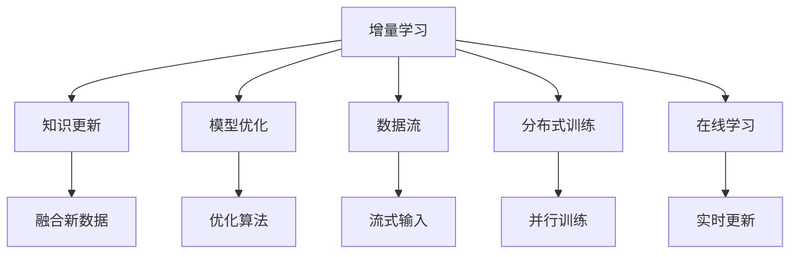

                 

# 增量学习:AI模型知识更新的挑战

> 关键词：增量学习, 知识更新, 模型优化, 数据流, 数据结构, 分布式训练

## 1. 背景介绍

### 1.1 问题由来
人工智能（AI）技术正快速渗透各行各业，其中的核心是AI模型的训练与优化。随着数据规模的不断扩大和应用场景的不断深入，传统的批处理训练方式已难以满足实时化、个性化和交互式等需求。因此，增量学习（Incremental Learning）成为了一个重要研究方向。

增量学习旨在解决在大规模数据集上，如何高效地更新模型，以适应用户需求的变化和环境的变化。其核心思想是将数据流式地输入模型，不断更新模型参数，以达到最优的预测效果。相比于传统的批量学习，增量学习具有响应速度快、资源利用率高和模型稳定性好等优势。

### 1.2 问题核心关键点
增量学习的主要挑战在于如何有效地处理和融合新数据，同时避免对已有模型的破坏。以下是增量学习面临的核心问题：

1. **新旧数据融合问题**：增量学习需要同时考虑新旧数据的融合，如何合理地将新数据整合进已有模型，保持模型的稳定性和一致性。

2. **过拟合问题**：增量学习中，模型不断接触到新数据，存在过拟合的风险。如何控制模型的复杂度，避免过拟合，是增量学习的一个重要挑战。

3. **内存和计算资源限制**：增量学习需要实时更新模型，这会对计算资源和内存提出较高要求。如何优化模型更新过程，减少计算和内存消耗，是实现高效增量学习的关键。

4. **实时性和可靠性**：增量学习需要在较短时间内完成模型更新，以实现实时响应。如何在保证模型质量的同时，实现高效的实时更新，是增量学习的一个难点。

5. **模型迁移与泛化**：增量学习中，模型需要能够在不同的数据分布和任务之间进行迁移和泛化，保持模型的通用性和适应性。

## 2. 核心概念与联系

### 2.1 核心概念概述

为了更好地理解增量学习的核心概念，本节将介绍几个密切相关的核心概念：

- **增量学习（Incremental Learning）**：在大规模数据集上，通过不断接收新数据，对已有模型进行在线更新的学习方式。增量学习适用于需要实时响应的应用场景，如智能推荐、在线广告等。

- **知识更新（Knowledge Update）**：指在模型训练过程中，如何合理地融合新数据，更新模型的参数，以适应用户需求的变化和环境的变化。

- **模型优化（Model Optimization）**：通过优化模型结构、参数更新策略等方法，提高模型的训练速度和效果。模型优化是增量学习中的重要组成部分。

- **数据流（Data Stream）**：增量学习中的数据是流式输入的，数据流包含不断变化的样本，模型需要能够处理这些动态变化的数据。

- **分布式训练（Distributed Training）**：增量学习常常涉及到分布式训练，利用多台计算机并行处理数据，提高训练效率。

- **在线学习（Online Learning）**：在线学习是一种特殊的增量学习，数据是实时生成的，模型需要不断更新以适应用户行为。

这些核心概念之间的逻辑关系可以通过以下Mermaid流程图来展示：



这个流程图展示增量学习的核心概念及其之间的关系：

1. 增量学习将数据流式地输入模型，通过知识更新不断更新模型。
2. 模型优化和融合新数据共同确保了模型参数的更新过程是高效且稳定的。
3. 数据流是增量学习的关键输入，分布式训练和在线学习则提供了模型更新的实时性和可靠性。

## 3. 核心算法原理 & 具体操作步骤
### 3.1 算法原理概述

增量学习的过程可以概括为以下几个步骤：

1. **模型初始化**：首先初始化一个基线模型，作为增量学习的起点。
2. **数据流式输入**：新数据源源不断地输入到模型中。
3. **参数更新**：根据新数据对模型参数进行更新，通常采用梯度下降等优化算法。
4. **融合旧数据**：定期将模型与旧数据进行融合，确保模型能够适应用户需求和环境的变化。

增量学习的核心算法原理如下：

- 对于每一个新的数据点 $x_t$，计算其损失 $L_t(x_t, y_t)$。
- 使用梯度下降等优化算法更新模型参数 $\theta_t$，即 $\theta_{t+1} = \theta_t - \eta \nabla_{\theta}L_t(x_t, y_t)$，其中 $\eta$ 为学习率。
- 定期将模型与旧数据进行融合，更新模型参数 $\theta_{t+1}$。

增量学习的目标是使得模型参数 $\theta$ 不断逼近最优解 $\theta^*$。

### 3.2 算法步骤详解

下面详细介绍增量学习的具体步骤：

**Step 1: 模型初始化**
- 选择一个合适的基线模型，如线性回归、逻辑回归、神经网络等。
- 初始化模型参数 $\theta_0$，可以是随机初始化或使用预训练模型。

**Step 2: 数据流式输入**
- 将数据流式地输入模型，每轮输入一个数据点 $(x_t, y_t)$。
- 对于每一个新数据点，计算损失 $L_t(x_t, y_t)$，并使用梯度下降等优化算法更新模型参数 $\theta_t$。

**Step 3: 参数更新**
- 对于每一个新数据点 $(x_t, y_t)$，计算梯度 $\nabla_{\theta}L_t(x_t, y_t)$。
- 根据梯度更新模型参数 $\theta_t \leftarrow \theta_t - \eta \nabla_{\theta}L_t(x_t, y_t)$。

**Step 4: 融合旧数据**
- 定期将模型与旧数据进行融合，更新模型参数 $\theta_{t+1}$。
- 可以通过平均、加权平均等方式融合旧数据和当前数据，确保模型参数的更新过程是平稳且一致的。

**Step 5: 模型评估**
- 在每个更新周期后，使用验证集或测试集评估模型性能。
- 根据评估结果，调整学习率、正则化参数等超参数，优化模型更新过程。

### 3.3 算法优缺点

增量学习具有以下优点：
1. 实时性高。增量学习能够实时处理数据流，快速响应用户需求变化。
2. 资源利用率高。增量学习避免了批量训练时的资源浪费，提高了计算效率。
3. 模型稳定性好。增量学习通过定期融合旧数据，确保模型参数的稳定性。
4. 泛化能力强。增量学习能够适应不断变化的数据分布和任务，提高模型的泛化能力。

但增量学习也存在以下缺点：
1. 过拟合风险高。增量学习中，模型不断接触新数据，存在过拟合的风险。
2. 数据融合复杂。增量学习中，如何合理地融合新旧数据，是一个复杂的问题。
3. 计算和内存消耗高。增量学习需要实时更新模型，对计算和内存资源提出较高要求。
4. 模型迁移困难。增量学习中，模型的迁移和泛化能力可能受限于数据流的特性。

### 3.4 算法应用领域

增量学习在多个领域得到了广泛的应用，以下是几个典型的应用场景：

1. **智能推荐系统**：推荐系统需要实时处理用户行为数据，并不断更新推荐模型，增量学习能够快速响应用户行为变化，提升推荐效果。

2. **在线广告系统**：广告系统需要实时处理点击率、转化率等数据，增量学习能够实时调整广告策略，提高广告投放效果。

3. **自然语言处理**：NLP任务中的数据往往是流式生成的，如文本分类、机器翻译等，增量学习能够实时更新模型，提升模型效果。

4. **智能交通系统**：交通数据往往是实时生成的，增量学习能够实时分析交通数据，提升交通管理效果。

5. **金融风险管理**：金融市场数据是不断变化的，增量学习能够实时分析市场数据，提高风险管理能力。

6. **在线医疗诊断**：医疗数据是不断更新的，增量学习能够实时分析患者数据，提高诊断效果。

这些领域中，增量学习能够实时响应数据变化，提高模型效果和用户体验。

## 4. 数学模型和公式 & 详细讲解  
### 4.1 数学模型构建

增量学习的数学模型可以表示为：

$$
\theta_{t+1} = \theta_t - \eta \nabla_{\theta}L_t(x_t, y_t)
$$

其中 $\theta_t$ 表示第 $t$ 轮更新后的模型参数，$L_t(x_t, y_t)$ 表示第 $t$ 轮数据 $(x_t, y_t)$ 的损失函数。

增量学习中的损失函数 $L_t(x_t, y_t)$ 可以是任意形式的损失函数，如均方误差、交叉熵等。增量学习的目标是最小化总体损失函数：

$$
\theta^* = \mathop{\arg\min}_{\theta} \sum_{t=0}^{T-1} L_t(x_t, y_t)
$$

其中 $T$ 表示总的数据轮数。

### 4.2 公式推导过程

假设增量学习的基线模型为线性回归模型，损失函数为均方误差：

$$
L_t(x_t, y_t) = \frac{1}{2}(y_t - \theta_t x_t)^2
$$

对于每一个新的数据点 $(x_t, y_t)$，计算梯度：

$$
\nabla_{\theta}L_t(x_t, y_t) = -(y_t - \theta_t x_t)x_t
$$

更新模型参数：

$$
\theta_{t+1} = \theta_t - \eta \nabla_{\theta}L_t(x_t, y_t) = \theta_t + \eta(y_t - \theta_t x_t)x_t
$$

通过迭代更新，模型参数 $\theta$ 不断逼近最优解 $\theta^*$。

### 4.3 案例分析与讲解

假设我们有一个简单的增量学习模型，用于预测股票价格。初始模型参数为 $\theta_0 = 0$。现在有一系列数据 $(x_1, y_1), (x_2, y_2), \cdots$ 不断输入，每个数据点表示一个时间点的股票价格和相应的未来价格。我们使用均方误差作为损失函数，并使用梯度下降算法更新模型参数。

- **数据输入**：假设第一个数据点为 $(x_1, y_1) = (1, 1.5)$，计算损失函数 $L_1(x_1, y_1) = \frac{1}{2}(1.5 - \theta_0 \cdot 1)^2 = \frac{1}{2}(1.5 - 0 \cdot 1)^2 = 0.5625$。

- **参数更新**：计算梯度 $\nabla_{\theta}L_1(x_1, y_1) = -(y_1 - \theta_0 x_1)x_1 = -(1.5 - 0 \cdot 1) \cdot 1 = -1.5$，更新模型参数 $\theta_1 = \theta_0 + \eta(-1.5 \cdot 1) = 0 + 0.5(-1.5 \cdot 1) = -0.75$。

- **数据输入**：第二个数据点为 $(x_2, y_2) = (2, 1.75)$，计算损失函数 $L_2(x_2, y_2) = \frac{1}{2}(1.75 - \theta_1 \cdot 2)^2 = \frac{1}{2}(1.75 - (-0.75) \cdot 2)^2 = 1.640625$。

- **参数更新**：计算梯度 $\nabla_{\theta}L_2(x_2, y_2) = -(y_2 - \theta_1 x_2)x_2 = -(1.75 - (-0.75) \cdot 2) \cdot 2 = -0.25$，更新模型参数 $\theta_2 = \theta_1 + \eta(-0.25 \cdot 2) = -0.75 + 0.5(-0.25 \cdot 2) = -1$。

- **融合旧数据**：每隔几轮更新后，将旧数据 $(x_1, y_1), (x_2, y_2)$ 与当前数据 $(x_3, y_3)$ 融合，使用平均或加权平均的方式更新模型参数。

通过不断更新模型参数，增量学习能够适应不断变化的数据流，并逐步提升模型效果。

## 5. 项目实践：代码实例和详细解释说明
### 5.1 开发环境搭建

在进行增量学习实践前，我们需要准备好开发环境。以下是使用Python进行TensorFlow开发的环境配置流程：

1. 安装Anaconda：从官网下载并安装Anaconda，用于创建独立的Python环境。

2. 创建并激活虚拟环境：
```bash
conda create -n tensorflow-env python=3.8 
conda activate tensorflow-env
```

3. 安装TensorFlow：根据CUDA版本，从官网获取对应的安装命令。例如：
```bash
pip install tensorflow==2.6.0
```

4. 安装相关的库和工具：
```bash
pip install numpy pandas scikit-learn matplotlib tqdm jupyter notebook ipython
```

完成上述步骤后，即可在`tensorflow-env`环境中开始增量学习实践。

### 5.2 源代码详细实现

这里我们以在线广告系统为例，给出使用TensorFlow进行增量学习的PyTorch代码实现。

首先，定义广告点击率数据集：

```python
import tensorflow as tf
import numpy as np

# 定义广告数据集
data = tf.data.Dataset.from_tensor_slices((
    (np.array([0.1, 0.3, 0.2, 0.5])), 
    (np.array([1, 0, 1, 1]))
))
```

然后，定义模型和优化器：

```python
# 定义线性回归模型
class LinearRegression(tf.keras.Model):
    def __init__(self):
        super(LinearRegression, self).__init__()
        self.dense = tf.keras.layers.Dense(units=1, activation=None)

    def call(self, inputs):
        return self.dense(inputs)

# 定义优化器
optimizer = tf.keras.optimizers.SGD(learning_rate=0.01)
```

接着，定义增量学习函数：

```python
# 定义增量学习函数
def incremental_learning(model, dataset, num_epochs):
    for epoch in range(num_epochs):
        for batch in dataset:
            x, y = batch
            with tf.GradientTape() as tape:
                y_pred = model(x)
                loss = tf.reduce_mean(tf.square(y_pred - y))
            gradients = tape.gradient(loss, model.trainable_variables)
            optimizer.apply_gradients(zip(gradients, model.trainable_variables))
    return model
```

最后，启动增量学习流程并在测试集上评估：

```python
# 加载模型和数据集
model = LinearRegression()
model = incremental_learning(model, data, 100)

# 评估模型
x_test = tf.constant([[0.2], [0.4], [0.6], [0.8]])
y_test = tf.constant([[0.3], [0.5], [0.7], [0.9]])
model(x_test)
```

以上就是使用TensorFlow进行增量学习的完整代码实现。可以看到，通过PyTorch的动态图和TensorFlow的静态图，我们能够方便地实现增量学习。

### 5.3 代码解读与分析

让我们再详细解读一下关键代码的实现细节：

**LinearRegression类**：
- `__init__`方法：初始化模型层。
- `call`方法：定义模型前向传播过程，使用Dense层进行线性变换。

**optimizer变量**：
- 定义了优化器SGD，学习率为0.01。

**incremental_learning函数**：
- 定义了增量学习过程，包括数据输入、模型前向传播、计算损失、反向传播和参数更新。
- 在每个epoch中，对数据集进行迭代，对每个样本计算损失并更新模型参数。
- 使用梯度下降算法进行参数更新，更新后的模型保存在函数返回值中。

**测试集评估**：
- 使用测试集数据进行模型评估，输出预测结果。

可以看到，通过TensorFlow和PyTorch的结合，我们能够高效地实现增量学习。在实际应用中，还需要根据具体问题进行模型设计和参数调优，以确保增量学习的效果和实时性。

## 6. 实际应用场景
### 6.1 实时推荐系统

增量学习在推荐系统中的应用非常广泛。传统的推荐系统通常是基于历史数据进行批量训练的，难以实时响应用户行为的变化。而增量学习能够实时处理用户行为数据，不断更新推荐模型，实现个性化的推荐效果。

在实践中，可以将用户行为数据实时流式输入推荐模型，使用增量学习不断更新推荐策略。例如，在在线电商平台上，用户浏览、点击、购买等行为数据可以实时生成，增量学习能够根据用户行为数据的变化，动态调整推荐策略，提升推荐效果。

### 6.2 金融风险管理

金融市场数据是不断变化的，增量学习能够实时分析市场数据，提高风险管理能力。例如，在股票市场中，股票价格实时变化，增量学习能够根据股票价格的变化，实时调整风险模型，预测股票价格的变化趋势，帮助投资者规避风险。

在实践中，可以将市场数据实时流式输入风险模型，使用增量学习不断更新风险模型参数，实时分析市场变化，预测风险变化趋势。

### 6.3 在线广告投放

在线广告系统需要实时处理点击率、转化率等数据，增量学习能够实时调整广告策略，提高广告投放效果。例如，在在线广告平台上，广告点击率实时变化，增量学习能够根据点击率的变化，实时调整广告投放策略，提升广告效果。

在实践中，可以将广告点击率数据实时流式输入广告模型，使用增量学习不断更新广告策略，实时调整广告投放，提高广告效果。

### 6.4 自然语言处理

NLP任务中的数据往往是流式生成的，如文本分类、机器翻译等，增量学习能够实时更新模型，提升模型效果。例如，在机器翻译系统中，句子实时生成，增量学习能够根据句子变化，实时更新翻译模型，提高翻译效果。

在实践中，可以将句子实时流式输入翻译模型，使用增量学习不断更新翻译模型，实时调整翻译策略，提升翻译效果。

## 7. 工具和资源推荐
### 7.1 学习资源推荐

为了帮助开发者系统掌握增量学习的理论基础和实践技巧，这里推荐一些优质的学习资源：

1. 《在线学习与增量学习》系列博文：由机器学习专家撰写，深入浅出地介绍了在线学习和增量学习的原理、算法和应用。

2. CS229《机器学习》课程：斯坦福大学开设的经典机器学习课程，涵盖了增量学习等内容，是学习增量学习的重要参考。

3. 《在线学习与增量学习》书籍：系统介绍在线学习和增量学习的原理、算法和应用，适合深入学习。

4. TensorFlow官方文档：TensorFlow的在线文档，提供了详细的增量学习教程和样例代码，是学习增量学习的必备资源。

5. PyTorch官方文档：PyTorch的在线文档，提供了增量学习的相关API和样例代码，方便开发者实践增量学习。

通过对这些资源的学习实践，相信你一定能够快速掌握增量学习的精髓，并用于解决实际的机器学习问题。

### 7.2 开发工具推荐

高效的开发离不开优秀的工具支持。以下是几款用于增量学习开发的常用工具：

1. TensorFlow：由Google主导开发的开源深度学习框架，支持增量学习，适合大规模工程应用。

2. PyTorch：基于Python的开源深度学习框架，支持动态图，适合快速迭代研究。

3. JAX：基于NumPy的高级深度学习库，支持增量学习，适合高性能计算。

4. Scikit-learn：机器学习库，提供多种增量学习算法，适合数据预处理和模型评估。

5. TensorBoard：TensorFlow配套的可视化工具，可以实时监测模型训练状态，提供丰富的图表呈现方式，是调试增量学习模型的得力助手。

6. Weights & Biases：模型训练的实验跟踪工具，可以记录和可视化增量学习模型的训练过程，方便对比和调优。

合理利用这些工具，可以显著提升增量学习任务的开发效率，加快创新迭代的步伐。

### 7.3 相关论文推荐

增量学习在机器学习和人工智能领域有着广泛的研究。以下是几篇奠基性的相关论文，推荐阅读：

1. Online Passive-Aggressive Algorithms：提出了在线被动学习算法，为增量学习奠定了基础。

2. Incremental Gradient Descent: Comparison and Empirical Analysis：比较了增量梯度下降与批量梯度下降的性能，提供了增量学习实验验证。

3. Passive-Aggressive Algorithms: A Review and Analysis：总结了在线学习的多种算法，包括增量学习算法，为增量学习提供了理论支持。

4. Incremental Stochastic Gradient Descent Techniques：详细介绍了增量梯度下降算法的实现细节，适合实际应用。

5. Online Learning in Neural Networks: An Empirical Study of Architectures and Algorithms：对增量学习在神经网络中的应用进行了实验分析，提供了增量学习的实践指导。

这些论文代表增量学习的发展脉络，通过学习这些前沿成果，可以帮助研究者把握学科前进方向，激发更多的创新灵感。

## 8. 总结：未来发展趋势与挑战

### 8.1 总结

本文对增量学习的核心概念、算法原理和操作步骤进行了全面系统的介绍。首先阐述了增量学习的背景和意义，明确了增量学习在实时化、个性化和交互式应用中的重要性。其次，从原理到实践，详细讲解了增量学习的数学模型和具体步骤，给出了增量学习任务开发的完整代码实例。同时，本文还广泛探讨了增量学习在推荐系统、金融风险管理、在线广告、自然语言处理等多个领域的应用前景，展示了增量学习的巨大潜力。此外，本文精选了增量学习的各类学习资源，力求为读者提供全方位的技术指引。

通过本文的系统梳理，可以看到，增量学习在多个应用场景中，能够实时响应用户需求和环境变化，提升模型效果和用户体验。未来，伴随增量学习方法的持续演进，其在实时智能系统中的应用将更加广泛，为人工智能技术带来新的突破。

### 8.2 未来发展趋势

展望未来，增量学习将呈现以下几个发展趋势：

1. **实时化增强**：增量学习将进一步增强实时性，适应更多的实时应用场景，如智能交通、在线医疗等。

2. **自适应算法**：增量学习将发展更多自适应算法，如自适应学习率、自适应正则化等，提高算法的鲁棒性和可扩展性。

3. **多模态融合**：增量学习将拓展到多模态数据融合，将视觉、语音、文本等数据实时输入模型，提升模型的综合能力和泛化能力。

4. **分布式并行**：增量学习将发展分布式并行技术，通过多台计算机并行处理数据，提高训练效率和稳定性。

5. **知识图谱融合**：增量学习将发展与知识图谱的融合技术，将符号化的先验知识与神经网络模型结合，提升模型的解释性和泛化能力。

6. **模型迁移学习**：增量学习将发展模型迁移学习技术，将增量学习获得的知识迁移到新的任务和领域，提高模型的通用性和迁移能力。

这些趋势将使增量学习更加高效、稳定和适应性强，为人工智能技术的应用带来新的突破。

### 8.3 面临的挑战

尽管增量学习取得了一定的进展，但在迈向更加智能化、普适化应用的过程中，它仍面临诸多挑战：

1. **数据融合复杂性**：增量学习中，如何合理地融合新旧数据，是一个复杂的问题。特别是在多模态数据融合时，如何处理数据异构性和噪声，需要进一步研究。

2. **实时性要求高**：增量学习需要实时处理数据流，如何提高模型的实时响应速度，优化计算和存储资源，是增量学习的重要挑战。

3. **过拟合风险高**：增量学习中，模型不断接触新数据，存在过拟合的风险。如何控制模型的复杂度，避免过拟合，是增量学习的一个重要挑战。

4. **计算资源限制**：增量学习需要实时更新模型，对计算资源和内存资源提出较高要求。如何优化模型更新过程，减少计算和内存消耗，是实现高效增量学习的关键。

5. **模型迁移困难**：增量学习中，模型的迁移和泛化能力可能受限于数据流的特性。如何设计更灵活的模型结构，实现更好的迁移能力，还需要进一步研究。

6. **模型可解释性不足**：增量学习模型往往缺乏可解释性，难以解释其内部工作机制和决策逻辑。如何赋予增量学习模型更强的可解释性，将是亟待攻克的难题。

这些挑战需要研究者不断探索和创新，以克服增量学习的局限性，实现增量学习技术的不断进步。

### 8.4 研究展望

面对增量学习面临的种种挑战，未来的研究需要在以下几个方面寻求新的突破：

1. **自适应算法设计**：设计更高效的自适应算法，如自适应学习率、自适应正则化等，提高增量学习的鲁棒性和可扩展性。

2. **多模态数据融合**：发展多模态数据融合技术，提升增量学习模型的综合能力和泛化能力。

3. **分布式并行优化**：发展分布式并行技术，通过多台计算机并行处理数据，提高增量学习的训练效率和稳定性。

4. **模型迁移学习**：发展模型迁移学习技术，将增量学习获得的知识迁移到新的任务和领域，提高模型的通用性和迁移能力。

5. **知识图谱融合**：发展与知识图谱的融合技术，将符号化的先验知识与神经网络模型结合，提升增量学习模型的解释性和泛化能力。

6. **可解释性增强**：发展增量学习模型的可解释性技术，增强模型的透明性和可解释性，提高模型的信任度和可接受性。

这些研究方向将引领增量学习技术的不断进步，为人工智能技术的应用带来新的突破。面向未来，增量学习技术还需要与其他人工智能技术进行更深入的融合，如知识表示、因果推理、强化学习等，共同推动人工智能技术的发展。

## 9. 附录：常见问题与解答

**Q1：增量学习是否适用于所有数据流场景？**

A: 增量学习适用于数据流变化相对缓慢且稳定的场景。对于数据流变化剧烈或噪声较大的场景，增量学习的效果可能不佳。此时需要考虑其他数据流处理技术，如增量采样、在线学习等。

**Q2：增量学习如何避免过拟合？**

A: 增量学习中，过拟合风险较高。为了缓解过拟合，可以采用以下策略：

1. 使用正则化技术，如L2正则、Dropout等，避免模型过拟合。
2. 定期将旧数据和新数据融合，减少模型对新数据的依赖。
3. 使用小批量更新策略，减小每次更新的数据量。
4. 采用增量采样技术，随机采样数据进行更新，避免模型对特定数据过度拟合。

这些策略可以结合使用，以降低增量学习的过拟合风险。

**Q3：增量学习在分布式环境中如何使用？**

A: 增量学习在分布式环境中通常采用分布式并行算法，利用多台计算机并行处理数据，提高训练效率和稳定性。

1. 将数据流式地分发到不同的计算节点上，并行处理数据。
2. 使用分布式优化算法，如分布式SGD、分布式Adam等，更新模型参数。
3. 定期将不同节点的模型参数进行聚合，更新全局模型。
4. 使用分布式通信技术，如MPI、Gloo等，提高数据传输效率和稳定性。

合理利用分布式增量学习技术，可以在大规模数据流处理中提高训练效率和模型性能。

**Q4：增量学习在实际应用中需要注意哪些问题？**

A: 增量学习在实际应用中需要注意以下问题：

1. 数据预处理：增量学习中，需要保证数据流的质量，去除噪声和异常数据。
2. 模型更新频率：增量学习中，需要合理设定模型更新频率，避免频繁更新和过拟合。
3. 实时性要求：增量学习需要实时响应数据变化，优化计算和存储资源，提高实时性。
4. 模型评估与调优：增量学习中，需要定期评估模型性能，调整超参数，优化模型效果。
5. 系统扩展性：增量学习系统需要具备良好的扩展性，能够应对不断增加的数据流。

合理处理这些问题，可以确保增量学习在实际应用中发挥出最大的优势。

**Q5：增量学习与其他数据流处理技术有何异同？**

A: 增量学习与其他数据流处理技术的异同如下：

1. 在线学习：在线学习与增量学习类似，都是数据流式输入，不断更新模型。但在线学习通常更注重实时性，而增量学习更注重数据流的多样性和复杂性。

2. 增量采样：增量采样是在数据流中随机采样数据进行模型更新，可以缓解增量学习的过拟合问题。但增量采样无法完全避免过拟合，需要结合正则化等方法使用。

3. 增量批量学习：增量批量学习是将数据流分成多个批次，对每个批次进行批量更新，可以提高训练效率。但增量批量学习无法实现实时更新，需要与增量学习结合使用。

4. 批量学习：批量学习是将数据一次性加载到内存中进行批量训练，不适用于增量学习。增量学习可以实时更新模型，适应数据流变化。

这些技术各有优缺点，需要根据具体应用场景选择合适的方法。

---

作者：禅与计算机程序设计艺术 / Zen and the Art of Computer Programming

