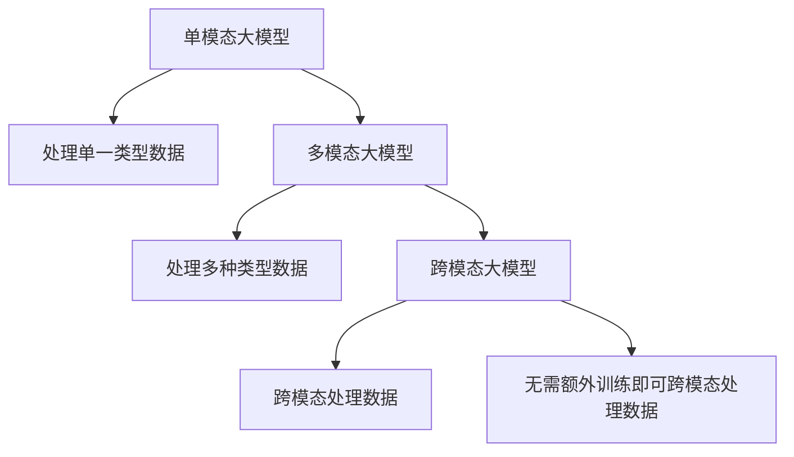

                 

## 1. 背景介绍

在人工智能领域，大模型成为研究热点，并逐步应用于各行业。单模态大模型在自然语言处理（NLP）、计算机视觉（CV）等单一领域表现卓越。然而，随着技术进步和社会需求的多样化，多模态大模型的概念和应用被提出。

多模态大模型指能够处理多种类型数据的模型，如图像、文本、音频和视频等。多模态数据的融合，可以提升模型的感知和理解能力，形成更全面、准确的知识表示。单模态大模型和跨模态大模型，则是多模态大模型的重要组成，具有不同的特点和应用场景。

## 2. 核心概念与联系

### 2.1 核心概念概述

为帮助读者理解多模态大模型，本文首先定义了核心概念：

- **单模态大模型**：指只处理单一类型数据（如文本或图像）的大模型，如GPT、BERT等。
- **多模态大模型**：指能同时处理多种类型数据的大模型，通常具有跨模态（不同类型数据之间转化）和模态融合（不同数据类型的融合）能力。
- **跨模态大模型**：指仅具有单一模态输入，但能通过迁移学习或其他方式适应多种类型数据，如能从图像中提取文本信息。

这些概念之间的联系主要体现在功能融合上：单模态大模型仅能处理单一类型数据，而多模态大模型能处理多种数据，跨模态大模型能跨模态处理数据。

### 2.2 核心概念原理和架构的 Mermaid 流程图



## 3. 核心算法原理 & 具体操作步骤

### 3.1 算法原理概述

大模型的关键在于知识表示和泛化能力。单模态大模型和跨模态大模型的知识表示和泛化方式有所不同，主要体现在数据输入和处理方式上。

单模态大模型（如BERT、GPT）通过预训练（Pre-training）和微调（Fine-tuning），从无标签数据中学习语言表示，然后通过有标签数据进行微调，提升特定任务性能。其核心在于语言模型的自回归或自编码结构，以及预训练数据（如大规模无标签文本）的质量。

跨模态大模型（如Vision-and-Language Models，如CLIP）通常需要两个步骤：首先是单模态预训练，然后在跨模态数据上进行微调。其核心在于不同模态数据间的对齐和融合，以及跨模态数据和标注数据的协同训练。

### 3.2 算法步骤详解

**单模态大模型（BERT）的训练**：

1. **预训练**：在无标签数据上进行预训练，通常使用语言建模任务（如掩码语言模型）。
2. **微调**：在有标签数据上进行微调，以适应特定任务，如分类、匹配等。

**多模态大模型（CLIP）的训练**：

1. **单模态预训练**：分别在图像和文本数据上进行预训练。
2. **跨模态微调**：将图像和文本数据合在一起，进行联合训练，学习不同模态数据之间的对齐和融合。

**跨模态大模型（CLIP）的微调**：

1. **对齐阶段**：对不同模态的数据进行特征对齐，通过对比学习等方式学习模态间的关系。
2. **融合阶段**：将对齐后的特征进行融合，用于最终的任务（如图像-文本匹配）。

### 3.3 算法优缺点

**单模态大模型的优点**：

- 数据量需求低：预训练数据量大，训练效果好。
- 参数量相对较小：通常只有几百万到几千万参数，计算效率高。

**单模态大模型的缺点**：

- 领域适应性差：预训练模型难以直接应用于特定领域，需要额外训练。
- 跨模态处理能力弱：无法直接处理多种类型数据。

**多模态大模型的优点**：

- 领域适应性好：可以处理多种类型数据，适应性更强。
- 融合能力强：能将不同模态的信息融合，提高泛化能力。

**多模态大模型的缺点**：

- 数据量大：需要大规模数据进行预训练和微调。
- 参数量多：通常需要几十亿到百亿参数，计算资源需求大。

**跨模态大模型的优点**：

- 数据适应性强：可以处理多种类型数据，适应性更强。
- 轻量级模型：通常使用轻量级模型，计算资源需求相对较低。

**跨模态大模型的缺点**：

- 对齐困难：不同模态数据特征不一致，需要复杂对齐算法。
- 融合复杂：不同模态数据融合，需要复杂融合算法。

### 3.4 算法应用领域

**单模态大模型**：

- 文本处理：如情感分析、机器翻译、问答系统等。
- 图像处理：如图像分类、目标检测、图像生成等。

**多模态大模型**：

- 医疗：图像与病历数据联合分析，提升诊断准确率。
- 零售：图像与文本结合，进行商品推荐和客户分析。
- 智能家居：图像与语音结合，实现智能交互和监控。

**跨模态大模型**：

- 跨模态检索：如图像-文本检索、音频-文本检索。
- 跨模态情感分析：如图像中的情感分析。

## 4. 数学模型和公式 & 详细讲解 & 举例说明

### 4.1 数学模型构建

假设单模态大模型为 $M_{\theta}$，其中 $\theta$ 为模型参数。对于语言模型，其数学模型为：

$$
p(\text{sequence}) = \prod_{t=1}^T p(x_t \mid x_{<t})
$$

其中 $x_t$ 为序列中第 $t$ 个词，$p(x_t \mid x_{<t})$ 表示在序列前 $t-1$ 个词的情况下，第 $t$ 个词的概率分布。

对于多模态大模型，如CLIP，假设其同时处理图像和文本，则其数学模型为：

$$
p(\text{image}, \text{text}) = p(\text{image}) \times p(\text{text} \mid \text{image})
$$

其中 $p(\text{image})$ 表示图像的概率分布，$p(\text{text} \mid \text{image})$ 表示在图像的情况下，文本的概率分布。

### 4.2 公式推导过程

对于单模态大模型，其预训练目标函数为：

$$
\min_{\theta} \mathcal{L}(\theta) = \mathbb{E}_{(x,y)} [\ell(M_{\theta}(x), y)]
$$

其中 $\ell$ 为损失函数，通常使用交叉熵或均方误差。

对于多模态大模型，如CLIP，其预训练目标函数为：

$$
\min_{\theta} \mathcal{L}(\theta) = \mathbb{E}_{(x_i, y_i)} [\ell(M_{\theta}(x_i), y_i)] + \mathbb{E}_{(x_i, y_i)} [\ell(M_{\theta}(x_i), y_i)]^2
$$

其中，第一项为语言模型目标，第二项为对比学习目标，表示图像与文本之间的对齐。

### 4.3 案例分析与讲解

以CLIP为例，其预训练分为两个阶段：

1. **图像预训练**：假设有一张图像 $I$，将其随机裁剪为多个小块 $I_1, I_2, \ldots, I_m$，通过卷积神经网络提取特征 $f_I$。

2. **文本预训练**：假设有一段文本 $T$，通过语言模型 $M_{\theta}$ 提取特征 $f_T$。

3. **对比学习**：将图像特征和文本特征进行对比，学习它们之间的关系。假设 $I_1$ 和 $T_1$ 是对应的一对图像和文本，则对比学习目标为：

$$
\min_{\theta} \mathcal{L}(\theta) = -\log \sigma(z(I_1, T_1)) + \log \sigma(-z(I_1, T_2))
$$

其中 $z(x, y) = f_I(x) \cdot f_T(y)$ 表示图像和文本特征之间的点积，$\sigma$ 表示sigmoid函数。

## 5. 项目实践：代码实例和详细解释说明

### 5.1 开发环境搭建

首先，需要安装PyTorch和相关库：

```bash
pip install torch torchvision transformers
```

然后，安装HuggingFace库，用于下载和使用预训练模型：

```bash
pip install huggingface-hub
```

### 5.2 源代码详细实现

下面以CLIP为例，展示其代码实现：

```python
from transformers import CLIPModel, CLIPTokenizer

# 加载模型和分词器
model = CLIPModel.from_pretrained('openai/clip-vit-large-patch14')
tokenizer = CLIPTokenizer.from_pretrained('openai/clip-vit-large-patch14')

# 加载图像和文本数据
image = 'image_path.jpg'
text = 'text_description'

# 预处理数据
inputs = tokenizer(text, return_tensors='pt', padding=True, max_length=77)
image = tokenizer.encode_image(image, return_tensors='pt')
inputs = {**inputs, **image}

# 获取模型输出
outputs = model(**inputs)
logits_per_image = outputs.logits_per_image
logits_per_text = outputs.logits_per_text

# 对比学习损失
loss = -(logits_per_image * logits_per_text).sum()

# 反向传播和优化
optimizer = torch.optim.Adam(model.parameters(), lr=1e-4)
optimizer.zero_grad()
loss.backward()
optimizer.step()
```

### 5.3 代码解读与分析

上述代码展示了如何加载CLIP模型，并对图像和文本数据进行预处理，然后通过模型输出和对比学习损失进行微调。

1. **加载模型和分词器**：通过指定模型名称，自动下载预训练模型和分词器。
2. **数据预处理**：将文本和图像数据转换为模型所需的格式，并进行padding，以适应模型最大输入长度。
3. **模型前向传播**：通过模型前向传播，获取图像和文本的特征表示。
4. **对比学习损失**：计算对比学习损失，并将其反向传播，更新模型参数。

### 5.4 运行结果展示

在上述代码的实现下，可以通过微调CLIP模型，使其更好地适应特定任务。

## 6. 实际应用场景

### 6.1 智能家居

在智能家居场景中，跨模态大模型可以通过将图像、声音和文本数据结合，实现更全面、精确的智能交互和监控。例如，通过摄像头捕捉人体动作和语音指令，同时分析文本描述，智能家居系统可以更准确地识别用户意图，提供个性化服务。

### 6.2 医疗诊断

在医疗诊断中，跨模态大模型可以结合图像和病历数据，提升诊断的准确性和效率。例如，通过分析X光片和病历记录，跨模态模型可以更全面地评估病情，提供治疗建议。

### 6.3 零售推荐

在零售推荐中，多模态大模型可以通过结合图像、文本和用户行为数据，提供更个性化、精准的商品推荐。例如，通过分析商品图片和用户评论，跨模态模型可以更准确地预测用户喜好，推荐符合需求的商品。

## 7. 工具和资源推荐

### 7.1 学习资源推荐

1. **《多模态学习》（Learning from Multimodal Data）**：提供多模态数据处理、特征对齐和融合等基本概念和算法。
2. **《Vision and Language: Multimodal Representation Learning》**：介绍多模态大模型的最新研究和进展。
3. **《深度学习与多模态数据融合》**：涵盖多模态数据的获取、预处理、对齐和融合等技术。
4. **CS231n课程**：斯坦福大学开设的多模态学习课程，涵盖图像、文本等多模态数据的处理和融合。

### 7.2 开发工具推荐

1. **PyTorch**：深度学习框架，支持多模态大模型的训练和推理。
2. **TensorFlow**：深度学习框架，支持分布式计算和多模态数据处理。
3. **Transformers**：多模态模型库，支持CLIP等预训练模型的使用和微调。
4. **HuggingFace Hub**：预训练模型的下载和检索平台。

### 7.3 相关论文推荐

1. **《Mixed Precision Training of Deep Neural Networks》**：介绍混合精度训练，提升多模态大模型的计算效率。
2. **《Cross-Modal Similarity Learning》**：介绍跨模态对齐和融合的最新方法。
3. **《Multimodal Feature Learning with Transformers》**：介绍多模态大模型的特征学习和优化算法。

## 8. 总结：未来发展趋势与挑战

### 8.1 研究成果总结

本文对单模态、多模态和跨模态大模型的原理和实践进行了详细分析，探讨了其应用场景和技术挑战。通过对比分析，帮助读者更好地理解多模态大模型的优势和局限性。

### 8.2 未来发展趋势

未来多模态大模型将呈现以下几个发展趋势：

1. **模型规模进一步扩大**：通过更大规模的数据和更复杂的模型，提升多模态大模型的感知能力和泛化能力。
2. **多模态融合技术创新**：开发更高效、更准确的多模态数据融合方法，提升多模态大模型的融合效果。
3. **跨模态对齐技术提升**：开发更高效的跨模态对齐算法，提高不同模态数据之间的对齐准确性。
4. **应用领域拓展**：多模态大模型将应用于更多领域，如医疗、智能家居、零售等，提升各行业的智能化水平。

### 8.3 面临的挑战

尽管多模态大模型在多个领域取得了显著成果，但仍面临以下挑战：

1. **数据获取成本高**：多模态大模型的训练需要大规模的多类型数据，数据获取和标注成本高。
2. **模型复杂度高**：多模态大模型通常需要复杂的多模态融合算法和优化技术，模型训练复杂度高。
3. **模型鲁棒性差**：多模态数据间的异质性导致模型鲁棒性较差，容易受到噪声干扰。
4. **解释性不足**：多模态大模型通常缺乏可解释性，难以解释其内部工作机制。

### 8.4 研究展望

为应对这些挑战，未来的研究应重点关注以下几个方面：

1. **数据获取和标注技术**：探索更高效、低成本的数据获取和标注方法，如主动学习、半监督学习等。
2. **模型简化和优化**：开发更高效的模型和算法，提升多模态大模型的计算效率和稳定性。
3. **模型可解释性**：开发可解释性更强的模型，增强模型输出的透明度和可解释性。
4. **跨模态对齐和融合**：开发更高效的跨模态对齐和融合算法，提升多模态大模型的融合效果。

## 9. 附录：常见问题与解答

**Q1：单模态大模型和跨模态大模型的区别是什么？**

A: 单模态大模型只能处理单一类型数据，如文本或图像。而跨模态大模型可以处理多种类型数据，但仅能通过迁移学习或其他方式适应其他模态，不能直接处理其他模态的数据。

**Q2：多模态大模型和跨模态大模型的训练流程有何不同？**

A: 多模态大模型的训练通常需要分别对不同模态进行预训练，然后进行联合训练。而跨模态大模型通常使用轻量级模型，仅需通过迁移学习适应其他模态数据，训练流程相对简单。

**Q3：多模态大模型和单模态大模型的参数量有何区别？**

A: 多模态大模型通常需要几十亿到百亿参数，而单模态大模型通常只有几百万到几千万参数，参数量差异较大。

**Q4：多模态大模型的优缺点是什么？**

A: 多模态大模型的优点是可以处理多种类型数据，适应性更强，融合能力强。缺点是需要大规模数据进行预训练和微调，计算资源需求大。

**Q5：如何提升多模态大模型的鲁棒性？**

A: 可以通过正则化、对抗训练等方法提升多模态大模型的鲁棒性。此外，还可以开发更高效的跨模态对齐和融合算法，提高模型的泛化能力。

---

作者：禅与计算机程序设计艺术 / Zen and the Art of Computer Programming

