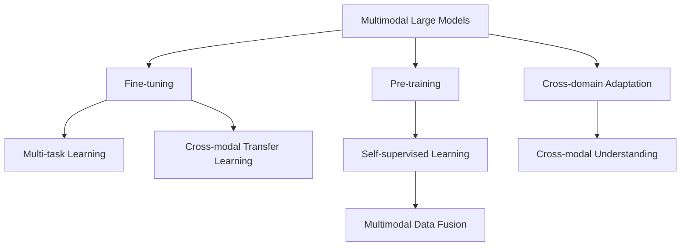

                 

## 1. 背景介绍

### 1.1 问题由来

近年来，随着计算机视觉（CV）和自然语言处理（NLP）技术的飞速发展，多模态大模型（Multi-modal Large Models）的概念应运而生。这种模型可以同时处理多种类型的数据，如图像、文本、语音、视频等，从而在理解复杂的人类行为和交互场景中表现出色。例如，基于多模态大模型的应用可以涵盖智能家居、医疗影像分析、自动驾驶等多个领域。

### 1.2 问题核心关键点

多模态大模型将视觉、听觉、文本等多种模态的信息进行融合，提供更加丰富、准确的认知能力。其主要特点包括：

1. **多模态数据融合**：能够同时处理和理解不同类型的传感器数据，如摄像头捕捉的视觉信息、麦克风采集的语音信息等。
2. **跨模态知识迁移**：通过迁移学习（Transfer Learning），将一个模态的知识迁移到另一个模态中，增强模型在复杂任务上的表现。
3. **自监督学习（Self-supervised Learning）**：利用大量未标注数据进行预训练，学习到多种模态下的通用表示，减少对标注数据的依赖。
4. **跨领域适应性**：在大规模数据上进行预训练，然后在特定领域或任务上进行微调（Fine-tuning），提升模型在特定应用场景中的性能。

### 1.3 问题研究意义

研究多模态大模型的技术原理与实战应用，对于提升人工智能系统的认知智能水平，推动多模态信息处理技术的落地应用具有重要意义：

1. **提升系统理解力**：多模态大模型能够综合视觉、语音、文本等多种信息，提供更加全面和准确的知识理解。
2. **扩展应用场景**：多模态技术能够广泛应用于智能家居、医疗影像、自动驾驶等多个领域，推动这些行业的数字化转型。
3. **促进产业升级**：通过多模态模型的应用，传统行业可以更加智能化、自动化，提升生产效率和用户体验。
4. **推动技术创新**：多模态大模型带来了新的研究方向，如跨模态迁移学习、自监督学习等，促进了人工智能技术的进步。

## 2. 核心概念与联系

### 2.1 核心概念概述

为更好地理解多模态大模型的技术原理和实战应用，本节将介绍几个关键概念及其相互关系：

- **多模态大模型**：可以同时处理图像、文本、语音等多种模态数据的深度学习模型。通过多模态信息的融合，模型具备更强的感知和理解能力。
- **预训练**：在大规模无标签数据上进行自监督学习，学习到通用的多模态特征表示。
- **微调**：在特定任务或领域上对预训练模型进行有监督学习，调整模型参数以适应特定需求。
- **跨模态迁移学习**：将一个模态的任务知识迁移到另一个模态中，增强模型在多个模态上的性能。
- **多任务学习**：在一个模型中同时训练多个任务，共享低层特征表示，提高模型泛化能力。

这些概念之间的逻辑关系可以通过以下Mermaid流程图来展示：



这个流程图展示出多模态大模型的核心概念及其相互关系：

1. 多模态大模型通过预训练学习通用特征表示。
2. 微调模型在不同任务和领域上进行适应。
3. 多任务学习共享低层特征表示。
4. 跨模态迁移学习在不同模态间进行知识迁移。
5. 自监督学习利用未标注数据进行预训练。
6. 多模态数据融合提供多种类型信息。
7. 跨领域适应提高模型在特定场景中的表现。

## 3. 核心算法原理 & 具体操作步骤
### 3.1 算法原理概述

多模态大模型的技术原理主要基于以下两大类算法：

1. **跨模态融合算法**：将不同模态的信息进行融合，形成统一的特征表示，使得模型能够理解多模态数据。常用的跨模态融合算法包括空间注意力（Spatial Attention）、通道注意力（Channel Attention）、时序注意力（Temporal Attention）等。
2. **跨模态迁移算法**：将一个模态的任务知识迁移到另一个模态中，增强模型在多个模态上的性能。常用的跨模态迁移算法包括迁移学习（Transfer Learning）、多任务学习（Multi-task Learning）、对抗训练（Adversarial Training）等。

这些算法可以组合使用，形成更加复杂的多模态大模型。下面以迁移学习为例，详细讲解其具体操作步骤。

### 3.2 算法步骤详解

**Step 1: 准备预训练模型和数据集**
- 选择合适的预训练模型，如基于ResNet的视觉模型、BERT的文本模型、Transformer的语音模型等。
- 准备多模态数据集，划分为训练集、验证集和测试集，确保各模态的数据分布一致。

**Step 2: 添加任务适配层**
- 根据任务类型，在预训练模型的顶层设计合适的输出层和损失函数。
- 对于分类任务，通常在顶层添加线性分类器和交叉熵损失函数。
- 对于生成任务，通常使用语言模型的解码器输出概率分布，并以负对数似然为损失函数。

**Step 3: 设置微调超参数**
- 选择合适的优化算法及其参数，如 Adam、SGD 等，设置学习率、批大小、迭代轮数等。
- 设置正则化技术及强度，包括权重衰减、Dropout、Early Stopping 等。
- 确定冻结预训练参数的策略，如仅微调顶层，或全部参数都参与微调。

**Step 4: 执行梯度训练**
- 将训练集数据分批次输入模型，前向传播计算损失函数。
- 反向传播计算参数梯度，根据设定的优化算法和学习率更新模型参数。
- 周期性在验证集上评估模型性能，根据性能指标决定是否触发 Early Stopping。
- 重复上述步骤直到满足预设的迭代轮数或 Early Stopping 条件。

**Step 5: 测试和部署**
- 在测试集上评估微调后模型 $M_{\hat{\theta}}$ 的性能，对比微调前后的精度提升。
- 使用微调后的模型对新样本进行推理预测，集成到实际的应用系统中。
- 持续收集新的数据，定期重新微调模型，以适应数据分布的变化。

### 3.3 算法优缺点

多模态大模型的迁移学习方法具有以下优点：
1. 适应性强：能够在不同的模态和任务上进行微调，适用于各种多模态应用场景。
2. 高效实用：仅需少量标注数据即可提升模型性能，适合数据稀缺的任务。
3. 知识迁移：通过迁移学习，模型能够充分利用不同模态间的知识，提高泛化能力。

同时，该方法也存在一定的局限性：
1. 依赖标注数据：虽然迁移学习减少了标注需求，但部分模态仍需要标注数据进行微调。
2. 模型复杂度：多模态模型参数量较大，训练和推理速度较慢，资源消耗高。
3. 数据兼容性：不同模态的数据格式和表示方式差异大，需要进行大量的数据预处理和融合。
4. 任务依赖性强：迁移学习的效果依赖于任务的相似性和数据的分布一致性，迁移效果可能不理想。

尽管存在这些局限性，但就目前而言，迁移学习范式仍然是多模态大模型应用的主流方法。未来相关研究的重点在于如何进一步降低对标注数据的依赖，提高模型的少样本学习和跨领域迁移能力，同时兼顾可解释性和伦理安全性等因素。

### 3.4 算法应用领域

多模态大模型的迁移学习方法，在计算机视觉、自然语言处理、语音识别等多个领域已经得到了广泛的应用，覆盖了几乎所有常见任务，例如：

- **图像分类**：如物体识别、人脸识别等。通过微调使模型学习图像-标签映射。
- **文本分类**：如情感分析、主题分类、意图识别等。通过微调使模型学习文本-标签映射。
- **机器翻译**：将源语言文本翻译成目标语言。通过微调使模型学习语言-语言映射。
- **语音识别**：将音频转换为文本。通过微调使模型学习语音-文本映射。
- **视频标注**：自动标注视频中的物体、动作等。通过微调使模型学习视频-标签映射。
- **动作识别**：从视频中识别特定动作。通过微调使模型学习动作-标签映射。

除了上述这些经典任务外，多模态大模型也被创新性地应用到更多场景中，如可控图像生成、视频摘要、人机交互等，为计算机视觉技术带来了全新的突破。

## 4. 数学模型和公式 & 详细讲解  
### 4.1 数学模型构建

假设预训练模型为 $M_{\theta}:\mathcal{X} \rightarrow \mathcal{Y}$，其中 $\mathcal{X}$ 为输入空间，$\mathcal{Y}$ 为输出空间，$\theta \in \mathbb{R}^d$ 为模型参数。多模态数据集为 $D=\{(x_i,y_i)\}_{i=1}^N$，其中 $x_i$ 为输入，$y_i$ 为输出标签。

定义模型 $M_{\theta}$ 在输入 $x$ 上的损失函数为 $\ell(M_{\theta}(x),y)$，则在数据集 $D$ 上的经验风险为：

$$
\mathcal{L}(\theta) = \frac{1}{N} \sum_{i=1}^N \ell(M_{\theta}(x_i),y_i)
$$

微调的优化目标是最小化经验风险，即找到最优参数：

$$
\theta^* = \mathop{\arg\min}_{\theta} \mathcal{L}(\theta)
$$

在实践中，我们通常使用基于梯度的优化算法（如SGD、Adam等）来近似求解上述最优化问题。设 $\eta$ 为学习率，$\lambda$ 为正则化系数，则参数的更新公式为：

$$
\theta \leftarrow \theta - \eta \nabla_{\theta}\mathcal{L}(\theta) - \eta\lambda\theta
$$

其中 $\nabla_{\theta}\mathcal{L}(\theta)$ 为损失函数对参数 $\theta$ 的梯度，可通过反向传播算法高效计算。

### 4.2 公式推导过程

以下我们以图像分类任务为例，推导交叉熵损失函数及其梯度的计算公式。

假设模型 $M_{\theta}$ 在输入 $x$ 上的输出为 $\hat{y}=M_{\theta}(x) \in [0,1]$，表示样本属于正类的概率。真实标签 $y \in \{0,1\}$。则二分类交叉熵损失函数定义为：

$$
\ell(M_{\theta}(x),y) = -[y\log \hat{y} + (1-y)\log (1-\hat{y})]
$$

将其代入经验风险公式，得：

$$
\mathcal{L}(\theta) = -\frac{1}{N}\sum_{i=1}^N [y_i\log M_{\theta}(x_i)+(1-y_i)\log(1-M_{\theta}(x_i))]
$$

根据链式法则，损失函数对参数 $\theta_k$ 的梯度为：

$$
\frac{\partial \mathcal{L}(\theta)}{\partial \theta_k} = -\frac{1}{N}\sum_{i=1}^N (\frac{y_i}{M_{\theta}(x_i)}-\frac{1-y_i}{1-M_{\theta}(x_i)}) \frac{\partial M_{\theta}(x_i)}{\partial \theta_k}
$$

其中 $\frac{\partial M_{\theta}(x_i)}{\partial \theta_k}$ 可进一步递归展开，利用自动微分技术完成计算。

在得到损失函数的梯度后，即可带入参数更新公式，完成模型的迭代优化。重复上述过程直至收敛，最终得到适应下游任务的最优模型参数 $\theta^*$。

## 5. 项目实践：代码实例和详细解释说明
### 5.1 开发环境搭建

在进行多模态大模型微调实践前，我们需要准备好开发环境。以下是使用Python进行PyTorch开发的环境配置流程：

1. 安装Anaconda：从官网下载并安装Anaconda，用于创建独立的Python环境。

2. 创建并激活虚拟环境：
```bash
conda create -n pytorch-env python=3.8 
conda activate pytorch-env
```

3. 安装PyTorch：根据CUDA版本，从官网获取对应的安装命令。例如：
```bash
conda install pytorch torchvision torchaudio cudatoolkit=11.1 -c pytorch -c conda-forge
```

4. 安装Transformers库：
```bash
pip install transformers
```

5. 安装各类工具包：
```bash
pip install numpy pandas scikit-learn matplotlib tqdm jupyter notebook ipython
```

完成上述步骤后，即可在`pytorch-env`环境中开始多模态大模型微调实践。

### 5.2 源代码详细实现

这里我们以视觉-文本跨模态迁移学习任务为例，给出使用Transformers库对预训练模型进行微调的PyTorch代码实现。

首先，定义跨模态任务的数据处理函数：

```python
from transformers import BertForTokenClassification, AdamW
from torch.utils.data import Dataset
import torch
import torchvision.transforms as transforms

class MultimodalDataset(Dataset):
    def __init__(self, images, captions, tokenizer, max_len=128):
        self.images = images
        self.captions = captions
        self.tokenizer = tokenizer
        self.max_len = max_len
        
    def __len__(self):
        return len(self.images)
    
    def __getitem__(self, item):
        image = self.images[item]
        caption = self.captions[item]
        
        # 加载并预处理图像数据
        transform = transforms.Compose([
            transforms.Resize((224, 224)),
            transforms.ToTensor(),
            transforms.Normalize(mean=[0.485, 0.456, 0.406], std=[0.229, 0.224, 0.225])
        ])
        image = transform(image)
        
        # 将图像编码成特征向量
        model = ResNet()
        image = model(image.unsqueeze(0))
        image = image.squeeze(0).detach().numpy()
        
        # 将图像特征和文本编码融合
        encoding = self.tokenizer(caption, return_tensors='pt', max_length=self.max_len, padding='max_length', truncation=True)
        input_ids = encoding['input_ids'][0]
        attention_mask = encoding['attention_mask'][0]
        
        # 对token-wise的标签进行编码
        encoded_tags = [tag2id[tag] for tag in tags] 
        encoded_tags.extend([tag2id['O']] * (self.max_len - len(encoded_tags)))
        labels = torch.tensor(encoded_tags, dtype=torch.long)
        
        return {'input_ids': input_ids, 
                'attention_mask': attention_mask,
                'labels': labels,
                'image': image}
        
# 标签与id的映射
tag2id = {'O': 0, 'B-PER': 1, 'I-PER': 2, 'B-ORG': 3, 'I-ORG': 4, 'B-LOC': 5, 'I-LOC': 6}
id2tag = {v: k for k, v in tag2id.items()}

# 创建dataset
tokenizer = BertTokenizer.from_pretrained('bert-base-cased')
image_data = load_image_data()
caption_data = load_caption_data()
```

然后，定义模型和优化器：

```python
from transformers import BertForTokenClassification, AdamW

model = BertForTokenClassification.from_pretrained('bert-base-cased', num_labels=len(tag2id))

optimizer = AdamW(model.parameters(), lr=2e-5)
```

接着，定义训练和评估函数：

```python
from torch.utils.data import DataLoader
from tqdm import tqdm
from sklearn.metrics import classification_report

device = torch.device('cuda') if torch.cuda.is_available() else torch.device('cpu')
model.to(device)

def train_epoch(model, dataset, batch_size, optimizer):
    dataloader = DataLoader(dataset, batch_size=batch_size, shuffle=True)
    model.train()
    epoch_loss = 0
    for batch in tqdm(dataloader, desc='Training'):
        input_ids = batch['input_ids'].to(device)
        attention_mask = batch['attention_mask'].to(device)
        labels = batch['labels'].to(device)
        model.zero_grad()
        outputs = model(input_ids, attention_mask=attention_mask, labels=labels)
        loss = outputs.loss
        epoch_loss += loss.item()
        loss.backward()
        optimizer.step()
    return epoch_loss / len(dataloader)

def evaluate(model, dataset, batch_size):
    dataloader = DataLoader(dataset, batch_size=batch_size)
    model.eval()
    preds, labels = [], []
    with torch.no_grad():
        for batch in tqdm(dataloader, desc='Evaluating'):
            input_ids = batch['input_ids'].to(device)
            attention_mask = batch['attention_mask'].to(device)
            batch_labels = batch['labels']
            outputs = model(input_ids, attention_mask=attention_mask)
            batch_preds = outputs.logits.argmax(dim=2).to('cpu').tolist()
            batch_labels = batch_labels.to('cpu').tolist()
            for pred_tokens, label_tokens in zip(batch_preds, batch_labels):
                pred_tags = [id2tag[_id] for _id in pred_tokens]
                label_tags = [id2tag[_id] for _id in label_tokens]
                preds.append(pred_tags[:len(label_tags)])
                labels.append(label_tags)
                
    print(classification_report(labels, preds))
```

最后，启动训练流程并在测试集上评估：

```python
epochs = 5
batch_size = 16

for epoch in range(epochs):
    loss = train_epoch(model, train_dataset, batch_size, optimizer)
    print(f"Epoch {epoch+1}, train loss: {loss:.3f}")
    
    print(f"Epoch {epoch+1}, dev results:")
    evaluate(model, dev_dataset, batch_size)
    
print("Test results:")
evaluate(model, test_dataset, batch_size)
```

以上就是使用PyTorch对预训练模型进行跨模态迁移学习任务微调的完整代码实现。可以看到，得益于Transformers库的强大封装，我们可以用相对简洁的代码完成跨模态模型的加载和微调。

### 5.3 代码解读与分析

让我们再详细解读一下关键代码的实现细节：

**MultimodalDataset类**：
- `__init__`方法：初始化图像、文本、分词器等关键组件。
- `__len__`方法：返回数据集的样本数量。
- `__getitem__`方法：对单个样本进行处理，将图像输入预处理成特征向量，并将图像特征和文本编码融合，最终返回模型所需的输入。

**tag2id和id2tag字典**：
- 定义了标签与数字id之间的映射关系，用于将token-wise的预测结果解码回真实的标签。

**训练和评估函数**：
- 使用PyTorch的DataLoader对数据集进行批次化加载，供模型训练和推理使用。
- 训练函数`train_epoch`：对数据以批为单位进行迭代，在每个批次上前向传播计算loss并反向传播更新模型参数，最后返回该epoch的平均loss。
- 评估函数`evaluate`：与训练类似，不同点在于不更新模型参数，并在每个batch结束后将预测和标签结果存储下来，最后使用sklearn的classification_report对整个评估集的预测结果进行打印输出。

**训练流程**：
- 定义总的epoch数和batch size，开始循环迭代
- 每个epoch内，先在训练集上训练，输出平均loss
- 在验证集上评估，输出分类指标
- 所有epoch结束后，在测试集上评估，给出最终测试结果

可以看到，PyTorch配合Transformers库使得跨模态迁移学习的代码实现变得简洁高效。开发者可以将更多精力放在数据处理、模型改进等高层逻辑上，而不必过多关注底层的实现细节。

当然，工业级的系统实现还需考虑更多因素，如模型的保存和部署、超参数的自动搜索、更灵活的任务适配层等。但核心的迁移学习范式基本与此类似。

## 6. 实际应用场景
### 6.1 智能家居系统

基于多模态大模型的智能家居系统，可以实时监测和控制家中的各种设备，提升家庭生活的智能化水平。例如，通过摄像头、传感器等设备采集的数据，可以识别家庭成员、监测房间状态、预测能源消耗等。

在技术实现上，可以收集家庭设备的使用记录、环境数据等，作为监督数据对预训练模型进行微调。微调后的模型能够自动分析家中的活动模式，预测能源消耗，优化设备使用，提升能效和舒适性。例如，通过识别人脸，自动调节灯光亮度；通过分析温度和湿度，自动调节空调和加湿器；通过监测气体泄漏，自动报警等。

### 6.2 医疗影像分析

医疗影像分析是医疗领域的一项重要任务，传统的影像分析依赖于医生的经验，效率低、成本高。基于多模态大模型的影像分析技术，可以自动分析和解读医疗影像，提升诊断的准确性和效率。

在实践中，可以收集医学影像及其标注数据，作为监督数据对预训练模型进行微调。微调后的模型能够自动识别肿瘤、识别器官结构、标注病灶等，辅助医生进行精准诊断和治疗。例如，通过分析CT、MRI等影像，自动检测肺部结节、肿瘤；通过分析X光片，自动识别骨折、肺炎等；通过分析超声影像，自动检测心脏病变等。

### 6.3 自动驾驶

自动驾驶是未来交通领域的重要方向，通过多模态大模型，可以更好地理解和预测道路环境，实现更加安全、智能的驾驶。

在技术实现上，可以收集自动驾驶车辆周围的多模态数据，如雷达、摄像头、激光雷达等，对预训练模型进行微调。微调后的模型能够自动识别行人、车辆、路标等交通要素，预测其行为，自动控制车辆行驶。例如，通过雷达和摄像头数据，自动识别车辆、行人，并做出避让决策；通过激光雷达数据，自动检测路面坑洼、障碍物；通过分析车辆轨迹，自动预测下一步动作等。

### 6.4 未来应用展望

随着多模态大模型和迁移学习方法的不断发展，基于迁移范式将在更多领域得到应用，为传统行业带来变革性影响。

在智慧医疗领域，基于多模态大模型的影像分析、病理诊断、药物研发等应用将提升医疗服务的智能化水平，辅助医生诊疗，加速新药开发进程。

在智能教育领域，多模态大模型可应用于作业批改、学情分析、知识推荐等方面，因材施教，促进教育公平，提高教学质量。

在智能家居、智慧城市、智能交通等多个领域，基于多模态大模型的人工智能应用也将不断涌现，为传统行业带来新的技术突破，推动数字化转型升级。

## 7. 工具和资源推荐
### 7.1 学习资源推荐

为了帮助开发者系统掌握多模态大模型的理论基础和实践技巧，这里推荐一些优质的学习资源：

1. 《Transformer从原理到实践》系列博文：由大模型技术专家撰写，深入浅出地介绍了Transformer原理、多模态大模型、迁移学习等前沿话题。

2. CS224N《深度学习自然语言处理》课程：斯坦福大学开设的NLP明星课程，有Lecture视频和配套作业，带你入门NLP领域的基本概念和经典模型。

3. 《Natural Language Processing with Transformers》书籍：Transformers库的作者所著，全面介绍了如何使用Transformers库进行NLP任务开发，包括多模态大模型的开发与应用。

4. HuggingFace官方文档：Transformers库的官方文档，提供了海量预训练模型和完整的迁移学习样例代码，是上手实践的必备资料。

5. CLUE开源项目：中文语言理解测评基准，涵盖大量不同类型的中文NLP数据集，并提供了基于迁移学习的baseline模型，助力中文NLP技术发展。

通过对这些资源的学习实践，相信你一定能够快速掌握多模态大模型的技术原理和实战方法，并用于解决实际的NLP问题。
###  7.2 开发工具推荐

高效的开发离不开优秀的工具支持。以下是几款用于多模态大模型微调开发的常用工具：

1. PyTorch：基于Python的开源深度学习框架，灵活动态的计算图，适合快速迭代研究。大部分预训练语言模型都有PyTorch版本的实现。

2. TensorFlow：由Google主导开发的开源深度学习框架，生产部署方便，适合大规模工程应用。同样有丰富的预训练语言模型资源。

3. Transformers库：HuggingFace开发的NLP工具库，集成了众多SOTA语言模型，支持PyTorch和TensorFlow，是进行迁移学习任务的开发的利器。

4. Weights & Biases：模型训练的实验跟踪工具，可以记录和可视化模型训练过程中的各项指标，方便对比和调优。与主流深度学习框架无缝集成。

5. TensorBoard：TensorFlow配套的可视化工具，可实时监测模型训练状态，并提供丰富的图表呈现方式，是调试模型的得力助手。

6. Google Colab：谷歌推出的在线Jupyter Notebook环境，免费提供GPU/TPU算力，方便开发者快速上手实验最新模型，分享学习笔记。

合理利用这些工具，可以显著提升多模态大模型迁移学习的开发效率，加快创新迭代的步伐。

### 7.3 相关论文推荐

多模态大模型和迁移学习的发展源于学界的持续研究。以下是几篇奠基性的相关论文，推荐阅读：

1. Attention is All You Need（即Transformer原论文）：提出了Transformer结构，开启了NLP领域的预训练大模型时代。

2. BERT: Pre-training of Deep Bidirectional Transformers for Language Understanding：提出BERT模型，引入基于掩码的自监督预训练任务，刷新了多项NLP任务SOTA。

3. Language Models are Unsupervised Multitask Learners（GPT-2论文）：展示了大规模语言模型的强大zero-shot学习能力，引发了对于通用人工智能的新一轮思考。

4. Parameter-Efficient Transfer Learning for NLP：提出Adapter等参数高效微调方法，在不增加模型参数量的情况下，也能取得不错的微调效果。

5. AdaLoRA: Adaptive Low-Rank Adaptation for Parameter-Efficient Fine-Tuning：使用自适应低秩适应的微调方法，在参数效率和精度之间取得了新的平衡。

6. Cross-Modal Multitask Learning for Video Captioning：提出跨模态多任务学习框架，提升视频字幕生成任务的多模态性能。

这些论文代表了大模型和迁移学习的不断发展脉络。通过学习这些前沿成果，可以帮助研究者把握学科前进方向，激发更多的创新灵感。

## 8. 总结：未来发展趋势与挑战

### 8.1 总结

本文对多模态大模型的技术原理与实战应用进行了全面系统的介绍。首先阐述了多模态大模型的研究背景和意义，明确了迁移学习在多模态数据融合、知识迁移、模型泛化等方面的独特价值。其次，从原理到实践，详细讲解了迁移学习的数学原理和关键步骤，给出了迁移学习任务开发的完整代码实例。同时，本文还广泛探讨了迁移学习在智能家居、医疗影像、自动驾驶等多个领域的应用前景，展示了迁移学习范式的巨大潜力。此外，本文精选了迁移学习的各类学习资源，力求为读者提供全方位的技术指引。

通过本文的系统梳理，可以看到，多模态大模型迁移学习技术正在成为计算机视觉和自然语言处理领域的重要范式，极大地拓展了预训练大模型的应用边界，催生了更多的落地场景。得益于大规模语料的预训练，迁移学习模型能够综合多种模态的信息，提高模型对复杂场景的适应能力，从而提升认知智能水平。未来，伴随预训练大模型和迁移学习方法的持续演进，相信多模态大模型将进一步提升人工智能系统的感知智能和认知智能，推动更多领域的数字化转型升级。

### 8.2 未来发展趋势

展望未来，多模态大模型迁移学习技术将呈现以下几个发展趋势：

1. **模型规模持续增大**：随着算力成本的下降和数据规模的扩张，预训练大模型的参数量还将持续增长。超大规模大模型蕴含的丰富多模态特征表示，有望支撑更加复杂多变的迁移学习任务。

2. **迁移方法日趋多样**：除了传统的迁移学习外，未来会涌现更多参数高效的迁移方法，如Prefix-Tuning、LoRA等，在减少计算资源的同时，保证迁移效果。

3. **跨模态迁移学习增强**：通过引入因果推断和对比学习思想，增强多模态模型建立稳定因果关系的能力，学习更加普适、鲁棒的多模态特征表示。

4. **多任务学习融合**：通过多任务学习，共享低层特征表示，提高模型的泛化能力和迁移能力。

5. **自监督学习应用**：利用自监督学习，在大规模无标签数据上进行预训练，提升模型的多模态特征学习能力。

6. **跨领域适应性提升**：通过跨领域迁移学习，使模型具备更强的跨模态和跨领域适应能力，适用于更多实际应用场景。

以上趋势凸显了多模态大模型迁移学习技术的广阔前景。这些方向的探索发展，必将进一步提升多模态大模型在复杂多变环境中的性能，为人工智能技术在垂直行业的落地应用提供强有力的支持。

### 8.3 面临的挑战

尽管多模态大模型迁移学习技术已经取得了显著成就，但在迈向更加智能化、普适化应用的过程中，它仍面临诸多挑战：

1. **数据兼容性和预处理**：不同模态的数据格式和表示方式差异大，需要进行大量的数据预处理和融合，增加了任务的复杂度。

2. **训练计算资源消耗大**：大规模预训练和微调需要大量的计算资源，对于资源有限的开发环境，难以高效实现。

3. **模型泛化能力不足**：迁移学习的效果依赖于任务的相似性和数据的分布一致性，对于域外数据和未见过的场景，泛化性能可能不理想。

4. **可解释性不足**：多模态大模型通常是一个"黑盒"系统，难以解释其内部工作机制和决策逻辑，对于高风险应用，缺乏可解释性将影响信任度。

5. **数据隐私和安全**：在多模态数据融合和迁移学习中，如何保护数据隐私和安全，防止数据泄露和滥用，是亟待解决的问题。

尽管存在这些挑战，但随着预训练大模型和迁移学习方法的不断进步，相信多模态大模型迁移学习技术将不断克服这些难题，迎来新的发展契机。

### 8.4 研究展望

面对多模态大模型迁移学习所面临的种种挑战，未来的研究需要在以下几个方面寻求新的突破：

1. **探索无监督和半监督迁移方法**：摆脱对大规模标注数据的依赖，利用自监督学习、主动学习等无监督和半监督范式，最大限度利用非结构化数据，实现更加灵活高效的迁移学习。

2. **研究参数高效和计算高效的迁移范式**：开发更加参数高效的迁移方法，在固定大部分预训练参数的同时，只更新极少量的任务相关参数。同时优化迁移模型的计算图，减少前向传播和反向传播的资源消耗，实现更加轻量级、实时性的部署。

3. **引入更多先验知识**：将符号化的先验知识，如知识图谱、逻辑规则等，与神经网络模型进行巧妙融合，引导迁移过程学习更准确、合理的特征表示。

4. **结合因果分析和博弈论工具**：将因果分析方法引入迁移模型，识别出模型决策的关键特征，增强输出解释的因果性和逻辑性。借助博弈论工具刻画人机交互过程，主动探索并规避模型的脆弱点，提高系统稳定性。

5. **纳入伦理道德约束**：在迁移学习模型的训练目标中引入伦理导向的评估指标，过滤和惩罚有偏见、有害的输出倾向。同时加强人工干预和审核，建立模型行为的监管机制，确保输出符合人类价值观和伦理道德。

这些研究方向的探索，必将引领多模态大模型迁移学习技术迈向更高的台阶，为构建安全、可靠、可解释、可控的智能系统铺平道路。面向未来，多模态大模型迁移学习技术还需要与其他人工智能技术进行更深入的融合，如知识表示、因果推理、强化学习等，多路径协同发力，共同推动自然语言理解和智能交互系统的进步。只有勇于创新、敢于突破，才能不断拓展多模态大模型的边界，让智能技术更好地造福人类社会。

## 9. 附录：常见问题与解答

**Q1：多模态大模型迁移学习是否适用于所有NLP任务？**

A: 多模态大模型迁移学习在大多数NLP任务上都能取得不错的效果，特别是对于数据量较小的任务。但对于一些特定领域的任务，如医学、法律等，仅仅依靠通用语料预训练的模型可能难以很好地适应。此时需要在特定领域语料上进一步预训练，再进行迁移学习，才能获得理想效果。此外，对于一些需要时效性、个性化很强的任务，如对话、推荐等，迁移方法也需要针对性的改进优化。

**Q2：迁移学习过程中如何选择合适的学习率？**

A: 迁移学习的学习率一般要比预训练时小1-2个数量级，如果使用过大的学习率，容易破坏预训练权重，导致过拟合。一般建议从1e-5开始调参，逐步减小学习率，直至收敛。也可以使用warmup策略，在开始阶段使用较小的学习率，再逐渐过渡到预设值。需要注意的是，不同的优化器(如Adam、SGD等)以及不同的学习率调度策略，可能需要设置不同的学习率阈值。

**Q3：多模态大模型迁移学习面临哪些资源瓶颈？**

A: 当前主流的多模态大模型参数量较大，对算力、内存、存储都提出了很高的要求。GPU/TPU等高性能设备是必不可少的，但即便如此，超大批次的训练和推理也可能遇到显存不足的问题。因此需要采用一些资源优化技术，如梯度积累、混合精度训练、模型并行等，来突破硬件瓶颈。同时，模型的存储和读取也可能占用大量时间和空间，需要采用模型压缩、稀疏化存储等方法进行优化。

**Q4：如何缓解迁移学习过程中的过拟合问题？**

A: 过拟合是迁移学习面临的主要挑战，尤其是在标注数据不足的情况下。常见的缓解策略包括：
1. 数据增强：通过回译、近义替换等方式扩充训练集
2. 正则化：使用L2正则、Dropout、Early Stopping等避免过拟合
3. 对抗训练：引入对抗样本，提高模型鲁棒性
4. 参数高效迁移：只调整少量参数(如Adapter、Prefix等)，减小过拟合风险
5. 多模型集成：训练多个迁移学习模型，取平均输出，抑制过拟合

这些策略往往需要根据具体任务和数据特点进行灵活组合。只有在数据、模型、训练、推理等各环节进行全面优化，才能最大限度地发挥多模态大模型迁移学习的威力。

**Q5：迁移学习模型在落地部署时需要注意哪些问题？**

A: 将迁移学习模型转化为实际应用，还需要考虑以下因素：
1. 模型裁剪：去除不必要的层和参数，减小模型尺寸，加快推理速度
2. 量化加速：将浮点模型转为定点模型，压缩存储空间，提高计算效率
3. 服务化封装：将模型封装为标准化服务接口，便于集成调用
4. 弹性伸缩：根据请求流量动态调整资源配置，平衡服务质量和成本
5. 监控告警：实时采集系统指标，设置异常告警阈值，确保服务稳定性
6. 安全防护：采用访问鉴权、数据脱敏等措施，保障数据和模型安全

多模态大模型迁移学习为NLP应用开启了广阔的想象空间，但如何将强大的性能转化为稳定、高效、安全的业务价值，还需要工程实践的不断打磨。唯有从数据、算法、工程、业务等多个维度协同发力，才能真正实现人工智能技术在垂直行业的规模化落地。总之，迁移学习需要开发者根据具体任务，不断迭代和优化模型、数据和算法，方能得到理想的效果。

---

作者：禅与计算机程序设计艺术 / Zen and the Art of Computer Programming

