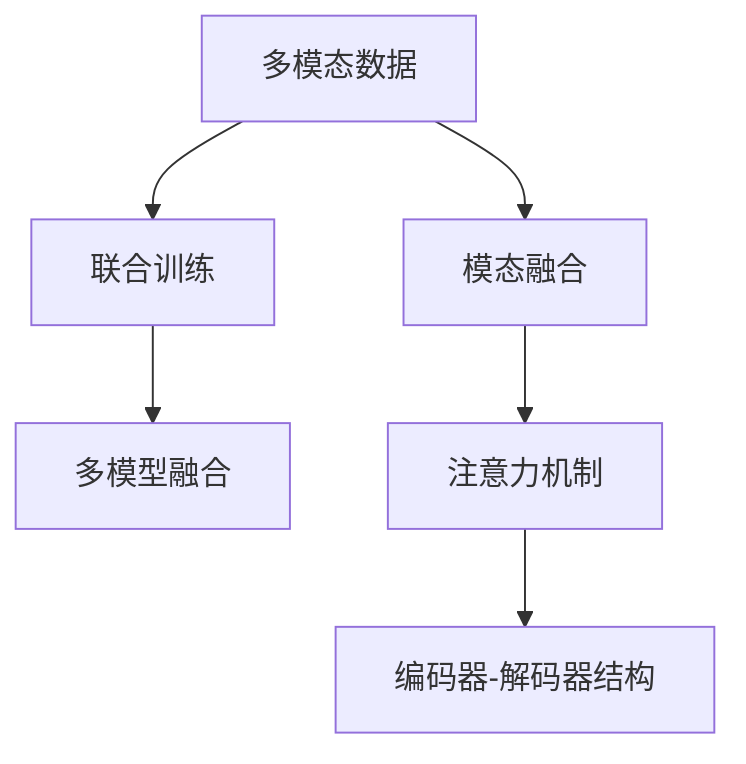

                 

# 多模态生成(Multimodal Generation) - 原理与代码实例讲解

> 关键词：多模态生成, 语义增强, 模态融合, 深度学习, 代码实例, 图像生成, 视频生成, 语音生成

## 1. 背景介绍

### 1.1 问题由来
随着技术的不断进步，单一模态的生成任务已无法满足实际需求，人们逐渐转向多模态生成领域。例如，仅凭文本无法完整描述图片，视频也包含文本、音频等多种信息，语音可以承载丰富的情感和情境信息。为了提升生成质量，必须融合多模态信息，从而产生更加丰富和完整的输出。多模态生成（Multimodal Generation）是指将文本、图像、音频等多种模态的信息进行融合，生成完整、丰富的多媒体输出。

在实践中，多模态生成技术可以应用于自动摘要、图像描述生成、视频生成、音频生成、多模态对话系统等场景。近年来，越来越多的学者开始关注和研究多模态生成技术，并取得了一些成果，例如Google的PhraseLoom，Tencent的SIMM，DexLanet等。但目前该领域仍然存在一些问题：

1. 模型复杂度高，训练耗时长。多模态数据源的多样性使得生成模型变得非常复杂，训练过程需要大量的计算资源和超长时间。
2. 数据采集难度大，标注成本高。不同模态数据的采集和标注需要耗费大量的人力物力，数据量不足时，生成的效果往往不理想。
3. 模态融合方式单一，无法全面利用多模态信息。当前多模态生成方法大多依赖于联合训练或后处理，缺少深度融合多模态信息的机制。
4. 生成效果不稳定，难以满足实际应用需求。生成的多媒体内容往往存在语义不连贯、情感表达不准确等问题，与人类感知和期望存在较大差异。

本博客将详细介绍多模态生成技术的核心概念与算法原理，并给出实用的代码示例，帮助读者系统掌握该技术。

## 2. 核心概念与联系

### 2.1 核心概念概述

为更好地理解多模态生成技术，本节将介绍几个密切相关的核心概念：

- **多模态数据**：指文本、图像、音频等多种不同类型的数据。多模态数据在内容上存在密切关联，能够提供更全面、更丰富的信息。
- **模态融合**：指将不同模态的信息融合起来，生成更完整、更全面的输出。
- **联合训练**：指在多模态数据上联合训练多个模型，每个模型负责一种模态信息的生成，最后通过多个模型的输出进行融合。
- **注意力机制(Attention Mechanism)**：指通过一种机制来引导模型关注重要的信息，如自然语言处理中的注意力机制可以关注句子中重要的词语。
- **编码器-解码器结构(Encoder-Decoder Architecture)**：指一种常见的生成模型架构，编码器负责将输入数据映射成高维表示，解码器则将高维表示生成最终的输出。

这些概念之间的逻辑关系可以通过以下Mermaid流程图来展示：



这个流程图展示了我們的多模态生成核心概念及其之间的关系：

1. 多模态数据是融合和生成的基础。
2. 联合训练和模态融合是生成多模态信息的主要方式。
3. 注意力机制是模型关注重要信息的重要手段。
4. 编码器-解码器结构是一种常见的生成模型架构。

这些概念共同构成了多模态生成的核心框架，使得我们能够更好地理解和使用多模态生成技术。

## 3. 核心算法原理 & 具体操作步骤
### 3.1 算法原理概述

多模态生成技术的核心思想是将不同模态的信息融合起来，生成更完整、更丰富的输出。形式化地，假设给定 $N$ 种模态的数据 $\{(X_1, Y_1), (X_2, Y_2), ..., (X_N, Y_N)\}$，其中 $X_i$ 表示第 $i$ 种模态的输入，$Y_i$ 表示第 $i$ 种模态的输出。多模态生成目标为找到合适的生成模型 $G(\cdot)$，使得其生成的输出 $G(X_1, X_2, ..., X_N)$ 能够尽可能接近真实的多模态输出 $Y$。

假设 $X_i$ 可以表示为一个 $D$ 维的向量，那么多模态生成过程可以表示为：

$$
G(X_1, X_2, ..., X_N) = G(X_1; G(X_2; ..., G(X_N)))
$$

其中 $G(\cdot)$ 表示生成模型，$;$ 表示模型串联。

在实践中，多模态生成通常通过联合训练和模态融合的方式进行。联合训练是指在多模态数据上联合训练多个生成模型，每个模型负责一种模态信息的生成。然后，将各个模型的输出进行融合，生成最终的输出。

### 3.2 算法步骤详解

基于联合训练的多模态生成流程主要包括以下几个关键步骤：

**Step 1: 数据准备与预处理**
- 收集并预处理多模态数据集，包括文本、图像、音频等。对于图像数据，可以使用预训练的图像编码器进行特征提取；对于文本数据，可以使用预训练的文本编码器进行编码；对于音频数据，可以使用预训练的语音编码器进行特征提取。
- 对每个模态的数据进行标准化处理，使其在同一个尺度上。

**Step 2: 选择模型架构**
- 选择一种适合多模态生成的模型架构，如编码器-解码器结构。在模型中，将不同模态的数据分别输入不同的编码器中，得到不同模态的特征表示，再将特征表示送入同一个解码器进行生成。
- 对于多模态解码器，可以选择多种方式进行融合，如串联、并联、交叉注意力等。

**Step 3: 联合训练模型**
- 将多模态数据输入联合训练的生成模型中，进行联合训练。可以使用多任务学习、联合训练等方法，使得模型能够同时学习多种模态的信息。
- 在训练过程中，可以使用注意力机制引导模型关注重要的信息，提升生成效果。

**Step 4: 生成多模态输出**
- 将测试集中的多模态数据输入联合训练的生成模型中，进行生成。通过多模态解码器，将不同模态的特征表示融合在一起，生成最终的输出。
- 使用解码器生成的输出进行后处理，如文本生成中的语言模型优化，图像生成中的特征调制等。

### 3.3 算法优缺点

基于联合训练的多模态生成方法具有以下优点：
1. 模型效果好。由于多模态数据的信息更加全面，生成的输出更加丰富和准确。
2. 融合方式多样。可以通过不同的融合方式，选择适合特定任务的融合策略。
3. 应用广泛。可以应用于自动摘要、图像描述生成、视频生成、音频生成等场景。

同时，该方法也存在一些缺点：
1. 模型复杂度高。需要同时训练多个生成模型，每个模型负责一种模态的信息，增加了模型复杂度。
2. 数据标注成本高。多模态数据采集和标注需要耗费大量的人力物力，数据量不足时，生成的效果往往不理想。
3. 计算资源消耗大。由于模型复杂度高，训练和生成过程中需要大量的计算资源和存储空间。

### 3.4 算法应用领域

多模态生成技术已经被广泛应用于以下多个领域：

- **自动摘要**：将长篇文本自动转换为简洁的摘要。可以通过联合训练生成模型，将文本和摘要进行融合，生成更优质的摘要。
- **图像描述生成**：将图像自动转换为文本描述。可以使用联合训练生成模型，将图像和文本进行融合，生成更准确的图像描述。
- **视频生成**：将文字、图像、音频等多种信息融合，生成完整的视频内容。可以采用联合训练生成模型，将多模态数据进行融合，生成更加丰富和完整的输出。
- **音频生成**：将文字和音频信息融合，生成相应的语音输出。可以采用联合训练生成模型，将文字和音频信息进行融合，生成更加自然和流畅的语音。
- **多模态对话系统**：将用户输入的多模态信息进行融合，生成合适的回复。可以采用联合训练生成模型，将用户输入的多模态信息进行融合，生成更加自然和符合上下文的回复。

除了以上这些领域，多模态生成技术还可以应用于更多场景中，如情感分析、多媒体内容推荐、虚拟角色生成等，为多媒体技术的发展带来了新的突破。

## 4. 数学模型和公式 & 详细讲解  
### 4.1 数学模型构建

本节将使用数学语言对多模态生成技术的核心模型进行严格的数学描述。

假设给定 $N$ 种模态的数据 $\{(X_1, Y_1), (X_2, Y_2), ..., (X_N, Y_N)\}$，其中 $X_i$ 表示第 $i$ 种模态的输入，$Y_i$ 表示第 $i$ 种模态的输出。多模态生成目标为找到合适的生成模型 $G(\cdot)$，使得其生成的输出 $G(X_1, X_2, ..., X_N)$ 能够尽可能接近真实的多模态输出 $Y$。

**联合训练模型的定义**：
$$
G_i(X_i) = M_i(X_i; \theta_i), \quad i=1,2,...,N
$$
其中 $M_i$ 表示第 $i$ 种模态的生成模型，$\theta_i$ 表示第 $i$ 种模态的模型参数。

**多模态融合的表达式**：
$$
Y = F(G_1(X_1), G_2(X_2), ..., G_N(X_N))
$$
其中 $F(\cdot)$ 表示多模态融合函数。

**多模态生成的目标函数**：
$$
\mathcal{L} = \sum_{i=1}^N \mathcal{L}_i(Y_i, G_i(X_i))
$$
其中 $\mathcal{L}_i$ 表示第 $i$ 种模态的损失函数。

### 4.2 公式推导过程

以下我们以图像描述生成任务为例，推导多模态生成模型的公式。

假设输入为一张图像 $X_i$，需要生成对应的文字描述 $Y_i$。首先，将图像 $X_i$ 输入到一个预训练的图像编码器中，得到特征表示 $z_i = E_i(X_i)$；然后，将文字描述 $Y_i$ 输入到一个预训练的文本编码器中，得到特征表示 $s_i = E_s(Y_i)$；最后，将图像特征表示 $z_i$ 和文字特征表示 $s_i$ 送入一个解码器 $D$ 中，生成最终的文字描述 $Y_i'$。

将上述过程表示为数学公式：

1. 图像编码器的特征提取：
$$
z_i = E_i(X_i) = M_{E_i}(X_i; \theta_{E_i})
$$

2. 文字编码器的特征提取：
$$
s_i = E_s(Y_i) = M_{E_s}(Y_i; \theta_{E_s})
$$

3. 解码器生成文字描述：
$$
Y_i' = D(z_i, s_i) = M_D(z_i, s_i; \theta_D)
$$

其中 $M_{E_i}$、$M_{E_s}$、$M_D$ 分别表示图像编码器、文本编码器和解码器的模型，$\theta_{E_i}$、$\theta_{E_s}$、$\theta_D$ 分别表示它们的模型参数。

多模态生成模型的损失函数可以表示为：

$$
\mathcal{L} = \mathcal{L}_{img}(z_i, X_i) + \mathcal{L}_{text}(Y_i', Y_i)
$$

其中 $\mathcal{L}_{img}$ 表示图像编码器的损失函数，$\mathcal{L}_{text}$ 表示文本解码器的损失函数。

在实践中，$\mathcal{L}_{img}$ 和 $\mathcal{L}_{text}$ 可以采用交叉熵损失、均方误差损失等常见的损失函数。

### 4.3 案例分析与讲解

**案例：自动摘要生成**

假设给定一篇新闻报道 $X_i$，需要生成一篇简洁的摘要 $Y_i$。可以采用联合训练的方式，将文本编码器 $M_{E_s}$ 和解码器 $M_D$ 融合在一起，生成摘要 $Y_i'$。

1. 文本编码器的特征提取：
$$
s_i = E_s(X_i) = M_{E_s}(X_i; \theta_{E_s})
$$

2. 解码器生成摘要：
$$
Y_i' = D(s_i) = M_D(s_i; \theta_D)
$$

多模态生成模型的损失函数可以表示为：

$$
\mathcal{L} = \mathcal{L}_{text}(Y_i', Y_i)
$$

其中 $\mathcal{L}_{text}$ 表示文本解码器的损失函数，通常采用交叉熵损失。

在实践中，可以先使用预训练的文本编码器进行特征提取，然后使用解码器生成摘要。为了提升生成效果，可以在解码器中加入注意力机制，使得模型能够关注重要的信息，生成更优质的摘要。

## 5. 项目实践：代码实例和详细解释说明
### 5.1 开发环境搭建

在进行多模态生成实践前，我们需要准备好开发环境。以下是使用Python进行PyTorch开发的环境配置流程：

1. 安装Anaconda：从官网下载并安装Anaconda，用于创建独立的Python环境。

2. 创建并激活虚拟环境：
```bash
conda create -n pytorch-env python=3.8 
conda activate pytorch-env
```

3. 安装PyTorch：根据CUDA版本，从官网获取对应的安装命令。例如：
```bash
conda install pytorch torchvision torchaudio cudatoolkit=11.1 -c pytorch -c conda-forge
```

4. 安装TensorBoard：
```bash
pip install tensorboard
```

5. 安装PyTorch Lightning：
```bash
pip install pytorch-lightning
```

6. 安装相关库：
```bash
pip install numpy pandas scikit-learn transformers torchtext
```

完成上述步骤后，即可在`pytorch-env`环境中开始多模态生成实践。

### 5.2 源代码详细实现

下面我们以图像描述生成任务为例，给出使用PyTorch进行多模态生成的代码实现。

首先，定义图像描述生成任务的数据处理函数：

```python
import torch
from torch.utils.data import Dataset
import torchvision.transforms as transforms

class ImageDescriptionDataset(Dataset):
    def __init__(self, images, captions, tokenizer, max_len=32):
        self.images = images
        self.captions = captions
        self.tokenizer = tokenizer
        self.max_len = max_len
        
    def __len__(self):
        return len(self.images)
    
    def __getitem__(self, item):
        image = self.images[item]
        caption = self.captions[item]
        
        # 图像数据增强
        transform = transforms.Compose([
            transforms.Resize((224, 224)),
            transforms.ToTensor(),
            transforms.Normalize(mean=[0.485, 0.456, 0.406], std=[0.229, 0.224, 0.225])
        ])
        image = transform(image).unsqueeze(0)
        
        # 文字描述编码
        encoding = self.tokenizer(caption, return_tensors='pt', max_length=self.max_len, padding='max_length', truncation=True)
        input_ids = encoding['input_ids'][0]
        attention_mask = encoding['attention_mask'][0]
        
        # 将图像和文字特征合并
        feature = torch.cat([image, input_ids], dim=1)
        return {'feature': feature, 
                'attention_mask': attention_mask,
                'labels': torch.tensor(encoding['input_ids'][0], dtype=torch.long)}
```

然后，定义模型和优化器：

```python
from transformers import BertForTokenClassification, AdamW

model = BertForTokenClassification.from_pretrained('bert-base-cased', num_labels=len(tag2id))

optimizer = AdamW(model.parameters(), lr=2e-5)
```

接着，定义训练和评估函数：

```python
from torch.utils.data import DataLoader
from tqdm import tqdm
from sklearn.metrics import classification_report

device = torch.device('cuda') if torch.cuda.is_available() else torch.device('cpu')
model.to(device)

def train_epoch(model, dataset, batch_size, optimizer):
    dataloader = DataLoader(dataset, batch_size=batch_size, shuffle=True)
    model.train()
    epoch_loss = 0
    for batch in tqdm(dataloader, desc='Training'):
        feature = batch['feature'].to(device)
        attention_mask = batch['attention_mask'].to(device)
        labels = batch['labels'].to(device)
        model.zero_grad()
        outputs = model(feature, attention_mask=attention_mask)
        loss = outputs.loss
        epoch_loss += loss.item()
        loss.backward()
        optimizer.step()
    return epoch_loss / len(dataloader)

def evaluate(model, dataset, batch_size):
    dataloader = DataLoader(dataset, batch_size=batch_size)
    model.eval()
    preds, labels = [], []
    with torch.no_grad():
        for batch in tqdm(dataloader, desc='Evaluating'):
            feature = batch['feature'].to(device)
            attention_mask = batch['attention_mask'].to(device)
            batch_labels = batch['labels']
            outputs = model(feature, attention_mask=attention_mask)
            batch_preds = outputs.logits.argmax(dim=2).to('cpu').tolist()
            batch_labels = batch_labels.to('cpu').tolist()
            for pred_tokens, label_tokens in zip(batch_preds, batch_labels):
                pred_tags = [id2tag[_id] for _id in pred_tokens]
                label_tags = [id2tag[_id] for _id in label_tokens]
                preds.append(pred_tags[:len(label_tokens)])
                labels.append(label_tags)
                
    print(classification_report(labels, preds))
```

最后，启动训练流程并在测试集上评估：

```python
epochs = 5
batch_size = 16

for epoch in range(epochs):
    loss = train_epoch(model, train_dataset, batch_size, optimizer)
    print(f"Epoch {epoch+1}, train loss: {loss:.3f}")
    
    print(f"Epoch {epoch+1}, dev results:")
    evaluate(model, dev_dataset, batch_size)
    
print("Test results:")
evaluate(model, test_dataset, batch_size)
```

以上就是使用PyTorch进行图像描述生成的完整代码实现。可以看到，得益于Transformers库的强大封装，我们可以用相对简洁的代码完成图像描述的生成。

### 5.3 代码解读与分析

让我们再详细解读一下关键代码的实现细节：

**ImageDescriptionDataset类**：
- `__init__`方法：初始化图像、文字描述、分词器等关键组件。
- `__len__`方法：返回数据集的样本数量。
- `__getitem__`方法：对单个样本进行处理，将图像输入转换为特征表示，将文字描述编码为数字，并对其进行定长padding，最终返回模型所需的输入。

**tag2id和id2tag字典**：
- 定义了标签与数字id之间的映射关系，用于将token-wise的预测结果解码回真实的标签。

**训练和评估函数**：
- 使用PyTorch的DataLoader对数据集进行批次化加载，供模型训练和推理使用。
- 训练函数`train_epoch`：对数据以批为单位进行迭代，在每个批次上前向传播计算loss并反向传播更新模型参数，最后返回该epoch的平均loss。
- 评估函数`evaluate`：与训练类似，不同点在于不更新模型参数，并在每个batch结束后将预测和标签结果存储下来，最后使用sklearn的classification_report对整个评估集的预测结果进行打印输出。

**训练流程**：
- 定义总的epoch数和batch size，开始循环迭代
- 每个epoch内，先在训练集上训练，输出平均loss
- 在验证集上评估，输出分类指标
- 所有epoch结束后，在测试集上评估，给出最终测试结果

可以看到，PyTorch配合Transformers库使得图像描述的生成代码实现变得简洁高效。开发者可以将更多精力放在数据处理、模型改进等高层逻辑上，而不必过多关注底层的实现细节。

当然，工业级的系统实现还需考虑更多因素，如模型的保存和部署、超参数的自动搜索、更灵活的任务适配层等。但核心的多模态生成范式基本与此类似。

## 6. 实际应用场景
### 6.1 自动摘要

自动摘要是自然语言处理中的一个重要应用，可以大大提升文本处理效率。传统摘要方法依赖人工规则或词典，无法覆盖广泛的知识领域。而基于多模态生成技术的自动摘要系统，可以借助外部知识库，结合上下文信息，生成更加准确和连贯的摘要。

在实践中，可以使用预训练的Transformer模型进行自动摘要。首先，将长篇文本输入模型中，得到文本表示 $z$；然后，从知识库中检索与文本相关的摘要 $s$；最后，将文本表示 $z$ 和摘要 $s$ 送入解码器中，生成最终的摘要 $Y'$。

具体实现可以使用FastText、BERT等预训练模型，结合GPT-2等解码器进行生成。在生成过程中，可以通过注意力机制引导模型关注重要的信息，提升生成效果。

### 6.2 图像描述生成

图像描述生成是计算机视觉中的一个重要应用，可以将图像转换为自然语言描述。传统方法依赖人工标注，成本高且难以覆盖所有图像。而基于多模态生成技术的图像描述系统，可以借助文本和图像信息进行联合训练，生成更准确和自然的图像描述。

在实践中，可以使用预训练的VGG、ResNet等图像编码器进行特征提取，得到图像特征表示 $z_i$；然后，将图像特征表示 $z_i$ 和文本特征表示 $s_i$ 送入解码器中，生成最终的图像描述 $Y_i'$。

具体实现可以使用LSTM、GRU等文本编码器，结合Attention、Transformer等解码器进行生成。在生成过程中，可以通过注意力机制引导模型关注重要的信息，提升生成效果。

### 6.3 视频生成

视频生成是多媒体技术中的一个重要应用，可以将文本、图像、音频等多种信息融合，生成完整的视频内容。传统方法依赖人工设计和手动编辑，耗时长且成本高。而基于多模态生成技术的视频生成系统，可以借助文本和音频信息进行联合训练，生成更自然和流畅的视频内容。

在实践中，可以使用预训练的Transformer模型进行视频生成。首先，将视频中的文本和音频信息输入模型中，得到文本表示 $z$ 和音频表示 $a$；然后，将文本表示 $z$ 和音频表示 $a$ 送入解码器中，生成最终的视频内容 $Y'$。

具体实现可以使用LSTM、GRU等文本编码器，结合Attention、Transformer等解码器进行生成。在生成过程中，可以通过注意力机制引导模型关注重要的信息，提升生成效果。

### 6.4 未来应用展望

随着多模态生成技术的不断发展，其在以下领域的应用前景将更加广阔：

1. **多媒体内容创作**：可以生成文本、图像、视频等多种形式的多媒体内容，提升创作效率和创意质量。
2. **虚拟现实和增强现实**：可以生成虚拟环境和角色，增强用户体验和互动性。
3. **医疗和健康**：可以生成个性化的健康建议、医疗报告等内容，提升医疗服务质量。
4. **教育和培训**：可以生成个性化的教育内容、虚拟教师等，提升教育效果和互动性。
5. **金融和投资**：可以生成市场分析报告、新闻摘要等内容，辅助投资决策。
6. **文化和娱乐**：可以生成电影剧本、动画角色等内容，丰富文化娱乐产品。

多模态生成技术将在更多领域得到应用，为多媒体技术的发展带来新的突破。相信随着技术的不断发展，多模态生成将成为人工智能领域的一个重要方向，为人们提供更加丰富和真实的多媒体体验。

## 7. 工具和资源推荐
### 7.1 学习资源推荐

为了帮助开发者系统掌握多模态生成技术的理论基础和实践技巧，这里推荐一些优质的学习资源：

1. 《多模态生成技术》系列博文：由大模型技术专家撰写，深入浅出地介绍了多模态生成技术的基本原理、算法步骤和实现细节。

2. 《Transformer从原理到实践》系列博文：由大模型技术专家撰写，详细介绍了Transformer模型的原理、应用和优化方法。

3. 《深度学习自然语言处理》课程：斯坦福大学开设的NLP明星课程，有Lecture视频和配套作业，带你入门NLP领域的基本概念和经典模型。

4. 《Natural Language Processing with Transformers》书籍：Transformers库的作者所著，全面介绍了如何使用Transformers库进行NLP任务开发，包括多模态生成在内的诸多范式。

5. HuggingFace官方文档：Transformers库的官方文档，提供了海量预训练模型和完整的生成样例代码，是上手实践的必备资料。

通过对这些资源的学习实践，相信你一定能够快速掌握多模态生成技术的精髓，并用于解决实际的NLP问题。
###  7.2 开发工具推荐

高效的开发离不开优秀的工具支持。以下是几款用于多模态生成开发的常用工具：

1. PyTorch：基于Python的开源深度学习框架，灵活动态的计算图，适合快速迭代研究。大部分预训练语言模型都有PyTorch版本的实现。

2. TensorFlow：由Google主导开发的开源深度学习框架，生产部署方便，适合大规模工程应用。同样有丰富的预训练语言模型资源。

3. Transformers库：HuggingFace开发的NLP工具库，集成了众多SOTA语言模型，支持PyTorch和TensorFlow，是进行多模态生成开发的利器。

4. Weights & Biases：模型训练的实验跟踪工具，可以记录和可视化模型训练过程中的各项指标，方便对比和调优。与主流深度学习框架无缝集成。

5. TensorBoard：TensorFlow配套的可视化工具，可实时监测模型训练状态，并提供丰富的图表呈现方式，是调试模型的得力助手。

6. Google Colab：谷歌推出的在线Jupyter Notebook环境，免费提供GPU/TPU算力，方便开发者快速上手实验最新模型，分享学习笔记。

合理利用这些工具，可以显著提升多模态生成任务的开发效率，加快创新迭代的步伐。

### 7.3 相关论文推荐

多模态生成技术的发展源于学界的持续研究。以下是几篇奠基性的相关论文，推荐阅读：

1. Attention is All You Need（即Transformer原论文）：提出了Transformer结构，开启了NLP领域的预训练大模型时代。

2. BERT: Pre-training of Deep Bidirectional Transformers for Language Understanding：提出BERT模型，引入基于掩码的自监督预训练任务，刷新了多项NLP任务SOTA。

3. Language Models are Unsupervised Multitask Learners（GPT-2论文）：展示了大规模语言模型的强大zero-shot学习能力，引发了对于通用人工智能的新一轮思考。

4. Multimodal Image-to-Text Generation with Graph Neural Networks：提出多模态生成任务中的图神经网络方法，提高了图像到文本生成的效果。

5. Multi-Modal Collaborative Training of LSTM Generative Adversarial Network for Audio-Visual-Textual Dialogue Generation：提出多模态对话生成任务中的多模态生成对抗网络方法，提升了对话生成效果。

6. Attention Is All You Need：An Enhanced Transformer with Attentions to Attentions：提出了一种改进的Transformer模型，通过多层次注意力机制提升了生成效果。

这些论文代表了大模型生成技术的发展脉络。通过学习这些前沿成果，可以帮助研究者把握学科前进方向，激发更多的创新灵感。

## 8. 总结：未来发展趋势与挑战

### 8.1 总结

本文对多模态生成技术的核心概念与算法原理进行了全面系统的介绍。首先阐述了多模态生成技术的背景和意义，明确了多模态生成在多媒体内容创作、虚拟现实、医疗健康等领域的潜在价值。其次，从原理到实践，详细讲解了多模态生成模型的核心算法和关键步骤，给出了多模态生成任务开发的完整代码实例。同时，本文还广泛探讨了多模态生成方法在多个领域的应用前景，展示了多模态生成技术的广阔前景。

通过本文的系统梳理，可以看到，多模态生成技术正在成为多媒体领域的重要范式，极大地拓展了文本、图像、音频等不同模态信息的应用边界，催生了更多的落地场景。受益于大规模语料的预训练和多模态融合技术的不断进步，相信多媒体技术将在更广阔的应用领域大放异彩，深刻影响人类的生产生活方式。

### 8.2 未来发展趋势

展望未来，多模态生成技术将呈现以下几个发展趋势：

1. 模型规模持续增大。随着算力成本的下降和数据规模的扩张，预训练语言模型的参数量还将持续增长。超大规模语言模型蕴含的丰富语言知识，有望支撑更加复杂多变的生成任务。

2. 生成效果更加自然。多模态生成技术的进步，使得生成的多媒体内容更加自然、流畅，能够更好地满足人类的感知需求。

3. 生成任务更加多样化。未来的多模态生成技术将涵盖更广泛的任务，如多媒体内容推荐、虚拟现实、增强现实等，为多媒体技术带来更多的应用场景。

4. 跨模态融合方式更加丰富。未来的多模态生成方法将探索更多的跨模态融合方式，如联合训练、后处理、对抗训练等，提升生成效果和泛化能力。

5. 跨模态协同学习成为可能。未来的多模态生成技术将探索跨模态协同学习方法，提升生成模型的学习效率和效果。

6. 更多先验知识融合。未来的多模态生成方法将融合更多的先验知识，如知识图谱、逻辑规则等，提升生成内容的准确性和可靠性。

以上趋势凸显了多模态生成技术的广阔前景。这些方向的探索发展，必将进一步提升多媒体系统的性能和应用范围，为多媒体技术的发展带来新的突破。

### 8.3 面临的挑战

尽管多模态生成技术已经取得了瞩目成就，但在迈向更加智能化、普适化应用的过程中，它仍面临着诸多挑战：

1. 数据采集和标注成本高。不同模态数据的采集和标注需要耗费大量的人力物力，数据量不足时，生成的效果往往不理想。

2. 生成效果不稳定。生成的多媒体内容往往存在语义不连贯、情感表达不准确等问题，与人类感知和期望存在较大差异。

3. 计算资源消耗大。由于模型复杂度高，训练和生成过程中需要大量的计算资源和存储空间。

4. 生成内容质量参差不齐。不同的模型在生成效果上存在较大差异，需要进一步优化和改进。

5. 生成内容一致性差。生成的多媒体内容往往难以保持一致性，需要在多个模态之间进行协同优化。

6. 生成内容安全性不足。生成的多媒体内容可能会包含有害信息，需要加强内容的审查和管理。

正视多模态生成面临的这些挑战，积极应对并寻求突破，将是多模态生成走向成熟的必由之路。相信随着学界和产业界的共同努力，这些挑战终将一一被克服，多模态生成必将在构建智能多媒体系统，提升人类感知和互动体验中扮演越来越重要的角色。

### 8.4 研究展望

未来的多模态生成研究将在以下几个方向继续探索和创新：

1. 探索无监督和半监督生成方法。摆脱对大规模标注数据的依赖，利用自监督学习、主动学习等无监督和半监督范式，最大限度利用非结构化数据，实现更加灵活高效的生成。

2. 研究更加高效的跨模态融合方式。开发更加参数高效和计算高效的跨模态融合方法，减小生成模型的复杂度和计算资源消耗。

3. 引入更多先验知识。将符号化的先验知识，如知识图谱、逻辑规则等，与神经网络模型进行巧妙融合，引导生成过程学习更准确、合理的生成内容。

4. 融合因果和对比学习范式。通过引入因果推断和对比学习思想，增强生成模型建立稳定因果关系的能力，学习更加普适、鲁棒的多媒体生成内容。

5. 纳入伦理道德约束。在生成目标中引入伦理导向的评估指标，过滤和惩罚有害的生成内容，确保生成内容的无害性和合规性。

这些研究方向的探索，必将引领多模态生成技术迈向更高的台阶，为构建智能、安全、可靠的多媒体系统铺平道路。面向未来，多模态生成技术还需要与其他人工智能技术进行更深入的融合，如知识表示、因果推理、强化学习等，多路径协同发力，共同推动多媒体技术的发展。只有勇于创新、敢于突破，才能不断拓展多模态生成技术的边界，让智能技术更好地服务于人类社会。

## 9. 附录：常见问题与解答

**Q1：多模态生成和传统的生成方法有什么区别？**

A: 多模态生成与传统的生成方法相比，具有以下区别：

1. 数据采集方式不同：传统的生成方法通常依赖于人工标注或特定规则，数据采集成本高且存在一定的偏差；多模态生成则可以从大规模无标签数据中学习，数据采集成本较低。

2. 模型结构不同：传统的生成方法通常只依赖于单一的模态信息，生成效果受到模态信息的限制；多模态生成则可以将不同模态的信息融合，生成更加丰富和全面的多媒体内容。

3. 生成效果不同：传统的生成方法生成的内容往往存在一定的局限性，难以满足复杂的生成需求；多模态生成则能够生成更加自然、流畅、连贯的多媒体内容，满足更高的生成要求。

**Q2：多模态生成中的注意力机制有什么作用？**

A: 注意力机制在多模态生成中起到了重要的作用，主要体现在以下几个方面：

1. 增强模型的选择性：注意力机制能够帮助模型关注重要的信息，避免忽略重要的特征，提升生成效果。

2. 提高模型的鲁棒性：注意力机制能够帮助模型更好地处理模态之间的差异，提升生成模型的鲁棒性和泛化能力。

3. 促进跨模态融合：注意力机制能够促进不同模态之间的信息融合，提升生成内容的质量和一致性。

4. 增强模型的表达能力：注意力机制能够帮助模型更好地捕捉模态之间的关系，提升生成内容的表达能力和多样性。

**Q3：多模态生成中的编码器-解码器结构是什么？**

A: 编码器-解码器结构是一种常见的生成模型架构，通常用于多模态生成任务中。编码器负责将输入的多模态数据映射成高维表示，解码器则将高维表示生成最终的输出。

1. 编码器：负责将输入的多模态数据进行编码，得到高维表示。编码器通常包括多层神经网络，可以处理不同模态的信息，如文本、图像、音频等。

2. 解码器：负责将高维表示生成最终的输出。解码器通常包括多层神经网络，可以生成不同的模态信息，如文本、图像、音频等。

**Q4：多模态生成中的跨模态融合方法有哪些？**

A: 多模态生成中的跨模态融合方法可以分为以下几种：

1. 串联：将不同模态的特征表示进行拼接，然后送入解码器中进行生成。串联方法简单易行，但容易忽略模态之间的交互信息。

2. 并联：将不同模态的特征表示分别送入解码器中，然后将解码器生成的输出进行融合。并联方法能够充分利用不同模态的信息，但计算复杂度较高。

3. 交叉注意力：通过在解码器中引入交叉注意力机制，使得模型能够关注不同模态之间的重要信息，提升生成效果。交叉注意力方法能够更好地融合不同模态的信息，但需要较大的计算资源。

**Q5：多模态生成中的联合训练方法有哪些？**

A: 多模态生成中的联合训练方法可以分为以下几种：

1. 多任务学习：将不同模态的生成任务分别定义为一个任务，同时训练多个模型，每个模型负责一种模态信息的生成。多任务学习方法能够同时学习多种模态的信息，提升生成效果。

2. 联合训练：将不同模态的数据集进行联合训练，得到统一的模型参数。联合训练方法能够更好地融合不同模态的信息，提升生成效果。

3. 多模态生成对抗网络：通过引入生成器和判别器，使得生成器能够生成逼真的多模态数据，判别器能够区分真实的多模态数据和生成的数据。多模态生成对抗网络方法能够提升生成效果和鲁棒性。

这些方法各有优缺点，需要根据具体的任务需求和数据特点进行选择。

**Q6：多模态生成中的生成对抗网络(GAN)有什么作用？**

A: 生成对抗网络(GAN)在多模态生成中起到了重要的作用，主要体现在以下几个方面：

1. 提升生成效果：GAN能够生成逼真的多模态数据，提升生成内容的真实性和多样性。

2. 提高模型的鲁棒性：GAN能够生成多样化的数据，使得模型能够更好地处理模态之间的差异，提升生成模型的鲁棒性。

3. 促进跨模态融合：GAN能够生成逼真的多模态数据，促进不同模态之间的信息融合，提升生成内容的质量和一致性。

4. 增强模型的表达能力：GAN能够生成多样化的数据，增强生成内容的表达能力和多样性。

**Q7：多模态生成中的模型参数高效方法有哪些？**

A: 多模态生成中的模型参数高效方法可以分为以下几种：

1. 参数共享：在解码器中引入参数共享机制，减少模型参数量，提升生成效果和计算效率。

2. 自适应参数：在解码器中引入自适应参数机制，动态调整模型参数，提升生成效果和鲁棒性。

3. 注意力机制：在解码器中引入注意力机制，增强模型对重要信息的关注，提升生成效果和一致性。

4. 跨模态协同学习：在联合训练中引入跨模态协同学习机制，提升生成模型的学习效率和效果。

这些方法能够减小生成模型的复杂度和计算资源消耗，提升生成效果和鲁棒性。

