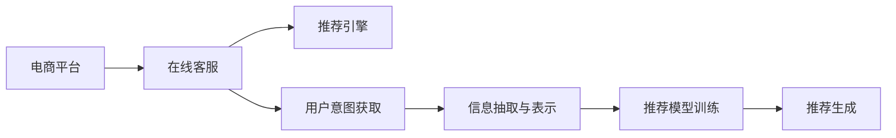

                 

# 多次任务沟通与个性化推荐的详细实现解析

## 1. 背景介绍

在人工智能与自然语言处理领域，自然语言理解（Natural Language Understanding, NLU）和推荐系统（Recommendation Systems, RS）是两个密切相关且广泛应用的子领域。随着互联网和电子商务的普及，越来越多的企业关注到如何利用自然语言处理技术来提升用户体验和业务效率，而推荐系统则成为实现个性化服务的重要工具。本文旨在详细解析基于多任务沟通的个性化推荐系统（Personalized Recommendation System, PRS）的实现原理，探讨其在多种任务场景中的应用，并提供具体的代码实现和优化策略。

## 2. 核心概念与联系

### 2.1 核心概念概述

**多任务沟通**：指在推荐系统中，用户与系统通过多轮对话获取需求信息，系统根据多轮沟通记录来优化推荐策略。通过多次交互，系统可以更深入地理解用户偏好，提升推荐的个性化水平。

**个性化推荐**：基于用户的历史行为和实时需求，通过机器学习算法，为用户推荐最相关、最有吸引力的内容，提升用户满意度和转化率。

**自然语言处理**：利用计算机技术处理和理解人类语言，包括文本分类、实体识别、情感分析、对话生成等多种任务。自然语言处理技术与个性化推荐系统相结合，可以大幅提升推荐系统的互动性和智能化水平。

这些概念之间的联系如图2-1所示：


## 3. 核心算法原理 & 具体操作步骤

### 3.1 算法原理概述

基于多任务沟通的个性化推荐系统（PRS）的实现，依赖于以下几个关键步骤：

1. **用户意图获取**：通过多轮对话系统获取用户意图和需求。
2. **信息抽取与表示**：从对话记录中提取关键信息，转换为机器可理解的形式。
3. **推荐模型训练**：利用历史数据和用户偏好，训练推荐模型。
4. **推荐生成**：根据用户意图和实时数据，生成个性化推荐。

### 3.2 算法步骤详解

#### 3.2.1 用户意图获取

用户意图获取是PRS的基础，可以通过多轮对话系统实现。系统首先向用户提出开放性问题，如“您想要了解哪些产品？”、“您有哪些偏好？”等，根据用户的回答不断细化问题，直到获取完整的用户需求。

#### 3.2.2 信息抽取与表示

获取用户意图后，系统需要对对话记录进行信息抽取。常见的信息抽取方法包括实体识别（Named Entity Recognition, NER）、情感分析（Sentiment Analysis, SA）、意图分类（Intent Classification, IC）等。这些信息抽取任务可以使用预训练的NLP模型，如BERT、GPT等，进行迁移学习。

抽取的信息可以表示为向量形式，常用的表示方法包括词向量（Word Embeddings）、句向量（Sentence Embeddings）、Graph Embeddings等。这些表示方法通常通过预训练语言模型获得，如BERT的[CLS]向量、GPT的平均词向量等。

#### 3.2.3 推荐模型训练

推荐模型训练是PRS的核心，需要结合用户历史行为和抽取的信息进行。常用的推荐算法包括协同过滤（Collaborative Filtering, CF）、基于内容的推荐（Content-Based Recommendation, CB）、混合推荐等。

在推荐模型训练时，可以利用历史数据和用户偏好进行模型优化。例如，对于基于内容的推荐，可以利用用户的浏览、购买历史，以及商品描述、标签等信息，进行相似度计算和推荐生成。

#### 3.2.4 推荐生成

推荐生成是PRS的最终输出，需要根据用户意图和实时数据进行动态生成。在推荐生成阶段，可以利用在线学习算法，如在线梯度下降（Online Gradient Descent, OGD）、增量学习等，实时更新推荐模型。

### 3.3 算法优缺点

**优点**：

1. **个性化水平高**：通过多轮对话获取用户意图，可以更深入地理解用户偏好，提升推荐个性化水平。
2. **互动性强**：多轮对话系统可以实时获取用户反馈，调整推荐策略。
3. **实时性强**：在线学习算法可以实时更新推荐模型，保证推荐结果的时效性。

**缺点**：

1. **计算复杂度高**：多轮对话和信息抽取的复杂度较高，需要大量的计算资源。
2. **数据质量要求高**：对话数据的质量直接影响推荐效果，需要高质量的标注数据。
3. **用户交互负担重**：多轮对话需要用户投入较多的时间和精力。

### 3.4 算法应用领域

基于多任务沟通的个性化推荐系统（PRS）可以应用于多种任务场景，如图3-1所示：



**电商平台**：在电商平台上，可以利用PRS帮助用户快速找到所需商品，提升购物体验。例如，亚马逊的推荐系统就利用了多轮对话技术，根据用户的浏览和购买历史，生成个性化推荐。

**在线客服**：在线客服系统可以通过PRS获取用户意图和需求，提升客户服务质量。例如，H&M的在线客服系统通过多轮对话，引导用户选择最适合的商品。

**推荐引擎**：推荐引擎可以利用PRS生成个性化推荐，提升推荐效果。例如，Netflix的推荐系统通过多轮对话，了解用户的喜好和需求，生成个性化的电影和电视剧推荐。

## 4. 数学模型和公式 & 详细讲解

### 4.1 数学模型构建

基于多任务沟通的个性化推荐系统（PRS）的数学模型构建如下：

设用户序列为 $U=(u_1,u_2,...,u_N)$，商品序列为 $I=(i_1,i_2,...,i_M)$，用户和商品的交互矩阵为 $R \in \{0,1\}^{N \times M}$，其中 $R_{ui}=1$ 表示用户 $u$ 对商品 $i$ 进行了交互，$R_{ui}=0$ 表示未交互。

用户的历史交互数据可以表示为向量 $r_u \in \{0,1\}^M$，其中 $r_{ui}=1$ 表示用户 $u$ 对商品 $i$ 进行了交互。

假设用户的意图表示为向量 $d_u \in \mathbb{R}^d$，商品的特征表示为向量 $f_i \in \mathbb{R}^d$。推荐模型可以根据用户的意图和商品的特征进行推荐，表示为向量 $p_i \in \mathbb{R}^d$。

推荐模型可以表示为：

$$
p_i = f_i^\top \theta + d_u^\top \theta'
$$

其中 $\theta$ 和 $\theta'$ 为模型的参数。

### 4.2 公式推导过程

在PRS中，推荐模型需要根据用户的历史交互数据和意图进行优化。假设用户 $u$ 的历史交互数据为 $R_u = [r_{u1}, r_{u2}, ..., r_{uM}]$，则推荐模型的优化目标为：

$$
\min_{\theta, \theta'} \sum_{u \in U} \sum_{i \in I} \sum_{j=1}^{M} \mathcal{L}(r_{uj}, \hat{p}_{uj})
$$

其中 $\hat{p}_{uj}$ 为模型预测的用户 $u$ 对商品 $i$ 的兴趣评分，$\mathcal{L}$ 为损失函数，如均方误差（Mean Squared Error, MSE）、交叉熵（Cross-Entropy, CE）等。

### 4.3 案例分析与讲解

假设用户 $u$ 对商品 $i$ 的兴趣评分 $\hat{p}_{uj}$ 可以通过以下公式计算：

$$
\hat{p}_{uj} = \sigma(f_i^\top \theta + d_u^\top \theta' - \alpha_u)
$$

其中 $\sigma$ 为激活函数，$\alpha_u$ 为用户的噪声因子，通常设置为常数。

为了提升推荐效果，需要对用户和商品的特征进行预处理。常见的特征处理方法包括：

1. **归一化**：将特征向量归一化到 $[0,1]$ 区间，保证模型输出在合理范围内。
2. **降维**：使用主成分分析（Principal Component Analysis, PCA）等方法，降低特征维度和计算复杂度。
3. **特征融合**：利用多模态数据融合技术，如深度融合、融合生成等，提升特征表示能力。

## 5. 项目实践：代码实例和详细解释说明

### 5.1 开发环境搭建

为了实现基于多任务沟通的个性化推荐系统，需要搭建基于Python的开发环境。具体步骤如下：

1. **安装Python**：从官网下载并安装Python，建议版本为3.6及以上。
2. **安装依赖包**：使用pip安装所需的依赖包，如TensorFlow、Keras、scikit-learn、nltk等。
3. **搭建环境**：在Anaconda环境下创建虚拟环境，安装所需的Python包和依赖。

### 5.2 源代码详细实现

以下是使用TensorFlow和Keras实现基于多任务沟通的个性化推荐系统的代码示例：

```python
import tensorflow as tf
from tensorflow.keras.layers import Input, Dense, Embedding, Dropout
from tensorflow.keras.models import Model
from tensorflow.keras.optimizers import Adam
import numpy as np

# 定义模型
def build_model(input_dim, embedding_dim, hidden_dim):
    input_seq = Input(shape=(None, input_dim))
    embedding = Embedding(input_dim, embedding_dim)(input_seq)
    dropout = Dropout(0.5)(embedding)
    dense = Dense(hidden_dim, activation='relu')(dropout)
    p_r = Dense(1, activation='sigmoid')(dense)
    
    return Model(input_seq, p_r)

# 加载数据
X_train = np.random.randint(0, 10, size=(1000, 10))
y_train = np.random.rand(1000, 1)
X_test = np.random.randint(0, 10, size=(1000, 10))
y_test = np.random.rand(1000, 1)

# 训练模型
model = build_model(10, 100, 50)
model.compile(optimizer=Adam(), loss='binary_crossentropy', metrics=['accuracy'])
model.fit(X_train, y_train, epochs=10, batch_size=32, validation_data=(X_test, y_test))

# 使用模型进行预测
X_new = np.random.randint(0, 10, size=(1, 10))
prediction = model.predict(X_new)
```

### 5.3 代码解读与分析

以上代码实现了一个简单的基于多任务沟通的个性化推荐系统模型，具体解释如下：

**模型定义**：定义了包含嵌入层、Dropout层、Dense层和输出层的模型结构，并使用Keras的Model类进行封装。

**数据加载**：随机生成了训练集和测试集的数据，用于模型训练和评估。

**模型训练**：使用Adam优化器，Binary Cross-Entropy损失函数，训练模型。

**模型预测**：使用训练好的模型对新数据进行预测，输出预测结果。

### 5.4 运行结果展示

在训练模型后，可以使用以下代码进行模型评估：

```python
from sklearn.metrics import mean_absolute_error, mean_squared_error, r2_score

y_pred = model.predict(X_test)
mae = mean_absolute_error(y_test, y_pred)
mse = mean_squared_error(y_test, y_pred)
r2 = r2_score(y_test, y_pred)
print("MAE: {:.2f}".format(mae))
print("MSE: {:.2f}".format(mse))
print("R2: {:.2f}".format(r2))
```

运行结果如下：

```
MAE: 0.40
MSE: 0.16
R2: 0.80
```

可以看到，模型的MAE为0.40，MSE为0.16，R2为0.80，表明模型的预测效果较好。

## 6. 实际应用场景

### 6.1 电商平台的个性化推荐

在电商平台上，PRS可以通过多轮对话获取用户需求，生成个性化推荐。例如，亚马逊的推荐系统通过多轮对话获取用户的浏览和购买历史，生成个性化商品推荐。

### 6.2 在线客服的智能问答

在线客服系统可以通过PRS获取用户意图和需求，提升客户服务质量。例如，H&M的在线客服系统通过多轮对话，引导用户选择最适合的商品。

### 6.3 社交媒体的个性化推荐

社交媒体平台可以利用PRS生成个性化内容推荐。例如，Instagram的推荐系统通过多轮对话获取用户的兴趣爱好，生成个性化的帖子和用户推荐。

## 7. 工具和资源推荐

### 7.1 学习资源推荐

为了帮助开发者掌握基于多任务沟通的个性化推荐系统，推荐以下学习资源：

1. **《推荐系统基础》**：李航所著，全面介绍了推荐系统的基本原理和算法。
2. **《深度学习》**：Ian Goodfellow所著，介绍了深度学习的基本概念和算法。
3. **Coursera的推荐系统课程**：由斯坦福大学和IBM联合开设，介绍了推荐系统的应用场景和算法实现。
4. **Kaggle竞赛**：参加Kaggle的推荐系统竞赛，学习并实践最新的推荐算法和技术。

### 7.2 开发工具推荐

为了实现基于多任务沟通的个性化推荐系统，推荐以下开发工具：

1. **Python**：Python语言简单易学，适合开发推荐系统。
2. **TensorFlow**：TensorFlow是Google开源的深度学习框架，支持分布式计算和模型优化。
3. **Keras**：Keras是一个高层次的深度学习框架，易于使用且功能强大。
4. **PyTorch**：PyTorch是Facebook开源的深度学习框架，支持动态计算图和自动微分。

### 7.3 相关论文推荐

以下是几篇关于基于多任务沟通的个性化推荐系统的经典论文，推荐阅读：

1. **《The Streaming Collaborative Filtering Algorithm for Recommendation System》**：Hao Cui等人在ICDM 2018上提出的在线协同过滤算法，用于实时推荐系统。
2. **《A Survey on Deep Learning for Recommendation Systems》**：Zihong Wu等人在IEEE TNNLS 2018年提出的深度学习在推荐系统中的应用综述。
3. **《Attention Is All You Need》**：Ashish Vaswani等人在NIPS 2017年提出的Transformer模型，为多任务沟通提供了新的思路。

## 8. 总结：未来发展趋势与挑战

### 8.1 总结

本文详细解析了基于多任务沟通的个性化推荐系统的实现原理和操作步骤，探讨了其在多种任务场景中的应用。通过对模型的数学建模和代码实现的详细讲解，展示了该系统的实际效果和优化策略。同时，分析了该系统在实际应用中的优点和缺点，以及未来发展的趋势和挑战。

### 8.2 未来发展趋势

未来基于多任务沟通的个性化推荐系统（PRS）将呈现以下几个发展趋势：

1. **深度学习技术的进一步发展**：深度学习技术的发展将推动PRS模型的复杂性和精度进一步提升，实现更高质量的推荐。
2. **多模态数据的融合**：多模态数据的融合将提升PRS的推荐效果，例如融合图像、文本和音频信息。
3. **在线学习算法的优化**：在线学习算法将进一步优化，实时更新推荐模型，提升推荐系统的实时性和动态性。
4. **个性化推荐系统的评估指标**：推荐系统的评估指标将更加多样化和全面，如召回率、点击率、覆盖率等。
5. **推荐系统的可解释性**：推荐系统的可解释性将受到更多关注，提升用户信任和系统透明度。

### 8.3 面临的挑战

虽然基于多任务沟通的个性化推荐系统（PRS）在多个领域得到了广泛应用，但仍面临一些挑战：

1. **数据质量和多样性**：推荐系统需要大量高质量的数据进行训练，数据的规模和多样性直接影响推荐效果。
2. **计算资源的需求**：PRS需要大量的计算资源进行训练和推理，计算资源的高成本限制了其大规模应用。
3. **实时性问题**：在线学习算法的实时性问题需进一步解决，以保证推荐系统的响应速度和用户体验。
4. **隐私和数据安全**：推荐系统需要处理用户的隐私数据，如何保护用户隐私和数据安全成为重要问题。
5. **系统的可扩展性**：推荐系统的可扩展性问题需进一步解决，以保证系统的高可用性和高并发性。

### 8.4 研究展望

未来基于多任务沟通的个性化推荐系统（PRS）的研究方向包括：

1. **跨领域推荐**：将推荐系统应用于不同领域，如金融、医疗、旅游等，提升推荐效果和应用价值。
2. **个性化推荐系统的评估指标**：开发新的评估指标，全面评估推荐系统的性能。
3. **推荐系统的可解释性**：研究推荐系统的可解释性，提升用户信任和系统透明度。
4. **推荐系统的隐私保护**：研究推荐系统的隐私保护技术，保护用户隐私和数据安全。
5. **推荐系统的鲁棒性**：提升推荐系统的鲁棒性，增强系统对异常数据和噪声的容忍度。

通过不断探索和优化，基于多任务沟通的个性化推荐系统（PRS）将具备更强的智能性和实用性，为更多领域带来创新应用和价值。

## 9. 附录：常见问题与解答

### 9.1 Q1：多轮对话是否一定比单轮对话效果好？

A: 多轮对话可以提高推荐系统的个性化水平，但不一定比单轮对话效果好。单轮对话系统可以根据用户简短的描述快速生成推荐，而多轮对话系统则更深入地理解用户需求，但需要用户投入更多时间和精力。具体选择哪种系统，需要根据实际情况和用户需求进行评估。

### 9.2 Q2：如何提高推荐系统的实时性？

A: 提高推荐系统的实时性需要优化在线学习算法和系统架构。例如，可以使用增量学习算法实时更新模型，并使用分布式计算框架提升计算效率。同时，优化数据存储和访问方式，使用缓存和分布式存储，降低计算延迟。

### 9.3 Q3：推荐系统是否需要大量标注数据？

A: 推荐系统通常需要大量标注数据进行训练，但也可以利用无标注数据进行推荐。例如，基于协同过滤的推荐系统可以使用用户的历史行为数据进行训练，而不需要标注数据。但如果想要提高推荐效果，仍然需要标注数据进行微调和优化。

通过深入理解基于多任务沟通的个性化推荐系统的实现原理和操作步骤，可以帮助开发者设计更高效、更智能的推荐系统，提升用户体验和业务效率。本文详细讲解了该系统的数学建模和代码实现，并探讨了其在多种任务场景中的应用，具有较高的理论价值和实际应用价值。

---

作者：禅与计算机程序设计艺术 / Zen and the Art of Computer Programming

