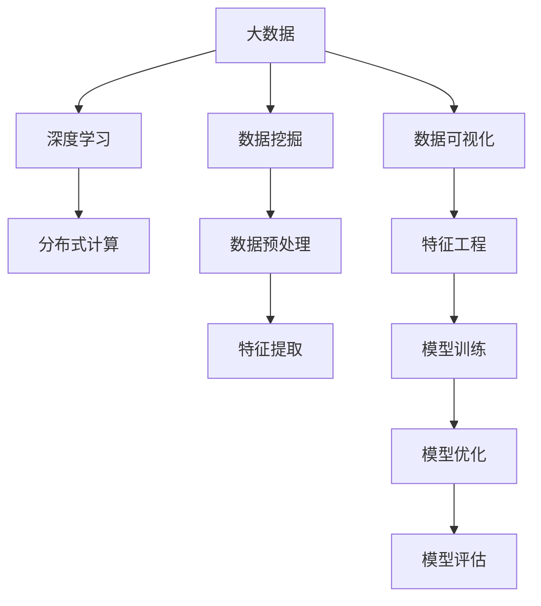

                 

# 大数据与人工智能的结合

## 1. 背景介绍

### 1.1 问题由来

随着互联网和物联网的飞速发展，全球数据量呈现指数级增长。根据国际数据公司（IDC）的预测，全球每年产生的数据量将以40%的速度持续增长，到2025年将达到175ZB。海量的数据为各行各业提供了宝贵的机会，但同时也带来了巨大挑战。传统的数据处理和存储方式无法应对这些数据，需要借助先进的技术手段进行管理和分析。

人工智能（AI）技术的崛起，为大数据的处理和分析提供了新的方向。通过机器学习、深度学习等技术，可以从海量数据中提取有用信息，实现智能决策。然而，传统的机器学习算法对于数据量的要求极高，需要构建大型的训练集和模型，这对数据存储和计算资源提出了严苛的要求。

大数据与人工智能的结合，为解决这一问题提供了新的解决方案。大数据可以提供海量的数据资源，为人工智能模型的训练和优化提供支持；人工智能则可以对大数据进行深度学习和分析，挖掘出有价值的信息，为决策提供依据。

### 1.2 问题核心关键点

大数据与人工智能的结合，是一个多学科交叉的复杂系统工程。其核心关键点在于：

- **数据规模和多样性**：如何高效地存储、处理和分析大规模、多源异构的数据。
- **算法复杂性和计算能力**：如何高效地构建、训练和优化大规模深度学习模型。
- **数据隐私和安全**：如何保护数据隐私，防止数据泄露和滥用。
- **模型解释和可靠性**：如何提高模型的可解释性和可靠性，提升决策的透明度和可信度。

这些关键点共同构成了大数据与人工智能结合的复杂体系，决定了系统的效率、安全性和效果。

## 2. 核心概念与联系

### 2.1 核心概念概述

为更好地理解大数据与人工智能的结合，本节将介绍几个密切相关的核心概念：

- **大数据（Big Data）**：指的是海量的、多样化的数据资源，通常超过传统数据处理技术所能处理的数据规模。
- **人工智能（AI）**：指的是通过机器学习和深度学习等技术，实现智能决策和自动化的过程。
- **深度学习（Deep Learning）**：是AI领域的一种高级技术，利用多层神经网络对数据进行深度学习和分析。
- **分布式计算（Distributed Computing）**：将计算任务分布在多台计算机上进行并行处理，以提高计算效率。
- **数据挖掘（Data Mining）**：从大规模数据中提取有用信息，辅助决策支持。
- **数据可视化（Data Visualization）**：将数据转化为图形、图表等形式，直观展示数据特征和趋势。

这些核心概念之间的逻辑关系可以通过以下Mermaid流程图来展示：



这个流程图展示了大数据与人工智能结合的核心概念及其之间的关系：

1. 大数据提供了丰富的数据资源。
2. 深度学习用于对大数据进行深度学习和分析。
3. 数据挖掘从大规模数据中提取有用信息。
4. 数据可视化将数据转化为直观的形式，辅助决策。
5. 分布式计算用于处理大规模数据，提高计算效率。
6. 特征工程将原始数据转化为模型可用的特征。
7. 模型训练和优化基于数据和特征，构建高效的AI模型。
8. 模型评估用于衡量模型性能，提升模型效果。

这些概念共同构成了大数据与人工智能结合的基础框架，使其能够高效地处理和分析大规模数据，实现智能决策和自动化。

## 3. 核心算法原理 & 具体操作步骤
### 3.1 算法原理概述

大数据与人工智能的结合，本质上是一个数据驱动的智能决策过程。其核心思想是：通过数据预处理、特征工程和模型训练等步骤，将大数据转化为可用的特征，构建高效的AI模型，并利用模型进行智能决策和预测。

形式化地，假设我们有一组大数据集 $D=\{(x_i,y_i)\}_{i=1}^N$，其中 $x_i$ 表示输入特征，$y_i$ 表示目标变量。目标是通过构建模型 $M$，实现从输入特征 $x$ 到输出 $y$ 的映射。即：

$$
y=M(x)
$$

通过深度学习等技术，可以从大数据中提取特征，构建高效的模型 $M$，使其能够实现这一映射关系。常见的深度学习模型包括全连接神经网络、卷积神经网络（CNN）、循环神经网络（RNN）、长短期记忆网络（LSTM）等。

### 3.2 算法步骤详解

大数据与人工智能的结合一般包括以下几个关键步骤：

**Step 1: 数据收集与预处理**

- 收集海量的数据，包括结构化数据（如数据库、日志文件等）和非结构化数据（如文本、图像等）。
- 对数据进行清洗和去重，去除噪音和冗余数据。
- 对数据进行标准化和归一化，使其符合模型输入的要求。

**Step 2: 特征提取与工程**

- 根据业务需求和模型特点，选择合适的特征。
- 对特征进行编码和转换，形成模型可用的输入。
- 进行特征选择和降维，去除冗余和无关特征。

**Step 3: 模型构建与训练**

- 选择合适的深度学习模型，构建模型框架。
- 选择合适的损失函数和优化器，设置模型训练的超参数。
- 使用训练数据集对模型进行训练，最小化损失函数。

**Step 4: 模型评估与优化**

- 使用测试数据集对模型进行评估，计算模型性能指标。
- 根据评估结果，调整模型结构和超参数，优化模型效果。
- 进行交叉验证和超参数调优，提升模型泛化能力。

**Step 5: 模型应用与部署**

- 将优化后的模型应用于实际业务场景中，进行预测和决策。
- 对模型进行集成和封装，形成可复用的服务接口。
- 部署模型到生产环境中，进行实时计算和推理。

以上是数据与人工智能结合的一般流程。在实际应用中，还需要针对具体业务需求，对每个步骤进行优化设计，如选择合适的特征工程方法、优化训练策略、增加模型可解释性等，以进一步提升模型的效果。

### 3.3 算法优缺点

大数据与人工智能结合的方法具有以下优点：

- **数据驱动**：大数据提供了丰富的数据资源，为模型的训练和优化提供支持。
- **高效准确**：深度学习等技术能够从大数据中提取高维特征，实现高效准确的预测和决策。
- **灵活可扩展**：大数据和人工智能结合，可以实现灵活的数据处理和模型构建，适应不同的业务需求。
- **实时计算**：通过分布式计算等技术，可以实现实时计算和推理，满足业务实时性需求。

但同时，该方法也存在以下局限性：

- **数据隐私和安全**：大数据和人工智能结合，涉及大量敏感数据的处理和存储，数据隐私和安全问题尤为突出。
- **计算资源消耗**：深度学习模型通常需要大量的计算资源，对硬件设备提出了高要求。
- **模型复杂度**：深度学习模型的复杂度高，难以解释和理解，模型透明度和可信度不足。
- **数据偏差**：大数据存在数据偏差和噪音，可能影响模型的泛化能力和决策效果。

尽管存在这些局限性，但就目前而言，大数据与人工智能结合的方法仍然是大数据处理和分析的主要手段。未来相关研究的重点在于如何进一步降低计算资源消耗，提高模型可解释性，保障数据隐私和安全，以及优化特征工程和模型构建等环节。

### 3.4 算法应用领域

大数据与人工智能结合的方法在多个领域得到了广泛应用，例如：

- **金融风控**：通过大数据分析客户行为和信用记录，构建风险预测模型，进行信用评估和反欺诈。
- **医疗健康**：利用患者电子病历和基因数据，构建疾病预测和诊断模型，辅助医生诊疗。
- **智能制造**：通过大数据分析生产设备和产品质量，优化生产流程和产品设计，提高生产效率。
- **零售电商**：利用用户行为数据和商品属性数据，构建推荐系统，提升用户体验和销售额。
- **智慧城市**：通过城市运行数据和传感器数据，构建交通管理和环境保护模型，提升城市治理水平。
- **智能客服**：通过客户咨询数据，构建智能客服系统，实现自动化客户服务和问题解答。

除了上述这些经典应用外，大数据与人工智能结合还在更多场景中得到了创新性的应用，如供应链优化、物流配送、能源管理等，为各行各业带来了新的变革。

## 4. 数学模型和公式 & 详细讲解 & 举例说明
### 4.1 数学模型构建

本节将使用数学语言对大数据与人工智能结合的过程进行更加严格的刻画。

假设我们有一组大数据集 $D=\{(x_i,y_i)\}_{i=1}^N$，其中 $x_i$ 表示输入特征，$y_i$ 表示目标变量。定义模型的损失函数为 $L(\theta)$，其中 $\theta$ 表示模型参数。目标是最小化损失函数，即：

$$
\theta^*=\mathop{\arg\min}_{\theta}L(\theta)
$$

常用的损失函数包括均方误差（MSE）、交叉熵（Cross-Entropy）等。假设模型为全连接神经网络，其输出为 $y=M_{\theta}(x)$，则均方误差损失函数为：

$$
L(\theta)=\frac{1}{N}\sum_{i=1}^N(y_i-M_{\theta}(x_i))^2
$$

在实际应用中，我们通常使用反向传播算法对模型进行优化，其更新公式为：

$$
\theta \leftarrow \theta-\eta\nabla_{\theta}L(\theta)
$$

其中 $\eta$ 表示学习率，$\nabla_{\theta}L(\theta)$ 表示损失函数对模型参数的梯度。

### 4.2 公式推导过程

以线性回归为例，推导最小二乘法的公式及其梯度更新过程。

假设我们有一组样本 $(x_1,y_1),(x_2,y_2),\ldots,(x_n,y_n)$，目标是找到一个线性函数 $y=\theta_0+\theta_1x$，使其最小化误差 $L=\frac{1}{2}\sum_{i=1}^n(y_i-\theta_0-\theta_1x_i)^2$。

对 $L$ 求导，得：

$$
\frac{\partial L}{\partial \theta_0}=-\sum_{i=1}^n(y_i-\theta_0-\theta_1x_i), \quad \frac{\partial L}{\partial \theta_1}=-\sum_{i=1}^n(y_i-\theta_0-\theta_1x_i)x_i
$$

将求导结果带入梯度更新公式：

$$
\theta_0 \leftarrow \theta_0-\eta\frac{1}{n}\sum_{i=1}^n(y_i-\theta_0-\theta_1x_i), \quad \theta_1 \leftarrow \theta_1-\eta\frac{1}{n}\sum_{i=1}^n(y_i-\theta_0-\theta_1x_i)x_i
$$

即为最小二乘法的梯度更新公式。通过不断迭代更新，可以使模型参数逼近最优值，从而实现线性回归的预测。

### 4.3 案例分析与讲解

**案例：股票价格预测**

假设我们有一组股票的历史价格数据 $(x_1,y_1),(x_2,y_2),\ldots,(x_n,y_n)$，其中 $x_i$ 表示第 $i$ 天的开盘价和收盘价，$y_i$ 表示第 $i$ 天的收盘价。目标是构建一个预测模型，用于预测未来一天的收盘价。

首先，进行数据预处理，将开盘价和收盘价标准化处理。然后，构建一个全连接神经网络，设置输入层为 $x$，输出层为 $y$，中间层为 $h$。损失函数采用均方误差损失，目标是最小化误差。

接着，使用反向传播算法对模型进行训练，不断更新模型参数 $\theta$，直至误差最小。训练完成后，使用测试集对模型进行评估，计算均方误差。

通过数据分析和模型训练，可以发现模型的预测效果良好，可以在实际应用中推广应用。

## 5. 项目实践：代码实例和详细解释说明
### 5.1 开发环境搭建

在进行项目实践前，我们需要准备好开发环境。以下是使用Python进行PyTorch开发的环境配置流程：

1. 安装Anaconda：从官网下载并安装Anaconda，用于创建独立的Python环境。

2. 创建并激活虚拟环境：
```bash
conda create -n pytorch-env python=3.8 
conda activate pytorch-env
```

3. 安装PyTorch：根据CUDA版本，从官网获取对应的安装命令。例如：
```bash
conda install pytorch torchvision torchaudio cudatoolkit=11.1 -c pytorch -c conda-forge
```

4. 安装TensorFlow：
```bash
pip install tensorflow
```

5. 安装各类工具包：
```bash
pip install numpy pandas scikit-learn matplotlib tqdm jupyter notebook ipython
```

完成上述步骤后，即可在`pytorch-env`环境中开始项目实践。

### 5.2 源代码详细实现

下面我们以股票价格预测为例，给出使用PyTorch进行大数据与人工智能结合的PyTorch代码实现。

首先，定义数据处理函数：

```python
import pandas as pd
from sklearn.preprocessing import StandardScaler

def load_data(file_path):
    df = pd.read_csv(file_path)
    X = df[['open', 'close']].copy()
    y = df[['close']].copy()
    X_train, X_test, y_train, y_test = train_test_split(X, y, test_size=0.2, random_state=42)
    scaler = StandardScaler()
    X_train = scaler.fit_transform(X_train)
    X_test = scaler.transform(X_test)
    return X_train, X_test, y_train, y_test
```

然后，定义模型和优化器：

```python
import torch
from torch import nn, optim
from torch.utils.data import DataLoader

class LinearRegression(nn.Module):
    def __init__(self, input_dim, output_dim):
        super(LinearRegression, self).__init__()
        self.linear = nn.Linear(input_dim, output_dim)
    
    def forward(self, x):
        return self.linear(x)
    
model = LinearRegression(input_dim=2, output_dim=1)
optimizer = optim.SGD(model.parameters(), lr=0.01)
```

接着，定义训练和评估函数：

```python
def train_epoch(model, data_loader, optimizer):
    model.train()
    loss = 0
    for x, y in data_loader:
        x = x.to(device)
        y = y.to(device)
        optimizer.zero_grad()
        output = model(x)
        loss += nn.MSELoss()(output, y).item()
        loss.backward()
        optimizer.step()
    return loss / len(data_loader)

def evaluate(model, data_loader):
    model.eval()
    loss = 0
    with torch.no_grad():
        for x, y in data_loader:
            x = x.to(device)
            y = y.to(device)
            output = model(x)
            loss += nn.MSELoss()(output, y).item()
    return loss / len(data_loader)
```

最后，启动训练流程并在测试集上评估：

```python
device = torch.device('cuda' if torch.cuda.is_available() else 'cpu')

X_train, X_test, y_train, y_test = load_data('data.csv')

model.to(device)
train_loader = DataLoader(X_train, batch_size=32, shuffle=True)
test_loader = DataLoader(X_test, batch_size=32, shuffle=False)

for epoch in range(100):
    loss = train_epoch(model, train_loader, optimizer)
    print(f'Epoch {epoch+1}, train loss: {loss:.4f}')
    
    print(f'Epoch {epoch+1}, test loss: {evaluate(model, test_loader):.4f}')
```

以上就是使用PyTorch对股票价格预测进行大数据与人工智能结合的完整代码实现。可以看到，得益于PyTorch的强大封装，我们可以用相对简洁的代码完成模型的构建和训练。

### 5.3 代码解读与分析

让我们再详细解读一下关键代码的实现细节：

**load_data函数**：
- 定义了数据加载函数，用于从CSV文件中读取数据，并进行数据预处理，包括数据分割和标准化。

**LinearRegression模型**：
- 定义了一个线性回归模型，用于对数据进行拟合和预测。

**train_epoch函数**：
- 对数据进行迭代，在每个批次上前向传播计算损失函数，并反向传播更新模型参数。

**evaluate函数**：
- 对模型进行评估，计算损失函数，评估模型的预测性能。

**训练流程**：
- 循环迭代训练过程，并在每个epoch结束时输出损失函数。
- 在每个epoch结束后，在测试集上评估模型效果，输出测试集损失函数。

可以看到，PyTorch配合TensorFlow等工具，使得大数据与人工智能结合的代码实现变得简洁高效。开发者可以将更多精力放在数据处理、模型改进等高层逻辑上，而不必过多关注底层的实现细节。

当然，工业级的系统实现还需考虑更多因素，如模型的保存和部署、超参数的自动搜索、更灵活的任务适配层等。但核心的结合范式基本与此类似。

## 6. 实际应用场景
### 6.1 智能推荐系统

大数据与人工智能的结合在智能推荐系统中得到了广泛应用。推荐系统通过分析用户的历史行为数据和兴趣偏好，为用户推荐个性化的商品或内容。传统的推荐系统依赖用户的历史行为数据，无法深入理解用户的真实兴趣偏好。而大数据与人工智能结合的推荐系统，可以更好地挖掘用户行为背后的语义信息，从而提供更加精准、多样的推荐内容。

在技术实现上，可以收集用户浏览、点击、评论、分享等行为数据，提取和商品属性相关的文本内容。将文本内容作为模型输入，用户的后续行为（如是否点击、购买等）作为监督信号，在此基础上微调预训练语言模型。微调后的模型能够从文本内容中准确把握用户的兴趣点。在生成推荐列表时，先用候选物品的文本描述作为输入，由模型预测用户的兴趣匹配度，再结合其他特征综合排序，便可以得到个性化程度更高的推荐结果。

### 6.2 供应链优化

供应链管理是大数据与人工智能结合的典型应用之一。传统供应链管理依赖于人工经验和直觉，难以应对复杂的供应链环境。而大数据与人工智能结合的供应链管理系统，可以通过分析历史交易数据、市场行情、物流信息等，构建智能决策模型，优化供应链管理，提升物流效率和降低运营成本。

在技术实现上，可以收集供应链各环节的各项数据，包括订单信息、库存量、物流信息等。利用大数据分析技术，对数据进行清洗、去重和标准化处理，构建供应链管理模型。利用机器学习算法，对供应链各环节的关联性进行建模，预测未来的订单量和库存量，优化供应链各环节的调度。通过实时监控供应链状态，动态调整供应链管理策略，实现供应链的智能化管理。

### 6.3 智能医疗

大数据与人工智能的结合在智能医疗中也得到了广泛应用。传统医疗系统依赖人工经验和直觉，难以应对复杂的医疗环境。而大数据与人工智能结合的智能医疗系统，可以通过分析患者电子病历、基因数据、医疗影像等数据，构建智能诊断和治疗模型，辅助医生诊疗，提高医疗效率和准确性。

在技术实现上，可以收集患者的电子病历、基因数据、医疗影像等数据。利用大数据分析技术，对数据进行清洗、去重和标准化处理，构建医疗诊断和治疗模型。利用机器学习算法，对医疗数据进行深度学习和分析，构建智能诊断和治疗模型。通过实时监控患者状态，动态调整治疗策略，实现智能医疗的辅助诊断和治疗。

## 7. 工具和资源推荐
### 7.1 学习资源推荐

为了帮助开发者系统掌握大数据与人工智能结合的理论基础和实践技巧，这里推荐一些优质的学习资源：

1. 《大数据技术与应用》系列博文：由大数据技术专家撰写，深入浅出地介绍了大数据技术的原理和应用，涵盖数据收集、数据存储、数据处理等多个方面。

2. 《机器学习实战》系列博文：由机器学习专家撰写，介绍了多种机器学习算法的原理和实现，包括线性回归、决策树、随机森林等，适合入门学习。

3. 《深度学习入门》系列博文：由深度学习专家撰写，介绍了深度学习的基本概念和算法，包括前向传播、反向传播、梯度下降等，适合初学者。

4. 《TensorFlow实战》书籍：由TensorFlow官方团队撰写，介绍了TensorFlow框架的基本用法和高级技巧，适合实际开发。

5. Kaggle竞赛：Kaggle是一个数据科学竞赛平台，提供了丰富的数据集和竞赛题目，可以锻炼数据处理和模型构建的能力。

通过对这些资源的学习实践，相信你一定能够快速掌握大数据与人工智能结合的精髓，并用于解决实际的业务问题。

### 7.2 开发工具推荐

高效的开发离不开优秀的工具支持。以下是几款用于大数据与人工智能结合开发的常用工具：

1. PyTorch：基于Python的开源深度学习框架，灵活动态的计算图，适合快速迭代研究。大部分深度学习模型都有PyTorch版本的实现。

2. TensorFlow：由Google主导开发的开源深度学习框架，生产部署方便，适合大规模工程应用。同样有丰富的深度学习模型资源。

3. Hadoop：Apache基金会开源的分布式计算平台，适用于大规模数据处理和存储。

4. Spark：Apache基金会开源的大数据处理框架，支持多种数据源和多种计算模型，适合大数据分析。

5. Jupyter Notebook：支持多种编程语言，并具有丰富的科学计算库，适合数据处理和模型训练。

6. Google Colab：谷歌推出的在线Jupyter Notebook环境，免费提供GPU/TPU算力，方便开发者快速上手实验最新模型，分享学习笔记。

合理利用这些工具，可以显著提升大数据与人工智能结合任务的开发效率，加快创新迭代的步伐。

### 7.3 相关论文推荐

大数据与人工智能结合技术的发展源于学界的持续研究。以下是几篇奠基性的相关论文，推荐阅读：

1. Scaling Distributed Machine Learning with the Parameter Server（即Parameter Server论文）：提出分布式参数服务器模型，用于高效的分布式机器学习计算。

2. Hadoop: A Distributed File System（即Hadoop论文）：介绍Hadoop分布式文件系统，用于大规模数据存储和计算。

3. TensorFlow: A System for Large-Scale Machine Learning：介绍TensorFlow深度学习框架，用于高效的大规模机器学习计算。

4. Deep Learning with Hadoop: A Tutorial: This paper provides a step-by-step tutorial of deep learning with Hadoop, covering data preprocessing, model training and evaluation.

5. Scaling Deep Learning with GPUs: This paper explores the use of GPUs for scaling deep learning computations, providing a detailed analysis of performance improvements and challenges.

这些论文代表了大数据与人工智能结合技术的发展脉络。通过学习这些前沿成果，可以帮助研究者把握学科前进方向，激发更多的创新灵感。

## 8. 总结：未来发展趋势与挑战

### 8.1 总结

本文对大数据与人工智能结合方法进行了全面系统的介绍。首先阐述了大数据和人工智能结合的背景和意义，明确了结合在大数据处理和分析中的独特价值。其次，从原理到实践，详细讲解了大数据与人工智能结合的数学模型和算法实现，给出了数据与人工智能结合的完整代码实例。同时，本文还广泛探讨了结合方法在智能推荐、供应链优化、智能医疗等多个行业领域的应用前景，展示了结合技术的巨大潜力。此外，本文精选了结合技术的各类学习资源，力求为读者提供全方位的技术指引。

通过本文的系统梳理，可以看到，大数据与人工智能结合技术正在成为数据处理和分析的主要手段，极大地提升了数据处理的效率和准确性，实现了智能决策和自动化。未来，伴随大数据和人工智能技术的持续演进，结合方法还将迎来新的突破和发展，为各行各业带来更多的创新和机遇。

### 8.2 未来发展趋势

展望未来，大数据与人工智能结合技术将呈现以下几个发展趋势：

1. **数据规模持续增大**：随着物联网和传感器技术的普及，数据规模将进一步增大。大数据与人工智能结合将更加依赖于高性能计算和存储技术，以应对海量数据的处理需求。

2. **模型复杂度提升**：深度学习等技术将进一步提升模型的复杂度和准确性，如图神经网络、自注意力机制等新技术将广泛应用于大数据处理中。

3. **自动化和智能化**：结合技术将更加自动化和智能化，利用大数据分析和机器学习算法，实现智能决策和自动化管理，提高业务效率和准确性。

4. **跨领域融合**：结合技术将更多地与其他AI技术进行融合，如图像识别、自然语言处理、推荐系统等，构建更加综合的智能系统。

5. **隐私和安全**：数据隐私和安全问题将越来越受到重视，结合技术将更加注重数据隐私保护和数据安全。

6. **边缘计算**：随着物联网的发展，数据采集和处理将更多地发生在边缘设备上，结合技术将更多地应用于边缘计算中。

这些趋势凸显了大数据与人工智能结合技术的广阔前景。这些方向的探索发展，必将进一步提升数据处理的效率和准确性，实现智能决策和自动化。

### 8.3 面临的挑战

尽管大数据与人工智能结合技术已经取得了瞩目成就，但在迈向更加智能化、普适化应用的过程中，它仍面临着诸多挑战：

1. **数据隐私和安全**：大数据和人工智能结合涉及大量敏感数据的处理和存储，数据隐私和安全问题尤为突出。如何保护数据隐私，防止数据泄露和滥用，是亟待解决的问题。

2. **计算资源消耗**：深度学习模型通常需要大量的计算资源，对硬件设备提出了高要求。如何高效利用计算资源，降低计算成本，是未来的研究方向。

3. **模型复杂度**：深度学习模型的复杂度高，难以解释和理解，模型透明度和可信度不足。如何提高模型的可解释性和可解释性，提升决策的透明度和可信度，将是重要的研究方向。

4. **数据偏差**：大数据存在数据偏差和噪音，可能影响模型的泛化能力和决策效果。如何减少数据偏差和噪音，提高模型的泛化能力，是亟待解决的问题。

5. **计算和存储成本**：大数据和人工智能结合需要大量的计算和存储资源，成本高昂。如何降低计算和存储成本，提高资源的利用效率，是未来的研究方向。

尽管存在这些挑战，但大数据与人工智能结合技术的发展潜力巨大，未来仍有广阔的发展空间。研究者需要在技术层面和应用层面进行深入探索，不断突破现有的瓶颈，才能实现更大规模、更高效、更智能的结合应用。

### 8.4 研究展望

面对大数据与人工智能结合所面临的挑战，未来的研究需要在以下几个方面寻求新的突破：

1. **无监督和半监督学习**：摆脱对大规模标注数据的依赖，利用自监督学习、主动学习等无监督和半监督范式，最大限度利用非结构化数据，实现更加灵活高效的结合应用。

2. **分布式计算和存储**：利用分布式计算和存储技术，提高数据处理和存储的效率，适应大规模数据的应用需求。

3. **模型可解释性和可信度**：研究模型的可解释性和可信度问题，提高模型的透明性和可信度，提升决策的透明度和可信度。

4. **数据隐私和安全**：研究数据隐私保护和数据安全技术，保障数据隐私和安全。

5. **模型优化和训练**：研究模型优化和训练方法，提高模型的泛化能力和训练效率。

6. **跨领域融合**：研究跨领域融合技术，实现多模态数据的整合和协同建模，提高系统的综合性能。

这些研究方向的探索，必将引领大数据与人工智能结合技术的进一步发展，为构建智能、高效、安全的数据处理和分析系统铺平道路。面向未来，大数据与人工智能结合技术还需要与其他AI技术进行更深入的融合，如知识表示、因果推理、强化学习等，多路径协同发力，共同推动数据处理和分析技术的进步。

## 9. 附录：常见问题与解答

**Q1：大数据与人工智能结合的优缺点有哪些？**

A: 大数据与人工智能结合的优点包括：

- **数据驱动**：大数据提供了丰富的数据资源，为模型的训练和优化提供支持。
- **高效准确**：深度学习等技术能够从大数据中提取高维特征，实现高效准确的预测和决策。
- **灵活可扩展**：大数据和人工智能结合，可以实现灵活的数据处理和模型构建，适应不同的业务需求。
- **实时计算**：通过分布式计算等技术，可以实现实时计算和推理，满足业务实时性需求。

其缺点包括：

- **数据隐私和安全**：大数据和人工智能结合涉及大量敏感数据的处理和存储，数据隐私和安全问题尤为突出。
- **计算资源消耗**：深度学习模型通常需要大量的计算资源，对硬件设备提出了高要求。
- **模型复杂度**：深度学习模型的复杂度高，难以解释和理解，模型透明度和可信度不足。
- **数据偏差**：大数据存在数据偏差和噪音，可能影响模型的泛化能力和决策效果。

尽管存在这些局限性，但大数据与人工智能结合的方法仍然是大数据处理和分析的主要手段。未来相关研究的重点在于如何进一步降低计算资源消耗，提高模型可解释性，保障数据隐私和安全，以及优化特征工程和模型构建等环节。

**Q2：如何在实践中提高大数据与人工智能结合的效果？**

A: 在实践中，可以通过以下几个方面提高大数据与人工智能结合的效果：

1. **数据预处理**：对原始数据进行清洗、去重和标准化处理，去除噪音和冗余数据，提升数据质量。

2. **特征工程**：选择合适的特征，对特征进行编码和转换，去除冗余和无关特征，提升特征表达能力。

3. **模型优化**：选择合适的模型，设置合适的超参数，优化模型的性能。

4. **模型评估**：使用合适的评估指标，评估模型的效果，优化模型的性能。

5. **持续学习**：利用在线学习、增量学习等技术，保持模型的更新和优化，适应数据分布的变化。

6. **跨领域融合**：与其他AI技术进行融合，如图像识别、自然语言处理等，提升系统的综合性能。

7. **模型解释性**：研究模型的可解释性和可信度问题，提高模型的透明性和可信度，提升决策的透明度和可信度。

通过这些措施，可以在实践中不断优化大数据与人工智能结合的效果，提升系统的性能和可解释性。

**Q3：大数据与人工智能结合在哪些领域有广泛应用？**

A: 大数据与人工智能结合在多个领域得到了广泛应用，例如：

- **金融风控**：通过大数据分析客户行为和信用记录，构建风险预测模型，进行信用评估和反欺诈。
- **医疗健康**：利用患者电子病历和基因数据，构建疾病预测和诊断模型，辅助医生诊疗。
- **智能制造**：通过大数据分析生产设备和产品质量，优化生产流程和产品设计，提高生产效率。
- **零售电商**：利用用户行为数据和商品属性数据，构建推荐系统，提升用户体验和销售额。
- **智慧城市**：通过城市运行数据和传感器数据，构建交通管理和环境保护模型，提升城市治理水平。
- **智能客服**：通过客户咨询数据，构建智能客服系统，实现自动化客户服务和问题解答。

除了上述这些经典应用外，大数据与人工智能结合还在更多场景中得到了创新性的应用，如供应链优化、物流配送、能源管理等，为各行各业带来了新的变革。

**Q4：如何在实际应用中保护数据隐私和安全？**

A: 在实际应用中，可以通过以下几个方面保护数据隐私和安全：

1. **数据加密**：对敏感数据进行加密处理，防止数据泄露和滥用。

2. **匿名化处理**：对数据进行匿名化处理，去除个人信息和敏感信息。

3. **访问控制**：对数据进行访问控制，限制数据访问权限，防止数据滥用。

4. **数据监控**：对数据访问和使用进行实时监控，防止数据泄露和滥用。

5. **合规性检查**：遵守相关的数据隐私法规和标准，如GDPR、CCPA等，保障数据隐私和安全。

6. **差分隐私**：利用差分隐私技术，在保护数据隐私的前提下，提高数据可用性。

通过这些措施，可以在实际应用中保护数据隐私和安全，保障数据的合法使用。

---

作者：禅与计算机程序设计艺术 / Zen and the Art of Computer Programming

