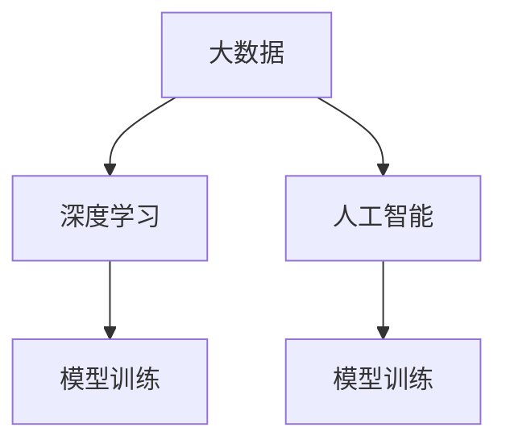

                 

## 1. 背景介绍

### 1.1 问题由来

随着人工智能（AI）技术的发展，大数据在AI学习中的作用日益凸显。大数据的广泛应用，使得AI模型可以从大量的数据中学习到更丰富的特征，提升模型的准确性和泛化能力。然而，尽管大数据的潜力巨大，其在AI学习中的应用仍面临诸多挑战，如数据质量、数据存储和处理等。本文将深入探讨大数据在AI学习中的作用，并提出一些解决方案。

### 1.2 问题核心关键点

大数据在AI学习中的作用主要体现在以下几个方面：

- **数据量的增加**：大数据技术使得AI模型能够从更多的数据中学习，从而提升模型的性能。
- **特征的丰富性**：大数据提供了丰富的特征，使得AI模型能够学习到更多的模式和规律。
- **模型的泛化能力**：大数据使得AI模型能够更好地泛化到未见过的数据上。

## 2. 核心概念与联系

### 2.1 核心概念概述

- **大数据（Big Data）**：指的是在传统数据处理应用软件无法处理的数据集，通常以PB级别的数据量进行计算。大数据包括结构化数据、半结构化数据和非结构化数据。
- **人工智能（AI）**：指的是利用计算机系统来模拟人类智能的技术，包括机器学习、深度学习、自然语言处理等。
- **深度学习（Deep Learning）**：是一种基于神经网络的机器学习方法，可以从大量数据中学习到复杂非线性关系，广泛应用于图像识别、语音识别等领域。
- **大数据处理技术**：包括数据存储、数据清洗、数据挖掘和数据可视化等技术，用于处理和分析大数据。
- **模型训练**：指使用大数据进行机器学习模型的训练，使得模型能够在特定任务上表现出色。

这些核心概念之间的逻辑关系可以通过以下Mermaid流程图来展示：



这个流程图展示了大数据在AI学习中的作用及其与其他概念之间的关系：

1. 大数据提供了深度学习所需的数据，用于训练AI模型。
2. 人工智能技术利用大数据训练出的模型，能够在各种任务上发挥作用。
3. 模型训练是利用大数据进行机器学习的过程，是连接大数据和AI模型的桥梁。

## 3. 核心算法原理 & 具体操作步骤
### 3.1 算法原理概述

大数据在AI学习中的应用主要体现在以下几个方面：

- **数据驱动的模型训练**：利用大数据进行模型训练，可以使得模型从更多的数据中学习到丰富的特征，提升模型的泛化能力。
- **特征工程**：大数据提供了丰富的特征，通过特征工程可以提取有意义的特征，提高模型的准确性。
- **模型优化**：利用大数据训练的模型可以更好地应对不同的应用场景，通过调参和模型优化可以进一步提升模型的性能。

### 3.2 算法步骤详解

大数据在AI学习中的应用，主要包括以下几个步骤：

1. **数据收集**：从各种数据源收集数据，包括结构化数据、半结构化数据和非结构化数据。
2. **数据清洗**：清洗数据，去除噪声和错误数据，确保数据的质量。
3. **数据预处理**：对数据进行标准化、归一化等预处理操作，使得数据适合于模型训练。
4. **特征工程**：提取有意义的特征，如特征选择、特征降维等，提高模型的准确性。
5. **模型训练**：使用大数据进行机器学习模型的训练，调整模型参数以优化模型性能。
6. **模型评估和优化**：使用测试数据集评估模型性能，根据评估结果进行模型优化，如调整学习率、正则化参数等。

### 3.3 算法优缺点

大数据在AI学习中的应用，具有以下优点：

- **提升模型性能**：大数据提供了丰富的特征，可以提升模型的泛化能力和准确性。
- **增强模型的可解释性**：通过特征工程和模型优化，可以更好地理解模型的决策过程。
- **提高模型的灵活性**：利用大数据训练的模型可以更好地应对不同的应用场景。

同时，大数据在AI学习中也有一些缺点：

- **数据质量问题**：大数据来源广泛，数据质量参差不齐，需要耗费大量时间和资源进行数据清洗和处理。
- **存储和处理成本高**：大数据存储和处理需要大量的计算资源和存储资源，成本较高。
- **数据隐私问题**：大数据涉及大量的个人隐私数据，如何保护数据隐私是一个重要问题。

### 3.4 算法应用领域

大数据在AI学习中的应用领域广泛，主要包括以下几个方面：

- **自然语言处理（NLP）**：利用大数据训练的模型可以提升文本分类、情感分析、机器翻译等NLP任务的性能。
- **图像识别**：利用大数据训练的模型可以提升图像识别、目标检测等计算机视觉任务的性能。
- **语音识别**：利用大数据训练的模型可以提升语音识别、语音合成等音频任务的性能。
- **推荐系统**：利用大数据训练的模型可以提升个性化推荐系统的推荐准确性。
- **医疗健康**：利用大数据训练的模型可以提升疾病预测、医学影像分析等医疗任务的性能。

## 4. 数学模型和公式 & 详细讲解 & 举例说明

### 4.1 数学模型构建

在大数据在AI学习中的应用中，数学模型主要包括以下几个部分：

- **损失函数**：用于衡量模型预测结果与真实结果之间的差异，如均方误差（MSE）、交叉熵（Cross-Entropy）等。
- **优化器**：用于调整模型参数以最小化损失函数，如梯度下降（Gradient Descent）、Adam等。
- **正则化**：用于避免过拟合，如L2正则化、Dropout等。

### 4.2 公式推导过程

以线性回归模型为例，推导其损失函数和优化公式。

假设数据集为 $(x_i, y_i)$，其中 $x_i \in \mathbb{R}^n, y_i \in \mathbb{R}$。线性回归模型的预测结果为 $y_i = \theta^T x_i$，其中 $\theta$ 为模型参数。

损失函数可以定义为均方误差（MSE）：

$$
L(\theta) = \frac{1}{2N} \sum_{i=1}^N (y_i - \theta^T x_i)^2
$$

优化公式为梯度下降：

$$
\theta \leftarrow \theta - \alpha \frac{\partial L(\theta)}{\partial \theta}
$$

其中 $\alpha$ 为学习率。

### 4.3 案例分析与讲解

以一个简单的房价预测为例，分析大数据在AI学习中的应用。

假设有一个房屋数据集，包含房屋面积、地理位置、房屋年龄等特征，以及对应的房价。通过大数据预处理和特征工程，可以得到如下模型：

$$
\hat{y} = \theta^T x
$$

其中 $x = [x_1, x_2, ..., x_n]^T$ 为特征向量，$\theta = [\theta_1, \theta_2, ..., \theta_n]^T$ 为模型参数。

利用大数据训练的模型，可以在新的房屋数据上进行预测，得到其对应的房价。这个例子展示了大数据在AI学习中的作用，即通过丰富的数据和特征工程，训练出能够预测房价的模型。

## 5. 项目实践：代码实例和详细解释说明
### 5.1 开发环境搭建

在进行大数据在AI学习中的应用实践前，我们需要准备好开发环境。以下是使用Python进行TensorFlow开发的环境配置流程：

1. 安装Anaconda：从官网下载并安装Anaconda，用于创建独立的Python环境。

2. 创建并激活虚拟环境：
```bash
conda create -n tf-env python=3.8 
conda activate tf-env
```

3. 安装TensorFlow：根据CUDA版本，从官网获取对应的安装命令。例如：
```bash
conda install tensorflow -c pytorch -c conda-forge
```

4. 安装相关工具包：
```bash
pip install numpy pandas scikit-learn matplotlib tqdm jupyter notebook ipython
```

完成上述步骤后，即可在`tf-env`环境中开始大数据在AI学习中的应用实践。

### 5.2 源代码详细实现

下面我们以房价预测为例，给出使用TensorFlow进行大数据在AI学习中的应用实践的PyTorch代码实现。

首先，定义模型和损失函数：

```python
import tensorflow as tf
from tensorflow.keras import layers

def build_model(input_shape):
    model = tf.keras.Sequential([
        layers.Dense(64, activation='relu', input_shape=input_shape),
        layers.Dense(64, activation='relu'),
        layers.Dense(1)
    ])
    return model

def loss_function(y_true, y_pred):
    return tf.reduce_mean(tf.square(y_true - y_pred))

model = build_model([5])
optimizer = tf.keras.optimizers.Adam(learning_rate=0.001)
```

然后，定义训练和评估函数：

```python
from tensorflow.keras.datasets import boston_housing
from sklearn.preprocessing import StandardScaler
from sklearn.model_selection import train_test_split

def train_epoch(model, dataset, batch_size, optimizer):
    dataset = dataset.numpy()
    x_train, x_test, y_train, y_test = train_test_split(dataset[:, :-1], dataset[:, -1], test_size=0.2, random_state=42)
    scaler = StandardScaler()
    x_train = scaler.fit_transform(x_train)
    x_test = scaler.transform(x_test)
    model.compile(optimizer=optimizer, loss=loss_function)
    model.fit(x_train, y_train, batch_size=batch_size, epochs=10, validation_data=(x_test, y_test))

def evaluate(model, dataset, batch_size):
    model.evaluate(dataset)
```

最后，启动训练流程并在测试集上评估：

```python
x = boston_housing.data
y = boston_housing.target

train_epoch(model, x, batch_size=64, optimizer=optimizer)
evaluate(model, x, batch_size=64)
```

以上就是使用TensorFlow进行房价预测的完整代码实现。可以看到，得益于TensorFlow的强大封装，我们可以用相对简洁的代码完成模型训练和评估。

### 5.3 代码解读与分析

让我们再详细解读一下关键代码的实现细节：

**build_model函数**：
- 定义了一个简单的线性回归模型，包含两个全连接层和一个输出层。

**loss_function函数**：
- 定义了均方误差损失函数，用于衡量模型预测结果与真实结果之间的差异。

**train_epoch函数**：
- 将数据集分成训练集和测试集，并对训练集进行标准化处理。
- 定义模型，并使用Adam优化器进行模型训练。
- 在训练过程中，使用测试集进行模型验证，确保模型不会过拟合。

**evaluate函数**：
- 直接调用模型的evaluate函数进行模型评估。

**训练流程**：
- 使用波士顿房价数据集进行模型训练，指定训练集大小为64。
- 在训练结束后，使用测试集对模型进行评估。

可以看到，TensorFlow提供了丰富的API和工具，可以方便地进行模型训练和评估。通过合理利用这些工具，可以显著提升大数据在AI学习中的应用效率和效果。

当然，工业级的系统实现还需考虑更多因素，如模型的保存和部署、超参数的自动搜索、更灵活的任务适配层等。但核心的模型训练和评估过程基本与此类似。

## 6. 实际应用场景
### 6.1 智慧城市

大数据在智慧城市中的应用，可以提升城市管理和服务水平。通过收集各种传感器数据、交通数据、环境数据等，利用大数据分析技术可以实时监测城市运行状态，提高城市运行的效率和安全性。

具体而言，可以利用大数据构建智能交通系统，优化交通流量，减少交通拥堵。利用大数据进行城市环境监测，预测天气变化，提高城市防灾减灾能力。利用大数据进行公共安全监测，及时发现和预防潜在的安全隐患。

### 6.2 金融风控

大数据在金融风控中的应用，可以提升金融机构的风险管理能力。通过收集用户的交易数据、信用数据、行为数据等，利用大数据分析技术可以预测用户的违约风险，防范金融风险。

具体而言，可以利用大数据构建信贷评估模型，提高贷款审批的准确性和效率。利用大数据构建用户行为分析模型，预测用户的违约概率，优化信贷决策。利用大数据进行欺诈检测，及时发现和预防欺诈行为，保护金融机构的资产安全。

### 6.3 健康医疗

大数据在健康医疗中的应用，可以提升医疗服务的质量和效率。通过收集患者的医疗数据、健康数据、行为数据等，利用大数据分析技术可以预测疾病的发生和发展趋势，提高医疗服务的精准性和个性化。

具体而言，可以利用大数据构建疾病预测模型，提前发现和预防疾病。利用大数据构建健康管理模型，个性化制定健康管理方案，提高患者的健康水平。利用大数据进行医疗影像分析，提高医学影像诊断的准确性。

### 6.4 未来应用展望

随着大数据技术的不断进步，其在AI学习中的应用将更加广泛和深入。未来，大数据将在以下方面发挥重要作用：

- **实时数据处理**：利用实时数据处理技术，可以实时监测和分析各种应用场景的数据，提升应用的响应速度和准确性。
- **自动化数据标注**：利用大数据自动生成标注数据，可以大大降低数据标注的成本和时间，提高模型的训练效率。
- **联邦学习**：利用联邦学习技术，可以在保护数据隐私的前提下，进行大规模分布式数据处理和模型训练，提升模型的泛化能力。
- **跨领域数据融合**：利用大数据融合技术，可以将不同领域的数据进行协同处理，提高模型的综合性能。

这些方向的应用，将进一步提升大数据在AI学习中的作用，推动AI技术的不断发展和进步。

## 7. 工具和资源推荐
### 7.1 学习资源推荐

为了帮助开发者系统掌握大数据在AI学习中的作用，这里推荐一些优质的学习资源：

1. **《机器学习实战》**：一本介绍机器学习基础和实践的经典书籍，涵盖大数据在机器学习中的应用。
2. **《深度学习》**：由Ian Goodfellow等编写的深度学习领域的经典书籍，详细介绍了深度学习模型的构建和训练过程。
3. **Coursera《机器学习》课程**：由Andrew Ng教授主讲的在线课程，介绍了机器学习的基础理论和实际应用。
4. **Kaggle**：一个数据科学竞赛平台，提供了大量的数据集和算法实现，可以进行实践练习。
5. **Google Cloud AI**：Google提供的AI学习平台，提供了丰富的机器学习资源和工具，可以进行实验和部署。

通过对这些资源的学习实践，相信你一定能够快速掌握大数据在AI学习中的作用，并用于解决实际的AI问题。
###  7.2 开发工具推荐

高效的开发离不开优秀的工具支持。以下是几款用于大数据在AI学习中的应用开发的常用工具：

1. **TensorFlow**：由Google主导开发的开源深度学习框架，支持分布式训练，适合大规模数据处理。
2. **PyTorch**：由Facebook主导开发的开源深度学习框架，支持动态计算图，适合快速迭代实验。
3. **Apache Spark**：由Apache基金会开发的分布式数据处理框架，适合大规模数据处理和分析。
4. **Dask**：一个基于Python的并行计算框架，适合本地和分布式计算。
5. **TensorBoard**：TensorFlow配套的可视化工具，可以实时监测模型训练状态，提供丰富的图表展示。
6. **Jupyter Notebook**：一个交互式计算环境，支持Python、R等语言的开发和实验。

合理利用这些工具，可以显著提升大数据在AI学习中的应用效率和效果。

### 7.3 相关论文推荐

大数据在AI学习中的应用研究源于学界的持续探索。以下是几篇奠基性的相关论文，推荐阅读：

1. **《大数据：定义、挑战、应用和未来趋势》**：由Foster等编写的论文，系统介绍了大数据的定义、挑战和应用。
2. **《大数据时代下的机器学习》**：由Wang等编写的论文，详细介绍了大数据在机器学习中的应用。
3. **《联邦学习：一种分布式机器学习框架》**：由McMahan等编写的论文，介绍了联邦学习的原理和实现。
4. **《跨领域数据融合：方法、挑战与展望》**：由Yan等编写的论文，介绍了跨领域数据融合的方法和应用。

这些论文代表了大数据在AI学习中的应用研究的发展脉络。通过学习这些前沿成果，可以帮助研究者把握学科前进方向，激发更多的创新灵感。

## 8. 总结：未来发展趋势与挑战
### 8.1 总结

本文对大数据在AI学习中的作用进行了全面系统的介绍。首先阐述了大数据和AI学习的研究背景和意义，明确了大数据在AI学习中的应用价值。其次，从原理到实践，详细讲解了大数据在AI学习中的数学模型和算法实现，给出了大数据在AI学习中的应用实践的完整代码实例。同时，本文还广泛探讨了大数据在智慧城市、金融风控、健康医疗等多个行业领域的应用前景，展示了大数据在AI学习中的巨大潜力。此外，本文精选了大数据在AI学习中的学习资源、开发工具和相关论文，力求为读者提供全方位的技术指引。

通过本文的系统梳理，可以看到，大数据在AI学习中的应用正在逐步拓展，为AI技术的不断发展和应用提供了有力支持。大数据提供了丰富的数据和特征，使得AI模型能够学习到更复杂的模式和规律，从而提升模型的泛化能力和准确性。未来，随着大数据技术的不断进步，其在AI学习中的应用将更加广泛和深入。

### 8.2 未来发展趋势

展望未来，大数据在AI学习中的应用将呈现以下几个发展趋势：

1. **数据多样性增强**：大数据来源日益多样，涉及结构化数据、半结构化数据和非结构化数据。如何从多样化的数据中提取有意义的特征，是未来的重要研究方向。
2. **数据处理速度提升**：随着计算能力的提升，大数据处理速度将大幅提升，使得实时数据分析成为可能。
3. **自动化数据处理**：利用大数据自动生成标注数据，可以大大降低数据标注的成本和时间，提高模型的训练效率。
4. **跨领域数据融合**：利用大数据融合技术，可以将不同领域的数据进行协同处理，提高模型的综合性能。
5. **隐私保护技术发展**：如何在大数据应用中保护用户隐私，是未来的重要研究方向。

这些趋势将进一步提升大数据在AI学习中的作用，推动AI技术的不断发展和进步。

### 8.3 面临的挑战

尽管大数据在AI学习中的应用已经取得了显著进展，但在迈向更加智能化、普适化应用的过程中，它仍面临着诸多挑战：

1. **数据质量问题**：大数据来源广泛，数据质量参差不齐，需要耗费大量时间和资源进行数据清洗和处理。
2. **数据存储和处理成本高**：大数据存储和处理需要大量的计算资源和存储资源，成本较高。
3. **数据隐私问题**：大数据涉及大量的个人隐私数据，如何保护数据隐私是一个重要问题。
4. **模型复杂性增加**：大数据使得模型更加复杂，需要更高的计算资源和存储资源。
5. **数据融合难度大**：不同领域的数据进行协同处理，涉及跨领域数据融合和数据对齐等问题。

这些挑战需要进一步研究和解决，才能使大数据在AI学习中的作用得到充分发挥。

### 8.4 研究展望

面对大数据在AI学习中面临的挑战，未来的研究需要在以下几个方面寻求新的突破：

1. **自动化数据清洗和处理**：开发自动化数据清洗和处理工具，提高数据处理的效率和准确性。
2. **高效数据存储和管理**：开发高效的数据存储和管理技术，降低数据存储和处理的成本。
3. **隐私保护技术**：开发隐私保护技术，保护用户隐私，提升数据使用的安全性。
4. **跨领域数据融合**：开发跨领域数据融合技术，提高不同领域数据的协同处理能力。
5. **模型优化和压缩**：开发模型优化和压缩技术，提高模型的计算效率和存储空间利用率。

这些研究方向将引领大数据在AI学习中的应用不断进步，推动AI技术的不断发展和创新。

## 9. 附录：常见问题与解答

**Q1：大数据在AI学习中的应用范围有哪些？**

A: 大数据在AI学习中的应用范围广泛，包括自然语言处理、图像识别、语音识别、推荐系统、医疗健康、智慧城市等领域。大数据提供了丰富的数据和特征，可以提升AI模型的泛化能力和准确性。

**Q2：如何处理大数据中的噪声和错误数据？**

A: 大数据中的噪声和错误数据是常见的挑战。通常可以采用以下方法进行处理：
1. 数据清洗：去除噪声和错误数据，确保数据的质量。
2. 异常检测：使用异常检测算法识别和处理异常数据。
3. 数据增强：通过数据增强技术，扩充数据集，减少噪声和错误数据的影响。

**Q3：大数据在AI学习中的存储和处理成本如何降低？**

A: 大数据在AI学习中的存储和处理成本较高，可以采用以下方法进行降低：
1. 数据压缩：使用数据压缩技术，减少数据存储空间。
2. 分布式存储：使用分布式存储系统，提高数据存储和处理的效率。
3. 数据采样：使用数据采样技术，减少数据处理的计算资源消耗。

**Q4：大数据在AI学习中如何保护用户隐私？**

A: 大数据在AI学习中涉及大量的个人隐私数据，可以采用以下方法进行保护：
1. 数据匿名化：对数据进行匿名化处理，确保用户隐私不被泄露。
2. 联邦学习：使用联邦学习技术，保护数据在分布式环境中的隐私。
3. 数据访问控制：使用数据访问控制技术，确保只有授权用户可以访问数据。

这些方法可以在保护用户隐私的同时，充分利用大数据在AI学习中的应用价值。

**Q5：大数据在AI学习中的模型优化和压缩技术有哪些？**

A: 大数据在AI学习中的模型优化和压缩技术包括：
1. 模型剪枝：剪除不必要的参数和连接，提高模型的计算效率。
2. 量化压缩：将浮点模型转为定点模型，减少存储空间和计算资源消耗。
3. 知识蒸馏：通过知识蒸馏技术，将大模型的知识转移给小模型。

这些技术可以进一步提升大数据在AI学习中的应用效果。

---

作者：禅与计算机程序设计艺术 / Zen and the Art of Computer Programming

