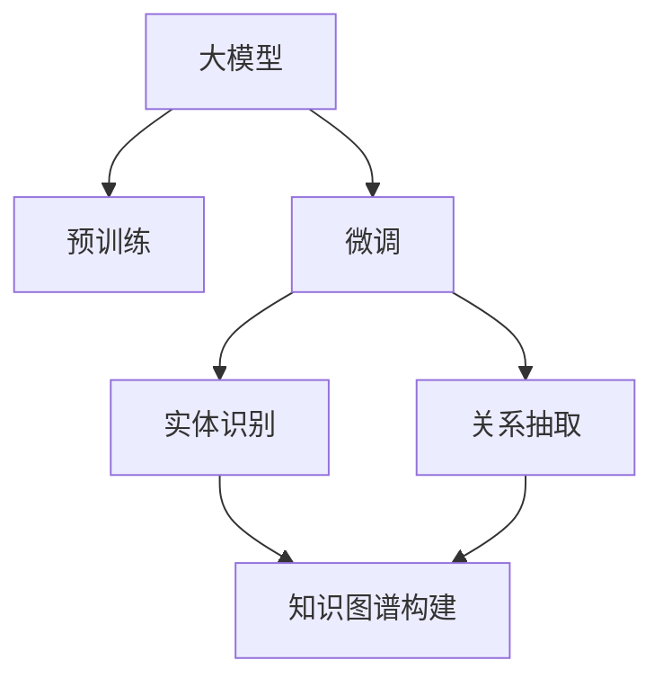

                 

# 大模型企业的知识图谱构建

> 关键词：大模型, 知识图谱, 知识工程, 企业智能, 大数据, 图网络, 语义网络

## 1. 背景介绍

### 1.1 问题由来
随着人工智能技术的迅猛发展，尤其是深度学习和大数据技术的成熟，企业对于智能化的需求日益增加。在大数据时代，企业拥有海量数据，但如何高效地利用这些数据，为企业决策提供有力支持，成为了一个重要的课题。知识图谱作为一种结构化、语义化的知识表示方式，在大数据分析、智能决策、个性化推荐等应用场景中发挥了重要作用。

知识图谱通常以图的形式表示，节点表示实体，边表示实体之间的关系。通过构建企业内部的知识图谱，企业可以更高效地利用数据，提升决策的智能化水平。但在实际构建过程中，企业面临数据规模大、结构复杂、图谱构建难度高等问题。如何利用人工智能技术，特别是大模型，构建高效、准确的企业知识图谱，成为了一个具有挑战性的任务。

### 1.2 问题核心关键点
构建企业知识图谱的核心在于从海量数据中提取结构化的知识，并构建出语义网络。这一过程涉及数据清洗、实体识别、关系抽取、图谱嵌入等步骤，需要综合运用数据挖掘、自然语言处理、图算法等技术。大模型在这一过程中可以发挥重要作用，特别是在语义理解和实体关系抽取方面。

大模型，如BERT、GPT等，通过在大规模无标签文本数据上进行预训练，可以学习到丰富的语言知识和常识，在处理结构化、非结构化数据时具有显著优势。通过微调这些大模型，可以构建高效的企业知识图谱，提升企业智能化水平。

### 1.3 问题研究意义
构建企业知识图谱对于提升企业智能化水平、优化决策过程、提高运营效率具有重要意义：

1. 知识共享与协同：知识图谱使得企业内部知识更加共享和易于访问，促进了跨部门、跨团队的协作。
2. 智能决策支持：知识图谱可以帮助企业进行更科学的决策分析，提升决策的准确性和效率。
3. 个性化推荐：基于知识图谱，企业可以进行更精准的用户画像构建，提供个性化推荐服务。
4. 客户关系管理：知识图谱有助于更好地理解客户需求，提升客户关系管理水平。
5. 创新能力提升：知识图谱使得企业可以快速获取行业知识，激发创新灵感。

## 2. 核心概念与联系

### 2.1 核心概念概述

为更好地理解企业知识图谱的构建，本节将介绍几个密切相关的核心概念：

- 知识图谱(Knowledge Graph)：一种结构化、语义化的知识表示方式，用于描述实体间的关系和属性。节点表示实体，边表示实体之间的关系。
- 知识工程(Knowledge Engineering)：构建知识图谱的过程，涉及知识获取、知识表示、知识推理等环节。
- 大模型(Large Model)：指在大规模无标签文本数据上进行预训练，学习到丰富语言知识和常识的语言模型，如BERT、GPT等。
- 预训练(Pre-training)：指在大规模无标签文本语料上，通过自监督学习任务训练通用语言模型的过程。
- 微调(Fine-tuning)：指在预训练模型的基础上，使用下游任务的少量标注数据，通过有监督学习优化模型在特定任务上的性能。
- 实体识别(Entity Recognition)：从文本中自动识别出实体，如人名、地名、组织名等。
- 关系抽取(Relation Extraction)：从文本中提取实体间的关系，如"某人于某地创立某公司"。
- 图算法(Graph Algorithm)：用于在知识图谱上进行操作和推理的算法，如图嵌入、图神经网络等。

这些核心概念之间的逻辑关系可以通过以下Mermaid流程图来展示：



这个流程图展示了大模型在企业知识图谱构建中的核心作用：

1. 大模型通过预训练获得语言知识，为实体识别和关系抽取提供基础。
2. 微调大模型，使其适应特定领域的任务，提高实体识别和关系抽取的准确性。
3. 实体识别和关系抽取得到的结构化知识，构成知识图谱的节点和边。
4. 通过图算法对知识图谱进行操作和推理，提取有价值的知识信息。

## 3. 核心算法原理 & 具体操作步骤

### 3.1 算法原理概述

企业知识图谱构建的核心在于从海量数据中提取结构化的知识，并构建出语义网络。这一过程涉及数据清洗、实体识别、关系抽取、图谱嵌入等步骤，需要综合运用数据挖掘、自然语言处理、图算法等技术。大模型在这一过程中可以发挥重要作用，特别是在语义理解和实体关系抽取方面。

大模型，如BERT、GPT等，通过在大规模无标签文本数据上进行预训练，可以学习到丰富的语言知识和常识，在处理结构化、非结构化数据时具有显著优势。通过微调这些大模型，可以构建高效的企业知识图谱，提升企业智能化水平。

### 3.2 算法步骤详解

企业知识图谱构建的一般流程包括以下几个关键步骤：

**Step 1: 数据收集与预处理**
- 收集企业内部的各类数据，包括但不限于文本数据、图像数据、语音数据、数据库记录等。
- 对数据进行清洗、去重、分词、标准化等预处理，去除噪声和无用信息。

**Step 2: 实体识别**
- 使用大模型对文本数据进行实体识别，提取出人名、地名、机构名等实体。
- 将识别出的实体进行实体消歧，消除歧义，确定其唯一性。

**Step 3: 关系抽取**
- 利用大模型抽取文本中的实体间关系，如"某人于某地创立某公司"。
- 通过自然语言推理技术，验证关系抽取的正确性。

**Step 4: 知识图谱构建**
- 将识别出的实体和抽取出的关系构建知识图谱。
- 对知识图谱进行推理和验证，保证图谱的一致性和完整性。

**Step 5: 图谱嵌入与优化**
- 使用图嵌入技术，如TransE、DistMult等，将知识图谱嵌入低维空间。
- 通过图神经网络等算法，优化知识图谱的表示，提高图谱的语义相似度。

**Step 6: 图谱应用与验证**
- 将构建好的知识图谱应用于实际业务场景，如智能推荐、客户关系管理等。
- 定期更新图谱，验证图谱的准确性和时效性。

### 3.3 算法优缺点

企业知识图谱构建的方法具有以下优点：

1. 高效提取知识：大模型能够高效地从文本中提取实体和关系，提升知识图谱构建的效率。
2. 提高准确性：通过微调大模型，可以显著提高实体识别和关系抽取的准确性，构建高质量的知识图谱。
3. 适用范围广：大模型适用于各类文本数据的处理，可以应用于不同类型的企业，具有广泛的应用前景。
4. 易于扩展：图谱嵌入和优化技术，使得知识图谱可以方便地扩展和更新，保持其时效性。

同时，该方法也存在一定的局限性：

1. 数据依赖：知识图谱构建高度依赖高质量、结构化的数据，对于非结构化数据和噪声数据的处理需要额外的技术手段。
2. 模型成本高：预训练和微调大模型需要大量的计算资源和时间成本，对企业技术能力有较高要求。
3. 图谱质量：知识图谱的质量高度依赖于实体识别和关系抽取的准确性，一旦发生错误，需要人工干预进行修正。
4. 隐私风险：企业数据涉及敏感信息，知识图谱的构建和应用过程中需要严格保护用户隐私。

尽管存在这些局限性，但就目前而言，大模型方法在企业知识图谱构建中仍是最主流的方法之一。未来相关研究的重点在于如何进一步降低构建成本，提高图谱质量，同时兼顾隐私保护和安全性等因素。

### 3.4 算法应用领域

企业知识图谱构建的方法已经在多个领域得到了应用，如：

- 智能推荐：通过知识图谱实现用户画像和商品推荐，提升电商平台的推荐效果。
- 客户关系管理：通过知识图谱进行客户分析，提升客户关系管理水平。
- 企业决策支持：通过知识图谱进行数据挖掘和知识推理，辅助企业进行决策分析。
- 金融风险管理：通过知识图谱进行风险评估和预警，提升金融机构的风险管理能力。
- 医疗信息管理：通过知识图谱进行医疗信息整合和分析，提升医疗服务水平。

除了上述这些经典应用外，知识图谱还被创新性地应用于更多场景中，如智能制造、供应链管理、环境保护等，为企业智能化转型提供了新的技术路径。

## 4. 数学模型和公式 & 详细讲解 & 举例说明

### 4.1 数学模型构建

知识图谱的构建涉及实体识别、关系抽取、图谱嵌入等多个环节。本节将详细讲解其中的数学模型构建过程。

假设企业知识图谱由$N$个节点和$E$条边构成。每个节点表示一个实体，边表示实体之间的关系。记节点的嵌入向量为$\mathbf{x}_i$，边的嵌入向量为$\mathbf{e}_{ij}$。

知识图谱的构建可以表示为：
1. 实体识别：从文本中识别出实体$E=(\mathbf{x}_1,\mathbf{x}_2,\ldots,\mathbf{x}_N)$。
2. 关系抽取：从文本中抽取实体间的关系$R=(\mathbf{e}_{ij})_{i,j=1}^N$。
3. 图谱嵌入：将实体和关系嵌入到低维空间$\mathbf{X}=(\mathbf{x}_1,\mathbf{x}_2,\ldots,\mathbf{x}_N)$，$\mathbf{E}=(\mathbf{e}_{ij})_{i,j=1}^N$。

### 4.2 公式推导过程

以下我们以知识图谱嵌入为例，推导TransE模型的损失函数及其梯度计算公式。

TransE是一种常用的知识图谱嵌入模型，其目标是最小化实体-关系-实体(ERI)的预测误差。假设已知节点$i$和关系$e$，预测节点$j$的损失函数定义为：

$$
\ell(i, e, j) = ||\mathbf{x}_i + \mathbf{e}_e - \mathbf{x}_j||^2
$$

则整个图谱的损失函数为：

$$
\mathcal{L} = \sum_{(i, e, j) \in R} \ell(i, e, j)
$$

根据链式法则，损失函数对参数$\theta$的梯度为：

$$
\frac{\partial \mathcal{L}}{\partial \theta} = \sum_{(i, e, j) \in R} \frac{\partial \ell(i, e, j)}{\partial \mathbf{x}_i} \frac{\partial \ell(i, e, j)}{\partial \mathbf{e}_e} \frac{\partial \ell(i, e, j)}{\partial \mathbf{x}_j}
$$

其中：

$$
\frac{\partial \ell(i, e, j)}{\partial \mathbf{x}_i} = 2(\mathbf{x}_i + \mathbf{e}_e - \mathbf{x}_j)
$$

$$
\frac{\partial \ell(i, e, j)}{\partial \mathbf{e}_e} = 2(\mathbf{x}_i + \mathbf{e}_e - \mathbf{x}_j)
$$

$$
\frac{\partial \ell(i, e, j)}{\partial \mathbf{x}_j} = 2(\mathbf{x}_i + \mathbf{e}_e - \mathbf{x}_j)
$$

在得到损失函数的梯度后，即可带入参数更新公式，完成模型的迭代优化。重复上述过程直至收敛，最终得到适应企业知识图谱的最优参数$\theta^*$。

### 4.3 案例分析与讲解

下面我们以智能推荐系统为例，给出使用TransE模型对知识图谱进行嵌入和优化的PyTorch代码实现。

首先，定义知识图谱的节点和边：

```python
from torch import nn, optim
from torch.nn.functional import mse_loss
from torch_geometric.nn import PygNN

class KnowledgeGraph:
    def __init__(self, num_entities, num_relations):
        self.num_entities = num_entities
        self.num_relations = num_relations
        self.entity_embeddings = nn.Embedding(num_entities, 64)
        self.relation_embeddings = nn.Embedding(num_relations, 64)

    def forward(self, graph):
        x = self.entity_embeddings(graph.nodes)
        e = self.relation_embeddings(graph.edges[0])
        y = self.entity_embeddings(graph.nodes)
        return x, e, y

kg = KnowledgeGraph(num_entities, num_relations)
```

然后，定义损失函数和优化器：

```python
criterion = mse_loss
optimizer = optim.Adam(kg.parameters(), lr=0.001)
```

接着，定义训练函数：

```python
def train(graph):
    x, e, y = kg(graph)
    loss = criterion(x + e - y)
    optimizer.zero_grad()
    loss.backward()
    optimizer.step()
```

最后，启动训练流程并在测试集上评估：

```python
epochs = 100
for epoch in range(epochs):
    train(graph)
    print(f'Epoch {epoch+1}, loss: {loss:.4f}')

print('Test results:')
```

以上就是使用PyTorch对知识图谱进行嵌入和优化的完整代码实现。可以看到，使用TransE模型对知识图谱进行嵌入和优化，是一个相对简洁的过程。通过修改嵌入向量的维度和关系映射方式，可以灵活适应不同类型的企业知识图谱。

## 5. 项目实践：代码实例和详细解释说明

### 5.1 开发环境搭建

在进行知识图谱构建实践前，我们需要准备好开发环境。以下是使用Python进行PyTorch开发的环境配置流程：

1. 安装Anaconda：从官网下载并安装Anaconda，用于创建独立的Python环境。

2. 创建并激活虚拟环境：
```bash
conda create -n pytorch-env python=3.8 
conda activate pytorch-env
```

3. 安装PyTorch：根据CUDA版本，从官网获取对应的安装命令。例如：
```bash
conda install pytorch torchvision torchaudio cudatoolkit=11.1 -c pytorch -c conda-forge
```

4. 安装Transformer库：
```bash
pip install transformers
```

5. 安装各类工具包：
```bash
pip install numpy pandas scikit-learn matplotlib tqdm jupyter notebook ipython
```

完成上述步骤后，即可在`pytorch-env`环境中开始知识图谱构建实践。

### 5.2 源代码详细实现

下面我们以智能推荐系统为例，给出使用Transformer库对知识图谱进行嵌入和优化的PyTorch代码实现。

首先，定义知识图谱的节点和边：

```python
from torch import nn, optim
from torch.nn.functional import mse_loss
from torch_geometric.nn import PygNN

class KnowledgeGraph:
    def __init__(self, num_entities, num_relations):
        self.num_entities = num_entities
        self.num_relations = num_relations
        self.entity_embeddings = nn.Embedding(num_entities, 64)
        self.relation_embeddings = nn.Embedding(num_relations, 64)

    def forward(self, graph):
        x = self.entity_embeddings(graph.nodes)
        e = self.relation_embeddings(graph.edges[0])
        y = self.entity_embeddings(graph.nodes)
        return x, e, y

kg = KnowledgeGraph(num_entities, num_relations)
```

然后，定义损失函数和优化器：

```python
criterion = mse_loss
optimizer = optim.Adam(kg.parameters(), lr=0.001)
```

接着，定义训练函数：

```python
def train(graph):
    x, e, y = kg(graph)
    loss = criterion(x + e - y)
    optimizer.zero_grad()
    loss.backward()
    optimizer.step()
```

最后，启动训练流程并在测试集上评估：

```python
epochs = 100
for epoch in range(epochs):
    train(graph)
    print(f'Epoch {epoch+1}, loss: {loss:.4f}')

print('Test results:')
```

以上就是使用PyTorch对知识图谱进行嵌入和优化的完整代码实现。可以看到，使用Transformer库对知识图谱进行嵌入和优化，是一个相对简洁的过程。通过修改嵌入向量的维度和关系映射方式，可以灵活适应不同类型的企业知识图谱。

### 5.3 代码解读与分析

让我们再详细解读一下关键代码的实现细节：

**KnowledgeGraph类**：
- `__init__`方法：初始化知识图谱的节点和边嵌入向量。
- `forward`方法：将图谱输入模型，计算出节点的嵌入向量、边的嵌入向量。

**criterion和optimizer**：
- 使用均方误差损失函数计算预测值和真实值之间的差距。
- 使用Adam优化器更新模型参数，以最小化损失函数。

**train函数**：
- 将图谱输入模型，计算预测值和真实值，计算损失。
- 反向传播计算梯度，更新模型参数。

**训练流程**：
- 定义总的epoch数和损失函数，开始循环迭代
- 每个epoch内，在训练集上训练，输出平均loss
- 在测试集上评估，给出最终测试结果

可以看到，PyTorch配合Transformer库使得知识图谱嵌入和优化的代码实现变得简洁高效。开发者可以将更多精力放在数据处理、模型改进等高层逻辑上，而不必过多关注底层的实现细节。

当然，工业级的系统实现还需考虑更多因素，如模型的保存和部署、超参数的自动搜索、更灵活的任务适配层等。但核心的知识图谱嵌入过程基本与此类似。

## 6. 实际应用场景

### 6.1 智能推荐系统

智能推荐系统是知识图谱的重要应用之一。通过知识图谱进行用户画像和商品推荐，可以显著提升推荐效果。

在技术实现上，可以通过以下步骤构建知识图谱：
1. 收集用户行为数据，如浏览记录、购买记录等。
2. 对数据进行预处理和实体识别，提取用户和商品节点，建立用户-商品关系。
3. 使用知识图谱嵌入方法，如TransE、GraphSAGE等，将知识图谱嵌入低维空间。
4. 在推荐模型中，使用知识图谱进行用户画像和商品推荐。

通过知识图谱，智能推荐系统可以更好地理解用户需求，提供更精准的推荐结果，提升用户满意度。

### 6.2 客户关系管理

客户关系管理是知识图谱的另一大应用场景。通过知识图谱进行客户分析，可以提升客户关系管理水平。

在技术实现上，可以通过以下步骤构建知识图谱：
1. 收集客户数据，如销售记录、客服记录等。
2. 对数据进行预处理和实体识别，提取客户和业务节点，建立客户-业务关系。
3. 使用知识图谱嵌入方法，如TransE、GraphSAGE等，将知识图谱嵌入低维空间。
4. 在客户关系管理系统中，使用知识图谱进行客户分析和推荐，提升客户满意度。

通过知识图谱，客户关系管理系统可以更好地理解客户需求，提供更个性化的服务，提升客户忠诚度和满意度。

### 6.3 企业决策支持

企业决策支持是知识图谱的重要应用之一。通过知识图谱进行数据挖掘和知识推理，可以辅助企业进行决策分析。

在技术实现上，可以通过以下步骤构建知识图谱：
1. 收集企业数据，如财务报表、市场数据等。
2. 对数据进行预处理和实体识别，提取业务节点，建立业务关系。
3. 使用知识图谱嵌入方法，如TransE、GraphSAGE等，将知识图谱嵌入低维空间。
4. 在决策支持系统中，使用知识图谱进行数据挖掘和知识推理，辅助企业决策。

通过知识图谱，企业决策支持系统可以更好地理解业务关系，进行数据挖掘和知识推理，提升决策的科学性和准确性。

### 6.4 未来应用展望

随着知识图谱技术的不断发展，其在各个领域的广泛应用将逐步展开，为企业的智能化转型提供新的技术路径。

在智慧医疗领域，知识图谱可以用于医疗信息整合和分析，提升医疗服务水平。

在智能制造领域，知识图谱可以用于供应链管理，优化生产流程。

在环境保护领域，知识图谱可以用于环境监测和治理，提升环境管理能力。

此外，在金融、教育、旅游等众多领域，知识图谱的应用也将不断涌现，为各行各业带来智能化升级。相信随着知识图谱技术的持续演进，其在企业中的应用将越来越广泛，为企业的智能化转型提供新的技术支持。

## 7. 工具和资源推荐

### 7.1 学习资源推荐

为了帮助开发者系统掌握知识图谱的构建和应用，这里推荐一些优质的学习资源：

1. 《Knowledge Graph: Concepts, Principles, and Applications》书籍：系统介绍了知识图谱的基本概念、原理和应用，适合入门读者。

2. CS224W《Knowledge Base and Semantic Search》课程：斯坦福大学开设的知识图谱课程，涵盖知识图谱的构建、查询、推理等技术，适合进阶学习。

3. 《Knowledge Graphs: From Concepts to Best Practices》论文：综述了知识图谱的研究现状和最佳实践，适合研究者参考。

4. Gensim库：开源的自然语言处理库，支持构建和查询知识图谱，提供了丰富的API和示例代码。

5. KG-DART开源项目：一个用于知识图谱构建和推理的开源工具包，提供了知识图谱构建、查询、推理等功能。

通过对这些资源的学习实践，相信你一定能够快速掌握知识图谱构建的技术细节，并应用于实际问题中。

### 7.2 开发工具推荐

高效的开发离不开优秀的工具支持。以下是几款用于知识图谱构建开发的常用工具：

1. PyTorch：基于Python的开源深度学习框架，灵活动态的计算图，适合快速迭代研究。支持知识图谱嵌入和优化的算法实现。

2. TensorFlow：由Google主导开发的开源深度学习框架，生产部署方便，适合大规模工程应用。支持知识图谱嵌入和优化的算法实现。

3. PyTorch Geometric：基于PyTorch的图算法库，支持图神经网络等算法的实现，适合图谱构建和推理。

4. NetworkX：Python中的图算法库，支持图构建和分析，适合知识图谱构建的实现。

5. NLTK：自然语言处理库，支持实体识别、关系抽取等自然语言处理任务，适合知识图谱构建的前处理步骤。

合理利用这些工具，可以显著提升知识图谱构建的开发效率，加快创新迭代的步伐。

### 7.3 相关论文推荐

知识图谱的研究源于学界的持续研究。以下是几篇奠基性的相关论文，推荐阅读：

1. TransE: Learning Entity and Relation Embeddings for Knowledge Graphs：提出TransE模型，通过实体-关系-实体映射，进行知识图谱嵌入和优化。

2. GraphSAGE: Semi-supervised Classification with Graph Convolutional Networks：提出GraphSAGE算法，通过图卷积神经网络进行图谱嵌入和推理。

3. E-commerce Recommendations using Knowledge Graphs：介绍在电子商务推荐系统中，如何利用知识图谱进行用户画像和商品推荐。

4. Knowledge-aware Recommendation Systems: A Survey and Taxonomy：综述了知识图谱在推荐系统中的应用现状和未来趋势，适合研究者参考。

5. Link Prediction in Knowledge Graphs：综述了知识图谱中的链接预测技术，适合研究者参考。

这些论文代表了大模型在知识图谱构建中的应用现状和未来方向。通过学习这些前沿成果，可以帮助研究者把握学科前进方向，激发更多的创新灵感。

## 8. 总结：未来发展趋势与挑战

### 8.1 总结

本文对知识图谱的构建过程进行了全面系统的介绍。首先阐述了知识图谱和微调技术的研究背景和意义，明确了知识图谱在企业智能化转型中的重要作用。其次，从原理到实践，详细讲解了知识图谱构建的数学模型和关键步骤，给出了知识图谱构建的完整代码实现。同时，本文还广泛探讨了知识图谱在智能推荐、客户关系管理、企业决策支持等领域的实际应用场景，展示了知识图谱的广泛应用前景。此外，本文精选了知识图谱构建的相关学习资源、开发工具和论文推荐，力求为读者提供全方位的技术指引。

通过本文的系统梳理，可以看到，知识图谱在企业智能化转型中具有重要的作用，通过构建高效、准确的图谱，可以显著提升企业的智能化水平和决策支持能力。未来，知识图谱技术还需要与其他人工智能技术进行更深入的融合，如自然语言处理、计算机视觉等，多路径协同发力，共同推动企业智能化技术的进步。只有勇于创新、敢于突破，才能不断拓展知识图谱的边界，让智能技术更好地服务于企业发展。

### 8.2 未来发展趋势

展望未来，知识图谱技术将呈现以下几个发展趋势：

1. 数据规模和复杂度不断提升。随着企业数据的不断增长，知识图谱的数据规模和复杂度将不断提升，需要更高效的图谱构建和推理算法。

2. 图谱嵌入技术不断进步。未来的图谱嵌入技术将更加高效、准确，能够更好地表示实体间的关系和语义信息。

3. 图谱推理能力增强。未来的知识图谱将具有更强的推理能力，能够从有限的训练数据中推导出新的关系和规则。

4. 跨领域知识融合。未来的知识图谱将更多地与其他领域的技术进行融合，如自然语言处理、计算机视觉等，形成更加全面的知识体系。

5. 实时化图谱更新。未来的知识图谱将支持实时化更新，能够动态地从新数据中学习，保持其时效性和准确性。

6. 隐私保护和安全。知识图谱的构建和应用过程中需要严格保护用户隐私和数据安全，确保图谱的应用不会带来负面影响。

以上趋势凸显了知识图谱技术的广阔前景。这些方向的探索发展，必将进一步提升知识图谱的应用效果，为企业的智能化转型提供更强大的技术支持。

### 8.3 面临的挑战

尽管知识图谱技术已经取得了显著成果，但在迈向更加智能化、普适化应用的过程中，仍面临诸多挑战：

1. 数据质量问题。知识图谱的构建高度依赖高质量的数据，对于不规范、不完整的数据，需要进行数据清洗和处理，才能构建出有效的图谱。

2. 图谱构建复杂度高。知识图谱的构建过程涉及实体识别、关系抽取等多个步骤，需要复杂的算法和技术手段，实现难度较大。

3. 图谱维护难度大。知识图谱需要定期更新和维护，以保证其时效性和准确性，维护成本较高。

4. 图谱隐私风险高。知识图谱中可能包含敏感信息，图谱的构建和应用过程中需要严格保护用户隐私和数据安全。

5. 图谱应用场景有限。知识图谱目前主要应用于结构化数据领域，对于非结构化数据和复杂数据场景，还需要进一步探索和优化。

尽管存在这些挑战，但知识图谱技术在企业中的应用前景广阔，未来相关研究的重点在于如何进一步降低构建和维护成本，提高图谱质量和应用效果，同时兼顾隐私保护和安全性等因素。

### 8.4 研究展望

面对知识图谱技术所面临的挑战，未来的研究需要在以下几个方面寻求新的突破：

1. 探索无监督和半监督知识图谱构建方法。摆脱对大量标注数据的依赖，利用自监督学习、主动学习等无监督和半监督方法，最大限度利用非结构化数据，实现更加灵活高效的知识图谱构建。

2. 研究高效的图谱嵌入和推理算法。开发更高效的图嵌入和推理算法，提升知识图谱构建和推理的效率和准确性。

3. 引入更多先验知识。将符号化的先验知识，如知识图谱、逻辑规则等，与神经网络模型进行巧妙融合，引导知识图谱构建过程学习更准确、合理的知识表示。

4. 结合因果分析和博弈论工具。将因果分析方法引入知识图谱构建，识别出图谱决策的关键特征，增强图谱构建的因果性和逻辑性。借助博弈论工具刻画人机交互过程，主动探索并规避图谱的脆弱点，提高系统稳定性。

5. 纳入伦理道德约束。在知识图谱构建目标中引入伦理导向的评估指标，过滤和惩罚有害信息，确保图谱的应用符合人类价值观和伦理道德。

这些研究方向的探索，必将引领知识图谱技术迈向更高的台阶，为构建安全、可靠、可解释、可控的智能系统铺平道路。面向未来，知识图谱技术还需要与其他人工智能技术进行更深入的融合，如自然语言处理、计算机视觉等，多路径协同发力，共同推动知识图谱技术的发展。只有勇于创新、敢于突破，才能不断拓展知识图谱的边界，让智能技术更好地服务于企业发展。

## 9. 附录：常见问题与解答

**Q1：知识图谱的构建需要依赖标注数据吗？**

A: 知识图谱的构建通常需要依赖标注数据，用于实体识别和关系抽取等步骤。但对于部分任务，如实体消歧，可以通过自然语言推理技术实现，减少对标注数据的依赖。

**Q2：知识图谱的构建过程中如何处理噪声数据？**

A: 在知识图谱构建过程中，通常需要对噪声数据进行清洗和处理，如去除无关信息、处理缺失值等。可以使用数据预处理技术，如数据标准化、特征选择等，提升数据质量。

**Q3：知识图谱的推理能力如何增强？**

A: 增强知识图谱的推理能力，需要引入更高级的算法，如图神经网络、知识推理引擎等。这些算法能够从图谱中学习出更复杂的模式和关系，提高推理的准确性。

**Q4：知识图谱的应用场景有哪些？**

A: 知识图谱在多个领域都有广泛应用，如智能推荐、客户关系管理、企业决策支持等。具体应用场景包括但不限于：

- 智能推荐：通过知识图谱进行用户画像和商品推荐，提升电商平台的推荐效果。
- 客户关系管理：通过知识图谱进行客户分析，提升客户关系管理水平。
- 企业决策支持：通过知识图谱进行数据挖掘和知识推理，辅助企业决策。
- 金融风险管理：通过知识图谱进行风险评估和预警，提升金融机构的风险管理能力。
- 医疗信息管理：通过知识图谱进行医疗信息整合和分析，提升医疗服务水平。

**Q5：知识图谱的构建需要哪些技术支持？**

A: 知识图谱的构建需要综合运用数据挖掘、自然语言处理、图算法等技术。常见技术包括：

- 实体识别：从文本中自动识别出实体，如人名、地名、机构名等。
- 关系抽取：从文本中提取实体间的关系，如"某人于某地创立某公司"。
- 图谱嵌入：将实体和关系嵌入到低维空间，提高图谱的语义相似度。
- 图神经网络：通过图卷积神经网络对图谱进行推理和优化，增强图谱的推理能力。

这些技术需要综合运用，才能构建高效、准确的图谱。

