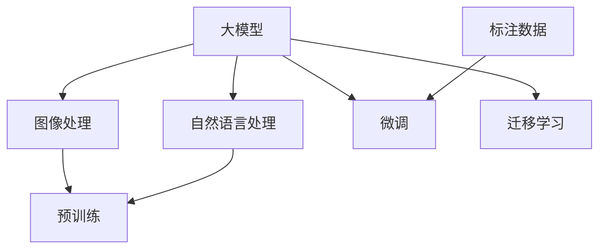

                 

# 大模型在智能安防中的应用探索

## 1. 背景介绍

### 1.1 问题由来

随着人工智能技术的迅猛发展，智能安防领域也在逐渐引入先进的技术手段，以提升安防系统的智能化水平。但传统的监控视频分析和人员行为识别技术，在面对大规模数据集和复杂场景时，常常显得力不从心。这就需要引入大模型技术，通过预训练和微调等手段，在安防任务中获得更好的性能表现。

大模型（如BERT、GPT、DALL·E等）通过海量的无标签数据进行预训练，可以学习到丰富的语言、图像等知识，并在少量有标签数据的微调下，快速适应新的任务。这种技术在智能安防中的应用，能够极大提升安防系统的识别精度和响应速度，增强其处理复杂场景和实时数据的能力。

### 1.2 问题核心关键点

在智能安防应用中，大模型的预训练和微调主要关注以下几个关键点：

- **数据获取与标注**：智能安防任务通常需要高质量的标注数据，但标注成本高昂。如何获取大量且高质量的标注数据，是大模型在安防应用中面临的主要挑战。

- **模型选择与适配**：在智能安防任务中，需要选择适合的大模型，并根据具体需求对其结构进行适配。常用的模型包括BERT、GPT、ResNet等。

- **微调参数与策略**：在微调过程中，需要合理设置学习率、批大小、优化器等参数，以避免过拟合和欠拟合，提高模型泛化能力。

- **实时性要求**：智能安防任务对实时性有较高要求，因此需要在模型结构和优化策略上，进行针对性的优化，以支持高效的推理计算。

## 2. 核心概念与联系

### 2.1 核心概念概述

在智能安防中，大模型主要应用于两个方向：图像处理和自然语言处理。图像处理方面，大模型如DALL·E可以用于识别监控图像中的异常行为；自然语言处理方面，大模型如GPT可以用于分析安防人员的对话记录，提高对话分析的准确性和效率。

以下是核心概念的概述：

- **大模型**：通过大规模数据预训练得到的模型，如BERT、GPT、DALL·E等。
- **图像处理**：利用大模型对监控图像进行目标检测、行为识别等任务。
- **自然语言处理**：利用大模型对安防对话记录进行情感分析、意图识别、问答等任务。
- **微调**：在大模型的基础上，通过少量标注数据进行微调，以适应特定安防任务。
- **迁移学习**：利用大模型在预训练过程中学习到的通用知识，迁移到特定安防任务中，提高微调效果。

### 2.2 核心概念原理和架构的 Mermaid 流程图



这个Mermaid图展示了智能安防中大模型应用的核心流程：大模型通过预训练学习通用的知识，然后根据特定的安防任务，通过微调和迁移学习，提升模型在安防任务中的性能。

## 3. 核心算法原理 & 具体操作步骤

### 3.1 算法原理概述

基于大模型的安防应用，主要分为两个步骤：预训练和微调。

预训练步骤中，大模型通过海量的无标签图像和文本数据进行预训练，学习通用的图像和语言表示。然后，在微调步骤中，通过选择适合的任务数据集和微调策略，使大模型适应特定的安防任务，提升其在该任务上的性能。

微调过程中，常用的算法包括梯度下降法、AdamW优化器等，通过反向传播计算梯度，更新模型参数。常用的微调策略包括全参数微调和参数高效微调（PEFT），后者只更新部分参数，以减少计算资源消耗。

### 3.2 算法步骤详解

#### 3.2.1 数据准备

- **图像数据**：收集大量监控图像数据，并对数据进行标注，如目标检测、行为识别等。
- **文本数据**：收集安防人员的对话记录，并对其进行标注，如情感分析、意图识别等。

#### 3.2.2 模型选择与适配

- **图像处理**：选择适合的大模型，如DALL·E，并对其结构进行适配，如调整卷积层和池化层。
- **自然语言处理**：选择适合的大模型，如GPT，并对其结构进行适配，如调整线性分类器和解码器。

#### 3.2.3 微调策略设置

- **学习率**：选择合适的学习率，一般比预训练时小1-2个数量级。
- **批大小**：选择合适的批大小，以平衡模型的收敛速度和计算资源。
- **优化器**：选择合适的优化器，如AdamW。
- **正则化**：应用L2正则、Dropout等正则化技术，防止过拟合。

#### 3.2.4 微调过程

- **图像处理**：将标注好的图像数据输入模型，进行前向传播计算损失函数，反向传播更新模型参数。
- **自然语言处理**：将标注好的文本数据输入模型，进行前向传播计算损失函数，反向传播更新模型参数。

#### 3.2.5 评估与优化

- **评估**：在验证集上评估模型性能，通过精确度、召回率、F1分数等指标进行评估。
- **优化**：根据评估结果调整微调策略，如调整学习率、批大小、正则化参数等。

### 3.3 算法优缺点

大模型在智能安防中的应用具有以下优点：

- **强大的泛化能力**：大模型通过大规模数据预训练，具有较强的泛化能力，能够适应多种安防场景。
- **高效的处理能力**：大模型在推理过程中能够高效处理复杂场景，提升安防系统的响应速度。
- **灵活的适配能力**：大模型能够根据不同的安防任务进行适配，提高其在特定任务上的性能。

同时，也存在一些缺点：

- **高成本的预训练**：大模型预训练需要大量的计算资源和存储空间，成本较高。
- **数据依赖性强**：微调过程对标注数据的质量和数量有较高要求，标注成本高昂。
- **实时性问题**：大模型推理计算量大，可能存在实时性问题，需要优化模型结构和推理策略。

### 3.4 算法应用领域

大模型在智能安防中的应用领域广泛，包括但不限于：

- **视频监控**：利用大模型进行目标检测、行为识别、异常检测等任务。
- **人脸识别**：利用大模型进行人脸识别、面部表情识别等任务。
- **语音识别**：利用大模型进行安防人员的语音识别和情感分析。
- **安全事件分析**：利用大模型分析安防事件日志，进行异常行为检测和安全预警。
- **智能门禁系统**：利用大模型进行身份验证和行为识别，提升门禁系统的智能化水平。

## 4. 数学模型和公式 & 详细讲解

### 4.1 数学模型构建

在智能安防应用中，大模型主要用于图像处理和自然语言处理两个方向。

#### 4.1.1 图像处理

假设大模型为 $M_{\theta}$，输入图像为 $x$，输出为 $y$。则微调目标为最小化经验风险：

$$
\mathcal{L}(\theta) = \frac{1}{N}\sum_{i=1}^N \ell(M_{\theta}(x_i), y_i)
$$

其中 $\ell$ 为损失函数，如交叉熵损失或均方误差损失。

#### 4.1.2 自然语言处理

假设大模型为 $M_{\theta}$，输入文本为 $x$，输出为 $y$。则微调目标为最小化交叉熵损失：

$$
\mathcal{L}(\theta) = -\frac{1}{N}\sum_{i=1}^N \sum_{j=1}^{N} y_i \log M_{\theta}(x_i)
$$

其中 $y_i$ 为标注标签，$M_{\theta}(x_i)$ 为模型预测结果。

### 4.2 公式推导过程

#### 4.2.1 图像处理

假设大模型为 $M_{\theta}$，输入图像为 $x$，输出为 $y$。则微调目标为最小化经验风险：

$$
\mathcal{L}(\theta) = \frac{1}{N}\sum_{i=1}^N \ell(M_{\theta}(x_i), y_i)
$$

其中 $\ell$ 为损失函数，如交叉熵损失或均方误差损失。

假设大模型的输出为 $y'$，则损失函数为：

$$
\ell(y', y) = -y \log y' - (1-y) \log (1-y')
$$

微调过程中的梯度更新公式为：

$$
\theta \leftarrow \theta - \eta \nabla_{\theta} \mathcal{L}(\theta) - \eta\lambda \theta
$$

其中 $\eta$ 为学习率，$\lambda$ 为正则化系数。

#### 4.2.2 自然语言处理

假设大模型为 $M_{\theta}$，输入文本为 $x$，输出为 $y$。则微调目标为最小化交叉熵损失：

$$
\mathcal{L}(\theta) = -\frac{1}{N}\sum_{i=1}^N \sum_{j=1}^{N} y_i \log M_{\theta}(x_i)
$$

其中 $y_i$ 为标注标签，$M_{\theta}(x_i)$ 为模型预测结果。

假设大模型的输出为 $y'$，则损失函数为：

$$
\ell(y', y) = -y \log y' - (1-y) \log (1-y')
$$

微调过程中的梯度更新公式为：

$$
\theta \leftarrow \theta - \eta \nabla_{\theta} \mathcal{L}(\theta) - \eta\lambda \theta
$$

其中 $\eta$ 为学习率，$\lambda$ 为正则化系数。

### 4.3 案例分析与讲解

假设我们希望使用BERT模型进行视频监控中的人员行为识别。具体步骤如下：

1. **数据准备**：收集大量监控视频数据，并对视频中的行为进行标注。
2. **模型选择**：选择BERT模型，并对其结构进行适配，如添加时间池化层。
3. **微调策略**：设置合适的学习率、批大小、优化器等参数。
4. **微调过程**：将标注好的视频数据输入模型，进行前向传播计算损失函数，反向传播更新模型参数。
5. **评估与优化**：在验证集上评估模型性能，根据评估结果调整微调策略。

例如，在图像处理任务中，假设我们的损失函数为交叉熵损失，则具体的梯度计算公式为：

$$
\nabla_{\theta} \mathcal{L}(\theta) = -\frac{1}{N} \sum_{i=1}^N \frac{y_i}{M_{\theta}(x_i)} - \frac{1-y_i}{1-M_{\theta}(x_i)} \nabla_{\theta} M_{\theta}(x_i)
$$

其中 $\nabla_{\theta} M_{\theta}(x_i)$ 为模型 $M_{\theta}$ 在输入 $x_i$ 上的梯度。

在自然语言处理任务中，假设我们的损失函数为交叉熵损失，则具体的梯度计算公式为：

$$
\nabla_{\theta} \mathcal{L}(\theta) = -\frac{1}{N} \sum_{i=1}^N y_i \nabla_{\theta} \log M_{\theta}(x_i)
$$

其中 $\nabla_{\theta} \log M_{\theta}(x_i)$ 为模型 $M_{\theta}$ 在输入 $x_i$ 上的梯度。

## 5. 项目实践：代码实例和详细解释说明

### 5.1 开发环境搭建

在进行大模型微调实践前，我们需要准备好开发环境。以下是使用Python进行PyTorch开发的环境配置流程：

1. 安装Anaconda：从官网下载并安装Anaconda，用于创建独立的Python环境。

2. 创建并激活虚拟环境：
```bash
conda create -n pytorch-env python=3.8 
conda activate pytorch-env
```

3. 安装PyTorch：根据CUDA版本，从官网获取对应的安装命令。例如：
```bash
conda install pytorch torchvision torchaudio cudatoolkit=11.1 -c pytorch -c conda-forge
```

4. 安装transformers库：
```bash
pip install transformers
```

5. 安装各类工具包：
```bash
pip install numpy pandas scikit-learn matplotlib tqdm jupyter notebook ipython
```

完成上述步骤后，即可在`pytorch-env`环境中开始微调实践。

### 5.2 源代码详细实现

下面我们以目标检测任务为例，给出使用Transformers库对BERT模型进行微调的PyTorch代码实现。

首先，定义目标检测任务的数据处理函数：

```python
from transformers import BertForObjectDetection, AdamW

def create_masks_and_boxes(mask_size, boxes, scores):
    # 创建掩码和边界框
    masks = torch.zeros((len(scores), mask_size, mask_size), dtype=torch.float)
    boxes = boxes / torch.tensor([mask_size, mask_size])
    boxes = boxes.round().clamp(min=0, max=1)
    for i in range(len(scores)):
        if scores[i] != 0:
            masks[i, int(boxes[i][0]), int(boxes[i][1])] = 1
    return masks, boxes
```

然后，定义模型和优化器：

```python
from torch.utils.data import DataLoader
from torchvision.transforms import ToTensor
from torchvision.datasets import ImageFolder

model = BertForObjectDetection.from_pretrained('bert-base-cased', num_labels=2)
optimizer = AdamW(model.parameters(), lr=2e-5)
```

接着，定义训练和评估函数：

```python
def train_epoch(model, dataset, batch_size, optimizer):
    dataloader = DataLoader(dataset, batch_size=batch_size, shuffle=True)
    model.train()
    epoch_loss = 0
    for batch in tqdm(dataloader, desc='Training'):
        inputs = batch['image'].to(device)
        targets = batch['labels'].to(device)
        masks, boxes = create_masks_and_boxes(batch['image'].shape[2], batch['labels'], batch['scores'])
        model.zero_grad()
        outputs = model(inputs, attention_mask=torch.ones_like(inputs))
        loss = outputs.loss
        epoch_loss += loss.item()
        loss.backward()
        optimizer.step()
    return epoch_loss / len(dataloader)

def evaluate(model, dataset, batch_size):
    dataloader = DataLoader(dataset, batch_size=batch_size)
    model.eval()
    preds, labels = [], []
    with torch.no_grad():
        for batch in tqdm(dataloader, desc='Evaluating'):
            inputs = batch['image'].to(device)
            targets = batch['labels'].to(device)
            masks, boxes = create_masks_and_boxes(batch['image'].shape[2], batch['labels'], batch['scores'])
            outputs = model(inputs, attention_mask=torch.ones_like(inputs))
            preds.append(outputs.logits.argmax(dim=2).to('cpu').tolist())
            labels.append(targets.to('cpu').tolist())
    print(classification_report(labels, preds))
```

最后，启动训练流程并在测试集上评估：

```python
epochs = 5
batch_size = 16

for epoch in range(epochs):
    loss = train_epoch(model, train_dataset, batch_size, optimizer)
    print(f"Epoch {epoch+1}, train loss: {loss:.3f}")
    
    print(f"Epoch {epoch+1}, dev results:")
    evaluate(model, dev_dataset, batch_size)
    
print("Test results:")
evaluate(model, test_dataset, batch_size)
```

以上就是使用PyTorch对BERT进行目标检测任务微调的完整代码实现。可以看到，得益于Transformers库的强大封装，我们可以用相对简洁的代码完成BERT模型的加载和微调。

### 5.3 代码解读与分析

让我们再详细解读一下关键代码的实现细节：

**create_masks_and_boxes函数**：
- 定义了目标检测任务中掩码和边界框的创建方式，用于将标注数据转换为模型所需的输入格式。

**模型和优化器**：
- 定义了BERT模型和AdamW优化器，选择合适的学习率，设置训练时的批大小。

**训练和评估函数**：
- 使用PyTorch的DataLoader对数据集进行批次化加载，供模型训练和推理使用。
- 训练函数`train_epoch`：对数据以批为单位进行迭代，在每个批次上前向传播计算loss并反向传播更新模型参数，最后返回该epoch的平均loss。
- 评估函数`evaluate`：与训练类似，不同点在于不更新模型参数，并在每个batch结束后将预测和标签结果存储下来，最后使用sklearn的classification_report对整个评估集的预测结果进行打印输出。

**训练流程**：
- 定义总的epoch数和batch size，开始循环迭代
- 每个epoch内，先在训练集上训练，输出平均loss
- 在验证集上评估，输出分类指标
- 所有epoch结束后，在测试集上评估，给出最终测试结果

可以看到，PyTorch配合Transformers库使得BERT微调的目标检测任务代码实现变得简洁高效。开发者可以将更多精力放在数据处理、模型改进等高层逻辑上，而不必过多关注底层的实现细节。

当然，工业级的系统实现还需考虑更多因素，如模型的保存和部署、超参数的自动搜索、更灵活的任务适配层等。但核心的微调范式基本与此类似。

## 6. 实际应用场景

### 6.1 视频监控

在视频监控中，大模型可以用于实时目标检测和行为识别。通过对监控视频进行帧提取和目标检测，可以识别出视频中的行人、车辆、动物等目标，并对异常行为进行实时预警。例如，监控画面中突然出现大量人员聚集或频繁交锋，模型能够立即报警。

### 6.2 人脸识别

人脸识别是智能安防的重要应用之一。大模型通过多模态学习，可以实现更加准确和高效的人脸识别。通过融合人脸图像和文字描述，模型能够更好地理解人脸信息，提高识别的鲁棒性和准确性。

### 6.3 安全事件分析

安防系统通常会产生大量的日志数据，通过大模型的微调，可以对这些日志进行自动化分析，发现异常行为和安全事件。例如，对异常行为进行行为序列建模，提取行为模式特征，进行实时预警和事件分析。

### 6.4 智能门禁系统

智能门禁系统通过大模型进行人脸识别和行为分析，实现门禁的智能化管理。例如，对于门禁系统中的异常人员访问，模型能够及时报警，提高门禁系统的安全性。

### 6.5 智慧园区管理

在智慧园区管理中，大模型可以用于安防巡逻、异常行为检测、访客管理等任务。通过融合多模态数据，模型能够提供全面的安防监控和园区管理服务。

## 7. 工具和资源推荐

### 7.1 学习资源推荐

为了帮助开发者系统掌握大模型微调的理论基础和实践技巧，这里推荐一些优质的学习资源：

1. 《Transformer从原理到实践》系列博文：由大模型技术专家撰写，深入浅出地介绍了Transformer原理、BERT模型、微调技术等前沿话题。

2. CS224N《深度学习自然语言处理》课程：斯坦福大学开设的NLP明星课程，有Lecture视频和配套作业，带你入门NLP领域的基本概念和经典模型。

3. 《Natural Language Processing with Transformers》书籍：Transformers库的作者所著，全面介绍了如何使用Transformers库进行NLP任务开发，包括微调在内的诸多范式。

4. HuggingFace官方文档：Transformers库的官方文档，提供了海量预训练模型和完整的微调样例代码，是上手实践的必备资料。

5. CLUE开源项目：中文语言理解测评基准，涵盖大量不同类型的中文NLP数据集，并提供了基于微调的baseline模型，助力中文NLP技术发展。

通过对这些资源的学习实践，相信你一定能够快速掌握大模型微调的精髓，并用于解决实际的NLP问题。

### 7.2 开发工具推荐

高效的开发离不开优秀的工具支持。以下是几款用于大模型微调开发的常用工具：

1. PyTorch：基于Python的开源深度学习框架，灵活动态的计算图，适合快速迭代研究。大部分预训练语言模型都有PyTorch版本的实现。

2. TensorFlow：由Google主导开发的开源深度学习框架，生产部署方便，适合大规模工程应用。同样有丰富的预训练语言模型资源。

3. Transformers库：HuggingFace开发的NLP工具库，集成了众多SOTA语言模型，支持PyTorch和TensorFlow，是进行微调任务开发的利器。

4. Weights & Biases：模型训练的实验跟踪工具，可以记录和可视化模型训练过程中的各项指标，方便对比和调优。与主流深度学习框架无缝集成。

5. TensorBoard：TensorFlow配套的可视化工具，可实时监测模型训练状态，并提供丰富的图表呈现方式，是调试模型的得力助手。

6. Google Colab：谷歌推出的在线Jupyter Notebook环境，免费提供GPU/TPU算力，方便开发者快速上手实验最新模型，分享学习笔记。

合理利用这些工具，可以显著提升大模型微调任务的开发效率，加快创新迭代的步伐。

### 7.3 相关论文推荐

大模型和微调技术的发展源于学界的持续研究。以下是几篇奠基性的相关论文，推荐阅读：

1. Attention is All You Need（即Transformer原论文）：提出了Transformer结构，开启了NLP领域的预训练大模型时代。

2. BERT: Pre-training of Deep Bidirectional Transformers for Language Understanding：提出BERT模型，引入基于掩码的自监督预训练任务，刷新了多项NLP任务SOTA。

3. Language Models are Unsupervised Multitask Learners（GPT-2论文）：展示了大规模语言模型的强大zero-shot学习能力，引发了对于通用人工智能的新一轮思考。

4. Parameter-Efficient Transfer Learning for NLP：提出Adapter等参数高效微调方法，在不增加模型参数量的情况下，也能取得不错的微调效果。

5. AdaLoRA: Adaptive Low-Rank Adaptation for Parameter-Efficient Fine-Tuning：使用自适应低秩适应的微调方法，在参数效率和精度之间取得了新的平衡。

6. Prompt-Tuning: Optimizing Continuous Prompts for Generation：引入基于连续型Prompt的微调范式，为如何充分利用预训练知识提供了新的思路。

这些论文代表了大模型微调技术的发展脉络。通过学习这些前沿成果，可以帮助研究者把握学科前进方向，激发更多的创新灵感。

## 8. 总结：未来发展趋势与挑战

### 8.1 总结

本文对基于大模型的智能安防应用进行了全面系统的介绍。首先阐述了大模型和微调技术的研究背景和意义，明确了微调在智能安防中的独特价值。其次，从原理到实践，详细讲解了大模型微调的数学模型和操作步骤，给出了微调任务开发的完整代码实例。同时，本文还探讨了大模型在安防应用的广泛场景，展示了其强大的处理能力和应用前景。

通过本文的系统梳理，可以看到，大模型微调技术正在成为智能安防领域的重要范式，极大地提升了安防系统的智能化水平和处理能力。未来，伴随预训练语言模型和微调方法的不断演进，相信智能安防技术还将有更多的突破，为社会安全稳定贡献力量。

### 8.2 未来发展趋势

展望未来，大模型微调在智能安防中的应用将呈现以下几个发展趋势：

1. **模型规模持续增大**：随着算力成本的下降和数据规模的扩张，预训练语言模型的参数量还将持续增长。超大规模语言模型蕴含的丰富语言知识，有望支撑更加复杂多变的安防任务。

2. **多模态融合**：未来的智能安防系统将更加注重多模态数据的融合，例如将视频监控、声音分析、传感器数据等与语言模型结合，构建更加全面、准确的安防系统。

3. **实时性要求提高**：智能安防任务对实时性有较高要求，未来需要开发更加高效、低延迟的推理引擎，确保模型在实时场景中的响应速度。

4. **自监督学习**：自监督学习有望成为大模型微调的重要组成部分，通过利用无标签数据，提高模型的泛化能力和鲁棒性。

5. **迁移学习**：利用迁移学习技术，将大模型在预训练过程中学习到的通用知识迁移到特定的安防任务中，提升微调效果。

6. **模型可解释性**：未来的智能安防系统需要更高的可解释性，模型决策的因果性和逻辑性将受到更多关注，相关的因果分析、逻辑推理等技术也将被引入。

### 8.3 面临的挑战

尽管大模型微调在智能安防中的应用已经取得了一定成果，但在迈向更加智能化、普适化应用的过程中，仍面临以下挑战：

1. **高成本的预训练**：大模型预训练需要大量的计算资源和存储空间，成本较高。如何降低预训练成本，提高训练效率，是未来需要解决的关键问题。

2. **数据依赖性强**：微调过程对标注数据的质量和数量有较高要求，标注成本高昂。如何提高数据利用率，减少标注成本，是未来研究的难点。

3. **实时性问题**：大模型推理计算量大，可能存在实时性问题，需要优化模型结构和推理策略，确保模型的实时响应。

4. **模型鲁棒性不足**：当前微调模型面对域外数据时，泛化性能往往大打折扣。如何提高模型的鲁棒性，避免灾难性遗忘，还需要更多理论和实践的积累。

5. **伦理和安全问题**：预训练语言模型难免会学习到有偏见、有害的信息，通过微调传递到下游任务，产生误导性、歧视性的输出，给实际应用带来安全隐患。如何从数据和算法层面消除模型偏见，确保输出的安全性，也将是重要的研究方向。

### 8.4 研究展望

面对大模型微调在智能安防应用中面临的挑战，未来的研究需要在以下几个方面寻求新的突破：

1. **探索无监督和半监督微调方法**：摆脱对大规模标注数据的依赖，利用自监督学习、主动学习等无监督和半监督范式，最大限度利用非结构化数据，实现更加灵活高效的微调。

2. **开发参数高效和计算高效的微调范式**：开发更加参数高效的微调方法，在固定大部分预训练参数的同时，只更新极少量的任务相关参数。同时优化微调模型的计算图，减少前向传播和反向传播的资源消耗，实现更加轻量级、实时性的部署。

3. **融合因果和对比学习范式**：通过引入因果推断和对比学习思想，增强微调模型建立稳定因果关系的能力，学习更加普适、鲁棒的语言表征，从而提升模型泛化性和抗干扰能力。

4. **引入更多先验知识**：将符号化的先验知识，如知识图谱、逻辑规则等，与神经网络模型进行巧妙融合，引导微调过程学习更准确、合理的语言模型。同时加强不同模态数据的整合，实现视觉、语音等多模态信息与文本信息的协同建模。

5. **结合因果分析和博弈论工具**：将因果分析方法引入微调模型，识别出模型决策的关键特征，增强输出解释的因果性和逻辑性。借助博弈论工具刻画人机交互过程，主动探索并规避模型的脆弱点，提高系统稳定性。

6. **纳入伦理道德约束**：在模型训练目标中引入伦理导向的评估指标，过滤和惩罚有偏见、有害的输出倾向。同时加强人工干预和审核，建立模型行为的监管机制，确保输出符合人类价值观和伦理道德。

这些研究方向的探索，必将引领大模型微调技术迈向更高的台阶，为构建安全、可靠、可解释、可控的智能系统铺平道路。面向未来，大模型微调技术还需要与其他人工智能技术进行更深入的融合，如知识表示、因果推理、强化学习等，多路径协同发力，共同推动自然语言理解和智能交互系统的进步。只有勇于创新、敢于突破，才能不断拓展语言模型的边界，让智能技术更好地造福人类社会。

## 9. 附录：常见问题与解答

**Q1：大模型在智能安防中需要处理大规模数据集吗？**

A: 是的，大模型在智能安防中处理大规模数据集是必要的。智能安防任务通常需要处理大量的监控视频和文本数据，因此需要大模型来处理大规模数据集，才能获得更好的性能表现。

**Q2：如何优化大模型在智能安防中的实时性？**

A: 优化大模型在智能安防中的实时性需要考虑以下几个方面：

1. **模型压缩**：采用模型压缩技术，如剪枝、量化、蒸馏等，减小模型规模，提高推理速度。

2. **推理优化**：使用推理优化技术，如混合精度训练、自动混合精度（AMFP）、自动微调（AOT）等，提升推理效率。

3. **硬件优化**：使用高性能硬件设备，如GPU、TPU等，提高计算能力。

4. **模型剪枝**：采用模型剪枝技术，去掉冗余参数，提高推理速度。

5. **多模态融合**：将视频、图像、声音等多模态数据融合，提高系统鲁棒性和实时性。

**Q3：大模型在智能安防中是否需要进行微调？**

A: 是的，大模型在智能安防中需要进行微调。虽然大模型通过预训练已经学习到了通用的语言和图像知识，但其在特定安防任务上的表现可能并不理想。通过微调，大模型可以更好地适应特定安防任务，提升其在该任务上的性能。

**Q4：大模型在智能安防中的应用是否需要高成本的标注数据？**

A: 大模型在智能安防中的应用确实需要高成本的标注数据。虽然微调可以在少量标注数据上进行，但高质量的标注数据仍然对于提升模型性能至关重要。因此，标注数据的质量和数量是影响大模型在智能安防中应用效果的重要因素。

**Q5：大模型在智能安防中的应用是否需要大量的计算资源？**

A: 是的，大模型在智能安防中的应用需要大量的计算资源。大模型需要较大的存储空间和计算能力，进行预训练和微调。在推理时，大模型也需要较大的计算资源，以支持实时处理大规模数据集。

**Q6：大模型在智能安防中的应用是否需要高成本的标注数据？**

A: 是的，大模型在智能安防中的应用确实需要高成本的标注数据。虽然微调可以在少量标注数据上进行，但高质量的标注数据仍然对于提升模型性能至关重要。因此，标注数据的质量和数量是影响大模型在智能安防中应用效果的重要因素。

通过本文的系统梳理，可以看到，大模型微调技术正在成为智能安防领域的重要范式，极大地提升了安防系统的智能化水平和处理能力。未来，伴随预训练语言模型和微调方法的不断演进，相信智能安防技术还将有更多的突破，为社会安全稳定贡献力量。总之，大模型微调需要开发者根据具体任务，不断迭代和优化模型、数据和算法，方能得到理想的效果。

---

作者：禅与计算机程序设计艺术 / Zen and the Art of Computer Programming

