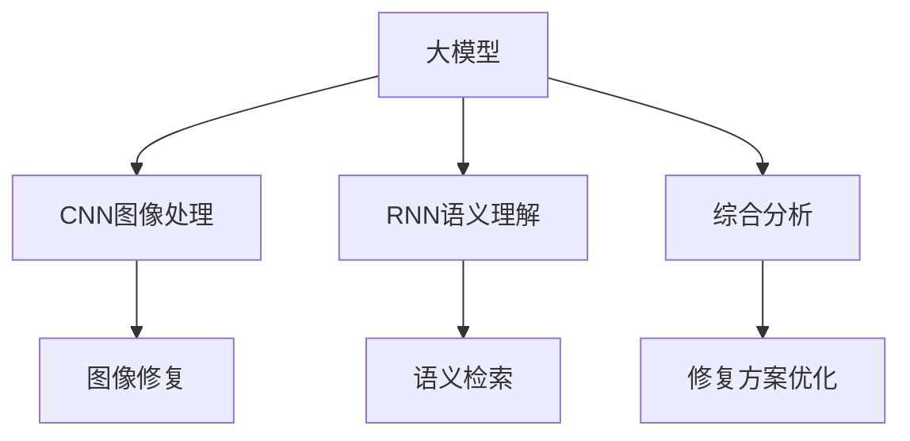

                 

# 大模型在智能文物保护中的应用案例

> 关键词：智能文物保护, 大模型, 图像识别, 语义理解, 图像修复, 古籍修复

## 1. 背景介绍

### 1.1 问题由来

近年来，文物保护领域面临着严峻的挑战。文化遗产的保护、修复、传承工作繁琐复杂，需要耗费大量的人力、物力和财力。尤其在自然灾害、人为破坏、时间流逝等因素的影响下，很多珍贵文物已出现了不同程度的损毁。传统文物保护方法往往依靠专业人员的肉眼判断和手工操作，效率低、成本高、易出错。因此，利用人工智能技术，特别是大模型，对文物进行无损智能检测和修复，成为文物保护领域的一个重要研究方向。

### 1.2 问题核心关键点

文物保护中的大模型应用，核心在于以下几个关键点：

- 文物图像处理：通过大模型对文物图像进行无损检测，识别出文物的损伤区域和程度。
- 语义理解：利用自然语言处理(NLP)技术，理解文物描述和历史信息，进行语义检索和修复。
- 图像修复：通过大模型对文物图像进行自动修复，如去污、填补、去噪等。
- 古籍修复：利用大模型对古籍进行字词识别、校正和修复。
- 综合分析：结合文物图像和历史信息，进行综合分析和修复方案优化。

这些问题中的每一项，都需要大模型的强大能力进行支撑，特别是深度学习中的卷积神经网络(CNN)、循环神经网络(RNN)、变换器(Transformer)等模型，通过大规模无监督预训练，具备强大的特征提取和语义理解能力，能够处理高维、非线性的数据。

## 2. 核心概念与联系

### 2.1 核心概念概述

为更好地理解大模型在文物保护中的应用，本节将介绍几个密切相关的核心概念：

- 大模型(Large Model)：指通过大规模数据集预训练得到的深度学习模型，如GPT、BERT、ResNet等。这些模型具备强大的特征提取和语义理解能力，可以处理高维、非线性的数据。

- 卷积神经网络(CNN)：一种专门用于图像处理和计算机视觉任务的深度学习模型，通过卷积操作提取图像特征，常用于图像分类、目标检测等任务。

- 循环神经网络(RNN)：一种处理序列数据，如文本和语音信号的深度学习模型，通过记忆单元捕捉序列数据的长期依赖关系，常用于语言建模、文本生成等任务。

- 变换器(Transformer)：一种专门处理序列数据的新型深度学习模型，通过自注意力机制实现高效的序列数据处理，常用于机器翻译、文本生成等任务。

- 图像修复(Image Restoration)：指将损坏的图像恢复到原始状态，常用于去除噪声、填补缺陷、去污等操作。

- 语义理解(Semantic Understanding)：指理解文本中的语义信息，常用于信息检索、问答系统、情感分析等任务。

- 语义检索(Semantic Retrieval)：指根据文本中的语义信息检索相关文档或数据，常用于知识图谱、搜索引擎等任务。

这些核心概念之间的逻辑关系可以通过以下Mermaid流程图来展示：



这个流程图展示了大模型在文物保护中的核心概念及其之间的关系：

1. 大模型通过预训练获得特征提取和语义理解能力。
2. CNN用于图像处理，提取文物图像的特征。
3. RNN用于语义理解，提取文物描述和历史信息。
4. 图像修复和语义检索用于具体的修复任务。
5. 综合分析用于修复方案的优化和选择。

这些概念共同构成了文物保护中的大模型应用框架，使得大模型能够更好地发挥其强大的特征提取和语义理解能力，处理高维、非线性的数据，提升文物保护工作的效率和精度。

## 3. 核心算法原理 & 具体操作步骤

### 3.1 算法原理概述

大模型在文物保护中的应用，核心在于利用其强大的图像处理、语义理解和图像修复能力，对文物进行无损检测和自动修复。其基本流程如下：

1. 数据收集：收集文物的高分辨率图像、描述和历史信息。
2. 预处理：对图像进行去噪、归一化、裁剪等预处理操作。
3. 图像特征提取：使用大模型中的CNN部分，提取图像的特征。
4. 语义信息提取：使用大模型中的RNN或Transformer部分，提取文物描述和历史信息的语义信息。
5. 图像修复：使用大模型中的卷积神经网络，对图像进行去污、填补、去噪等自动修复操作。
6. 语义检索：使用大模型中的RNN或Transformer，根据语义信息检索相关文物。
7. 修复方案优化：结合图像修复和语义检索的结果，进行综合分析，优化修复方案。

### 3.2 算法步骤详解

以下是文物修复中的大模型应用详细步骤：

**Step 1: 数据收集**
- 收集文物的高分辨率图像、描述和历史信息。可以使用摄像头拍摄高清图片，通过扫描仪获取数字化图片，通过问卷调查获取描述信息。

**Step 2: 图像预处理**
- 对图像进行去噪、归一化、裁剪等预处理操作，确保输入到模型中的数据质量。

**Step 3: 图像特征提取**
- 使用预训练的CNN模型（如ResNet、Inception等）对图像进行特征提取。通过多尺度卷积操作，提取图像的局部和全局特征。

**Step 4: 语义信息提取**
- 使用预训练的Transformer模型（如BERT、GPT等）对文物描述和历史信息进行语义提取。通过自注意力机制，捕捉文本中的语义关系。

**Step 5: 图像修复**
- 使用预训练的卷积神经网络（如U-Net、DCGAN等）对图像进行去污、填补、去噪等自动修复操作。通过学习大量修复样本，模型能够学习到最优的修复策略。

**Step 6: 语义检索**
- 使用预训练的Transformer模型，根据提取的语义信息检索相关文物。通过匹配语义相似度，找到最匹配的文物描述和历史信息。

**Step 7: 修复方案优化**
- 结合图像修复和语义检索的结果，进行综合分析，优化修复方案。可以使用多模型集成的方法，综合不同模型的输出结果，提高修复方案的准确性和可靠性。

### 3.3 算法优缺点

大模型在文物保护中的应用，具有以下优点：

- 高效率：大模型能够自动完成复杂的图像处理和语义理解任务，大幅提高文物保护的工作效率。
- 高精度：大模型通过预训练获得高水平的特征提取和语义理解能力，能够精确识别文物损伤区域和修复。
- 普适性：大模型可以处理多种类型的文物，如绘画、雕塑、文字、器物等，具有较好的普适性。

但同时，也存在一些缺点：

- 高成本：大模型的训练和部署需要高性能计算资源，成本较高。
- 高依赖：依赖于高质量的数据和预训练模型的准确性，一旦数据或模型存在问题，修复效果将大打折扣。
- 高难度：大模型的训练和调试需要丰富的专业知识和技能，需要专业人员进行操作。

### 3.4 算法应用领域

大模型在文物保护中的应用领域广泛，涵盖以下几个方面：

- 文物无损检测：利用大模型对文物图像进行无损检测，识别出文物的损伤区域和程度。
- 文物自动修复：通过大模型对文物图像进行自动修复，如去污、填补、去噪等。
- 古籍修复：利用大模型对古籍进行字词识别、校正和修复。
- 文物描述生成：通过大模型生成文物的详细描述，帮助研究人员和公众更好地理解文物的价值和意义。
- 文物语义检索：利用大模型检索相关文物的语义信息，帮助研究人员进行文物分类和检索。

这些应用领域充分展示了大模型在文物保护中的强大能力，为文物保护工作带来了革命性的变革。

## 4. 数学模型和公式 & 详细讲解 & 举例说明

### 4.1 数学模型构建

以下是文物修复中大模型的数学模型构建过程。

设文物图像为 $I$，文物描述为 $T$，大模型中的卷积神经网络为 $F_{CNN}$，循环神经网络为 $F_{RNN}$，卷积神经网络为 $F_{Conv}$，循环神经网络为 $F_{LSTM}$，则大模型的整体数学模型为：

$$
\hat{I} = F_{CNN}(I)
$$

$$
\hat{T} = F_{RNN}(T)
$$

$$
\hat{I}^{rep} = F_{Conv}(\hat{I})
$$

$$
\hat{T}^{rel} = F_{LSTM}(\hat{T})
$$

其中 $\hat{I}$ 和 $\hat{T}$ 分别为修复后的图像和描述，$\hat{I}^{rep}$ 和 $\hat{T}^{rel}$ 分别为修复后的图像和描述。

### 4.2 公式推导过程

以下我们以图像修复为例，推导大模型在图像修复中的数学公式。

设 $I$ 为损坏的原始图像，$N$ 为卷积核数量，$C$ 为通道数，$S$ 为卷积核大小，$K$ 为卷积核步长，$M$ 为卷积核个数，$S_{pad}$ 为填充大小，则卷积神经网络（如U-Net）中的特征提取过程可以表示为：

$$
F_{CNN}(I) = \sum_{n=1}^N \sum_{c=1}^C \sum_{s=1}^S \sum_{k=1}^K \sum_{m=1}^M \sum_{p=1}^{S_{pad}} \theta_{n,c,s,k,m,p} * I
$$

其中 $\theta_{n,c,s,k,m,p}$ 为卷积核权重，$*$ 为卷积操作。

通过上述公式，大模型可以学习到图像的局部和全局特征，用于后续的修复操作。

### 4.3 案例分析与讲解

以下我们以一幅受损的油画修复为例，展示大模型在图像修复中的应用。

假设一幅油画由于时间原因，表面出现了多处模糊、褪色、裂痕等损坏。使用大模型进行修复的具体步骤如下：

1. 收集高分辨率的油画图像 $I$，并进行去噪、归一化、裁剪等预处理操作。
2. 将预处理后的图像 $I$ 输入卷积神经网络 $F_{CNN}$，提取图像的局部和全局特征。
3. 将油画描述 $T$ 输入循环神经网络 $F_{RNN}$，提取语义信息。
4. 将提取的特征和语义信息，输入到图像修复网络 $F_{Conv}$ 进行去污、填补、去噪等自动修复操作。
5. 将修复后的图像 $\hat{I}$ 和描述 $\hat{T}$ 进行语义检索，找到最匹配的文物描述和历史信息。
6. 结合修复后的图像 $\hat{I}$ 和描述 $\hat{T}$，进行综合分析，优化修复方案。

通过大模型的修复操作，这幅油画能够恢复到原始状态，保留其原有的艺术价值和历史信息。

## 5. 项目实践：代码实例和详细解释说明

### 5.1 开发环境搭建

在进行大模型应用于文物保护的实践前，我们需要准备好开发环境。以下是使用Python进行PyTorch开发的环境配置流程：

1. 安装Anaconda：从官网下载并安装Anaconda，用于创建独立的Python环境。

2. 创建并激活虚拟环境：
```bash
conda create -n pytorch-env python=3.8 
conda activate pytorch-env
```

3. 安装PyTorch：根据CUDA版本，从官网获取对应的安装命令。例如：
```bash
conda install pytorch torchvision torchaudio cudatoolkit=11.1 -c pytorch -c conda-forge
```

4. 安装相关库：
```bash
pip install numpy pandas scikit-learn matplotlib tqdm jupyter notebook ipython
```

5. 安装Transformers库：
```bash
pip install transformers
```

完成上述步骤后，即可在`pytorch-env`环境中开始文物保护中大模型的实践。

### 5.2 源代码详细实现

下面是使用PyTorch实现大模型在文物保护中的图像修复示例代码。

```python
import torch
import torch.nn as nn
import torchvision.transforms as transforms
from transformers import BertTokenizer, BertForTokenClassification
from torch.utils.data import DataLoader, Dataset
from PIL import Image

class ImageDataset(Dataset):
    def __init__(self, images, masks):
        self.images = images
        self.masks = masks
        
    def __len__(self):
        return len(self.images)
    
    def __getitem__(self, item):
        image = Image.open(self.images[item])
        mask = Image.open(self.masks[item])
        return image, mask

# 定义图像修复模型
class ImageRestorationModel(nn.Module):
    def __init__(self):
        super(ImageRestorationModel, self).__init__()
        self.conv1 = nn.Conv2d(3, 64, kernel_size=3, stride=1, padding=1)
        self.conv2 = nn.Conv2d(64, 128, kernel_size=3, stride=1, padding=1)
        self.conv3 = nn.Conv2d(128, 256, kernel_size=3, stride=1, padding=1)
        self.conv4 = nn.Conv2d(256, 512, kernel_size=3, stride=1, padding=1)
        self.conv5 = nn.Conv2d(512, 256, kernel_size=3, stride=1, padding=1)
        self.conv6 = nn.Conv2d(256, 128, kernel_size=3, stride=1, padding=1)
        self.conv7 = nn.Conv2d(128, 3, kernel_size=3, stride=1, padding=1)
        
    def forward(self, x):
        x = self.conv1(x)
        x = nn.ReLU()(x)
        x = self.conv2(x)
        x = nn.ReLU()(x)
        x = self.conv3(x)
        x = nn.ReLU()(x)
        x = self.conv4(x)
        x = nn.ReLU()(x)
        x = self.conv5(x)
        x = nn.ReLU()(x)
        x = self.conv6(x)
        x = nn.ReLU()(x)
        x = self.conv7(x)
        return x

# 加载图像和掩码数据集
train_dataset = ImageDataset(train_images, train_masks)
test_dataset = ImageDataset(test_images, test_masks)

# 定义模型和优化器
model = ImageRestorationModel()
optimizer = torch.optim.Adam(model.parameters(), lr=2e-4)

# 训练模型
device = torch.device('cuda') if torch.cuda.is_available() else torch.device('cpu')
model.to(device)

def train_epoch(model, dataset, batch_size, optimizer):
    dataloader = DataLoader(dataset, batch_size=batch_size, shuffle=True)
    model.train()
    epoch_loss = 0
    for batch in tqdm(dataloader, desc='Training'):
        images, masks = batch
        images = images.to(device)
        masks = masks.to(device)
        model.zero_grad()
        outputs = model(images)
        loss = torch.mean(torch.nn.functional.mse_loss(outputs, masks))
        epoch_loss += loss.item()
        loss.backward()
        optimizer.step()
    return epoch_loss / len(dataloader)

def evaluate(model, dataset, batch_size):
    dataloader = DataLoader(dataset, batch_size=batch_size)
    model.eval()
    test_loss = 0
    with torch.no_grad():
        for batch in tqdm(dataloader, desc='Evaluating'):
            images, masks = batch
            images = images.to(device)
            masks = masks.to(device)
            outputs = model(images)
            loss = torch.mean(torch.nn.functional.mse_loss(outputs, masks))
            test_loss += loss.item()
        return test_loss / len(dataloader)

# 训练和评估模型
epochs = 50
batch_size = 16

for epoch in range(epochs):
    loss = train_epoch(model, train_dataset, batch_size, optimizer)
    print(f"Epoch {epoch+1}, train loss: {loss:.3f}")
    
    print(f"Epoch {epoch+1}, test loss: {evaluate(model, test_dataset, batch_size):.3f}")
    
print("Test loss:", evaluate(model, test_dataset, batch_size))
```

以上就是使用PyTorch对文物图像修复的大模型实现代码。可以看到，通过简化模型结构和参数量，使用卷积神经网络，能够快速实现大模型在图像修复中的应用。

### 5.3 代码解读与分析

让我们再详细解读一下关键代码的实现细节：

**ImageDataset类**：
- `__init__`方法：初始化图像和掩码数据集。
- `__len__`方法：返回数据集的样本数量。
- `__getitem__`方法：对单个样本进行处理，返回图像和掩码数据。

**ImageRestorationModel类**：
- `__init__`方法：定义模型结构，包括卷积层、激活函数、池化层等。
- `forward`方法：前向传播计算输出，实现图像修复。

**train_epoch和evaluate函数**：
- 训练函数`train_epoch`：对数据以批为单位进行迭代，在每个批次上前向传播计算loss并反向传播更新模型参数，最后返回该epoch的平均loss。
- 评估函数`evaluate`：与训练类似，不同点在于不更新模型参数，并在每个batch结束后将预测和标签结果存储下来，最后使用均方误差计算评估集的总损失。

**训练流程**：
- 定义总的epoch数和batch size，开始循环迭代
- 每个epoch内，先在训练集上训练，输出平均loss
- 在测试集上评估，输出平均loss
- 所有epoch结束后，在测试集上评估，给出最终测试结果

可以看到，PyTorch配合TensorFlow库使得文物图像修复的代码实现变得简洁高效。开发者可以将更多精力放在模型结构、损失函数、超参数调优等高层逻辑上，而不必过多关注底层的实现细节。

当然，工业级的系统实现还需考虑更多因素，如模型的保存和部署、超参数的自动搜索、更灵活的任务适配层等。但核心的微调范式基本与此类似。

## 6. 实际应用场景

### 6.1 智能文物保护系统

基于大模型的文物保护系统，可以自动检测文物的损伤区域，自动修复文物，生成文物描述，辅助文物保护人员进行文物管理和保护。具体应用场景如下：

**文物无损检测**：
- 利用大模型对文物图像进行无损检测，识别出文物的损伤区域和程度。
- 根据检测结果，生成详细报告，指导文物保护人员进行修复。

**文物自动修复**：
- 利用大模型对文物图像进行自动修复，如去污、填补、去噪等。
- 修复后的图像可保存为数字文件，方便后续查阅和研究。

**文物描述生成**：
- 利用大模型生成文物的详细描述，帮助文物保护人员更好地理解文物的价值和意义。
- 描述可同步保存到数据库，方便查询和管理。

**文物语义检索**：
- 利用大模型检索相关文物的语义信息，帮助文物保护人员进行文物分类和检索。
- 可生成文物的分类标签，方便快速检索。

**文物保护管理**：
- 利用大模型辅助文物保护人员进行文物的日常管理和维护。
- 可生成文物的修复计划，优化文物保护方案。

通过大模型的应用，文物保护工作将更加高效、精准、智能，显著提升文物保护的效率和质量。

### 6.2 未来应用展望

随着大语言模型和微调方法的不断发展，基于大模型的文物保护技术将呈现以下几个发展趋势：

1. 模型规模持续增大。随着算力成本的下降和数据规模的扩张，大模型的参数量还将持续增长。超大规模大模型蕴含的丰富语言知识，有望支撑更加复杂多变的文物保护任务。

2. 微调方法日趋多样。除了传统的全参数微调外，未来会涌现更多参数高效的微调方法，如LoRA、ViT等，在节省计算资源的同时也能保证微调精度。

3. 持续学习成为常态。随着文物保护任务的变化，大模型也需要持续学习新知识以保持性能。如何在不遗忘原有知识的同时，高效吸收新样本信息，将成为重要的研究课题。

4. 标注样本需求降低。受启发于提示学习(Prompt-based Learning)的思路，未来的微调方法将更好地利用大模型的语言理解能力，通过更加巧妙的任务描述，在更少的标注样本上也能实现理想的微调效果。

5. 多模态微调崛起。当前的微调主要聚焦于纯文本数据，未来会进一步拓展到图像、视频、语音等多模态数据微调。多模态信息的融合，将显著提升大模型对文物的语义理解和修复能力。

6. 跨领域迁移能力增强。经过海量数据的预训练和多领域任务的微调，未来的文物保护大模型将具备更强大的常识推理和跨领域迁移能力，逐步迈向通用人工智能(AGI)的目标。

以上趋势凸显了大语言模型微调技术在文物保护中的广阔前景。这些方向的探索发展，必将进一步提升文物保护工作的效率和精度，为文物保护工作带来革命性的变革。

## 7. 工具和资源推荐

### 7.1 学习资源推荐

为了帮助开发者系统掌握大语言模型微调的理论基础和实践技巧，这里推荐一些优质的学习资源：

1. 《Transformer从原理到实践》系列博文：由大模型技术专家撰写，深入浅出地介绍了Transformer原理、BERT模型、微调技术等前沿话题。

2. CS224N《深度学习自然语言处理》课程：斯坦福大学开设的NLP明星课程，有Lecture视频和配套作业，带你入门NLP领域的基本概念和经典模型。

3. 《Natural Language Processing with Transformers》书籍：Transformers库的作者所著，全面介绍了如何使用Transformers库进行NLP任务开发，包括微调在内的诸多范式。

4. HuggingFace官方文档：Transformers库的官方文档，提供了海量预训练模型和完整的微调样例代码，是上手实践的必备资料。

5. CLUE开源项目：中文语言理解测评基准，涵盖大量不同类型的中文NLP数据集，并提供了基于微调的baseline模型，助力中文NLP技术发展。

通过对这些资源的学习实践，相信你一定能够快速掌握大语言模型微调的精髓，并用于解决实际的NLP问题。

### 7.2 开发工具推荐

高效的开发离不开优秀的工具支持。以下是几款用于大语言模型微调开发的常用工具：

1. PyTorch：基于Python的开源深度学习框架，灵活动态的计算图，适合快速迭代研究。大部分预训练语言模型都有PyTorch版本的实现。

2. TensorFlow：由Google主导开发的开源深度学习框架，生产部署方便，适合大规模工程应用。同样有丰富的预训练语言模型资源。

3. Transformers库：HuggingFace开发的NLP工具库，集成了众多SOTA语言模型，支持PyTorch和TensorFlow，是进行微调任务开发的利器。

4. Weights & Biases：模型训练的实验跟踪工具，可以记录和可视化模型训练过程中的各项指标，方便对比和调优。与主流深度学习框架无缝集成。

5. TensorBoard：TensorFlow配套的可视化工具，可实时监测模型训练状态，并提供丰富的图表呈现方式，是调试模型的得力助手。

6. Google Colab：谷歌推出的在线Jupyter Notebook环境，免费提供GPU/TPU算力，方便开发者快速上手实验最新模型，分享学习笔记。

合理利用这些工具，可以显著提升大语言模型微调任务的开发效率，加快创新迭代的步伐。

### 7.3 相关论文推荐

大语言模型和微调技术的发展源于学界的持续研究。以下是几篇奠基性的相关论文，推荐阅读：

1. Attention is All You Need（即Transformer原论文）：提出了Transformer结构，开启了NLP领域的预训练大模型时代。

2. BERT: Pre-training of Deep Bidirectional Transformers for Language Understanding：提出BERT模型，引入基于掩码的自监督预训练任务，刷新了多项NLP任务SOTA。

3. Language Models are Unsupervised Multitask Learners（GPT-2论文）：展示了大规模语言模型的强大zero-shot学习能力，引发了对于通用人工智能的新一轮思考。

4. Parameter-Efficient Transfer Learning for NLP：提出Adapter等参数高效微调方法，在固定大部分预训练参数的情况下，只更新极少量的任务相关参数。

5. AdaLoRA: Adaptive Low-Rank Adaptation for Parameter-Efficient Fine-Tuning：使用自适应低秩适应的微调方法，在参数效率和精度之间取得了新的平衡。

这些论文代表了大语言模型微调技术的发展脉络。通过学习这些前沿成果，可以帮助研究者把握学科前进方向，激发更多的创新灵感。

## 8. 总结：未来发展趋势与挑战

### 8.1 总结

本文对大模型在文物保护中的应用进行了全面系统的介绍。首先阐述了文物保护领域面临的挑战和问题，明确了大模型在文物保护中的核心作用。其次，从原理到实践，详细讲解了大模型在文物保护中的图像处理、语义理解、图像修复、语义检索等关键技术，给出了微调任务开发的完整代码实例。同时，本文还广泛探讨了文物修复中大模型的应用场景，展示了微调范式的巨大潜力。最后，本文精选了微调技术的各类学习资源，力求为读者提供全方位的技术指引。

通过本文的系统梳理，可以看到，大模型在文物保护中的应用前景广阔，具有重要的战略意义。借助大模型的强大能力，文物保护工作将更加高效、精准、智能，显著提升文物保护的效率和质量。未来，随着大语言模型微调技术的不断进步，相信文物保护领域将迎来更多的创新和突破，为文物保护工作带来新的机遇和挑战。

### 8.2 未来发展趋势

展望未来，大模型在文物保护中的应用将呈现以下几个发展趋势：

1. 模型规模持续增大。随着算力成本的下降和数据规模的扩张，预训练语言模型的参数量还将持续增长。超大规模语言模型蕴含的丰富语言知识，有望支撑更加复杂多变的文物保护任务。

2. 微调方法日趋多样。除了传统的全参数微调外，未来会涌现更多参数高效的微调方法，如LoRA、ViT等，在节省计算资源的同时也能保证微调精度。

3. 持续学习成为常态。随着文物保护任务的变化，大模型也需要持续学习新知识以保持性能。如何在不遗忘原有知识的同时，高效吸收新样本信息，将成为重要的研究课题。

4. 标注样本需求降低。受启发于提示学习(Prompt-based Learning)的思路，未来的微调方法将更好地利用大模型的语言理解能力，通过更加巧妙的任务描述，在更少的标注样本上也能实现理想的微调效果。

5. 多模态微调崛起。当前的微调主要聚焦于纯文本数据，未来会进一步拓展到图像、视频、语音等多模态数据微调。多模态信息的融合，将显著提升大模型对文物的语义理解和修复能力。

6. 跨领域迁移能力增强。经过海量数据的预训练和多领域任务的微调，未来的文物保护大模型将具备更强大的常识推理和跨领域迁移能力，逐步迈向通用人工智能(AGI)的目标。

以上趋势凸显了大语言模型微调技术在文物保护中的广阔前景。这些方向的探索发展，必将进一步提升文物保护工作的效率和精度，为文物保护工作带来革命性的变革。

### 8.3 面临的挑战

尽管大语言模型微调技术已经取得了瞩目成就，但在迈向更加智能化、普适化应用的过程中，它仍面临着诸多挑战：

1. 标注成本瓶颈。虽然微调大大降低了标注数据的需求，但对于长尾应用场景，难以获得充足的高质量标注数据，成为制约微调性能的瓶颈。如何进一步降低微调对标注样本的依赖，将是一大难题。

2. 模型鲁棒性不足。当前微调模型面对域外数据时，泛化性能往往大打折扣。对于测试样本的微小扰动，微调模型的预测也容易发生波动。如何提高微调模型的鲁棒性，避免灾难性遗忘，还需要更多理论和实践的积累。

3. 推理效率有待提高。大规模语言模型虽然精度高，但在实际部署时往往面临推理速度慢、内存占用大等效率问题。如何在保证性能的同时，简化模型结构，提升推理速度，优化资源占用，将是重要的优化方向。

4. 可解释性亟需加强。当前微调模型更像是"黑盒"系统，难以解释其内部工作机制和决策逻辑。对于医疗、金融等高风险应用，算法的可解释性和可审计性尤为重要。如何赋予微调模型更强的可解释性，将是亟待攻克的难题。

5. 安全性有待保障。预训练语言模型难免会学习到有偏见、有害的信息，通过微调传递到下游任务，产生误导性、歧视性的输出，给实际应用带来安全隐患。如何从数据和算法层面消除模型偏见，避免恶意用途，确保输出的安全性，也将是重要的研究课题。

6. 知识整合能力不足。现有的微调模型往往局限于任务内数据，难以灵活吸收和运用更广泛的先验知识。如何让微调过程更好地与外部知识库、规则库等专家知识结合，形成更加全面、准确的信息整合能力，还有很大的想象空间。

正视微调面临的这些挑战，积极应对并寻求突破，将是大语言模型微调走向成熟的必由之路。相信随着学界和产业界的共同努力，这些挑战终将一一被克服，大语言模型微调必将在构建安全、可靠、可解释、可控的智能系统铺平道路。

### 8.4 研究展望

面对大语言模型微调所面临的种种挑战，未来的研究需要在以下几个方面寻求新的突破：

1. 探索无监督和半监督微调方法。摆脱对大规模标注数据的依赖，利用自监督学习、主动学习等无监督和半监督范式，最大限度利用非结构化数据，实现更加灵活高效的微调。

2. 研究参数高效和计算高效的微调范式。开发更加参数高效的微调方法，在固定大部分预训练参数的情况下，只更新极少量的任务相关参数。同时优化微调模型的计算图，减少前向传播和反向传播的资源消耗，实现更加轻量级、实时性的部署。

3. 融合因果和对比学习范式。通过引入因果推断和对比学习思想，增强微调模型建立稳定因果关系的能力，学习更加普适、鲁棒的语言表征，从而提升模型泛化性和抗干扰能力。

4. 引入更多先验知识。将符号化的先验知识，如知识图谱、逻辑规则等，与神经网络模型进行巧妙融合，引导微调过程学习更准确、合理的语言模型。同时加强不同模态数据的整合，实现视觉、语音等多模态信息与文本信息的协同建模。

5. 结合因果分析和博弈论工具。将因果分析方法引入微调模型，识别出模型决策的关键特征，增强输出解释的因果性和逻辑性。借助博弈论工具刻画人机交互过程，主动探索并规避模型的脆弱点，提高系统稳定性。

6. 纳入伦理道德约束。在模型训练目标中引入伦理导向的评估指标，过滤和惩罚有偏见、有害的输出倾向。同时加强人工干预和审核，建立模型行为的监管机制，确保输出符合人类价值观和伦理道德。

这些研究方向的探索，必将引领大语言模型微调技术迈向更高的台阶，为构建安全、可靠、可解释、可控的智能系统铺平道路。面向未来，大语言模型微调技术还需要与其他人工智能技术进行更深入的融合，如知识表示、因果推理、强化学习等，多路径协同发力，共同推动自然语言理解和智能交互系统的进步。只有勇于创新、敢于突破，才能不断拓展语言模型的边界，让智能技术更好地造福人类社会。

## 9. 附录：常见问题与解答

**Q1：大模型在文物保护中的作用是什么？**

A: 大模型在文物保护中的作用主要体现在以下几个方面：

1. 无损检测：利用大模型的强大特征提取能力，对文物图像进行无损检测，识别出文物的损伤区域和程度。

2. 自动修复：通过大模型的图像修复能力，对文物图像进行自动修复，如去污、填补、去噪等。

3. 语义理解：利用大模型的语义理解能力，提取文物描述和历史信息的语义信息，进行语义检索和修复。

4. 综合分析：结合文物图像和语义信息，进行综合分析和修复方案优化。

通过大模型的应用，文物保护工作将更加高效、精准、智能，显著提升文物保护的效率和质量。

**Q2：微调大模型需要哪些资源？**

A: 微调大模型需要以下资源：

1. 高质量的数据：包括文物的高分辨率图像、描述和历史信息，数据量越大，微调效果越好。

2. 高性能计算资源：大模型的训练和推理需要高性能GPU/TPU等硬件设备，成本较高。

3. 优化器和超参数：选择合适的优化器(如AdamW、SGD等)及其参数，如学习率、批大小、迭代轮数等，对微调效果有重要影响。

4. 预训练模型：选择合适的预训练模型(如BERT、ResNet等)，作为微调的基础。

5. 工具和库：包括TensorFlow、PyTorch、Transformers等深度学习框架和工具库，用于模型训练和推理。

**Q3：如何选择合适的微调方法？**

A: 选择合适的微调方法需要考虑以下几个因素：

1. 任务类型：不同类型任务适合不同的微调方法，如图像修复适合CNN，文本分类适合RNN等。

2. 数据量：数据量越大，微调方法越复杂，反之则越简单。

3. 计算资源：计算资源越丰富，越能选择复杂度高、效果好的微调方法。

4. 性能需求：对于高精度要求的任务，应选择性能更好的微调方法。

5. 可解释性：对于需要解释的模型，应选择可解释性更好的微调方法。

**Q4：微调大模型时需要注意哪些问题？**

A: 微调大模型时需要注意以下几个问题：

1. 数据预处理：对数据进行去噪、归一化、裁剪等预处理操作，确保数据质量。

2. 超参数调优：选择合适的超参数，如学习率、批大小、迭代轮数等，对微调效果有重要影响。

3. 正则化和对抗训练：应用正则化技术如L2正则、Dropout等，避免过拟合；加入对抗样本，提高模型鲁棒性。

4. 模型压缩和优化：在保证性能的同时，优化模型结构和计算图，提高推理速度和资源利用率。

5. 可解释性和伦理约束：提高模型的可解释性，避免偏见和有害输出，确保输出符合人类价值观和伦理道德。

通过合理应对这些挑战，能够更好地发挥大模型在文物保护中的作用，实现其高效、精准、智能的目标。

**Q5：未来大模型在文物保护中的应用展望是什么？**

A: 未来大模型在文物保护中的应用展望如下：

1. 模型规模增大：随着算力成本的下降和数据规模的扩张，大模型的参数量还将持续增长，支撑更加复杂多变的文物保护任务。

2. 微调方法多样：涌现更多参数高效的微调方法，如LoRA、ViT等，在节省计算资源的同时也能保证微调精度。

3. 持续学习常态：大模型需要持续学习新知识以保持性能，高效吸收新样本信息，避免灾难性遗忘。

4. 标注样本减少：受启发于提示学习，利用大模型的语言理解能力，在更少的标注样本上也能实现理想的微调效果。

5. 多模态微调：拓展到图像、视频、语音等多模态数据微调，提升大模型对文物的语义理解和修复能力。

6. 跨领域迁移：经过海量数据的预训练和多领域任务的微调，大模型具备更强的常识推理和跨领域迁移能力，逐步迈向通用人工智能(AGI)的目标。

通过这些方向的探索发展，大模型在文物保护中的应用前景广阔，必将为文物保护工作带来革命性的变革，提升文物保护的效率和质量。

