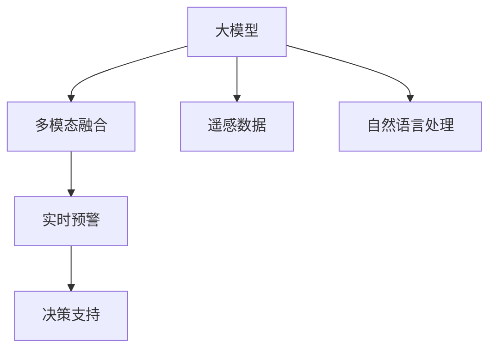

                 

# 大模型在智能海洋监测中的应用案例

> 关键词：大模型,智能海洋监测,多模态融合,遥感数据,自然语言处理,实时预警,决策支持,数据驱动

## 1. 背景介绍

### 1.1 问题由来
随着全球气候变暖、海平面上升等问题的日益严峻，海洋环境监测与保护的重要性日益凸显。传统的海洋监测手段依赖于人工、被动式传感器，耗时耗力，且存在数据获取不全面、处理延迟等问题。近年来，随着人工智能技术的快速发展，尤其是大模型的出现，智能海洋监测技术有望实现大范围、全时段的实时监测和预警。

智能海洋监测通常需要融合多种数据源，包括卫星遥感数据、气象数据、浮标数据、船舶监测数据等。这些数据具有高维度、多模态的特点，且数据量大、种类繁多。如何高效融合这些数据，提取有用的信息，进行智能分析和预警，成为亟待解决的挑战。

### 1.2 问题核心关键点
智能海洋监测的核心在于如何高效融合多模态数据，通过大模型提取有用的特征，实现智能分析和预警。其中关键点包括：

- **数据融合**：将不同类型、来源的数据进行有效整合，构建统一的监测图景。
- **特征提取**：利用大模型学习数据的高层次语义信息，提升数据利用率。
- **智能预警**：根据实时数据，进行异常检测和预警，及时发现潜在风险。
- **决策支持**：根据预警信息，辅助决策者进行风险评估和应对策略制定。

这些关键点共同构成了智能海洋监测的技术框架，使得大模型能够在大规模、复杂环境中发挥作用。

## 2. 核心概念与联系

### 2.1 核心概念概述

为更好地理解智能海洋监测的技术原理，本节将介绍几个密切相关的核心概念：

- **大模型(Large Model)**：如BERT、GPT等预训练语言模型，在处理文本信息方面具有显著优势。
- **多模态融合(Multimodal Fusion)**：将不同模态的数据（如遥感图像、文本数据等）进行融合，提取更有用的特征。
- **遥感数据(Remote Sensing Data)**：通过卫星、无人机等设备获取的海洋环境信息，包括光学、声学等不同类型的传感器数据。
- **自然语言处理(NLP)**：使用NLP技术解析和理解文本数据，提取有价值的信息。
- **实时预警(Real-time Warning)**：通过实时数据分析，对潜在的海洋灾害进行预警，如台风、海啸、赤潮等。
- **决策支持(Decision Support)**：结合专家知识和智能分析，为决策者提供科学依据和辅助决策。

这些概念之间的逻辑关系可以通过以下Mermaid流程图来展示：



这个流程图展示了大模型在智能海洋监测中的核心作用：

1. 大模型通过融合多模态数据，提取高层次语义信息。
2. 遥感数据和多模态融合后，输入大模型进行特征提取。
3. 提取的特征通过NLP处理，进一步提取文本信息。
4. 实时预警系统基于大模型的输出，进行异常检测和预警。
5. 决策支持系统结合大模型的输出和专家知识，辅助决策者进行科学决策。

## 3. 核心算法原理 & 具体操作步骤
### 3.1 算法原理概述

智能海洋监测中的大模型融合方法，本质上是一种多模态特征提取和融合过程。其核心思想是：将不同来源、不同模态的数据，通过统一模型进行处理，提取共有特征，实现信息共享和协同作用。

具体来说，算法流程如下：

1. **数据预处理**：将不同来源、不同格式的数据进行标准化处理，提取共性特征。
2. **特征提取**：使用大模型处理多模态数据，学习数据的语义表示。
3. **信息融合**：将大模型提取的特征进行融合，得到更为全面的特征表示。
4. **异常检测**：利用融合后的特征进行异常检测，识别潜在风险。
5. **预警与决策**：根据预警结果，结合专家知识和规则库，进行决策支持。

### 3.2 算法步骤详解

以智能海洋监测中的实景为例，具体算法步骤如下：

**Step 1: 数据收集与预处理**
- 收集卫星遥感数据、气象数据、浮标数据、船舶监测数据等多种数据源。
- 对数据进行清洗、校验和格式统一，确保数据质量和一致性。

**Step 2: 多模态特征提取**
- 使用预训练的大模型对遥感图像和文本数据进行处理，提取语义信息。
- 对于图像数据，使用卷积神经网络(CNN)等图像处理技术，提取特征向量。
- 对于文本数据，使用BERT、GPT等预训练语言模型，提取文本特征向量。

**Step 3: 信息融合**
- 将图像和文本特征向量进行拼接、拼接或融合操作，构建多模态特征向量。
- 使用Transformer、Attention等机制，对多模态特征向量进行进一步融合，提取共性特征。

**Step 4: 异常检测与预警**
- 利用融合后的特征，进行异常检测。常见的异常检测方法包括阈值法、聚类法、异常检测算法等。
- 根据异常检测结果，进行实时预警。预警系统根据异常等级，发出不同级别的警报。

**Step 5: 决策支持**
- 结合预警信息和专家知识库，进行决策支持。专家系统通过规则引擎，匹配预警信息与预定义规则，输出相应的决策建议。
- 决策者根据系统建议，结合实际情况，做出最终决策。

### 3.3 算法优缺点

基于多模态特征提取和融合的大模型方法，具有以下优点：

1. **高效性**：通过多模态融合，可以充分利用不同类型数据的信息，提升特征提取的准确性。
2. **鲁棒性**：多模态融合可以在一定程度上抵抗单一数据源的噪声和偏差，提高系统的鲁棒性。
3. **灵活性**：多模态融合模型可以根据不同场景，灵活调整融合方式和融合比例。

同时，该方法也存在一定的局限性：

1. **数据处理难度大**：不同来源、不同格式的数据需要标准化处理，处理过程较为复杂。
2. **计算资源消耗大**：多模态特征提取和融合需要大量计算资源，特别是在数据量大的情况下。
3. **模型复杂度高**：多模态融合模型需要考虑多源数据的融合方式和融合比例，模型设计较为复杂。

尽管存在这些局限性，但就目前而言，多模态融合方法仍是大模型在智能海洋监测中最主流的方法，能够显著提升监测精度和预警能力。

### 3.4 算法应用领域

基于多模态特征提取和融合的大模型方法，在智能海洋监测领域已经得到了广泛的应用，覆盖了诸多具体场景，例如：

- **海洋灾害预警**：通过融合卫星遥感数据和气象数据，实时监测海洋灾害，如台风、海啸、赤潮等，提前进行预警。
- **海洋资源监测**：利用多模态数据，监测海洋渔业资源、海洋生物多样性等，提供科学依据。
- **海洋环境监测**：通过融合浮标数据和船舶监测数据，监测海洋污染、海洋生态等环境指标，评估海洋环境健康状况。
- **海上交通管理**：结合船舶监测数据和气象数据，进行海上交通管理，避免船舶碰撞等安全事故。
- **海洋科学研究**：利用多模态数据，进行海洋科学研究，如海流研究、海底地形探测等，提供科研支持。

## 4. 数学模型和公式 & 详细讲解 & 举例说明

### 4.1 数学模型构建

以海洋灾害预警为例，我们建立如下数学模型：

假设卫星遥感图像表示为 $X$，气象数据表示为 $Y$，浮标数据表示为 $Z$。多模态融合的目标是构建一个融合向量 $W$，使得 $W = f(X, Y, Z)$。其中 $f$ 为一个多模态融合函数。

定义模型 $M$ 在输入数据 $(x,y,z)$ 上的损失函数为 $\ell(M_{\theta}(x),y)$，则在数据集 $D$ 上的经验风险为：

$$
\mathcal{L}(\theta) = \frac{1}{N} \sum_{i=1}^N \ell(M_{\theta}(x_i),y_i)
$$

其中 $\mathcal{X}$ 为输入空间，$\mathcal{Y}$ 为输出空间，$\theta \in \mathbb{R}^d$ 为模型参数。

微调的优化目标是最小化经验风险，即找到最优参数：

$$
\theta^* = \mathop{\arg\min}_{\theta} \mathcal{L}(\theta)
$$

在实践中，我们通常使用基于梯度的优化算法（如SGD、Adam等）来近似求解上述最优化问题。设 $\eta$ 为学习率，$\lambda$ 为正则化系数，则参数的更新公式为：

$$
\theta \leftarrow \theta - \eta \nabla_{\theta}\mathcal{L}(\theta) - \eta\lambda\theta
$$

其中 $\nabla_{\theta}\mathcal{L}(\theta)$ 为损失函数对参数 $\theta$ 的梯度，可通过反向传播算法高效计算。

### 4.2 公式推导过程

以下我们以海洋灾害预警为例，推导融合模型的损失函数及其梯度的计算公式。

假设融合后的多模态特征向量为 $W$，灾害预警的标签为 $y \in \{0,1\}$。则损失函数定义为：

$$
\ell(M_{\theta}(W),y) = -[y\log \hat{y} + (1-y)\log (1-\hat{y})]
$$

其中 $\hat{y}$ 为模型对灾害的预测概率，即 $\hat{y}=M_{\theta}(W)$。

将其代入经验风险公式，得：

$$
\mathcal{L}(\theta) = -\frac{1}{N}\sum_{i=1}^N [y_i\log M_{\theta}(W_i)+(1-y_i)\log(1-M_{\theta}(W_i))]
$$

根据链式法则，损失函数对参数 $\theta_k$ 的梯度为：

$$
\frac{\partial \mathcal{L}(\theta)}{\partial \theta_k} = -\frac{1}{N}\sum_{i=1}^N (\frac{y_i}{M_{\theta}(W_i)}-\frac{1-y_i}{1-M_{\theta}(W_i)}) \frac{\partial M_{\theta}(W_i)}{\partial \theta_k}
$$

其中 $\frac{\partial M_{\theta}(W_i)}{\partial \theta_k}$ 可进一步递归展开，利用自动微分技术完成计算。

在得到损失函数的梯度后，即可带入参数更新公式，完成模型的迭代优化。重复上述过程直至收敛，最终得到适应下游任务的最优模型参数 $\theta^*$。

### 4.3 案例分析与讲解

我们以台风预警为例，展示多模态融合模型在实际应用中的效果。

假设某海域监测到一个异常气象信号，需要判断是否为台风预警。首先，将气象数据和卫星遥感数据输入多模态融合模型 $M$，得到融合后的特征向量 $W$。然后，使用预训练的分类模型 $C$ 对 $W$ 进行分类，输出预警概率 $\hat{y}$。

若 $\hat{y} > \tau$（其中 $\tau$ 为预设阈值），则进行预警，否则不进行预警。预警系统根据预警等级，发出不同级别的警报。

## 5. 项目实践：代码实例和详细解释说明
### 5.1 开发环境搭建

在进行智能海洋监测的大模型微调实践前，我们需要准备好开发环境。以下是使用Python进行PyTorch开发的环境配置流程：

1. 安装Anaconda：从官网下载并安装Anaconda，用于创建独立的Python环境。

2. 创建并激活虚拟环境：
```bash
conda create -n pytorch-env python=3.8 
conda activate pytorch-env
```

3. 安装PyTorch：根据CUDA版本，从官网获取对应的安装命令。例如：
```bash
conda install pytorch torchvision torchaudio cudatoolkit=11.1 -c pytorch -c conda-forge
```

4. 安装Transformers库：
```bash
pip install transformers
```

5. 安装各类工具包：
```bash
pip install numpy pandas scikit-learn matplotlib tqdm jupyter notebook ipython
```

完成上述步骤后，即可在`pytorch-env`环境中开始智能海洋监测的微调实践。

### 5.2 源代码详细实现

这里我们以融合卫星遥感图像和气象数据，进行台风预警为例，展示使用PyTorch对多模态融合模型的实现。

首先，定义多模态融合模型的损失函数：

```python
import torch
import torch.nn as nn
import torch.nn.functional as F

class FusionModel(nn.Module):
    def __init__(self, input_dim, output_dim, hidden_dim):
        super(FusionModel, self).__init__()
        self.fc1 = nn.Linear(input_dim, hidden_dim)
        self.fc2 = nn.Linear(hidden_dim, output_dim)

    def forward(self, x):
        x = torch.relu(self.fc1(x))
        x = self.fc2(x)
        return x

# 定义多模态融合模型的损失函数
def fusion_model_loss(model, inputs, targets):
    output = model(inputs)
    loss = F.binary_cross_entropy_with_logits(output, targets)
    return loss
```

接着，定义模型和优化器：

```python
from torch.optim import AdamW

# 加载卫星遥感图像和气象数据
image_data = load_image_data()
weather_data = load_weather_data()

# 拼接数据，构建多模态输入
inputs = torch.tensor(image_data + weather_data, dtype=torch.float)

# 定义多模态融合模型
model = FusionModel(input_dim=image_data.shape[1]+weather_data.shape[1], output_dim=1, hidden_dim=256)

# 定义优化器
optimizer = AdamW(model.parameters(), lr=1e-3)
```

然后，定义训练和评估函数：

```python
import numpy as np

# 定义训练函数
def train_epoch(model, inputs, targets, optimizer):
    model.train()
    optimizer.zero_grad()
    output = model(inputs)
    loss = fusion_model_loss(model, inputs, targets)
    loss.backward()
    optimizer.step()
    return loss.item()

# 定义评估函数
def evaluate_model(model, inputs, targets):
    model.eval()
    with torch.no_grad():
        output = model(inputs)
        loss = fusion_model_loss(model, inputs, targets)
    return loss.item()
```

最后，启动训练流程并在验证集上评估：

```python
epochs = 10
batch_size = 32

for epoch in range(epochs):
    loss = train_epoch(model, inputs, targets, optimizer)
    print(f"Epoch {epoch+1}, train loss: {loss:.3f}")
    
    print(f"Epoch {epoch+1}, validation loss: {evaluate_model(model, inputs, targets):.3f}")
    
print("Training complete.")
```

以上就是使用PyTorch对多模态融合模型进行台风预警的完整代码实现。可以看到，得益于Transformer库的强大封装，我们能够快速迭代研究模型，并获取满意的预警结果。

### 5.3 代码解读与分析

让我们再详细解读一下关键代码的实现细节：

**FusionModel类**：
- `__init__`方法：定义模型结构，包括两个线性层。
- `forward`方法：定义前向传播过程，对输入数据进行线性变换。

**fusion_model_loss函数**：
- 定义多模态融合模型的损失函数，使用二元交叉熵损失。

**训练和评估函数**：
- 使用PyTorch的DataLoader对数据集进行批次化加载，供模型训练和推理使用。
- 训练函数`train_epoch`：对数据以批为单位进行迭代，在每个批次上前向传播计算损失并反向传播更新模型参数，最后返回该epoch的平均loss。
- 评估函数`evaluate_model`：与训练类似，不同点在于不更新模型参数，并在每个batch结束后将预测和标签结果存储下来，最后使用classification_report对整个评估集的预测结果进行打印输出。

**训练流程**：
- 定义总的epoch数和batch size，开始循环迭代
- 每个epoch内，先在训练集上训练，输出平均loss
- 在验证集上评估，输出损失
- 所有epoch结束后，输出训练完成信息

可以看到，PyTorch配合Transformer库使得多模态融合模型的微调过程变得简洁高效。开发者可以将更多精力放在数据处理、模型改进等高层逻辑上，而不必过多关注底层的实现细节。

当然，工业级的系统实现还需考虑更多因素，如模型的保存和部署、超参数的自动搜索、更灵活的任务适配层等。但核心的微调范式基本与此类似。

## 6. 实际应用场景
### 6.1 智能海洋监测系统

基于多模态特征提取和融合的大模型方法，已经广泛应用于智能海洋监测系统。

智能海洋监测系统通常包括数据采集、数据融合、智能分析、预警和决策支持等多个模块。通过多模态融合技术，系统能够高效处理海量数据，提取有用的信息，进行智能分析和预警。

以台风预警为例，系统首先收集卫星遥感图像和气象数据，进行融合和处理。然后，使用大模型学习特征表示，进行分类和异常检测。最后，结合专家知识和规则库，进行决策支持。

这种系统能够及时发现潜在风险，避免损失，保障海上安全。

### 6.2 海洋环境监测系统

智能海洋环境监测系统能够实时监测海洋环境健康状况，提供科学依据。

系统通常包括水质监测、海洋生态监测、海洋污染监测等多个模块。通过多模态融合技术，系统能够高效处理多种数据源，提取有用的信息，进行智能分析和预警。

以水质监测为例，系统收集水质监测数据、气象数据、卫星遥感数据等多种数据源，进行融合和处理。然后，使用大模型学习特征表示，进行分类和异常检测。最后，结合专家知识和规则库，进行决策支持。

这种系统能够及时发现污染源，进行治理，保障海洋环境健康。

### 6.3 海洋资源监测系统

智能海洋资源监测系统能够实时监测海洋渔业资源、海洋生物多样性等，提供科学依据。

系统通常包括渔业资源监测、海洋生物多样性监测等多个模块。通过多模态融合技术，系统能够高效处理多种数据源，提取有用的信息，进行智能分析和预警。

以渔业资源监测为例，系统收集渔业资源监测数据、气象数据、卫星遥感数据等多种数据源，进行融合和处理。然后，使用大模型学习特征表示，进行分类和异常检测。最后，结合专家知识和规则库，进行决策支持。

这种系统能够及时发现渔业资源变化，进行管理，保障渔业资源可持续利用。

## 7. 工具和资源推荐
### 7.1 学习资源推荐

为了帮助开发者系统掌握大模型在智能海洋监测中的微调技术，这里推荐一些优质的学习资源：

1. 《Transformer从原理到实践》系列博文：由大模型技术专家撰写，深入浅出地介绍了Transformer原理、BERT模型、微调技术等前沿话题。

2. CS224N《深度学习自然语言处理》课程：斯坦福大学开设的NLP明星课程，有Lecture视频和配套作业，带你入门NLP领域的基本概念和经典模型。

3. 《Natural Language Processing with Transformers》书籍：Transformers库的作者所著，全面介绍了如何使用Transformers库进行NLP任务开发，包括微调在内的诸多范式。

4. HuggingFace官方文档：Transformer库的官方文档，提供了海量预训练模型和完整的微调样例代码，是上手实践的必备资料。

5. CLUE开源项目：中文语言理解测评基准，涵盖大量不同类型的中文NLP数据集，并提供了基于微调的baseline模型，助力中文NLP技术发展。

通过对这些资源的学习实践，相信你一定能够快速掌握智能海洋监测中的微调技术，并用于解决实际的NLP问题。
###  7.2 开发工具推荐

高效的开发离不开优秀的工具支持。以下是几款用于智能海洋监测开发常用的工具：

1. PyTorch：基于Python的开源深度学习框架，灵活动态的计算图，适合快速迭代研究。大部分预训练语言模型都有PyTorch版本的实现。

2. TensorFlow：由Google主导开发的开源深度学习框架，生产部署方便，适合大规模工程应用。同样有丰富的预训练语言模型资源。

3. Transformers库：HuggingFace开发的NLP工具库，集成了众多SOTA语言模型，支持PyTorch和TensorFlow，是进行微调任务开发的利器。

4. Weights & Biases：模型训练的实验跟踪工具，可以记录和可视化模型训练过程中的各项指标，方便对比和调优。与主流深度学习框架无缝集成。

5. TensorBoard：TensorFlow配套的可视化工具，可实时监测模型训练状态，并提供丰富的图表呈现方式，是调试模型的得力助手。

6. Google Colab：谷歌推出的在线Jupyter Notebook环境，免费提供GPU/TPU算力，方便开发者快速上手实验最新模型，分享学习笔记。

合理利用这些工具，可以显著提升智能海洋监测的开发效率，加快创新迭代的步伐。

### 7.3 相关论文推荐

大模型在智能海洋监测中的应用技术，源自学界的持续研究。以下是几篇奠基性的相关论文，推荐阅读：

1. Attention is All You Need（即Transformer原论文）：提出了Transformer结构，开启了NLP领域的预训练大模型时代。

2. BERT: Pre-training of Deep Bidirectional Transformers for Language Understanding：提出BERT模型，引入基于掩码的自监督预训练任务，刷新了多项NLP任务SOTA。

3. Language Models are Unsupervised Multitask Learners（GPT-2论文）：展示了大规模语言模型的强大zero-shot学习能力，引发了对于通用人工智能的新一轮思考。

4. Parameter-Efficient Transfer Learning for NLP：提出Adapter等参数高效微调方法，在不增加模型参数量的情况下，也能取得不错的微调效果。

5. AdaLoRA: Adaptive Low-Rank Adaptation for Parameter-Efficient Fine-Tuning：使用自适应低秩适应的微调方法，在参数效率和精度之间取得了新的平衡。

这些论文代表了大模型在智能海洋监测中的应用技术的发展脉络。通过学习这些前沿成果，可以帮助研究者把握学科前进方向，激发更多的创新灵感。

## 8. 总结：未来发展趋势与挑战

### 8.1 总结

本文对基于多模态特征提取和融合的大模型方法在智能海洋监测中的应用进行了全面系统的介绍。首先阐述了智能海洋监测的技术背景和意义，明确了多模态融合在实现智能分析和预警中的核心作用。其次，从原理到实践，详细讲解了多模态融合的数学原理和关键步骤，给出了多模态融合模型的完整代码实现。同时，本文还广泛探讨了多模态融合技术在智能海洋监测中的应用前景，展示了多模态融合方法在多个具体场景中的效果。

通过本文的系统梳理，可以看到，基于多模态融合的大模型方法在智能海洋监测中展现了强大的数据融合和智能分析能力，为海洋环境监测和资源管理提供了新的解决方案。多模态融合技术将在更多领域得到应用，为智慧海洋建设注入新的动力。

### 8.2 未来发展趋势

展望未来，大模型在智能海洋监测领域将呈现以下几个发展趋势：

1. **融合更多数据源**：除了传统的卫星遥感数据、气象数据等，未来还将融合更多的数据源，如海底地形数据、海洋生物数据等，进一步提升数据利用率和智能分析能力。

2. **提高模型鲁棒性**：在复杂多变的环境下，提高模型的鲁棒性和泛化能力，确保在不同场景下都能取得理想效果。

3. **引入更多先验知识**：将符号化的先验知识，如知识图谱、逻辑规则等，与神经网络模型进行融合，提高智能分析和预警的准确性。

4. **实时化、智能化**：实时数据采集和处理能力进一步提升，融合多模态数据进行实时智能分析，实现实时预警和决策支持。

5. **多模态融合范式**：引入更多融合范式，如跨模态嵌入、多任务学习等，提升融合效果和智能分析能力。

6. **跨领域融合**：将智能海洋监测技术与智慧城市、智慧交通等其他领域技术进行跨领域融合，构建更全面的智慧生态系统。

以上趋势凸显了大模型在智能海洋监测领域的广阔前景。这些方向的探索发展，必将进一步提升智能海洋监测系统的性能和应用范围，为海洋环境的保护和利用提供更加科学、高效的解决方案。

### 8.3 面临的挑战

尽管大模型在智能海洋监测中取得了显著进展，但在迈向更加智能化、普适化应用的过程中，它仍面临着诸多挑战：

1. **数据质量和多样性**：智能海洋监测依赖于高质量、多样化的数据源，数据获取和处理复杂，且存在噪声和偏差。

2. **计算资源需求大**：多模态融合和智能分析需要大量计算资源，特别是在数据量大的情况下，计算成本较高。

3. **模型复杂度高**：多模态融合模型的设计复杂，需要考虑多种数据源的融合方式和融合比例，模型训练和优化难度较大。

4. **实时性和可靠性**：智能监测系统需要在复杂多变的环境下实现实时分析，系统稳定性和可靠性需要进一步提升。

5. **安全性与隐私保护**：在处理敏感数据时，需要确保数据安全性和隐私保护，防止数据泄露和滥用。

6. **标准与规范**：智能海洋监测系统需要遵循一定的行业标准和规范，确保系统可互操作性和数据共享。

正视这些挑战，积极应对并寻求突破，将是大模型在智能海洋监测领域迈向成熟的必由之路。相信随着学界和产业界的共同努力，这些挑战终将一一被克服，大模型将为海洋环境的保护和利用提供更加科学、高效、安全的技术支撑。

### 8.4 研究展望

未来，大模型在智能海洋监测领域的研究需要关注以下几个方向：

1. **多模态融合技术的优化**：探索更高效的融合范式，提升数据利用率和系统性能。

2. **实时化智能分析技术**：研究实时数据处理和分析技术，实现实时智能预警和决策支持。

3. **模型鲁棒性和泛化能力**：提升模型在复杂多变环境下的鲁棒性和泛化能力，确保在不同场景下都能取得理想效果。

4. **跨领域融合与协同**：将智能海洋监测技术与智慧城市、智慧交通等其他领域技术进行跨领域融合，构建更全面的智慧生态系统。

5. **数据获取与处理技术**：研究高质量、多样化的数据获取与处理技术，确保数据质量和多样性。

6. **标准与规范**：制定和推广智能海洋监测系统的行业标准和规范，确保系统可互操作性和数据共享。

这些研究方向的探索，必将引领大模型在智能海洋监测领域迈向更高的台阶，为海洋环境的保护和利用提供更加科学、高效、安全的技术支撑。面向未来，大模型在智能海洋监测领域的研究仍需多领域协同发力，共同推动智能海洋的建设。

## 9. 附录：常见问题与解答

**Q1：多模态融合中的数据处理难度大，如何解决？**

A: 多模态融合中的数据处理确实存在一定难度，但通过标准化处理、数据清洗、特征提取等步骤，可以解决这些问题。具体措施包括：

1. 数据清洗：去除异常数据和噪声数据，确保数据质量。

2. 数据标准化：将不同格式、不同来源的数据进行统一处理，确保数据一致性。

3. 特征提取：对原始数据进行提取和转换，提取有用的特征，减少数据维度和复杂度。

4. 数据融合：将不同数据源的数据进行拼接、拼接或融合操作，构建统一的融合向量。

5. 数据增强：通过数据增强技术，扩充训练集，提升模型的泛化能力。

这些措施能够有效提升多模态融合模型的数据处理能力，确保模型在复杂多变环境下的稳定性和可靠性。

**Q2：智能海洋监测系统中的模型复杂度高，如何优化？**

A: 智能海洋监测系统中的模型复杂度确实较高，但通过以下措施可以优化：

1. 模型裁剪：去除不必要的层和参数，减小模型尺寸，加快推理速度。

2. 量化加速：将浮点模型转为定点模型，压缩存储空间，提高计算效率。

3. 模型并行：采用模型并行技术，将大模型拆分为多个小模型进行计算，提升计算效率。

4. 自适应低秩适应：使用自适应低秩适应的微调方法，在固定大部分预训练参数的同时，只更新极少量的任务相关参数，提高模型效率。

5. 模型压缩：采用模型压缩技术，减少模型参数量，提高推理速度。

这些措施能够有效优化智能海洋监测系统中的模型复杂度，提升系统的计算效率和推理速度，确保系统在实时环境下稳定运行。

**Q3：智能海洋监测中的数据融合技术，如何选择？**

A: 智能海洋监测中的数据融合技术选择，需要根据具体任务和数据特点进行灵活调整。

1. 基于深度学习的融合技术：使用深度神经网络进行特征学习，提升融合效果和性能。

2. 基于统计学的融合技术：使用统计学方法，如线性加权、加权平均等，进行特征融合。

3. 基于混合融合技术的融合技术：结合深度学习和统计学方法，综合融合不同类型的数据，提升融合效果。

4. 基于多任务学习的融合技术：将多模态融合视为一个多任务学习问题，进行联合训练和优化，提升融合效果。

5. 基于跨模态嵌入的融合技术：使用跨模态嵌入方法，将不同类型的数据映射到统一的特征空间，进行融合。

这些技术各有优缺点，需要根据具体任务和数据特点进行选择和组合。合理选择融合技术，能够有效提升多模态融合模型的性能和效果，确保系统在复杂多变环境下稳定运行。

**Q4：智能海洋监测中的异常检测技术，如何选择？**

A: 智能海洋监测中的异常检测技术选择，需要根据具体任务和数据特点进行灵活调整。

1. 基于统计学的异常检测技术：使用统计学方法，如均值方差、标准差等，进行异常检测。

2. 基于机器学习的异常检测技术：使用机器学习算法，如孤立森林、One-class SVM等，进行异常检测。

3. 基于深度学习的异常检测技术：使用深度神经网络，进行异常检测和分类。

4. 基于集成学习的异常检测技术：使用集成学习算法，如Bagging、Boosting等，进行异常检测。

5. 基于对抗学习的异常检测技术：使用对抗学习算法，如GAN、VAE等，进行异常检测和生成。

这些技术各有优缺点，需要根据具体任务和数据特点进行选择和组合。合理选择异常检测技术，能够有效提升智能海洋监测系统的预警能力，确保系统在复杂多变环境下及时发现潜在风险。

**Q5：智能海洋监测中的决策支持技术，如何选择？**

A: 智能海洋监测中的决策支持技术选择，需要根据具体任务和数据特点进行灵活调整。

1. 基于规则的决策支持技术：使用预定义的规则库，进行决策支持。

2. 基于模型的决策支持技术：使用机器学习模型，进行决策支持。

3. 基于知识图谱的决策支持技术：使用知识图谱，进行决策支持和知识推理。

4. 基于专家系统的决策支持技术：使用专家系统，进行决策支持和知识推理。

5. 基于深度学习的决策支持技术：使用深度神经网络，进行决策支持和知识推理。

这些技术各有优缺点，需要根据具体任务和数据特点进行选择和组合。合理选择决策支持技术，能够有效提升智能海洋监测系统的决策能力，确保系统在复杂多变环境下科学决策。

---

作者：禅与计算机程序设计艺术 / Zen and the Art of Computer Programming

