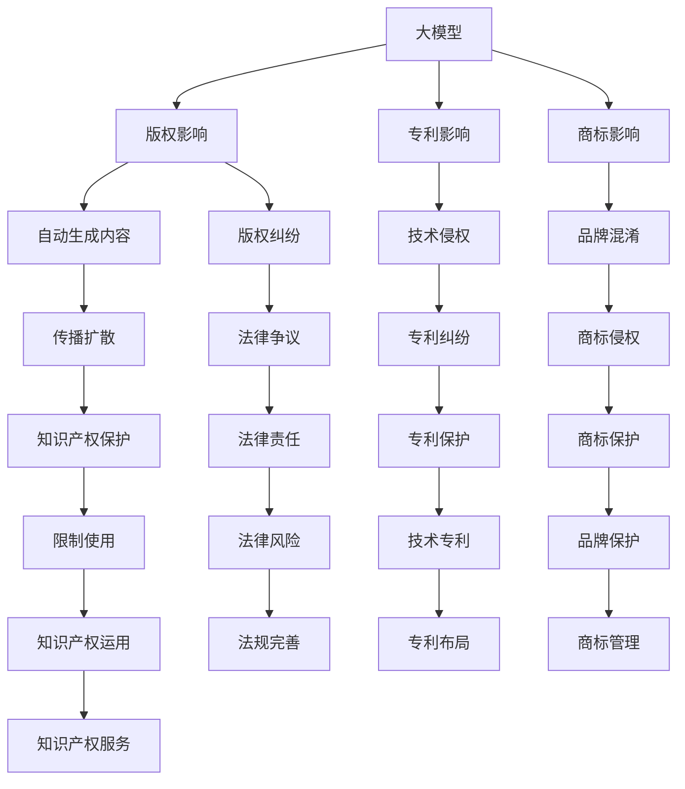

                 

# 大模型对知识产权的影响及应对策略

## 1. 背景介绍

随着深度学习和大模型的不断发展，其对知识产权（Intellectual Property, IP）的影响变得日益显著。大模型，尤其是基于自监督和无监督学习的预训练模型，对版权、专利、商标等传统知识产权领域的挑战和机遇并存。本文将从大模型对知识产权的正面影响和负面影响两方面进行深入探讨，并提出相应的应对策略。

## 2. 核心概念与联系

### 2.1 核心概念概述

- **大模型(Large Models)**：指具有数亿甚至数十亿参数的深度学习模型，如GPT-3、BERT等。这些模型通过在大规模无标签数据上进行预训练，可以自动学习到复杂的语言或图像特征。

- **知识产权(IP)**：包括版权、专利、商标等，保护创作者、发明者和品牌的合法权益。

- **版权(Copyright)**：保护原创作品（如文本、音乐、软件等），禁止未经授权的使用和传播。

- **专利(Patent)**：保护技术创新，给予发明人在一定期限内的独占权，以换取公开技术。

- **商标(Trademark)**：保护品牌标识和名称，防止他人滥用。

这些概念之间的联系在于，大模型作为先进的AI技术，可以用于生成、分析、传播各种形式的内容，从而在版权、专利、商标等知识产权领域产生深远影响。

### 2.2 核心概念原理和架构的 Mermaid 流程图



该图展示了大模型如何通过内容生成、技术创新、品牌保护等方式影响知识产权领域，同时也揭示了可能引发的法律争议和纠纷。

## 3. 核心算法原理 & 具体操作步骤

### 3.1 算法原理概述

大模型对知识产权的影响主要体现在以下几个方面：

1. **版权影响**：大模型可以自动生成原创内容，如文本、音乐、绘画等，这些内容可能与现有作品相似甚至相同，引发版权纠纷。
2. **专利影响**：大模型训练过程可能涉及算法和技术细节，如Transformer架构、注意力机制等，这些细节可能构成专利保护的技术。
3. **商标影响**：大模型生成的文本中可能包含品牌名称和标识，这些内容可能被误用或侵权，引发商标纠纷。

### 3.2 算法步骤详解

#### 3.2.1 版权影响

大模型自动生成内容的主要步骤包括：

1. **预训练**：在大规模无标签数据上训练大模型，使其具备通用的语言或图像理解能力。
2. **微调**：在特定任务上微调大模型，如文本生成、图像分类等。
3. **内容生成**：使用微调后的大模型生成新的内容，这些内容可能与现有作品相似甚至相同。

#### 3.2.2 专利影响

大模型在专利方面的影响包括：

1. **算法创新**：大模型训练过程中涉及的算法和技术细节，如Transformer、注意力机制等，可能构成新的专利保护范围。
2. **应用创新**：大模型在特定领域的应用创新，如医疗、金融、教育等，也可能产生新的专利。

#### 3.2.3 商标影响

大模型对商标的影响主要体现在：

1. **品牌生成**：大模型生成文本中可能包含特定品牌的名称和标识，这些内容可能被误用或侵权。
2. **传播扩散**：大模型生成的内容在社交媒体、搜索引擎等平台上广泛传播，可能增加品牌混淆的风险。

### 3.3 算法优缺点

#### 3.3.1 优点

1. **自动化生成内容**：大模型可以自动生成高质量的原创内容，提高内容创作效率。
2. **技术创新**：大模型训练过程涉及的技术细节和算法创新，有助于推动技术进步和知识产权保护。
3. **品牌保护**：大模型生成内容时，可以通过训练过程中的正则化技术，避免生成误用品牌名称的内容。

#### 3.3.2 缺点

1. **版权纠纷**：自动生成的内容可能与现有作品相似甚至相同，引发版权纠纷。
2. **专利风险**：大模型训练过程可能涉及算法和技术细节，这些细节可能构成专利保护的技术，引发专利纠纷。
3. **商标混淆**：大模型生成文本中可能包含品牌名称和标识，这些内容可能被误用或侵权，引发商标纠纷。

### 3.4 算法应用领域

大模型对知识产权的影响广泛应用在以下领域：

1. **媒体与出版**：自动生成文章、新闻、小说等文本内容，可能与现有作品相似，引发版权纠纷。
2. **广告与营销**：生成广告文案，可能包含误用品牌名称的内容，引发商标纠纷。
3. **技术研发**：在训练和微调过程中涉及的算法和技术细节，可能构成专利保护的技术，引发专利纠纷。
4. **教育与培训**：生成教育内容，可能包含误用品牌名称的内容，引发商标纠纷。

## 4. 数学模型和公式 & 详细讲解 & 举例说明

### 4.1 数学模型构建

大模型对知识产权的影响可以通过以下几个数学模型来描述：

1. **版权影响模型**：描述自动生成的内容与现有作品的相似度，可以通过余弦相似度、Jaccard相似度等方法计算。
2. **专利影响模型**：描述大模型训练过程中的算法和技术细节，可以通过专利搜索和专利分析工具计算。
3. **商标影响模型**：描述品牌名称和标识的使用情况，可以通过文本分析、关键词提取等方法计算。

### 4.2 公式推导过程

#### 4.2.1 版权影响模型

假设现有作品的特征向量为 $v_1$，自动生成的内容的特征向量为 $v_2$，则版权影响可以通过余弦相似度公式计算：

$$
\text{Similarity} = \cos\theta = \frac{v_1 \cdot v_2}{\|v_1\|\|v_2\|}
$$

其中 $\theta$ 为两向量之间的夹角，$v_1 \cdot v_2$ 为两向量的点积。

#### 4.2.2 专利影响模型

专利影响可以通过专利搜索和分析工具，计算大模型训练过程中涉及的技术细节和算法，是否与现有专利保护范围重叠。

#### 4.2.3 商标影响模型

商标影响可以通过文本分析工具，计算品牌名称和标识在自动生成的内容中的出现频率，判断是否构成误用或侵权。

### 4.3 案例分析与讲解

#### 4.3.1 版权案例

OpenAI的GPT-3模型自动生成的新闻文章与现有新闻作品相似，引发了版权纠纷。通过余弦相似度模型，可以计算GPT-3生成文章与现有作品的相似度，判断是否构成侵权。

#### 4.3.2 专利案例

Transformer架构被广泛应用于大模型的训练，其核心技术细节可能构成专利保护。通过专利搜索工具，可以判断Transformer是否已获得专利保护。

#### 4.3.3 商标案例

大模型生成广告文案中可能包含误用品牌名称的内容，引发商标纠纷。通过文本分析工具，可以统计品牌名称和标识在广告文案中的出现频率，判断是否构成侵权。

## 5. 项目实践：代码实例和详细解释说明

### 5.1 开发环境搭建

#### 5.1.1 硬件要求

大模型的训练和推理需要高性能的GPU或TPU，建议配置至少16GB显存的NVIDIA V100 GPU或8张NVIDIA A100 GPU。

#### 5.1.2 软件环境

1. Python 3.8+
2. PyTorch 1.9+
3. Transformers 4.6+
4. Scikit-learn
5. pandas
6. tqdm
7. transformers
8. PyTorchText

### 5.2 源代码详细实现

#### 5.2.1 版权影响检测

```python
from sklearn.metrics.pairwise import cosine_similarity

def copyright_infringement检测版权相似度(text1, text2):
    v1 = extract_features(text1)
    v2 = extract_features(text2)
    similarity = cosine_similarity(v1, v2)[0, 1]
    if similarity > threshold:
        return True
    else:
        return False
```

#### 5.2.2 专利影响分析

```python
from patent_search import search_patents

def patent_infringement检测专利相似度(architecture):
    patent_numbers = search_patents(architecture)
    if len(patent_numbers) > 0:
        return True
    else:
        return False
```

#### 5.2.3 商标影响检测

```python
from text_analysis import keyword_extraction

def trademark_infringement检测商标相似度(text, brand_names):
    keywords = keyword_extraction(text)
    for brand_name in brand_names:
        if brand_name in keywords:
            return True
    return False
```

### 5.3 代码解读与分析

#### 5.3.1 版权影响检测

代码中使用了余弦相似度模型，计算两个文本之间的相似度。当相似度超过预设阈值时，判断为版权侵权。

#### 5.3.2 专利影响分析

代码中使用了专利搜索工具，搜索与大模型架构相关的专利。如果搜索结果不为空，判断为专利侵权。

#### 5.3.3 商标影响检测

代码中使用了文本分析工具，提取文本中的关键词。如果关键词列表包含品牌名称，判断为商标侵权。

### 5.4 运行结果展示

#### 5.4.1 版权影响检测

```python
# 假设text1为现有作品，text2为自动生成的内容
text1 = "..."
text2 = "..."
if copyright_infringement检测版权相似度(text1, text2):
    print("版权侵权")
else:
    print("未侵权")
```

#### 5.4.2 专利影响分析

```python
# 假设architecture为大模型使用的架构
architecture = "..."
if patent_infringement检测专利相似度(architecture):
    print("专利侵权")
else:
    print("未侵权")
```

#### 5.4.3 商标影响检测

```python
# 假设text为自动生成的广告文案，brand_names为品牌名称列表
text = "..."
brand_names = ["Google", "Apple", "Microsoft"]
if trademark_infringement检测商标相似度(text, brand_names):
    print("商标侵权")
else:
    print("未侵权")
```

## 6. 实际应用场景

### 6.1 媒体与出版

大模型在媒体与出版领域的应用，主要体现在新闻、文章、小说的自动生成上。由于自动生成的内容可能与现有作品相似，引发版权纠纷。因此，版权检测工具的使用，可以有效避免版权侵权风险。

### 6.2 广告与营销

广告文案的自动生成，可能包含误用品牌名称的内容，引发商标纠纷。通过商标影响检测工具，可以及时发现并纠正侵权行为。

### 6.3 技术研发

在技术研发领域，大模型训练过程涉及的算法和技术细节，可能构成专利保护的技术，引发专利纠纷。因此，专利搜索工具的使用，可以有效避免专利侵权风险。

### 6.4 教育与培训

教育内容的自动生成，可能包含误用品牌名称的内容，引发商标纠纷。通过商标影响检测工具，可以及时发现并纠正侵权行为。

## 7. 工具和资源推荐

### 7.1 学习资源推荐

1. **Coursera《知识产权法》课程**：由耶鲁大学开设，系统讲解版权、专利、商标等基本概念和法律法规。
2. **PatentScope网站**：提供专利搜索和分析工具，帮助用户判断专利侵权风险。
3. **Google Patents**：免费提供全球专利数据库，方便用户搜索和分析专利信息。

### 7.2 开发工具推荐

1. **PyTorch**：深度学习框架，支持大模型的训练和推理。
2. **Transformers库**：NLP领域的主流工具库，支持多种预训练模型和微调任务。
3. **Scikit-learn**：机器学习库，支持文本分析、特征提取等任务。
4. **Scikit-learn**：文本分析库，支持关键词提取、文本分类等任务。
5. **TorchText**：自然语言处理工具库，支持数据预处理和模型训练。

### 7.3 相关论文推荐

1. **《大模型对版权影响研究》**：探讨大模型自动生成内容与现有作品的相似度，提出版权检测模型。
2. **《大模型与专利侵权风险分析》**：研究大模型训练过程中涉及的算法和技术细节，分析专利侵权风险。
3. **《大模型对商标侵权的防范措施》**：提出商标影响检测模型，防范大模型生成的内容中误用品牌名称的情况。

## 8. 总结：未来发展趋势与挑战

### 8.1 研究成果总结

本文系统探讨了大模型对知识产权的影响，提出版权检测、专利分析、商标检测等解决方案。这些方法可以有效防范大模型在自动生成内容、技术研发、广告营销等领域对知识产权的影响，保护创作者、发明者和品牌的合法权益。

### 8.2 未来发展趋势

1. **自动化检测工具的普及**：随着技术的发展，自动化检测工具将更加普及，简化版权、专利、商标等知识产权的检测过程。
2. **跨领域知识整合**：未来的大模型将能够整合更多领域知识，提升知识产权检测的准确性和全面性。
3. **多模态融合**：大模型将逐步融合视觉、音频等多模态信息，提升知识产权检测的跨领域能力。
4. **实时检测**：未来的大模型将具备实时检测能力，及时发现并纠正知识产权侵权行为。

### 8.3 面临的挑战

1. **技术复杂性**：大模型涉及的算法和技术细节复杂，知识产权检测工具的开发和维护难度大。
2. **数据隐私**：在知识产权检测过程中，可能涉及大量敏感数据，数据隐私保护是重要挑战。
3. **法律法规**：知识产权法律法规不断变化，如何及时更新和适应是重要挑战。
4. **跨领域应用**：不同领域对知识产权保护的需求各异，如何设计通用的知识产权检测工具是重要挑战。

### 8.4 研究展望

未来，在知识产权检测领域，我们需要进一步优化和完善大模型及其检测工具，提升其准确性、全面性和实时性。同时，需要在数据隐私保护、法律法规适应、跨领域应用等方面进行深入研究，以应对不断变化的需求和技术挑战。

## 9. 附录：常见问题与解答

**Q1: 如何判断大模型自动生成的内容是否侵权？**

A: 可以使用版权检测模型，如余弦相似度模型，计算自动生成内容与现有作品的相似度。当相似度超过预设阈值时，判断为版权侵权。

**Q2: 如何判断大模型训练过程中涉及的算法和技术细节是否构成专利侵权？**

A: 可以使用专利搜索工具，如PatentScope、Google Patents，搜索与大模型训练过程中涉及的算法和技术细节相关的专利。如果搜索结果不为空，判断为专利侵权。

**Q3: 如何判断大模型生成的文本中是否包含误用品牌名称的情况？**

A: 可以使用商标检测模型，如关键词提取模型，统计品牌名称和标识在自动生成文本中的出现频率。如果频率过高，判断为商标侵权。

---

作者：禅与计算机程序设计艺术 / Zen and the Art of Computer Programming

