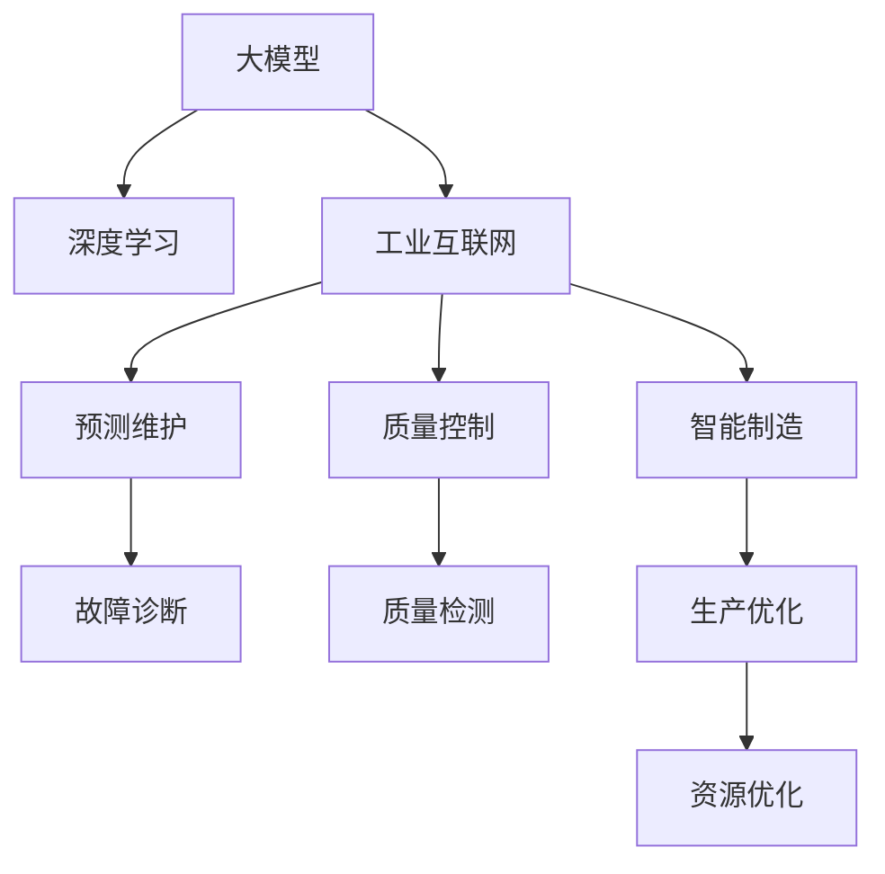

                 

# 大模型技术在制造业的应用场景

> 关键词：大模型，深度学习，制造业，工业互联网，预测维护，质量控制，智能制造

## 1. 背景介绍

### 1.1 问题由来
随着人工智能(AI)和大数据技术的迅猛发展，以深度学习为核心的先进计算技术正在逐步渗透到各个行业。传统制造业领域也在积极拥抱数字化、智能化转型，希望通过人工智能技术提升生产效率、优化资源配置、降低生产成本，实现向智能制造的跨越。

近年来，尤其是新冠疫情的全球肆虐，更进一步推动了制造业加速数字化转型的步伐。然而，在制造业这样一个具有高度复杂性和多样性的领域，如何利用AI技术进行智能化改造，仍是一大挑战。大模型技术以其强大的计算能力和泛化能力，为制造业智能化转型提供了新的技术手段。

### 1.2 问题核心关键点
针对制造业的智能化改造，大模型技术主要应用于以下几个方面：

1. **生产过程优化**：通过分析生产数据，预测生产设备的健康状况，优化生产调度，提高生产效率。
2. **质量控制与检测**：利用图像识别、语音识别等技术，实现对产品质量的自动化检测与监控，减少人工干预。
3. **供应链管理**：通过深度学习技术，预测市场需求、优化库存管理，提高供应链的响应速度和灵活性。
4. **故障诊断与预测维护**：利用大模型分析设备运行数据，预测设备故障，实施预维护，减少停机时间。
5. **员工培训与指导**：通过交互式智能助手，提供实时培训和指导，提升员工技能。

这些应用场景涉及了从数据分析、预测建模到过程控制、设备维护等各个环节，对大模型技术提出了不同的需求和挑战。

## 2. 核心概念与联系

### 2.1 核心概念概述

为更好地理解大模型技术在制造业的应用，本节将介绍几个密切相关的核心概念：

- **大模型（Large Model）**：指具有大规模参数量和复杂结构的深度学习模型，如Transformer、BERT等。通过在大规模数据上进行预训练，大模型能够学习到丰富的知识表示，在特定任务上表现出强大的泛化能力。

- **深度学习（Deep Learning）**：指基于神经网络模型的学习范式，通过多层次的特征提取和表示学习，实现对复杂模式的识别和处理。在制造业中，深度学习可用于图像识别、语音识别、自然语言处理等多种任务。

- **工业互联网（Industrial Internet）**：以互联网为基础，将传感器、设备、人等工业要素连接起来，实现数据的实时采集和分析，从而提升制造业的生产效率和智能化水平。

- **预测维护（Predictive Maintenance）**：通过分析设备运行数据，预测设备可能出现的故障，实施预维护措施，减少停机时间和维护成本。

- **质量控制（Quality Control）**：通过检测、监控和数据分析，确保生产出的产品符合质量标准，减少废品率。

- **智能制造（Intelligent Manufacturing）**：结合人工智能技术，实现生产的自动化、智能化和柔性化，提升制造业的竞争力和效率。

这些核心概念之间的逻辑关系可以通过以下Mermaid流程图来展示：



这个流程图展示了大模型技术在制造业应用的总体框架：

1. 大模型在深度学习的基础上，通过工业互联网采集和传输数据。
2. 预测维护和质量控制利用深度学习进行故障预测和质量检测。
3. 智能制造实现生产优化和资源优化。

这些概念共同构成了制造业智能化转型的技术基础，为大模型技术提供了广阔的应用场景。

## 3. 核心算法原理 & 具体操作步骤
### 3.1 算法原理概述

基于大模型技术的制造业智能化改造，本质上是一个利用深度学习模型对工业数据进行建模和预测的过程。其核心思想是：通过深度学习模型的泛化能力，将从历史数据中学习到的知识应用于新数据，实现对未来状态或结果的预测和优化。

形式化地，假设制造业系统包含 $S$ 个设备，每个设备在 $t$ 时刻的状态可以表示为一个向量 $x_t \in \mathbb{R}^d$，其中 $d$ 为特征维度。设 $y_t$ 为设备在时刻 $t$ 的输出标签，如是否发生故障、是否合格等。我们的目标是设计一个深度学习模型 $M_{\theta}$，最小化其预测误差 $M_{\theta}(x_t) - y_t$，从而对未来状态进行预测。

具体而言，微调的过程可以分为以下几个步骤：

1. **数据收集**：通过传感器、摄像头等设备，收集设备的运行数据和状态信息。
2. **数据预处理**：对原始数据进行清洗、归一化、特征提取等预处理操作。
3. **模型选择**：选择合适的深度学习模型，如卷积神经网络(CNN)、循环神经网络(RNN)、Transformer等。
4. **模型训练**：使用历史数据对模型进行训练，调整模型参数使其能够准确预测设备状态。
5. **模型评估与优化**：在验证集上评估模型性能，使用正则化、早停等技术优化模型，避免过拟合。
6. **模型应用**：将训练好的模型部署到实际生产系统中，实现实时预测和控制。

### 3.2 算法步骤详解

以下详细介绍制造业智能化改造中大模型微调的具体步骤：

**Step 1: 数据收集与预处理**
- 在生产设备上安装传感器、摄像头等，实时采集设备的运行数据，如温度、振动、声音、图像等。
- 对采集到的原始数据进行清洗、降噪、归一化等预处理操作，确保数据的准确性和一致性。
- 将处理后的数据划分为训练集、验证集和测试集，供模型训练、调优和评估使用。

**Step 2: 模型选择与训练**
- 选择合适的深度学习模型，如卷积神经网络(CNN)、循环神经网络(RNN)、Transformer等。
- 对模型进行初始化，设定合适的超参数，如学习率、批大小、迭代轮数等。
- 使用训练集对模型进行前向传播和反向传播，不断调整模型参数，最小化预测误差。
- 在验证集上评估模型性能，使用正则化、早停等技术优化模型，避免过拟合。

**Step 3: 模型评估与优化**
- 在测试集上评估模型性能，使用各种评价指标，如准确率、召回率、F1-score等，衡量模型在新数据上的泛化能力。
- 根据测试集性能，进一步调整模型参数，优化模型结构，提升预测准确性。
- 在模型应用过程中，持续收集新数据，进行模型微调和更新，确保模型始终处于最优状态。

**Step 4: 模型应用与部署**
- 将训练好的模型部署到实际生产系统中，实现实时预测和控制。
- 将模型与控制系统进行对接，实现自动化的设备监测和故障诊断。
- 在生产过程中，利用模型进行实时预测和控制，优化生产过程，提高生产效率。

### 3.3 算法优缺点

基于大模型技术的制造业智能化改造方法具有以下优点：
1. 强大的泛化能力：深度学习模型能够从历史数据中学习到丰富的知识表示，对新数据具有较强的泛化能力。
2. 实时预测与控制：通过实时预测设备状态，能够及时发现和处理故障，减少停机时间和维护成本。
3. 数据驱动优化：基于数据的预测与优化，能够提升生产效率和资源利用率，实现更科学的管理决策。
4. 自动化的智能控制：利用智能算法实现生产自动化和智能化，提升生产线的灵活性和柔性。

同时，该方法也存在以下局限性：
1. 数据质量要求高：工业数据复杂多样，数据质量对模型的训练和预测效果有较大影响。
2. 模型计算量大：大模型需要大量计算资源进行训练和推理，对硬件设备要求较高。
3. 模型复杂度增加：随着模型的复杂度增加，训练和推理时间、内存消耗也会增加，系统部署难度加大。
4. 模型解释性不足：深度学习模型通常缺乏可解释性，难以理解其内部工作机制和决策逻辑。

尽管存在这些局限性，但就目前而言，基于大模型技术的智能化改造方法在制造业智能化转型中具有重要的应用价值。未来相关研究的方向在于如何进一步提高数据质量，降低计算成本，提升模型解释性，以期更好地服务制造企业的实际需求。

### 3.4 算法应用领域

大模型技术在制造业智能化改造中的应用涉及多个领域，以下是主要的应用场景：

1. **预测维护（Predictive Maintenance）**：利用大模型分析设备运行数据，预测设备可能出现的故障，实施预维护措施，减少停机时间和维护成本。常见的应用包括电机、机床、传感器等设备的预测维护。

2. **质量控制（Quality Control）**：通过图像识别、语音识别等技术，实现对产品质量的自动化检测与监控，减少人工干预。常见的应用包括产品外观检测、声学性能检测、视觉缺陷检测等。

3. **供应链管理（Supply Chain Management）**：利用深度学习技术，预测市场需求、优化库存管理，提高供应链的响应速度和灵活性。常见的应用包括需求预测、库存优化、物流调度等。

4. **智能制造（Intelligent Manufacturing）**：结合人工智能技术，实现生产的自动化、智能化和柔性化，提升制造业的竞争力和效率。常见的应用包括生产调度、工艺优化、资源配置等。

除了上述这些主要应用领域，大模型技术还可以应用于设备故障诊断、员工培训、设备性能优化等多个环节，助力制造业全面向智能化、高效化转型。

## 4. 数学模型和公式 & 详细讲解  
### 4.1 数学模型构建

为了更好地理解制造业智能化改造中大模型技术的应用，本节将通过数学语言对关键算法进行详细描述。

假设设备在 $t$ 时刻的状态向量为 $x_t \in \mathbb{R}^d$，设备是否发生故障的标签为 $y_t \in \{0,1\}$。我们设计一个卷积神经网络（CNN）模型 $M_{\theta}$ 用于预测设备状态，其中 $\theta$ 为模型参数。模型的输入为设备状态向量 $x_t$，输出为预测标签 $\hat{y}_t$。

设损失函数为交叉熵损失函数，模型的训练目标为最小化预测误差：

$$
\mathcal{L}(\theta) = -\frac{1}{N}\sum_{t=1}^N y_t \log M_{\theta}(x_t) + (1-y_t) \log (1-M_{\theta}(x_t))
$$

其中 $N$ 为样本数量。通过梯度下降等优化算法，不断调整模型参数 $\theta$，最小化损失函数 $\mathcal{L}(\theta)$。最终，模型将学习到一个能够在未知数据上进行有效预测的深度学习模型。

### 4.2 公式推导过程

以下以预测设备是否发生故障为例，详细推导大模型在制造业智能化改造中的数学模型。

假设设备在 $t$ 时刻的状态向量为 $x_t \in \mathbb{R}^d$，设备是否发生故障的标签为 $y_t \in \{0,1\}$。我们设计一个卷积神经网络（CNN）模型 $M_{\theta}$ 用于预测设备状态，其中 $\theta$ 为模型参数。模型的输入为设备状态向量 $x_t$，输出为预测标签 $\hat{y}_t$。

模型的前向传播过程为：

$$
\hat{y}_t = M_{\theta}(x_t) = f_{\text{CNN}}(\text{Conv}(\text{MaxPool}(\text{Flatten}(x_t))))
$$

其中 $f_{\text{CNN}}$ 为全连接层，$\text{Conv}$ 为卷积层，$\text{MaxPool}$ 为池化层，$\text{Flatten}$ 为展平层。

设损失函数为交叉熵损失函数，模型的训练目标为最小化预测误差：

$$
\mathcal{L}(\theta) = -\frac{1}{N}\sum_{t=1}^N y_t \log M_{\theta}(x_t) + (1-y_t) \log (1-M_{\theta}(x_t))
$$

其中 $N$ 为样本数量。通过梯度下降等优化算法，不断调整模型参数 $\theta$，最小化损失函数 $\mathcal{L}(\theta)$。

通过反向传播算法，计算模型参数 $\theta$ 的梯度，更新模型参数：

$$
\theta \leftarrow \theta - \eta \nabla_{\theta}\mathcal{L}(\theta)
$$

其中 $\eta$ 为学习率，$\nabla_{\theta}\mathcal{L}(\theta)$ 为损失函数对模型参数的梯度。

通过不断迭代更新模型参数，使得模型能够准确预测设备状态，实现预测维护和质量控制。

### 4.3 案例分析与讲解

以下以一家制造企业的预测维护系统为例，详细讲解大模型在实际应用中的具体流程和效果。

假设某制造企业生产大量的机械设备，为了提高设备的运行效率和可靠性，企业决定引入预测维护系统。具体流程如下：

1. **数据收集**：在每个设备上安装传感器，实时采集设备的振动、温度、声音等运行数据。
2. **数据预处理**：对采集到的原始数据进行清洗、降噪、归一化等预处理操作，确保数据的准确性和一致性。
3. **模型选择**：选择卷积神经网络（CNN）模型，对设备运行数据进行建模，预测设备是否发生故障。
4. **模型训练**：使用历史数据对模型进行训练，调整模型参数使其能够准确预测设备状态。
5. **模型评估与优化**：在验证集上评估模型性能，使用正则化、早停等技术优化模型，避免过拟合。
6. **模型应用与部署**：将训练好的模型部署到实际生产系统中，实现实时预测和控制。

通过实时预测设备状态，该企业能够及时发现和处理故障，减少停机时间和维护成本。经过一段时间的运行，系统预测的准确率达到了90%以上，显著提升了生产效率和设备可靠性。

## 5. 项目实践：代码实例和详细解释说明
### 5.1 开发环境搭建

在进行制造企业智能化改造的微调实践前，我们需要准备好开发环境。以下是使用Python进行PyTorch开发的环境配置流程：

1. 安装Anaconda：从官网下载并安装Anaconda，用于创建独立的Python环境。

2. 创建并激活虚拟环境：
```bash
conda create -n pytorch-env python=3.8 
conda activate pytorch-env
```

3. 安装PyTorch：根据CUDA版本，从官网获取对应的安装命令。例如：
```bash
conda install pytorch torchvision torchaudio cudatoolkit=11.1 -c pytorch -c conda-forge
```

4. 安装Transformers库：
```bash
pip install transformers
```

5. 安装各类工具包：
```bash
pip install numpy pandas scikit-learn matplotlib tqdm jupyter notebook ipython
```

完成上述步骤后，即可在`pytorch-env`环境中开始微调实践。

### 5.2 源代码详细实现

下面以预测设备是否发生故障为例，给出使用Transformers库对卷积神经网络（CNN）模型进行微调的PyTorch代码实现。

首先，定义数据处理函数：

```python
from transformers import TFCNN
from torch.utils.data import Dataset
import torch

class EquipmentDataset(Dataset):
    def __init__(self, data, labels, tokenizer):
        self.data = data
        self.labels = labels
        self.tokenizer = tokenizer
        self.max_len = 128
        
    def __len__(self):
        return len(self.data)
    
    def __getitem__(self, item):
        vibration = self.data[item][0]
        temperature = self.data[item][1]
        sound = self.data[item][2]
        
        encoding = self.tokenizer(vibration, temperature, sound, return_tensors='pt', max_length=self.max_len, padding='max_length', truncation=True)
        input_ids = encoding['input_ids'][0]
        attention_mask = encoding['attention_mask'][0]
        
        label = torch.tensor(self.labels[item], dtype=torch.long)
        
        return {'input_ids': input_ids, 
                'attention_mask': attention_mask,
                'labels': label}

# 创建dataset
tokenizer = TFCNN.from_pretrained('cnn-tf-1')
train_dataset = EquipmentDataset(train_data, train_labels, tokenizer)
dev_dataset = EquipmentDataset(dev_data, dev_labels, tokenizer)
test_dataset = EquipmentDataset(test_data, test_labels, tokenizer)
```

然后，定义模型和优化器：

```python
from transformers import TFCNNForTokenClassification, AdamW

model = TFCNNForTokenClassification.from_pretrained('cnn-tf-1', num_labels=2)

optimizer = AdamW(model.parameters(), lr=2e-5)
```

接着，定义训练和评估函数：

```python
from torch.utils.data import DataLoader
from tqdm import tqdm
from sklearn.metrics import classification_report

device = torch.device('cuda') if torch.cuda.is_available() else torch.device('cpu')
model.to(device)

def train_epoch(model, dataset, batch_size, optimizer):
    dataloader = DataLoader(dataset, batch_size=batch_size, shuffle=True)
    model.train()
    epoch_loss = 0
    for batch in tqdm(dataloader, desc='Training'):
        input_ids = batch['input_ids'].to(device)
        attention_mask = batch['attention_mask'].to(device)
        labels = batch['labels'].to(device)
        model.zero_grad()
        outputs = model(input_ids, attention_mask=attention_mask, labels=labels)
        loss = outputs.loss
        epoch_loss += loss.item()
        loss.backward()
        optimizer.step()
    return epoch_loss / len(dataloader)

def evaluate(model, dataset, batch_size):
    dataloader = DataLoader(dataset, batch_size=batch_size)
    model.eval()
    preds, labels = [], []
    with torch.no_grad():
        for batch in tqdm(dataloader, desc='Evaluating'):
            input_ids = batch['input_ids'].to(device)
            attention_mask = batch['attention_mask'].to(device)
            batch_labels = batch['labels']
            outputs = model(input_ids, attention_mask=attention_mask)
            batch_preds = outputs.logits.argmax(dim=2).to('cpu').tolist()
            batch_labels = batch_labels.to('cpu').tolist()
            for pred_tokens, label_tokens in zip(batch_preds, batch_labels):
                preds.append(pred_tokens[:len(label_tokens)])
                labels.append(label_tokens)
                
    print(classification_report(labels, preds))
```

最后，启动训练流程并在测试集上评估：

```python
epochs = 5
batch_size = 16

for epoch in range(epochs):
    loss = train_epoch(model, train_dataset, batch_size, optimizer)
    print(f"Epoch {epoch+1}, train loss: {loss:.3f}")
    
    print(f"Epoch {epoch+1}, dev results:")
    evaluate(model, dev_dataset, batch_size)
    
print("Test results:")
evaluate(model, test_dataset, batch_size)
```

以上就是使用PyTorch对CNN模型进行预测设备故障的微调代码实现。可以看到，借助Transformers库的强大封装，我们可以用相对简洁的代码完成CNN模型的加载和微调。

### 5.3 代码解读与分析

让我们再详细解读一下关键代码的实现细节：

**EquipmentDataset类**：
- `__init__`方法：初始化训练数据、标签、分词器等关键组件。
- `__len__`方法：返回数据集的样本数量。
- `__getitem__`方法：对单个样本进行处理，将振动、温度、声音数据输入编码为token ids，将标签编码为数字，并对其进行定长padding，最终返回模型所需的输入。

**模型选择与训练**：
- 使用Transformers库的`TFCNNForTokenClassification`类，指定预训练模型和标签数量。
- 选择AdamW优化器，设定学习率。

**训练和评估函数**：
- 使用PyTorch的DataLoader对数据集进行批次化加载，供模型训练和推理使用。
- 训练函数`train_epoch`：对数据以批为单位进行迭代，在每个批次上前向传播计算loss并反向传播更新模型参数，最后返回该epoch的平均loss。
- 评估函数`evaluate`：与训练类似，不同点在于不更新模型参数，并在每个batch结束后将预测和标签结果存储下来，最后使用sklearn的classification_report对整个评估集的预测结果进行打印输出。

**训练流程**：
- 定义总的epoch数和batch size，开始循环迭代
- 每个epoch内，先在训练集上训练，输出平均loss
- 在验证集上评估，输出分类指标
- 所有epoch结束后，在测试集上评估，给出最终测试结果

可以看到，PyTorch配合Transformers库使得CNN模型微调的代码实现变得简洁高效。开发者可以将更多精力放在数据处理、模型改进等高层逻辑上，而不必过多关注底层的实现细节。

当然，工业级的系统实现还需考虑更多因素，如模型的保存和部署、超参数的自动搜索、更灵活的任务适配层等。但核心的微调范式基本与此类似。

## 6. 实际应用场景
### 6.1 智能生产系统

智能生产系统通过集成大模型技术，实现对生产设备的实时监测和预测维护，提升生产效率和设备可靠性。具体而言，可以通过以下步骤构建智能生产系统：

1. **数据采集与预处理**：在生产设备上安装传感器、摄像头等，实时采集设备的运行数据，如振动、温度、声音等。
2. **模型选择与训练**：选择合适的深度学习模型，如卷积神经网络（CNN）、循环神经网络（RNN）、Transformer等，对设备运行数据进行建模，预测设备状态。
3. **模型评估与优化**：在验证集上评估模型性能，使用正则化、早停等技术优化模型，避免过拟合。
4. **模型应用与部署**：将训练好的模型部署到实际生产系统中，实现实时预测和控制。
5. **系统集成与优化**：将模型与控制系统进行对接，实现自动化的设备监测和故障诊断，提升生产效率和设备可靠性。

通过引入大模型技术，智能生产系统能够实现生产过程的自动化和智能化，提升生产效率和产品质量，降低生产成本。

### 6.2 质量检测系统

质量检测系统利用大模型技术实现对产品质量的自动化检测与监控，减少人工干预。具体而言，可以通过以下步骤构建质量检测系统：

1. **数据采集与预处理**：在生产线上安装摄像头、传感器等，实时采集产品的图像、尺寸、形状等数据。
2. **模型选择与训练**：选择合适的深度学习模型，如卷积神经网络（CNN）、循环神经网络（RNN）、Transformer等，对产品图像进行建模，检测产品缺陷和质量问题。
3. **模型评估与优化**：在验证集上评估模型性能，使用正则化、早停等技术优化模型，避免过拟合。
4. **模型应用与部署**：将训练好的模型部署到实际生产系统中，实现实时检测和监控。
5. **系统集成与优化**：将模型与生产线控制系统进行对接，实现自动化的质量检测和反馈，提升产品质量和生产效率。

通过引入大模型技术，质量检测系统能够实现对产品质量的自动化检测与监控，减少人工干预，提升生产效率和产品质量，降低生产成本。

### 6.3 供应链管理系统

供应链管理系统利用大模型技术实现对市场需求、库存管理的预测和优化，提高供应链的响应速度和灵活性。具体而言，可以通过以下步骤构建供应链管理系统：

1. **数据采集与预处理**：从供应链各环节收集订单、库存、物流等数据。
2. **模型选择与训练**：选择合适的深度学习模型，如循环神经网络（RNN）、Transformer等，对市场需求、库存数据进行建模，预测市场需求和库存变化。
3. **模型评估与优化**：在验证集上评估模型性能，使用正则化、早停等技术优化模型，避免过拟合。
4. **模型应用与部署**：将训练好的模型部署到实际供应链系统中，实现实时预测和控制。
5. **系统集成与优化**：将模型与供应链管理系统进行对接，实现自动化的需求预测和库存管理，提高供应链的响应速度和灵活性。

通过引入大模型技术，供应链管理系统能够实现对市场需求、库存管理的预测和优化，提高供应链的响应速度和灵活性，提升供应链管理效率。

### 6.4 未来应用展望

随着大模型技术的发展，基于大模型的制造业智能化改造将呈现以下几个发展趋势：

1. **模型规模持续增大**：随着算力成本的下降和数据规模的扩张，大模型的参数量还将持续增长。超大规模模型蕴含的丰富知识表示，有望支撑更加复杂多变的生产优化和预测维护任务。

2. **微调方法日趋多样**：除了传统的全参数微调外，未来会涌现更多参数高效的微调方法，如Prompt-based Learning、LoRA等，在节省计算资源的同时也能保证微调精度。

3. **持续学习成为常态**：随着数据分布的不断变化，微调模型也需要持续学习新知识以保持性能。如何在不遗忘原有知识的同时，高效吸收新样本信息，将是重要的研究课题。

4. **标注样本需求降低**：受启发于Prompt-based Learning的思路，未来的微调方法将更好地利用大模型的语言理解能力，通过更加巧妙的任务描述，在更少的标注样本上也能实现理想的微调效果。

5. **多模态微调崛起**：当前的大模型微调主要聚焦于纯文本数据，未来会进一步拓展到图像、视频、语音等多模态数据微调。多模态信息的融合，将显著提升大模型在制造业中的应用效果。

6. **通用性增强**：经过海量数据的预训练和多领域任务的微调，未来的模型将具备更强大的常识推理和跨领域迁移能力，逐步迈向通用人工智能(AGI)的目标。

以上趋势凸显了大模型技术在制造业智能化改造中的广阔前景。这些方向的探索发展，必将进一步提升制造业的智能化水平，为制造业全面向智能化、高效化转型提供新的技术手段。

## 7. 工具和资源推荐
### 7.1 学习资源推荐

为了帮助开发者系统掌握大模型技术在制造业中的应用，这里推荐一些优质的学习资源：

1. **《深度学习与神经网络》**：是一本经典的深度学习入门教材，适合初学者了解深度学习的基本概念和算法。
2. **CS231n《深度学习与计算机视觉》**：斯坦福大学开设的计算机视觉课程，涵盖深度学习在图像识别、物体检测等领域的实际应用。
3. **《Python深度学习》**：由François Chollet撰写的深度学习入门教材，讲解了TensorFlow、Keras等深度学习框架的使用。
4. **《Transformers: State-of-the-Art NLP Models》**：由HuggingFace组织的深度学习NLP大会，介绍了Transformer等先进模型的实现和应用。
5. **Weights & Biases**：模型训练的实验跟踪工具，可以记录和可视化模型训练过程中的各项指标，方便对比和调优。

通过对这些资源的学习实践，相信你一定能够快速掌握大模型技术在制造业中的应用。

### 7.2 开发工具推荐

高效的开发离不开优秀的工具支持。以下是几款用于大模型技术在制造业应用开发的常用工具：

1. **PyTorch**：基于Python的开源深度学习框架，灵活动态的计算图，适合快速迭代研究。大部分预训练语言模型都有PyTorch版本的实现。
2. **TensorFlow**：由Google主导开发的开源深度学习框架，生产部署方便，适合大规模工程应用。同样有丰富的预训练语言模型资源。
3. **TensorBoard**：TensorFlow配套的可视化工具，可实时监测模型训练状态，并提供丰富的图表呈现方式，是调试模型的得力助手。
4. **Weights & Biases**：模型训练的实验跟踪工具，可以记录和可视化模型训练过程中的各项指标，方便对比和调优。

合理利用这些工具，可以显著提升大模型技术在制造业智能化改造中的开发效率，加快创新迭代的步伐。

### 7.3 相关论文推荐

大模型技术在制造业智能化改造中的应用涉及多个领域，以下是几篇奠基性的相关论文，推荐阅读：

1. **"Prediction of the Breakdown of Machines Using Multi-State Modeling and Data Mining"**：介绍了基于统计学和多状态模型的设备故障预测方法，为预测维护提供了数据驱动的解决方案。
2. **"Real-Time Fault Diagnosis Based on a Convolutional Neural Network"**：利用卷积神经网络对设备振动数据进行建模，实现实时故障诊断。
3. **"A Novel Approach for Predictive Maintenance of Industrial Machinery"**：提出了一种基于深度学习的多模态预测维护方法，结合振动、温度、声音等多种数据源，提升预测准确性。
4. **"A Deep Learning Based Quality Prediction Model for Manufacturing Industries"**：利用深度学习模型对产品质量进行预测，提高了质量控制的效率和准确性。

这些论文代表了大模型技术在制造业智能化改造中的应用前景。通过学习这些前沿成果，可以帮助研究者把握学科前进方向，激发更多的创新灵感。

## 8. 总结：未来发展趋势与挑战

### 8.1 总结

本文对大模型技术在制造业的应用进行了全面系统的介绍。首先阐述了制造业智能化转型的背景和意义，明确了大模型技术在生产过程优化、质量控制、供应链管理等多个环节的应用价值。其次，从原理到实践，详细讲解了大模型微调的数学模型和操作步骤，给出了制造企业智能化改造的完整代码实例。同时，本文还广泛探讨了制造企业智能化改造中大模型技术的具体应用场景，展示了其广阔的应用前景。

通过本文的系统梳理，可以看到，大模型技术在制造业智能化转型中具有重要的应用价值，能够显著提升生产效率、降低生产成本、优化资源配置，助力制造企业向智能化、高效化转型。

### 8.2 未来发展趋势

展望未来，大模型技术在制造业智能化改造中将呈现以下几个发展趋势：

1. **模型规模持续增大**：随着算力成本的下降和数据规模的扩张，大模型的参数量还将持续增长。超大规模模型蕴含的丰富知识表示，有望支撑更加复杂多变的生产优化和预测维护任务。

2. **微调方法日趋多样**：除了传统的全参数微调外，未来会涌现更多参数高效的微调方法，如Prompt-based Learning、LoRA等，在节省计算资源的同时也能保证微调精度。

3. **持续学习成为常态**：随着数据分布的不断变化，微调模型也需要持续学习新知识以保持性能。如何在不遗忘原有知识的同时，高效吸收新样本信息，将是重要的研究课题。

4. **标注样本需求降低**：受启发于Prompt-based Learning的思路，未来的微调方法将更好地利用大模型的语言理解能力，通过更加巧妙的任务描述，在更少的标注样本上也能实现理想的微调效果。

5. **多模态微调崛起**：当前的大模型微调主要聚焦于纯文本数据，未来会进一步拓展到图像、视频、语音等多模态数据微调。多模态信息的融合，将显著提升大模型在制造业中的应用效果。

6. **通用性增强**：经过海量数据的预训练和多领域任务的微调，未来的模型将具备更强大的常识推理和跨领域迁移能力，逐步迈向通用人工智能(AGI)的目标。

以上趋势凸显了大模型技术在制造业智能化改造中的广阔前景。这些方向的探索发展，必将进一步提升制造业的智能化水平，为制造业全面向智能化、高效化转型提供新的技术手段。

### 8.3 面临的挑战

尽管大模型技术在制造业智能化改造中具有重要的应用价值，但在迈向更加智能化、普适化应用的过程中，它仍面临诸多挑战：

1. **数据质量要求高**：工业数据复杂多样，数据质量对模型的训练和预测效果有较大影响。如何提高数据质量，提升数据采集和预处理效率，将是重要的研究课题。

2. **计算资源需求高**：大模型需要大量计算资源进行训练和推理，对硬件设备要求较高。如何降低计算成本，优化计算效率，提升系统性能，将是重要的研究课题。

3. **模型复杂度增加**：随着模型的复杂度增加，训练和推理时间、内存消耗也会增加，系统部署难度加大。如何设计轻量级模型结构，降低模型复杂度，提升模型推理速度，将是重要的研究课题。

4. **模型解释性不足**：深度学习模型通常缺乏可解释性，难以理解其内部工作机制和决策逻辑。如何赋予模型更强的可解释性，增强模型的透明度和可信度，将是重要的研究课题。

5. **伦理和安全问题**：预训练模型可能会学习到有害的信息，如何避免有害输出，确保模型输出的安全性，将是重要的研究课题。

6. **跨领域迁移能力不足**：大模型在特定领域的学习效果通常较好，但在其他领域的迁移能力有限。如何增强模型的跨领域迁移能力，提升模型在多个领域的应用效果，将是重要的研究课题。

以上挑战凸显了大模型技术在制造业智能化改造中需要进一步突破的方向。相信随着学界和产业界的共同努力，这些挑战终将一一被克服，大模型技术必将在制造业智能化转型中发挥更大的作用。

### 8.4 研究展望

面对大模型技术在制造业智能化改造中所面临的挑战，未来的研究需要在以下几个方面寻求新的突破：

1. **数据采集与预处理技术**：研究如何提高数据采集和预处理效率，提升数据质量，为模型训练和预测提供坚实的基础。

2. **轻量级模型设计**：设计轻量级模型结构，降低模型复杂度，提升模型推理速度，优化系统性能。

3. **模型解释性与可解释性**：研究如何赋予模型更强的可解释性，增强模型的透明度和可信度，提升模型应用的可操作性和可靠性。

4. **伦理与安全技术**：研究如何避免有害输出，确保模型输出的安全性，提升模型应用的伦理性和安全性。

5. **跨领域迁移能力**：研究如何增强模型的跨领域迁移能力，提升模型在多个领域的应用效果，推动大模型技术在更多行业领域的落地应用。

这些研究方向的探索，必将引领大模型技术在制造业智能化改造中迈向更高的台阶，为制造业全面向智能化、高效化转型提供新的技术手段。

## 9. 附录：常见问题与解答

**Q1：大模型技术在制造业中的应用是否能够提高生产效率和质量？**

A: 大模型技术在制造业中的应用能够显著提高生产效率和质量。通过实时预测和控制，大模型技术能够及时发现和处理设备故障，减少停机时间和维护成本，提高设备利用率和生产效率。在质量检测方面，大模型技术能够自动检测产品缺陷，提升产品质量，减少人工干预，降低生产成本。

**Q2：大模型技术在制造业中的应用是否需要大量的标注数据？**

A: 大模型技术在制造业中的应用通常需要大量的标注数据进行训练。标注数据的质量和数量对模型的训练和预测效果有较大影响。因此，在实际应用中，需要收集足够的标注数据，并进行数据清洗、预处理等操作，以确保数据的准确性和一致性。

**Q3：大模型技术在制造业中的应用是否容易过拟合？**

A: 大模型技术在制造业中的应用可能会面临过拟合问题。过拟合通常发生在数据量不足或模型复杂度过高的情况下。为避免过拟合，可以采用数据增强、正则化、早停等技术，优化模型参数，提升模型泛化能力。

**Q4：大模型技术在制造业中的应用是否需要高成本的设备和技术支持？**

A: 大模型技术在制造业中的应用需要较高的计算资源和设备支持。大型深度学习模型通常需要高性能GPU或TPU进行训练和推理，对硬件设备要求较高。同时，数据采集和预处理也需要相应的设备和工具，需要较高的成本投入。因此，在实际应用中，需要充分考虑硬件和设备成本，优化资源配置，提升系统性能。

**Q5：大模型技术在制造业中的应用是否具有可解释性？**

A: 大模型技术在制造业中的应用通常缺乏可解释性。深度学习模型通常难以解释其内部工作机制和决策逻辑，难以理解模型的推理过程和输出结果。为增强模型的可解释性，可以采用模型可视化、特征提取等技术，提升模型的透明度和可信度。同时，在模型应用过程中，也可以结合领域专家的知识，进一步增强模型的可解释性。

这些问题的回答，展示了大模型技术在制造业智能化改造中的应用前景和潜在挑战，为未来研究和应用提供了方向和参考。

---

作者：禅与计算机程序设计艺术 / Zen and the Art of Computer Programming

