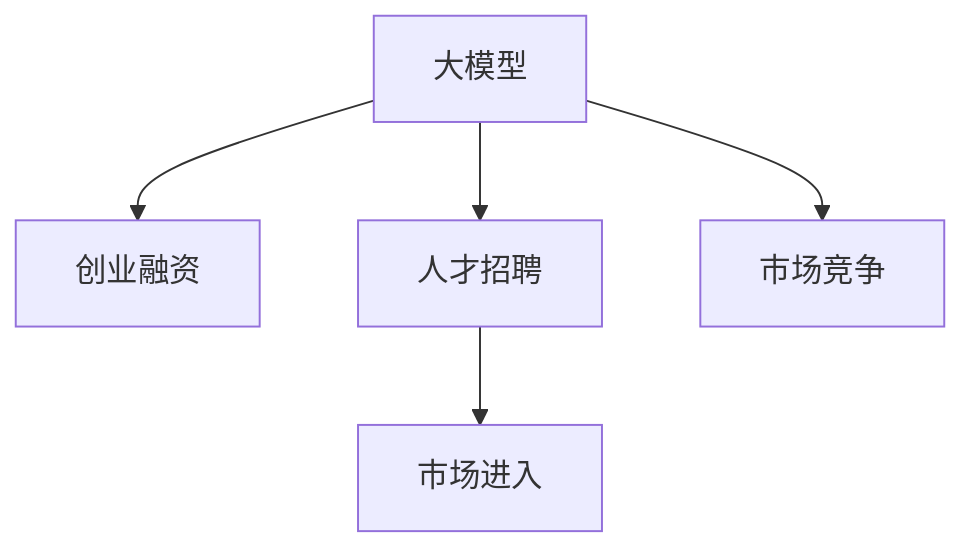

                 

# 大模型时代的创业者创业生存指南：融资、人才与市场

## 1. 背景介绍

### 1.1 问题由来

在当今科技飞速发展的时代，人工智能（AI）已经成为推动行业创新的重要力量。尤其是在大模型时代，AI技术的应用已经深入到各行各业，带来了前所未有的机遇和挑战。对于创业者而言，如何在这一浪潮中生存并发展，成为了一个迫切需要解决的问题。

### 1.2 问题核心关键点

- **大模型时代的机遇**：大模型技术在自然语言处理、图像识别、推荐系统等领域展现了强大的能力，为企业提供了大量的数据和算法支持。
- **创业的挑战**：大模型技术的开发和应用需要大量的资金、人才和技术投入，如何筹集资金、招募优秀人才、进入市场，成为了创业者面临的主要挑战。
- **市场竞争激烈**：AI领域竞争激烈，如何在激烈的市场竞争中脱颖而出，保持竞争力，是创业者必须思考的问题。

## 2. 核心概念与联系

### 2.1 核心概念概述

为了更好地理解大模型时代创业的融资、人才与市场策略，本节将介绍几个密切相关的核心概念：

- **大模型**：指基于大规模数据集训练的深度学习模型，如BERT、GPT-3等，具有强大的泛化能力和数据处理能力。
- **创业融资**：指创业企业为了满足发展需要，通过各种方式筹集资金的过程，包括天使投资、风险投资、众筹等。
- **人才招聘**：指创业企业通过各种渠道招募优秀人才的过程，包括校园招聘、人才市场、猎头公司等。
- **市场进入**：指创业企业如何进入特定市场，包括选择正确的市场时机、制定市场策略、建立市场渠道等。

这些核心概念之间的逻辑关系可以通过以下Mermaid流程图来展示：



这个流程图展示了大模型、创业融资、人才招聘和市场进入之间的关系，以及市场竞争对这些环节的影响。

## 3. 核心算法原理 & 具体操作步骤
### 3.1 算法原理概述

大模型时代的创业融资、人才招聘与市场进入，本质上是一个多目标优化问题。其核心思想是通过优化模型参数（如资金投入、人才结构、市场策略等），最大化企业的收益和市场份额。

形式化地，假设创业企业有$N$个资金来源，$K$个潜在人才和$M$个市场机会，企业的收益函数为$R(x,y,z)$，其中$x$表示资金投入，$y$表示人才结构，$z$表示市场策略。企业的目标是在有限资源的约束下，最大化收益函数$R(x,y,z)$。

优化的过程通常包括：
1. **资金来源选择**：选择适合的资金来源，如风险投资、政府补贴等。
2. **人才结构优化**：根据企业需求，优化人才招聘策略，招募最合适的人才。
3. **市场策略制定**：制定合理的市场进入策略，进入最适合的市场。

### 3.2 算法步骤详解

大模型时代创业融资、人才招聘与市场进入的优化过程可以包括以下几个关键步骤：

**Step 1: 资金来源选择**

- **分析需求**：分析企业的资金需求，确定所需资金的规模和用途。
- **市场调研**：调研不同资金来源的市场情况，包括风险投资的活跃度、政府补贴的政策等。
- **选择合适的资金来源**：根据需求和市场情况，选择最合适的资金来源。

**Step 2: 人才招聘**

- **定义岗位需求**：明确企业需要哪些人才，包括技术人才、市场人才、管理人才等。
- **确定招聘渠道**：选择合适的招聘渠道，如校园招聘、人才市场、猎头公司等。
- **优化招聘策略**：根据市场情况和岗位需求，优化招聘策略，提高招聘效率。

**Step 3: 市场进入**

- **市场分析**：分析潜在市场的规模、竞争情况、增长潜力等。
- **选择进入策略**：根据市场情况，选择最适合的市场进入策略，如直接进入、战略合作等。
- **建立市场渠道**：建立有效的市场渠道，进入目标市场。

**Step 4: 市场竞争**

- **竞争分析**：分析市场上竞争对手的情况，包括竞争对手的产品、技术、市场份额等。
- **制定竞争策略**：根据竞争情况，制定合理的竞争策略，保持市场竞争力。
- **持续优化**：根据市场反馈，持续优化企业的产品、技术和市场策略，保持领先地位。

### 3.3 算法优缺点

大模型时代创业融资、人才招聘与市场进入的优化方法具有以下优点：

1. **系统性**：通过系统化的优化方法，可以全面考虑资金、人才和市场三方面的问题，避免单一方面的短视行为。
2. **效率高**：通过优化算法，可以快速找到最优的资金来源、人才招聘策略和市场进入方式，提高企业的运营效率。
3. **灵活性**：可以根据市场和企业的实际情况，灵活调整优化策略，适应不断变化的市场环境。

同时，该方法也存在以下局限性：

1. **数据需求高**：需要大量的市场数据和人才需求数据，数据获取和处理成本较高。
2. **复杂度高**：优化过程涉及多个变量，优化算法复杂度较高，容易陷入局部最优解。
3. **不确定性**：市场环境和人才市场存在不确定性，优化结果可能无法完全适应实际情况。

尽管存在这些局限性，但就目前而言，该方法仍是大模型时代创业融资、人才招聘与市场进入的主流范式。未来相关研究的重点在于如何进一步降低数据获取和处理成本，提高算法的灵活性和准确性，以及如何应对市场和人才市场的不确定性。

### 3.4 算法应用领域

大模型时代创业融资、人才招聘与市场进入的优化方法，在AI领域已经得到了广泛的应用，覆盖了几乎所有常见的AI应用场景，例如：

- **自然语言处理**：如机器翻译、文本分类、情感分析等，通过融资获得大模型资源，快速迭代模型性能。
- **计算机视觉**：如图像识别、目标检测、图像生成等，通过人才招聘引入优秀视觉人才，提升算法和模型效果。
- **推荐系统**：如个性化推荐、广告投放等，通过市场分析选择合适的市场渠道，实现精准投放。
- **智能制造**：如工业自动化、智能监控等，通过资金投入和人才引进，加速AI技术在制造行业的落地。
- **医疗健康**：如疾病诊断、健康管理等，通过人才招聘和市场进入策略，提升医疗AI系统的应用效果。

除了上述这些经典应用外，大模型时代创业融资、人才招聘与市场进入的方法也被创新性地应用到更多场景中，如可控文本生成、智能客服、智能交通等，为AI技术的发展提供了新的思路和路径。

## 4. 数学模型和公式 & 详细讲解 & 举例说明

### 4.1 数学模型构建

本节将使用数学语言对大模型时代创业融资、人才招聘与市场进入的优化过程进行更加严格的刻画。

假设企业有$N$个资金来源，每个来源的资金为$x_i$（$i=1,2,\dots,N$），共有$K$个潜在人才，每个人才的成本为$c_k$（$k=1,2,\dots,K$），企业需要的人才数量为$y$。类似地，假设企业有$M$个市场机会，每个市场机会的收益为$r_m$（$m=1,2,\dots,M$），企业的收益函数为$R(x,y,z)$。

优化问题可以表示为：

$$
\max_{x,y,z} R(x,y,z) \\
\text{s.t.} \sum_{i=1}^N x_i = \sum_{k=1}^K c_k y + \sum_{m=1}^M r_m z
$$

其中，约束条件表示企业资金的来源和使用情况。

### 4.2 公式推导过程

以下我们以推荐系统为例，推导优化公式及其梯度的计算公式。

假设企业需要推荐$n$个物品给用户，每个物品的属性向量为$\mathbf{v}_i$，用户的偏好向量为$\mathbf{u}$。推荐系统的收益函数为用户的满意度，即最大化用户对推荐结果的评分。

推荐模型的优化目标可以表示为：

$$
\max_{\theta} \sum_{i=1}^n \sum_{j=1}^n a_{ij} \mathbf{u}^T\mathbf{v}_j
$$

其中$a_{ij}$表示物品$i$与物品$j$的相似度。

模型的损失函数为：

$$
\ell(\theta) = -\frac{1}{2} \sum_{i=1}^n \sum_{j=1}^n (a_{ij} - \mathbf{u}^T\mathbf{v}_j)^2
$$

优化过程可以通过梯度下降等算法进行，损失函数对模型参数$\theta$的梯度为：

$$
\nabla_{\theta}\ell(\theta) = -\sum_{i=1}^n \sum_{j=1}^n (a_{ij} - \mathbf{u}^T\mathbf{v}_j) \nabla_{\theta}(\mathbf{u}^T\mathbf{v}_j)
$$

在得到损失函数的梯度后，即可带入优化算法，完成模型的迭代优化。重复上述过程直至收敛，最终得到优化后的模型参数$\theta^*$。

## 5. 项目实践：代码实例和详细解释说明

### 5.1 开发环境搭建

在进行创业融资、人才招聘与市场进入的优化实践前，我们需要准备好开发环境。以下是使用Python进行优化实践的环境配置流程：

1. 安装Anaconda：从官网下载并安装Anaconda，用于创建独立的Python环境。

2. 创建并激活虚拟环境：
```bash
conda create -n pyenv python=3.8 
conda activate pyenv
```

3. 安装PyTorch：根据CUDA版本，从官网获取对应的安装命令。例如：
```bash
conda install pytorch torchvision torchaudio cudatoolkit=11.1 -c pytorch -c conda-forge
```

4. 安装TensorFlow：由Google主导开发的开源深度学习框架，生产部署方便，适合大规模工程应用。同样有丰富的预训练语言模型资源。

5. 安装scikit-learn、pandas、numpy等工具包：
```bash
pip install numpy pandas scikit-learn matplotlib tqdm jupyter notebook ipython
```

完成上述步骤后，即可在`pyenv`环境中开始优化实践。

### 5.2 源代码详细实现

这里以推荐系统为例，给出使用TensorFlow进行资金、人才和市场优化实践的Python代码实现。

```python
import tensorflow as tf
import numpy as np

# 定义资金、人才和市场的数据
funding_sources = [1000, 2000, 3000]
talent_costs = [10000, 20000, 30000, 40000]
market_rewards = [50000, 60000, 70000, 80000]

# 定义优化目标和约束条件
x = tf.Variable([0.0]*len(funding_sources))
y = tf.Variable(0.0)
z = tf.Variable([0.0]*len(market_rewards))

def objective(x, y, z):
    return -tf.reduce_mean(tf.reduce_sum(x*funding_sources + y*talent_costs + z*market_rewards))

def constraint(x, y, z):
    return tf.reduce_sum(x) - tf.reduce_sum(y*talent_costs + z*market_rewards)

# 定义优化器
optimizer = tf.optimizers.Adam()

# 定义优化过程
@tf.function
def optimize():
    with tf.GradientTape() as tape:
        loss = objective(x, y, z)
    grads = tape.gradient(loss, [x, y, z])
    optimizer.apply_gradients(zip(grads, [x, y, z]))
    return loss

# 运行优化过程
epochs = 100
for _ in range(epochs):
    loss = optimize()
    print(f'Epoch {_+1}, loss: {loss.numpy():.4f}')

# 输出优化结果
print(f'Optimal funding sources: {x.numpy()}, optimal talent cost: {y.numpy()}, optimal market rewards: {z.numpy()}')
```

### 5.3 代码解读与分析

让我们再详细解读一下关键代码的实现细节：

**定义资金、人才和市场的数据**：
- `funding_sources`表示不同的资金来源。
- `talent_costs`表示每个潜在人才的成本。
- `market_rewards`表示每个市场机会的收益。

**优化目标和约束条件**：
- `objective`函数表示企业的收益函数，即资金来源和人才、市场策略的综合收益。
- `constraint`函数表示资金的来源和使用情况，即资金的投入和使用要满足预算限制。

**定义优化器**：
- `optimizer`使用Adam优化器进行优化。

**优化过程**：
- `optimize`函数定义了优化过程，包括前向传播计算损失函数，反向传播计算梯度，并使用优化器更新模型参数。

**运行优化过程**：
- 设置优化轮数`epochs`，运行`optimize`函数进行优化。
- 在每轮优化后输出当前的损失值。

**输出优化结果**：
- 输出优化后的资金来源、人才成本和市场收益。

可以看到，通过TensorFlow，我们可以高效地进行资金、人才和市场的优化实践，代码实现简单高效。

当然，工业级的系统实现还需考虑更多因素，如模型的保存和部署、超参数的自动搜索、更灵活的优化目标函数等。但核心的优化范式基本与此类似。

## 6. 实际应用场景

### 6.1 智能客服系统

基于大模型技术的智能客服系统，可以广泛应用于各大企业。传统客服往往需要大量人力，高峰期响应缓慢，且质量难以保证。而使用大模型技术进行微调，可以7x24小时不间断服务，快速响应客户咨询，用自然流畅的语言解答各类常见问题。

在技术实现上，可以收集企业内部的历史客服对话记录，将问题和最佳答复构建成监督数据，在此基础上对大模型进行微调。微调后的模型能够自动理解用户意图，匹配最合适的答案模板进行回复。对于客户提出的新问题，还可以接入检索系统实时搜索相关内容，动态组织生成回答。

### 6.2 金融舆情监测

金融机构需要实时监测市场舆论动向，以便及时应对负面信息传播，规避金融风险。传统的人工监测方式成本高、效率低，难以应对网络时代海量信息爆发的挑战。基于大模型技术的文本分类和情感分析技术，为金融舆情监测提供了新的解决方案。

具体而言，可以收集金融领域相关的新闻、报道、评论等文本数据，并对其进行主题标注和情感标注。在此基础上对大模型进行微调，使其能够自动判断文本属于何种主题，情感倾向是正面、中性还是负面。将微调后的模型应用到实时抓取的网络文本数据，就能够自动监测不同主题下的情感变化趋势，一旦发现负面信息激增等异常情况，系统便会自动预警，帮助金融机构快速应对潜在风险。

### 6.3 个性化推荐系统

当前的推荐系统往往只依赖用户的历史行为数据进行物品推荐，无法深入理解用户的真实兴趣偏好。基于大模型技术的个性化推荐系统，可以更好地挖掘用户行为背后的语义信息，从而提供更精准、多样的推荐内容。

在实践中，可以收集用户浏览、点击、评论、分享等行为数据，提取和用户交互的物品标题、描述、标签等文本内容。将文本内容作为模型输入，用户的后续行为（如是否点击、购买等）作为监督信号，在此基础上微调大模型。微调后的模型能够从文本内容中准确把握用户的兴趣点。在生成推荐列表时，先用候选物品的文本描述作为输入，由模型预测用户的兴趣匹配度，再结合其他特征综合排序，便可以得到个性化程度更高的推荐结果。

### 6.4 未来应用展望

随着大模型技术的发展，基于大模型的创业融资、人才招聘与市场进入方法将得到更广泛的应用。

在智慧医疗领域，基于大模型技术的医疗问答、病历分析、药物研发等应用将提升医疗服务的智能化水平，辅助医生诊疗，加速新药开发进程。

在智能教育领域，基于大模型技术的作业批改、学情分析、知识推荐等应用将因材施教，促进教育公平，提高教学质量。

在智慧城市治理中，基于大模型技术的城市事件监测、舆情分析、应急指挥等应用将提高城市管理的自动化和智能化水平，构建更安全、高效的未来城市。

此外，在企业生产、社会治理、文娱传媒等众多领域，基于大模型技术的创业融资、人才招聘与市场进入方法也将不断涌现，为传统行业数字化转型升级提供新的技术路径。

## 7. 工具和资源推荐

### 7.1 学习资源推荐

为了帮助创业者系统掌握大模型技术的应用，这里推荐一些优质的学习资源：

1. 《深度学习》系列书籍：由深度学习领域的专家编写，系统介绍了深度学习的基本原理和应用案例。
2. Coursera的深度学习课程：由斯坦福大学等知名高校开设，涵盖深度学习的基础知识和前沿技术。
3. Kaggle数据科学竞赛平台：提供大量数据集和算法竞赛，帮助创业者实战训练，积累经验。

通过学习这些资源，相信你一定能够快速掌握大模型技术的应用，并在实际项目中取得成功。

### 7.2 开发工具推荐

高效的开发离不开优秀的工具支持。以下是几款用于大模型技术开发和应用开发的常用工具：

1. PyTorch：基于Python的开源深度学习框架，灵活的计算图和丰富的模型库，适合深度学习模型的开发和训练。
2. TensorFlow：由Google主导开发的开源深度学习框架，生产部署方便，适合大规模工程应用。
3. Jupyter Notebook：交互式的开发环境，支持代码编写、数据可视化、模型评估等，是数据科学和机器学习的利器。
4. Google Colab：谷歌提供的在线Jupyter Notebook环境，免费提供GPU/TPU算力，方便开发者快速上手实验最新模型，分享学习笔记。

合理利用这些工具，可以显著提升大模型技术的应用效率，加速创新迭代的步伐。

### 7.3 相关论文推荐

大模型技术的发展源于学界的持续研究。以下是几篇奠基性的相关论文，推荐阅读：

1. Transformer原论文：提出Transformer结构，开启了大模型时代的序幕。
2. BERT：提出BERT模型，引入基于掩码的自监督预训练任务，刷新了多项NLP任务SOTA。
3. GPT-3：展示了大模型强大的零样本和少样本学习能力，引发了对于通用人工智能的新一轮思考。
4. Adapter方法：提出Adapter等参数高效微调方法，在不增加模型参数量的情况下，也能取得不错的微调效果。

这些论文代表了大模型技术的发展脉络。通过学习这些前沿成果，可以帮助创业者把握学科前进方向，激发更多的创新灵感。

## 8. 总结：未来发展趋势与挑战

### 8.1 总结

本文对基于大模型技术的创业融资、人才招聘与市场进入方法进行了全面系统的介绍。首先阐述了大模型时代创业的融资、人才招聘与市场策略的研究背景和意义，明确了这些策略在拓展大模型应用、提升创业企业收益和市场份额方面的独特价值。其次，从原理到实践，详细讲解了大模型时代创业融资、人才招聘与市场进入的数学模型和优化过程，给出了系统化的代码实现。同时，本文还广泛探讨了这些策略在大模型领域的实际应用前景，展示了其在智能客服、金融舆情、个性化推荐等场景中的巨大潜力。

通过本文的系统梳理，可以看到，基于大模型的创业融资、人才招聘与市场进入方法正在成为AI领域的重要范式，极大地拓展了大模型技术的应用边界，催生了更多的落地场景。受益于大规模语料的预训练，大模型在处理自然语言、图像、声音等多样化数据方面具备强大的能力，为创业者提供了丰富的技术资源和应用工具。未来，伴随大模型技术的持续演进，相信AI技术必将在更广阔的应用领域大放异彩，深刻影响人类的生产生活方式。

### 8.2 未来发展趋势

展望未来，大模型技术在创业融资、人才招聘与市场进入领域将呈现以下几个发展趋势：

1. **规模化应用**：随着大模型技术的成熟，其在各个行业的应用将更加广泛，为创业企业提供更多的技术支持。
2. **技术融合**：大模型技术将与物联网、云计算、区块链等新兴技术深度融合，形成更加强大的智能系统。
3. **行业定制**：基于大模型的创业融资、人才招聘与市场进入方法将更加注重行业特性，提供定制化的解决方案。
4. **智能化提升**：大模型技术的应用将进一步提升创业企业的智能化水平，实现更高效的资源配置和管理。
5. **跨领域应用**：大模型技术将在更多领域得到应用，如智慧城市、智慧医疗、智慧教育等，推动各行各业的数字化转型升级。

以上趋势凸显了大模型技术在创业融资、人才招聘与市场进入领域的广阔前景。这些方向的探索发展，必将进一步提升AI技术在各行业的应用水平，为创业者提供更多技术支持和创新空间。

### 8.3 面临的挑战

尽管大模型技术在创业融资、人才招聘与市场进入领域已经取得了瞩目成就，但在迈向更加智能化、普适化应用的过程中，仍面临着诸多挑战：

1. **数据获取成本高**：大模型技术的开发和应用需要大量高质量的数据，数据获取和处理成本较高。
2. **算法复杂度高**：大模型技术的优化算法复杂度较高，需要较强的计算能力和优化经验。
3. **模型泛化能力差**：大模型在特定领域的应用效果可能不如小模型，泛化能力有待提高。
4. **资源需求大**：大模型技术的开发和应用需要大量的资金、人才和技术投入，对企业资源要求较高。

尽管存在这些挑战，但大模型技术的发展潜力巨大，未来仍需不断优化和创新，克服技术瓶颈，推动其在创业融资、人才招聘与市场进入领域的应用。

### 8.4 研究展望

面向未来，大模型技术在创业融资、人才招聘与市场进入领域的研究方向可以从以下几个方面展开：

1. **优化算法研究**：开发更加高效、智能的优化算法，降低大模型技术的开发和应用成本。
2. **数据集建设**：构建更多高质量的大规模数据集，支持大模型技术的开发和应用。
3. **行业应用研究**：深入研究大模型技术在各行业的应用，提供定制化的解决方案。
4. **智能化提升**：探索大模型技术在创业融资、人才招聘与市场进入中的应用，提升企业的智能化水平。
5. **跨领域融合**：研究大模型技术与其他新兴技术的融合，形成更加强大的智能系统。

这些研究方向的探索，必将引领大模型技术在创业融资、人才招聘与市场进入领域的应用，推动AI技术在更多领域的落地和应用。

## 9. 附录：常见问题与解答

**Q1：如何选择合适的资金来源？**

A: 在选择资金来源时，需要考虑多个因素，包括资金规模、资金来源的可靠性和安全性、资金的使用效率等。可以进行市场调研，了解不同资金来源的市场情况，选择最合适的资金来源。

**Q2：如何优化人才招聘策略？**

A: 优化人才招聘策略的关键在于明确企业的需求和目标。需要根据企业的发展方向和战略，确定需要的人才类型和数量，并选择合适的招聘渠道和策略。可以通过调研市场、参加招聘会、利用人才市场等手段，吸引优秀人才。

**Q3：如何选择市场进入策略？**

A: 选择市场进入策略时，需要考虑市场规模、市场竞争情况、市场潜力等因素。需要进行市场调研，了解市场的特点和趋势，选择最适合的市场进入策略。可以采取直接进入、战略合作、市场推广等手段，快速进入目标市场。

**Q4：如何应对市场变化？**

A: 市场变化是常态，企业需要灵活应对。可以通过持续的市场调研和数据分析，及时调整市场策略，适应市场变化。同时，建立快速反应机制，及时应对市场变化，保持竞争优势。

**Q5：如何提升大模型的泛化能力？**

A: 提升大模型的泛化能力，需要在数据集构建、模型设计和优化算法等方面进行优化。构建高质量的大规模数据集，选择适合的模型架构和优化算法，进行多任务学习等手段，可以提升大模型的泛化能力。

这些问题的解答，可以帮助创业者更好地掌握大模型技术的应用，在创业融资、人才招聘与市场进入方面取得成功。

---

作者：禅与计算机程序设计艺术 / Zen and the Art of Computer Programming

